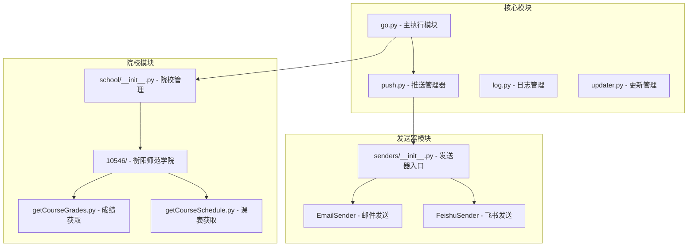
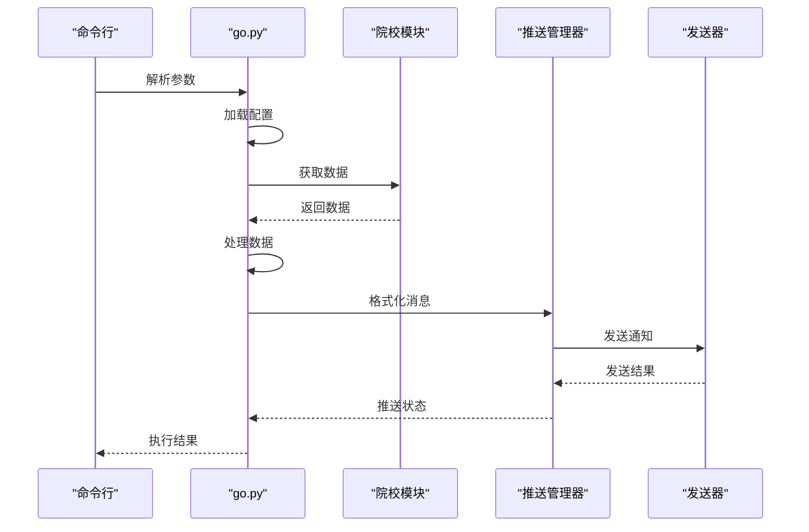
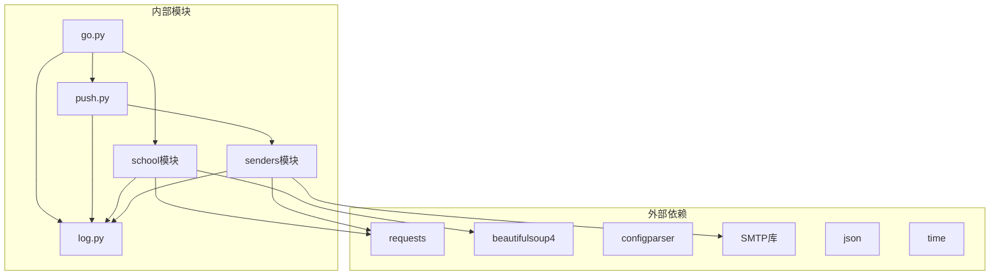

# API 参考文档

<cite>
**本文档引用的文件**
- [core/go.py](file://core/go.py)
- [core/push.py](file://core/push.py)
- [core/updater.py](file://core/updater.py)
- [core/school/__init__.py](file://core/school/__init__.py)
- [core/school/10546/__init__.py](file://core/school/10546/__init__.py)
- [core/school/10546/getCourseGrades.py](file://core/school/10546/getCourseGrades.py)
- [core/school/10546/getCourseSchedule.py](file://core/school/10546/getCourseSchedule.py)
- [core/senders/__init__.py](file://core/senders/__init__.py)
- [core/senders/email_sender.py](file://core/senders/email_sender.py)
- [core/senders/feishu_sender.py](file://core/senders/feishu_sender.py)
- [core/log.py](file://core/log.py)
- [README.md](file://README.md)
- [config.md](file://config.md)
- [developer_tools/EXTENSION_GUIDE.md](file://developer_tools/EXTENSION_GUIDE.md)
</cite>

## 目录
1. [简介](#简介)
2. [项目结构](#项目结构)
3. [核心组件](#核心组件)
4. [架构概览](#架构概览)
5. [详细组件分析](#详细组件分析)
6. [依赖关系分析](#依赖关系分析)
7. [性能考虑](#性能考虑)
8. [故障排除指南](#故障排除指南)
9. [结论](#结论)
10. [附录](#附录)

## 简介

Capture_Push 是一个课程成绩和课表自动追踪推送系统，能够自动获取学生课程成绩和课表信息，并通过邮件等方式推送更新通知。该项目采用模块化设计，支持多院校扩展和多种推送方式。

## 项目结构

项目采用清晰的模块化架构，主要分为以下几个核心模块：

**图表来源**
- [core/go.py](file://core/go.py#L1-L536)
- [core/push.py](file://core/push.py#L1-L319)
- [core/school/__init__.py](file://core/school/__init__.py#L1-L28)
- [core/senders/__init__.py](file://core/senders/__init__.py#L1-L10)

**章节来源**
- [README.md](file://README.md#L60-L83)

## 核心组件

### 主执行模块 (go.py)

主执行模块是整个系统的入口点，负责协调各个组件的工作流程。

**主要功能：**
- 配置文件管理
- 院校模块动态加载
- 成绩和课表获取与推送
- CLI 参数解析
- 状态文件管理

**关键接口：**

#### 配置管理接口
- `load_config()` - 加载配置文件
- `get_current_school_module()` - 获取当前院校模块

#### 成绩管理接口
- `fetch_and_push_grades(push=False, force_update=False, push_all=False)` - 获取并推送成绩
- `load_last_grades()` - 加载上次成绩状态
- `save_last_grades(grades_dict)` - 保存成绩状态
- `diff_grades(old, new)` - 比较成绩变化

#### 课表管理接口
- `fetch_and_push_today_schedule(force_update=False)` - 推送今日课表
- `fetch_and_push_tomorrow_schedule(force_update=False)` - 推送明日课表
- `fetch_and_push_next_week_schedule(force_update=False)` - 推送下周课表
- `load_manual_schedule()` - 加载手动课表
- `calc_week_and_weekday(first_monday)` - 计算周次和星期

#### CLI 接口
- `main()` - 主入口函数，支持多种命令行参数

**章节来源**
- [core/go.py](file://core/go.py#L42-L536)

### 推送管理器 (push.py)

推送管理器提供统一的通知发送接口，支持多种推送方式的动态注册和管理。

**主要组件：**

#### NotificationManager 类
- `__init__()` - 初始化通知管理器
- `register_sender(name, sender)` - 注册新的推送方式
- `get_sender(name)` - 获取指定推送方式
- `get_active_sender()` - 获取当前活跃的发送器
- `send_notification(sender_name, subject, content)` - 发送通知
- `send_with_active_sender(subject, content)` - 使用活跃发送器发送

#### 通知发送器接口
- `NotificationSender` - 抽象基类，定义 `send(subject, content)` 方法

#### 消息格式化函数
- `format_grade_changes(changed)` - 格式化成绩变化消息
- `format_all_grades(grades)` - 格式化全部成绩消息
- `format_schedule(courses, week, weekday, title)` - 格式化课表消息
- `format_full_schedule(courses, week_count)` - 格式化完整课表消息

#### 便捷发送函数
- `send_grade_mail(changed)` - 发送成绩变化通知
- `send_all_grades_mail(grades)` - 发送全部成绩通知
- `send_schedule_mail(courses, week, weekday)` - 发送明日课表通知
- `send_today_schedule_mail(courses, week, weekday)` - 发送今日课表通知
- `send_full_schedule_mail(courses, week_count)` - 发送完整课表通知

**章节来源**
- [core/push.py](file://core/push.py#L26-L319)

### 院校模块 (school)

院校模块采用模块化设计，支持多院校扩展，每个院校的抓取逻辑独立封装。

**主要组件：**

#### 院校管理接口
- `get_available_schools()` - 获取所有可用的院校列表
- `get_school_module(school_code)` - 获取指定院校的模块

#### 衡阳师范学院模块 (10546)
- `fetch_grades(username, password, force_update=False)` - 获取成绩数据
- `parse_grades(html)` - 解析成绩HTML
- `fetch_course_schedule(username, password, force_update=False)` - 获取课表数据
- `parse_schedule(html)` - 解析课表HTML

**章节来源**
- [core/school/__init__.py](file://core/school/__init__.py#L6-L28)
- [core/school/10546/__init__.py](file://core/school/10546/__init__.py#L1-L7)

### 发送器模块 (senders)

发送器模块提供各种消息发送的具体实现，支持动态注册和扩展。

**主要组件：**

#### EmailSender 类
- `send(subject, content)` - 发送邮件
- `load_mail_config()` - 加载邮件配置

#### FeishuSender 类
- `send(subject, content)` - 发送飞书消息
- `gen_sign(timestamp, secret)` - 生成签名校验

**章节来源**
- [core/senders/email_sender.py](file://core/senders/email_sender.py#L47-L144)
- [core/senders/feishu_sender.py](file://core/senders/feishu_sender.py#L42-L110)

### 日志管理 (log.py)

统一的日志管理系统，支持 AppData 目录的路径处理和日志文件管理。

**主要功能：**
- 配置文件路径管理
- 日志文件路径管理
- 日志打包功能
- 日志清理机制

**章节来源**
- [core/log.py](file://core/log.py#L18-L211)

## 架构概览

**图表来源**
- [core/go.py](file://core/go.py#L461-L536)
- [core/push.py](file://core/push.py#L127-L156)

## 详细组件分析

### 主执行模块 API 详细分析

#### 配置管理 API

**load_config()**
- 功能：加载配置文件
- 返回：ConfigParser 对象
- 异常：配置文件读取失败时抛出异常

**get_current_school_module()**
- 功能：根据配置获取当前院校模块
- 参数：无
- 返回：院校模块对象或 None
- 异常：模块加载失败时返回默认模块

#### 成绩管理 API

**fetch_and_push_grades(push=False, force_update=False, push_all=False)**
- 功能：获取并推送成绩
- 参数：
  - push: 是否推送成绩到邮箱
  - force_update: 是否强制从网络更新
  - push_all: 是否推送所有成绩
- 返回：无
- 异常：网络请求或解析失败时记录错误

**diff_grades(old, new)**
- 功能：比较新旧成绩差异
- 参数：
  - old: 旧成绩字典
  - new: 新成绩字典
- 返回：变化字典
- 异常：无

#### 课表管理 API

**fetch_and_push_today_schedule(force_update=False)**
- 功能：获取并推送今日课表
- 参数：force_update - 是否强制更新
- 返回：无
- 异常：配置缺失或网络请求失败

**fetch_and_push_tomorrow_schedule(force_update=False)**
- 功能：获取并推送明日课表
- 参数：force_update - 是否强制更新
- 返回：无
- 异常：配置缺失或网络请求失败

**fetch_and_push_next_week_schedule(force_update=False)**
- 功能：获取并推送下周全周课表
- 参数：force_update - 是否强制更新
- 返回：无
- 异常：配置缺失或网络请求失败

**章节来源**
- [core/go.py](file://core/go.py#L83-L459)

### 推送管理器 API 详细分析

#### NotificationManager 类 API

**register_sender(name, sender)**
- 功能：注册新的推送方式
- 参数：
  - name: 推送方式名称
  - sender: 发送器实例
- 返回：无
- 异常：注册失败时记录警告

**get_active_sender()**
- 功能：根据配置获取当前活跃的发送器
- 返回：元组 (sender_name, sender_instance) 或 (None, None)
- 异常：无

**send_with_active_sender(subject, content)**
- 功能：使用当前配置的活跃发送器发送通知
- 参数：subject - 主题, content - 内容
- 返回：bool 发送是否成功
- 异常：发送失败时返回 False

#### 消息格式化 API

**format_grade_changes(changed)**
- 功能：格式化成绩变化消息
- 参数：changed - 变化字典
- 返回：str 格式化后的消息
- 异常：无

**format_schedule(courses, week, weekday, title)**
- 功能：格式化课表消息
- 参数：
  - courses: 课程列表
  - week: 周数
  - weekday: 星期几
  - title: 标题前缀
- 返回：str 格式化后的消息
- 异常：无

**章节来源**
- [core/push.py](file://core/push.py#L74-L319)

### 院校模块 API 详细分析

#### 衡阳师范学院模块 API

**fetch_grades(username, password, force_update=False)**
- 功能：获取成绩数据
- 参数：
  - username: 学号
  - password: 密码
  - force_update: 是否强制更新
- 返回：list 成绩列表或 None
- 异常：登录失败或网络请求异常

**parse_grades(html)**
- 功能：解析成绩HTML
- 参数：html - HTML内容
- 返回：list 解析后的成绩列表
- 异常：解析失败返回空列表

**fetch_course_schedule(username, password, force_update=False)**
- 功能：获取课表数据
- 参数：
  - username: 学号
  - password: 密码
  - force_update: 是否强制更新
- 返回：list 课表列表或 None
- 异常：登录失败或网络请求异常

**parse_schedule(html)**
- 功能：解析课表HTML
- 参数：html - HTML内容
- 返回：list 解析后的课表列表
- 异常：解析失败返回空列表

**章节来源**
- [core/school/10546/getCourseGrades.py](file://core/school/10546/getCourseGrades.py#L278-L296)
- [core/school/10546/getCourseSchedule.py](file://core/school/10546/getCourseSchedule.py#L354-L372)

### 发送器模块 API 详细分析

#### EmailSender 类 API

**send(subject, content)**
- 功能：发送邮件
- 参数：
  - subject: 邮件主题
  - content: 邮件内容
- 返回：bool 发送是否成功
- 异常：
  - SMTPAuthenticationError: 认证失败
  - 其他SMTP异常: 连接或发送失败
  - Outlook/Hotmail邮箱: 不支持基本认证

**load_mail_config()**
- 功能：加载邮件配置
- 返回：ConfigParser 配置对象
- 异常：配置文件读取失败

#### FeishuSender 类 API

**send(subject, content)**
- 功能：发送飞书消息
- 参数：
  - subject: 消息主题
  - content: 消息内容
- 返回：bool 发送是否成功
- 异常：HTTP请求异常或响应错误

**gen_sign(timestamp, secret)**
- 功能：生成飞书签名校验
- 参数：
  - timestamp: 时间戳
  - secret: 密钥
- 返回：str 生成的签名
- 异常：无

**章节来源**
- [core/senders/email_sender.py](file://core/senders/email_sender.py#L47-L144)
- [core/senders/feishu_sender.py](file://core/senders/feishu_sender.py#L42-L110)

## 依赖关系分析

**图表来源**
- [core/go.py](file://core/go.py#L1-L25)
- [core/push.py](file://core/push.py#L1-L24)
- [core/school/10546/getCourseGrades.py](file://core/school/10546/getCourseGrades.py#L1-L12)
- [core/school/10546/getCourseSchedule.py](file://core/school/10546/getCourseSchedule.py#L1-L12)

**章节来源**
- [core/go.py](file://core/go.py#L1-L25)
- [core/push.py](file://core/push.py#L1-L24)

## 性能考虑

### 缓存策略
- **循环检测机制**：支持配置循环检测间隔，避免频繁网络请求
- **本地缓存**：成绩和课表数据缓存到 AppData 目录
- **时间戳管理**：使用时间戳控制缓存更新频率

### 网络优化
- **IPv4适配器**：强制使用IPv4连接，提高稳定性
- **超时控制**：所有网络请求设置超时时间
- **重试机制**：关键操作具备重试能力

### 内存管理
- **增量处理**：避免一次性加载大量数据
- **及时释放**：使用完的资源及时释放
- **日志轮转**：自动清理旧日志文件

## 故障排除指南

### 常见问题及解决方案

#### 邮件发送失败
**问题**：Outlook/Hotmail邮箱不支持基本认证
**解决方案**：
- 更换其他邮箱服务商（如QQ、163、Gmail）
- 为Office365账户启用两步验证并使用应用密码

#### 网络连接问题
**问题**：无法连接到学校服务器
**解决方案**：
- 检查网络连接和防火墙设置
- 确认学校服务器域名解析正常
- 尝试使用代理服务器

#### 配置文件问题
**问题**：配置文件缺失或格式错误
**解决方案**：
- 使用 `generate_config.py` 生成配置文件
- 检查配置文件格式和必填项
- 确认配置文件路径正确

#### 日志分析
**问题**：程序运行异常但无提示
**解决方案**：
- 查看 `%LOCALAPPDATA%\Capture_Push` 目录下的日志文件
- 使用 `--pack-logs` 参数打包日志用于问题上报
- 调整日志级别为 DEBUG 获取详细信息

**章节来源**
- [core/senders/email_sender.py](file://core/senders/email_sender.py#L78-L85)
- [core/log.py](file://core/log.py#L18-L58)

## 结论

Capture_Push 项目提供了完整的 API 接口，支持多院校扩展和多种推送方式。其模块化设计使得系统具有良好的可扩展性和维护性。通过统一的日志管理和配置机制，系统能够在不同环境下稳定运行。

对于第三方集成和二次开发，项目提供了清晰的扩展接口和详细的开发指南，开发者可以根据需要添加新的推送方式或支持新的院校模块。

## 附录

### 配置文件结构

**config.ini 主要配置节：**

| 配置节 | 作用 | 主要配置项 |
|--------|------|------------|
| `[logging]` | 日志级别配置 | `level` |
| `[run_model]` | 运行模式 | `model` (DEV/BUILD) |
| `[push]` | 推送方式配置 | `method` (none/email/test1/wechat/dingtalk/telegram) |
| `[email]` | 邮件推送配置 | `smtp`, `port`, `sender`, `receiver`, `auth` |
| `[test1]` | 测试推送配置 | 自定义参数 |

### 扩展开发指南

#### 添加新的推送方式
1. 在 `core/senders/` 目录创建新的发送器文件
2. 实现 `send(subject, content)` 方法
3. 在 `NotificationManager._register_available_senders()` 中注册
4. 更新配置文件和 GUI 界面

#### 添加新的院校模块
1. 在 `core/school/` 下创建新院校代码目录
2. 实现 `getCourseGrades.py` 和 `getCourseSchedule.py`
3. 在 `core/school/__init__.py` 中注册模块
4. 实现必要的数据解析逻辑

**章节来源**
- [config.md](file://config.md#L1-L52)
- [developer_tools/EXTENSION_GUIDE.md](file://developer_tools/EXTENSION_GUIDE.md#L1-L102)