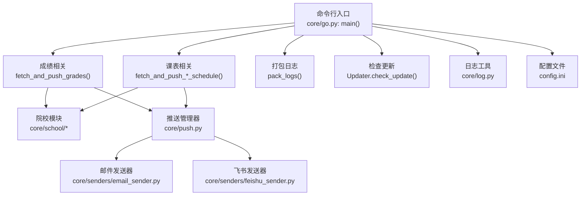
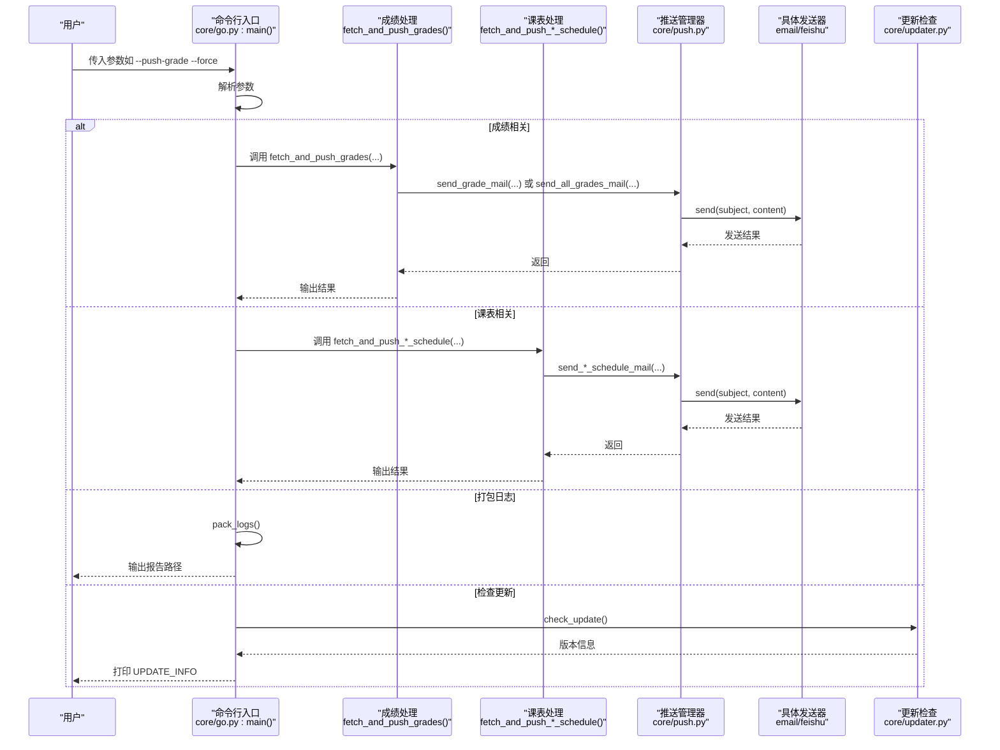
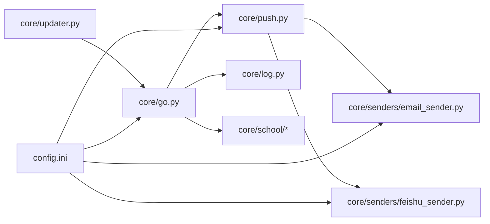

# 命令行接口 API

<cite>
**本文引用的文件**
- [core/go.py](file://core/go.py)
- [core/updater.py](file://core/updater.py)
- [core/push.py](file://core/push.py)
- [core/log.py](file://core/log.py)
- [core/school/__init__.py](file://core/school/__init__.py)
- [core/school/10546/__init__.py](file://core/school/10546/__init__.py)
- [core/senders/email_sender.py](file://core/senders/email_sender.py)
- [core/senders/feishu_sender.py](file://core/senders/feishu_sender.py)
- [config.ini](file://config.ini)
- [README.md](file://README.md)
</cite>

## 目录
1. [简介](#简介)
2. [项目结构](#项目结构)
3. [核心组件](#核心组件)
4. [架构总览](#架构总览)
5. [详细组件分析](#详细组件分析)
6. [依赖关系分析](#依赖关系分析)
7. [性能考量](#性能考量)
8. [故障排查指南](#故障排查指南)
9. [结论](#结论)
10. [附录](#附录)

## 简介
本文件为命令行接口 API 参考文档，聚焦 main 函数的命令行参数规范与行为说明，涵盖以下参数：
- --fetch-grade
- --push-grade
- --push-all-grades
- --fetch-schedule
- --push-schedule
- --push-today
- --push-tomorrow
- --push-next-week
- --pack-logs
- --check-update
- --force

文档还提供：
- 参数组合使用场景与互斥规则
- 返回值格式说明（特别是 UPDATE_INFO 格式）
- 完整命令行使用示例
- 自动化脚本集成建议
- 参数之间的依赖关系与错误处理策略

## 项目结构
命令行入口位于 core/go.py 的 main() 函数，负责解析参数并调度对应的功能模块；推送能力通过 core/push.py 的通知管理器与具体发送器实现；日志与配置路径统一由 core/log.py 提供；多院校支持通过 core/school/* 模块化实现。

图表来源
- [core/go.py](file://core/go.py#L461-L536)
- [core/push.py](file://core/push.py#L74-L163)
- [core/school/__init__.py](file://core/school/__init__.py#L22-L27)
- [core/senders/email_sender.py](file://core/senders/email_sender.py#L47-L144)
- [core/senders/feishu_sender.py](file://core/senders/feishu_sender.py#L42-L110)
- [core/log.py](file://core/log.py#L60-L82)
- [config.ini](file://config.ini#L1-L36)

章节来源
- [README.md](file://README.md#L60-L83)
- [core/go.py](file://core/go.py#L461-L536)

## 核心组件
- 命令行解析与调度：在 main() 中使用 argparse 定义各参数，解析后按需调用 fetch_and_push_* 与 pack_logs、check_update。
- 成绩处理：fetch_and_push_grades() 负责获取成绩、差异检测、推送控制与状态持久化。
- 课表处理：fetch_and_push_today_schedule()、fetch_and_push_tomorrow_schedule()、fetch_and_push_next_week_schedule() 分别处理今日、明日、下周全周课表。
- 推送管理：NotificationManager 统一注册与选择发送器（邮件、飞书），并按配置启用。
- 日志与配置：统一使用 AppData 目录的配置与日志路径，支持日志打包与清理。
- 更新检查：Updater 通过 GitHub Releases API 检查更新，返回版本信息并在命令行打印 UPDATE_INFO。

章节来源
- [core/go.py](file://core/go.py#L461-L536)
- [core/push.py](file://core/push.py#L74-L163)
- [core/log.py](file://core/log.py#L60-L82)
- [core/updater.py](file://core/updater.py#L42-L76)

## 架构总览
命令行参数与内部流程的交互如下：

图表来源
- [core/go.py](file://core/go.py#L461-L536)
- [core/push.py](file://core/push.py#L291-L318)
- [core/updater.py](file://core/updater.py#L42-L76)

## 详细组件分析

### 命令行参数规范与行为
- --fetch-grade
  - 行为：仅获取成绩，不推送。内部调用 fetch_and_push_grades(..., push=False)。
  - 适用场景：仅想查看是否有成绩更新，不触发推送。
  - 依赖：需要配置文件中的 account 节（school_code、username、password）。
  - 输出：若检测到变化，打印“✅ 成绩有更新”；否则“ℹ️ 成绩无变化”。

- --push-grade
  - 行为：获取并推送变化的成绩。内部调用 fetch_and_push_grades(..., push=True, push_all=False)。
  - 适用场景：仅推送有变化的成绩，避免冗余。
  - 依赖：需要配置文件中的 account 与 push.method。
  - 状态：使用 last_grades.json 记录上次成绩，差异检测后推送变化。

- --push-all-grades
  - 行为：获取并推送所有成绩，忽略变化检测。内部调用 fetch_and_push_grades(..., push=True, push_all=True)。
  - 适用场景：需要一次性发送全部成绩列表。
  - 依赖：同上。

- --fetch-schedule
  - 行为：仅获取课表，不推送。内部调用院校模块的 fetch_course_schedule(...)。
  - 适用场景：仅拉取课表数据以供后续分析或调试。
  - 依赖：需要配置文件中的 semester.first_monday 与 account。

- --push-schedule
  - 行为：兼容旧参数，等价于 --push-today。
  - 适用场景：历史脚本兼容。

- --push-today
  - 行为：获取并推送今日课表。内部调用 fetch_and_push_today_schedule(...)。
  - 依赖：需要 semester.first_monday；每日同一日期只推送一次（受状态文件保护）。
  - 手动覆盖：支持 manual_schedule.json 合并手动修改的课表，避免冲突覆盖。

- --push-tomorrow
  - 行为：获取并推送明日课表。内部调用 fetch_and_push_tomorrow_schedule(...)。
  - 依赖：同上；按日期去重。

- --push-next-week
  - 行为：获取并推送下周全周课表。内部调用 fetch_and_push_next_week_schedule(...)。
  - 依赖：同上；按周去重。

- --pack-logs
  - 行为：将 AppData/Capture_Push 下的日志文件打包为单个文本报告。
  - 输出：打印“✅ 崩溃报告已生成: ...”或“❌ 崩溃报告生成失败”。

- --check-update
  - 行为：检查 GitHub Releases 最新版本，打印版本信息与提示。
  - 返回值格式（UPDATE_INFO）：以 UPDATE_INFO: 前缀输出 JSON，包含字段：
    - version：最新版本号（若有更新）
    - has_update：布尔值，表示是否有更新
  - 示例输出：
    - 有更新：打印“发现新版本: X.Y.Z”，随后打印 UPDATE_INFO: {"version":"X.Y.Z","has_update":true}
    - 无更新：打印“当前已是最新版本”，随后打印 UPDATE_INFO: {"has_update":false}

- --force
  - 行为：强制从网络更新，忽略循环检测（如课表推送的按日/按周去重机制）。
  - 影响范围：影响 fetch_and_push_* 系列函数与 fetch_course_schedule 的 force_update 参数传递。

章节来源
- [core/go.py](file://core/go.py#L461-L536)
- [core/updater.py](file://core/updater.py#L42-L76)

### 参数组合与互斥规则
- 组合使用
  - --fetch-grade 与 --force：仅获取成绩，忽略循环检测。
  - --push-grade 与 --force：推送变化成绩，忽略循环检测。
  - --push-all-grades 与 --force：推送全部成绩，忽略循环检测。
  - --push-today/tomorrow/next-week 与 --force：强制推送，不按日期/周去重。
  - --pack-logs 与 --check-update：可与其他参数组合使用，但不会互相影响。

- 互斥规则
  - --push-grade 与 --push-all-grades 不能同时使用（同一调用链中二选一）。
  - --push-schedule 与 --push-today 实质等价，二者同时出现时仅执行一次（push-schedule 被视为 push-today 的兼容）。
  - --pack-logs 与 --check-update 与其它业务参数无直接互斥，但通常用于诊断与维护场景。

章节来源
- [core/go.py](file://core/go.py#L481-L506)

### 返回值格式说明（UPDATE_INFO）
- 结构
  - JSON 对象，包含以下字段：
    - has_update：布尔值，表示是否有更新
    - version（可选）：当 has_update 为 true 时，包含最新版本号
- 输出位置
  - 通过 print 输出，前缀为 UPDATE_INFO:，便于外部脚本解析。
- 示例
  - 有更新：UPDATE_INFO: {"version":"X.Y.Z","has_update":true}
  - 无更新：UPDATE_INFO: {"has_update":false}

章节来源
- [core/go.py](file://core/go.py#L514-L529)

### 依赖关系与数据流
- 配置依赖
  - 配置文件路径：AppData/Capture_Push/config.ini
  - 关键节与键：
    - [account]：school_code、username、password
    - [semester]：first_monday
    - [push]：method（none/email/feishu）
    - [email]/[feishu]：SMTP/webhook、端口、凭据等
- 院校模块
  - 通过 school_code 动态加载对应模块（如 10546），统一接口为 fetch_grades 与 fetch_course_schedule。
- 推送链路
  - 通过 NotificationManager 读取 [push].method，选择 EmailSender 或 FeishuSender 发送。
- 状态与去重
  - 成绩：last_grades.json 记录上次成绩映射，差异检测后推送。
  - 课表：按日期（today/tomorrow）或周（next_week）的状态文件去重，避免重复推送。

章节来源
- [config.ini](file://config.ini#L1-L36)
- [core/school/__init__.py](file://core/school/__init__.py#L22-L27)
- [core/school/10546/__init__.py](file://core/school/10546/__init__.py#L2-L3)
- [core/push.py](file://core/push.py#L26-L53)

## 依赖关系分析

图表来源
- [core/go.py](file://core/go.py#L15-L19)
- [core/push.py](file://core/push.py#L17-L23)
- [core/senders/email_sender.py](file://core/senders/email_sender.py#L12-L15)
- [core/senders/feishu_sender.py](file://core/senders/feishu_sender.py#L11-L14)
- [core/updater.py](file://core/updater.py#L26-L27)
- [config.ini](file://config.ini#L1-L36)

章节来源
- [core/go.py](file://core/go.py#L15-L19)
- [core/push.py](file://core/push.py#L17-L23)

## 性能考量
- 循环检测与去重
  - 成绩：仅在差异变化时推送，减少无效网络与发送。
  - 课表：按日期/周去重，避免重复推送。
- 网络请求
  - 通过 force 参数可强制刷新，但会增加网络与IO开销。
- 日志与磁盘
  - 日志轮转与清理，避免占用过多磁盘空间。
- 推送方式
  - 邮件与飞书发送器均进行必要的配置校验与异常处理，避免阻塞主流程。

[本节为通用指导，无需特定文件来源]

## 故障排查指南
- 配置文件缺失或路径异常
  - 症状：无法定位配置文件或日志目录。
  - 排查：确认 LOCALAPPDATA 环境变量存在，且 AppData/Capture_Push/config.ini 存在。
  - 参考：get_config_path()、get_log_file_path()。
- 邮件发送失败
  - 常见原因：Outlook/Hotmail 基本认证被禁用、应用密码未正确配置、SMTP 端口/加密方式不匹配。
  - 排查：检查 [email] 配置，确认端口与加密方式；必要时改用应用密码。
- 飞书发送失败
  - 常见原因：webhook_url 为空或签名错误。
  - 排查：检查 [feishu] 配置，确认 webhook_url 与 secret 设置。
- 课表推送未触发
  - 常见原因：未设置 semester.first_monday 或尚未到开学日期。
  - 排查：确认 first_monday 格式与日期有效性。
- 打包日志失败
  - 常见原因：日志目录不存在或权限不足。
  - 排查：确认 %LOCALAPPDATA%\Capture_Push 存在且可读。

章节来源
- [core/log.py](file://core/log.py#L60-L82)
- [core/senders/email_sender.py](file://core/senders/email_sender.py#L78-L91)
- [core/senders/feishu_sender.py](file://core/senders/feishu_sender.py#L52-L61)
- [core/go.py](file://core/go.py#L187-L190)

## 结论
命令行接口提供了灵活的批量与单项操作能力，结合循环检测与去重策略，既能满足日常自动化需求，又能在诊断与维护场景中提供便捷工具。通过 UPDATE_INFO 格式化的返回值，可轻松集成到自动化脚本中实现持续监控与更新。

[本节为总结性内容，无需特定文件来源]

## 附录

### 命令行使用示例
- 仅获取今日课表（不推送）
  - 示例：python core/go.py --fetch-schedule
- 推送今日课表（忽略循环检测）
  - 示例：python core/go.py --push-today --force
- 推送明日课表
  - 示例：python core/go.py --push-tomorrow
- 推送下周全周课表
  - 示例：python core/go.py --push-next-week
- 获取并推送变化成绩
  - 示例：python core/go.py --push-grade
- 获取并推送全部成绩
  - 示例：python core/go.py --push-all-grades
- 仅获取成绩（不推送）
  - 示例：python core/go.py --fetch-grade
- 打包日志（用于崩溃上报）
  - 示例：python core/go.py --pack-logs
- 检查更新并获取 UPDATE_INFO
  - 示例：python core/go.py --check-update

[本节为示例性内容，无需特定文件来源]

### 自动化脚本集成方案
- Windows 任务计划程序
  - 使用 powershell 或批处理调用命令行参数，结合 --force 与 --pack-logs 实现定时巡检与日志收集。
- Linux Cron
  - 使用 bash 脚本调用 python core/go.py，结合 --push-grade/--push-today 等参数实现定时推送。
- 外部监控脚本
  - 解析 UPDATE_INFO 的 JSON 输出，根据 has_update 决策是否触发后续动作（如通知管理员）。

[本节为通用实践建议，无需特定文件来源]