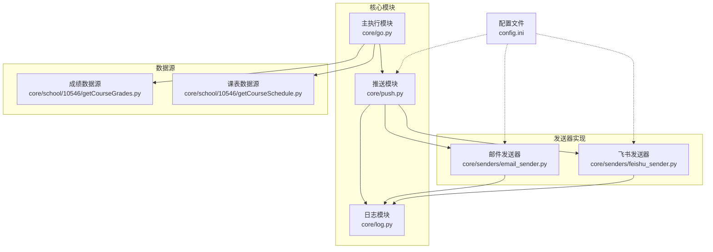
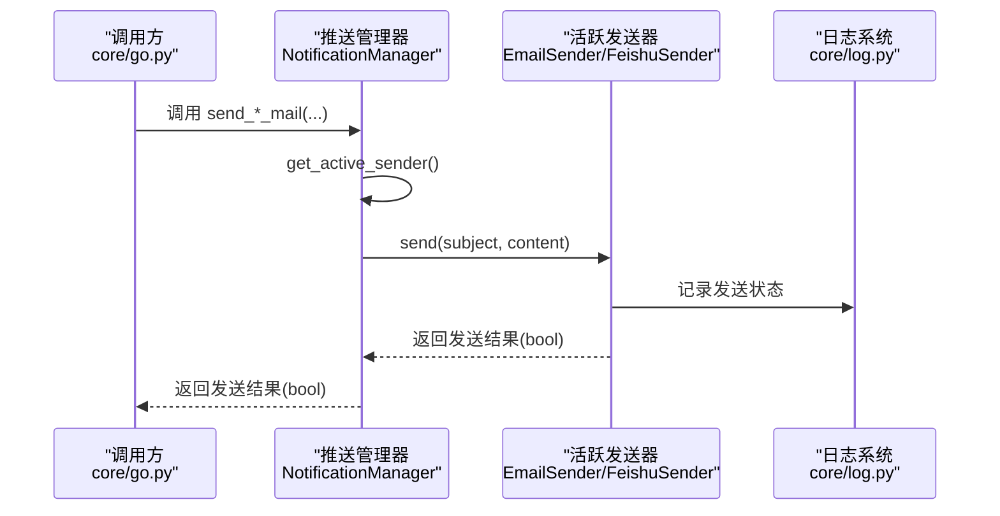
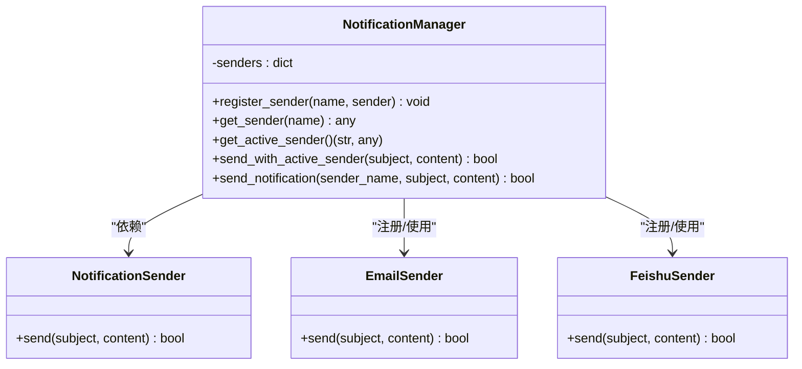
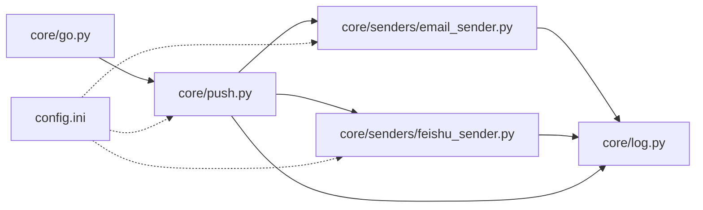

# 推送模块 API

<cite>
**本文引用的文件**
- [core/push.py](file://core/push.py)
- [core/senders/email_sender.py](file://core/senders/email_sender.py)
- [core/senders/feishu_sender.py](file://core/senders/feishu_sender.py)
- [core/go.py](file://core/go.py)
- [core/log.py](file://core/log.py)
- [config.ini](file://config.ini)
- [core/school/10546/getCourseGrades.py](file://core/school/10546/getCourseGrades.py)
- [core/school/10546/getCourseSchedule.py](file://core/school/10546/getCourseSchedule.py)
- [README.md](file://README.md)
</cite>

## 目录
1. [简介](#简介)
2. [项目结构](#项目结构)
3. [核心组件](#核心组件)
4. [架构总览](#架构总览)
5. [详细组件分析](#详细组件分析)
6. [依赖关系分析](#依赖关系分析)
7. [性能考虑](#性能考虑)
8. [故障排查指南](#故障排查指南)
9. [结论](#结论)
10. [附录](#附录)

## 简介
本文件为“推送模块 API”参考文档，聚焦于推送管理器中的发送函数接口与推送系统架构。重点涵盖以下函数：
- send_grade_mail：发送成绩变化通知
- send_schedule_mail：发送明日课表通知
- send_today_schedule_mail：发送今日课表通知
- send_full_schedule_mail：发送完整学期课表通知

文档将详细说明各函数的参数与返回值、错误处理机制、推送系统架构（多推送方式支持）、数据格式规范、使用示例，以及推送频率控制、重试与故障恢复策略的技术细节。

## 项目结构
推送模块位于 core/push.py，具体发送器实现位于 core/senders 目录，分别支持邮件与飞书两种推送方式；业务侧通过 core/go.py 调用推送函数；日志系统统一由 core/log.py 提供；配置文件 config.ini 控制推送方式与各发送器参数。

图表来源
- [core/push.py](file://core/push.py#L1-L319)
- [core/senders/email_sender.py](file://core/senders/email_sender.py#L1-L144)
- [core/senders/feishu_sender.py](file://core/senders/feishu_sender.py#L1-L110)
- [core/go.py](file://core/go.py#L1-L536)
- [core/log.py](file://core/log.py#L1-L211)
- [config.ini](file://config.ini#L1-L36)

章节来源
- [README.md](file://README.md#L60-L83)

## 核心组件
- 推送管理器 NotificationManager：负责注册与选择当前活跃的发送器，统一调度发送。
- 抽象发送器 NotificationSender：定义发送接口，便于扩展新的推送方式。
- 具体发送器：
  - EmailSender：基于 SMTP 的邮件发送。
  - FeishuSender：基于飞书 Webhook 的机器人消息发送。
- 便捷发送函数：封装常用场景的消息格式化与发送。
- 日志系统：统一日志初始化与输出，便于调试与排障。
- 配置系统：读取 config.ini 中的推送方式与发送器参数。

章节来源
- [core/push.py](file://core/push.py#L56-L160)
- [core/senders/email_sender.py](file://core/senders/email_sender.py#L47-L144)
- [core/senders/feishu_sender.py](file://core/senders/feishu_sender.py#L42-L110)
- [core/log.py](file://core/log.py#L131-L195)
- [config.ini](file://config.ini#L23-L36)

## 架构总览
推送系统采用“管理器 + 多发送器”的架构，支持动态注册与切换发送方式。业务层通过 go.py 调用推送函数，推送管理器根据配置选择活跃发送器，再由具体发送器完成实际发送。

图表来源
- [core/go.py](file://core/go.py#L15-L15)
- [core/push.py](file://core/push.py#L107-L155)
- [core/senders/email_sender.py](file://core/senders/email_sender.py#L50-L144)
- [core/senders/feishu_sender.py](file://core/senders/feishu_sender.py#L45-L110)
- [core/log.py](file://core/log.py#L131-L195)

## 详细组件分析

### 推送管理器与发送器接口
- NotificationManager
  - 职责：注册发送器、获取活跃发送器、统一发送。
  - 关键方法：register_sender、get_sender、get_active_sender、send_with_active_sender、send_notification。
- NotificationSender（抽象）
  - 职责：定义 send(subject, content) 接口。
- EmailSender
  - 职责：读取配置，构建并发送邮件。
  - 关键点：端口 465 使用 SMTP_SSL，其他端口使用 starttls；禁止 Outlook/Hotmail 基本认证；认证失败提示应用密码。
- FeishuSender
  - 职责：读取配置，构造文本消息并通过 Webhook 发送。
  - 关键点：支持签名参数（timestamp+secret），超时控制。

图表来源
- [core/push.py](file://core/push.py#L56-L160)
- [core/senders/email_sender.py](file://core/senders/email_sender.py#L47-L144)
- [core/senders/feishu_sender.py](file://core/senders/feishu_sender.py#L42-L110)

章节来源
- [core/push.py](file://core/push.py#L56-L160)
- [core/senders/email_sender.py](file://core/senders/email_sender.py#L47-L144)
- [core/senders/feishu_sender.py](file://core/senders/feishu_sender.py#L42-L110)

### 推送函数 API 参考

#### send_grade_mail(changed)
- 功能：发送成绩变化通知
- 参数
  - changed: 字典，key 为课程名称，value 为变化描述（例如新增或分数变化的文本描述）
- 返回值：bool，发送是否成功
- 实现要点
  - 使用 format_grade_changes 将字典转换为纯文本消息
  - 通过 send_with_active_sender 使用当前活跃发送器发送
- 错误处理
  - 若未启用推送或发送器不可用，返回 False 并记录日志
- 使用示例
  - 调用 send_grade_mail({课程名: 变化描述})，在 go.py 中由 fetch_and_push_grades 根据差异自动触发

章节来源
- [core/push.py](file://core/push.py#L291-L294)
- [core/push.py](file://core/push.py#L184-L204)
- [core/push.py](file://core/push.py#L127-L155)
- [core/go.py](file://core/go.py#L111-L126)

#### send_all_grades_mail(grades)
- 功能：发送全部成绩通知
- 参数
  - grades: 成绩列表，每项包含课程名称、成绩、学分、课程属性、学期等字段
- 返回值：bool，发送是否成功
- 实现要点
  - 使用 format_all_grades 将列表转换为纯文本消息
  - 通过 send_with_active_sender 发送
- 错误处理
  - 未启用推送或发送器不可用时返回 False
- 使用示例
  - 调用 send_all_grades_mail(格式化后的成绩列表)，在 go.py 中由 fetch_and_push_grades 在 push_all 模式下触发

章节来源
- [core/push.py](file://core/push.py#L297-L300)
- [core/push.py](file://core/push.py#L207-L228)
- [core/push.py](file://core/push.py#L127-L155)
- [core/go.py](file://core/go.py#L113-L120)

#### send_schedule_mail(courses, week, weekday)
- 功能：发送明日课表通知
- 参数
  - courses: 课程列表，每项包含课程名称、开始小节、结束小节、教室等字段
  - week: 周数
  - weekday: 星期几（1-7）
- 返回值：bool，发送是否成功
- 实现要点
  - 使用 format_schedule(courses, week, weekday, "明日课表") 格式化
  - 通过 send_with_active_sender 发送
- 错误处理
  - 未启用推送或发送器不可用时返回 False
- 使用示例
  - 调用 send_schedule_mail(过滤后的课程列表, 周数, 星期), 在 go.py 中由 fetch_and_push_tomorrow_schedule 触发

章节来源
- [core/push.py](file://core/push.py#L303-L306)
- [core/push.py](file://core/push.py#L231-L258)
- [core/push.py](file://core/push.py#L127-L155)
- [core/go.py](file://core/go.py#L352-L352)

#### send_today_schedule_mail(courses, week, weekday)
- 功能：发送今日课表通知
- 参数
  - courses: 课程列表，每项包含课程名称、开始小节、结束小节、教室等字段
  - week: 周数
  - weekday: 星期几（1-7）
- 返回值：bool，发送是否成功
- 实现要点
  - 使用 format_schedule(courses, week, weekday, "今日课表") 格式化
  - 通过 send_with_active_sender 发送
- 错误处理
  - 未启用推送或发送器不可用时返回 False
- 使用示例
  - 调用 send_today_schedule_mail(过滤后的课程列表, 周数, 星期), 在 go.py 中由 fetch_and_push_today_schedule 触发

章节来源
- [core/push.py](file://core/push.py#L309-L312)
- [core/push.py](file://core/push.py#L231-L258)
- [core/push.py](file://core/push.py#L127-L155)
- [core/go.py](file://core/go.py#L264-L264)

#### send_full_schedule_mail(courses, week_count)
- 功能：发送完整学期课表通知
- 参数
  - courses: 课程列表（按天分组），每组为当天课程列表
  - week_count: 总周数
- 返回值：bool，发送是否成功
- 实现要点
  - 使用 format_full_schedule(courses, week_count) 格式化
  - 通过 send_with_active_sender 发送
- 错误处理
  - 未启用推送或发送器不可用时返回 False
- 使用示例
  - 调用 send_full_schedule_mail(按天分组的课程列表, 总周数), 在 go.py 中由 fetch_and_push_next_week_schedule 触发

章节来源
- [core/push.py](file://core/push.py#L315-L318)
- [core/push.py](file://core/push.py#L261-L286)
- [core/push.py](file://core/push.py#L127-L155)
- [core/go.py](file://core/go.py#L450-L450)

### 数据格式规范

#### 成绩数据格式
- 成绩列表项字段
  - 课程名称、成绩、学分、课程属性、学期
- 成绩变化字典格式
  - key：课程名称
  - value：变化描述（如新增或分数变化的文本）

章节来源
- [core/push.py](file://core/push.py#L207-L228)
- [core/push.py](file://core/push.py#L184-L204)
- [core/school/10546/getCourseGrades.py](file://core/school/10546/getCourseGrades.py#L248-L256)

#### 课表数据结构
- 课程项字段
  - 星期、开始小节、结束小节、课程名称、教师、教室、周次列表
- 今日/明日课表输入
  - courses：当日课程列表
  - week：周数
  - weekday：星期几（1-7）
- 完整学期课表输入
  - courses：按天分组的课程列表
  - week_count：总周数

章节来源
- [core/push.py](file://core/push.py#L231-L258)
- [core/push.py](file://core/push.py#L261-L286)
- [core/school/10546/getCourseSchedule.py](file://core/school/10546/getCourseSchedule.py#L300-L309)

### 错误处理机制
- 配置读取失败
  - get_push_method 默认返回 "none"，避免因配置缺失导致异常
- 发送器注册失败
  - 注册时捕获异常并记录警告，不影响其他发送器
- 发送器不可用
  - get_active_sender 返回 None, None，send_with_active_sender 返回 False
- 邮件发送错误
  - SMTP 认证失败：区分 Office365 等常见问题，提示使用应用密码
  - Outlook/Hotmail 基本认证被禁用：明确提示更换邮箱或使用 OAuth2
- 飞书发送错误
  - Webhook 缺失或签名错误：记录错误并返回 False
- 日志记录
  - 统一日志初始化，包含模块名、时间、级别、函数名与消息，便于定位问题

章节来源
- [core/push.py](file://core/push.py#L26-L42)
- [core/push.py](file://core/push.py#L83-L96)
- [core/push.py](file://core/push.py#L107-L125)
- [core/senders/email_sender.py](file://core/senders/email_sender.py#L71-L91)
- [core/senders/email_sender.py](file://core/senders/email_sender.py#L127-L143)
- [core/senders/feishu_sender.py](file://core/senders/feishu_sender.py#L52-L61)
- [core/senders/feishu_sender.py](file://core/senders/feishu_sender.py#L107-L109)
- [core/log.py](file://core/log.py#L131-L195)

### 推送频率控制、重试与故障恢复
- 频率控制
  - 成绩与课表获取支持循环检测配置（loop_getCourseGrades/loop_getCourseSchedule），通过配置文件 time 字段设置间隔秒数
  - go.py 中的 should_update_* 与 update_timestamp 逻辑控制本地缓存与网络请求的时机
- 重试机制
  - 当前推送模块未内置重试逻辑；发送器内部对网络异常进行捕获并返回 False
- 故障恢复策略
  - 配置缺失或发送器不可用时，系统记录日志并优雅降级（返回 False）
  - 邮件发送器对常见认证问题给出明确提示（应用密码）
  - 飞书发送器对签名参数与超时进行处理

章节来源
- [config.ini](file://config.ini#L15-L21)
- [core/school/10546/getCourseGrades.py](file://core/school/10546/getCourseGrades.py#L103-L114)
- [core/school/10546/getCourseGrades.py](file://core/school/10546/getCourseGrades.py#L117-L156)
- [core/school/10546/getCourseGrades.py](file://core/school/10546/getCourseGrades.py#L159-L167)
- [core/school/10546/getCourseSchedule.py](file://core/school/10546/getCourseSchedule.py#L104-L115)
- [core/school/10546/getCourseSchedule.py](file://core/school/10546/getCourseSchedule.py#L118-L157)
- [core/school/10546/getCourseSchedule.py](file://core/school/10546/getCourseSchedule.py#L160-L168)
- [core/senders/email_sender.py](file://core/senders/email_sender.py#L127-L143)
- [core/senders/feishu_sender.py](file://core/senders/feishu_sender.py#L90-L109)

## 依赖关系分析
- 模块耦合
  - core/go.py 依赖 core/push.py 的便捷发送函数
  - core/push.py 依赖 core/senders/* 的具体发送器实现
  - 各发送器依赖 core/log.py 的日志系统
  - 配置文件 config.ini 为推送方式与发送器参数提供来源
- 外部依赖
  - 邮件发送依赖 smtplib、email 库
  - 飞书发送依赖 requests 库
  - 日志系统依赖 logging、configparser、pathlib 等标准库

图表来源
- [core/go.py](file://core/go.py#L15-L15)
- [core/push.py](file://core/push.py#L16-L23)
- [core/senders/email_sender.py](file://core/senders/email_sender.py#L12-L15)
- [core/senders/feishu_sender.py](file://core/senders/feishu_sender.py#L11-L14)
- [config.ini](file://config.ini#L23-L36)

章节来源
- [core/go.py](file://core/go.py#L1-L536)
- [core/push.py](file://core/push.py#L1-L319)
- [core/senders/email_sender.py](file://core/senders/email_sender.py#L1-L144)
- [core/senders/feishu_sender.py](file://core/senders/feishu_sender.py#L1-L110)
- [config.ini](file://config.ini#L1-L36)

## 性能考虑
- 日志轮转与清理：日志系统使用滚动文件与自动清理旧日志，避免磁盘占用过大
- 网络请求优化：发送器内部对异常进行捕获，减少阻塞；飞书发送器设置超时
- 缓存与循环检测：成绩与课表模块支持本地缓存与时间戳控制，降低频繁网络请求

章节来源
- [core/log.py](file://core/log.py#L85-L112)
- [core/senders/email_sender.py](file://core/senders/email_sender.py#L102-L126)
- [core/senders/feishu_sender.py](file://core/senders/feishu_sender.py#L90-L97)
- [core/school/10546/getCourseGrades.py](file://core/school/10546/getCourseGrades.py#L117-L156)
- [core/school/10546/getCourseSchedule.py](file://core/school/10546/getCourseSchedule.py#L118-L157)

## 故障排查指南
- 邮件发送失败
  - 检查配置文件 [email] 节：smtp、port、sender、receiver、auth 是否填写完整
  - Outlook/Hotmail 基本认证被禁用：改用应用密码或更换邮箱
  - SMTP 认证失败：确认用户名与密码正确，必要时使用应用密码
- 飞书发送失败
  - 检查配置文件 [feishu] 节：webhook_url 是否正确
  - 如配置 secret，需确保签名参数正确生成与附加
- 推送未生效
  - 检查配置文件 [push] 节：method 是否非 none
  - 查看日志文件，确认 get_active_sender 是否返回活跃发送器
- 日志定位
  - 日志统一输出至 %LOCALAPPDATA%\Capture_Push 下，按日期命名，包含模块名与详细上下文

章节来源
- [config.ini](file://config.ini#L26-L36)
- [core/senders/email_sender.py](file://core/senders/email_sender.py#L65-L91)
- [core/senders/email_sender.py](file://core/senders/email_sender.py#L127-L143)
- [core/senders/feishu_sender.py](file://core/senders/feishu_sender.py#L52-L61)
- [core/senders/feishu_sender.py](file://core/senders/feishu_sender.py#L78-L88)
- [core/push.py](file://core/push.py#L107-L125)
- [core/log.py](file://core/log.py#L114-L128)

## 结论
推送模块以 NotificationManager 为核心，通过抽象接口与多发送器实现解耦，支持邮件与飞书两种推送方式。便捷发送函数封装了常见的消息格式化与发送流程，配合 go.py 的业务逻辑实现成绩与课表的自动化推送。系统具备完善的日志记录与错误处理能力，配置文件驱动推送方式与参数，满足不同用户的推送需求。

## 附录

### 使用示例（概念性说明）
- 成绩变化推送
  - 在 go.py 的 fetch_and_push_grades 中，当检测到成绩变化时，调用 send_grade_mail(changed) 发送通知
- 全部成绩推送
  - 在 push_all 模式下，调用 send_all_grades_mail(格式化后的成绩列表)
- 今日/明日/完整学期课表推送
  - 在对应的时间点调用 send_today_schedule_mail/send_schedule_mail/send_full_schedule_mail

章节来源
- [core/go.py](file://core/go.py#L111-L126)
- [core/go.py](file://core/go.py#L264-L264)
- [core/go.py](file://core/go.py#L352-L352)
- [core/go.py](file://core/go.py#L450-L450)