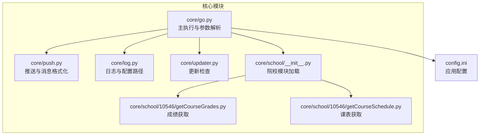
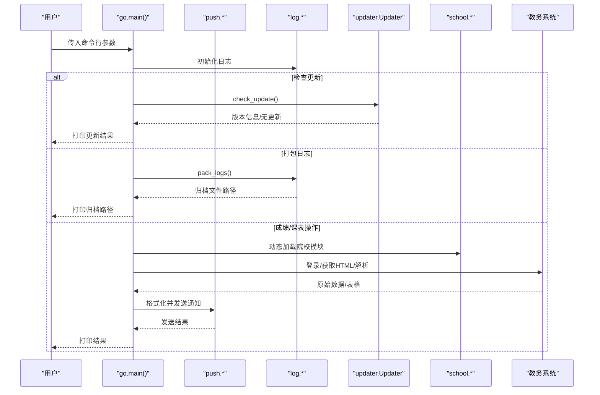
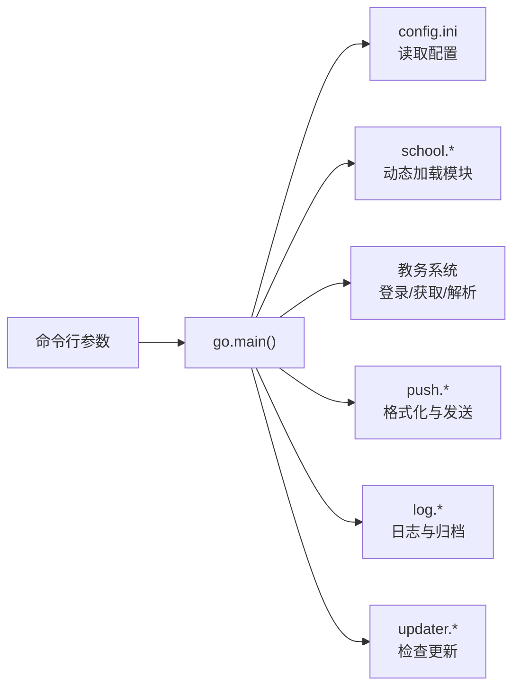

# 命令行接口

<cite>
**本文引用的文件**
- [README.md](file://README.md)
- [go.py](file://core/go.py)
- [push.py](file://core/push.py)
- [log.py](file://core/log.py)
- [updater.py](file://core/updater.py)
- [config.ini](file://config.ini)
- [school/__init__.py](file://core/school/__init__.py)
- [10546/getCourseGrades.py](file://core/school/10546/getCourseGrades.py)
- [10546/getCourseSchedule.py](file://core/school/10546/getCourseSchedule.py)
</cite>

## 更新摘要
**变更内容**
- 新增 --push-full-schedule 命令行参数，提供完整的学期课表推送功能
- 新增完整学期课表推送的完整实现，包括数据获取、格式化和推送
- 更新术语一致性，从"Fetch"到"Push"的统一使用
- 增强课表推送功能，支持更多时间维度的课表推送

## 目录
1. [简介](#简介)
2. [项目结构](#项目结构)
3. [核心组件](#核心组件)
4. [架构总览](#架构总览)
5. [详细组件分析](#详细组件分析)
6. [依赖关系分析](#依赖关系分析)
7. [性能考量](#性能考量)
8. [故障排除指南](#故障排除指南)
9. [结论](#结论)
10. [附录](#附录)

## 简介
本文件为命令行接口的权威API文档，聚焦 main 函数与 argparse 参数解析器的完整接口规范。文档详细说明以下命令行参数：
- --fetch-grade
- --push-grade
- --push-all-grades
- --fetch-schedule
- --push-schedule
- --push-today
- --push-tomorrow
- --push-next-week
- --push-full-schedule
- --pack-logs
- --check-update
- --force

并解释各参数的功能、使用场景、互斥与依赖关系；提供完整使用示例与组合用法；说明兼容参数（如 push-schedule）的作用；最后给出故障排除指南与常见问题解决方案。

## 项目结构
命令行入口位于核心模块，参数解析与业务逻辑集中在主执行模块中，推送与日志、更新等能力通过模块化方式注入。

**图表来源**
- [go.py](file://core/go.py#L463-L536)
- [push.py](file://core/push.py#L1-L319)
- [log.py](file://core/log.py#L1-L211)
- [updater.py](file://core/updater.py#L1-L313)
- [school/__init__.py](file://core/school/__init__.py#L1-L28)
- [10546/getCourseGrades.py](file://core/school/10546/getCourseGrades.py#L1-L329)
- [10546/getCourseSchedule.py](file://core/school/10546/getCourseSchedule.py#L1-L405)
- [config.ini](file://config.ini#L1-L36)

**章节来源**
- [README.md](file://README.md#L60-L83)
- [go.py](file://core/go.py#L1-L536)

## 核心组件
- 参数解析器（argparse）
  - 在主函数中创建 ArgumentParser，注册全部命令行参数，解析并分发到对应业务函数。
- 主执行函数（main）
  - 负责参数解析、条件分支执行、日志记录与异常传播。
- 成绩与课表获取
  - 通过院校模块动态加载，支持强制更新与循环检测控制。
- 推送与日志
  - 推送采用统一管理器，日志统一落盘至 AppData 目录。
- 更新检查
  - 通过 GitHub Releases API 检查并打印更新信息。

**章节来源**
- [go.py](file://core/go.py#L463-L536)
- [push.py](file://core/push.py#L1-L319)
- [log.py](file://core/log.py#L1-L211)
- [updater.py](file://core/updater.py#L1-L313)

## 架构总览
命令行执行流从 main 开始，根据参数决定调用链路，涉及配置读取、网络请求、解析、推送与日志输出。

**图表来源**
- [go.py](file://core/go.py#L463-L536)
- [push.py](file://core/push.py#L290-L319)
- [log.py](file://core/log.py#L18-L58)
- [updater.py](file://core/updater.py#L42-L77)
- [10546/getCourseGrades.py](file://core/school/10546/getCourseGrades.py#L278-L296)
- [10546/getCourseSchedule.py](file://core/school/10546/getCourseSchedule.py#L354-L372)

## 详细组件分析

### 参数接口规范与行为说明
以下参数均通过 argparse 在主函数中注册与解析。每个参数的行为以"功能"、"使用场景"、"典型组合"、"注意事项"四部分说明。

- --fetch-grade
  - 功能：仅获取成绩数据，不进行推送。
  - 使用场景：验证账号与网络连通性、离线查看最新成绩。
  - 典型组合：可与 --force 组合以忽略循环检测。
  - 注意事项：若无变化，不会推送；需配合 --push-grade 或 --push-all-grades 才会推送。
  - **章节来源**
    - [go.py](file://core/go.py#L464-L484)

- --push-grade
  - 功能：推送有变化的成绩。
  - 使用场景：仅在成绩发生变化时通知，避免冗余推送。
  - 典型组合：可与 --force 组合以强制从网络更新。
  - 注意事项：若无变化，不推送；需配合 --fetch-grade 或直接获取后使用。
  - **章节来源**
    - [go.py](file://core/go.py#L465-L487)

- --push-all-grades
  - 功能：推送所有成绩，无论是否有变化。
  - 使用场景：首次推送全部成绩、导出完整清单。
  - 典型组合：可与 --force 组合。
  - 注意事项：会发送全部课程的详细信息，注意推送渠道容量。
  - **章节来源**
    - [go.py](file://core/go.py#L466-L489)

- --fetch-schedule
  - 功能：仅获取课表数据，不进行推送。
  - 使用场景：验证课表可用性、离线查看课表。
  - 典型组合：可与 --force 组合。
  - 注意事项：需配置学期起始周（first_monday），否则跳过。
  - **章节来源**
    - [go.py](file://core/go.py#L467-L494)

- --push-schedule
  - 功能：推送课表（兼容旧参数）。等价于推送今日课表。
  - 使用场景：历史脚本或快捷方式，兼容旧版本。
  - 典型组合：可与 --force 组合。
  - 注意事项：与 --push-today 等价，但语义更宽泛；建议使用更明确的 --push-today。
  - **章节来源**
    - [go.py](file://core/go.py#L468-L497)

- --push-today
  - 功能：推送今日课表。
  - 使用场景：每日提醒，避免遗漏课程。
  - 典型组合：可与 --force 组合；可与 --push-tomorrow、--push-next-week 组合使用。
  - 注意事项：按日去重推送，当日已推送将跳过；需配置 first_monday。
  - **章节来源**
    - [go.py](file://core/go.py#L496-L500)

- --push-tomorrow
  - 功能：推送明日课表。
  - 使用场景：提前了解次日安排。
  - 典型组合：可与 --force 组合。
  - 注意事项：按日去重推送；需配置 first_monday。
  - **章节来源**
    - [go.py](file://core/go.py#L501-L503)

- --push-next-week
  - 功能：推送下周全周课表。
  - 使用场景：提前规划下周学习安排。
  - 典型组合：可与 --force 组合。
  - 注意事项：按周去重推送；需配置 first_monday。
  - **章节来源**
    - [go.py](file://core/go.py#L504-L506)

- --push-full-schedule
  - 功能：推送完整学期课表。
  - 使用场景：导出完整学期课表、备份课表信息、生成学期总览。
  - 典型组合：可与 --force 组合；建议在学期开始时使用。
  - 注意事项：会推送整个学期的所有课程信息，数据量较大；需配置 first_monday；会生成包含所有周次的完整课表。
  - **章节来源**
    - [go.py](file://core/go.py#L587)
    - [go.py](file://core/go.py#L623-L625)
    - [go.py](file://core/go.py#L461-L574)
    - [push.py](file://core/push.py#L315-L319)

- --pack-logs
  - 功能：打包 AppData 中的日志文件，便于崩溃上报。
  - 使用场景：遇到异常或崩溃时收集诊断信息。
  - 典型组合：与 --check-update 结合，先检查更新再打包日志。
  - 注意事项：生成的归档文件路径会打印到控制台。
  - **章节来源**
    - [go.py](file://core/go.py#L507-L514)
    - [log.py](file://core/log.py#L18-L58)

- --check-update
  - 功能：检查软件更新。
  - 使用场景：确认当前版本是否为最新。
  - 典型组合：与 --pack-logs 组合，收集日志后再检查更新。
  - 注意事项：会打印版本信息与更新提示；返回 JSON 格式的更新信息供上层 GUI 使用。
  - **章节来源**
    - [go.py](file://core/go.py#L514-L530)
    - [updater.py](file://core/updater.py#L42-L77)

- --force
  - 功能：强制从网络更新，忽略循环检测。
  - 使用场景：网络不稳定、缓存异常、需要最新数据。
  - 典型组合：与 --fetch-grade、--fetch-schedule、--push-* 等参数组合。
  - 注意事项：会绕过本地缓存，增加网络请求与解析时间。
  - **章节来源**
    - [go.py](file://core/go.py#L474-L479)

### 参数互斥与依赖关系
- 互斥关系
  - 无严格互斥参数。参数之间可叠加使用，但同一功能的参数建议只选其一：
    - --push-schedule 与 --push-today 等价，建议使用更明确的 --push-today。
    - --push-grade 与 --push-all-grades 互斥：仅能选择一种推送策略（变化或全部）。
- 依赖关系
  - --fetch-schedule、--push-today、--push-tomorrow、--push-next-week、--push-full-schedule 依赖配置项 semester.first_monday。
  - --pack-logs 依赖 AppData 目录存在且包含日志文件。
  - --check-update 依赖网络访问与 GitHub Releases。
  - --force 与网络请求和解析流程强相关，影响缓存策略。

**章节来源**
- [go.py](file://core/go.py#L463-L536)
- [config.ini](file://config.ini#L12-L13)
- [log.py](file://core/log.py#L18-L58)
- [updater.py](file://core/updater.py#L42-L77)

### 命令行使用示例与组合
- 查看帮助
  - 使用命令行工具显示帮助信息（由 argparse 自动生成）。
- 获取并推送今日课表
  - 示例：python core/go.py --push-today
- 获取并推送所有成绩
  - 示例：python core/go.py --push-all-grades
- 强制获取并推送今日课表
  - 示例：python core/go.py --push-today --force
- 推送完整学期课表
  - 示例：python core/go.py --push-full-schedule
- 组合使用：获取今日课表并打包日志
  - 示例：python core/go.py --push-today --pack-logs
- 检查更新并打印更新信息
  - 示例：python core/go.py --check-update
- 获取成绩（不推送）并检查更新
  - 示例：python core/go.py --fetch-grade --check-update
- 组合使用：推送完整学期课表并检查更新
  - 示例：python core/go.py --push-full-schedule --check-update

**章节来源**
- [go.py](file://core/go.py#L463-L536)

### 兼容性参数说明
- --push-schedule
  - 作用：向后兼容旧版本脚本，等价于推送今日课表。
  - 建议：新脚本优先使用 --push-today，语义更清晰。
- --force
  - 作用：强制从网络更新，忽略循环检测；适用于调试、缓存异常或需要最新数据的场景。

**章节来源**
- [go.py](file://core/go.py#L468-L497)

## 依赖关系分析
命令行参数与核心模块的依赖关系如下：

**图表来源**
- [go.py](file://core/go.py#L463-L536)
- [config.ini](file://config.ini#L1-L36)
- [school/__init__.py](file://core/school/__init__.py#L22-L28)
- [push.py](file://core/push.py#L1-L319)
- [log.py](file://core/log.py#L1-L211)
- [updater.py](file://core/updater.py#L1-L313)

**章节来源**
- [go.py](file://core/go.py#L1-L536)
- [school/__init__.py](file://core/school/__init__.py#L1-L28)

## 性能考量
- --force 会绕过本地缓存，导致每次网络请求与解析，增加耗时。
- 成绩与课表解析为 CPU 密集型操作，建议在必要时才使用 --force。
- 推送通知可能受网络与第三方服务影响，建议在稳定网络环境下执行。
- 日志文件过多会影响磁盘 I/O，系统会自动清理旧日志，但仍建议定期维护。
- --push-full-schedule 会生成大量数据，建议在网络状况良好时执行，避免长时间占用带宽。

## 故障排除指南
- 配置缺失
  - 现象：提示未设置账号或密码。
  - 处理：在 config.ini 的 [account] 节填写 username 与 password。
  - **章节来源**
    - [config.ini](file://config.ini#L7-L11)
- 未设置学期起始周
  - 现象：课表相关参数（如 --push-today、--push-full-schedule）跳过。
  - 处理：在 config.ini 的 [semester] 节设置 first_monday。
  - **章节来源**
    - [config.ini](file://config.ini#L12-L13)
- 登录失败/验证码
  - 现象：登录响应包含验证码或失败提示。
  - 处理：手动登录教务系统，确认账号密码正确；若出现验证码，脚本无法自动处理。
  - **章节来源**
    - [10546/getCourseGrades.py](file://core/school/10546/getCourseGrades.py#L87-L100)
    - [10546/getCourseSchedule.py](file://core/school/10546/getCourseSchedule.py#L88-L101)
- 网络超时/连接异常
  - 现象：请求异常或超时。
  - 处理：检查网络连通性；可使用 --force 强制更新；必要时关闭防火墙/代理。
  - **章节来源**
    - [10546/getCourseGrades.py](file://core/school/10546/getCourseGrades.py#L210-L215)
    - [10546/getCourseSchedule.py](file://core/school/10546/getCourseSchedule.py#L211-L216)
- 无法获取 AppData 目录
  - 现象：打包日志失败或日志初始化失败。
  - 处理：确认 LOCALAPPDATA 环境变量存在；以管理员权限运行或修复用户权限。
  - **章节来源**
    - [log.py](file://core/log.py#L24-L26)
- 未启用推送方式
  - 现象：推送未生效。
  - 处理：在 config.ini 的 [push] 节设置 method 为有效的推送方式（如 email、feishu）。
  - **章节来源**
    - [config.ini](file://config.ini#L23-L24)
    - [push.py](file://core/push.py#L26-L54)

## 结论
本文档提供了命令行接口的完整规范与使用指南。通过明确参数功能、使用场景与组合方式，结合互斥与依赖关系说明，有助于用户高效、安全地使用该系统。建议在生产环境中谨慎使用 --force，并合理配置推送与日志策略，以获得最佳体验。新增的 --push-full-schedule 参数为用户提供了完整的学期课表导出功能，特别适用于学期初的数据备份和课表整理场景。

## 附录
- 配置文件位置与结构
  - 配置文件位于 AppData 目录，路径由日志模块统一管理。
  - **章节来源**
    - [log.py](file://core/log.py#L60-L83)
    - [config.ini](file://config.ini#L1-L36)