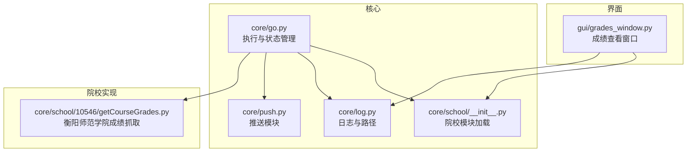
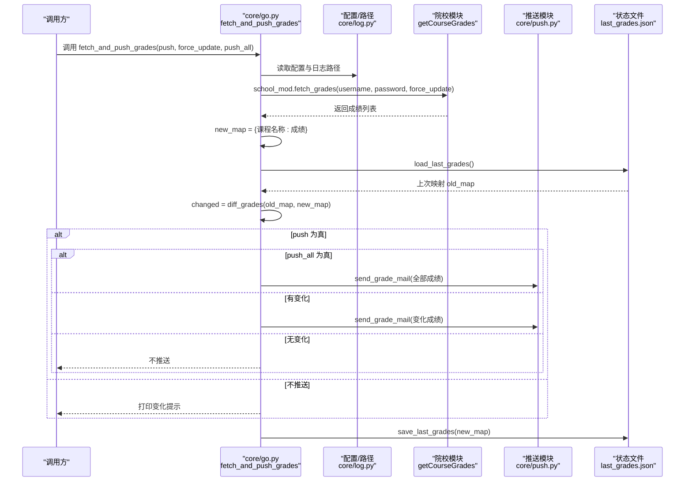
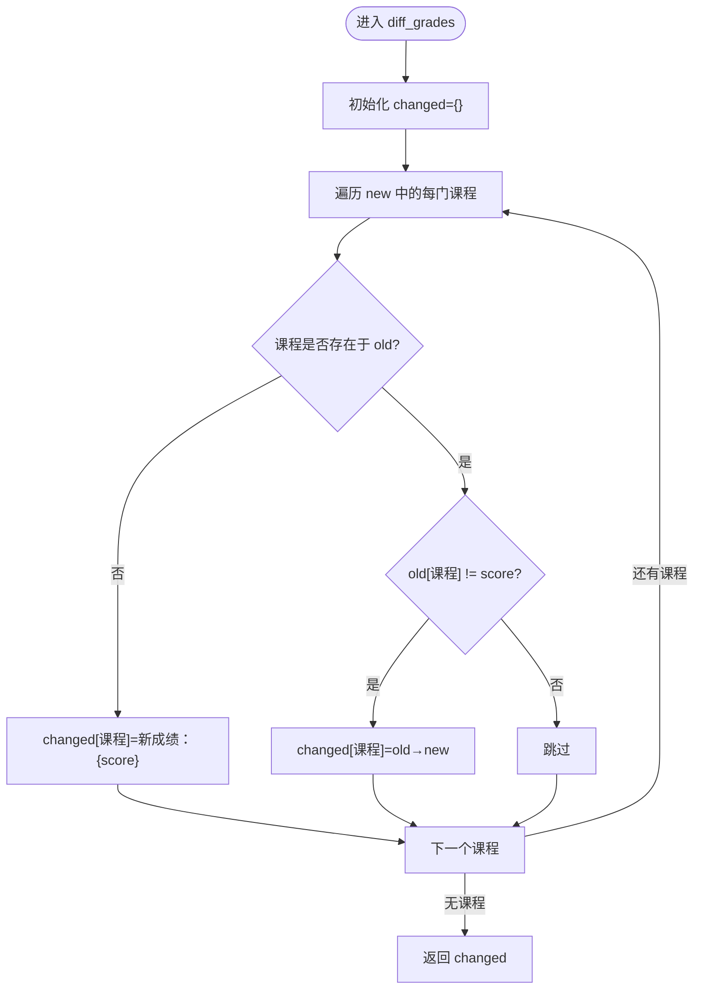
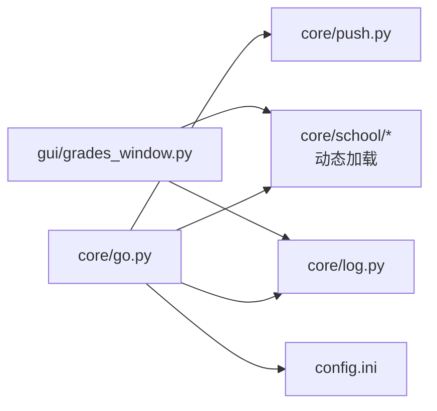

# 成绩相关函数

<cite>
**本文引用的文件**
- [core/go.py](file://core/go.py)
- [core/school/10546/getCourseGrades.py](file://core/school/10546/getCourseGrades.py)
- [core/push.py](file://core/push.py)
- [gui/grades_window.py](file://gui/grades_window.py)
- [core/log.py](file://core/log.py)
- [config.ini](file://config.ini)
- [core/school/__init__.py](file://core/school/__init__.py)
</cite>

## 目录
1. [简介](#简介)
2. [项目结构](#项目结构)
3. [核心组件](#核心组件)
4. [架构总览](#架构总览)
5. [详细组件分析](#详细组件分析)
6. [依赖关系分析](#依赖关系分析)
7. [性能考量](#性能考量)
8. [故障排查指南](#故障排查指南)
9. [结论](#结论)
10. [附录](#附录)

## 简介
本文件聚焦于“成绩相关函数”的完整API文档，重点覆盖以下内容：
- fetch_and_push_grades 函数的接口规范（参数、返回值、异常处理）
- 成绩数据结构与字段含义
- 状态文件 last_grades.json 的存储格式与用途
- 循环检测机制与变化检测算法 diff_grades 的实现逻辑
- 调用示例与最佳实践
- 错误处理策略与常见问题排查

## 项目结构
围绕成绩功能的关键模块与文件如下：
- 核心执行与状态管理：core/go.py
- 院校模块（以衡阳师范学院为例）：core/school/10546/getCourseGrades.py
- 推送模块：core/push.py
- GUI 成绩查看窗口：gui/grades_window.py
- 日志与配置路径：core/log.py
- 配置文件：config.ini
- 院校模块加载：core/school/__init__.py

**图表来源**
- [core/go.py](file://core/go.py#L1-L536)
- [core/push.py](file://core/push.py#L1-L319)
- [core/log.py](file://core/log.py#L1-L211)
- [core/school/10546/getCourseGrades.py](file://core/school/10546/getCourseGrades.py#L1-L329)
- [gui/grades_window.py](file://gui/grades_window.py#L1-L158)
- [core/school/__init__.py](file://core/school/__init__.py#L1-L28)

**章节来源**
- [core/go.py](file://core/go.py#L1-L536)
- [core/school/10546/getCourseGrades.py](file://core/school/10546/getCourseGrades.py#L1-L329)
- [core/push.py](file://core/push.py#L1-L319)
- [gui/grades_window.py](file://gui/grades_window.py#L1-L158)
- [core/log.py](file://core/log.py#L1-L211)
- [config.ini](file://config.ini#L1-L36)
- [core/school/__init__.py](file://core/school/__init__.py#L1-L28)

## 核心组件
- fetch_and_push_grades：主流程函数，负责获取成绩、检测变化、决定推送策略，并持久化状态
- diff_grades：变化检测算法，对比上一次与本次成绩映射，生成变化字典
- load_last_grades/save_last_grades：状态文件 last_grades.json 的读写
- getCourseGrades（院校模块）：提供 fetch_grades、get_grade_html、parse_grades 等能力
- 推送模块：send_grade_mail/format_grade_changes 等，负责消息格式化与发送

**章节来源**
- [core/go.py](file://core/go.py#L61-L143)
- [core/school/10546/getCourseGrades.py](file://core/school/10546/getCourseGrades.py#L278-L295)
- [core/push.py](file://core/push.py#L184-L204)

## 架构总览
下面的序列图展示了 fetch_and_push_grades 的调用链路与关键步骤。

**图表来源**
- [core/go.py](file://core/go.py#L83-L143)
- [core/school/10546/getCourseGrades.py](file://core/school/10546/getCourseGrades.py#L278-L295)
- [core/push.py](file://core/push.py#L184-L204)

## 详细组件分析

### fetch_and_push_grades 函数 API 规范
- 函数位置：core/go.py
- 函数签名：fetch_and_push_grades(push=False, force_update=False, push_all=False)
- 参数说明
  - push: 是否推送成绩到邮箱
  - force_update: 是否强制从网络更新（忽略循环检测）
  - push_all: 是否推送所有成绩（忽略变化检测）
- 返回值
  - 无返回值（None）。内部会打印提示信息（有变化/无变化/失败等）
- 异常处理
  - 捕获内部异常并记录日志；随后抛出异常，便于上层处理
- 业务流程要点
  - 读取配置与当前院校模块
  - 调用院校模块 fetch_grades 获取成绩列表
  - 构造新映射 new_map（课程名称 -> 成绩）
  - 读取 last_grades.json（旧映射 old_map）
  - 使用 diff_grades 计算变化集合 changed
  - 若 push 为真：
    - 若 push_all 为真：推送全部成绩
    - 否则若 changed 非空：推送变化成绩
    - 否则：不推送
  - 保存 new_map 到 last_grades.json
  - 若 push 为假：打印变化提示

**章节来源**
- [core/go.py](file://core/go.py#L83-L143)

### 成绩数据结构
- 字段说明（来自院校模块解析）
  - 课程编号
  - 课程名称
  - 成绩
  - 学期
  - 课程属性
  - 学分
- 数据来源
  - 院校模块的 parse_grades 从 HTML 表格解析得到
- 数据用途
  - 作为 fetch_and_push_grades 的输入，用于构造 new_map 并进行变化检测

**章节来源**
- [core/school/10546/getCourseGrades.py](file://core/school/10546/getCourseGrades.py#L232-L262)

### 状态文件 last_grades.json
- 路径
  - %LOCALAPPDATA%/Capture_Push/state/last_grades.json
  - 在 go.py 中通过统一日志路径管理获取
- 存储格式
  - JSON 对象，键为“课程名称”，值为“成绩”
- 作用
  - 保存上一次抓取到的课程-成绩映射，供 diff_grades 比较使用
  - 作为变化检测的依据
- 读写函数
  - load_last_grades：读取 JSON 并返回字典
  - save_last_grades：将字典写回 JSON

**章节来源**
- [core/go.py](file://core/go.py#L61-L70)
- [core/log.py](file://core/log.py#L60-L82)

### 循环检测机制
- 配置项
  - [loop_getCourseGrades]enabled：是否启用循环检测
  - [loop_getCourseGrades]time：检测间隔（秒）
- 实现位置
  - 院校模块 getCourseGrades.py 提供 should_update_grades 与 get_loop_config
- 工作原理
  - 若未启用循环检测：始终从网络获取
  - 若启用循环检测：检查本地缓存文件 grade.html 与时间戳 grade_timestamp.txt
  - 若缓存存在且未超时：使用本地缓存
  - 若缓存不存在或超时：从网络获取并更新缓存与时间戳
- 与 fetch_and_push_grades 的关系
  - fetch_and_push_grades 的 force_update 参数会绕过循环检测，直接从网络获取

**章节来源**
- [core/school/10546/getCourseGrades.py](file://core/school/10546/getCourseGrades.py#L103-L156)
- [core/school/10546/getCourseGrades.py](file://core/school/10546/getCourseGrades.py#L169-L229)
- [core/go.py](file://core/go.py#L98-L108)

### 变化检测算法 diff_grades
- 函数位置：core/go.py
- 输入
  - old：上次映射（课程名称 -> 成绩）
  - new：本次映射（课程名称 -> 成绩）
- 输出
  - changed：变化字典（仅包含新增或变更的课程）
- 算法逻辑
  - 遍历 new 中的每一门课程
  - 若课程不在 old 中：标记为“新成绩：{score}”
  - 若课程在 old 中但分数不同：标记为“{old_score} → {new_score}”
  - 否则不加入 changed
- 时间复杂度
  - O(n)，n 为 new 的课程数量

**图表来源**
- [core/go.py](file://core/go.py#L73-L80)

**章节来源**
- [core/go.py](file://core/go.py#L73-L80)

### 调用示例与使用场景
- 示例1：仅获取成绩（不推送）
  - 命令行：--fetch-grade
  - 代码调用：fetch_and_push_grades(push=False, force_update=False)
- 示例2：推送变化成绩
  - 命令行：--push-grade
  - 代码调用：fetch_and_push_grades(push=True, force_update=False, push_all=False)
- 示例3：推送所有成绩（忽略变化）
  - 命令行：--push-all-grades
  - 代码调用：fetch_and_push_grades(push=True, force_update=False, push_all=True)
- 示例4：强制从网络更新（忽略循环检测）
  - 命令行：--force
  - 代码调用：fetch_and_push_grades(force_update=True)
- GUI 刷新
  - 点击“刷新成绩 (从网络获取)”按钮，内部以 --fetch-grade --force 方式执行

**章节来源**
- [core/go.py](file://core/go.py#L461-L530)
- [gui/grades_window.py](file://gui/grades_window.py#L79-L107)

### 推送模块与消息格式
- 推送方式
  - 通过配置 [push]method 选择（如 none、email、feishu）
- 消息格式
  - format_grade_changes：将变化字典格式化为纯文本
  - send_grade_mail：使用当前活跃发送器发送
- 注意
  - 当 push_all=True 时，会将所有课程包装为“成绩：{score}”再发送

**章节来源**
- [core/push.py](file://core/push.py#L26-L42)
- [core/push.py](file://core/push.py#L184-L204)
- [core/push.py](file://core/push.py#L291-L294)

## 依赖关系分析
- 模块耦合
  - core/go.py 依赖：
    - 院校模块（动态加载，通过 school_code）
    - 推送模块（send_grade_mail）
    - 日志模块（统一路径与日志）
    - 配置文件（config.ini）
- 依赖可视化

**图表来源**
- [core/go.py](file://core/go.py#L15-L29)
- [core/school/__init__.py](file://core/school/__init__.py#L22-L27)
- [gui/grades_window.py](file://gui/grades_window.py#L18-L24)

**章节来源**
- [core/go.py](file://core/go.py#L15-L29)
- [core/school/__init__.py](file://core/school/__init__.py#L22-L27)
- [gui/grades_window.py](file://gui/grades_window.py#L18-L24)

## 性能考量
- 循环检测
  - 通过缓存与时间戳避免频繁网络请求，降低带宽与服务器压力
- 变化检测
  - 使用哈希映射（字典）进行 O(n) 比较，适合课程数量规模
- I/O
  - 状态文件读写为 JSON，体积小，影响可忽略
- 建议
  - 合理设置循环检测间隔
  - 在推送模式下，尽量使用 push_all=False 以减少推送量

[本节为通用指导，无需特定文件引用]

## 故障排查指南
- 常见问题与定位
  - 成绩获取失败
    - 检查账号密码配置是否正确
    - 查看日志文件定位网络/解析错误
  - 无变化但期望推送
    - 确认 last_grades.json 是否存在且内容正确
    - 使用 --force 强制更新，验证网络抓取是否正常
  - 推送未生效
    - 检查 [push]method 是否非 none
    - 检查邮件/飞书配置是否正确
- 关键日志与文件
  - 日志路径：%LOCALAPPDATA%/Capture_Push/<日期>.log
  - 配置路径：%LOCALAPPDATA%/Capture_Push/config.ini
  - 状态文件：%LOCALAPPDATA%/Capture_Push/state/last_grades.json
  - 院校缓存：%LOCALAPPDATA%/Capture_Push/grade.html
  - 院校时间戳：%LOCALAPPDATA%/Capture_Push/grade_timestamp.txt
- GUI 清除缓存
  - 可一键清除 grade.html 与 last_grades.json，便于重新触发提醒

**章节来源**
- [core/log.py](file://core/log.py#L60-L82)
- [core/log.py](file://core/log.py#L114-L128)
- [gui/grades_window.py](file://gui/grades_window.py#L142-L157)
- [core/school/10546/getCourseGrades.py](file://core/school/10546/getCourseGrades.py#L169-L229)

## 结论
- fetch_and_push_grades 提供了清晰的参数化控制，既能满足“仅查看”也能满足“推送变化/全部”的需求
- 通过 last_grades.json 与 diff_grades 实现了高效的增量检测
- 循环检测与缓存策略降低了网络与服务器压力
- 建议在生产环境中合理配置循环检测与推送策略，并关注日志与状态文件的维护

[本节为总结性内容，无需特定文件引用]

## 附录

### API 速查表：fetch_and_push_grades
- 函数：fetch_and_push_grades(push=False, force_update=False, push_all=False)
- 参数
  - push：是否推送
  - force_update：是否忽略循环检测
  - push_all：是否推送全部（忽略变化）
- 返回：无
- 异常：捕获并抛出，便于上层处理
- 适用场景
  - 定时任务：push=False，配合循环检测
  - 人工触发：push=True，force_update=True
  - 全量通知：push=True，push_all=True

**章节来源**
- [core/go.py](file://core/go.py#L83-L143)

### 配置参考（部分）
- [loop_getCourseGrades]enabled：是否启用循环检测
- [loop_getCourseGrades]time：检测间隔（秒）
- [push]method：推送方式（none/email/feishu）

**章节来源**
- [config.ini](file://config.ini#L15-L24)