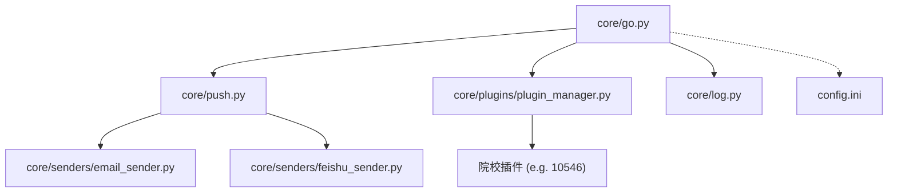
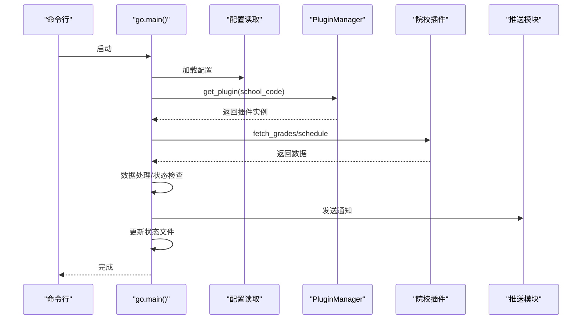

# 核心模块 API

<cite>
**本文引用的文件**
- [core/go.py](file://core/go.py)
- [core/push.py](file://core/push.py)
- [core/plugins/plugin_manager.py](file://core/plugins/plugin_manager.py)
- [core/log.py](file://core/log.py)
- [core/senders/email_sender.py](file://core/senders/email_sender.py)
- [core/senders/feishu_sender.py](file://core/senders/feishu_sender.py)
- [config.ini](file://config.ini)
- [config.md](file://config.md)
- [README.md](file://README.md)
</cite>

## 目录
1. [简介](#简介)
2. [项目结构](#项目结构)
3. [核心组件](#核心组件)
4. [架构总览](#架构总览)
5. [详细组件分析](#详细组件分析)
6. [依赖关系分析](#依赖关系分析)
7. [性能考量](#性能考量)
8. [故障排查指南](#故障排查指南)
9. [结论](#结论)
10. [附录](#附录)

## 简介
本文件为“核心模块 API”参考文档，聚焦于 core/go.py 中的核心函数接口，包括：
- fetch_and_push_grades
- fetch_and_push_today_schedule
- fetch_and_push_tomorrow_schedule
- fetch_and_push_next_week_schedule

文档涵盖函数签名、参数说明（push、force_update、push_all 的作用）、返回值类型、异常处理机制；提供完整的调用示例与使用场景说明；解释循环检测机制、状态管理文件的作用，以及与配置文件的交互方式；并包含命令行参数的完整说明与最佳实践建议。

## 项目结构
核心模块位于 core 目录，go.py 为主入口，负责：
- 读取配置文件
- 调用 PluginManager 加载院校插件
- 调度成绩与课表抓取与推送
- 维护状态文件（去重/循环检测）
- 提供命令行参数入口



## 核心组件
- **配置读取与路径管理**：统一从 AppData 目录读取配置与日志，保证跨平台一致性。
- **插件化院校模块**：通过 `PluginManager` 动态加载不同院校的抓取实现，支持从 GitHub 自动更新。
- **推送模块**：集中管理推送方式（邮件、飞书等），支持配置驱动。
- **状态管理**：使用状态文件实现循环检测与去重（今日/明日/下周已推送标记）。
- **命令行入口**：提供丰富的 CLI 参数，便于自动化与 GUI 调用。

## 架构总览
核心流程概览：CLI 解析参数 → 读取配置 → PluginManager 加载插件 → 抓取数据 → 差异检测/合并 → 推送 → 更新状态文件。



## 详细组件分析

### 1. 核心调度函数 (go.py)

#### `fetch_and_push_grades(push=False, force_update=False, push_all=False)`
- **功能**: 获取并推送成绩。
- **参数**:
  - `push` (bool): 是否发送推送通知。
  - `force_update` (bool): 是否忽略循环检测的时间间隔限制。
  - `push_all` (bool): 是否推送所有成绩（不仅仅是新成绩）。
- **流程**:
  1. 检查是否在循环检测允许的时间窗口内（除非 `force_update=True`）。
  2. 调用插件的 `fetch_grades` 获取最新成绩。
  3. 读取上次保存的成绩状态 (`last_grades.json`)。
  4. 比较新旧成绩，找出新增或变化的成绩。
  5. 如果有变化或 `push_all=True`，调用 `push.send_grade_mail`。
  6. 保存最新成绩到状态文件。

#### `fetch_and_push_today_schedule(...)` / `tomorrow` / `next_week`
- **功能**: 获取并推送课表。
- **逻辑**:
  1. 检查今日/明日是否已经推送过（通过 `last_schedule_day.txt`），避免重复打扰。
  2. 调用插件的 `fetch_course_schedule` 获取完整课表。
  3. 读取手动课表配置 (`manual_schedule.json`) 并合并。
  4. 根据当前周次和星期筛选出需要推送的课程。
  5. 调用 `push.send_schedule_mail`。

### 2. 插件管理器交互
`go.py` 不再直接导入 `core.school`，而是：
```python
from core.plugins.plugin_manager import get_plugin_manager

def get_current_school_module():
    plugin_manager = get_plugin_manager()
    return plugin_manager.load_plugin(school_code)
```
这确保了总是使用最新的插件代码，且实现了与具体院校逻辑的解耦。

## 依赖关系分析
- **Runtime**: `requests`, `beautifulsoup4` (插件通常依赖这些进行爬虫)
- **Core**: `core.log`, `core.push`
- **Config**: `config.ini`

## 性能考量
- **状态文件**: 避免了每次运行都进行不必要的推送，减少了对用户的打扰和对教务系统的压力。
- **插件缓存**: 插件下载后本地缓存，启动速度快。

## 故障排查指南
- **无法加载院校模块**: 检查 `config.ini` 中的 `school_code` 是否正确，检查网络是否能访问 GitHub（用于下载插件）。
- **推送重复**: 检查 `AppData/Local/Capture_Push/state` 下的状态文件是否正常写入。

## 结论
核心模块通过清晰的函数接口和状态管理，实现了稳定可靠的自动化抓取与推送流程。

## 附录
无
