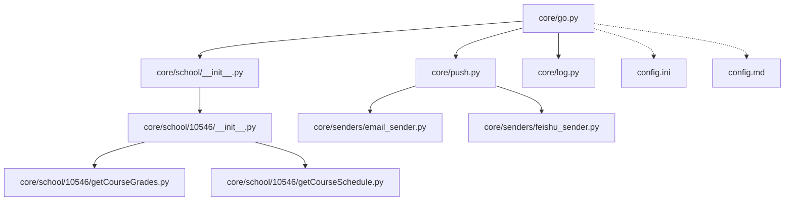
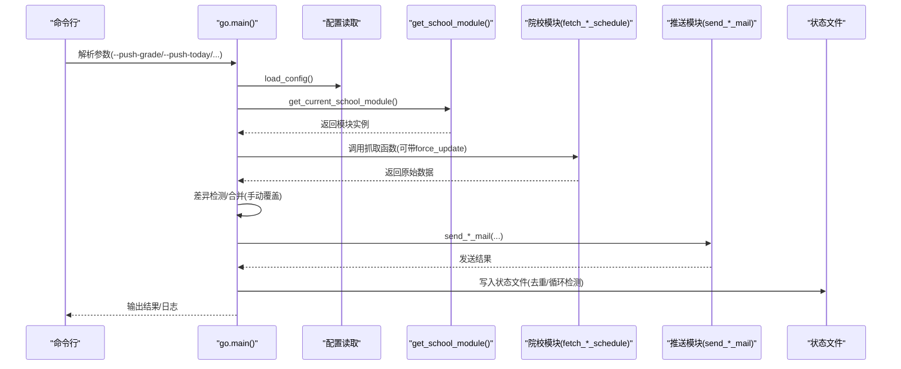
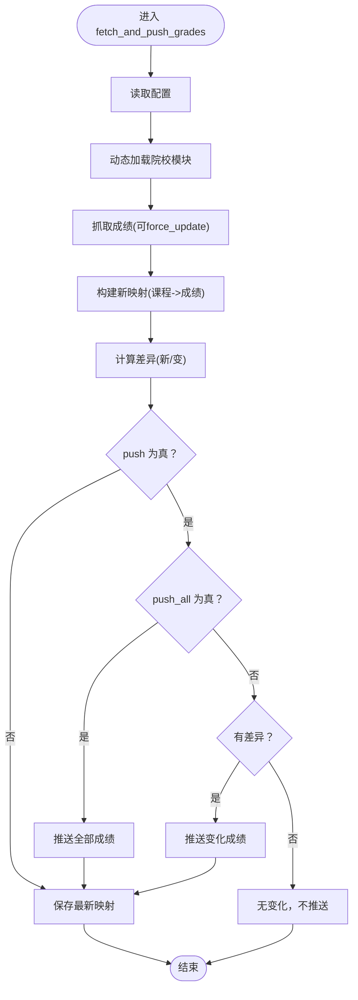
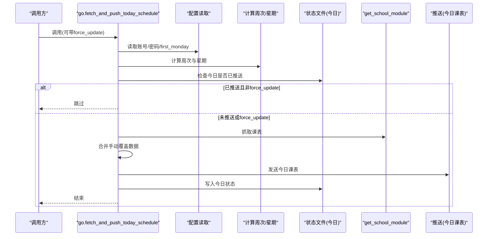
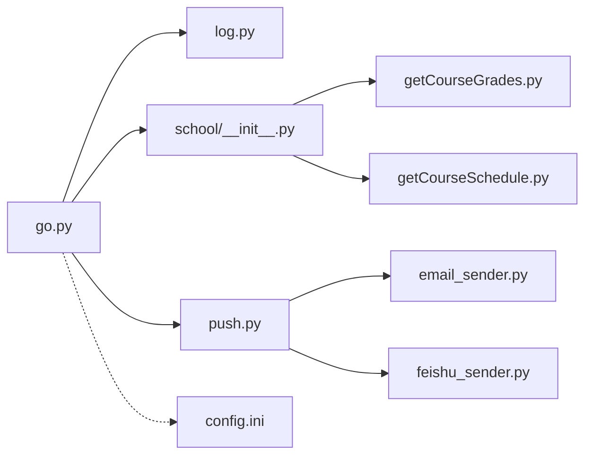

# 核心模块 API

<cite>
**本文引用的文件**
- [core/go.py](file://core/go.py)
- [core/push.py](file://core/push.py)
- [core/school/__init__.py](file://core/school/__init__.py)
- [core/school/10546/__init__.py](file://core/school/10546/__init__.py)
- [core/school/10546/getCourseGrades.py](file://core/school/10546/getCourseGrades.py)
- [core/school/10546/getCourseSchedule.py](file://core/school/10546/getCourseSchedule.py)
- [core/log.py](file://core/log.py)
- [core/senders/email_sender.py](file://core/senders/email_sender.py)
- [core/senders/feishu_sender.py](file://core/senders/feishu_sender.py)
- [config.ini](file://config.ini)
- [config.md](file://config.md)
- [README.md](file://README.md)
</cite>

## 目录
1. [简介](#简介)
2. [项目结构](#项目结构)
3. [核心组件](#核心组件)
4. [架构总览](#架构总览)
5. [详细组件分析](#详细组件分析)
6. [依赖关系分析](#依赖关系分析)
7. [性能考量](#性能考量)
8. [故障排查指南](#故障排查指南)
9. [结论](#结论)
10. [附录](#附录)

## 简介
本文件为“核心模块 API”参考文档，聚焦于 core/go.py 中的核心函数接口，包括：
- fetch_and_push_grades
- fetch_and_push_today_schedule
- fetch_and_push_tomorrow_schedule
- fetch_and_push_next_week_schedule

文档涵盖函数签名、参数说明（push、force_update、push_all 的作用）、返回值类型、异常处理机制；提供完整的调用示例与使用场景说明；解释循环检测机制、状态管理文件的作用，以及与配置文件的交互方式；并包含命令行参数的完整说明与最佳实践建议。

## 项目结构
核心模块位于 core 目录，go.py 为主入口，负责：
- 读取配置文件
- 动态加载院校模块
- 调度成绩与课表抓取与推送
- 维护状态文件（去重/循环检测）
- 提供命令行参数入口

图表来源
- [core/go.py](file://core/go.py#L1-L536)
- [core/push.py](file://core/push.py#L1-L319)
- [core/school/__init__.py](file://core/school/__init__.py#L1-L28)
- [core/school/10546/__init__.py](file://core/school/10546/__init__.py#L1-L7)
- [core/school/10546/getCourseGrades.py](file://core/school/10546/getCourseGrades.py#L1-L329)
- [core/school/10546/getCourseSchedule.py](file://core/school/10546/getCourseSchedule.py#L1-L405)
- [core/log.py](file://core/log.py#L1-L211)
- [core/senders/email_sender.py](file://core/senders/email_sender.py#L1-L144)
- [core/senders/feishu_sender.py](file://core/senders/feishu_sender.py#L1-L110)
- [config.ini](file://config.ini#L1-L36)
- [config.md](file://config.md#L1-L52)

章节来源
- [core/go.py](file://core/go.py#L1-L536)
- [README.md](file://README.md#L60-L83)

## 核心组件
- 配置读取与路径管理：统一从 AppData 目录读取配置与日志，保证跨平台一致性。
- 院校模块化：通过动态导入不同院校的抓取实现，统一接口。
- 推送模块：集中管理推送方式（邮件、飞书等），支持配置驱动。
- 状态管理：使用状态文件实现循环检测与去重（今日/明日/下周已推送标记）。
- 命令行入口：提供丰富的 CLI 参数，便于自动化与 GUI 调用。

章节来源
- [core/go.py](file://core/go.py#L42-L45)
- [core/log.py](file://core/log.py#L60-L82)
- [core/school/__init__.py](file://core/school/__init__.py#L22-L27)
- [core/push.py](file://core/push.py#L26-L42)

## 架构总览
核心流程概览：CLI 解析参数 → 读取配置 → 动态加载院校模块 → 抓取数据 → 差异检测/合并 → 推送 → 更新状态文件。

图表来源
- [core/go.py](file://core/go.py#L461-L531)
- [core/school/__init__.py](file://core/school/__init__.py#L22-L27)
- [core/push.py](file://core/push.py#L291-L318)

## 详细组件分析

### 函数：fetch_and_push_grades
- 函数签名与用途
  - 名称：fetch_and_push_grades
  - 作用：获取并推送成绩，支持差异检测与“推送所有”模式
- 参数
  - push: 是否推送（布尔）
  - force_update: 是否强制从网络更新（布尔，忽略循环检测）
  - push_all: 是否推送所有成绩（布尔，忽略差异检测）
- 返回值
  - 无显式返回值；内部通过日志与打印输出状态
- 处理流程
  - 读取配置（账号、密码、学校代码）
  - 动态加载对应院校模块并抓取成绩
  - 与上次成绩对比，计算变化
  - 若 push=True：
    - push_all=True：推送全部成绩
    - 否则：仅推送变化
  - 保存最新成绩映射至状态文件
  - 若 push=False：仅输出差异提示
- 异常处理
  - 捕获异常并记录日志，随后抛出
- 使用场景
  - 定时任务：仅输出差异（push=False）
  - 通知推送：仅推送变化（push=True, push_all=False）
  - 全量通知：推送全部（push=True, push_all=True）

图表来源
- [core/go.py](file://core/go.py#L83-L143)

章节来源
- [core/go.py](file://core/go.py#L83-L143)

### 函数：fetch_and_push_today_schedule
- 函数签名与用途
  - 名称：fetch_and_push_today_schedule
  - 作用：获取并推送今日课表，支持手动覆盖与循环检测
- 参数
  - force_update: 是否强制从网络更新（布尔）
- 返回值
  - 无显式返回值
- 处理流程
  - 读取配置（账号、密码、学期第一周周一）
  - 计算当前周次与星期
  - 检查“今日已推送”状态文件，若已推送则跳过（除非 force_update）
  - 抓取课表并合并手动覆盖数据
  - 过滤冲突（手动覆盖优先）
  - 发送今日课表邮件
  - 写入“今日已推送”状态文件
- 异常处理
  - 捕获异常并记录日志
- 使用场景
  - 每日定时推送今日课表
  - 开学前/后或节假日前后，配合 force_update 强制刷新

图表来源
- [core/go.py](file://core/go.py#L180-L271)

章节来源
- [core/go.py](file://core/go.py#L180-L271)

### 函数：fetch_and_push_tomorrow_schedule
- 函数签名与用途
  - 名称：fetch_and_push_tomorrow_schedule
  - 作用：获取并推送明日课表，支持手动覆盖与循环检测
- 参数
  - force_update: 是否强制从网络更新（布尔）
- 返回值
  - 无显式返回值
- 处理流程
  - 读取配置（账号、密码、学期第一周周一）
  - 计算明天的周次与星期
  - 检查“明日已推送”状态文件，若已推送则跳过（除非 force_update）
  - 抓取课表并合并手动覆盖数据
  - 过滤冲突（手动覆盖优先）
  - 发送明日课表邮件
  - 写入“明日已推送”状态文件
- 异常处理
  - 捕获异常并记录日志
- 使用场景
  - 每晚定时推送明日课表
  - 配合 GUI 或计划任务使用

章节来源
- [core/go.py](file://core/go.py#L272-L358)

### 函数：fetch_and_push_next_week_schedule
- 函数签名与用途
  - 名称：fetch_and_push_next_week_schedule
  - 作用：获取并推送下周全周课表，支持手动覆盖与循环检测
- 参数
  - force_update: 是否强制从网络更新（布尔）
- 返回值
  - 无显式返回值
- 处理流程
  - 读取配置（账号、密码、学期第一周周一）
  - 计算下周的周次
  - 检查“下周已推送”状态文件，若已推送则跳过（除非 force_update）
  - 抓取课表并合并手动覆盖数据
  - 按星期分组并排序
  - 发送完整下周课表邮件
  - 写入“下周已推送”状态文件
- 异常处理
  - 捕获异常并记录日志
- 使用场景
  - 每周末定时推送下周全周课表
  - 便于提前规划学习安排

章节来源
- [core/go.py](file://core/go.py#L360-L458)

### 命令行参数与最佳实践
- 参数一览
  - --fetch-grade：仅获取成绩（不推送）
  - --push-grade：推送变化的成绩（默认差异检测）
  - --push-all-grades：推送所有成绩（忽略差异检测）
  - --fetch-schedule：仅获取课表（不推送）
  - --push-schedule：兼容旧参数，等价于 --push-today
  - --push-today：推送今日课表
  - --push-tomorrow：推送明日课表
  - --push-next-week：推送下周全周课表
  - --pack-logs：打包日志用于崩溃上报
  - --check-update：检查软件更新
  - --force：强制从网络更新，忽略循环检测
- 最佳实践
  - 使用 --force 仅在必要时开启，避免频繁网络请求
  - 结合计划任务或托盘程序实现定时推送
  - 配置 [loop_getCourseGrades]/[loop_getCourseSchedule] 控制循环检测间隔
  - 使用 --pack-logs 收集日志以便问题定位

章节来源
- [core/go.py](file://core/go.py#L461-L531)
- [config.ini](file://config.ini#L15-L21)
- [config.md](file://config.md#L1-L52)

### 配置文件与交互
- 配置文件位置
  - 统一位于 AppData 目录下的 config.ini
- 关键配置节
  - [account]：school_code、username、password
  - [semester]：first_monday（用于计算周次）
  - [loop_getCourseGrades]/[loop_getCourseSchedule]：enabled、time（循环检测）
  - [push]：method（none/email/...）
  - [email]/[feishu]：推送所需参数
- 交互方式
  - go.py 通过 load_config() 读取配置
  - 院校模块通过 get_school_module() 动态加载
  - 推送模块通过 get_push_method()/is_push_enabled() 读取推送方式

章节来源
- [core/go.py](file://core/go.py#L42-L45)
- [core/school/__init__.py](file://core/school/__init__.py#L22-L27)
- [core/push.py](file://core/push.py#L26-L53)
- [config.ini](file://config.ini#L1-L36)
- [config.md](file://config.md#L1-L52)

### 状态管理文件与循环检测
- 状态文件位置
  - AppData/Capture_Push/state/
- 文件说明
  - last_grades.json：保存上一次成绩映射，用于差异检测
  - last_schedule_day.txt：保存上次课表推送日期，用于今日/明日去重
  - last_push_today/tomorrow/next_week.txt：分别记录今日/明日/下周已推送的标识
  - manual_schedule.json：手动覆盖的课表数据
- 循环检测机制
  - 成绩/课表模块各自维护缓存与时间戳文件，结合配置节控制更新频率
  - go.py 层面的 force_update 可绕过循环检测，直接从网络获取

章节来源
- [core/go.py](file://core/go.py#L36-L38)
- [core/go.py](file://core/go.py#L61-L71)
- [core/go.py](file://core/go.py#L147-L157)
- [core/school/10546/getCourseGrades.py](file://core/school/10546/getCourseGrades.py#L103-L114)
- [core/school/10546/getCourseSchedule.py](file://core/school/10546/getCourseSchedule.py#L104-L115)

### 推送模块与发送器
- 推送模块
  - 通过 get_push_method()/is_push_enabled() 读取配置
  - 提供统一的 send_*_mail() 接口
- 发送器
  - 邮件：core/senders/email_sender.py
  - 飞书：core/senders/feishu_sender.py
- 使用方式
  - go.py 调用 push.py 的 send_*_mail()，由通知管理器根据配置选择具体发送器

章节来源
- [core/push.py](file://core/push.py#L26-L53)
- [core/push.py](file://core/push.py#L291-L318)
- [core/senders/email_sender.py](file://core/senders/email_sender.py#L47-L144)
- [core/senders/feishu_sender.py](file://core/senders/feishu_sender.py#L42-L110)

## 依赖关系分析
- go.py 依赖
  - 配置读取：core/log.py
  - 院校模块：core/school/__init__.py
  - 推送模块：core/push.py
  - 院校实现：core/school/10546/getCourseGrades.py、getCourseSchedule.py
- 推送模块依赖
  - 发送器：core/senders/email_sender.py、core/senders/feishu_sender.py
- 配置文件
  - config.ini 提供运行模式、推送方式、账户与学期信息

图表来源
- [core/go.py](file://core/go.py#L15-L19)
- [core/school/__init__.py](file://core/school/__init__.py#L1-L28)
- [core/push.py](file://core/push.py#L1-L319)
- [core/school/10546/getCourseGrades.py](file://core/school/10546/getCourseGrades.py#L1-L329)
- [core/school/10546/getCourseSchedule.py](file://core/school/10546/getCourseSchedule.py#L1-L405)
- [core/senders/email_sender.py](file://core/senders/email_sender.py#L1-L144)
- [core/senders/feishu_sender.py](file://core/senders/feishu_sender.py#L1-L110)
- [config.ini](file://config.ini#L1-L36)

章节来源
- [core/go.py](file://core/go.py#L1-L536)
- [core/push.py](file://core/push.py#L1-L319)

## 性能考量
- 循环检测与缓存
  - 通过时间戳与缓存文件减少重复网络请求
  - 配置节 [loop_getCourseGrades]/[loop_getCourseSchedule] 控制更新频率
- 状态文件去重
  - 今日/明日/下周状态文件避免重复推送
- 日志与资源管理
  - 统一日志路径与轮转，避免磁盘占用过大
- 推送方式选择
  - 合理选择推送方式，避免不必要的网络开销

[本节为通用指导，无需列出章节来源]

## 故障排查指南
- 常见问题
  - 配置文件缺失或路径错误：检查 AppData 目录中的 config.ini 是否存在
  - 账号密码错误：登录阶段会记录错误，检查 [account] 节
  - 邮件发送失败：Outlook/Hotmail 不支持基本认证；Office365 需要应用密码
  - 飞书签名错误：检查 [feishu] 节的 webhook_url 与 secret
  - 无法获取课表/成绩：检查网络连通性与服务器域名解析
- 日志与诊断
  - 使用 --pack-logs 生成崩溃报告，便于问题定位
  - 查看 AppData/Capture_Push 下的日志文件

章节来源
- [core/log.py](file://core/log.py#L18-L57)
- [core/senders/email_sender.py](file://core/senders/email_sender.py#L78-L91)
- [core/senders/email_sender.py](file://core/senders/email_sender.py#L127-L139)
- [core/school/10546/getCourseGrades.py](file://core/school/10546/getCourseGrades.py#L90-L100)
- [core/school/10546/getCourseSchedule.py](file://core/school/10546/getCourseSchedule.py#L90-L101)

## 结论
- go.py 提供了清晰的 API 接口，围绕“抓取-差异检测-推送-状态管理”的闭环设计
- 通过配置驱动与模块化扩展，支持多院校与多推送方式
- 建议在生产环境中合理配置循环检测与强制更新策略，结合日志与崩溃报告进行持续优化

[本节为总结性内容，无需列出章节来源]

## 附录

### 调用示例与使用场景
- 仅获取成绩（不推送）
  - go.py --fetch-grade
- 推送变化的成绩
  - go.py --push-grade
- 推送所有成绩（忽略差异）
  - go.py --push-all-grades
- 获取课表（不推送）
  - go.py --fetch-schedule
- 推送今日课表
  - go.py --push-today
- 推送明日课表
  - go.py --push-tomorrow
- 推送下周全周课表
  - go.py --push-next-week
- 强制从网络更新（忽略循环检测）
  - go.py --push-grade --force
- 打包日志用于崩溃上报
  - go.py --pack-logs
- 检查软件更新
  - go.py --check-update

章节来源
- [core/go.py](file://core/go.py#L461-L531)

### 参数说明与最佳实践
- push（仅对成绩函数有效）
  - false：仅输出差异提示，不推送
  - true：根据 push_all 决定推送全部或变化
- force_update
  - true：忽略循环检测，直接从网络获取
  - false：遵循循环检测与缓存策略
- push_all（仅对成绩函数有效）
  - true：推送全部成绩（忽略差异）
  - false：仅推送变化
- 最佳实践
  - 默认使用差异检测推送，减少无效通知
  - 在开发/调试阶段使用 --force 获取最新数据
  - 合理设置循环检测间隔，避免频繁请求
  - 使用 --pack-logs 收集日志，便于问题定位

章节来源
- [core/go.py](file://core/go.py#L83-L143)
- [core/go.py](file://core/go.py#L180-L271)
- [core/go.py](file://core/go.py#L272-L358)
- [core/go.py](file://core/go.py#L360-L458)
- [config.ini](file://config.ini#L15-L21)
- [config.md](file://config.md#L1-L52)