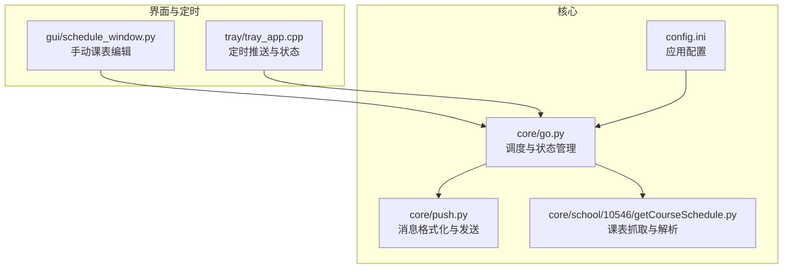
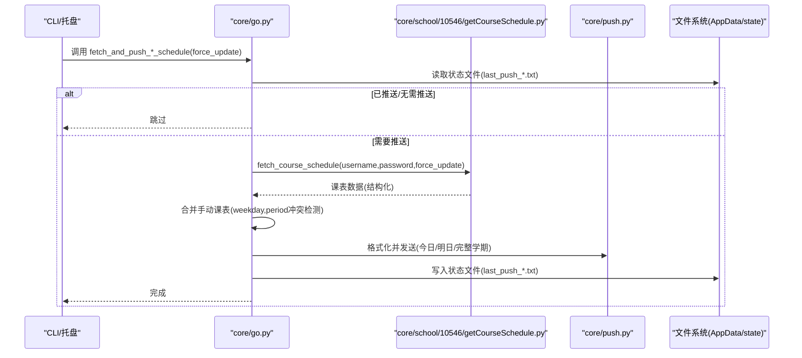
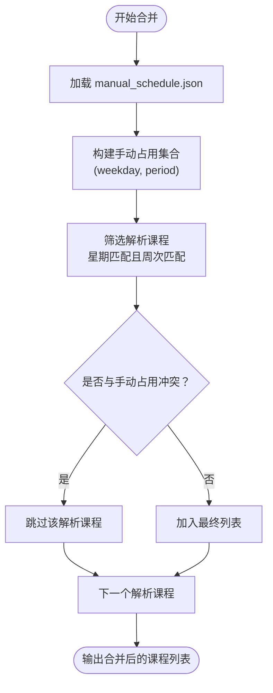
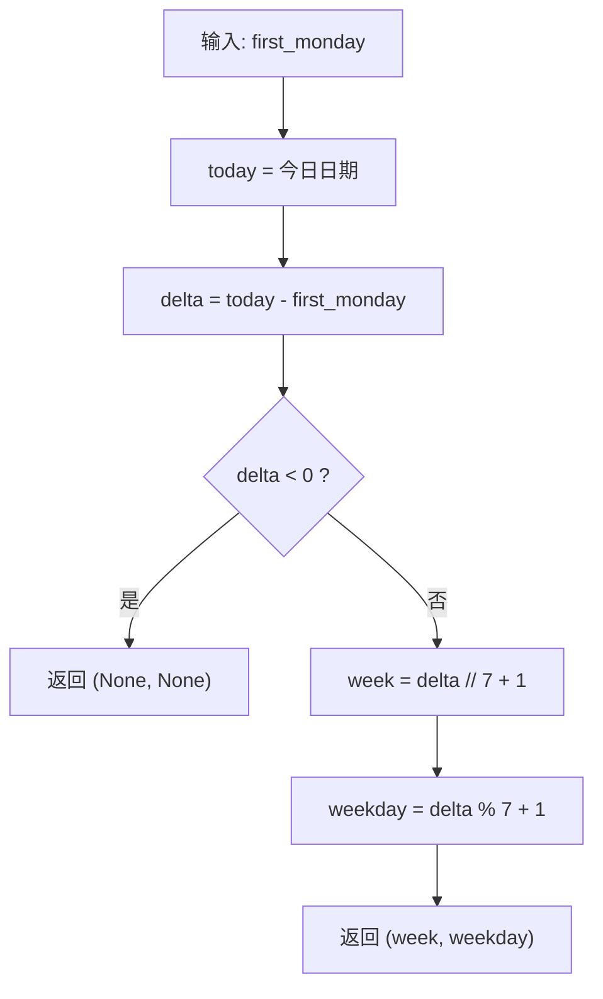
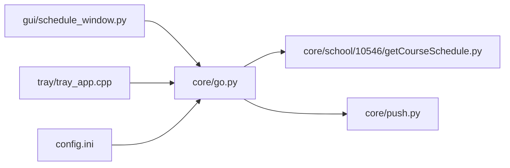

# 课表相关函数

<cite>
**本文引用的文件**
- [core/go.py](file://core/go.py)
- [core/push.py](file://core/push.py)
- [core/school/10546/getCourseSchedule.py](file://core/school/10546/getCourseSchedule.py)
- [gui/schedule_window.py](file://gui/schedule_window.py)
- [tray/tray_app.cpp](file://tray/tray_app.cpp)
- [config.ini](file://config.ini)
</cite>

## 更新摘要
**变更内容**
- 新增完整的学期课表推送功能 `fetch_and_push_full_semester_schedule`
- 扩展了CLI参数支持 `--push-full-schedule`
- 增强了跨年学期计算和周次范围处理
- 完善了状态文件机制的说明
- 更新了调用示例和使用场景

## 目录
1. [简介](#简介)
2. [项目结构](#项目结构)
3. [核心组件](#核心组件)
4. [架构概览](#架构概览)
5. [详细组件分析](#详细组件分析)
6. [依赖关系分析](#依赖关系分析)
7. [性能考虑](#性能考虑)
8. [故障排查指南](#故障排查指南)
9. [结论](#结论)
10. [附录](#附录)

## 简介
本文档聚焦于课表相关函数的详细API说明，涵盖以下四个核心函数：
- fetch_and_push_today_schedule
- fetch_and_push_tomorrow_schedule
- fetch_and_push_next_week_schedule
- fetch_and_push_full_semester_schedule

重点内容包括：
- 函数接口规范与参数说明（尤其是 force_update 的作用）
- 四者的功能差异与适用场景
- 手动课表合并机制（manual_schedule.json 的结构、坐标系统 weekday/period、冲突检测逻辑）
- 状态文件机制（last_push_today.txt、last_push_tomorrow.txt、last_push_next_week.txt）的作用与存储格式
- 完整调用示例与使用场景
- 周次计算算法 calc_week_and_weekday 的实现原理
- 跨年学期计算和完整学期推送的高级功能

## 项目结构
围绕课表功能的相关模块与文件如下：
- 核心调度与推送：core/go.py
- 课表抓取与解析：core/school/10546/getCourseSchedule.py
- 消息格式化与发送：core/push.py
- 手动课表编辑界面：gui/schedule_window.py
- 定时任务与状态文件：tray/tray_app.cpp
- 应用配置：config.ini

**图表来源**
- [core/go.py](file://core/go.py#L1-L50)
- [core/push.py](file://core/push.py#L1-L40)
- [core/school/10546/getCourseSchedule.py](file://core/school/10546/getCourseSchedule.py#L1-L40)
- [gui/schedule_window.py](file://gui/schedule_window.py#L200-L233)
- [tray/tray_app.cpp](file://tray/tray_app.cpp#L378-L426)
- [config.ini](file://config.ini#L1-L36)

**章节来源**
- [core/go.py](file://core/go.py#L1-L50)
- [core/push.py](file://core/push.py#L1-L40)
- [core/school/10546/getCourseSchedule.py](file://core/school/10546/getCourseSchedule.py#L1-L40)
- [gui/schedule_window.py](file://gui/schedule_window.py#L200-L233)
- [tray/tray_app.cpp](file://tray/tray_app.cpp#L378-L426)
- [config.ini](file://config.ini#L1-L36)

## 核心组件
- 课表调度与状态管理：位于 core/go.py，负责：
  - 读取配置（账户、学期起始周一、推送方式等）
  - 计算周次与星期（calc_week_and_weekday）
  - 读取/写入状态文件（每日/每周/学期推送去重）
  - 调用学校模块抓取课表并进行合并
  - 调用推送模块发送消息
- 课表抓取与解析：位于 core/school/10546/getCourseSchedule.py，负责：
  - 登录、缓存策略、强制更新
  - 解析课表HTML为结构化数据
- 消息格式化与发送：位于 core/push.py，负责：
  - 文本消息格式化（今日/明日/完整学期）
  - 通知管理器与发送器注册
  - 统一发送接口
- 手动课表编辑：位于 gui/schedule_window.py，负责：
  - 手动课表 JSON 的读写
  - 手动修改的可视化与持久化
- 定时任务与状态：位于 tray/tray_app.cpp，负责：
  - 按时间点触发课表推送
  - 读取配置并维护状态
- 应用配置：位于 config.ini，负责：
  - 学期起始日期配置
  - 推送方式配置
  - 循环检测配置

**章节来源**
- [core/go.py](file://core/go.py#L146-L179)
- [core/school/10546/getCourseSchedule.py](file://core/school/10546/getCourseSchedule.py#L354-L372)
- [core/push.py](file://core/push.py#L182-L319)
- [gui/schedule_window.py](file://gui/schedule_window.py#L209-L226)
- [tray/tray_app.cpp](file://tray/tray_app.cpp#L378-L426)
- [config.ini](file://config.ini#L1-L36)

## 架构概览
课表推送的整体流程如下：
- 通过 CLI 或托盘定时器触发对应函数
- 读取配置与状态文件，决定是否需要抓取与推送
- 调用学校模块抓取课表，解析为结构化数据
- 合并手动课表（按坐标系统 weekday/period 检测冲突）
- 格式化消息并通过通知管理器发送
- 更新状态文件，避免重复推送

**图表来源**
- [core/go.py](file://core/go.py#L180-L271)
- [core/go.py](file://core/go.py#L272-L359)
- [core/go.py](file://core/go.py#L360-L458)
- [core/go.py](file://core/go.py#L461-L573)
- [core/school/10546/getCourseSchedule.py](file://core/school/10546/getCourseSchedule.py#L354-L372)
- [core/push.py](file://core/push.py#L231-L319)

## 详细组件分析

### 函数接口规范与差异

- fetch_and_push_today_schedule(force_update=False)
  - 功能：获取并推送"今日"课表
  - 参数：
    - force_update: 是否强制从网络更新（忽略循环检测与缓存）
  - 行为要点：
    - 读取配置中的学期起始周一
    - 计算今日周次与星期（周一=1）
    - 若未到开学日期则跳过
    - 检查状态文件 last_push_today.txt（按日期去重）
    - 抓取课表并合并手动课表，冲突检测基于 (weekday, period) 坐标
    - 发送今日课表消息，更新状态文件
  - 适用场景：每天上午8点前后推送当日课表；若错过时间可在当天8点后补发

- fetch_and_push_tomorrow_schedule(force_update=False)
  - 功能：获取并推送"明日"课表
  - 参数：
    - force_update: 是否强制从网络更新
  - 行为要点：
    - 计算明天的周次与星期
    - 检查状态文件 last_push_tomorrow.txt（按日期去重）
    - 抓取课表并合并手动课表，冲突检测基于 (weekday, period)
    - 发送明日课表消息，更新状态文件
  - 适用场景：前一天晚上21点后推送次日课表；若错过时间可在21点后至午夜前补发

- fetch_and_push_next_week_schedule(force_update=False)
  - 功能：获取并推送"下周"全周课表
  - 参数：
    - force_update: 是否强制从网络更新
  - 行为要点：
    - 计算下周周一所在周次
    - 检查状态文件 last_push_next_week.txt（按周次去重，格式为 week_N）
    - 抓取课表并合并手动课表，按星期分组排序
    - 发送完整学期课表消息，更新状态文件
  - 适用场景：周日20点后推送下周全周课表；若错过时间可在周内补发

- fetch_and_push_full_semester_schedule(force_update=False)
  - 功能：获取并推送"完整学期"课表
  - 参数：
    - force_update: 是否强制从网络更新
  - 行为要点：
    - 计算当前学期的最大周数（最多25周）
    - 支持跨年学期计算（处理12月到次年1月的跨年情况）
    - 按周次和星期分组，过滤空周
    - 合并手动课表，冲突检测基于 (weekday, period)
    - 发送完整学期课表消息，不更新状态文件
  - 适用场景：需要查看整个学期课表安排时使用，支持跨年学期

**章节来源**
- [core/go.py](file://core/go.py#L180-L271)
- [core/go.py](file://core/go.py#L272-L359)
- [core/go.py](file://core/go.py#L360-L458)
- [core/go.py](file://core/go.py#L461-L573)

### 手动课表合并机制

- manual_schedule.json 文件格式
  - 结构：键为 "weekday-start" 形式的字符串，值为课程信息对象
  - 示例键：1-3 表示周一第3节开始的课程块
  - 课程信息对象字段（示例）：课程名称、教师、教室、row_span（行跨度）
  - 默认周次：手动课程的周次列表为 ["全学期"]

- 坐标系统
  - weekday：星期，周一=1，周日=7
  - period：小节，从1开始递增
  - 课程块占用区间：从开始小节到结束小节（含）

- 冲突检测逻辑
  - 步骤：
    1) 将手动课表转换为课程列表，并记录被占用的坐标集合 (weekday, period)
    2) 遍历解析得到的课程，仅保留"星期匹配且周次匹配"的课程
    3) 对每个解析课程，检查其占用区间内的每个 (weekday, period) 是否已被手动占用
    4) 若存在占用则跳过该解析课程，否则加入最终列表
  - 优先级：手动课表优先于解析课表

- 保存与加载
  - 加载：读取 AppData 目录下的 manual_schedule.json
  - 保存：由 GUI 提供的保存函数写入 JSON

**图表来源**
- [core/go.py](file://core/go.py#L220-L263)
- [core/go.py](file://core/go.py#L314-L351)
- [core/go.py](file://core/go.py#L401-L448)
- [core/go.py](file://core/go.py#L494-L511)
- [gui/schedule_window.py](file://gui/schedule_window.py#L209-L226)

**章节来源**
- [core/go.py](file://core/go.py#L220-L263)
- [core/go.py](file://core/go.py#L314-L351)
- [core/go.py](file://core/go.py#L401-L448)
- [core/go.py](file://core/go.py#L494-L511)
- [gui/schedule_window.py](file://gui/schedule_window.py#L209-L226)

### 状态文件机制

- 文件位置与命名
  - AppData 目录下的 state 子目录
  - 文件名：
    - last_push_today.txt
    - last_push_tomorrow.txt
    - last_push_next_week.txt

- 存储格式
  - 今日/明日：存储当前日期字符串（YYYY-MM-DD）
  - 下周：存储周次字符串（week_N，其中 N 为周次）
  - 完整学期：**不更新状态文件**（用于避免重复推送）

- 作用
  - 去重：防止同一天/同一周重复推送
  - 时间窗口：结合定时器逻辑，允许在错过时间点后补发
  - **注意**：完整学期推送不更新状态文件，因为可能需要多次查看

- 更新时机
  - 成功推送后写入对应状态文件
  - 完整学期推送不更新状态文件

**章节来源**
- [core/go.py](file://core/go.py#L31-L38)
- [core/go.py](file://core/go.py#L205-L213)
- [core/go.py](file://core/go.py#L300-L307)
- [core/go.py](file://core/go.py#L387-L394)
- [core/go.py](file://core/go.py#L461-L573)

### 周次计算算法 calc_week_and_weekday

- 输入：学期起始周一（date 类型）
- 输出：周次（week）、星期（weekday），周一=1
- 实现原理：
  - 计算今日与起始周一的天数差
  - 若天数差小于0，表示未到开学，返回 (None, None)
  - 否则：week = delta // 7 + 1；weekday = delta % 7 + 1

**图表来源**
- [core/go.py](file://core/go.py#L159-L167)

**章节来源**
- [core/go.py](file://core/go.py#L159-L167)

### 跨年学期计算与完整学期推送

- 最大周数限制
  - 默认最多25周，可根据需要调整
  - 支持跨年学期计算（处理12月到次年1月的跨年情况）

- 学期范围检查
  - 检查每周的开始日期是否在学期范围内
  - 超出当前日期之后4周的课程将被跳过
  - 跨年情况下特殊处理12月到1月的转换

- 完整学期推送特点
  - 不更新状态文件，支持多次查看
  - 按周次和星期分组，过滤空周
  - 合并手动课表，冲突检测基于 (weekday, period)
  - 发送完整学期课表消息

**章节来源**
- [core/go.py](file://core/go.py#L477-L479)
- [core/go.py](file://core/go.py#L514-L526)
- [core/go.py](file://core/go.py#L522-L524)
- [core/go.py](file://core/go.py#L555-L562)

### 调用示例与使用场景

- CLI 调用
  - 推送今日课表：python core/go.py --push-today [--force]
  - 推送明日课表：python core/go.py --push-tomorrow [--force]
  - 推送下周全周课表：python core/go.py --push-next-week [--force]
  - **新增** 推送完整学期课表：python core/go.py --push-full-schedule [--force]

- 定时器触发
  - 托盘定时器会在以下时间点触发相应推送：
    - 当天 8 点：今日课表（若错过时间，只要当天8点后且未推送过，就补发）
    - 前一天 21 点：明日课表（若错过时间，21点后至午夜前补发）
    - 周日 20 点：下周全周课表（若错过时间，周内补发）
    - **新增** 菜单选择：完整学期课表（手动触发）

- 手动覆盖
  - 在 GUI 中编辑 manual_schedule.json，即可覆盖解析课表
  - 冲突检测会自动屏蔽被手动占用的时间段

- 配置要求
  - 需要在 config.ini 中设置学期起始周一（first_monday）
  - 支持跨年学期计算

**章节来源**
- [core/go.py](file://core/go.py#L575-L655)
- [tray/tray_app.cpp](file://tray/tray_app.cpp#L640-L654)
- [config.ini](file://config.ini#L12-L13)

## 依赖关系分析

**图表来源**
- [core/go.py](file://core/go.py#L15-L16)
- [core/school/10546/getCourseSchedule.py](file://core/school/10546/getCourseSchedule.py#L354-L372)
- [core/push.py](file://core/push.py#L166-L180)
- [gui/schedule_window.py](file://gui/schedule_window.py#L209-L226)
- [tray/tray_app.cpp](file://tray/tray_app.cpp#L378-L426)
- [config.ini](file://config.ini#L1-L36)

**章节来源**
- [core/go.py](file://core/go.py#L15-L16)
- [core/push.py](file://core/push.py#L166-L180)
- [gui/schedule_window.py](file://gui/schedule_window.py#L209-L226)
- [tray/tray_app.cpp](file://tray/tray_app.cpp#L378-L426)
- [config.ini](file://config.ini#L1-L36)

## 性能考虑
- 缓存与去重：通过状态文件避免重复推送，减少网络与发送压力
- 强制更新：force_update 会绕过缓存与去重，适合调试或紧急场景
- 冲突检测：基于集合查找，时间复杂度与课程数量线性相关
- 定时器：固定60秒检查周期，平衡实时性与资源消耗
- **新增** 完整学期推送：按周次分组处理，支持跨年计算，内存使用与课程数量相关

## 故障排查指南
- 未到开学日期
  - 现象：函数返回并跳过推送
  - 原因：calc_week_and_weekday 返回 (None, None)
  - 处理：检查配置中的学期起始周一设置

- 课表获取失败
  - 现象：返回 None 并记录错误日志
  - 处理：检查账号密码、网络连通性、验证码拦截

- 手动课表未生效
  - 现象：解析课表覆盖手动课表
  - 原因：坐标冲突导致解析课程被过滤
  - 处理：调整 manual_schedule.json 的 weekday/period 与 row_span

- 重复推送
  - 现象：状态文件未更新或被意外删除
  - 处理：检查 AppData/state 目录权限与磁盘空间
  - **注意**：完整学期推送不更新状态文件，这是预期行为

- 跨年学期计算问题
  - 现象：跨年学期显示异常
  - 处理：检查 config.ini 中的 first_monday 设置，确保正确的学期起始日期

**章节来源**
- [core/go.py](file://core/go.py#L199-L201)
- [core/go.py](file://core/go.py#L216-L218)
- [core/go.py](file://core/go.py#L255-L262)
- [core/go.py](file://core/go.py#L303-L306)
- [core/go.py](file://core/go.py#L390-L393)
- [core/go.py](file://core/go.py#L522-L524)

## 结论
本文档对课表相关函数进行了全面的接口与行为说明，明确了：
- 四个函数的参数与差异（新增完整学期推送功能）
- 手动课表合并与冲突检测机制
- 状态文件的用途与格式（包含完整学期推送的特殊处理）
- 周次计算算法
- 跨年学期计算和完整学期推送的高级功能
- 调用示例与常见问题排查

这些内容有助于开发者与用户正确使用与扩展课表推送功能，特别是新增的完整学期课表推送能力。

## 附录

### API 速查表

- fetch_and_push_today_schedule(force_update=False)
  - 参数：force_update（布尔）
  - 返回：无（侧向更新状态文件）
  - 适用：每日8点前后推送当日课表

- fetch_and_push_tomorrow_schedule(force_update=False)
  - 参数：force_update（布尔）
  - 返回：无（侧向更新状态文件）
  - 适用：前一日21点后推送次日课表

- fetch_and_push_next_week_schedule(force_update=False)
  - 参数：force_update（布尔）
  - 返回：无（侧向更新状态文件）
  - 适用：周日20点后推送下周全周课表

- fetch_and_push_full_semester_schedule(force_update=False)
  - 参数：force_update（布尔）
  - 返回：无（不更新状态文件）
  - 适用：查看完整学期课表安排，支持跨年学期

### CLI 参数速查表

- --push-today：推送今日课表
- --push-tomorrow：推送明日课表
- --push-next-week：推送下周全周课表
- --push-full-schedule：**新增** 推送完整学期课表
- --force：强制从网络更新，忽略循环检测

**章节来源**
- [core/go.py](file://core/go.py#L180-L271)
- [core/go.py](file://core/go.py#L272-L359)
- [core/go.py](file://core/go.py#L360-L458)
- [core/go.py](file://core/go.py#L461-L573)
- [core/go.py](file://core/go.py#L575-L655)