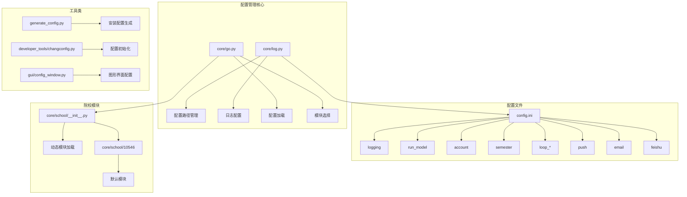
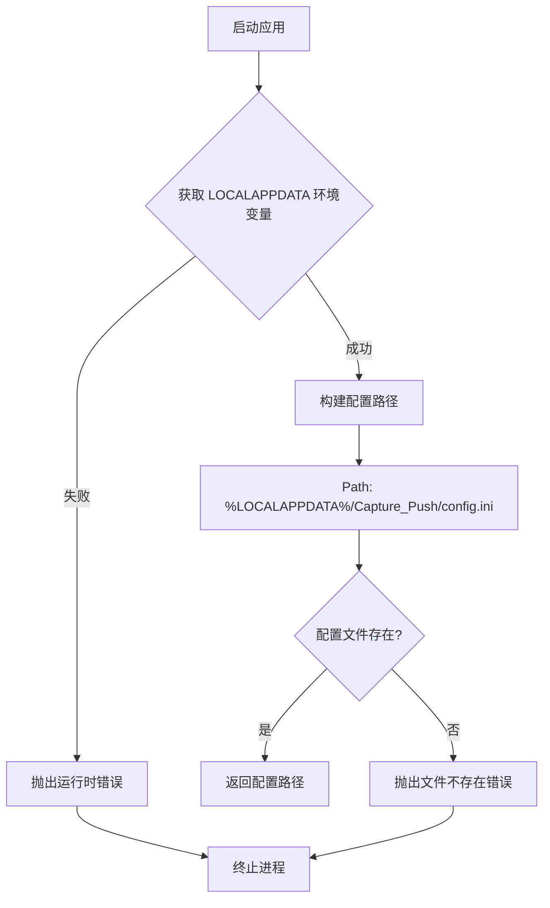
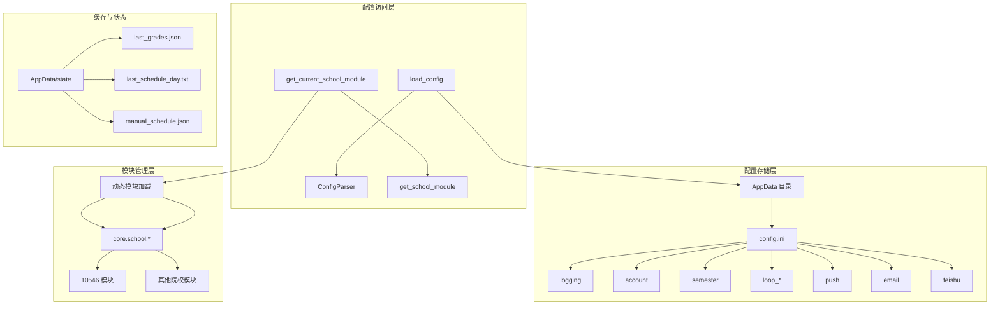
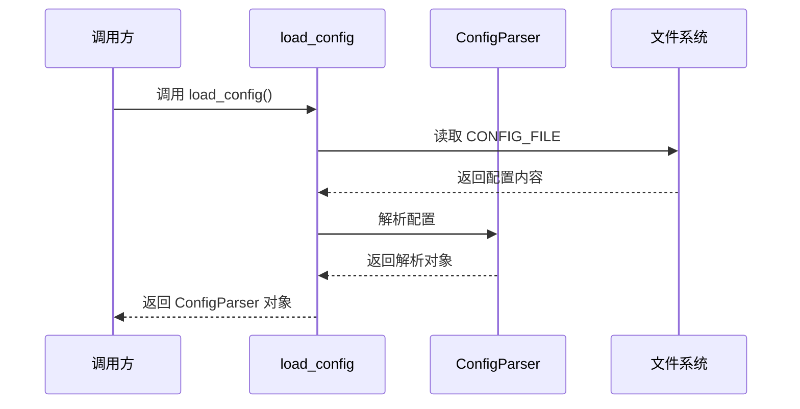
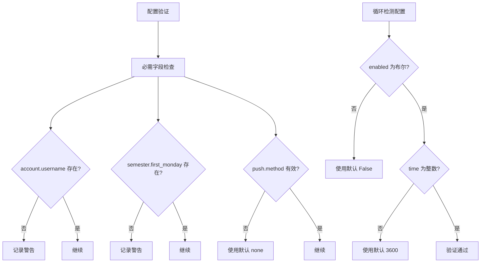
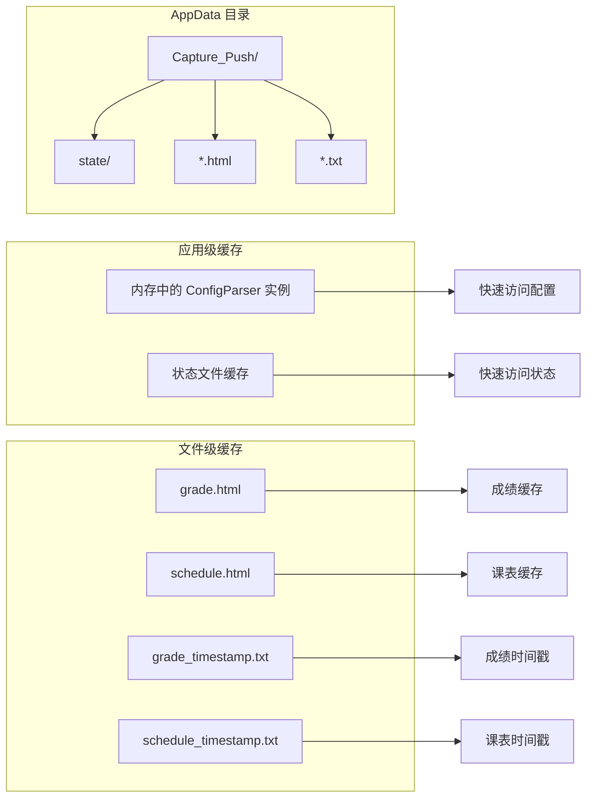
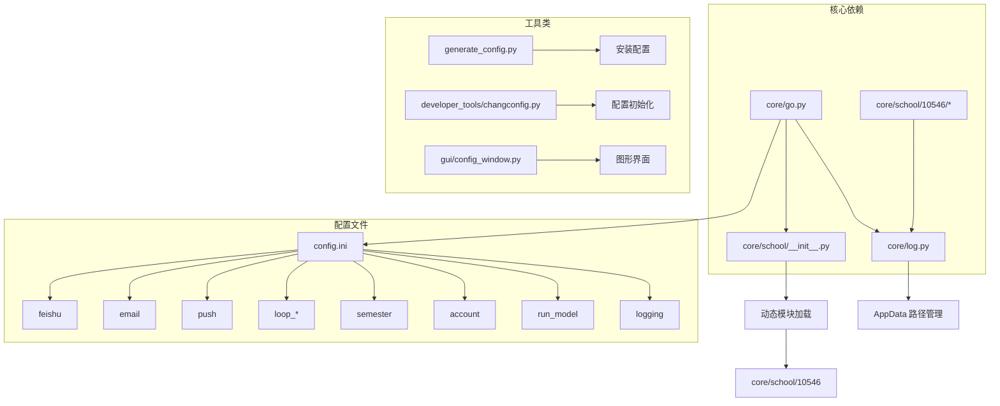
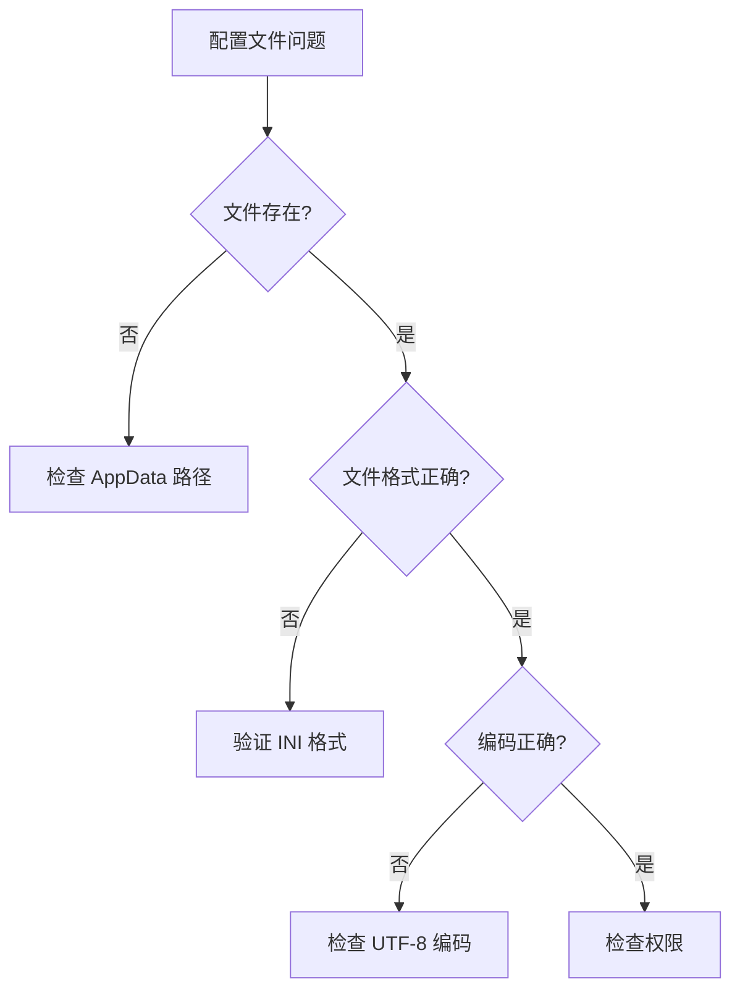
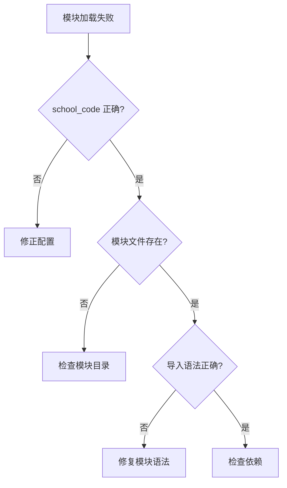

# 配置管理函数

<cite>
**本文引用的文件**
- [config.ini](file://config.ini)
- [config.md](file://config.md)
- [generate_config.py](file://generate_config.py)
- [developer_tools/changconfig.py](file://developer_tools/changconfig.py)
- [core/log.py](file://core/log.py)
- [core/go.py](file://core/go.py)
- [core/school/__init__.py](file://core/school/__init__.py)
- [core/school/10546/__init__.py](file://core/school/10546/__init__.py)
- [core/school/10546/getCourseGrades.py](file://core/school/10546/getCourseGrades.py)
- [core/school/10546/getCourseSchedule.py](file://core/school/10546/getCourseSchedule.py)
- [gui/config_window.py](file://gui/config_window.py)
</cite>

## 目录
1. [简介](#简介)
2. [项目结构](#项目结构)
3. [核心组件](#核心组件)
4. [架构概览](#架构概览)
5. [详细组件分析](#详细组件分析)
6. [依赖关系分析](#依赖关系分析)
7. [性能考虑](#性能考虑)
8. [故障排除指南](#故障排除指南)
9. [结论](#结论)
10. [附录](#附录)

## 简介
本文档详细记录了配置管理函数的API规范，重点涵盖以下核心函数：
- `load_config`: 配置文件加载机制
- `get_current_school_module`: 根据 school_code 动态加载院校模块及回退机制
- 配置路径管理（AppData 目录）
- 配置项结构（account、semester 等部分）
- 配置验证逻辑和错误处理策略
- 配置缓存和重载机制

该系统采用统一的 AppData 目录配置管理模式，确保配置文件的安全性和一致性，同时提供了灵活的模块化扩展能力。

## 项目结构
配置管理系统主要分布在以下模块中：



**图表来源**
- [core/log.py](file://core/log.py#L60-L82)
- [core/go.py](file://core/go.py#L42-L57)
- [core/school/__init__.py](file://core/school/__init__.py#L22-L28)

**章节来源**
- [core/log.py](file://core/log.py#L1-L211)
- [core/go.py](file://core/go.py#L1-L536)
- [config.ini](file://config.ini#L1-L36)

## 核心组件

### 配置文件结构
系统使用标准的 INI 格式配置文件，包含以下主要部分：

| 配置部分 | 必填 | 描述 | 默认值 |
|---------|------|------|--------|
| `[logging]` | 是 | 日志级别配置 | level=INFO |
| `[run_model]` | 是 | 运行模式配置 | model=BUILD |
| `[account]` | 是 | 用户账户信息 | school_code=10546 |
| `[semester]` | 是 | 学期信息 | first_monday=YYYY-MM-DD |
| `[loop_getCourseGrades]` | 否 | 成绩循环检测 | enabled=False, time=3600 |
| `[loop_getCourseSchedule]` | 否 | 课表循环检测 | enabled=False, time=3600 |
| `[push]` | 否 | 推送方式配置 | method=none |
| `[email]` | 取决于推送方式 | 邮件推送配置 | - |
| `[feishu]` | 取决于推送方式 | 飞书推送配置 | - |

**章节来源**
- [config.ini](file://config.ini#L1-L36)
- [config.md](file://config.md#L1-L52)

### 配置路径管理
系统采用统一的 AppData 目录管理策略：



**图表来源**
- [core/log.py](file://core/log.py#L60-L82)

**章节来源**
- [core/log.py](file://core/log.py#L60-L82)

## 架构概览



**图表来源**
- [core/go.py](file://core/go.py#L42-L57)
- [core/school/__init__.py](file://core/school/__init__.py#L22-L28)

## 详细组件分析

### load_config 函数

#### 函数签名与行为


**图表来源**
- [core/go.py](file://core/go.py#L42-L45)

#### 实现细节
- **输入**: 无参数
- **输出**: configparser.ConfigParser 对象
- **编码**: UTF-8
- **错误处理**: 直接抛出异常（不进行内部捕获）

#### 性能特征
- 时间复杂度: O(n)，其中 n 为配置文件大小
- 空间复杂度: O(n)
- 缓存策略: 每次调用重新解析文件

**章节来源**
- [core/go.py](file://core/go.py#L42-L45)

### get_current_school_module 函数

#### 函数签名与行为
```mermaid
flowchart TD
A[调用 get_current_school_module] --> B[load_config]
B --> C[读取 account.school_code]
C --> D{school_code 存在?}
D --> |是| E[get_school_module(school_code)]
D --> |否| F[使用默认 10546]
E --> G{模块存在?}
G --> |是| H[返回模块]
G --> |否| I[回退到 10546]
F --> I
I --> J{回退成功?}
J --> |是| H
J --> |否| K[返回 None]
```

**图表来源**
- [core/go.py](file://core/go.py#L49-L57)
- [core/school/__init__.py](file://core/school/__init__.py#L22-L28)

#### 实现细节
- **输入**: 无参数
- **输出**: 院校模块对象或 None
- **回退机制**: 
  - 首先尝试配置中的 school_code
  - 若失败，自动回退到默认模块 10546
  - 若回退也失败，返回 None

#### 错误处理策略
- 配置读取异常会传播到调用方
- 模块加载失败记录错误日志
- 回退过程中的异常同样传播

**章节来源**
- [core/go.py](file://core/go.py#L49-L57)
- [core/school/__init__.py](file://core/school/__init__.py#L22-L28)

### 配置验证逻辑

#### 核心验证规则


**图表来源**
- [core/go.py](file://core/go.py#L94-L96)
- [core/go.py](file://core/go.py#L187-L190)

#### 验证策略
- **必需性**: account 和 semester 部分为必需
- **类型安全**: 使用 configparser 的类型转换方法
- **回退机制**: 所有配置项都有合理的默认值
- **日志记录**: 验证失败时记录详细信息

**章节来源**
- [core/go.py](file://core/go.py#L94-L96)
- [core/go.py](file://core/go.py#L187-L190)

### 配置缓存和重载机制

#### 缓存策略
系统在不同层面实现了缓存机制：



**图表来源**
- [core/school/10546/getCourseGrades.py](file://core/school/10546/getCourseGrades.py#L126-L156)
- [core/school/10546/getCourseSchedule.py](file://core/school/10546/getCourseSchedule.py#L127-L157)

#### 缓存实现细节
- **内存缓存**: ConfigParser 实例在进程生命周期内复用
- **文件缓存**: HTML 页面和时间戳文件存储在 AppData 目录
- **时间控制**: 基于配置的时间间隔控制缓存刷新
- **DEV 模式**: 开发模式下强制使用缓存文件

**章节来源**
- [core/school/10546/getCourseGrades.py](file://core/school/10546/getCourseGrades.py#L117-L156)
- [core/school/10546/getCourseSchedule.py](file://core/school/10546/getCourseSchedule.py#L118-L157)

## 依赖关系分析



**图表来源**
- [core/go.py](file://core/go.py#L15-L19)
- [core/log.py](file://core/log.py#L60-L82)

### 组件耦合度
- **低耦合**: 配置管理与业务逻辑分离
- **高内聚**: 相关配置操作集中在单一模块
- **清晰边界**: 每个函数职责单一明确

**章节来源**
- [core/go.py](file://core/go.py#L15-L19)
- [core/log.py](file://core/log.py#L60-L82)

## 性能考虑

### 配置访问优化
- **延迟加载**: 配置文件只在首次访问时读取
- **内存复用**: ConfigParser 实例在进程内复用
- **增量解析**: 按需解析特定配置项而非整文件

### 缓存策略优化
- **智能过期**: 基于时间戳的缓存失效机制
- **空间控制**: 自动清理旧日志文件，限制总大小
- **并发安全**: 文件锁机制防止并发写入冲突

### 最佳实践建议
1. **配置文件权限**: 确保配置文件具有适当的文件权限
2. **编码一致性**: 统一使用 UTF-8 编码
3. **路径安全性**: 避免使用相对路径，始终使用绝对路径
4. **错误监控**: 实施完善的错误监控和告警机制

## 故障排除指南

### 常见问题诊断

#### 配置文件相关问题


#### 模块加载问题


### 错误处理策略
- **致命错误**: 配置文件缺失或 AppData 路径不可用
- **可恢复错误**: 配置项缺失或格式错误，使用默认值
- **警告信息**: 非关键问题，不影响系统运行

**章节来源**
- [core/log.py](file://core/log.py#L72-L82)
- [core/go.py](file://core/go.py#L54-L56)

## 结论

配置管理系统通过以下设计实现了高效、可靠的配置管理：

1. **统一路径管理**: 基于 AppData 的标准化配置存储
2. **模块化架构**: 支持动态加载不同院校的模块
3. **健壮的错误处理**: 完善的回退机制和错误报告
4. **智能缓存策略**: 多层次的缓存机制提升性能
5. **灵活的配置验证**: 类型安全和默认值机制

该系统为后续的功能扩展提供了良好的基础，特别是对于新增院校模块和推送方式的支持。

## 附录

### 配置文件格式示例

完整的配置文件示例包含以下关键部分：

```ini
[logging]
level = DEBUG

[run_model]
model = BUILD

[account]
school_code = 10546
username = 
password = 

[semester]
first_monday = 2026-02-24

[loop_getCourseGrades]
enabled = False
time = 3600

[loop_getCourseSchedule]
enabled = False
time = 3600

[push]
method = none

[email]
smtp = smtp.example.com
port = 465
sender = your_email@example.com
receiver = target_email@example.com
auth = your_email_password_or_auth_code

[feishu]
webhook_url = https://open.feishu.cn/open-apis/bot/v2/hook/****
secret = 
```

### 最佳实践建议

1. **配置文件管理**
   - 使用版本控制系统管理配置文件
   - 为不同环境维护独立的配置文件
   - 定期备份配置文件

2. **安全性考虑**
   - 敏感信息（密码、密钥）使用环境变量或加密存储
   - 限制配置文件的文件权限
   - 定期轮换认证凭据

3. **监控和日志**
   - 启用详细的日志记录
   - 实施配置变更审计
   - 建立配置有效性检查机制

4. **扩展性设计**
   - 为新功能预留配置项
   - 保持配置格式向后兼容
   - 提供配置迁移工具