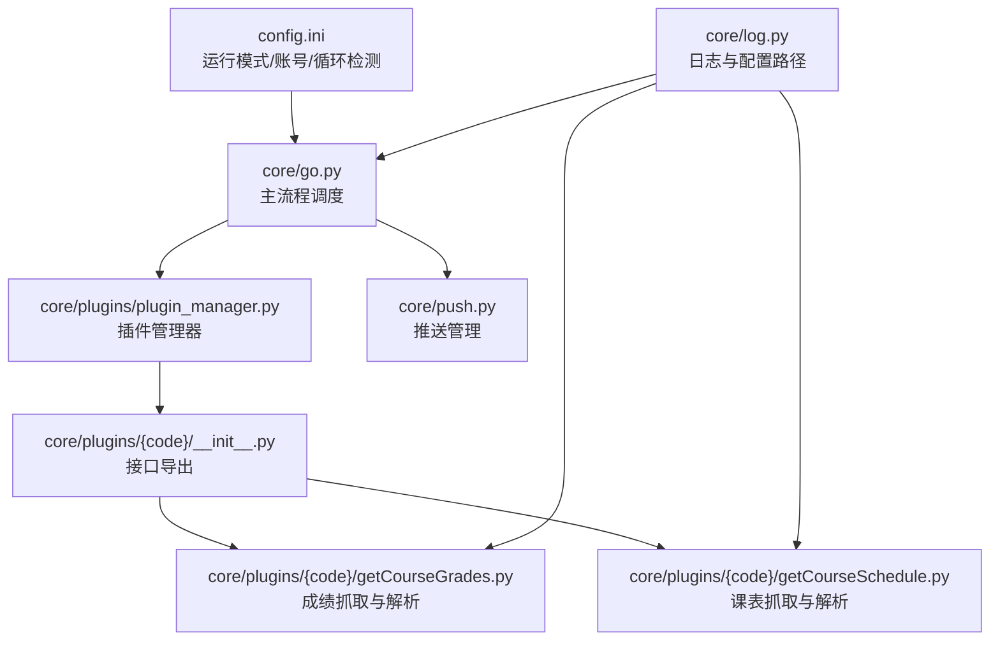
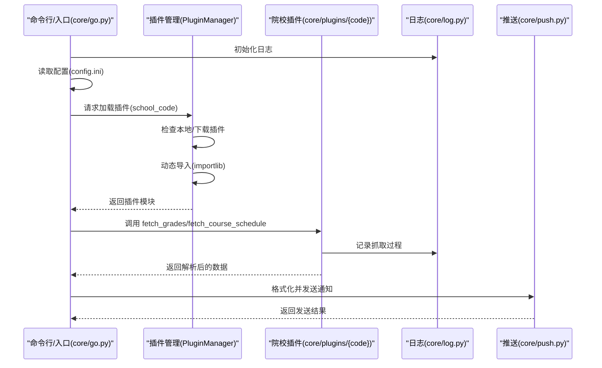

# 扩展开发指南

<cite>
**本文引用的文件**
- [core/plugins/plugin_manager.py](file://core/plugins/plugin_manager.py)
- [core/plugins/10546/__init__.py](file://core/plugins/10546/__init__.py)
- [core/plugins/10546/getCourseGrades.py](file://core/plugins/10546/getCourseGrades.py)
- [core/plugins/10546/getCourseSchedule.py](file://core/plugins/10546/getCourseSchedule.py)
- [core/log.py](file://core/log.py)
- [core/push.py](file://core/push.py)
- [core/go.py](file://core/go.py)
- [config.ini](file://config.ini)
- [README.md](file://README.md)
- [requirements.txt](file://requirements.txt)
</cite>

## 目录
1. [简介](#简介)
2. [项目结构](#项目结构)
3. [核心组件](#核心组件)
4. [架构总览](#架构总览)
5. [详细组件分析](#详细组件分析)
6. [依赖关系分析](#依赖关系分析)
7. [性能考虑](#性能考虑)
8. [故障排查指南](#故障排查指南)
9. [结论](#结论)
10. [附录](#附录)

## 简介
本指南面向希望为 Capture_Push 系统添加“新院校模块”的开发者，提供从目录结构、文件命名、模块初始化、方法实现、测试验证到集成部署的全流程说明。文档还解释了基于插件系统的模块发现机制与动态加载原理，帮助你理解系统如何识别与加载新模块。

## 项目结构
- 院校模块作为**插件**位于 `core/plugins/` 下，采用“按院校代码命名的子包”组织方式。
- 核心插件管理逻辑集中在 `core/plugins/plugin_manager.py` 中，负责插件的发现、加载、更新（支持从 GitHub 获取）与版本管理。
- 配置文件 `config.ini` 提供运行模式、账号、循环检测等关键开关，影响模块行为与缓存策略。
- 日志系统统一使用 `core/log.py`，确保跨模块一致的记录与归档能力。
- 主执行入口 `core/go.py` 通过 `PluginManager` 加载当前配置的院校模块，并协调抓取与推送流程。

## 核心组件
- **插件管理器 (PluginManager)**
  - `load_plugin(school_code)`: 根据院校代码动态加载插件。会自动检查本地是否存在，若不存在尝试从 GitHub 下载。
  - `get_available_plugins()`: 扫描本地 `core/plugins` 目录，返回可用插件列表。
  - `install_plugin(school_code)`: 从远程仓库下载并安装插件。
- **院校插件接口**
  - 每个院校插件包需在 `__init__.py` 中导出 `fetch_grades` 与 `fetch_course_schedule` 两个函数。
  - `__init__.py` 还需定义 `SCHOOL_NAME` (学校名称), `SCHOOL_CODE` (代码), `PLUGIN_VERSION` (版本号) 等常量。
- **日志与配置**
  - 统一使用 `core/log.py` 提供的 `init_logger`, `get_config_path`, `get_log_file_path` 等工具。
- **主流程调度**
  - `core/go.py` 读取 `config.ini`，通过 `PluginManager` 获取当前院校模块实例，调用其接口抓取数据。

## 架构总览
系统通过“插件化架构 + 统一接口 + 配置驱动”的方式实现多院校扩展。

## 详细组件分析

### 插件发现与动态加载
- **发现逻辑**: `PluginManager` 扫描 `core/plugins` 目录下的子目录，识别包含 `__init__.py` 的包。
- **加载逻辑**: 使用 `importlib.import_module` 动态导入插件包。
- **版本控制**: 插件通过 `PLUGIN_VERSION` 标识版本，`PluginManager` 可对接 GitHub API 检查更新。

### 院校模块接口与数据规范
- **必备文件**:
  - `core/plugins/{code}/__init__.py`: 导出接口与元数据。
  - `core/plugins/{code}/getCourseGrades.py`: 实现 `fetch_grades`。
  - `core/plugins/{code}/getCourseSchedule.py`: 实现 `fetch_course_schedule`。
- **元数据常量 (`__init__.py`)**:
  - `SCHOOL_NAME`: 字符串，学校全称。
  - `SCHOOL_CODE`: 字符串，学校代码。
  - `PLUGIN_VERSION`: 字符串，插件版本（如 "1.0.0"）。
- **函数签名**:
  - `fetch_grades(username, password, force_update=False)`: 返回成绩列表。
  - `fetch_course_schedule(username, password, force_update=False)`: 返回课表列表。

### 开发步骤与最佳实践
1. **创建目录**: 在 `core/plugins/` 下创建以“院校代码”命名的目录（如 `10001`）。
2. **实现逻辑**:
   - 创建 `__init__.py`，定义常量并导出函数。
   - 创建 `getCourseGrades.py` 和 `getCourseSchedule.py` 实现具体抓取逻辑。
3. **本地测试**:
   - 修改 `config.ini` 中的 `school_code` 为新插件代码。
   - 使用 `python main.py --fetch-grade` 等命令测试。
4. **发布**:
   - 将插件目录提交到项目仓库或通过 Pull Request 贡献。

## 依赖关系分析
- **核心依赖**: `core/go.py` -> `core/plugins/plugin_manager.py` -> 具体插件。
- **工具依赖**: 插件依赖 `core/log.py` 进行日志记录。
- **外部库**: `requests`, `beautifulsoup4` (常用), `lxml` 等。

## 性能考虑
- **网络请求**: 建议使用 `requests.Session` 维持会话，减少连接开销。
- **缓存机制**: 插件应自行实现或利用 `force_update` 参数控制是否读取本地缓存（如 HTML 文件）。
- **按需加载**: `PluginManager` 仅加载当前配置的院校插件，避免资源浪费。

## 故障排查指南
- **插件加载失败**:
  - 检查 `core/plugins/{code}` 目录下是否有 `__init__.py`。
  - 检查 `__init__.py` 是否定义了必要的常量 (`SCHOOL_NAME` 等)。
  - 检查依赖库是否已安装。
- **更新失败**:
  - 检查网络连接。
  - 检查 GitHub API 访问限制（如果启用了自动更新）。

## 结论
Capture_Push 的插件系统使得院校扩展变得简单且独立。开发者只需关注特定院校的教务系统逻辑，遵循简单的接口规范即可无缝集成到主程序中。

## 附录
- **命令行参数**:
  - `--fetch-grade`: 仅抓取成绩
  - `--push-grade`: 推送成绩
  - `--fetch-schedule`: 仅抓取课表
  - `--push-today`: 推送今日课表
  - `--update-plugin`: 强制更新当前插件 (如果支持)
