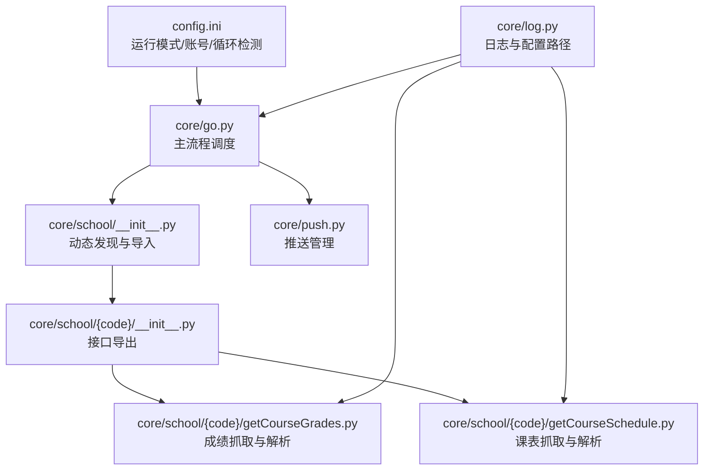
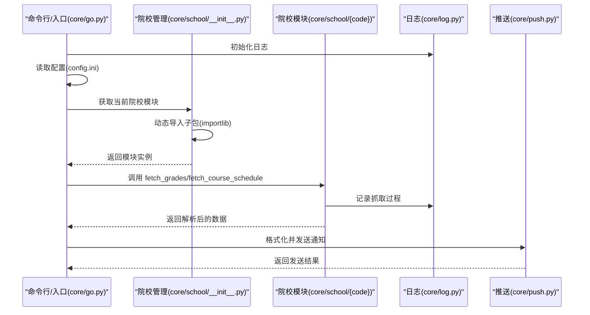
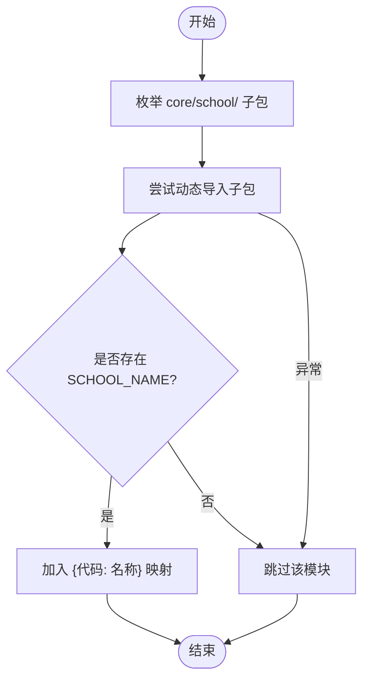
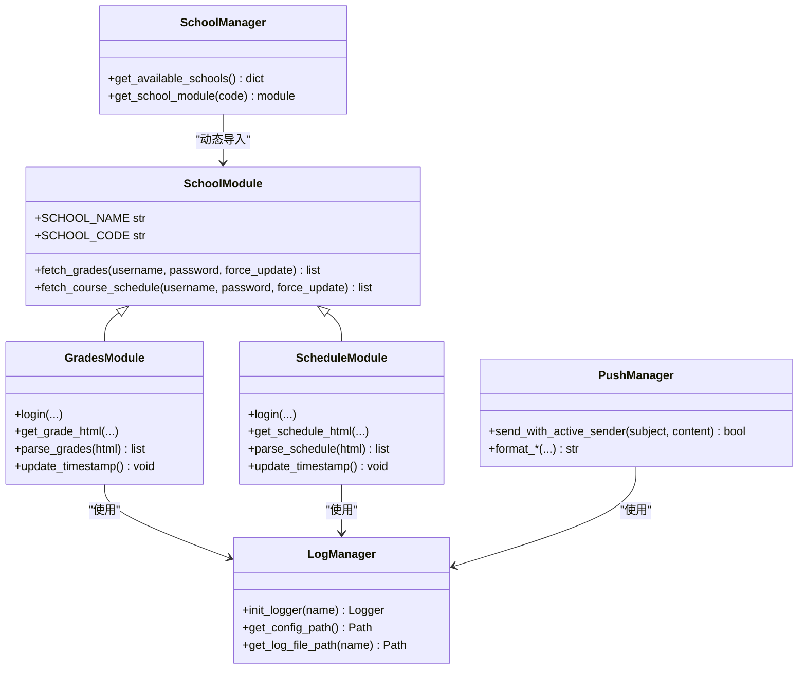
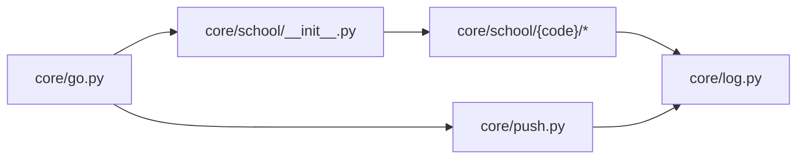

# 扩展开发指南

<cite>
**本文引用的文件**
- [core/school/__init__.py](file://core/school/__init__.py)
- [core/school/10546/__init__.py](file://core/school/10546/__init__.py)
- [core/school/10546/getCourseGrades.py](file://core/school/10546/getCourseGrades.py)
- [core/school/10546/getCourseSchedule.py](file://core/school/10546/getCourseSchedule.py)
- [core/log.py](file://core/log.py)
- [core/push.py](file://core/push.py)
- [core/go.py](file://core/go.py)
- [config.ini](file://config.ini)
- [developer_tools/EXTENSION_GUIDE.md](file://developer_tools/EXTENSION_GUIDE.md)
- [developer_tools/register_or_undo.py](file://developer_tools/register_or_undo.py)
- [README.md](file://README.md)
- [requirements.txt](file://requirements.txt)
</cite>

## 目录
1. [简介](#简介)
2. [项目结构](#项目结构)
3. [核心组件](#核心组件)
4. [架构总览](#架构总览)
5. [详细组件分析](#详细组件分析)
6. [依赖关系分析](#依赖关系分析)
7. [性能考虑](#性能考虑)
8. [故障排查指南](#故障排查指南)
9. [结论](#结论)
10. [附录](#附录)

## 简介
本指南面向希望为 Capture_Push 系统添加“新院校模块”的开发者，提供从目录结构、文件命名、模块初始化、方法实现、测试验证到集成部署的全流程说明。文档还解释了模块发现机制与动态导入原理，帮助你理解系统如何识别与加载新模块；并给出调试技巧与性能优化建议。

## 项目结构
- 院校模块位于 core/school/ 下，采用“按院校代码命名的子包”组织方式，每个子包包含统一的接口文件与实现文件。
- 核心入口与动态发现逻辑集中在 core/school/__init__.py 中，通过 pkgutil 与 importlib 实现动态扫描与导入。
- 配置文件 config.ini 提供运行模式、账号、循环检测等关键开关，影响模块行为与缓存策略。
- 日志系统统一使用 core/log.py，确保跨模块一致的记录与归档能力。
- 主执行入口 core/go.py 负责加载配置、选择当前院校模块并协调抓取与推送流程。

图表来源
- [core/school/__init__.py](file://core/school/__init__.py#L6-L28)
- [core/school/10546/__init__.py](file://core/school/10546/__init__.py#L1-L7)
- [core/school/10546/getCourseGrades.py](file://core/school/10546/getCourseGrades.py#L1-L329)
- [core/school/10546/getCourseSchedule.py](file://core/school/10546/getCourseSchedule.py#L1-L405)
- [core/go.py](file://core/go.py#L1-L536)
- [core/push.py](file://core/push.py#L1-L319)
- [config.ini](file://config.ini#L1-L36)
- [core/log.py](file://core/log.py#L1-L211)

章节来源
- [README.md](file://README.md#L60-L83)
- [core/school/__init__.py](file://core/school/__init__.py#L6-L28)
- [config.ini](file://config.ini#L1-L36)

## 核心组件
- 院校模块发现与导入
  - get_available_schools：遍历 core/school/ 目录，动态导入子包并读取模块内的 SCHOOL_NAME 常量，形成“代码→名称”的映射。
  - get_school_module：根据传入的院校代码动态导入对应模块，失败时返回 None。
- 院校模块接口
  - 每个院校子包需导出 fetch_grades 与 fetch_course_schedule 两个函数，分别用于获取成绩与课表。
  - 子包 __init__.py 还需导出 SCHOOL_NAME 与 SCHOOL_CODE 常量，便于展示与识别。
- 日志与配置
  - 统一使用 core/log.py 提供的 init_logger、get_config_path、get_log_file_path 等工具，保证日志与配置路径在打包后仍可用。
- 主流程调度
  - core/go.py 读取 config.ini，选择当前院校模块，调用其接口抓取数据，并通过 core/push.py 进行格式化与推送。

章节来源
- [core/school/__init__.py](file://core/school/__init__.py#L6-L28)
- [core/school/10546/__init__.py](file://core/school/10546/__init__.py#L1-L7)
- [core/school/10546/getCourseGrades.py](file://core/school/10546/getCourseGrades.py#L278-L296)
- [core/school/10546/getCourseSchedule.py](file://core/school/10546/getCourseSchedule.py#L354-L372)
- [core/log.py](file://core/log.py#L60-L82)
- [core/go.py](file://core/go.py#L48-L58)

## 架构总览
系统通过“动态发现 + 统一接口 + 配置驱动”的方式实现多院校扩展。核心流程如下：

图表来源
- [core/go.py](file://core/go.py#L48-L58)
- [core/school/__init__.py](file://core/school/__init__.py#L22-L28)
- [core/school/10546/getCourseGrades.py](file://core/school/10546/getCourseGrades.py#L278-L296)
- [core/school/10546/getCourseSchedule.py](file://core/school/10546/getCourseSchedule.py#L354-L372)
- [core/push.py](file://core/push.py#L127-L155)
- [core/log.py](file://core/log.py#L131-L195)

## 详细组件分析

### 模块发现机制与动态导入
- 发现逻辑
  - get_available_schools 遍历 core/school/ 目录，过滤出子包（非普通模块），尝试动态导入，读取模块的 SCHOOL_NAME 常量作为显示名。
- 导入逻辑
  - get_school_module 使用 importlib.import_module 按包名动态导入，失败返回 None。
- 设计要点
  - 通过 __init__.py 的常量暴露模块元信息，避免硬编码。
  - 异常捕获确保发现过程健壮，不影响其他模块。

图表来源
- [core/school/__init__.py](file://core/school/__init__.py#L6-L20)

章节来源
- [core/school/__init__.py](file://core/school/__init__.py#L6-L28)

### 院校模块接口与数据规范
- 必备文件
  - core/school/{code}/__init__.py：导出 fetch_grades、fetch_course_schedule，并定义 SCHOOL_NAME、SCHOOL_CODE。
  - core/school/{code}/getCourseGrades.py：实现 fetch_grades(username, password, force_update=False)，返回成绩列表。
  - core/school/{code}/getCourseSchedule.py：实现 fetch_course_schedule(username, password, force_update=False)，返回课表列表。
- 数据规范
  - 成绩：列表项需包含“课程名称、成绩、学分、课程属性、学期”等字段。
  - 课表：列表项需包含“星期（1-7）、开始小节、结束小节、课程名称、教室、教师、周次列表（int列表）”等字段。
- 运行模式与缓存
  - 通过 config.ini 的 run_model.model 控制 DEV/BUILD 模式，影响是否读取本地缓存或强制网络请求。
  - 模块内部维护 grade.html/schedule.html 与对应的时间戳文件，配合循环检测配置实现增量更新。

章节来源
- [developer_tools/EXTENSION_GUIDE.md](file://developer_tools/EXTENSION_GUIDE.md#L70-L96)
- [core/school/10546/__init__.py](file://core/school/10546/__init__.py#L1-L7)
- [core/school/10546/getCourseGrades.py](file://core/school/10546/getCourseGrades.py#L232-L262)
- [core/school/10546/getCourseSchedule.py](file://core/school/10546/getCourseSchedule.py#L233-L315)
- [config.ini](file://config.ini#L4-L5)

### 开发步骤与最佳实践
- 创建目录与文件
  - 在 core/school/ 下创建以“院校代码”命名的目录（如 12345）。
  - 在其中创建 __init__.py、getCourseGrades.py、getCourseSchedule.py。
- 实现接口
  - 在 __init__.py 中导出 fetch_grades、fetch_course_schedule，并设置 SCHOOL_NAME、SCHOOL_CODE。
  - 在 getCourseGrades.py 与 getCourseSchedule.py 中实现登录、抓取、解析与缓存逻辑，遵循数据规范。
- 测试验证
  - 使用 config.ini 配置 account.school_code、username、password。
  - 使用 core/go.py 的命令行参数进行功能验证（如 --fetch-grade、--push-grade、--fetch-schedule、--push-today、--push-tomorrow、--push-next-week）。
- 集成部署
  - 使用 developer_tools/register_or_undo.py 将项目根目录注册到系统环境（Windows），便于在任意位置运行。
  - 确认 requirements.txt 中新增依赖已安装。
  - 通过打包脚本生成安装包并部署。

章节来源
- [developer_tools/EXTENSION_GUIDE.md](file://developer_tools/EXTENSION_GUIDE.md#L60-L96)
- [developer_tools/register_or_undo.py](file://developer_tools/register_or_undo.py#L1-L115)
- [requirements.txt](file://requirements.txt#L1-L3)
- [core/go.py](file://core/go.py#L461-L536)

### 类与模块关系图

图表来源
- [core/school/__init__.py](file://core/school/__init__.py#L6-L28)
- [core/school/10546/__init__.py](file://core/school/10546/__init__.py#L1-L7)
- [core/school/10546/getCourseGrades.py](file://core/school/10546/getCourseGrades.py#L278-L296)
- [core/school/10546/getCourseSchedule.py](file://core/school/10546/getCourseSchedule.py#L354-L372)
- [core/log.py](file://core/log.py#L131-L195)
- [core/push.py](file://core/push.py#L127-L155)

## 依赖关系分析
- 模块耦合
  - core/go.py 依赖 core/school/__init__.py 与具体院校模块，通过统一接口解耦。
  - 院校模块依赖 core/log.py 提供的日志与配置路径，确保跨环境一致性。
  - 推送层 core/push.py 与院校模块无直接耦合，通过数据结构约定交互。
- 外部依赖
  - requests、beautifulsoup4 用于网络请求与页面解析。
  - PySide6 用于 GUI（与扩展开发关系较小）。

图表来源
- [core/go.py](file://core/go.py#L15-L22)
- [core/school/__init__.py](file://core/school/__init__.py#L1-L28)
- [core/push.py](file://core/push.py#L1-L24)
- [core/log.py](file://core/log.py#L1-L211)

章节来源
- [core/go.py](file://core/go.py#L15-L22)
- [requirements.txt](file://requirements.txt#L1-L3)

## 性能考虑
- 网络请求优化
  - 使用会话复用与连接池，减少握手开销。
  - 在 DEV 模式下优先读取本地缓存，避免频繁网络请求。
- 解析与缓存
  - 成功抓取后写入本地缓存与时间戳文件，结合循环检测配置控制刷新频率。
  - 解析阶段尽量一次性提取所需字段，减少二次处理。
- 日志与磁盘 IO
  - 使用统一日志与滚动文件，避免日志过大影响性能。
  - 合理清理旧日志，控制磁盘占用。

章节来源
- [core/school/10546/getCourseGrades.py](file://core/school/10546/getCourseGrades.py#L103-L157)
- [core/school/10546/getCourseSchedule.py](file://core/school/10546/getCourseSchedule.py#L104-L158)
- [core/log.py](file://core/log.py#L85-L112)

## 故障排查指南
- 模块未被发现
  - 检查 core/school/{code}/__init__.py 是否正确导出 fetch_grades、fetch_course_schedule，并设置 SCHOOL_NAME。
  - 确认目录为包（存在 __init__.py），且 importlib 能正常导入。
- 登录失败/验证码
  - 模块在登录失败时会记录详细信息并保存失败页面，便于定位问题。
- 缓存与循环检测
  - 若 DEV 模式下未生成缓存，需先在 BUILD 模式运行一次。
  - 检查 config.ini 中 loop_getCourseGrades/loop_getCourseSchedule 的 enabled 与 time 设置。
- 日志与崩溃报告
  - 使用 --pack-logs 生成压缩日志，便于问题复现与上报。
- 配置路径
  - 确保使用 core/log.py 提供的 get_config_path/get_log_file_path，避免打包后路径异常。

章节来源
- [core/school/__init__.py](file://core/school/__init__.py#L6-L28)
- [core/school/10546/getCourseGrades.py](file://core/school/10546/getCourseGrades.py#L80-L100)
- [core/school/10546/getCourseSchedule.py](file://core/school/10546/getCourseSchedule.py#L80-L101)
- [core/log.py](file://core/log.py#L18-L58)
- [core/go.py](file://core/go.py#L507-L514)

## 结论
通过“动态发现 + 统一接口 + 配置驱动”的架构，Capture_Push 能够以最小成本扩展新的院校模块。开发者只需遵循目录结构、文件命名与接口规范，即可快速完成模块开发、测试与集成。配合完善的日志与缓存机制，系统在稳定性与性能方面均有良好表现。

## 附录
- 命令行参数参考
  - --fetch-grade：仅抓取成绩，不推送
  - --push-grade：推送有变化的成绩
  - --push-all-grades：推送全部成绩
  - --fetch-schedule：仅抓取课表，不推送
  - --push-today：推送今日课表
  - --push-tomorrow：推送明日课表
  - --push-next-week：推送下周全周课表
  - --pack-logs：打包日志用于崩溃上报
  - --force：强制从网络更新，忽略循环检测
- 配置项参考
  - [run_model] model：DEV/BUILD
  - [account] school_code、username、password
  - [loop_getCourseGrades]/[loop_getCourseSchedule] enabled、time
  - [push] method：none/email/feishu 等

章节来源
- [core/go.py](file://core/go.py#L461-L536)
- [config.ini](file://config.ini#L4-L36)