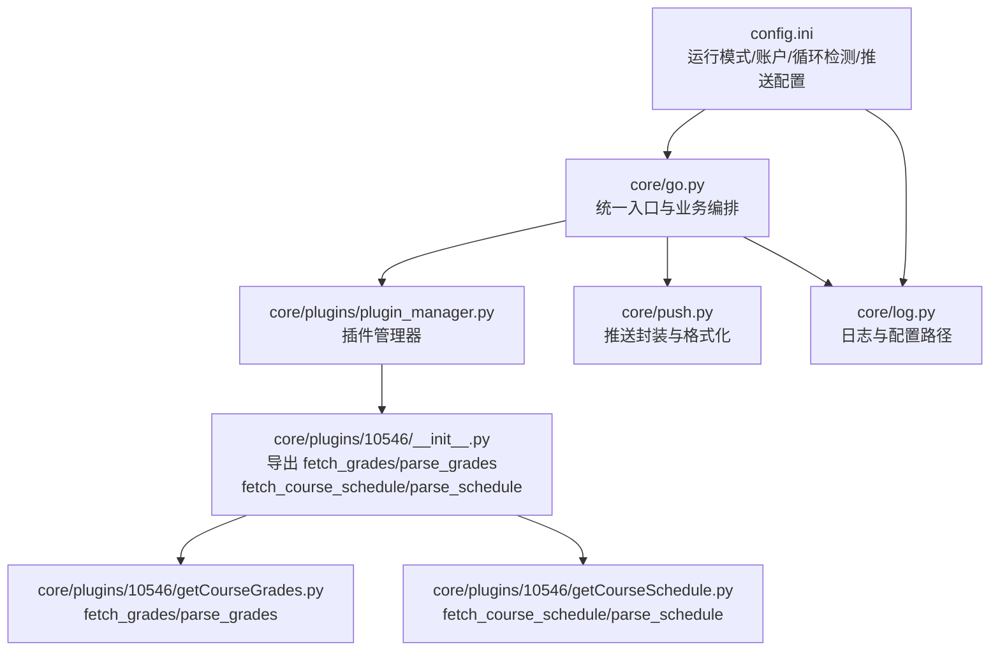
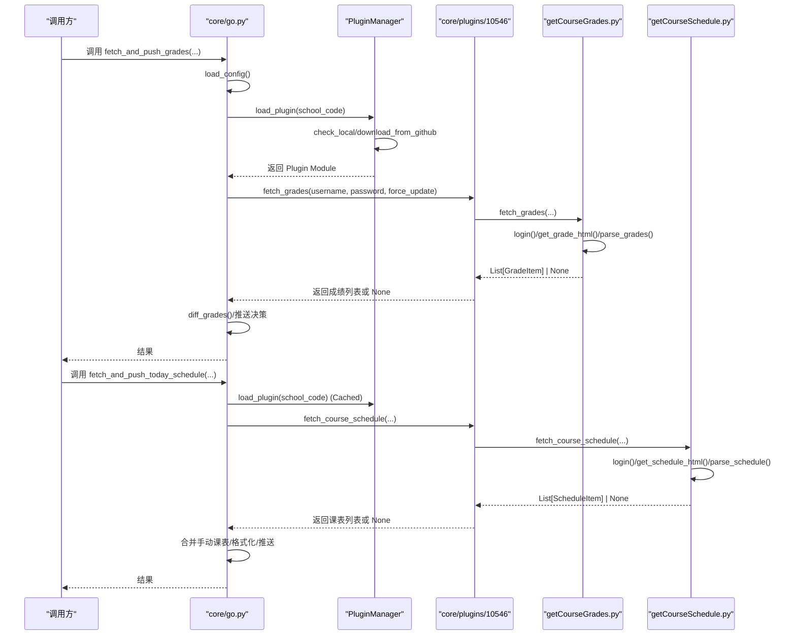
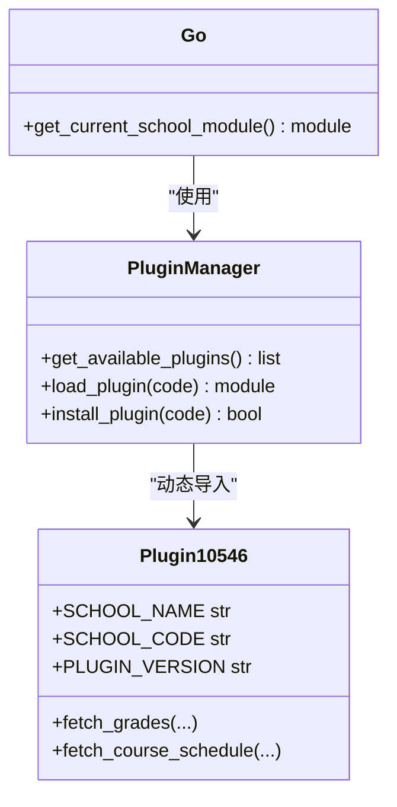
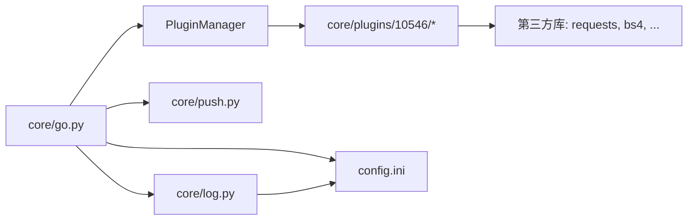

# 接口规范

<cite>
**本文引用的文件**
- [core/plugins/plugin_manager.py](file://core/plugins/plugin_manager.py)
- [core/plugins/10546/__init__.py](file://core/plugins/10546/__init__.py)
- [core/plugins/10546/getCourseGrades.py](file://core/plugins/10546/getCourseGrades.py)
- [core/plugins/10546/getCourseSchedule.py](file://core/plugins/10546/getCourseSchedule.py)
- [core/go.py](file://core/go.py)
- [core/push.py](file://core/push.py)
- [core/log.py](file://core/log.py)
- [config.ini](file://config.ini)
- [README.md](file://README.md)
</cite>

## 目录
1. [引言](#引言)
2. [项目结构](#项目结构)
3. [核心组件](#核心组件)
4. [架构总览](#架构总览)
5. [详细组件分析](#详细组件分析)
6. [依赖关系分析](#依赖关系分析)
7. [性能考量](#性能考量)
8. [故障排查指南](#故障排查指南)
9. [结论](#结论)
10. [附录](#附录)

## 引言
本文件面向“院校插件”接口规范，聚焦以下目标：
- 规范 `PluginManager` 的调用方式与插件加载流程
- 详述 `fetch_grades` 与 `fetch_course_schedule` 的参数、返回数据结构与异常处理
- 明确定义成绩与课表的数据字段
- 提供接口调用示例与错误处理最佳实践
- 解释插件发现机制与动态加载原理

## 项目结构
围绕“院校插件”的关键文件与职责如下：
- 插件管理入口：`core/plugins/plugin_manager.py` 提供 `load_plugin` 与 `get_available_plugins`
- 院校插件实现：`core/plugins/{school_code}/getCourseGrades.py` 与 `getCourseSchedule.py`
- 统一入口与业务编排：`core/go.py` 通过 `PluginManager` 加载插件并进行推送
- 推送与日志：`core/push.py`、`core/log.py`
- 配置：`config.ini`

## 核心组件
- **插件动态加载**
  - `PluginManager.load_plugin(school_code)`: 根据配置加载对应院校插件；自动处理下载与更新；失败抛出异常或返回 None
  - `PluginManager.get_available_plugins()`: 枚举当前本地可用的院校插件并返回详情列表
- **院校插件统一接口**
  - `fetch_grades(username, password, force_update=False)` -> `List[GradeItem] | None`
  - `fetch_course_schedule(username, password, force_update=False)` -> `List[ScheduleItem] | None`

## 架构总览
下图展示“统一入口 -> 插件管理器 -> 院校插件 -> 数据抓取与解析 -> 推送”的调用链路。

## 详细组件分析

### PluginManager 接口规范
- **功能**
  - 负责插件的生命周期管理：发现、下载、更新、加载。
  - 封装了对 GitHub API 的调用以获取插件更新。
- **主要方法**
  - `load_plugin(school_code)`: 加载指定代码的插件。
  - `get_available_plugins()`: 返回本地已安装插件列表。
  - `install_plugin(school_code)`: 安装/更新插件。
- **异常处理**
  - 插件不存在或加载失败时抛出明确异常。

### fetch_grades 接口规范
- **功能**
  - 获取并解析成绩数据
- **参数**
  - `username`: 学号
  - `password`: 密码
  - `force_update`: 是否强制从网络更新（忽略循环检测）
- **返回**
  - `List[GradeItem] | None`
    - **GradeItem 字段**:
      - 课程编号: `str`
      - 课程名称: `str`
      - 成绩: `str`
      - 学期: `str`
      - 课程属性: `str`
      - 学分: `str`
- **异常处理**
  - 登录失败/网络异常/解析失败均返回 None
  - 日志记录详细错误信息

### fetch_course_schedule 接口规范
- **功能**
  - 获取并解析课表数据
- **参数**
  - `username`: 学号
  - `password`: 密码
  - `force_update`: 是否强制从网络更新（忽略循环检测）
- **返回**
  - `List[ScheduleItem] | None`
    - **ScheduleItem 字段**:
      - 星期: `int` (1-7)
      - 开始小节: `int`
      - 结束小节: `int`
      - 课程名称: `str`
      - 教师: `str`
      - 教室: `str`
      - 周次列表: `List[int|"全学期"]`（去重并排序）
- **异常处理**
  - 登录失败/网络异常/解析失败均返回 None
  - 日志记录详细错误信息

### 数据结构定义
- **成绩数据（GradeItem）**: 字典或对象，包含课程基础信息与成绩。
- **课表数据（ScheduleItem）**: 字典或对象，包含课程时间地点信息。

### 模块导入机制与动态加载原理
- **动态导入**: 使用 `importlib.import_module` 动态导入 `core.plugins.{school_code}` 包。
- **自动枚举**: 扫描 `core/plugins` 目录，识别包含 `__init__.py` 的子目录。
- **元数据读取**: 读取插件包 `__init__.py` 中的 `SCHOOL_NAME`, `PLUGIN_VERSION` 等常量。

## 依赖关系分析
- **统一入口依赖**
  - `core/go.py` 依赖 `core/plugins/plugin_manager.py` 获取插件。
  - 依赖 `core/push.py` 进行推送。
  - 依赖 `core/log.py` 获取配置路径与日志。
- **院校插件依赖**
  - 插件依赖 `requests`, `BeautifulSoup` 等第三方库。
  - 依赖 `core/log.py` 进行日志记录。
- **配置依赖**
  - `config.ini` 提供全局配置。

## 性能考量
- **缓存优先**: 在 DEV 模式或非强制更新时，优先读取本地 HTML 缓存。
- **按需加载**: `PluginManager` 仅加载需要的插件模块，不预加载所有插件。
- **连接复用**: 建议插件内部使用 `requests.Session` 复用 TCP 连接。

## 故障排查指南
- **常见问题**:
  - **插件未找到**: 检查 `school_code` 配置是否正确，插件目录是否存在。
  - **加载失败**: 检查插件 `__init__.py` 是否规范，依赖是否满足。
  - **数据解析错误**: 检查教务系统页面是否变更，开启 `SAVE_FAILED_HTML` 查看原始响应。
- **日志**:
  - 检查 `AppData/Capture_Push` 下的日志文件。

## 结论
- 本规范明确了基于插件系统的院校模块开发标准。
- 通过 `PluginManager` 实现了插件的解耦与动态管理。
- 统一的接口定义确保了主程序与插件的稳定交互。

## 附录
- **配置项参考**:
  - `[account] school_code`: 决定加载哪个插件。
  - `[run_model] model`: 影响缓存策略。
