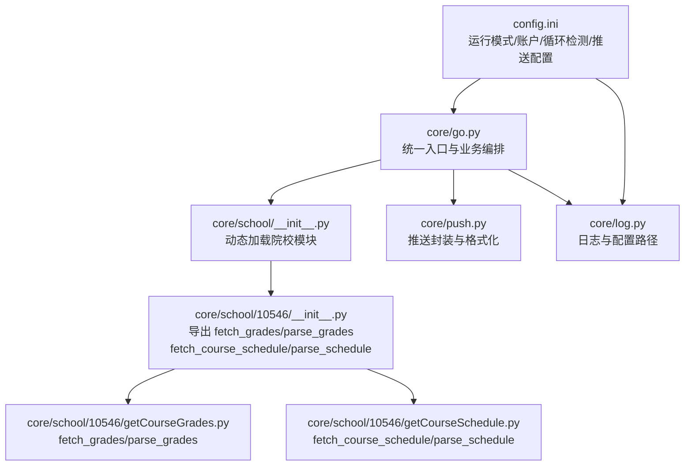
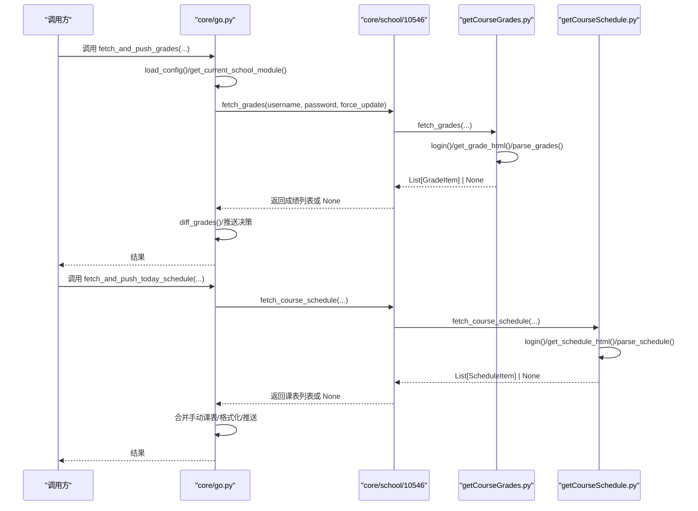
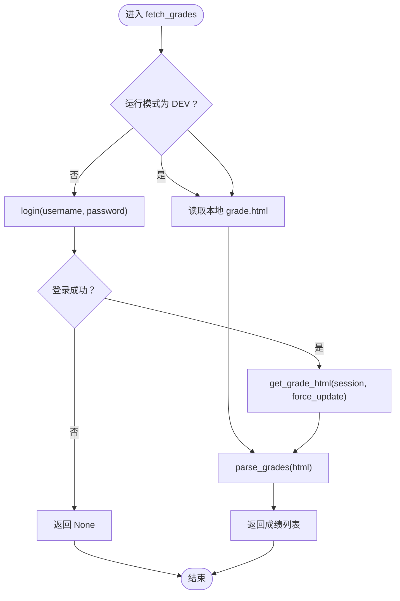
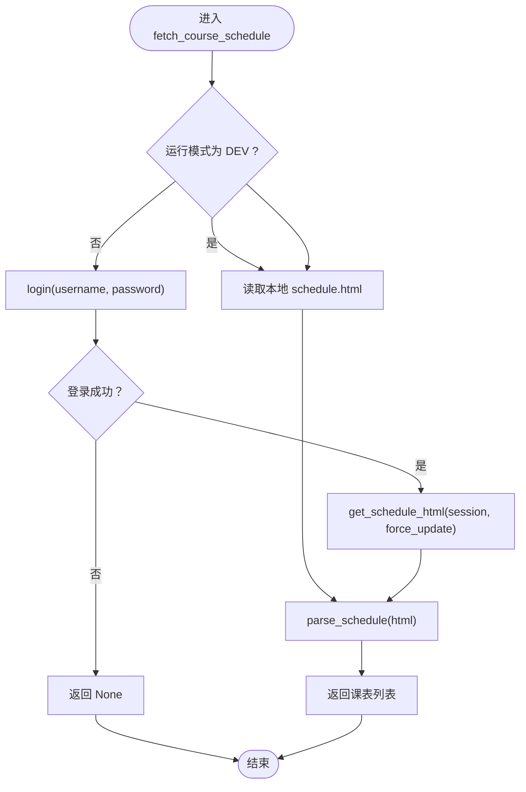
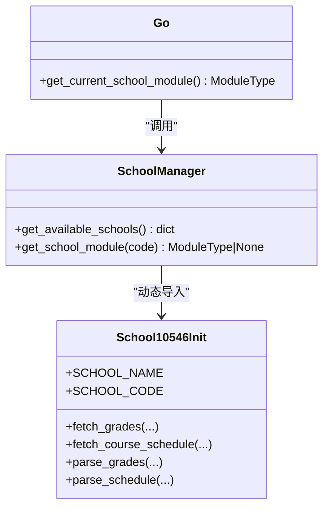
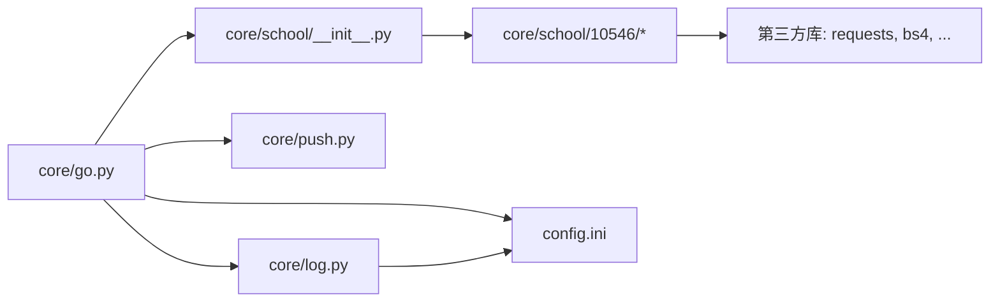

# 接口规范

<cite>
**本文引用的文件**
- [core/school/__init__.py](file://core/school/__init__.py)
- [core/school/10546/__init__.py](file://core/school/10546/__init__.py)
- [core/school/10546/getCourseGrades.py](file://core/school/10546/getCourseGrades.py)
- [core/school/10546/getCourseSchedule.py](file://core/school/10546/getCourseSchedule.py)
- [core/go.py](file://core/go.py)
- [core/push.py](file://core/push.py)
- [core/log.py](file://core/log.py)
- [config.ini](file://config.ini)
- [README.md](file://README.md)
</cite>

## 目录
1. [引言](#引言)
2. [项目结构](#项目结构)
3. [核心组件](#核心组件)
4. [架构总览](#架构总览)
5. [详细组件分析](#详细组件分析)
6. [依赖关系分析](#依赖关系分析)
7. [性能考量](#性能考量)
8. [故障排查指南](#故障排查指南)
9. [结论](#结论)
10. [附录](#附录)

## 引言
本文件面向“院校模块”接口规范，聚焦以下目标：
- 规范 get_school_module 的调用方式与返回值
- 详述 fetch_grades 与 fetch_course_schedule 的参数、返回数据结构与异常处理
- 明确定义成绩与课表的数据字段
- 提供接口调用示例与错误处理最佳实践
- 解释模块导入机制与动态加载原理

## 项目结构
围绕“院校模块”的关键文件与职责如下：
- 院校管理入口：core/school/__init__.py 提供 get_school_module 与 get_available_schools
- 院校实现：core/school/{school_code}/getCourseGrades.py 与 getCourseSchedule.py
- 统一入口与业务编排：core/go.py 调用院校模块并进行推送
- 推送与日志：core/push.py、core/log.py
- 配置：config.ini

图表来源
- [core/go.py](file://core/go.py#L48-L57)
- [core/school/__init__.py](file://core/school/__init__.py#L6-L27)
- [core/school/10546/__init__.py](file://core/school/10546/__init__.py#L1-L7)
- [core/school/10546/getCourseGrades.py](file://core/school/10546/getCourseGrades.py#L278-L295)
- [core/school/10546/getCourseSchedule.py](file://core/school/10546/getCourseSchedule.py#L354-L371)
- [core/push.py](file://core/push.py#L290-L318)
- [core/log.py](file://core/log.py#L60-L82)
- [config.ini](file://config.ini#L4-L21)

章节来源
- [README.md](file://README.md#L30-L41)
- [core/school/__init__.py](file://core/school/__init__.py#L6-L27)
- [core/school/10546/__init__.py](file://core/school/10546/__init__.py#L1-L7)
- [core/go.py](file://core/go.py#L48-L57)

## 核心组件
- 院校模块动态加载
  - get_school_module(school_code): 根据配置返回对应院校模块；失败返回 None
  - get_available_schools(): 枚举当前可用的院校包并映射为 {code: name}
- 院校模块统一接口
  - fetch_grades(username, password, force_update=False) -> List[GradeItem] | None
  - fetch_course_schedule(username, password, force_update=False) -> List[ScheduleItem] | None
  - parse_grades(html) -> List[GradeItem]
  - parse_schedule(html) -> List[ScheduleItem]

章节来源
- [core/school/__init__.py](file://core/school/__init__.py#L6-L27)
- [core/school/10546/__init__.py](file://core/school/10546/__init__.py#L1-L7)
- [core/school/10546/getCourseGrades.py](file://core/school/10546/getCourseGrades.py#L278-L295)
- [core/school/10546/getCourseSchedule.py](file://core/school/10546/getCourseSchedule.py#L354-L371)

## 架构总览
下图展示“统一入口 -> 院校模块 -> 数据抓取与解析 -> 推送”的调用链路。

图表来源
- [core/go.py](file://core/go.py#L83-L144)
- [core/go.py](file://core/go.py#L180-L271)
- [core/school/10546/getCourseGrades.py](file://core/school/10546/getCourseGrades.py#L278-L295)
- [core/school/10546/getCourseSchedule.py](file://core/school/10546/getCourseSchedule.py#L354-L371)

## 详细组件分析

### get_school_module 接口规范
- 功能
  - 根据 school_code 动态导入对应院校模块
  - 若导入失败，返回 None
- 参数
  - school_code: 院校编码字符串（如 "10546"）
- 返回
  - ModuleType | None
- 异常处理
  - 导入异常被捕获并返回 None
- 调用示例（路径）
  - [调用位置](file://core/go.py#L49-L57)

章节来源
- [core/school/__init__.py](file://core/school/__init__.py#L22-L27)
- [core/go.py](file://core/go.py#L49-L57)

### fetch_grades 接口规范
- 功能
  - 获取并解析成绩数据
- 参数
  - username: 学号
  - password: 密码
  - force_update: 是否强制从网络更新（忽略循环检测）
- 返回
  - List[GradeItem] | None
    - GradeItem 字段
      - 课程编号: str
      - 课程名称: str
      - 成绩: str
      - 学期: str
      - 课程属性: str
      - 学分: str
- 异常处理
  - 登录失败/网络异常/解析失败均返回 None
  - 日志记录详细错误信息
- 调用示例（路径）
  - [统一入口调用](file://core/go.py#L98-L103)
  - [直接调用示例](file://core/school/10546/getCourseGrades.py#L278-L295)

图表来源
- [core/school/10546/getCourseGrades.py](file://core/school/10546/getCourseGrades.py#L278-L295)
- [core/school/10546/getCourseGrades.py](file://core/school/10546/getCourseGrades.py#L170-L229)
- [core/school/10546/getCourseGrades.py](file://core/school/10546/getCourseGrades.py#L232-L262)

章节来源
- [core/school/10546/getCourseGrades.py](file://core/school/10546/getCourseGrades.py#L278-L295)
- [core/school/10546/getCourseGrades.py](file://core/school/10546/getCourseGrades.py#L170-L229)
- [core/school/10546/getCourseGrades.py](file://core/school/10546/getCourseGrades.py#L232-L262)

### fetch_course_schedule 接口规范
- 功能
  - 获取并解析课表数据
- 参数
  - username: 学号
  - password: 密码
  - force_update: 是否强制从网络更新（忽略循环检测）
- 返回
  - List[ScheduleItem] | None
    - ScheduleItem 字段
      - 星期: int (1-7)
      - 开始小节: int
      - 结束小节: int
      - 课程名称: str
      - 教师: str
      - 教室: str
      - 周次列表: List[int|"全学期"]（去重并排序）
- 异常处理
  - 登录失败/网络异常/解析失败均返回 None
  - 日志记录详细错误信息
- 调用示例（路径）
  - [统一入口调用](file://core/go.py#L214-L218)
  - [直接调用示例](file://core/school/10546/getCourseSchedule.py#L354-L371)

图表来源
- [core/school/10546/getCourseSchedule.py](file://core/school/10546/getCourseSchedule.py#L354-L371)
- [core/school/10546/getCourseSchedule.py](file://core/school/10546/getCourseSchedule.py#L171-L230)
- [core/school/10546/getCourseSchedule.py](file://core/school/10546/getCourseSchedule.py#L233-L315)

章节来源
- [core/school/10546/getCourseSchedule.py](file://core/school/10546/getCourseSchedule.py#L354-L371)
- [core/school/10546/getCourseSchedule.py](file://core/school/10546/getCourseSchedule.py#L171-L230)
- [core/school/10546/getCourseSchedule.py](file://core/school/10546/getCourseSchedule.py#L233-L315)

### 数据结构定义
- 成绩数据（GradeItem）
  - 字段
    - 课程编号: str
    - 课程名称: str
    - 成绩: str
    - 学期: str
    - 课程属性: str
    - 学分: str
- 课表数据（ScheduleItem）
  - 字段
    - 星期: int (1-7)
    - 开始小节: int
    - 结束小节: int
    - 课程名称: str
    - 教师: str
    - 教室: str
    - 周次列表: List[int|"全学期"]

章节来源
- [core/school/10546/getCourseGrades.py](file://core/school/10546/getCourseGrades.py#L248-L256)
- [core/school/10546/getCourseSchedule.py](file://core/school/10546/getCourseSchedule.py#L300-L309)

### 模块导入机制与动态加载原理
- 动态导入
  - 通过 importlib.import_module 动态导入子包
  - 包含异常捕获，失败返回 None
- 自动枚举
  - pkgutil.iter_modules 遍历包目录，过滤子包
  - 读取模块内的 SCHOOL_NAME（若存在）作为显示名
- 统一入口
  - core/go.py 通过 get_current_school_module 读取配置 school_code 并调用 get_school_module

图表来源
- [core/school/__init__.py](file://core/school/__init__.py#L6-L27)
- [core/school/10546/__init__.py](file://core/school/10546/__init__.py#L1-L7)
- [core/go.py](file://core/go.py#L49-L57)

章节来源
- [core/school/__init__.py](file://core/school/__init__.py#L6-L27)
- [core/school/10546/__init__.py](file://core/school/10546/__init__.py#L1-L7)
- [core/go.py](file://core/go.py#L49-L57)

## 依赖关系分析
- 统一入口依赖
  - core/go.py 依赖 core/school/__init__.py 获取模块
  - 依赖 core/push.py 进行推送
  - 依赖 core/log.py 获取配置路径与日志
- 院校模块依赖
  - 10546 模块依赖 requests、BeautifulSoup、configparser、json、time、socket 等
  - 通过 core/log 提供的日志初始化与配置路径
- 配置依赖
  - config.ini 提供 run_model、account、semester、loop_*、push、email、feishu 等节

图表来源
- [core/go.py](file://core/go.py#L15-L29)
- [core/school/__init__.py](file://core/school/__init__.py#L2-L4)
- [core/school/10546/getCourseGrades.py](file://core/school/10546/getCourseGrades.py#L2-L12)
- [core/school/10546/getCourseSchedule.py](file://core/school/10546/getCourseSchedule.py#L2-L12)
- [core/log.py](file://core/log.py#L60-L82)
- [config.ini](file://config.ini#L4-L36)

章节来源
- [core/go.py](file://core/go.py#L15-L29)
- [core/school/10546/getCourseGrades.py](file://core/school/10546/getCourseGrades.py#L2-L12)
- [core/school/10546/getCourseSchedule.py](file://core/school/10546/getCourseSchedule.py#L2-L12)
- [core/log.py](file://core/log.py#L60-L82)
- [config.ini](file://config.ini#L4-L36)

## 性能考量
- 循环检测与缓存
  - 成绩与课表分别支持 loop_getCourseGrades/loop_getCourseSchedule 的 enabled 与 time 配置
  - 通过 AppData 目录缓存 HTML 与时间戳，减少重复网络请求
- 运行模式
  - DEV 模式下优先读取本地缓存，避免网络请求
  - BUILD 模式下按需网络请求并更新缓存
- IPv4 适配
  - 使用自定义 HTTPAdapter 强制 IPv4，提升部分网络环境下的稳定性

章节来源
- [core/school/10546/getCourseGrades.py](file://core/school/10546/getCourseGrades.py#L103-L114)
- [core/school/10546/getCourseGrades.py](file://core/school/10546/getCourseGrades.py#L117-L156)
- [core/school/10546/getCourseGrades.py](file://core/school/10546/getCourseGrades.py#L170-L229)
- [core/school/10546/getCourseSchedule.py](file://core/school/10546/getCourseSchedule.py#L104-L115)
- [core/school/10546/getCourseSchedule.py](file://core/school/10546/getCourseSchedule.py#L118-L157)
- [core/school/10546/getCourseSchedule.py](file://core/school/10546/getCourseSchedule.py#L171-L230)
- [config.ini](file://config.ini#L15-L21)

## 故障排查指南
- 常见问题与定位
  - 登录失败：检查用户名/密码、验证码提示、网络连通性
  - 未识别有效内容：检查目标页面结构变化或保存的失败页面
  - 缓存读取失败：确认 AppData 目录权限与文件存在性
  - 配置缺失：检查 config.ini 中 account、semester、loop_*、push 等节
- 日志与崩溃报告
  - 日志统一写入 AppData/Capture_Push 下按日期命名的 .log 文件
  - 可使用 pack_logs 生成压缩报告，便于反馈
- 最佳实践
  - 在 DEV 模式下先行验证解析逻辑，再切换至 BUILD
  - 合理设置循环检测间隔，避免频繁请求
  - 对返回值进行空值判断与异常捕获

章节来源
- [core/school/10546/getCourseGrades.py](file://core/school/10546/getCourseGrades.py#L80-L100)
- [core/school/10546/getCourseGrades.py](file://core/school/10546/getCourseGrades.py#L216-L229)
- [core/school/10546/getCourseGrades.py](file://core/school/10546/getCourseGrades.py#L182-L190)
- [core/school/10546/getCourseSchedule.py](file://core/school/10546/getCourseSchedule.py#L81-L101)
- [core/school/10546/getCourseSchedule.py](file://core/school/10546/getCourseSchedule.py#L217-L230)
- [core/log.py](file://core/log.py#L18-L57)
- [config.ini](file://config.ini#L4-L36)

## 结论
- 本规范明确了院校模块的动态加载与统一接口，保证了不同学校实现的一致性
- 成绩与课表接口的参数、返回结构与异常处理已标准化，便于上层业务稳定集成
- 通过循环检测与缓存策略，兼顾性能与用户体验
- 建议在实际接入时严格遵循参数校验、返回值判空与日志记录，以获得更好的可观测性与可维护性

## 附录
- 配置项参考
  - run_model.model: DEV | BUILD
  - account.school_code: 院校编码
  - account.username/password: 账号凭据
  - semester.first_monday: 第一周周一日期
  - loop_getCourseGrades.enabled/time: 成绩循环检测开关与间隔
  - loop_getCourseSchedule.enabled/time: 课表循环检测开关与间隔
  - push.method: none | email | feishu
  - email.*: SMTP 配置
  - feishu.webhook_url/secret: 飞书机器人配置

章节来源
- [config.ini](file://config.ini#L4-L36)
- [core/go.py](file://core/go.py#L42-L46)
- [core/push.py](file://core/push.py#L26-L53)