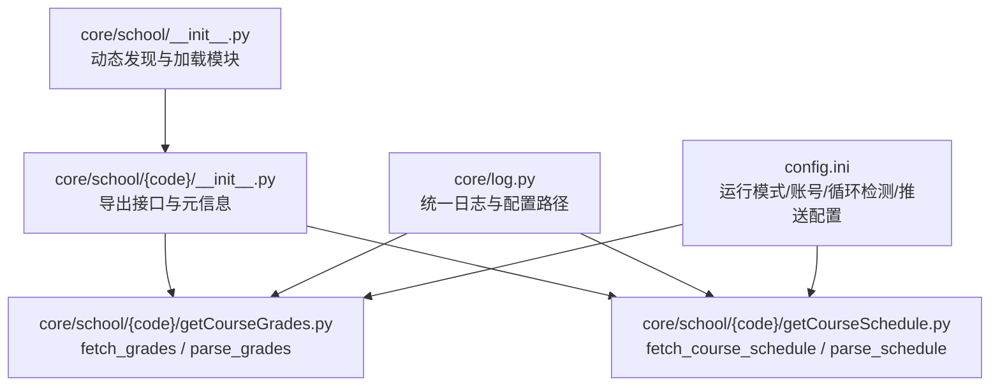
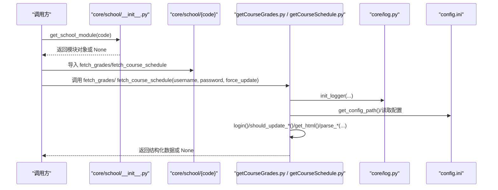
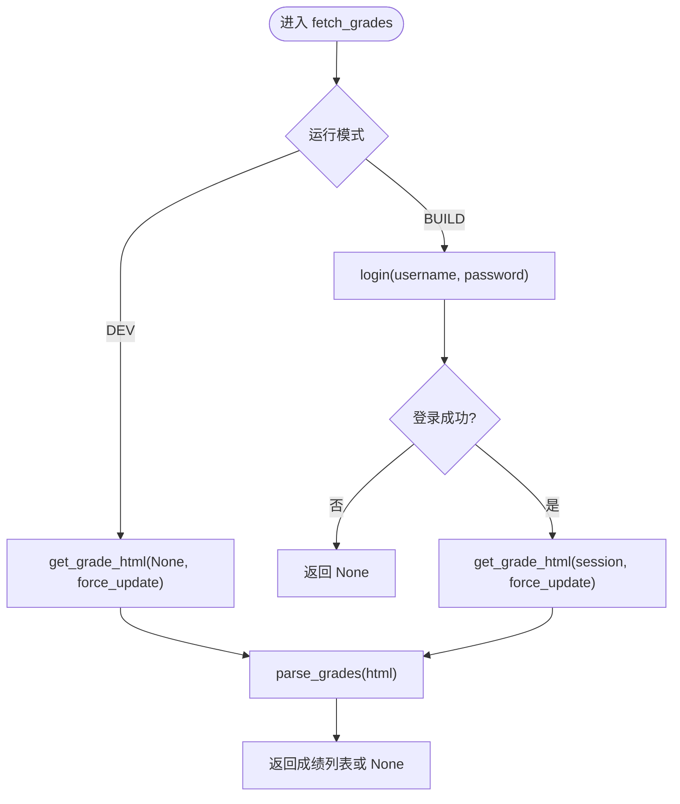
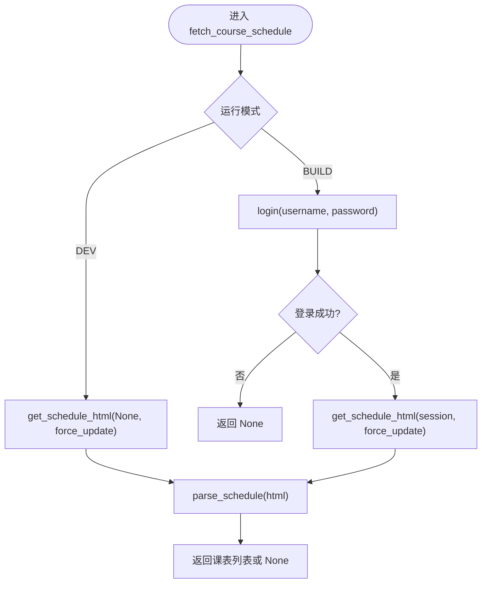
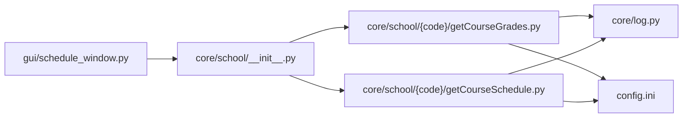

# 院校模块 API

<cite>
**本文引用的文件**
- [core/school/__init__.py](file://core/school/__init__.py)
- [core/school/10546/__init__.py](file://core/school/10546/__init__.py)
- [core/school/10546/getCourseGrades.py](file://core/school/10546/getCourseGrades.py)
- [core/school/10546/getCourseSchedule.py](file://core/school/10546/getCourseSchedule.py)
- [core/log.py](file://core/log.py)
- [config.ini](file://config.ini)
- [developer_tools/EXTENSION_GUIDE.md](file://developer_tools/EXTENSION_GUIDE.md)
- [gui/schedule_window.py](file://gui/schedule_window.py)
- [core/push.py](file://core/push.py)
</cite>

## 目录
1. [简介](#简介)
2. [项目结构](#项目结构)
3. [核心组件](#核心组件)
4. [架构总览](#架构总览)
5. [详细组件分析](#详细组件分析)
6. [依赖关系分析](#依赖关系分析)
7. [性能与可靠性考虑](#性能与可靠性考虑)
8. [故障排查指南](#故障排查指南)
9. [结论](#结论)
10. [附录](#附录)

## 简介
本文件为“院校模块 API”参考文档，聚焦于扩展接口规范与数据交换格式，覆盖以下要点：
- 院校模块的扩展接口规范：get_school_module 函数的调用方式、fetch_grades 与 fetch_course_schedule 的接口标准
- 数据格式规范：成绩数据结构、课表数据结构
- 参数验证规则与异常处理机制
- 模块化架构设计原理：如何添加新的院校支持模块
- 完整的数据交换格式示例与最佳实践
- 扩展开发的详细步骤与注意事项

## 项目结构
院校模块位于 core/school 目录下，采用“按院校代码命名的子包”组织方式。每个子包包含：
- __init__.py：导出该院校模块的接口与元信息（如学校名称）
- getCourseGrades.py：实现成绩抓取与解析
- getCourseSchedule.py：实现课表抓取与解析

图表来源
- [core/school/__init__.py](file://core/school/__init__.py#L1-L28)
- [core/school/10546/__init__.py](file://core/school/10546/__init__.py#L1-L7)
- [core/school/10546/getCourseGrades.py](file://core/school/10546/getCourseGrades.py#L1-L329)
- [core/school/10546/getCourseSchedule.py](file://core/school/10546/getCourseSchedule.py#L1-L405)
- [core/log.py](file://core/log.py#L60-L82)
- [config.ini](file://config.ini#L1-L36)

章节来源
- [core/school/__init__.py](file://core/school/__init__.py#L1-L28)
- [core/school/10546/__init__.py](file://core/school/10546/__init__.py#L1-L7)
- [core/school/10546/getCourseGrades.py](file://core/school/10546/getCourseGrades.py#L1-L329)
- [core/school/10546/getCourseSchedule.py](file://core/school/10546/getCourseSchedule.py#L1-L405)
- [core/log.py](file://core/log.py#L60-L82)
- [config.ini](file://config.ini#L1-L36)

## 核心组件
- get_school_module(school_code): 动态导入指定院校模块，失败时返回 None
- get_available_schools(): 枚举所有可用的院校模块及其显示名称
- fetch_grades(username, password, force_update=False): 抓取并解析成绩
- fetch_course_schedule(username, password, force_update=False): 抓取并解析课表
- parse_grades(html): 将成绩页面 HTML 解析为结构化数据
- parse_schedule(html): 将课表页面 HTML 解析为结构化数据

章节来源
- [core/school/__init__.py](file://core/school/__init__.py#L6-L27)
- [core/school/10546/__init__.py](file://core/school/10546/__init__.py#L1-L7)
- [core/school/10546/getCourseGrades.py](file://core/school/10546/getCourseGrades.py#L278-L295)
- [core/school/10546/getCourseSchedule.py](file://core/school/10546/getCourseSchedule.py#L354-L371)

## 架构总览
院校模块采用“动态发现 + 接口约定”的模块化设计：
- 通过包扫描与 importlib 动态加载子包
- 每个子包提供统一的接口函数（fetch_grades / fetch_course_schedule）
- 通过配置文件控制运行模式、账号、循环检测策略
- 通过统一日志模块记录关键事件与错误

图表来源
- [core/school/__init__.py](file://core/school/__init__.py#L22-L27)
- [core/school/10546/__init__.py](file://core/school/10546/__init__.py#L1-L7)
- [core/school/10546/getCourseGrades.py](file://core/school/10546/getCourseGrades.py#L278-L295)
- [core/school/10546/getCourseSchedule.py](file://core/school/10546/getCourseSchedule.py#L354-L371)
- [core/log.py](file://core/log.py#L131-L195)
- [config.ini](file://config.ini#L1-L36)

## 详细组件分析

### get_school_module 与 get_available_schools
- get_school_module(school_code): 动态导入对应院校模块；失败返回 None
- get_available_schools(): 扫描 core/school 下的所有子包，构建 {代码: 名称} 映射；若子包无 SCHOOL_NAME，则回退为包名

章节来源
- [core/school/__init__.py](file://core/school/__init__.py#L6-L27)

### 成绩模块接口与数据结构
- 接口函数
  - fetch_grades(username, password, force_update=False)
  - parse_grades(html)
- 数据结构（列表项字典）
  - 必填字段：课程名称、成绩、学分、课程属性、学期
  - 可选字段：课程编号
- 参数验证规则
  - username/password 非空校验（在具体实现中进行）
  - force_update 为布尔值
- 异常处理机制
  - 登录失败、网络请求异常、HTML 解析失败均记录日志并返回 None
  - 缓存/时间戳读写失败会记录警告并回退到网络获取

图表来源
- [core/school/10546/getCourseGrades.py](file://core/school/10546/getCourseGrades.py#L278-L295)
- [core/school/10546/getCourseGrades.py](file://core/school/10546/getCourseGrades.py#L170-L229)
- [core/school/10546/getCourseGrades.py](file://core/school/10546/getCourseGrades.py#L232-L262)

章节来源
- [core/school/10546/getCourseGrades.py](file://core/school/10546/getCourseGrades.py#L278-L295)
- [core/school/10546/getCourseGrades.py](file://core/school/10546/getCourseGrades.py#L170-L229)
- [core/school/10546/getCourseGrades.py](file://core/school/10546/getCourseGrades.py#L232-L262)

### 课表模块接口与数据结构
- 接口函数
  - fetch_course_schedule(username, password, force_update=False)
  - parse_schedule(html)
- 数据结构（列表项字典）
  - 必填字段：星期（1-7）、开始小节、结束小节、课程名称、教室、教师、周次列表（整数列表）
- 参数验证规则
  - username/password 非空校验（在具体实现中进行）
  - force_update 为布尔值
- 异常处理机制
  - 登录失败、网络请求异常、HTML 解析失败均记录日志并返回 None
  - 缓存/时间戳读写失败会记录警告并回退到网络获取

图表来源
- [core/school/10546/getCourseSchedule.py](file://core/school/10546/getCourseSchedule.py#L354-L371)
- [core/school/10546/getCourseSchedule.py](file://core/school/10546/getCourseSchedule.py#L171-L230)
- [core/school/10546/getCourseSchedule.py](file://core/school/10546/getCourseSchedule.py#L233-L315)

章节来源
- [core/school/10546/getCourseSchedule.py](file://core/school/10546/getCourseSchedule.py#L354-L371)
- [core/school/10546/getCourseSchedule.py](file://core/school/10546/getCourseSchedule.py#L171-L230)
- [core/school/10546/getCourseSchedule.py](file://core/school/10546/getCourseSchedule.py#L233-L315)

### 配置与运行模式
- 运行模式
  - run_model.model: BUILD 或 DEV
  - DEV 模式下可直接读取 AppData 目录中的缓存文件，不发起网络请求（除非 force_update）
- 循环检测
  - loop_getCourseGrades.enabled/time：控制成绩循环检测开关与间隔
  - loop_getCourseSchedule.enabled/time：控制课表循环检测开关与间隔
- 账号与推送
  - account.school_code/username/password：当前院校代码与账号信息
  - push.method：推送方式（none/email/feishu 等）

章节来源
- [config.ini](file://config.ini#L1-L36)
- [core/school/10546/getCourseGrades.py](file://core/school/10546/getCourseGrades.py#L31-L44)
- [core/school/10546/getCourseSchedule.py](file://core/school/10546/getCourseSchedule.py#L32-L44)

### 日志与错误处理
- 日志
  - 使用 core/log.init_logger 为模块初始化日志器，输出到统一的 AppData 目录
  - 日志级别来自配置文件 logging.level
- 错误处理
  - 登录失败、网络异常、HTML 解析失败、缓存读写失败均记录日志并返回 None
  - 配置读取失败时使用默认值并记录警告

章节来源
- [core/log.py](file://core/log.py#L131-L195)
- [core/school/10546/getCourseGrades.py](file://core/school/10546/getCourseGrades.py#L80-L100)
- [core/school/10546/getCourseGrades.py](file://core/school/10546/getCourseGrades.py#L210-L229)
- [core/school/10546/getCourseSchedule.py](file://core/school/10546/getCourseSchedule.py#L81-L101)
- [core/school/10546/getCourseSchedule.py](file://core/school/10546/getCourseSchedule.py#L210-L230)

## 依赖关系分析
- 模块耦合
  - 院校模块仅依赖 core/log 提供的日志与配置路径
  - 通过 importlib 动态导入，避免硬编码依赖
- 外部依赖
  - requests、BeautifulSoup、configparser、socket、json、time、sys、pathlib
- 配置与 GUI 集成
  - GUI 侧通过 core/school/__init__.py 的 get_school_module 获取当前院校模块
  - GUI 侧从 config.ini 读取 school_code 并调用对应模块

图表来源
- [gui/schedule_window.py](file://gui/schedule_window.py#L21-L24)
- [core/school/__init__.py](file://core/school/__init__.py#L1-L28)
- [core/school/10546/getCourseGrades.py](file://core/school/10546/getCourseGrades.py#L1-L329)
- [core/school/10546/getCourseSchedule.py](file://core/school/10546/getCourseSchedule.py#L1-L405)
- [core/log.py](file://core/log.py#L60-L82)
- [config.ini](file://config.ini#L1-L36)

章节来源
- [gui/schedule_window.py](file://gui/schedule_window.py#L21-L24)
- [core/school/__init__.py](file://core/school/__init__.py#L1-L28)

## 性能与可靠性考虑
- 缓存与循环检测
  - 通过时间戳与间隔控制减少重复网络请求
  - DEV 模式下优先使用本地缓存，提升开发效率
- 网络稳定性
  - 登录与请求均设置超时；失败时记录详细日志便于定位
- 日志与诊断
  - 统一日志输出到 AppData 目录，支持打包为压缩报告
  - 解析阶段输出 DEBUG 结果，便于问题排查

章节来源
- [core/school/10546/getCourseGrades.py](file://core/school/10546/getCourseGrades.py#L117-L156)
- [core/school/10546/getCourseGrades.py](file://core/school/10546/getCourseGrades.py#L170-L229)
- [core/school/10546/getCourseSchedule.py](file://core/school/10546/getCourseSchedule.py#L118-L157)
- [core/school/10546/getCourseSchedule.py](file://core/school/10546/getCourseSchedule.py#L171-L230)
- [core/log.py](file://core/log.py#L18-L57)

## 故障排查指南
- 常见问题与定位
  - 登录失败：检查账号密码、验证码提示、网络连通性
  - HTML 解析失败：确认页面结构是否发生变化，查看失败页面缓存
  - 缓存读写失败：检查 AppData 目录权限与磁盘空间
- 日志定位
  - 查看统一日志文件（按日期命名），关注模块名与错误级别
  - 使用 pack_logs 将日志打包以便反馈
- 配置核对
  - 确认 run_model.model、loop_* 配置、账号信息正确
  - 确认 school_code 与实际院校模块一致

章节来源
- [core/school/10546/getCourseGrades.py](file://core/school/10546/getCourseGrades.py#L80-L100)
- [core/school/10546/getCourseGrades.py](file://core/school/10546/getCourseGrades.py#L210-L229)
- [core/school/10546/getCourseSchedule.py](file://core/school/10546/getCourseSchedule.py#L81-L101)
- [core/school/10546/getCourseSchedule.py](file://core/school/10546/getCourseSchedule.py#L210-L230)
- [core/log.py](file://core/log.py#L18-L57)

## 结论
本 API 以“动态模块 + 统一接口 + 配置驱动”的方式实现了对多院校的支持。通过标准化的数据结构与完善的异常处理，既保证了扩展性，也提升了可维护性。开发者只需遵循接口规范与数据结构，即可快速接入新的院校模块。

## 附录

### 数据交换格式规范
- 成绩数据（列表项字典）
  - 必填字段：课程名称、成绩、学分、课程属性、学期
  - 可选字段：课程编号
- 课表数据（列表项字典）
  - 必填字段：星期（1-7）、开始小节、结束小节、课程名称、教室、教师、周次列表（整数列表）

章节来源
- [developer_tools/EXTENSION_GUIDE.md](file://developer_tools/EXTENSION_GUIDE.md#L92-L95)

### 参数验证规则
- fetch_grades / fetch_course_schedule
  - username：非空字符串
  - password：非空字符串
  - force_update：布尔值
- 解析阶段
  - 若 HTML 中未找到预期容器（如成绩表、课表表），返回空列表或 None

章节来源
- [core/school/10546/getCourseGrades.py](file://core/school/10546/getCourseGrades.py#L278-L295)
- [core/school/10546/getCourseSchedule.py](file://core/school/10546/getCourseSchedule.py#L354-L371)
- [core/school/10546/getCourseGrades.py](file://core/school/10546/getCourseGrades.py#L232-L262)
- [core/school/10546/getCourseSchedule.py](file://core/school/10546/getCourseSchedule.py#L233-L315)

### 异常处理机制
- 登录失败：记录错误并返回 None
- 网络异常：记录错误并返回 None
- HTML 解析失败：记录错误并返回 None
- 缓存/时间戳读写失败：记录警告并回退到网络获取

章节来源
- [core/school/10546/getCourseGrades.py](file://core/school/10546/getCourseGrades.py#L80-L100)
- [core/school/10546/getCourseGrades.py](file://core/school/10546/getCourseGrades.py#L210-L229)
- [core/school/10546/getCourseSchedule.py](file://core/school/10546/getCourseSchedule.py#L81-L101)
- [core/school/10546/getCourseSchedule.py](file://core/school/10546/getCourseSchedule.py#L210-L230)

### 模块化架构设计原理
- 动态发现：通过包扫描与 importlib 导入子包
- 接口约定：每个子包导出 fetch_grades / fetch_course_schedule
- 元信息：SCHOOL_NAME/SCHOOL_CODE 用于展示与识别
- 配置驱动：运行模式、循环检测、账号信息由配置文件决定

章节来源
- [core/school/__init__.py](file://core/school/__init__.py#L6-L27)
- [core/school/10546/__init__.py](file://core/school/10546/__init__.py#L1-L7)

### 扩展开发步骤与注意事项
- 创建新模块
  - 在 core/school 下创建以“院校代码”命名的文件夹
  - 在其中创建 __init__.py、getCourseGrades.py、getCourseSchedule.py
  - 实现并导出 fetch_grades / fetch_course_schedule
- 注册模块
  - 使用 developer_tools/register_or_undo.py 脚本或在 core/school/__init__.py 中添加映射
- 数据规范
  - 严格遵守数据结构规范（必填字段、类型）
- 最佳实践
  - 使用 core/log.init_logger 记录关键步骤
  - 使用 core/log.get_config_path 读取配置文件路径
  - 在 requirements.txt 中声明新增依赖
  - 在 DEV 模式下提供缓存文件以提升开发体验

章节来源
- [developer_tools/EXTENSION_GUIDE.md](file://developer_tools/EXTENSION_GUIDE.md#L60-L102)