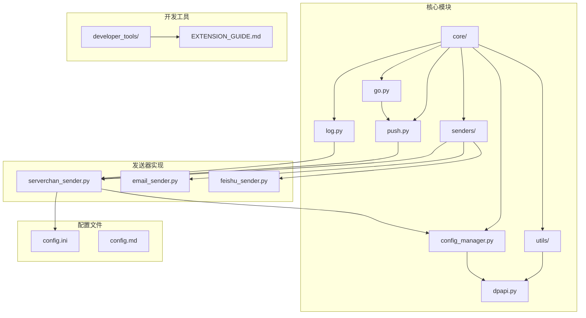
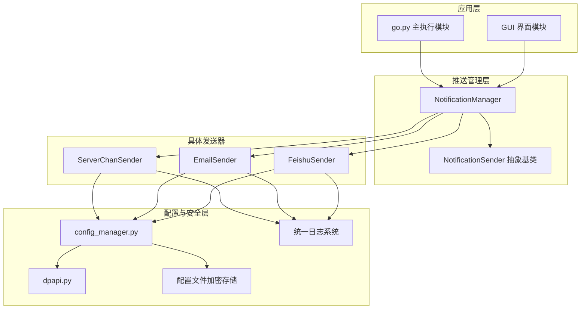
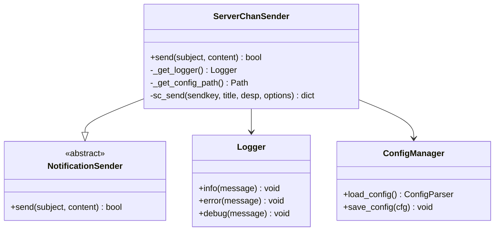
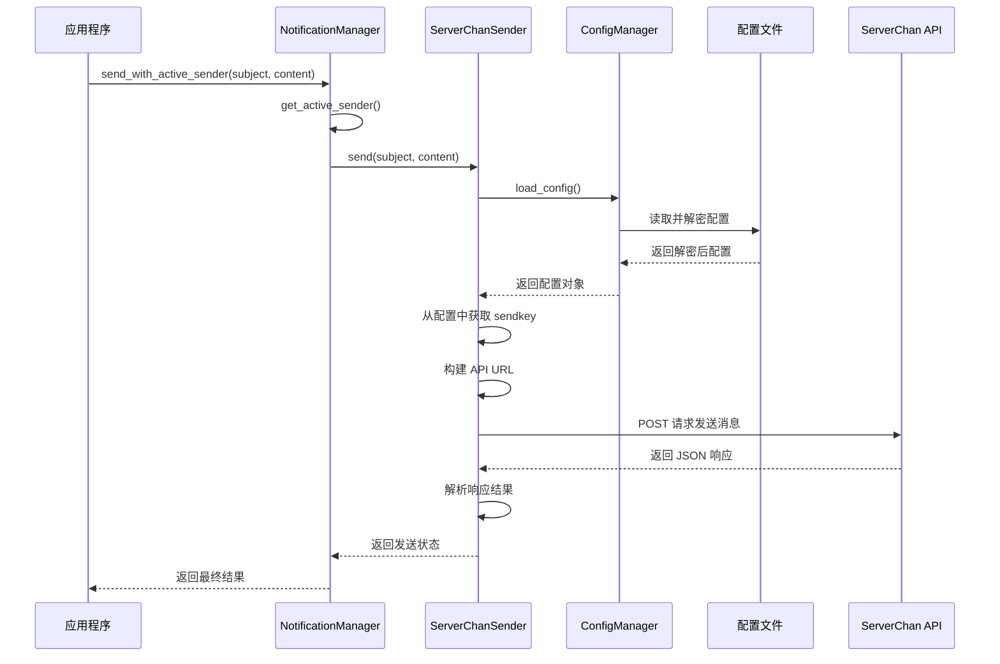
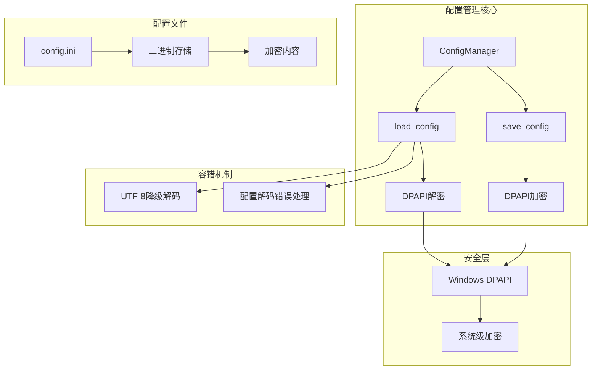
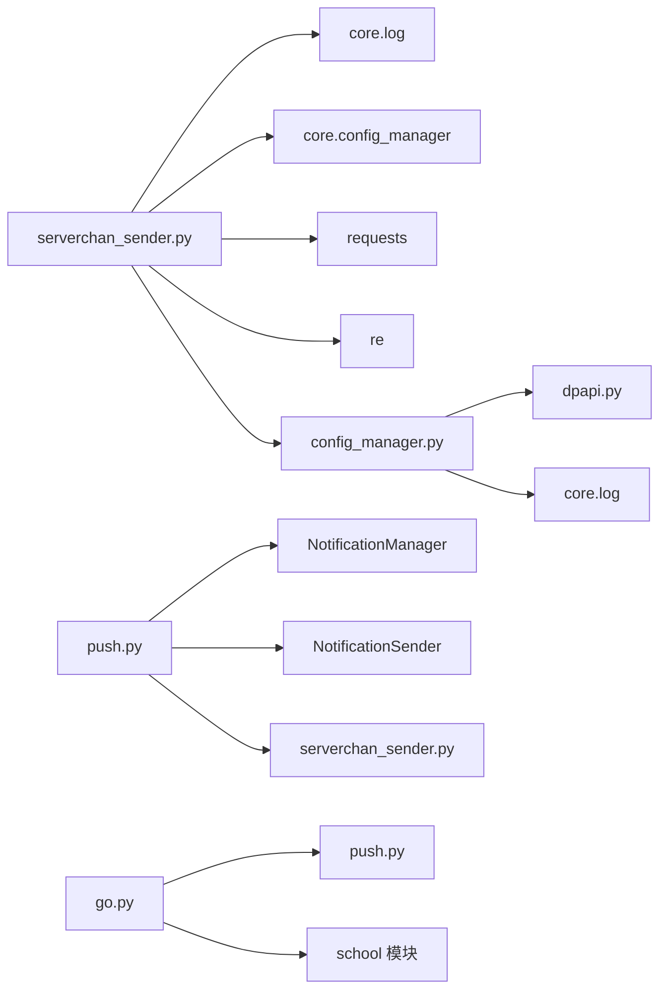

# ServerChan 推送实现

<cite>
**本文档引用的文件**
- [serverchan_sender.py](file://core/senders/serverchan_sender.py)
- [config_manager.py](file://core/config_manager.py)
- [push.py](file://core/push.py)
- [go.py](file://core/go.py)
- [config.ini](file://config.ini)
- [log.py](file://core/log.py)
- [dpapi.py](file://core/utils/dpapi.py)
- [EXTENSION_GUIDE.md](file://developer_tools/EXTENSION_GUIDE.md)
- [README.md](file://README.md)
- [config.md](file://config.md)
</cite>

## 更新摘要
**所做更改**
- 更新了配置管理系统的架构说明，反映新的加密配置管理机制
- 新增了配置文件加密存储的详细说明
- 更新了 ServerChanSender 类的配置加载流程
- 增强了安全性和错误处理机制的描述
- 更新了依赖关系和架构图以反映新的配置管理改进

## 目录
1. [简介](#简介)
2. [项目结构](#项目结构)
3. [核心组件](#核心组件)
4. [架构概览](#架构概览)
5. [详细组件分析](#详细组件分析)
6. [配置管理系统改进](#配置管理系统改进)
7. [依赖关系分析](#依赖关系分析)
8. [性能考虑](#性能考虑)
9. [故障排除指南](#故障排除指南)
10. [结论](#结论)

## 简介

ServerChan（Server酱）是中国大陆地区广泛使用的微信公众号推送服务。本项目实现了基于 ServerChan 的消息推送功能，允许用户将课程成绩和课表更新通知推送到微信。

ServerChan 提供了简单易用的 API 接口，通过 SendKey 认证机制实现消息推送。该实现支持两种类型的 SendKey：
- 标准 SendKey：以 `SCU` 开头的格式
- 分流 SendKey：以 `sctp` 开头的格式，支持多节点分流

**更新** 本实现现已集成统一的加密配置管理系统，提供更安全的敏感信息存储和管理。

## 项目结构

该项目采用模块化设计，核心功能分布在以下目录结构中：



**图表来源**
- [serverchan_sender.py](file://core/senders/serverchan_sender.py#L1-L129)
- [config_manager.py](file://core/config_manager.py#L1-L68)
- [push.py](file://core/push.py#L1-L392)
- [dpapi.py](file://core/utils/dpapi.py#L1-L101)

**章节来源**
- [README.md](file://README.md#L70-L118)

## 核心组件

### ServerChanSender 类

ServerChanSender 是 ServerChan 推送功能的核心实现类，负责处理消息发送的完整流程。

主要功能特性：
- **延迟初始化**：日志记录器和配置路径采用延迟初始化策略
- **统一配置管理**：通过 `config_manager.load_config()` 读取加密配置
- **API 调用**：封装 ServerChan API 请求和响应处理
- **错误处理**：完善的异常捕获和错误日志记录

### sc_send 函数

sc_send 是底层的 API 调用函数，处理具体的 HTTP 请求构建和发送。

关键实现要点：
- **SendKey 类型识别**：自动识别标准 SendKey 和分流 SendKey
- **URL 动态构建**：根据 SendKey 类型构建相应的 API 端点
- **JSON 参数封装**：将消息标题和内容封装为 JSON 格式
- **响应结果解析**：解析 API 返回的 JSON 响应

**章节来源**
- [serverchan_sender.py](file://core/senders/serverchan_sender.py#L81-L129)

## 架构概览

整个推送系统的架构采用分层设计，实现了高度的模块化和可扩展性。



**图表来源**
- [push.py](file://core/push.py#L74-L170)
- [serverchan_sender.py](file://core/senders/serverchan_sender.py#L81-L129)
- [config_manager.py](file://core/config_manager.py#L15-L67)

## 详细组件分析

### ServerChanSender 类详细分析

ServerChanSender 类实现了完整的发送器接口，具有以下设计特点：

#### 类结构图



**图表来源**
- [serverchan_sender.py](file://core/senders/serverchan_sender.py#L81-L129)
- [push.py](file://core/push.py#L56-L71)

#### 发送流程序列图



**图表来源**
- [push.py](file://core/push.py#L145-L162)
- [serverchan_sender.py](file://core/senders/serverchan_sender.py#L95-L129)
- [config_manager.py](file://core/config_manager.py#L15-L51)

**章节来源**
- [serverchan_sender.py](file://core/senders/serverchan_sender.py#L81-L129)

### 配置管理机制

**更新** ServerChan 推送功能的配置管理现已集成统一的加密配置管理系统：

#### 配置文件结构

| 配置项 | 类型 | 默认值 | 说明 |
|--------|------|--------|------|
| `[serverchan]` | 区段 | - | ServerChan 推送配置 |
| `sendkey` | 字符串 | 空字符串 | ServerChan 的 SendKey（已加密存储） |

#### 配置加载流程

```mermaid
flowchart TD
A[启动应用] --> B[获取配置路径]
B --> C[调用 load_config()]
C --> D{检查配置文件是否存在}
D --> |不存在| E[返回空配置对象]
D --> |存在| F[读取二进制配置文件]
F --> G{尝试DPAPI解密}
G --> |成功| H[解密配置内容]
G --> |失败| I{尝试UTF-8解码}
I --> |成功| J[直接读取明文配置]
I --> |失败| K[抛出解码错误]
H --> L[解析配置为ConfigParser]
J --> L
E --> M[返回默认配置]
K --> N[重新抛出错误]
M --> O[返回配置对象]
L --> O
```

**图表来源**
- [config_manager.py](file://core/config_manager.py#L15-L51)

**章节来源**
- [config.ini](file://config.ini#L37-L39)
- [config_manager.py](file://core/config_manager.py#L15-L51)

### 错误处理与日志记录

ServerChan 推送实现具有完善的错误处理机制：

#### 错误类型分类

1. **配置错误**：配置文件缺失或配置项为空
2. **网络错误**：API 请求超时或连接失败
3. **认证错误**：SendKey 无效或过期
4. **业务错误**：API 返回错误状态
5. **加密错误**：配置文件解密失败

#### 日志记录策略

- **INFO 级别**：重要的操作状态和结果
- **ERROR 级别**：严重的错误和异常
- **DEBUG 级别**：详细的调试信息和内部状态
- **WARNING 级别**：潜在问题的警告信息

**章节来源**
- [serverchan_sender.py](file://core/senders/serverchan_sender.py#L119-L129)
- [log.py](file://core/log.py#L167-L189)

## 配置管理系统改进

**新增** 配置管理系统经过重大改进，现在提供企业级的安全配置管理：

### 加密配置管理架构



**图表来源**
- [config_manager.py](file://core/config_manager.py#L15-L67)
- [dpapi.py](file://core/utils/dpapi.py#L12-L77)

### 加密配置管理特性

1. **双重解密机制**：
   - 首先尝试使用 Windows DPAPI 解密
   - 解密失败时自动降级到 UTF-8 明文读取

2. **容错处理**：
   - 捕获并处理各种解码异常
   - 提供详细的错误信息和恢复策略

3. **安全存储**：
   - 配置文件以二进制格式存储
   - 使用系统级 DPAPI 加密算法
   - 防止敏感信息以明文形式泄露

4. **兼容性保证**：
   - 向后兼容未加密的配置文件
   - 自动检测和处理不同格式的配置文件

**章节来源**
- [config_manager.py](file://core/config_manager.py#L15-L67)
- [dpapi.py](file://core/utils/dpapi.py#L12-L77)

## 依赖关系分析

### 外部依赖

ServerChan 推送实现依赖以下外部库：

| 依赖库 | 版本要求 | 用途 |
|--------|----------|------|
| requests | >= 2.25.0 | HTTP 请求处理 |
| configparser | 标准库 | 配置文件解析 |
| re | 标准库 | 正则表达式匹配 |
| os | 标准库 | 操作系统接口 |
| ctypes | 标准库 | Windows API 调用 |

### 内部依赖



**图表来源**
- [serverchan_sender.py](file://core/senders/serverchan_sender.py#L5-L16)
- [push.py](file://core/push.py#L11-L16)
- [config_manager.py](file://core/config_manager.py#L1-L7)

**章节来源**
- [serverchan_sender.py](file://core/senders/serverchan_sender.py#L5-L16)
- [push.py](file://core/push.py#L11-L16)

## 性能考虑

### 网络请求优化

1. **连接复用**：使用 requests 库的连接池机制
2. **超时设置**：合理设置请求超时时间，避免阻塞
3. **重试机制**：对于临时性网络错误提供有限重试

### 内存管理

1. **延迟初始化**：日志记录器和配置路径采用延迟初始化
2. **资源清理**：及时关闭网络连接和文件句柄
3. **内存回收**：避免长时间持有大量数据

### 并发处理

ServerChan 推送功能目前采用同步阻塞模式，适用于单线程环境。对于高并发场景，可以考虑：

1. **异步请求**：使用 aiohttp 替代 requests
2. **连接池**：复用 HTTP 连接
3. **批量发送**：合并多个推送请求

### 配置管理性能

**更新** 加密配置管理在性能方面进行了优化：

1. **缓存机制**：配置对象在进程内缓存，避免重复解密
2. **按需解密**：只有在需要时才解密配置文件
3. **降级策略**：自动处理不同格式的配置文件，减少错误处理开销

## 故障排除指南

### 常见问题诊断

#### SendKey 配置问题

**症状**：发送失败，日志显示 "Server酱 SendKey 为空"

**解决方案**：
1. 检查 `config.ini` 中 `[serverchan]` 区段的 `sendkey` 配置
2. 确认 SendKey 格式正确（标准 SendKey 以 `SCU` 开头，分流 SendKey 以 `sctp` 开头）
3. 验证 SendKey 未过期且有效

#### 配置文件解密问题

**症状**：配置文件读取失败，出现解码错误

**解决方案**：
1. 检查配置文件是否被正确加密
2. 验证当前用户具有访问 DPAPI 的权限
3. 确认配置文件未被第三方工具修改
4. 尝试重新生成配置文件

#### 网络连接问题

**症状**：API 请求超时或连接失败

**解决方案**：
1. 检查网络连接状态
2. 验证服务器可达性
3. 检查防火墙设置
4. 尝试手动访问 API 端点

#### API 响应错误

**症状**：API 返回错误状态

**解决方案**：
1. 查看详细的错误日志
2. 验证消息格式是否正确
3. 检查 ServerChan 服务状态
4. 联系 ServerChan 官方支持

### 调试技巧

1. **启用详细日志**：将日志级别设置为 DEBUG
2. **网络抓包**：使用工具监控 HTTP 请求
3. **API 测试**：使用 curl 或 Postman 测试 API
4. **配置验证**：打印配置文件内容进行验证
5. **加密测试**：验证配置文件的加密和解密功能

**章节来源**
- [serverchan_sender.py](file://core/senders/serverchan_sender.py#L105-L129)
- [config_manager.py](file://core/config_manager.py#L38-L49)

## 结论

ServerChan 推送实现展现了良好的模块化设计和错误处理机制。通过统一的加密配置管理和日志系统，该实现提供了可靠的微信推送功能。

### 设计优势

1. **模块化设计**：清晰的职责分离和接口定义
2. **统一配置管理**：集成加密配置管理，提供企业级安全
3. **错误处理**：完善的异常捕获和日志记录
4. **扩展性**：遵循抽象基类设计，易于添加新的推送方式
5. **安全性**：敏感信息通过 DPAPI 加密存储，防止泄露

### 改进建议

1. **异步支持**：考虑添加异步推送能力
2. **重试机制**：实现智能重试策略
3. **监控告警**：添加推送成功率统计和告警
4. **单元测试**：增加自动化测试覆盖率
5. **配置备份**：实现配置文件的自动备份和恢复机制

**更新** 配置管理系统的改进显著提升了系统的安全性和可靠性，为类似的消息推送功能提供了优秀的参考模板，具有良好的可维护性和扩展性。