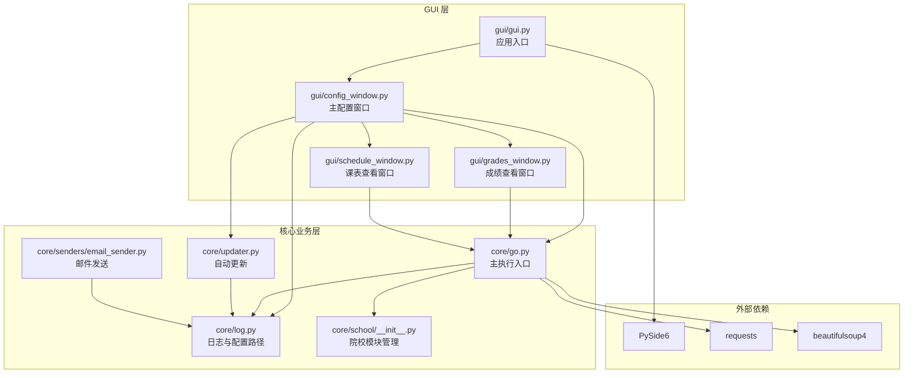
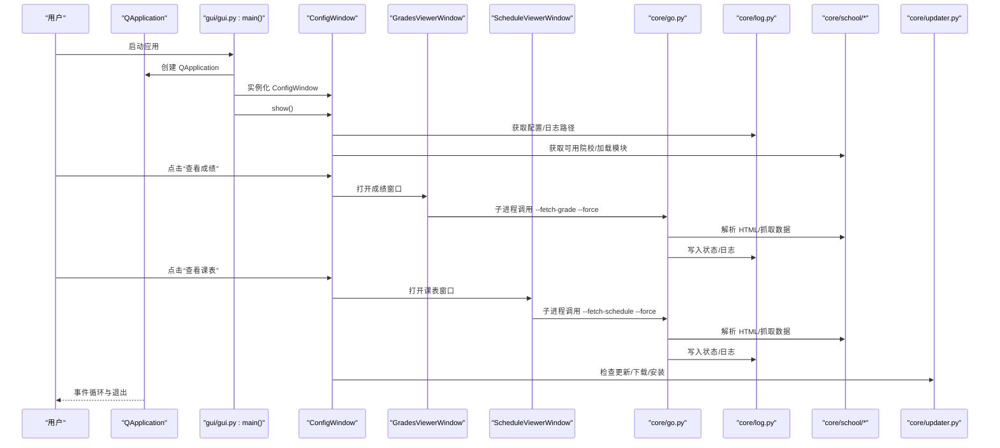
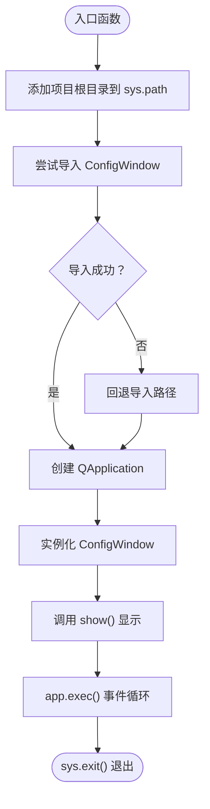
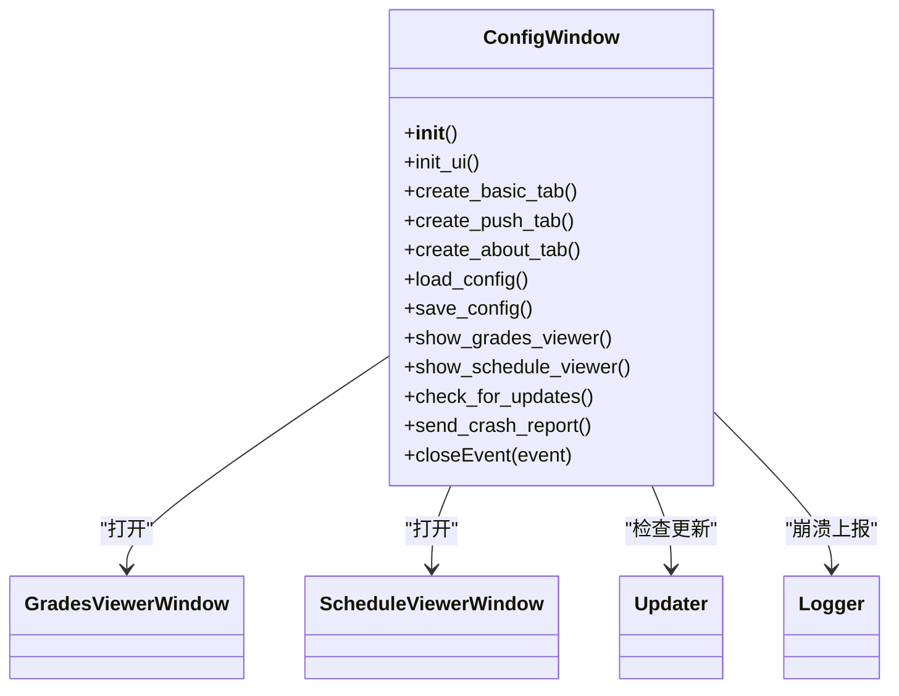
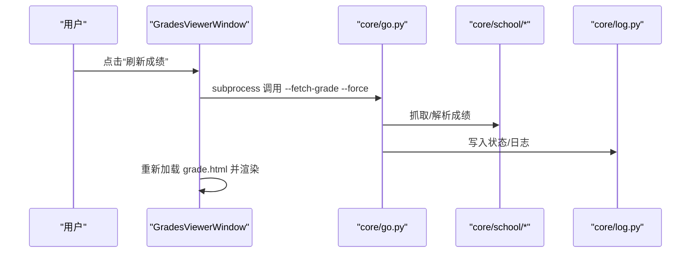
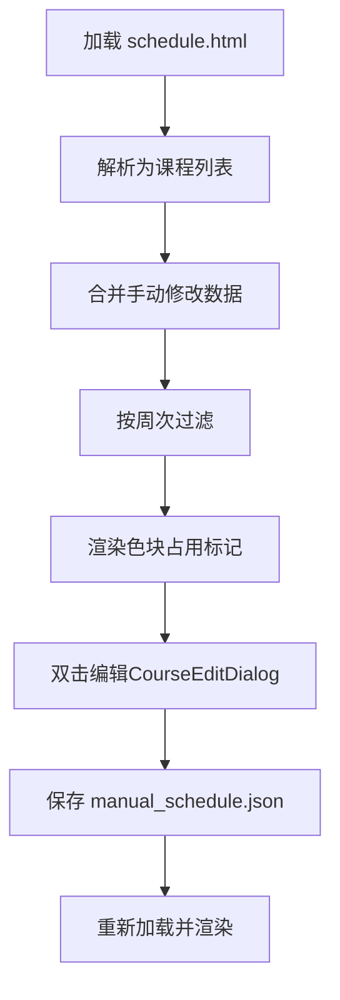
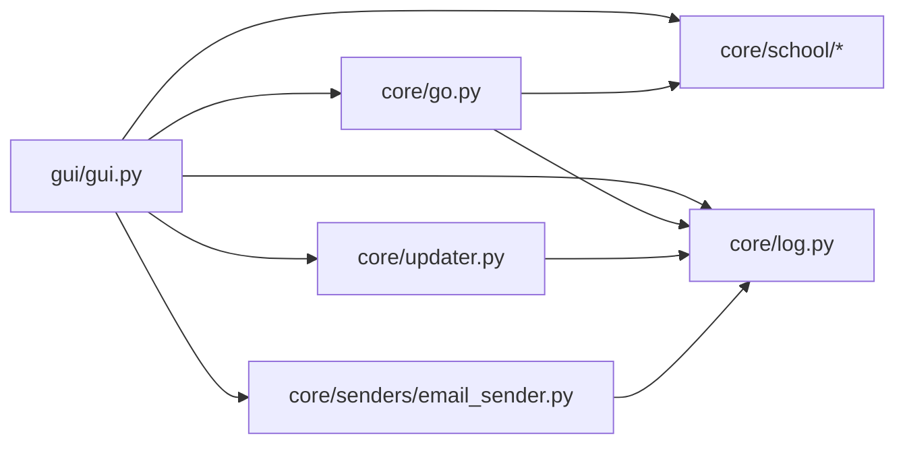

# 主窗口与应用入口

<cite>
**本文引用的文件**
- [README.md](file://README.md)
- [gui/gui.py](file://gui/gui.py)
- [gui/config_window.py](file://gui/config_window.py)
- [gui/grades_window.py](file://gui/grades_window.py)
- [gui/schedule_window.py](file://gui/schedule_window.py)
- [core/go.py](file://core/go.py)
- [core/log.py](file://core/log.py)
- [core/school/__init__.py](file://core/school/__init__.py)
- [core/updater.py](file://core/updater.py)
- [core/senders/email_sender.py](file://core/senders/email_sender.py)
- [requirements.txt](file://requirements.txt)
- [config.ini](file://config.ini)
</cite>

## 目录
1. [简介](#简介)
2. [项目结构](#项目结构)
3. [核心组件](#核心组件)
4. [架构总览](#架构总览)
5. [详细组件分析](#详细组件分析)
6. [依赖关系分析](#依赖关系分析)
7. [性能考虑](#性能考虑)
8. [故障排除指南](#故障排除指南)
9. [结论](#结论)

## 简介
本文件聚焦于 PySide6 应用程序的“主窗口与应用入口”，系统性阐述以下主题：
- QApplication 的创建、事件循环与退出流程
- 主窗口的加载与显示机制
- 路径配置与模块导入策略，特别是如何解决相对导入问题
- 应用程序生命周期管理的最佳实践（事件循环、资源清理）
- 错误处理与异常管理策略，确保稳定性与可靠性

## 项目结构
该项目采用“GUI + 核心业务 + 日志/配置”的分层组织方式：
- gui：图形界面模块，包含主配置窗口、成绩/课表查看窗口等
- core：核心业务逻辑，包括抓取、推送、日志、更新器等
- tray：系统托盘程序（C++ 实现）
- 根目录：配置文件、安装脚本、依赖声明等

图表来源
- [gui/gui.py](file://gui/gui.py#L1-L24)
- [gui/config_window.py](file://gui/config_window.py#L1-L537)
- [gui/grades_window.py](file://gui/grades_window.py#L1-L158)
- [gui/schedule_window.py](file://gui/schedule_window.py#L1-L368)
- [core/go.py](file://core/go.py#L1-L536)
- [core/log.py](file://core/log.py#L1-L211)
- [core/school/__init__.py](file://core/school/__init__.py#L1-L28)
- [core/updater.py](file://core/updater.py#L1-L313)
- [core/senders/email_sender.py](file://core/senders/email_sender.py#L1-L144)

章节来源
- [README.md](file://README.md#L60-L83)
- [requirements.txt](file://requirements.txt#L1-L3)

## 核心组件
- 应用入口与主窗口加载
  - gui/gui.py：创建 QApplication，实例化 ConfigWindow 并显示，进入事件循环
  - gui/config_window.py：主配置窗口，负责基本配置、推送设置、关于信息、更新检查、崩溃上报等
  - gui/grades_window.py：独立窗口，用于查看/刷新成绩
  - gui/schedule_window.py：独立窗口，用于查看/刷新课表

- 核心业务与生命周期
  - core/go.py：命令行入口，负责成绩/课表抓取、差异检测、推送调度、状态持久化
  - core/log.py：统一日志与配置路径管理，保证跨平台（AppData）一致性
  - core/school/__init__.py：动态加载院校模块，支持多校扩展
  - core/updater.py：检查更新、下载安装包、静默安装
  - core/senders/email_sender.py：邮件发送器，带认证与错误处理

章节来源
- [gui/gui.py](file://gui/gui.py#L16-L24)
- [gui/config_window.py](file://gui/config_window.py#L44-L90)
- [core/go.py](file://core/go.py#L461-L536)
- [core/log.py](file://core/log.py#L60-L82)
- [core/school/__init__.py](file://core/school/__init__.py#L22-L28)
- [core/updater.py](file://core/updater.py#L20-L77)
- [core/senders/email_sender.py](file://core/senders/email_sender.py#L47-L144)

## 架构总览
下图展示了从应用入口到主窗口、再到核心业务的调用链路与数据流。

图表来源
- [gui/gui.py](file://gui/gui.py#L16-L24)
- [gui/config_window.py](file://gui/config_window.py#L405-L418)
- [gui/grades_window.py](file://gui/grades_window.py#L79-L108)
- [gui/schedule_window.py](file://gui/schedule_window.py#L241-L268)
- [core/go.py](file://core/go.py#L83-L144)
- [core/log.py](file://core/log.py#L60-L82)
- [core/school/__init__.py](file://core/school/__init__.py#L22-L28)
- [core/updater.py](file://core/updater.py#L42-L77)

## 详细组件分析

### 应用入口与主窗口加载（gui/gui.py）
- 关键点
  - 动态将项目根目录加入 sys.path，确保能正确导入 core/gui 子模块
  - 使用 try/except 处理相对导入差异（直接运行 vs 作为模块导入）
  - 创建 QApplication，实例化 ConfigWindow，调用 show() 显示
  - 通过 app.exec() 进入事件循环；sys.exit() 保证优雅退出

图表来源
- [gui/gui.py](file://gui/gui.py#L5-L24)

章节来源
- [gui/gui.py](file://gui/gui.py#L5-L24)

### 主配置窗口（gui/config_window.py）
- 职责
  - 初始化 UI（标签页：基本配置、推送设置、关于）
  - 加载/保存配置（config.ini），支持多校、循环检测、定时推送
  - 打开子窗口：查看成绩、查看课表
  - 检查更新、崩溃上报
  - 关闭事件：阻止在子窗口未关闭时关闭主窗口

- 关键实现要点
  - 动态获取 BASE_DIR 并处理相对导入（log、school、grades_window、schedule_window）
  - 使用 QTabWidget 组织界面，QFormLayout/QHBoxLayout/QVBoxLayout 布局
  - 保存配置时进行 Outlook 邮箱校验（Outlook/Hotmail 不支持基本认证）
  - 更新检查使用 QProgressDialog/QMessageBox，下载进度通过回调更新
  - 崩溃上报通过 core.log.pack_logs 生成压缩日志

图表来源
- [gui/config_window.py](file://gui/config_window.py#L44-L90)
- [gui/grades_window.py](file://gui/grades_window.py#L32-L40)
- [gui/schedule_window.py](file://gui/schedule_window.py#L44-L68)
- [core/updater.py](file://core/updater.py#L20-L41)
- [core/log.py](file://core/log.py#L18-L58)

章节来源
- [gui/config_window.py](file://gui/config_window.py#L44-L90)
- [gui/config_window.py](file://gui/config_window.py#L351-L404)
- [gui/config_window.py](file://gui/config_window.py#L419-L494)
- [gui/config_window.py](file://gui/config_window.py#L495-L514)
- [gui/config_window.py](file://gui/config_window.py#L515-L537)

### 成绩查看窗口（gui/grades_window.py）
- 职责
  - 读取 APPDATA 目录下的 grade.html，解析为成绩表格
  - 提供“刷新”（从网络获取）与“清除缓存”功能
  - 通过 subprocess 调用 core/go.py 的命令行能力

- 关键实现要点
  - 动态获取 BASE_DIR 并处理相对导入
  - 使用 QTableWidget 展示，设置列宽与不可编辑
  - 刷新时设置鼠标等待光标，异常捕获并提示
  - 清除缓存时同时删除 last_grades.json，避免下次刷新不提醒

图表来源
- [gui/grades_window.py](file://gui/grades_window.py#L79-L108)
- [core/go.py](file://core/go.py#L83-L144)
- [core/school/__init__.py](file://core/school/__init__.py#L22-L28)
- [core/log.py](file://core/log.py#L60-L82)

章节来源
- [gui/grades_window.py](file://gui/grades_window.py#L79-L108)
- [gui/grades_window.py](file://gui/grades_window.py#L109-L141)
- [gui/grades_window.py](file://gui/grades_window.py#L142-L158)

### 课表查看窗口（gui/schedule_window.py）
- 职责
  - 读取 APPDATA 目录下的 schedule.html，解析为色块课表
  - 支持周次切换、手动编辑（CourseEditDialog）、清除缓存
  - 通过 subprocess 调用 core/go.py 的命令行能力

- 关键实现要点
  - 使用 QTableWidget + CourseBlock 自定义组件展示色块
  - 手动修改数据保存在 manual_schedule.json，支持周次过滤
  - 双击单元格弹出编辑对话框，保存后重新渲染
  - 刷新时设置等待光标，异常捕获并提示

图表来源
- [gui/schedule_window.py](file://gui/schedule_window.py#L269-L368)
- [gui/schedule_window.py](file://gui/schedule_window.py#L177-L208)

章节来源
- [gui/schedule_window.py](file://gui/schedule_window.py#L269-L368)

### 核心执行入口（core/go.py）
- 职责
  - 命令行入口：解析参数，执行成绩/课表抓取与推送
  - 成绩差异检测：比较历史与最新数据，仅推送变化
  - 课表推送：支持今日/明日/下周全周推送，含手动覆盖逻辑
  - 状态持久化：last_grades.json、last_schedule_day.txt、last_push_* 等
  - 日志初始化：统一 AppData 目录下的日志与配置路径

- 关键实现要点
  - 动态将项目根目录加入 sys.path，处理相对导入
  - 使用 argparse 定义丰富 CLI 参数，支持强制刷新、推送所有等
  - 通过 get_school_module 动态加载对应院校模块
  - 异常捕获并记录，必要时抛出以便上层处理

章节来源
- [core/go.py](file://core/go.py#L10-L39)
- [core/go.py](file://core/go.py#L461-L536)
- [core/go.py](file://core/go.py#L83-L144)
- [core/go.py](file://core/go.py#L180-L271)
- [core/go.py](file://core/go.py#L360-L459)

### 日志与配置路径管理（core/log.py）
- 职责
  - 统一配置文件与日志文件路径（AppData 目录）
  - 初始化日志系统：控制台与文件处理器，按日期命名日志文件
  - 清理旧日志，限制总大小
  - 打包日志为崩溃报告

- 关键实现要点
  - get_config_path/get_log_file_path 统一路径策略
  - init_logger 保证重复初始化安全，避免重复处理器
  - pack_logs 将所有 .log 文件合并为单一文本文件

章节来源
- [core/log.py](file://core/log.py#L60-L82)
- [core/log.py](file://core/log.py#L114-L129)
- [core/log.py](file://core/log.py#L131-L195)
- [core/log.py](file://core/log.py#L18-L58)

### 院校模块管理（core/school/__init__.py）
- 职责
  - 动态枚举可用院校模块
  - 根据配置加载指定院校模块

- 关键实现要点
  - 使用 importlib 动态导入，容错处理
  - 通过 SCHOOL_NAME 兼容显示名称

章节来源
- [core/school/__init__.py](file://core/school/__init__.py#L6-L28)

### 自动更新（core/updater.py）
- 职责
  - 检查 GitHub Releases，比较版本号
  - 下载对应安装包（轻量版/完整版），支持进度回调
  - 启动安装程序（支持静默安装）

- 关键实现要点
  - 版本号比较规则：基础版本优先，后缀规则（正式 > 预发布）
  - 下载到临时目录，支持进度回调
  - 安装时根据安装包类型决定是否静默

章节来源
- [core/updater.py](file://core/updater.py#L42-L77)
- [core/updater.py](file://core/updater.py#L139-L205)
- [core/updater.py](file://core/updater.py#L206-L241)

### 邮件发送（core/senders/email_sender.py）
- 职责
  - 从配置文件读取 SMTP/端口/发件人/收件人/授权码
  - 根据端口选择 SMTP_SSL 或 starttls
  - Outlook/Hotmail 等邮箱拒绝基本认证，给出替代方案

- 关键实现要点
  - 延迟初始化日志与配置路径
  - 认证失败时区分常见问题并提示解决方案

章节来源
- [core/senders/email_sender.py](file://core/senders/email_sender.py#L37-L45)
- [core/senders/email_sender.py](file://core/senders/email_sender.py#L78-L86)
- [core/senders/email_sender.py](file://core/senders/email_sender.py#L127-L144)

## 依赖关系分析
- 模块导入策略
  - 通过将项目根目录加入 sys.path，确保在不同运行模式下都能正确导入 core/gui 子模块
  - 使用 try/except 回退导入路径，兼容直接运行与模块导入场景
- 外部依赖
  - PySide6：GUI 框架
  - requests/beautifulsoup4：抓取与解析
  - 标准库：os/pathlib/configparser/logging/subprocess 等

图表来源
- [gui/gui.py](file://gui/gui.py#L5-L14)
- [core/go.py](file://core/go.py#L10-L20)
- [core/log.py](file://core/log.py#L60-L82)
- [core/school/__init__.py](file://core/school/__init__.py#L22-L28)
- [core/updater.py](file://core/updater.py#L15-L27)
- [core/senders/email_sender.py](file://core/senders/email_sender.py#L12-L16)

章节来源
- [requirements.txt](file://requirements.txt#L1-L3)
- [gui/gui.py](file://gui/gui.py#L5-L14)
- [core/go.py](file://core/go.py#L10-L20)

## 性能考虑
- 事件循环与 UI 响应
  - 在长耗时操作（如刷新成绩/课表）前设置等待光标，完成后恢复，提升交互体验
  - 使用 QProgressDialog 展示更新检查进度，避免阻塞 UI
- 资源管理
  - 日志文件采用滚动与大小限制，避免磁盘占用过大
  - 通过状态文件减少重复抓取，提高效率
- 子进程调用
  - 成绩/课表刷新通过 subprocess 启动 core/go.py，避免阻塞 GUI 线程

章节来源
- [gui/grades_window.py](file://gui/grades_window.py#L82-L107)
- [gui/schedule_window.py](file://gui/schedule_window.py#L244-L267)
- [core/log.py](file://core/log.py#L85-L112)

## 故障排除指南
- 配置文件路径问题
  - 症状：无法找到配置文件或日志目录
  - 处理：确认 LOCALAPPDATA 环境变量存在；检查 core/log.py 的 get_config_path/get_log_file_path
- 邮件发送失败
  - 症状：Outlook/Hotmail 邮箱认证失败
  - 处理：更换邮箱或使用应用密码；参考 email_sender 的错误提示
- 更新检查失败
  - 症状：网络超时或版本号解析异常
  - 处理：检查网络连通性；查看 core/updater 的日志输出
- 崩溃上报
  - 症状：生成崩溃报告失败
  - 处理：确认具有写入权限；检查 core/log.py 的 pack_logs 输出路径

章节来源
- [core/log.py](file://core/log.py#L60-L82)
- [core/senders/email_sender.py](file://core/senders/email_sender.py#L78-L86)
- [core/updater.py](file://core/updater.py#L71-L77)
- [core/log.py](file://core/log.py#L18-L58)

## 结论
本项目通过清晰的分层架构与稳健的模块导入策略，实现了从应用入口到主窗口、再到核心业务的顺畅衔接。关键实践包括：
- 使用 sys.path 动态注入项目根目录，解决相对导入问题
- 通过 QApplication 的创建与 app.exec() 的事件循环，确保 UI 响应与生命周期可控
- 采用统一的日志与配置路径管理，保障跨平台一致性
- 在长耗时任务中采用子进程与进度反馈，提升用户体验
- 完善的异常处理与错误提示，增强系统的稳定性与可维护性