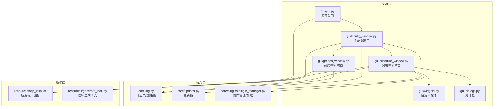
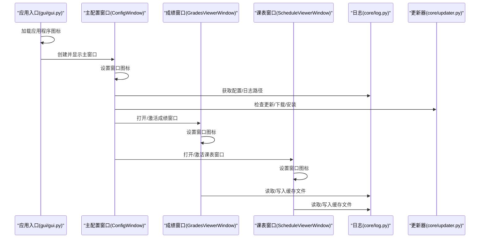
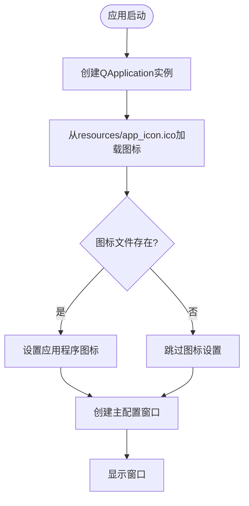
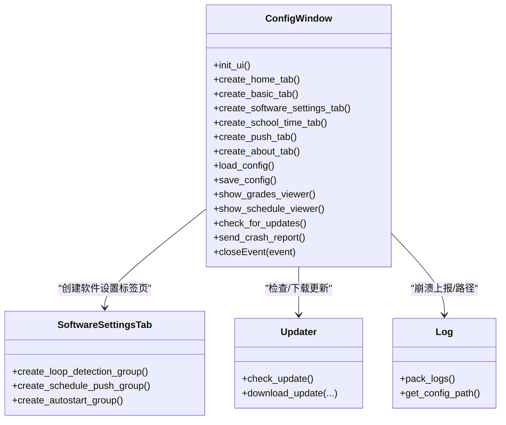
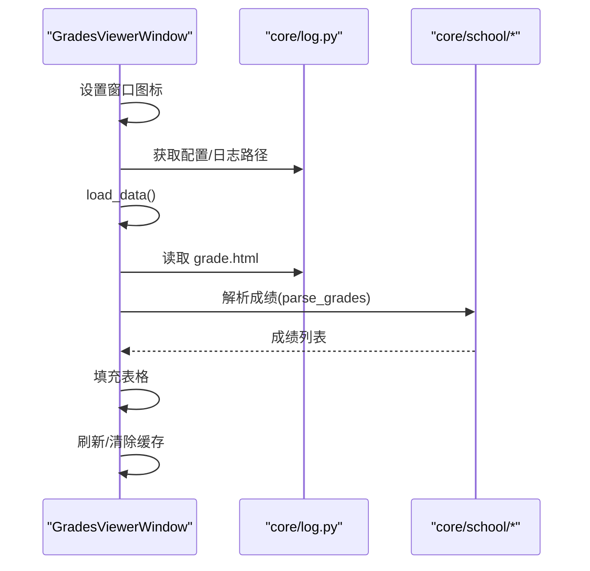
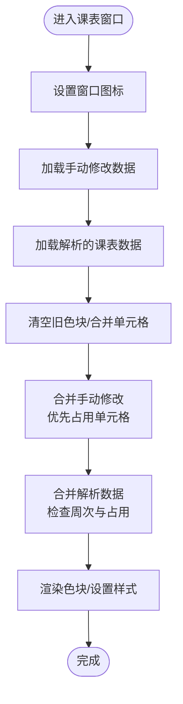
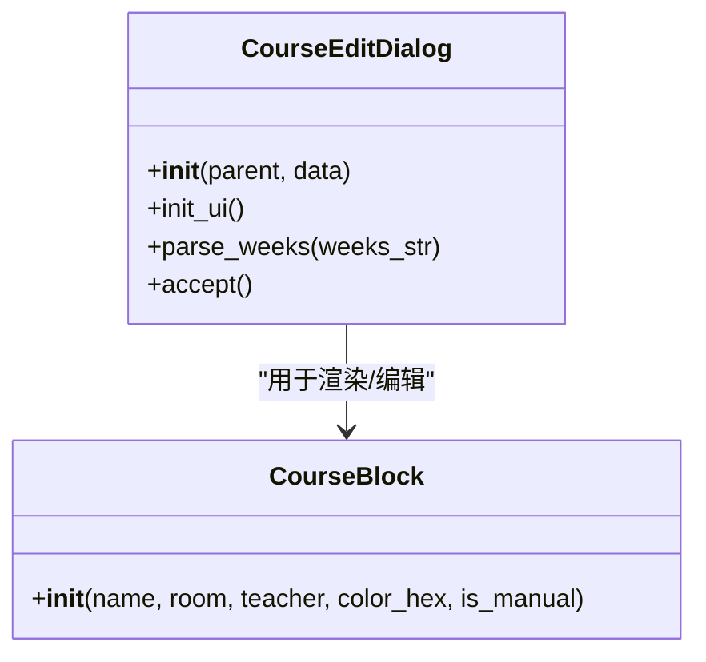
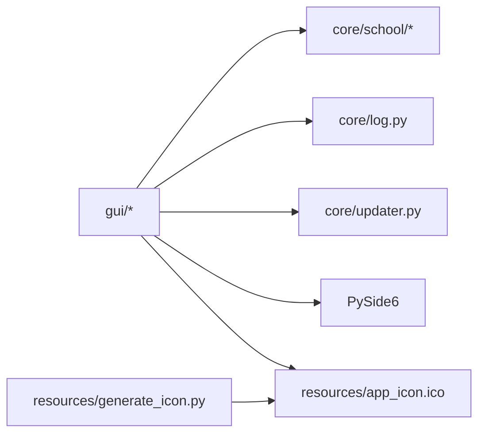

# 图形用户界面

<cite>
**本文引用的文件**
- [gui/gui.py](file://gui/gui.py)
- [gui/config_window.py](file://gui/config_window.py)
- [gui/grades_window.py](file://gui/grades_window.py)
- [gui/schedule_window.py](file://gui/schedule_window.py)
- [gui/widgets.py](file://gui/widgets.py)
- [gui/dialogs.py](file://gui/dialogs.py)
- [core/log.py](file://core/log.py)
- [core/updater.py](file://core/updater.py)
- [core/plugins/plugin_manager.py](file://core/plugins/plugin_manager.py)
- [README.md](file://README.md)
- [developer_tools/GUI_MODULAR_DESIGN.md](file://developer_tools/GUI_MODULAR_DESIGN.md)
- [gui/GUI_MODULAR_DESIGN.md](file://gui/GUI_MODULAR_DESIGN.md)
- [resources/generate_icon.py](file://resources/generate_icon.py)
</cite>

## 目录
1. [简介](#简介)
2. [项目结构](#项目结构)
3. [核心组件](#核心组件)
4. [架构总览](#架构总览)
5. [详细组件分析](#详细组件分析)
6. [依赖关系分析](#依赖关系分析)
7. [性能考量](#性能考量)
8. [故障排查指南](#故障排查指南)
9. [结论](#结论)
10. [附录](#附录)

## 简介
本文件面向基于 PySide6 的图形用户界面系统，系统性梳理了窗口组件的组织结构与交互流程，深入分析配置窗口、成绩窗口与课表窗口的实现细节（数据绑定、事件处理、用户交互），阐述自定义控件的设计与样式管理，并提供界面扩展指南与用户体验优化建议。文档兼顾技术深度与可读性，帮助开发者快速理解并高效扩展界面功能。

**更新** 本版本新增了完整的图标集成系统，所有窗口均支持应用程序图标显示，配置窗口新增软件设置标签页，包含循环检测、定时推送和托盘程序自启动等功能。

## 项目结构
- GUI 子系统位于 gui/ 目录，采用"模块化设计"：入口、主配置窗口、独立查看窗口、自定义控件与对话框分别由独立模块实现，职责清晰、耦合度低。
- 核心业务与数据访问位于 core/，通过动态导入与模块化接口与 GUI 解耦。
- 日志与更新能力由 core/log.py 与 core/updater.py 提供，GUI 通过这些服务实现崩溃报告与在线更新。
- 资源管理位于 resources/ 目录，包含图标生成工具和应用程序图标文件。

**图表来源**
- [gui/gui.py](file://gui/gui.py#L17-L27)
- [gui/config_window.py](file://gui/config_window.py#L107-L116)
- [gui/grades_window.py](file://gui/grades_window.py#L41-L48)
- [gui/schedule_window.py](file://gui/schedule_window.py#L52-L59)
- [resources/generate_icon.py](file://resources/generate_icon.py#L1-L73)

**章节来源**
- [README.md](file://README.md#L60-L83)
- [developer_tools/GUI_MODULAR_DESIGN.md](file://developer_tools/GUI_MODULAR_DESIGN.md#L1-L52)
- [gui/GUI_MODULAR_DESIGN.md](file://gui/GUI_MODULAR_DESIGN.md#L1-L52)

## 核心组件
- 应用入口与启动：gui/gui.py 初始化 QApplication 并启动主配置窗口，确保能正确定位 core 模块路径。**新增** 应用程序图标加载功能，从 resources/app_icon.ico 文件加载并设置到应用程序窗口。
- 主配置窗口：gui/config_window.py 提供"首页""基本配置""软件设置""学校时间设置""推送设置""关于"六标签页，负责配置的加载、校验与持久化；同时提供"查看成绩/课表""检查更新/崩溃上报"等交互。**新增** 软件设置标签页包含循环检测配置、定时推送设置和托盘程序自启动功能。
- 成绩查看窗口：gui/grades_window.py 以表格展示成绩，支持手动刷新与清除缓存。**新增** 窗口图标设置功能。
- 课表查看窗口：gui/schedule_window.py 以色块渲染课表，支持周次切换、双击编辑、手动覆盖与持久化。**新增** 窗口图标设置功能。
- 自定义控件：gui/widgets.py 定义 CourseBlock 色块组件，承载课程名称、教室、教师等信息。
- 对话框：gui/dialogs.py 提供课程编辑对话框，解析周次字符串并返回标准化结果。
- 日志与配置：core/log.py 统一日志与配置路径，保证打包后仍可正确读写 AppData 目录。
- 更新器：core/updater.py 通过 GitHub Releases 检查更新、下载安装包并支持进度回调。
- 院校模块：core/school/__init__.py 动态发现与加载各院校模块，为成绩/课表解析提供统一入口。

**章节来源**
- [gui/gui.py](file://gui/gui.py#L17-L27)
- [gui/config_window.py](file://gui/config_window.py#L100-L176)
- [gui/grades_window.py](file://gui/grades_window.py#L34-L50)
- [gui/schedule_window.py](file://gui/schedule_window.py#L45-L60)
- [gui/widgets.py](file://gui/widgets.py#L4-L59)
- [gui/dialogs.py](file://gui/dialogs.py#L4-L77)
- [core/log.py](file://core/log.py#L60-L82)
- [core/updater.py](file://core/updater.py#L20-L77)
- [core/school/__init__.py](file://core/school/__init__.py#L6-L28)

## 架构总览
GUI 采用"入口-主窗口-子窗口-自定义控件/对话框"的层次化组织，通过模块化与动态导入实现与核心业务解耦。主窗口集中管理配置与全局操作，子窗口专注各自领域的数据展示与交互。**新增** 完整的图标管理系统，确保所有窗口具有一致的应用程序外观。

**图表来源**
- [gui/gui.py](file://gui/gui.py#L17-L27)
- [gui/config_window.py](file://gui/config_window.py#L107-L116)
- [gui/grades_window.py](file://gui/grades_window.py#L41-L48)
- [gui/schedule_window.py](file://gui/schedule_window.py#L52-L59)

## 详细组件分析

### 应用入口与图标系统（新增）
- 应用入口初始化：gui/gui.py 创建 QApplication 实例并设置应用程序图标。
- 图标加载机制：从 BASE_DIR/resources/app_icon.ico 路径加载图标，使用异常处理确保即使图标缺失也不会影响程序启动。
- 图标应用：使用 QIcon 类创建图标对象并调用 QApplication.setWindowIcon() 设置到应用程序。

**图表来源**
- [gui/gui.py](file://gui/gui.py#L17-L27)

**章节来源**
- [gui/gui.py](file://gui/gui.py#L17-L27)

### 主配置窗口（ConfigWindow）
- 组织结构：QTabWidget 分为"首页""基本配置""软件设置""学校时间设置""推送设置""关于"六标签页，底部水平布局放置"保存配置"按钮。
- 数据绑定：使用 configparser 读写 config.ini；加载时从配置文件映射到控件；保存时将控件值写回配置。
- 事件处理：
  - 保存配置前对 Outlook/Hotmail 等邮箱进行兼容性校验。
  - "查看成绩/课表"按钮通过延迟实例化与可见性判断避免重复窗口。
  - "检查更新"使用 QProgressDialog 与 Updater 协作，支持轻量/完整版选择与进度回调。
  - "崩溃上报"调用 core/log.pack_logs 打包日志并提示保存路径。
  - 关闭事件中检查子窗口是否仍在运行，避免误关。
- 用户交互：QComboBox 选择院校、QDateEdit 设置学期首周、QSpinBox 设置循环间隔、QCheckBox/QButtonGroup 控制推送策略与定时推送开关。
- **新增** 软件设置标签页：包含循环检测配置（成绩/课表）、定时推送设置（当日/次日/下周）和托盘程序自启动功能。

**图表来源**
- [gui/config_window.py](file://gui/config_window.py#L100-L176)
- [gui/config_window.py](file://gui/config_window.py#L1012-L1071)
- [core/updater.py](file://core/updater.py#L20-L77)
- [core/log.py](file://core/log.py#L18-L57)

**章节来源**
- [gui/config_window.py](file://gui/config_window.py#L100-L176)
- [gui/config_window.py](file://gui/config_window.py#L1012-L1071)
- [gui/config_window.py](file://gui/config_window.py#L1247-L1269)
- [core/updater.py](file://core/updater.py#L42-L77)
- [core/log.py](file://core/log.py#L18-L57)

### 成绩查看窗口（GradesViewerWindow）
- 组织结构：垂直布局，上方 QTableWidget 展示成绩，下方水平布局放"刷新/清除缓存"按钮。
- 数据绑定：从 APPDATA 目录下的 grade.html 读取 HTML，调用对应院校模块解析为结构化数据，填充表格。
- 事件处理：
  - 刷新：禁用按钮、设置等待光标、通过 subprocess 调用 core/go.py 强制抓取，完成后恢复并提示。
  - 清除缓存：询问确认，删除 grade.html 与 last_grades.json，刷新视图。
- 用户交互：表格不可编辑，字体放大提升可读性。
- **新增** 窗口图标设置：从 resources/app_icon.ico 加载并设置到窗口。

**图表来源**
- [gui/grades_window.py](file://gui/grades_window.py#L34-L50)
- [gui/grades_window.py](file://gui/grades_window.py#L120-L152)

**章节来源**
- [gui/grades_window.py](file://gui/grades_window.py#L34-L50)
- [gui/grades_window.py](file://gui/grades_window.py#L120-L152)
- [gui/grades_window.py](file://gui/grades_window.py#L153-L169)
- [core/log.py](file://core/log.py#L60-L82)
- [core/school/__init__.py](file://core/school/__init__.py#L22-L28)

### 课表查看窗口（ScheduleViewerWindow）
- 组织结构：顶部周次切换与"本周/第X周"提示，中间色块表格展示，底部"刷新/清除"按钮。
- 数据绑定：从 APPDATA 目录下的 schedule.html 读取 HTML，调用对应院校模块解析；同时加载手动修改的 manual_schedule.json。
- 事件处理：
  - 周次切换：计算当前周、更新标签、重新加载数据。
  - 双击编辑：弹出 CourseEditDialog，解析周次字符串，保存至 manual_schedule.json，重新渲染。
  - 刷新：禁用按钮、设置等待光标、通过 subprocess 调用 core/go.py 强制抓取，完成后恢复并提示。
  - 清除缓存：询问确认，删除 schedule.html 与 manual_schedule.json。
- 用户交互：表格隐藏网格线、增加行高、节次列固定宽度；手动修改色块带边框标识。
- **新增** 窗口图标设置：从 resources/app_icon.ico 加载并设置到窗口。

**图表来源**
- [gui/schedule_window.py](file://gui/schedule_window.py#L45-L60)
- [gui/schedule_window.py](file://gui/schedule_window.py#L402-L524)

**章节来源**
- [gui/schedule_window.py](file://gui/schedule_window.py#L45-L60)
- [gui/schedule_window.py](file://gui/schedule_window.py#L402-L524)

### 自定义控件与对话框
- CourseBlock（gui/widgets.py）：QFrame 子类，内含课程名称与教室/教师信息的两行标签，支持圆角背景与居中排版。
- CourseEditDialog（gui/dialogs.py）：表单式对话框，输入课程名称、教室、教师、周次、持续节数，解析周次字符串为有序列表，返回标准化结果给父窗口。

**图表来源**
- [gui/widgets.py](file://gui/widgets.py#L4-L59)
- [gui/dialogs.py](file://gui/dialogs.py#L4-L77)

**章节来源**
- [gui/widgets.py](file://gui/widgets.py#L4-L59)
- [gui/dialogs.py](file://gui/dialogs.py#L4-L77)

## 依赖关系分析
- 模块耦合与内聚：
  - GUI 模块之间通过函数调用与事件连接，避免直接互相导入，降低耦合。
  - 与核心业务通过动态导入与统一接口（如 get_school_module）解耦。
- 外部依赖：
  - PySide6：窗口、控件、事件系统。
  - Python 标准库：subprocess、configparser、urllib、json、datetime 等。
  - 第三方：requests（在扩展的推送模块中使用，非当前 GUI 直接依赖）。
- **新增** 资源依赖：所有窗口依赖 resources/app_icon.ico 图标文件，图标生成工具位于 resources/generate_icon.py。

**图表来源**
- [gui/config_window.py](file://gui/config_window.py#L107-L116)
- [gui/grades_window.py](file://gui/grades_window.py#L41-L48)
- [gui/schedule_window.py](file://gui/schedule_window.py#L52-L59)
- [core/plugins/plugin_manager.py](file://core/plugins/plugin_manager.py)
- [core/log.py](file://core/log.py#L60-L82)
- [core/updater.py](file://core/updater.py#L20-L41)
- [resources/generate_icon.py](file://resources/generate_icon.py#L1-L73)

**章节来源**
- [gui/config_window.py](file://gui/config_window.py#L107-L116)
- [gui/grades_window.py](file://gui/grades_window.py#L41-L48)
- [gui/schedule_window.py](file://gui/schedule_window.py#L52-L59)
- [core/school/__init__.py](file://core/school/__init__.py#L6-L28)
- [core/log.py](file://core/log.py#L60-L82)
- [core/updater.py](file://core/updater.py#L20-L41)
- [resources/generate_icon.py](file://resources/generate_icon.py#L1-L73)

## 性能考量
- I/O 与渲染：
  - 成绩/课表窗口从本地 HTML 文件读取，避免频繁网络请求；手动修改数据以 JSON 存储，读写开销可控。
  - 课表色块渲染采用合并单元格与固定行高，减少重绘次数。
- 进度反馈：
  - 更新检查与下载使用 QProgressDialog 提示进度，避免界面卡死。
- 资源释放：
  - 刷新时设置等待光标并在 finally 恢复，防止异常导致光标常驻。
- **新增** 图标加载优化：
  - 图标文件存在性检查：在设置图标前检查文件是否存在，避免不必要的异常处理。
  - 异常处理：使用 try-except 包装图标设置过程，确保图标加载失败不影响程序正常运行。
- 建议：
  - 对于大规模数据渲染，可考虑分页或延迟加载；对频繁解析的 HTML 可引入缓存与增量更新策略。

## 故障排查指南
- 配置保存失败：
  - 检查配置文件路径与写权限；确认 AppData 目录存在且可写。
- 成绩/课表加载失败：
  - 确认 grade.html/schedule.html 是否存在；检查对应院校模块是否可用。
- 更新失败：
  - 检查网络连通性与 GitHub API 可达性；确认下载目录可写。
- 崩溃报告：
  - 使用"崩溃上报"功能生成压缩日志，便于定位问题。
- **新增** 图标显示问题：
  - 检查 resources/app_icon.ico 文件是否存在且可读；
  - 确认应用程序具有读取资源文件的权限；
  - 验证图标文件格式是否为有效的 ICO 格式。

**章节来源**
- [gui/config_window.py](file://gui/config_window.py#L397-L404)
- [gui/grades_window.py](file://gui/grades_window.py#L139-L141)
- [gui/schedule_window.py](file://gui/schedule_window.py#L366-L367)
- [core/log.py](file://core/log.py#L18-L57)
- [core/updater.py](file://core/updater.py#L71-L77)

## 结论
本 GUI 子系统通过模块化设计实现了清晰的职责分离与良好的扩展性。主配置窗口集中管理配置与全局操作，成绩与课表窗口分别聚焦数据展示与交互，自定义控件与对话框提升了可复用性与用户体验。**新增** 的完整图标系统确保了应用程序的一致外观，软件设置标签页提供了更丰富的配置选项。结合日志与更新能力，系统具备完善的运行时支持。建议在后续迭代中进一步完善无障碍支持与主题切换机制，以提升长期可用性与可维护性。

## 附录

### 界面扩展指南（添加新功能界面）
- 新窗口：创建独立模块（如 new_window.py），在主配置窗口中注册按钮与事件，避免与现有窗口耦合。**新增** 记得添加图标设置功能。
- 新对话框：在 dialogs.py 或新建模块中实现，遵循标准化输入与返回值约定。
- 新组件：在 widgets.py 或新建模块中实现纯 UI 组件，保持与业务逻辑解耦。
- 配置项：在 config_window.py 中添加相应 UI 与配置逻辑，注意加载/保存的一致性。
- **新增** 图标集成：为新窗口添加图标设置功能，确保与应用程序主题一致。

**章节来源**
- [developer_tools/GUI_MODULAR_DESIGN.md](file://developer_tools/GUI_MODULAR_DESIGN.md#L42-L52)
- [gui/GUI_MODULAR_DESIGN.md](file://gui/GUI_MODULAR_DESIGN.md#L42-L52)

### 用户体验优化建议
- 无障碍支持：为按钮与表格添加可访问性标签与键盘导航；为重要提示使用语义化标签。
- 主题与样式：通过统一的样式表或主题切换机制，支持明暗主题与高对比度模式。
- 响应式布局：在不同分辨率下保持控件比例与可读性；为长文本提供省略与悬浮提示。
- 错误提示：使用一致的错误对话框与日志记录，提供"复制详情""崩溃上报"入口。
- **新增** 图标一致性：确保所有窗口使用相同的图标风格，提升应用程序的专业感。

### 图标生成与管理指南
- 图标生成：使用 resources/generate_icon.py 工具生成多尺寸的图标文件。
- 图标格式：支持 PNG 和 ICO 格式，ICO 格式包含多种尺寸以适应不同显示需求。
- 图标使用：所有窗口通过相对路径引用 resources/app_icon.ico 文件。
- 图标定制：可根据需要修改图标生成脚本中的颜色、字体和尺寸参数。

**章节来源**
- [resources/generate_icon.py](file://resources/generate_icon.py#L1-L73)