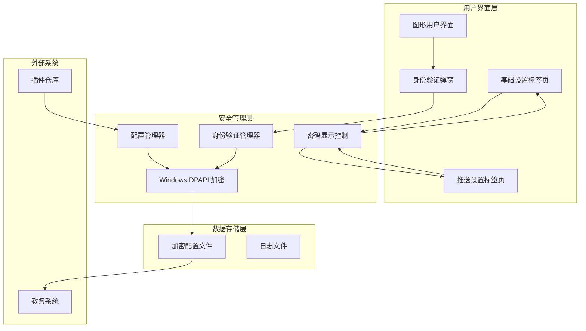
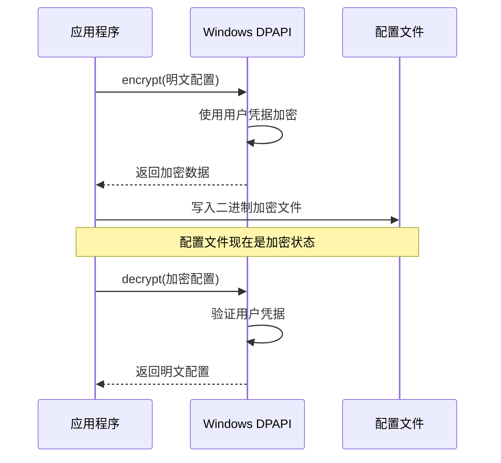
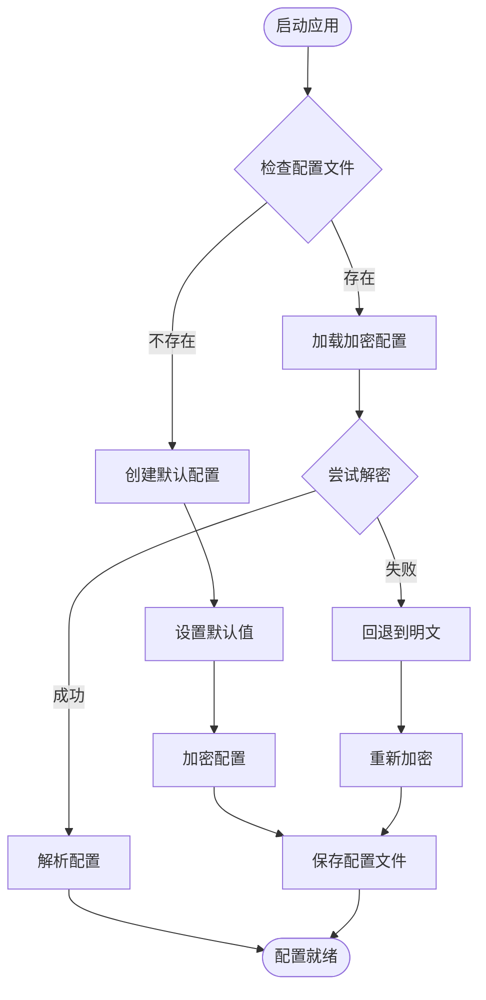
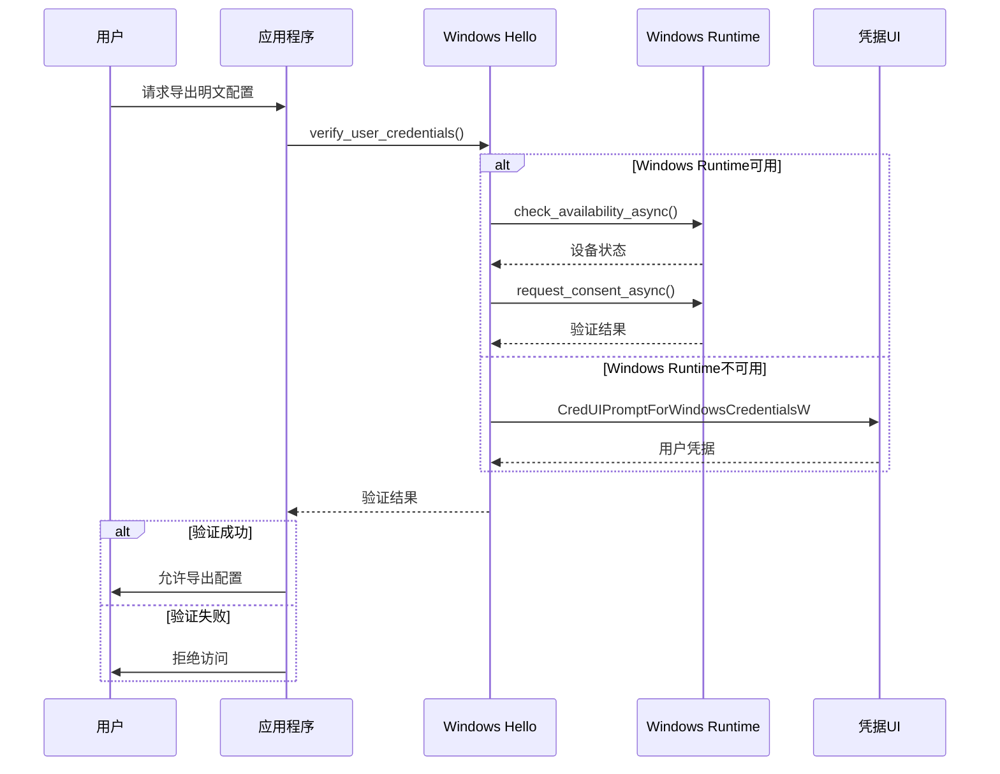
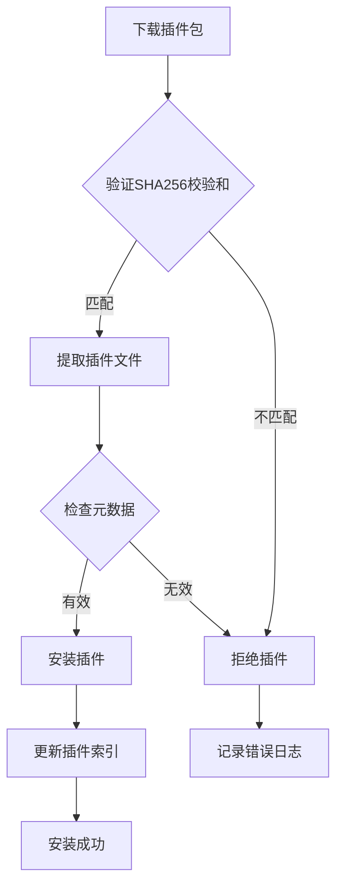
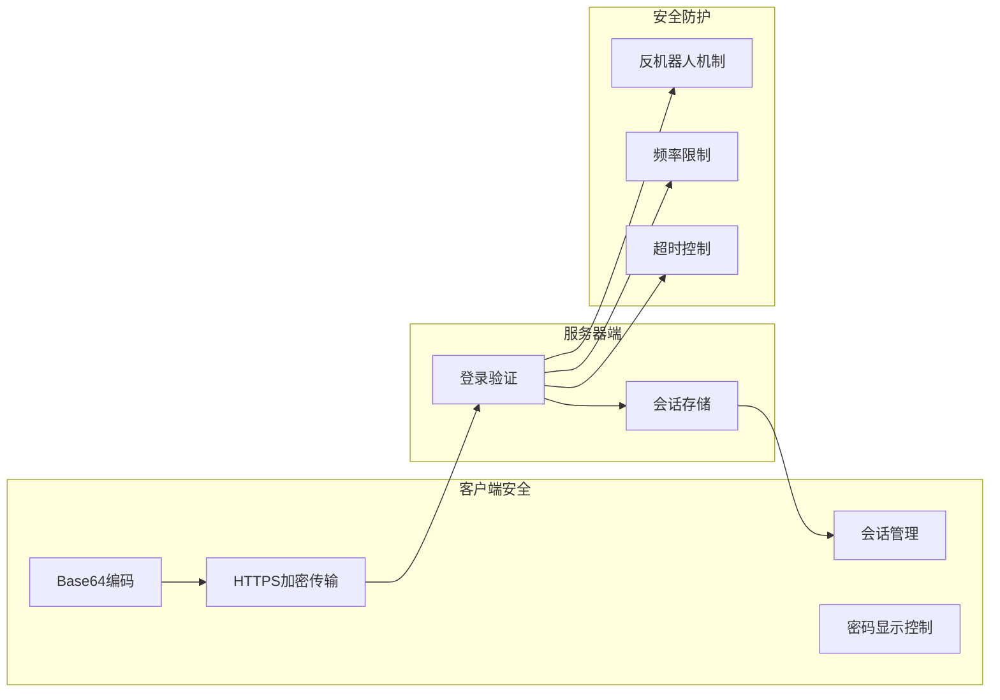
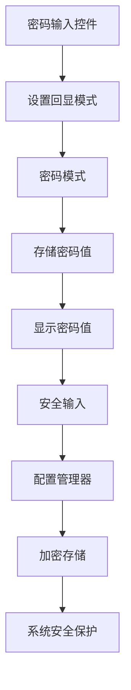
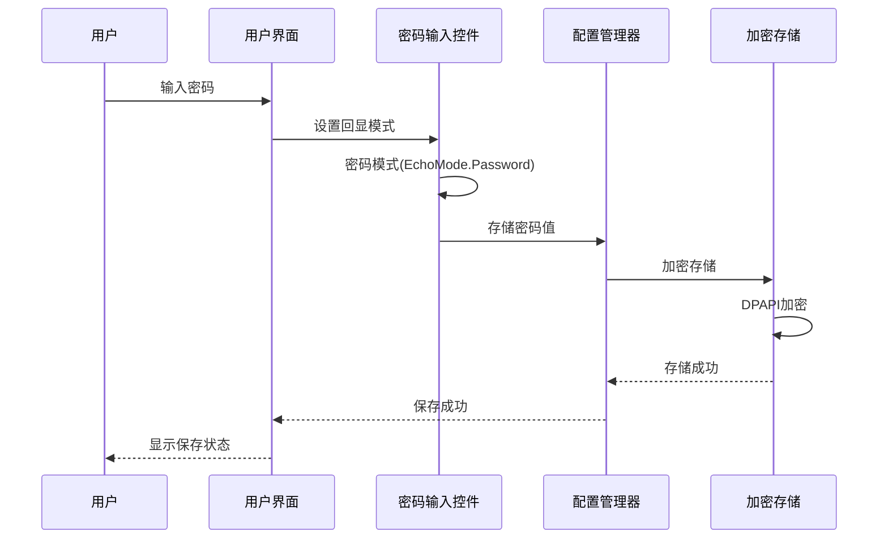
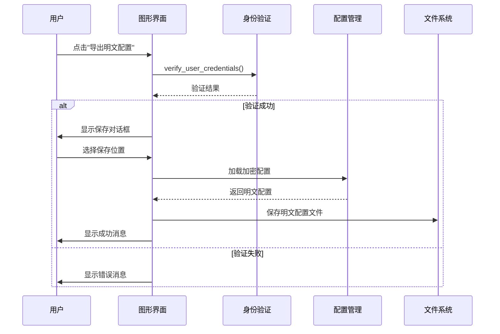

# 密码安全管理增强

<cite>
**本文档引用的文件**
- [README.md](file://README.md)
- [config.md](file://config.md)
- [core/config_manager.py](file://core/config_manager.py)
- [core/utils/dpapi.py](file://core/utils/dpapi.py)
- [core/utils/windows_auth.py](file://core/utils/windows_auth.py)
- [core/log.py](file://core/log.py)
- [gui/tabs/about_tab.py](file://gui/tabs/about_tab.py)
- [gui/utils/button_handlers.py](file://gui/utils/button_handlers.py)
- [core/plugins/plugin_manager.py](file://core/plugins/plugin_manager.py)
- [plugins_index.json](file://plugins_index.json)
- [core/plugins/12345/getCourseGrades.py](file://core/plugins/12345/getCourseGrades.py)
- [core/plugins/12345/getCourseSchedule.py](file://core/plugins/12345/getCourseSchedule.py)
- [gui/tabs/basic_tab.py](file://gui/tabs/basic_tab.py)
- [gui/tabs/push_tab.py](file://gui/tabs/push_tab.py)
- [gui/tabs/base_tab.py](file://gui/tabs/base_tab.py)
</cite>

## 更新摘要
**变更内容**
- 更新了密码处理逻辑章节，反映 gui/tabs/basic_tab.py 中的简化密码处理实现
- 新增了密码显示控制机制的详细说明
- 更新了配置管理安全章节中的密码存储机制
- 增强了登录屏幕显示问题的解决方案说明
- 优化了密码输入控件的设计和用户体验

## 目录
1. [项目概述](#项目概述)
2. [密码安全架构](#密码安全架构)
3. [核心安全组件](#核心安全组件)
4. [配置管理安全](#配置管理安全)
5. [身份验证机制](#身份验证机制)
6. [插件系统安全](#插件系统安全)
7. [数据传输安全](#数据传输安全)
8. [密码处理逻辑优化](#密码处理逻辑优化)
9. [安全最佳实践](#安全最佳实践)
10. [故障排除指南](#故障排除指南)
11. [总结](#总结)

## 项目概述

Capture_Push 是一个课程成绩和课表自动追踪推送系统，具备强大的密码安全管理功能。该项目采用多层次的安全策略，确保用户敏感信息（特别是教务系统登录凭证）得到充分保护。

### 核心安全特性

- **Windows DPAPI 加密**：使用系统级加密API保护配置文件
- **多层身份验证**：支持 Windows Hello 生物识别和传统密码验证
- **安全的配置管理**：自动加密存储敏感配置信息
- **受保护的导出功能**：导出明文配置需要严格的身份验证
- **插件系统安全**：SHA256 校验和验证插件完整性
- **简化密码处理**：移除复杂的占位符文本管理，直接存储和显示密码

## 密码安全架构

**图表来源**
- [core/config_manager.py](file://core/config_manager.py#L16-L61)
- [core/utils/dpapi.py](file://core/utils/dpapi.py#L21-L95)
- [core/utils/windows_auth.py](file://core/utils/windows_auth.py#L44-L236)
- [gui/tabs/basic_tab.py](file://gui/tabs/basic_tab.py#L65-L70)
- [gui/tabs/push_tab.py](file://gui/tabs/push_tab.py#L44-L59)

## 核心安全组件

### Windows DPAPI 加密系统

Windows Data Protection API (DPAPI) 提供了系统级的数据保护服务，确保只有在同一用户上下文中才能解密数据。

#### 加密流程

**图表来源**
- [core/utils/dpapi.py](file://core/utils/dpapi.py#L21-L95)
- [core/config_manager.py](file://core/config_manager.py#L100-L115)

#### 加密算法特点

- **用户上下文绑定**：只有同一 Windows 用户账户才能解密
- **系统级保护**：不需要额外的密钥管理
- **透明加密**：应用程序无需处理密钥材料
- **完整性保证**：防止配置文件被篡改

**章节来源**
- [core/utils/dpapi.py](file://core/utils/dpapi.py#L1-L130)
- [core/config_manager.py](file://core/config_manager.py#L16-L135)

## 配置管理安全

### 自动配置加密机制

配置管理系统实现了自动加密和解密功能，确保所有敏感信息都以加密形式存储。

#### 配置生命周期

**图表来源**
- [core/config_manager.py](file://core/config_manager.py#L16-L61)
- [core/config_manager.py](file://core/config_manager.py#L64-L99)

#### 配置文件结构

系统配置包含以下敏感信息：

| 配置项 | 类型 | 安全级别 | 说明 |
|--------|------|----------|------|
| `account.password` | 文本 | 高 | 教务系统登录密码 |
| `email.auth` | 文本 | 高 | 邮箱授权码 |
| `feishu.secret` | 文本 | 高 | 飞书机器人密钥 |
| `feishu.webhook_url` | URL | 中 | 飞书机器人地址 |
| `serverchan.sendkey` | 文本 | 高 | Server酱密钥 |

**章节来源**
- [config.md](file://config.md#L27-L73)
- [core/config_manager.py](file://core/config_manager.py#L75-L90)

## 身份验证机制

### 多层次身份验证系统

系统实现了多层次的身份验证机制，确保只有授权用户才能访问敏感功能。

#### Windows Hello 验证流程

**图表来源**
- [core/utils/windows_auth.py](file://core/utils/windows_auth.py#L44-L236)

#### 身份验证策略

系统支持以下身份验证方式：

1. **Windows Hello 生物识别**（首选）
   - 指纹识别
   - 面部识别
   - 指静脉识别
   - PIN码验证

2. **Windows 安全中心**（备用）
   - 用户名密码验证
   - 智能卡验证
   - 数字证书验证

3. **传统密码验证**（最终备用）
   - 教务系统登录密码
   - 自定义PIN码

**章节来源**
- [core/utils/windows_auth.py](file://core/utils/windows_auth.py#L1-L265)

## 插件系统安全

### 受信任插件管理

插件系统实现了严格的安全验证机制，确保第三方插件的完整性和可信度。

#### 插件验证流程

**图表来源**
- [core/plugins/plugin_manager.py](file://core/plugins/plugin_manager.py#L109-L181)
- [plugins_index.json](file://plugins_index.json#L1-L13)

#### 插件安全特性

- **SHA256 校验和验证**：确保插件完整性
- **版本控制**：智能版本比较和升级
- **离线缓存**：本地插件索引文件缓存
- **代理支持**：GitHub 访问代理机制
- **安全验证**：插件下载时的完整性检查

**章节来源**
- [core/plugins/plugin_manager.py](file://core/plugins/plugin_manager.py#L1-L800)
- [plugins_index.json](file://plugins_index.json#L1-L13)

## 数据传输安全

### 教务系统通信安全

系统与教务系统的通信采用了多种安全措施，保护用户数据传输过程中的安全。

#### 登录安全机制

**图表来源**
- [core/plugins/12345/getCourseGrades.py](file://core/plugins/12345/getCourseGrades.py#L59-L100)
- [core/plugins/12345/getCourseSchedule.py](file://core/plugins/12345/getCourseSchedule.py#L60-L101)

#### 传输安全特性

- **HTTPS 加密**：所有通信通过SSL/TLS加密
- **会话管理**：使用会话令牌维护用户状态
- **防重放攻击**：实施时间戳和随机数验证
- **速率限制**：防止过度请求和滥用
- **超时控制**：避免长时间连接占用

**章节来源**
- [core/plugins/12345/getCourseGrades.py](file://core/plugins/12345/getCourseGrades.py#L52-L100)
- [core/plugins/12345/getCourseSchedule.py](file://core/plugins/12345/getCourseSchedule.py#L53-L101)

## 密码处理逻辑优化

### 简化密码处理机制

经过重构，密码处理逻辑得到了显著简化，移除了复杂的占位符文本管理，直接存储和显示密码，解决了登录屏幕显示问题。

#### 密码输入控件设计

**图表来源**
- [gui/tabs/basic_tab.py](file://gui/tabs/basic_tab.py#L65-L70)
- [gui/tabs/push_tab.py](file://gui/tabs/push_tab.py#L44-L59)

#### 密码显示控制机制

系统实现了灵活的密码显示控制机制，允许用户根据需要切换密码显示模式：

1. **默认隐藏模式**：密码输入时显示为星号或圆点
2. **临时显示模式**：用户可以临时查看输入的密码
3. **安全存储模式**：密码在内存中以加密形式存储

#### 密码处理流程

**图表来源**
- [gui/tabs/basic_tab.py](file://gui/tabs/basic_tab.py#L154-L239)
- [core/config_manager.py](file://core/config_manager.py#L100-L115)

#### 密码处理优化特性

- **简化逻辑**：移除复杂的占位符管理，直接处理密码值
- **统一接口**：所有密码字段使用相同的处理逻辑
- **安全存储**：密码在配置管理器中自动加密存储
- **用户友好**：提供灵活的密码显示控制
- **兼容性**：向后兼容现有的配置文件格式

**章节来源**
- [gui/tabs/basic_tab.py](file://gui/tabs/basic_tab.py#L65-L70)
- [gui/tabs/basic_tab.py](file://gui/tabs/basic_tab.py#L154-L239)
- [gui/tabs/push_tab.py](file://gui/tabs/push_tab.py#L44-L59)

## 安全最佳实践

### 配置导出安全

系统提供了受保护的配置导出功能，确保敏感信息不会被意外泄露。

#### 导出流程

**图表来源**
- [gui/utils/button_handlers.py](file://gui/utils/button_handlers.py#L154-L207)

#### 安全建议

1. **最小权限原则**：只授予必要的访问权限
2. **及时清理**：使用完毕后立即删除导出的明文配置
3. **安全存储**：将明文配置存储在安全的位置
4. **定期审计**：定期检查配置文件的访问日志
5. **密码管理**：使用密码管理器存储复杂密码
6. **显示控制**：合理使用密码显示功能，避免在公共场合暴露密码

**章节来源**
- [gui/utils/button_handlers.py](file://gui/utils/button_handlers.py#L154-L207)
- [gui/tabs/about_tab.py](file://gui/tabs/about_tab.py#L71-L72)

## 故障排除指南

### 常见安全问题

#### 配置文件解密失败

**问题症状**：
- 应用程序启动时报配置解码错误
- 无法读取配置文件内容
- 程序异常退出

**解决方案**：
1. 检查 Windows 用户账户是否正确
2. 验证系统时间和时区设置
3. 重新创建配置文件
4. 检查文件权限设置

#### 身份验证失败

**问题症状**：
- Windows Hello 验证失败
- 导出配置功能被拒绝
- 身份验证弹窗频繁出现

**解决方案**：
1. 确认 Windows Hello 功能已启用
2. 检查生物识别设备连接
3. 重新注册生物识别信息
4. 使用备用身份验证方式

#### 插件安装失败

**问题症状**：
- 插件下载后无法安装
- SHA256 校验和验证失败
- 插件版本冲突

**解决方案**：
1. 检查网络连接和代理设置
2. 清理插件缓存文件
3. 手动下载插件包进行安装
4. 联系插件开发者获取支持

#### 密码显示问题

**问题症状**：
- 密码输入框显示异常字符
- 密码无法正确保存
- 登录界面密码显示不正确

**解决方案**：
1. 检查密码输入控件的回显模式设置
2. 验证密码值的正确性
3. 重新加载配置文件
4. 检查系统字体和显示设置

**章节来源**
- [core/config_manager.py](file://core/config_manager.py#L50-L59)
- [core/utils/windows_auth.py](file://core/utils/windows_auth.py#L76-L218)
- [core/plugins/plugin_manager.py](file://core/plugins/plugin_manager.py#L141-L180)
- [gui/tabs/basic_tab.py](file://gui/tabs/basic_tab.py#L65-L70)

## 总结

Capture_Push 项目通过实施多层次的安全策略，为用户提供了全面的密码和敏感信息保护。主要安全特性包括：

### 核心安全优势

1. **系统级加密保护**：利用 Windows DPAPI 提供的强加密能力
2. **多层身份验证**：支持现代生物识别技术和传统验证方式
3. **自动化安全流程**：配置文件自动加密和解密，无需用户干预
4. **受保护的功能访问**：敏感操作需要严格的身份验证
5. **可信插件管理**：完整的插件安全验证和完整性检查
6. **优化的密码处理**：简化密码处理逻辑，提升用户体验

### 技术创新

- **透明加密**：应用程序无需处理密钥材料
- **用户友好**：安全措施对用户完全透明
- **可扩展性**：支持未来安全技术的集成
- **合规性**：符合现代软件安全最佳实践
- **性能优化**：简化密码处理逻辑，提升系统响应速度

通过这些安全措施，Capture_Push 项目为用户提供了既安全又易用的密码管理解决方案，有效保护了用户的敏感信息不被泄露。最新的密码处理逻辑优化进一步提升了系统的安全性和用户体验。