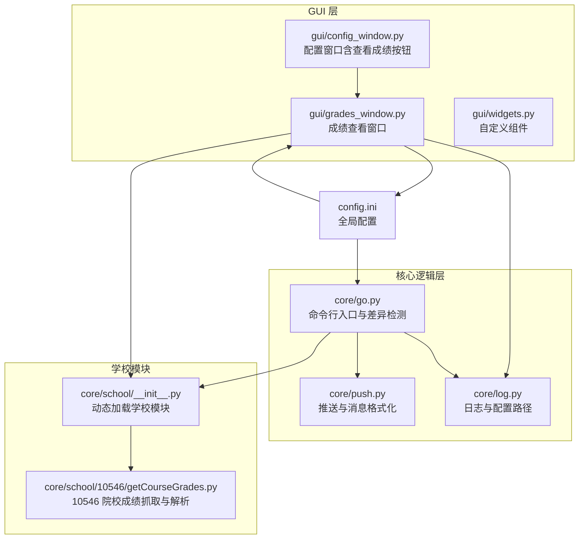
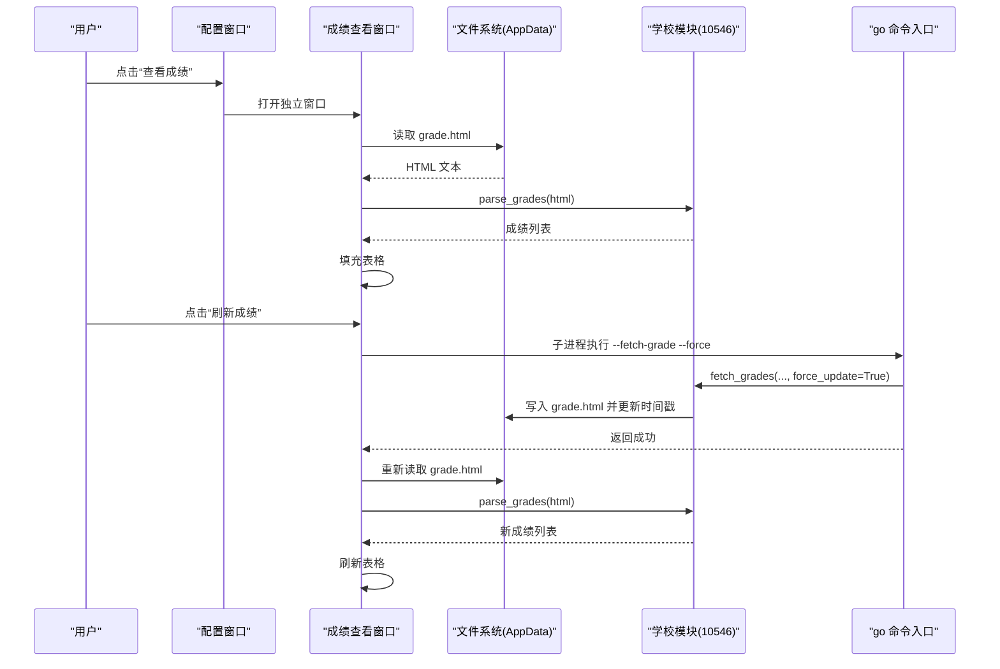
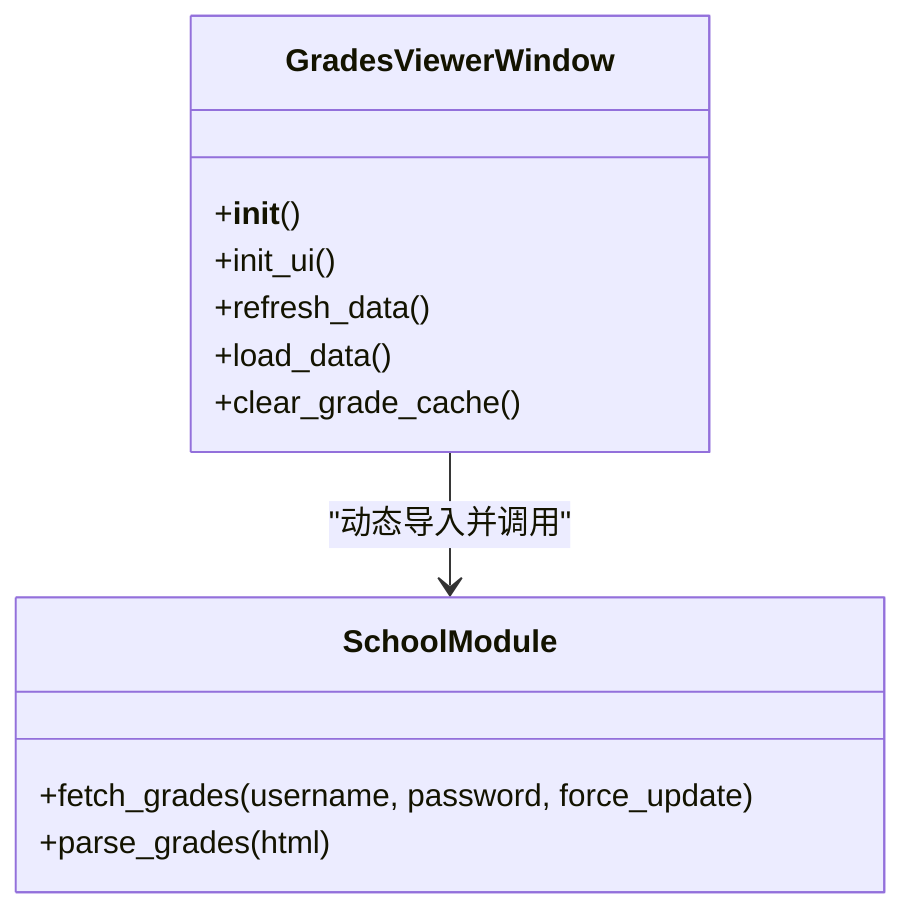
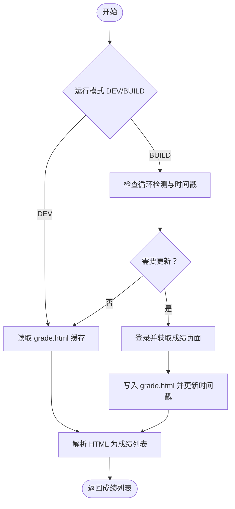
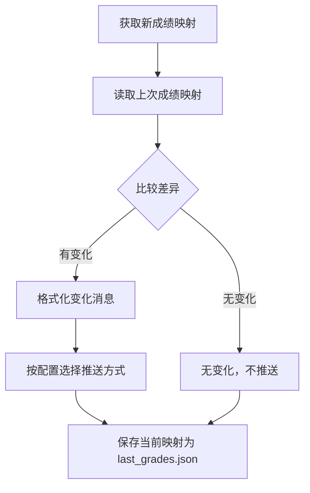
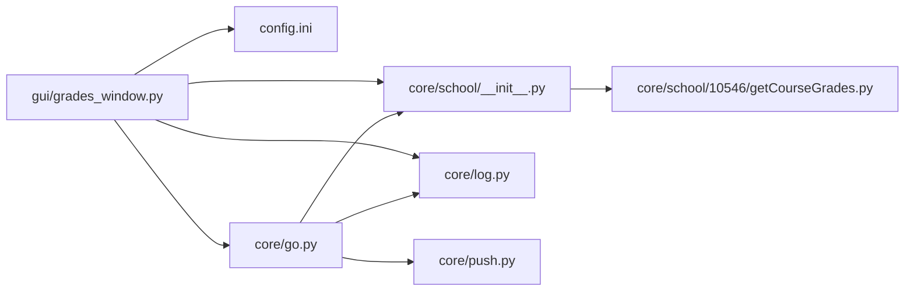

# 成绩窗口

<cite>
**本文引用的文件**
- [gui/grades_window.py](file://gui/grades_window.py)
- [core/school/10546/getCourseGrades.py](file://core/school/10546/getCourseGrades.py)
- [core/school/__init__.py](file://core/school/__init__.py)
- [core/go.py](file://core/go.py)
- [core/log.py](file://core/log.py)
- [config.ini](file://config.ini)
- [gui/config_window.py](file://gui/config_window.py)
- [developer_tools/EXTENSION_GUIDE.md](file://developer_tools/EXTENSION_GUIDE.md)
- [gui/widgets.py](file://gui/widgets.py)
- [core/push.py](file://core/push.py)
</cite>

## 目录
1. [简介](#简介)
2. [项目结构](#项目结构)
3. [核心组件](#核心组件)
4. [架构总览](#架构总览)
5. [详细组件分析](#详细组件分析)
6. [依赖关系分析](#依赖关系分析)
7. [性能考量](#性能考量)
8. [故障排查指南](#故障排查指南)
9. [结论](#结论)
10. [附录](#附录)

## 简介
本文件面向“成绩窗口”的实现与使用，系统性阐述成绩数据的采集、处理与展示全流程，包括：
- 数据来源与获取：从教务系统抓取 HTML，解析为结构化成绩列表
- 缓存与更新策略：基于 AppData 的本地缓存与循环检测
- 窗口渲染与交互：基于 Qt 的表格渲染、按钮操作与错误提示
- 变化可视化：通过差异检测与状态文件实现“变化感知”
- 定制化扩展：如何新增院校模块与推送方式
- 性能优化与大数据量处理建议

## 项目结构
成绩窗口位于 GUI 层，围绕“成绩查看”这一独立功能域组织，与核心业务逻辑（抓取、解析、推送）通过模块化接口解耦。

图表来源
- [gui/grades_window.py](file://gui/grades_window.py#L1-L158)
- [core/school/__init__.py](file://core/school/__init__.py#L1-L28)
- [core/school/10546/getCourseGrades.py](file://core/school/10546/getCourseGrades.py#L1-L329)
- [core/go.py](file://core/go.py#L1-L536)
- [core/log.py](file://core/log.py#L1-L211)
- [config.ini](file://config.ini#L1-L36)

章节来源
- [gui/grades_window.py](file://gui/grades_window.py#L1-L158)
- [core/school/__init__.py](file://core/school/__init__.py#L1-L28)
- [core/school/10546/getCourseGrades.py](file://core/school/10546/getCourseGrades.py#L1-L329)
- [core/go.py](file://core/go.py#L1-L536)
- [core/log.py](file://core/log.py#L1-L211)
- [config.ini](file://config.ini#L1-L36)

## 核心组件
- 成绩查看窗口：负责 UI 布局、按钮交互、数据加载与缓存清理
- 学校模块（10546）：负责登录、抓取 HTML、解析表格、缓存写入与时间戳维护
- go 命令入口：负责差异检测、推送控制、状态持久化
- 日志与配置：统一 AppData 目录下的配置与日志路径管理
- 配置窗口：提供“查看成绩”入口，便于打开独立窗口

章节来源
- [gui/grades_window.py](file://gui/grades_window.py#L32-L158)
- [core/school/10546/getCourseGrades.py](file://core/school/10546/getCourseGrades.py#L278-L329)
- [core/go.py](file://core/go.py#L83-L144)
- [core/log.py](file://core/log.py#L60-L128)
- [gui/config_window.py](file://gui/config_window.py#L75-L87)

## 架构总览
成绩窗口的端到端流程如下：
- 用户点击“查看成绩”，打开独立窗口
- 窗口加载 AppData 目录中的 grade.html
- 通过学校模块动态解析 HTML，得到结构化成绩列表
- 将数据填充到表格控件
- 提供“刷新成绩（从网络获取）”和“清除成绩缓存”按钮
- 刷新通过子进程调用 go 命令入口，支持强制更新与循环检测

图表来源
- [gui/grades_window.py](file://gui/grades_window.py#L79-L107)
- [core/school/10546/getCourseGrades.py](file://core/school/10546/getCourseGrades.py#L278-L295)
- [core/go.py](file://core/go.py#L481-L489)

章节来源
- [gui/grades_window.py](file://gui/grades_window.py#L79-L107)
- [core/school/10546/getCourseGrades.py](file://core/school/10546/getCourseGrades.py#L278-L295)
- [core/go.py](file://core/go.py#L481-L489)

## 详细组件分析

### 成绩查看窗口（GradesViewerWindow）
- 角色定位：独立窗口，专注成绩数据展示与交互
- UI 结构：垂直布局包含表格与底部按钮区；表格列包含“学期、课程名称、成绩、学分、课程属性、课程编号”
- 表格特性：固定列数、课程名称列拉伸、禁用编辑、隐藏纵向表头
- 交互逻辑：
  - 刷新按钮：禁用按钮、设置等待光标、调用 go 命令入口执行 --fetch-grade --force，完成后恢复光标并提示
  - 清除缓存：二次确认后删除 grade.html 与 last_grades.json，随后重新加载数据
- 数据加载：从 AppData 目录读取 grade.html，动态获取当前学校代码，导入对应学校模块，调用其 parse_grades 解析，再逐行填充表格

图表来源
- [gui/grades_window.py](file://gui/grades_window.py#L32-L158)
- [core/school/__init__.py](file://core/school/__init__.py#L22-L27)

章节来源
- [gui/grades_window.py](file://gui/grades_window.py#L32-L158)

### 学校模块（10546）：抓取与解析
- 登录与会话：构造 base64 编码的凭证，使用 Session 发起登录请求，设置 IPv4 适配器与 UA/Referer
- 成绩抓取：根据运行模式（DEV/BUILD）决定是否读取本地缓存或发起网络请求；网络请求成功后写入 grade.html 并更新时间戳
- 循环检测：读取配置中的 enabled 与 time，结合 grade_timestamp.txt 判断是否需要更新
- HTML 解析：使用 BeautifulSoup 查找 id=dataList 的表格，遍历行并提取所需字段，形成标准字典列表
- 主流程：fetch_grades(username, password, force_update) 组合 login 与 get_grade_html，最终 parse_grades

图表来源
- [core/school/10546/getCourseGrades.py](file://core/school/10546/getCourseGrades.py#L31-L44)
- [core/school/10546/getCourseGrades.py](file://core/school/10546/getCourseGrades.py#L117-L156)
- [core/school/10546/getCourseGrades.py](file://core/school/10546/getCourseGrades.py#L170-L229)
- [core/school/10546/getCourseGrades.py](file://core/school/10546/getCourseGrades.py#L232-L262)

章节来源
- [core/school/10546/getCourseGrades.py](file://core/school/10546/getCourseGrades.py#L278-L329)

### go 命令入口：差异检测与状态管理
- 差异检测：将新成绩映射为“课程名称→成绩”的字典，与 last_grades.json 比较，生成变化集合
- 推送控制：支持仅推送变化或推送全部；若未启用推送则打印提示
- 状态持久化：保存当前成绩映射到 state 目录，用于下次对比
- 命令行参数：--fetch-grade、--push-grade、--push-all-grades、--force 等

图表来源
- [core/go.py](file://core/go.py#L83-L144)
- [core/go.py](file://core/go.py#L61-L71)

章节来源
- [core/go.py](file://core/go.py#L83-L144)

### 日志与配置路径管理
- 配置路径：统一从 AppData 目录读取 config.ini，保证打包后仍可定位
- 日志路径：按日期生成日志文件，支持清理旧日志与滚动文件
- 初始化：模块级日志记录器，避免重复添加处理器

章节来源
- [core/log.py](file://core/log.py#L60-L128)
- [core/log.py](file://core/log.py#L131-L195)

### 配置窗口与入口
- 配置窗口提供“查看成绩”按钮，打开独立的 GradesViewerWindow
- 配置项包括账号、学期首周、循环检测间隔、推送方式等

章节来源
- [gui/config_window.py](file://gui/config_window.py#L75-L87)
- [config.ini](file://config.ini#L7-L21)

## 依赖关系分析
- GUI 与核心逻辑解耦：窗口通过动态导入学校模块调用 parse_grades，不直接依赖具体院校实现
- go 命令入口集中管理差异检测与推送，避免 GUI 侧重复逻辑
- 配置与日志统一管理，确保跨模块一致性

图表来源
- [gui/grades_window.py](file://gui/grades_window.py#L18-L24)
- [core/school/__init__.py](file://core/school/__init__.py#L22-L27)
- [core/go.py](file://core/go.py#L49-L57)

章节来源
- [gui/grades_window.py](file://gui/grades_window.py#L18-L24)
- [core/school/__init__.py](file://core/school/__init__.py#L22-L27)
- [core/go.py](file://core/go.py#L49-L57)

## 性能考量
- 缓存优先：优先读取本地 grade.html，减少网络请求；仅在强制更新或超出间隔时才联网
- IO 优化：一次读取 HTML，一次性解析表格，避免重复 IO
- UI 刷新：批量设置表格项，减少界面重绘次数
- 大数据量建议：
  - 分页或虚拟滚动：当课程数量较多时，考虑分页或虚拟化表格以降低内存占用
  - 增量更新：仅对变化的行进行 UI 更新，而非整表重绘
  - 后台线程：将网络请求与解析放入后台线程，避免阻塞 UI
  - 本地索引：对常用查询字段建立索引（如按学期、课程属性过滤）

[本节为通用性能建议，无需特定文件引用]

## 故障排查指南
- 无法加载成绩：检查 grade.html 是否存在；确认学校模块是否正确导入
- 刷新失败：查看 go 命令入口日志，确认登录与抓取流程；检查网络与防火墙
- 缓存问题：使用“清除成绩缓存”按钮清理 grade.html 与 last_grades.json，重新加载
- 配置问题：核对 config.ini 中的账号、学期首周、循环检测配置

章节来源
- [gui/grades_window.py](file://gui/grades_window.py#L139-L140)
- [core/school/10546/getCourseGrades.py](file://core/school/10546/getCourseGrades.py#L117-L156)
- [core/log.py](file://core/log.py#L145-L195)

## 结论
成绩窗口通过清晰的模块边界与统一的 AppData 管理，实现了稳定、可扩展的成绩数据展示。其核心优势在于：
- 低耦合：GUI 与抓取/解析逻辑分离
- 可扩展：支持新增学校模块与推送方式
- 可维护：统一日志与配置路径，便于排错与升级

[本节为总结性内容，无需特定文件引用]

## 附录

### 成绩表格渲染机制（排序、筛选、格式化）
- 排序：当前实现未内置排序功能，可通过扩展在 GUI 层增加排序回调
- 筛选：当前实现未内置筛选功能，可通过扩展在 GUI 层增加过滤输入与行可见性控制
- 格式化：表格单元格为纯文本，如需颜色编码或富文本，可在 GUI 层为特定单元格设置样式

章节来源
- [gui/grades_window.py](file://gui/grades_window.py#L44-L51)

### 成绩变化的可视化展示策略
- 差异检测：go 命令入口通过 last_grades.json 对比新旧映射，生成变化集合
- 状态文件：差异检测结果保存在 state 目录，避免重复推送
- 可视化建议：可在 GUI 层为变化行添加背景色或图标；或在独立窗口顶部显示“有更新/无变化”提示

章节来源
- [core/go.py](file://core/go.py#L83-L144)
- [core/go.py](file://core/go.py#L61-L71)

### 定制化指南：新增显示选项或数据源
- 新增推送方式：参考扩展指南，在 core/push.py 中注册发送器，并在 GUI 中添加配置项
- 新增学校模块：在 core/school 下创建新目录，实现 fetch_grades 与 parse_grades，并在 core/school/__init__.py 中注册

章节来源
- [developer_tools/EXTENSION_GUIDE.md](file://developer_tools/EXTENSION_GUIDE.md#L7-L56)
- [developer_tools/EXTENSION_GUIDE.md](file://developer_tools/EXTENSION_GUIDE.md#L60-L95)