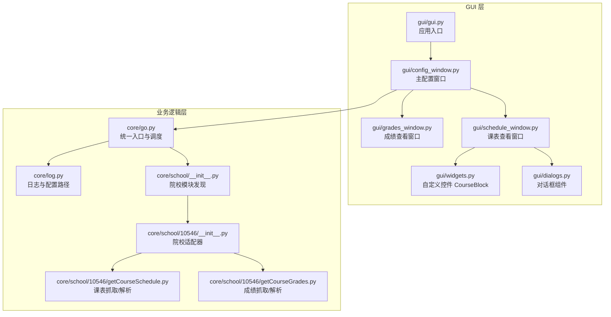
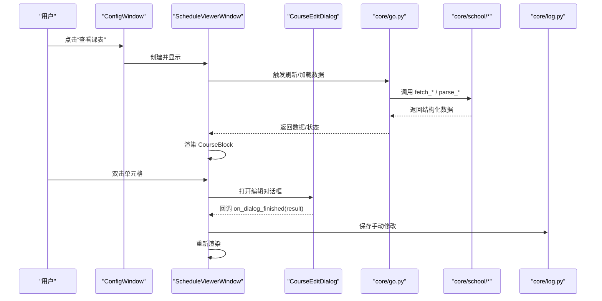
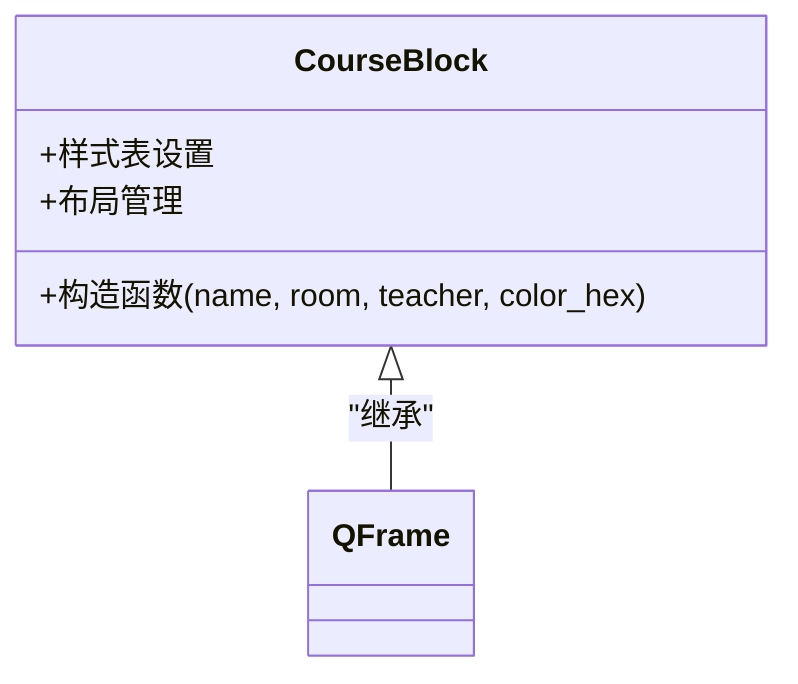
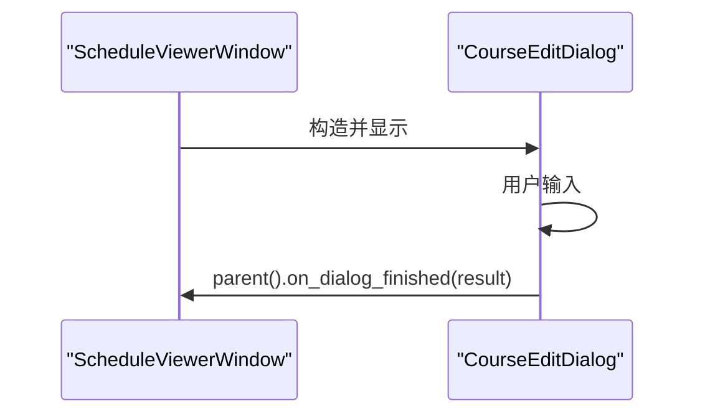
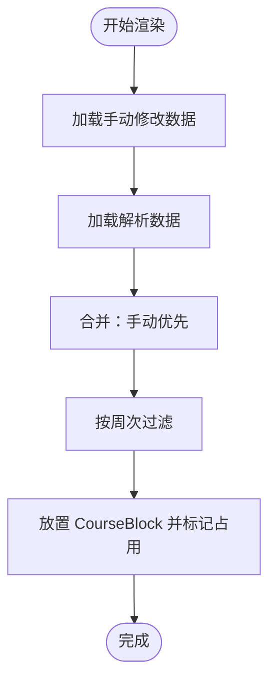
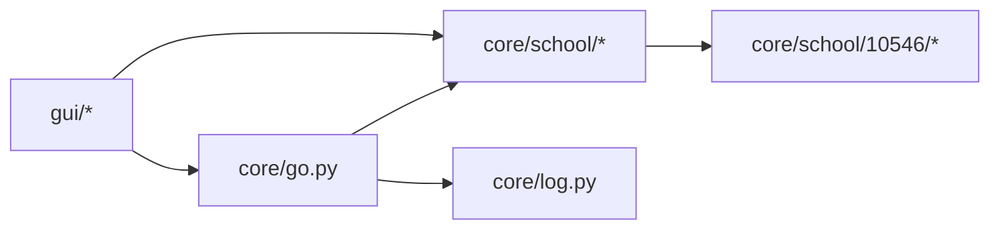

# 自定义控件与组件

<cite>
**本文引用的文件**
- [gui/widgets.py](file://gui/widgets.py)
- [gui/schedule_window.py](file://gui/schedule_window.py)
- [gui/dialogs.py](file://gui/dialogs.py)
- [gui/grades_window.py](file://gui/grades_window.py)
- [gui/config_window.py](file://gui/config_window.py)
- [gui/gui.py](file://gui/gui.py)
- [core/school/__init__.py](file://core/school/__init__.py)
- [core/school/10546/__init__.py](file://core/school/10546/__init__.py)
- [core/school/10546/getCourseSchedule.py](file://core/school/10546/getCourseSchedule.py)
- [core/school/10546/getCourseGrades.py](file://core/school/10546/getCourseGrades.py)
- [core/go.py](file://core/go.py)
- [core/log.py](file://core/log.py)
- [gui/GUI_MODULAR_DESIGN.md](file://gui/GUI_MODULAR_DESIGN.md)
- [developer_tools/GUI_MODULAR_DESIGN.md](file://developer_tools/GUI_MODULAR_DESIGN.md)
</cite>

## 目录
1. [简介](#简介)
2. [项目结构](#项目结构)
3. [核心组件](#核心组件)
4. [架构总览](#架构总览)
5. [详细组件分析](#详细组件分析)
6. [依赖关系分析](#依赖关系分析)
7. [性能考量](#性能考量)
8. [故障排查指南](#故障排查指南)
9. [结论](#结论)
10. [附录](#附录)

## 简介
本文件面向“自定义控件与组件”的设计与实现，围绕课表色块控件、对话框组件以及窗口级视图组件，系统阐述其设计理念、继承关系、属性与事件处理、样式定制与主题支持、组件间通信与数据传递、扩展与复用最佳实践，以及性能优化与内存管理策略。文档同时结合项目中的模块化设计说明，给出可操作的开发与维护建议。

## 项目结构
项目采用“GUI 模块化设计”组织，将 UI 层、业务逻辑层与数据访问层分离，强调组件复用与职责清晰：
- GUI 层：主窗口、子窗口、自定义控件与对话框
- 业务逻辑层：统一入口脚本、日志与配置管理
- 数据访问层：按院校拆分的抓取与解析模块

图表来源
- [gui/gui.py](file://gui/gui.py#L16-L24)
- [gui/config_window.py](file://gui/config_window.py#L25-L31)
- [gui/schedule_window.py](file://gui/schedule_window.py#L26-L32)
- [gui/widgets.py](file://gui/widgets.py#L4-L41)
- [gui/dialogs.py](file://gui/dialogs.py#L4-L77)
- [core/go.py](file://core/go.py#L15-L25)
- [core/log.py](file://core/log.py#L60-L82)
- [core/school/__init__.py](file://core/school/__init__.py#L6-L27)
- [core/school/10546/__init__.py](file://core/school/10546/__init__.py#L1-L7)
- [core/school/10546/getCourseSchedule.py](file://core/school/10546/getCourseSchedule.py#L31-L46)
- [core/school/10546/getCourseGrades.py](file://core/school/10546/getCourseGrades.py#L30-L43)

章节来源
- [gui/GUI_MODULAR_DESIGN.md](file://gui/GUI_MODULAR_DESIGN.md#L1-L52)
- [developer_tools/GUI_MODULAR_DESIGN.md](file://developer_tools/GUI_MODULAR_DESIGN.md#L1-L52)

## 核心组件
- 自定义控件 CourseBlock：用于课表色块展示，具备名称、教室、教师信息与颜色属性，内部使用布局与标签组合，支持样式定制。
- 对话框 CourseEditDialog：用于手动编辑/添加课程，支持周次解析、持续节数设置，并通过回调将结果返回给父窗口。
- 视图窗口 ScheduleViewerWindow：课表查看窗口，支持周次切换、手动编辑、网络刷新、缓存清除与色块渲染。
- 视图窗口 GradesViewerWindow：成绩查看窗口，支持表格展示、网络刷新、缓存清除。
- 主配置窗口 ConfigWindow：集中管理配置项、标签页、子窗口启动与更新检查。

章节来源
- [gui/widgets.py](file://gui/widgets.py#L4-L41)
- [gui/dialogs.py](file://gui/dialogs.py#L4-L77)
- [gui/schedule_window.py](file://gui/schedule_window.py#L44-L368)
- [gui/grades_window.py](file://gui/grades_window.py#L32-L158)
- [gui/config_window.py](file://gui/config_window.py#L44-L537)

## 架构总览
GUI 层通过事件驱动与回调机制与业务逻辑层交互，业务逻辑层再通过统一的日志与配置路径管理协调数据访问层的院校适配器。

图表来源
- [gui/config_window.py](file://gui/config_window.py#L405-L418)
- [gui/schedule_window.py](file://gui/schedule_window.py#L177-L208)
- [gui/dialogs.py](file://gui/dialogs.py#L62-L77)
- [core/go.py](file://core/go.py#L481-L506)
- [core/school/10546/getCourseSchedule.py](file://core/school/10546/getCourseSchedule.py#L170-L200)
- [core/log.py](file://core/log.py#L60-L82)

## 详细组件分析

### 自定义控件 CourseBlock
- 设计理念
  - 纯 UI 组件，不含业务逻辑，便于复用与测试。
  - 通过构造函数接收名称、教室、教师与颜色，内部以布局与标签组合呈现。
- 继承关系
  - 继承自 QFrame，利用 Qt 的样式表能力实现外观定制。
- 属性与事件
  - 属性：名称、教室、教师、颜色；通过样式表设置圆角、边距、字体与颜色。
  - 事件：无显式自定义事件，但可扩展为信号槽以支持外部交互。
- 样式定制与主题支持
  - 使用样式表集中定义背景色、圆角、内边距、字体族与字号。
  - 可通过传入不同的颜色值实现主题切换；支持动态追加样式以突出手动修改。
- 数据流
  - 仅消费输入参数，不持有全局状态，避免副作用。

图表来源
- [gui/widgets.py](file://gui/widgets.py#L4-L41)

章节来源
- [gui/widgets.py](file://gui/widgets.py#L4-L41)

### 对话框组件 CourseEditDialog
- 设计理念
  - 轻量对话框，聚焦输入与校验，通过 accept 回调将结果返回父窗口。
- 继承关系
  - 继承自 QWidget，设置为窗口类型，尺寸固定。
- 属性与事件
  - 输入字段：课程名称、教室、教师、上课周次、持续节数。
  - 事件：确定/取消按钮绑定 accept/close。
- 数据传递与解析
  - parse_weeks 将字符串解析为周次列表，accept 组装结果字典并调用父窗口回调。
- 扩展建议
  - 可引入信号槽，父窗口订阅结果信号，降低耦合度。

图表来源
- [gui/dialogs.py](file://gui/dialogs.py#L62-L77)
- [gui/schedule_window.py](file://gui/schedule_window.py#L193-L208)

章节来源
- [gui/dialogs.py](file://gui/dialogs.py#L4-L77)

### 课表查看窗口 ScheduleViewerWindow
- 设计理念
  - 独立窗口，负责课表展示、周次切换、手动编辑与网络刷新。
- 继承关系
  - 继承自 QWidget，内部组合多种控件与布局。
- 属性与事件
  - 属性：颜色映射、当前周、选中周、第一周周一。
  - 事件：周次变更、单元格双击、按钮点击、对话框完成回调。
- 样式定制与主题支持
  - 表头与单元格样式通过样式表设置；色块通过动态样式追加边框以区分手动修改。
- 数据流与渲染
  - 先加载手动修改，再加载解析数据，避免覆盖；支持周次过滤与合并单元格。
- 性能与内存
  - 渲染前清理已有 widget 与合并状态，避免重复叠加；使用 setCellWidget 与 setSpan 控制单元格布局。

图表来源
- [gui/schedule_window.py](file://gui/schedule_window.py#L269-L368)

章节来源
- [gui/schedule_window.py](file://gui/schedule_window.py#L44-L368)

### 成绩查看窗口 GradesViewerWindow
- 设计理念
  - 独立窗口，专注成绩表格展示与刷新。
- 继承关系
  - 继承自 QWidget，内部组合表格与按钮。
- 属性与事件
  - 事件：刷新按钮点击、清除缓存按钮点击。
- 数据流
  - 读取缓存 HTML，调用院校模块解析，填充表格。

章节来源
- [gui/grades_window.py](file://gui/grades_window.py#L32-L158)

### 主配置窗口 ConfigWindow
- 设计理念
  - 集中管理配置项与子窗口，提供标签页与按钮区。
- 组件间通信
  - 通过 show_grades_viewer/show_schedule_viewer 打开子窗口；通过 save_config 写入配置。
- 更新与崩溃上报
  - 集成更新检查与崩溃报告打包。

章节来源
- [gui/config_window.py](file://gui/config_window.py#L44-L537)

## 依赖关系分析
- 模块耦合
  - GUI 层通过导入子模块实现低耦合；窗口之间通过函数调用而非直接依赖。
  - 业务逻辑层通过统一入口脚本与日志模块解耦具体实现。
- 外部依赖
  - Qt Widgets/Gui/Core 提供 UI 与事件模型；requests/BeautifulSoup 用于网络与解析。
- 院校适配
  - 通过动态导入实现多院校支持，核心逻辑集中在 go.py 与 school/* 下。

图表来源
- [gui/schedule_window.py](file://gui/schedule_window.py#L21-L32)
- [core/go.py](file://core/go.py#L15-L25)
- [core/school/__init__.py](file://core/school/__init__.py#L22-L27)
- [core/log.py](file://core/log.py#L60-L82)

章节来源
- [gui/GUI_MODULAR_DESIGN.md](file://gui/GUI_MODULAR_DESIGN.md#L1-L52)
- [developer_tools/GUI_MODULAR_DESIGN.md](file://developer_tools/GUI_MODULAR_DESIGN.md#L1-L52)

## 性能考量
- 渲染优化
  - 在渲染前清理已有 widget 与合并状态，避免重复叠加。
  - 使用 setCellWidget 与 setSpan 控制布局，减少无效绘制。
- I/O 与缓存
  - 通过时间戳与循环检测控制缓存更新频率，降低网络请求与解析成本。
- UI 响应
  - 刷新时禁用按钮并设置等待光标，避免重复触发。
- 内存管理
  - 子窗口采用延迟创建与激活窗口方式，减少常驻实例数量。
  - 日志轮转与自动清理旧日志，控制磁盘占用。

章节来源
- [gui/schedule_window.py](file://gui/schedule_window.py#L241-L268)
- [core/school/10546/getCourseSchedule.py](file://core/school/10546/getCourseSchedule.py#L117-L157)
- [core/log.py](file://core/log.py#L85-L112)

## 故障排查指南
- 登录与网络问题
  - 若登录失败或出现验证码，会保存失败页面以便诊断。
- 缓存与解析
  - 缓存文件缺失或损坏时，会回退到网络获取或提示错误。
- UI 异常
  - 渲染失败时弹出错误提示；对话框保存失败时提示用户。
- 日志定位
  - 使用统一日志路径与格式，便于定位问题。

章节来源
- [core/school/10546/getCourseSchedule.py](file://core/school/10546/getCourseSchedule.py#L95-L101)
- [core/school/10546/getCourseGrades.py](file://core/school/10546/getCourseGrades.py#L93-L100)
- [gui/schedule_window.py](file://gui/schedule_window.py#L366-L368)
- [core/log.py](file://core/log.py#L19-L57)

## 结论
本项目通过模块化设计实现了 UI、业务与数据层的清晰分离，自定义控件与对话框组件具备良好的复用性与可维护性。通过样式表与动态样式追加，实现了灵活的主题支持；通过事件驱动与回调机制，保证了组件间松耦合的通信。建议在后续迭代中引入信号槽以进一步解耦，并完善主题切换与响应式样式的统一管理。

## 附录
- 最佳实践清单
  - 组件职责单一，避免混入业务逻辑。
  - 使用样式表集中管理外观，支持主题切换。
  - 通过回调或信号槽传递数据，降低耦合。
  - 合理使用缓存与时间戳，平衡实时性与性能。
  - 统一日志与配置路径，便于调试与部署。