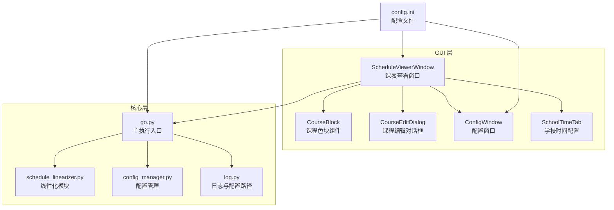
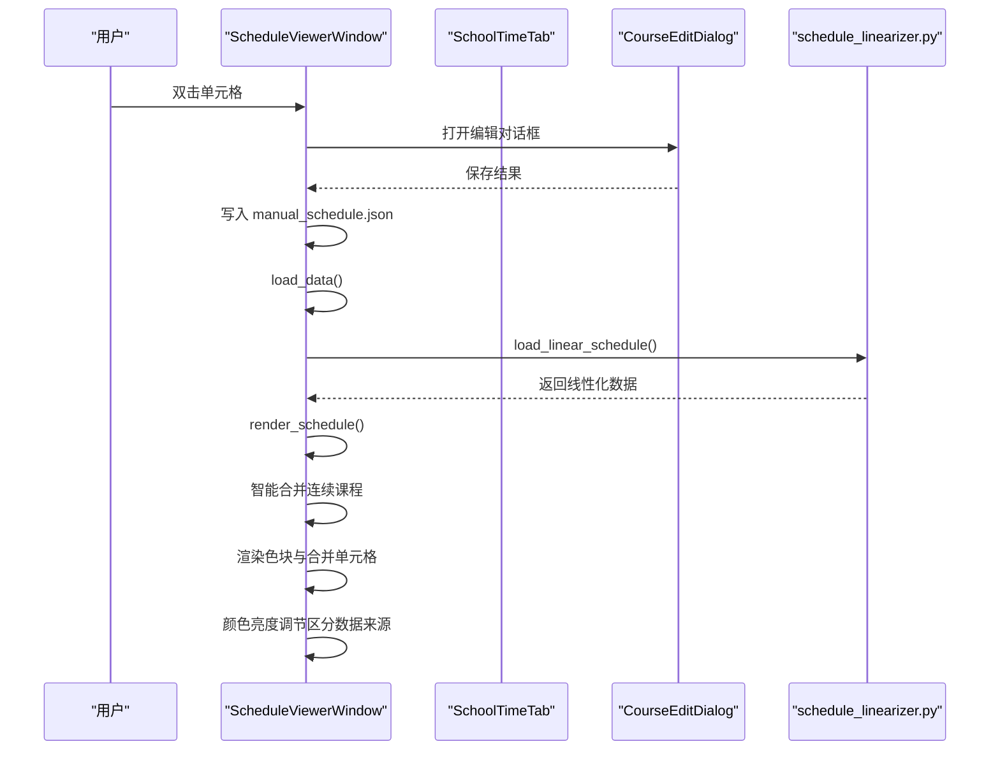
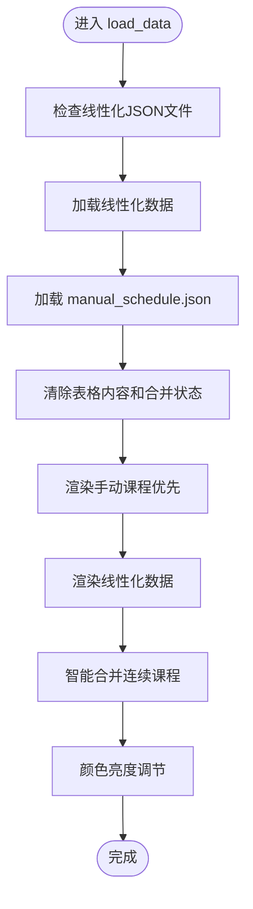
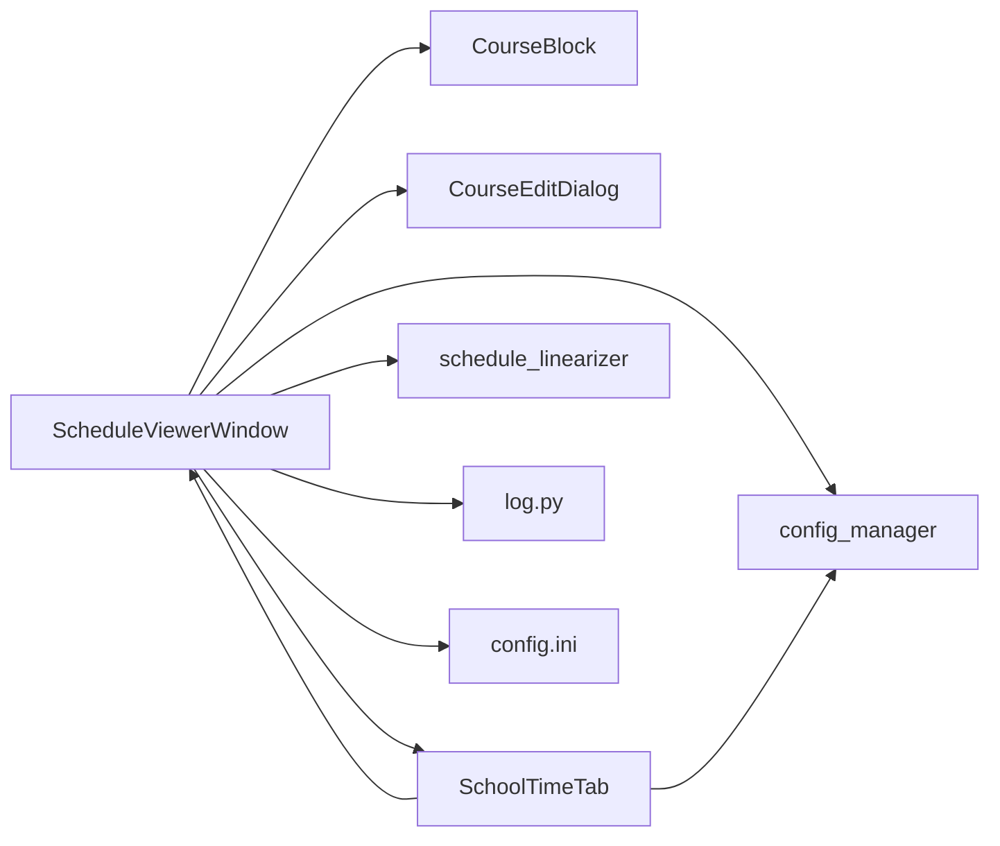

# 课表窗口

<cite>
**本文引用的文件**
- [schedule_window.py](file://gui/schedule_window.py)
- [custom_widgets.py](file://gui/custom_widgets.py)
- [dialogs.py](file://gui/dialogs.py)
- [config_window.py](file://gui/config_window.py)
- [school_time_tab.py](file://gui/tabs/school_time_tab.py)
- [go.py](file://core/go.py)
- [schedule_linearizer.py](file://core/schedule_linearizer.py)
- [config_manager.py](file://core/config_manager.py)
- [log.py](file://core/log.py)
- [config.ini](file://config.ini)
- [config.md](file://config.md)
- [README.md](file://README.md)
- [EXTENSION_GUIDE.md](file://developer_tools/EXTENSION_GUIDE.md)
- [GUI_MODULAR_DESIGN.md](file://gui/GUI_MODULAR_DESIGN.md)
</cite>

## 更新摘要
**变更内容**
- 课表窗口完全重构为基于线性化课表数据的现代化架构
- 新增智能合并连续课程功能，支持同课程同日的自动合并
- 引入颜色亮度调节机制，区分手动修改与自动解析的课程
- 删除HTML解析方案，仅使用线性化JSON文件驱动数据展示
- 增强调试日志系统，提供详细的渲染过程跟踪
- 优化课程色块组件，支持手动修改的视觉标识

## 目录
1. [简介](#简介)
2. [项目结构](#项目结构)
3. [核心组件](#核心组件)
4. [架构总览](#架构总览)
5. [详细组件分析](#详细组件分析)
6. [依赖关系分析](#依赖关系分析)
7. [性能考量](#性能考量)
8. [故障排查指南](#故障排查指南)
9. [结论](#结论)
10. [附录](#附录)

## 简介
本文件面向"课表窗口"的使用者与开发者，系统性阐述课表数据的组织与展示架构。经过大幅重构，课表窗口现采用基于线性化课表数据的现代化架构，通过智能合并算法优化课程展示，引入颜色亮度调节机制区分数据来源，并提供完善的调试日志系统。深入分析时间轴布局、课程单元格渲染与冲突检测机制；梳理课表数据的动态更新机制（循环检测、缓存策略与性能优化）；并提供扩展指南，帮助开发者添加新的视图模式或交互功能，同时给出用户体验与无障碍访问的设计建议。

**更新** 课表窗口现已完全重构为基于线性化课表数据的现代化架构，删除了传统的HTML解析方案，转而使用智能合并算法和增强的调试日志系统，显著提升了数据处理效率和用户体验。

## 项目结构
课表窗口位于 GUI 层，围绕"线性化数据 + 智能合并 + 色块渲染 + 手动编辑"的核心交互展开。系统通过统一的线性化模块获取与解析课表数据，结合本地缓存与时间戳实现循环检测与更新控制，支持手动修改数据的优先级展示。

**图表来源**
- [schedule_window.py](file://gui/schedule_window.py#L67-L104)
- [config_window.py](file://gui/config_window.py#L124-L137)
- [school_time_tab.py](file://gui/tabs/school_time_tab.py#L120-L166)
- [go.py](file://core/go.py#L806-L833)
- [schedule_linearizer.py](file://core/schedule_linearizer.py#L48-L158)
- [config_manager.py](file://core/config_manager.py#L16-L61)
- [log.py](file://core/log.py#L167-L184)

**章节来源**
- [README.md](file://README.md#L60-L83)
- [GUI_MODULAR_DESIGN.md](file://gui/GUI_MODULAR_DESIGN.md#L25-L38)

## 核心组件
- **课表查看窗口**：负责 UI 布局、周次切换、手动编辑入口、数据加载与渲染，支持线性化数据驱动的可配置时间布局。
- **课程色块组件**：承载课程名称、教室、教师信息，支持固定配色与手动修改的视觉标识，通过颜色亮度调节区分数据来源。
- **课程编辑对话框**：提供课程名称、教室、教师、周次、持续节数等字段的编辑与保存，支持手动指定持续节数。
- **学校时间配置**：提供上午/下午/晚上课程节数配置、课时时间编辑、自动计算功能，支持第一周周一日期设置。
- **线性化模块**：封装课表数据的线性化处理、合并算法和JSON文件管理，提供智能合并连续课程的能力。
- **配置管理**：统一配置文件的读取、解密、保存与加密，支持学校时间配置的持久化存储。
- **日志与配置**：统一日志路径与配置路径，提供详细的调试日志记录和错误处理。

**章节来源**
- [schedule_window.py](file://gui/schedule_window.py#L67-L104)
- [custom_widgets.py](file://gui/custom_widgets.py#L4-L59)
- [dialogs.py](file://gui/dialogs.py#L4-L77)
- [school_time_tab.py](file://gui/tabs/school_time_tab.py#L10-L166)
- [schedule_linearizer.py](file://core/schedule_linearizer.py#L48-L158)
- [config_manager.py](file://core/config_manager.py#L16-L61)
- [log.py](file://core/log.py#L167-L184)

## 架构总览
课表窗口采用"视图 + 组件 + 数据源 + 配置管理"的分层架构，经过重构后完全基于线性化数据驱动：
- **视图层**：ScheduleViewerWindow 负责布局与交互，支持线性化数据驱动的时间布局。
- **组件层**：CourseBlock 提供课程色块渲染；CourseEditDialog 提供编辑能力。
- **配置管理层**：SchoolTimeTab 提供学校作息时间配置界面。
- **数据层**：通过 go.py 调用 schedule_linearizer.py 获取与解析线性化课表；结合本地缓存与时间戳控制更新；手动修改数据以 JSON 形式持久化，优先于解析数据渲染。

**图表来源**
- [schedule_window.py](file://gui/schedule_window.py#L240-L333)
- [school_time_tab.py](file://gui/tabs/school_time_tab.py#L120-L166)
- [dialogs.py](file://gui/dialogs.py#L62-L77)
- [schedule_linearizer.py](file://core/schedule_linearizer.py#L159-L183)

## 详细组件分析

### 课表查看窗口（ScheduleViewerWindow）
- **线性化数据驱动**：完全基于线性化JSON文件驱动数据展示，删除HTML解析方案，提升数据处理效率。
- **智能合并算法**：实现同课程同日的连续时段智能合并，支持按周次精确控制合并范围。
- **颜色亮度调节**：通过 adjust_color_brightness 方法调节颜色亮度，手动修改的课程使用更深颜色标识。
- **动态时间列**：根据配置的课程节数动态生成时间列，支持每节课开始时间的自定义编辑。
- **周次控制**：通过数值输入控件选择周次，动态计算"本周"标识，支持刷新与清除缓存。
- **数据加载与渲染**：
  - 先加载手动修改数据，再加载线性化数据，避免覆盖手动修改。
  - 根据周次过滤课程，支持"全学期"与具体周次列表。
  - 使用合并单元格表示连续节数，占用格点集合避免重叠。
- **手动编辑**：双击非节次列打开编辑对话框，保存后写入本地 JSON 并重新渲染；双击时间列可编辑每节课开始时间。
- **调试日志系统**：提供详细的渲染过程跟踪，包括合并状态检查和占用情况监控。

**图表来源**
- [schedule_window.py](file://gui/schedule_window.py#L655-L732)

**章节来源**
- [schedule_window.py](file://gui/schedule_window.py#L67-L104)
- [schedule_window.py](file://gui/schedule_window.py#L534-L732)

### 课程色块组件（CourseBlock）
- **结构**：外层容器带圆角背景色，内含课程名称与教室/教师信息两行文本。
- **样式**：固定字体族与字号，居中对齐，支持换行；手动编辑的色块使用更深颜色但无边框标识。
- **渲染**：由窗口在指定单元格设置合并区域并注入组件实例，支持手动修改的视觉区分。

**章节来源**
- [custom_widgets.py](file://gui/custom_widgets.py#L4-L59)
- [schedule_window.py](file://gui/schedule_window.py#L555-L565)

### 课程编辑对话框（CourseEditDialog）
- **字段**：课程名称、教室、教师、上课周次（支持连续与离散周次）、持续节数。
- **周次解析**：支持"1-16"、"1,3,5"等格式，转换为有序列表。
- **持续节数**：允许用户指定课程持续节数，支持手动编辑。
- **回调**：将结果传递给父窗口，父窗口写入 JSON 并重新渲染。

**章节来源**
- [dialogs.py](file://gui/dialogs.py#L4-L77)
- [schedule_window.py](file://gui/schedule_window.py#L318-L333)

### 学校时间配置（SchoolTimeTab）
- **学校作息时间配置**：提供上午、下午、晚上课程节数的 SpinBox 配置，支持实时预览生成的课程序列。
- **课时时间配置**：支持设置每节课时长、第一节课开始时间和各节课具体开始时间的编辑。
- **自动计算功能**：根据第一节课开始时间和每节课时长自动计算各节课的开始时间。
- **第一周周一设置**：支持设置学期开始日期，用于周次计算。
- **配置保存**：将配置保存到 config.ini 文件的 [school_time] 区域。

**章节来源**
- [school_time_tab.py](file://gui/tabs/school_time_tab.py#L10-L166)
- [config_window.py](file://gui/config_window.py#L124-L137)

### 线性化模块（schedule_linearizer）
- **线性化处理**：将原始课表数据重排为线性化周次结构，智能合并同一周内同课程同日的连续节次。
- **数据结构**：标准化JSON结构：{"data": {"第X周": {"课程列表": [...]}}}
- **合并算法**：按星期、课程名称、教师、教室和周次列表分组，对连续课程进行智能合并。
- **文件管理**：提供线性化数据的保存和加载功能，支持自定义文件名。

**章节来源**
- [schedule_linearizer.py](file://core/schedule_linearizer.py#L48-L158)
- [schedule_linearizer.py](file://core/schedule_linearizer.py#L159-L183)

### 主执行入口（go.py）与配置管理
- **go.py**
  - 提供课表获取与推送的统一入口，支持今日/明日/下周全周推送。
  - 读取配置，动态加载当前院校模块，调用线性化模块处理课表数据。
- **配置管理**
  - 统一配置文件的读取、解密、保存与加密，支持学校时间配置的持久化存储。
  - 支持明文配置文件的自动检测和加密保存。

**章节来源**
- [go.py](file://core/go.py#L806-L833)
- [config_manager.py](file://core/config_manager.py#L16-L61)
- [config_manager.py](file://core/config_manager.py#L100-L115)

### 日志与配置（log.py、config.ini、config.md）
- **log.py**
  - 统一日志路径与文件名（按日期），自动清理旧日志，支持配置读取。
  - 提供详细的调试日志记录，包括渲染过程跟踪和错误处理。
- **config.ini**
  - 包含运行模式、账户、学期起始周、循环检测、推送方式与邮箱/飞书配置等。
  - 新增 [school_time] 区域配置，包含上午/下午/晚上课程节数、课时时间等。
- **config.md**
  - 详细说明配置项，包括新增的 [school_time] 区域配置。

**章节来源**
- [log.py](file://core/log.py#L167-L184)
- [log.py](file://core/log.py#L249-L264)
- [log.py](file://core/log.py#L266-L343)
- [config.ini](file://config.ini#L75-L98)
- [config.md](file://config.md#L94-L114)

## 依赖关系分析
- **ScheduleViewerWindow 依赖**：
  - CourseBlock（组件）
  - CourseEditDialog（对话框）
  - SchoolTimeTab（配置界面）
  - schedule_linearizer（数据处理）
  - config_manager（配置管理）
  - log（日志）
  - config.ini（配置）
- **SchoolTimeTab 依赖**：
  - 配置管理模块（保存和加载配置）
  - ScheduleViewerWindow（触发时间布局更新）
- **schedule_linearizer 依赖**：
  - config_manager（配置读取）
  - log（日志）
  - 配置路径（统一）

**图表来源**
- [schedule_window.py](file://gui/schedule_window.py#L35-L48)
- [school_time_tab.py](file://gui/tabs/school_time_tab.py#L120-L166)
- [schedule_linearizer.py](file://core/schedule_linearizer.py#L1-L20)
- [config_manager.py](file://core/config_manager.py#L1-L10)

**章节来源**
- [schedule_window.py](file://gui/schedule_window.py#L35-L48)
- [school_time_tab.py](file://gui/tabs/school_time_tab.py#L120-L166)

## 性能考量
- **渲染性能**
  - 线性化数据结构简化了数据处理流程，减少解析开销。
  - 智能合并算法避免重复渲染相同课程的不同时间段。
  - 合并单元格减少子控件数量，降低布局与绘制开销。
  - 占用格点集合快速检测冲突，避免无效渲染。
- **数据加载**
  - 本地线性化JSON文件 + 时间戳控制更新频率，避免频繁网络请求。
  - 解析阶段按周次过滤，缩小后续渲染范围。
  - 删除HTML解析方案，提升数据处理效率。
- **I/O 与序列化**
  - 手动修改数据以 JSON 存储，读写简单高效；建议在批量写入时合并写入，减少磁盘抖动。
  - 线性化数据文件采用标准化结构，便于快速加载和处理。
- **网络与登录**
  - 限定超时与 IPv4 适配，提升稳定性；登录失败时保存失败响应便于诊断。
- **调试与监控**
  - 详细的调试日志系统，提供渲染过程的实时监控和问题定位。

**章节来源**
- [schedule_window.py](file://gui/schedule_window.py#L534-L732)
- [schedule_linearizer.py](file://core/schedule_linearizer.py#L48-L158)

## 故障排查指南
- **线性化数据加载失败**
  - 检查线性化JSON文件是否存在和格式正确性。
  - 确认 schedule_linearizer 模块可用性和依赖完整性。
  - 查看详细的调试日志，定位数据加载过程中的具体问题。
- **课程渲染异常**
  - 检查 manual_schedule.json 格式；确认周次过滤逻辑；核对合并单元格与占用集合。
  - 使用调试日志跟踪渲染过程，特别关注 setSpan 调用和占用状态检查。
- **智能合并功能失效**
  - 确认课程数据包含完整的星期、开始小节、结束小节信息。
  - 检查周次列表的格式和有效性，确保按开始小节排序。
- **颜色显示问题**
  - 检查颜色亮度调节算法的输入参数和边界条件。
  - 确认手动修改课程和自动解析课程的颜色区分逻辑。
- **时间布局问题**
  - 检查 config.ini 中的 [school_time] 配置是否正确；确认上午/下午/晚上节数之和等于总课程数。
  - 验证课时时间配置是否合理，确保每节课开始时间不冲突。
- **日志定位**
  - 使用统一日志路径与配置路径，查看当日日志文件；利用调试日志定位渲染过程问题。

**章节来源**
- [schedule_window.py](file://gui/schedule_window.py#L675-L732)
- [schedule_window.py](file://gui/schedule_window.py#L590-L654)
- [schedule_linearizer.py](file://core/schedule_linearizer.py#L159-L183)

## 结论
课表窗口经过大幅重构，完全转向基于线性化数据的现代化架构，显著提升了数据处理效率和用户体验。通过智能合并算法优化课程展示，颜色亮度调节机制有效区分数据来源，完善的调试日志系统提供了强大的问题定位能力。删除HTML解析方案简化了数据流程，增强了系统的稳定性和可维护性。未来可在现有基础上进一步扩展视图模式、增强数据可视化能力和优化性能表现，满足多样化的课表管理需求。

## 附录

### 线性化数据架构实现
- **数据结构**
  - 线性化JSON文件：{"data": {"第X周": {"课程列表": [...]}}}
  - 课程条目：包含"星期"、"开始小节"、"结束小节"、"课程名称"、"教师"、"教室"、"周次列表"
  - 智能合并：按星期+课程名称+教师+教室+周次列表分组，对连续课程进行合并

- **智能合并算法**
  - 分组策略：按完整课程标识分组，包含周次信息防止跨周次合并
  - 连续检测：检查下一课程开始节次是否等于当前课程结束节次+1
  - 合并结果：创建新的课程记录，开始小节为第一个课程，结束小节为最后一个课程

- **颜色管理系统**
  - 固定色板：预设12种柔和颜色，适合黑色文字显示
  - 亮度调节：通过 adjust_color_brightness 方法调节颜色亮度
  - 数据区分：手动修改使用更深颜色，自动解析使用原色

**章节来源**
- [schedule_window.py](file://gui/schedule_window.py#L120-L147)
- [schedule_window.py](file://gui/schedule_window.py#L395-L472)
- [schedule_window.py](file://gui/schedule_window.py#L75-L80)

### 不同视图模式的实现思路
- **日视图**
  - 以"某一天"为单位展示，按节次排列；支持"今日/明日/某日"切换。
- **周视图**
  - 以"一周"为单位展示，按星期排列；支持周次切换与"本周/非本周"标识。
- **月视图**
  - 以"月份"为单位展示，按周数排列；支持月份切换与节假日标注。

**实现要点**
- 通用布局：统一使用表格控件，行列数随视图调整。
- 数据聚合：按视图维度（日/周/月）对线性化数据进行分组与去重。
- 冲突检测：在视图内仍需考虑课程时间重叠，避免单元格重叠。
- 用户体验：提供快捷导航（上一周/下一周）、"回到今天"等常用操作。

**扩展建议**
- 在 ScheduleViewerWindow 中增加视图切换按钮与状态管理。
- 为不同视图定义独立的渲染函数，复用智能合并与数据过滤逻辑。
- 引入主题与可定制样式，提升可读性与个性化。

**章节来源**
- [schedule_window.py](file://gui/schedule_window.py#L91-L164)
- [go.py](file://core/go.py#L806-L833)

### 课表数据的动态更新机制
- **循环检测**
  - 通过配置节开启/关闭，设定周期；每次运行检查时间戳决定是否更新。
- **缓存策略**
  - 本地线性化JSON文件缓存；DEV 模式下可直接读取缓存文件。
- **强制刷新**
  - 提供"刷新课表"按钮，调用外部脚本强制从网络获取并更新线性化JSON文件。
- **合并策略**
  - 手动修改优先于线性化数据；按周次过滤；智能合并连续节数。

**章节来源**
- [schedule_window.py](file://gui/schedule_window.py#L675-L732)
- [schedule_window.py](file://gui/schedule_window.py#L366-L394)
- [go.py](file://core/go.py#L806-L833)

### 扩展指南：添加新的视图模式或交互功能
- **新增视图模式**
  - 在 GUI 层新增视图类，复用现有线性化数据源与智能合并逻辑。
  - 通过按钮或菜单切换视图，维护当前视图状态。
- **新增交互功能**
  - 在 dialogs.py 中扩展对话框字段与解析逻辑；在 schedule_window.py 中绑定事件。
  - 保持模块职责清晰，避免跨模块耦合。
- **配置扩展**
  - 在 config.ini 中添加新的配置项，通过 school_time_tab.py 提供界面配置。
  - 确保配置变更时能够正确触发相关组件的更新。

**章节来源**
- [EXTENSION_GUIDE.md](file://developer_tools/EXTENSION_GUIDE.md#L60-L102)
- [GUI_MODULAR_DESIGN.md](file://gui/GUI_MODULAR_DESIGN.md#L40-L52)

### 用户体验与无障碍访问建议
- **可读性**
  - 使用高对比度配色与清晰字体；为不同课程分配稳定色板。
  - 支持可配置的字体大小和颜色方案。
  - 颜色亮度调节确保手动修改和自动解析的视觉区分。
- **可操作性**
  - 提供键盘快捷键（如上下左右移动、回车编辑）；双击编辑与右键菜单。
  - 支持鼠标悬停显示完整信息，避免文本截断。
  - 智能合并减少重复课程的显示，提升可读性。
- **可理解性**
  - 显示"本周/非本周"提示；在色块中展示关键信息（课程名、教室、教师）。
  - 提供配置向导，帮助用户快速设置合适的作息时间。
  - 详细的调试日志帮助用户理解数据处理过程。
- **无障碍**
  - 确保屏幕阅读器可读取单元格内容；提供焦点管理与键盘导航。
  - 为重要按钮（刷新、清除、配置）提供明确的提示与确认对话框。
  - 支持高对比度模式和缩放功能。

**章节来源**
- [custom_widgets.py](file://gui/custom_widgets.py#L4-L59)
- [dialogs.py](file://gui/dialogs.py#L4-L77)
- [schedule_window.py](file://gui/schedule_window.py#L91-L164)
- [school_time_tab.py](file://gui/tabs/school_time_tab.py#L120-L166)