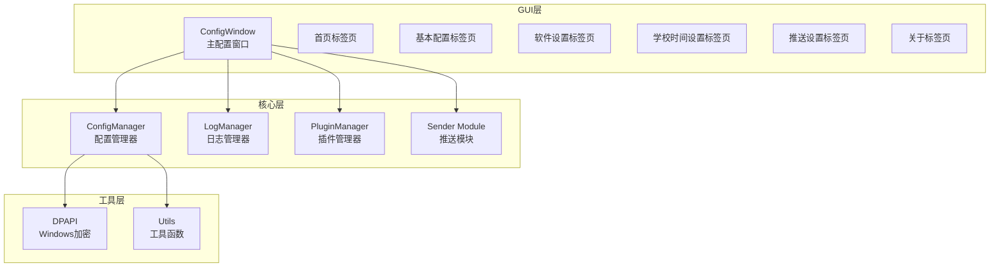
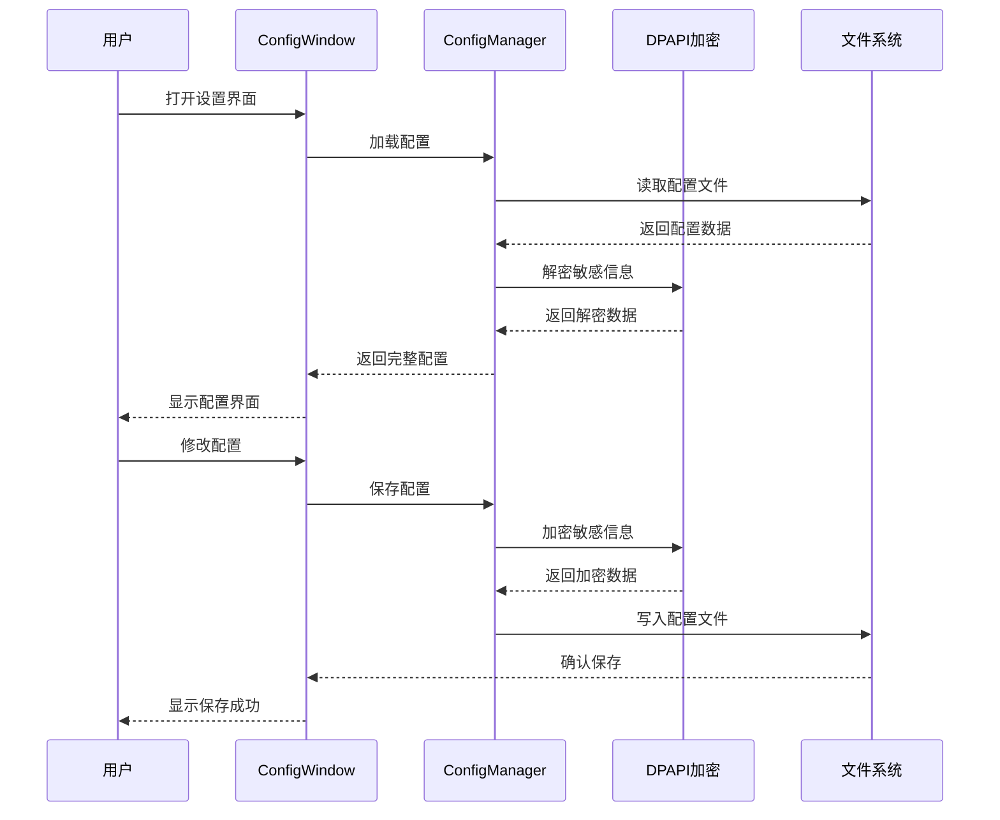
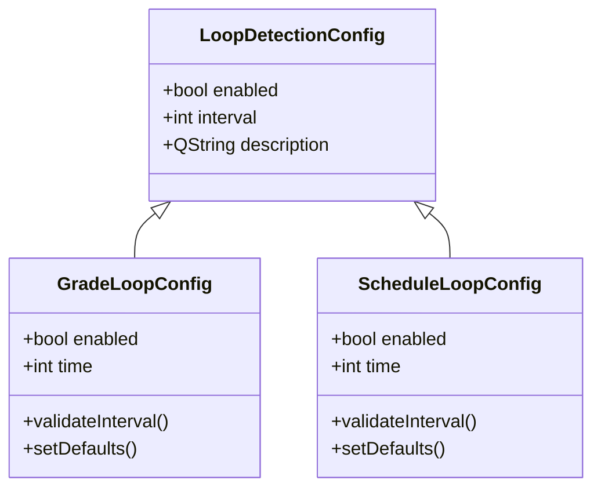
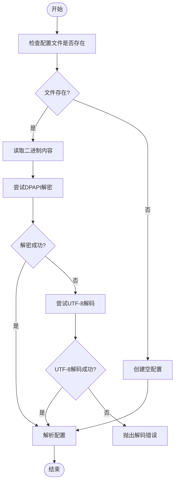
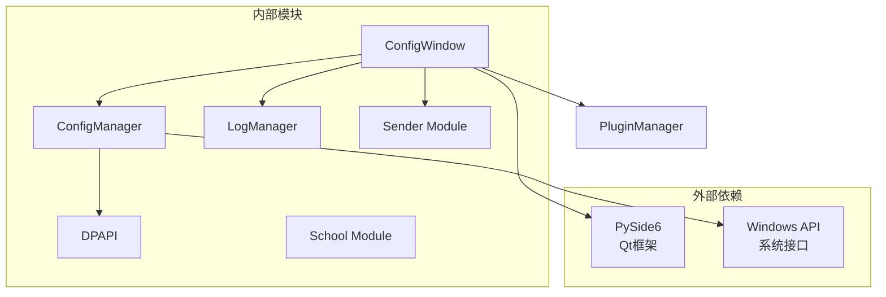

# 软件设置标签页

<cite>
**本文档引用的文件**
- [config_window.py](file://gui/config_window.py)
- [config_manager.py](file://core/config_manager.py)
- [dpapi.py](file://core/utils/dpapi.py)
- [log.py](file://core/log.py)
- [config.ini](file://config.ini)
- [config.md](file://config.md)
- [README.md](file://README.md)
- [gui.py](file://gui/gui.py)
</cite>

## 目录
1. [简介](#简介)
2. [项目结构](#项目结构)
3. [核心组件](#核心组件)
4. [架构概览](#架构概览)
5. [详细组件分析](#详细组件分析)
6. [依赖关系分析](#依赖关系分析)
7. [性能考虑](#性能考虑)
8. [故障排除指南](#故障排除指南)
9. [结论](#结论)

## 简介

软件设置标签页是 Capture_Push 项目中的核心配置界面，负责管理系统的各项设置和参数。该标签页提供了完整的配置管理功能，包括循环检测配置、课表定时推送设置、托盘程序自启动设置等重要功能。

## 项目结构

Capture_Push 项目采用模块化的架构设计，主要包含以下核心模块：

**图表来源**
- [config_window.py](file://gui/config_window.py#L100-L176)
- [config_manager.py](file://core/config_manager.py#L15-L68)

**章节来源**
- [README.md](file://README.md#L70-L118)

## 核心组件

软件设置标签页的核心组件包括：

### ConfigWindow 类
主配置窗口类，继承自 QWidget，负责管理所有配置界面元素和交互逻辑。

### 配置管理器
负责配置文件的读取、写入和加密处理，确保敏感信息的安全存储。

### 加密模块
基于 Windows DPAPI 的加密机制，保护配置文件中的敏感信息。

**章节来源**
- [config_window.py](file://gui/config_window.py#L100-L176)
- [config_manager.py](file://core/config_manager.py#L15-L68)

## 架构概览

软件设置标签页采用分层架构设计，确保了良好的可维护性和扩展性：

**图表来源**
- [config_window.py](file://gui/config_window.py#L122-L146)
- [config_manager.py](file://core/config_manager.py#L53-L68)

## 详细组件分析

### 软件设置标签页功能

软件设置标签页提供了三个主要的功能组：

#### 1. 循环检测配置组

**图表来源**
- [config_window.py](file://gui/config_window.py#L1018-L1044)

#### 2. 课表定时推送设置组

该组包含三种定时推送选项：
- 当天 08:00 推送今日课表
- 前一天 21:00 推送明日课表  
- 周日 20:00 推送下周全部课表

#### 3. 托盘程序自启动设置

提供系统托盘程序的自启动控制功能，支持开机自启动。

**章节来源**
- [config_window.py](file://gui/config_window.py#L1012-L1070)

### 配置数据结构

软件设置标签页使用 INI 格式的配置文件存储设置信息：

| 配置节 | 配置项 | 类型 | 默认值 | 说明 |
|--------|--------|------|--------|------|
| loop_getCourseGrades | enabled | boolean | True | 启用成绩循环检测 |
| loop_getCourseGrades | time | integer | 21600 | 成绩检测间隔（秒） |
| loop_getCourseSchedule | enabled | boolean | False | 启用课表循环检测 |
| loop_getCourseSchedule | time | integer | 604800 | 课表检测间隔（秒） |
| schedule_push | today_8am | boolean | False | 每日8点推送今日课表 |
| schedule_push | tomorrow_9pm | boolean | False | 每晚9点推送明日课表 |
| schedule_push | next_week_sunday | boolean | False | 每周日推送下周课表 |
| software_settings | autostart_tray | boolean | False | 开机自启动托盘程序 |

**章节来源**
- [config.ini](file://config.ini#L15-L24)
- [config.md](file://config.md#L66-L92)

### 加密存储机制

系统采用 Windows DPAPI 进行配置文件的加密存储：

**图表来源**
- [config_manager.py](file://core/config_manager.py#L15-L51)

**章节来源**
- [dpapi.py](file://core/utils/dpapi.py#L12-L77)

## 依赖关系分析

软件设置标签页的依赖关系如下：

**图表来源**
- [config_window.py](file://gui/config_window.py#L1-L12)
- [config_manager.py](file://core/config_manager.py#L1-L8)

**章节来源**
- [gui.py](file://gui/gui.py#L1-L16)

## 性能考虑

软件设置标签页在设计时充分考虑了性能优化：

### 1. 延迟加载机制
- 配置文件采用延迟加载策略，仅在需要时才进行解密和解析
- UI组件按需创建，减少初始内存占用

### 2. 缓存策略
- 配置数据在内存中缓存，避免频繁的文件I/O操作
- UI状态保持在内存中，提高响应速度

### 3. 异步处理
- 配置保存操作采用异步处理，避免阻塞主线程
- 大量数据处理时使用进度条反馈用户

## 故障排除指南

### 常见问题及解决方案

#### 1. 配置文件解码错误
**症状**：启动时显示配置文件解码失败错误
**原因**：配置文件损坏或编码不正确
**解决方法**：
- 使用"清除现有配置"功能重置配置
- 检查配置文件是否被其他程序修改
- 确认系统时间和时区设置正确

#### 2. 加密存储问题
**症状**：配置保存后无法正常加载
**原因**：Windows DPAPI 加密失败
**解决方法**：
- 确认当前用户账户权限
- 检查系统加密服务是否正常运行
- 重启系统后重试

#### 3. UI组件显示异常
**症状**：某些设置项无法正常显示或操作
**原因**：Qt组件初始化失败
**解决方法**：
- 检查PySide6库是否正确安装
- 确认系统字体和主题设置
- 重新启动应用程序

**章节来源**
- [config_window.py](file://gui/config_window.py#L122-L146)
- [config_manager.py](file://core/config_manager.py#L40-L49)

## 结论

软件设置标签页作为 Capture_Push 项目的重要组成部分，提供了完整的配置管理功能。通过模块化的架构设计、安全的加密存储机制和友好的用户界面，确保了系统的易用性和可靠性。

该标签页不仅满足了基本的配置需求，还为未来的功能扩展预留了充足的空间。其清晰的代码结构和完善的错误处理机制，为项目的长期维护和发展奠定了坚实的基础。