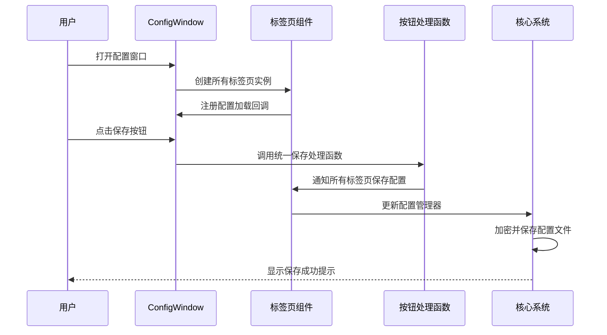
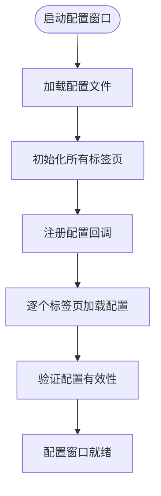
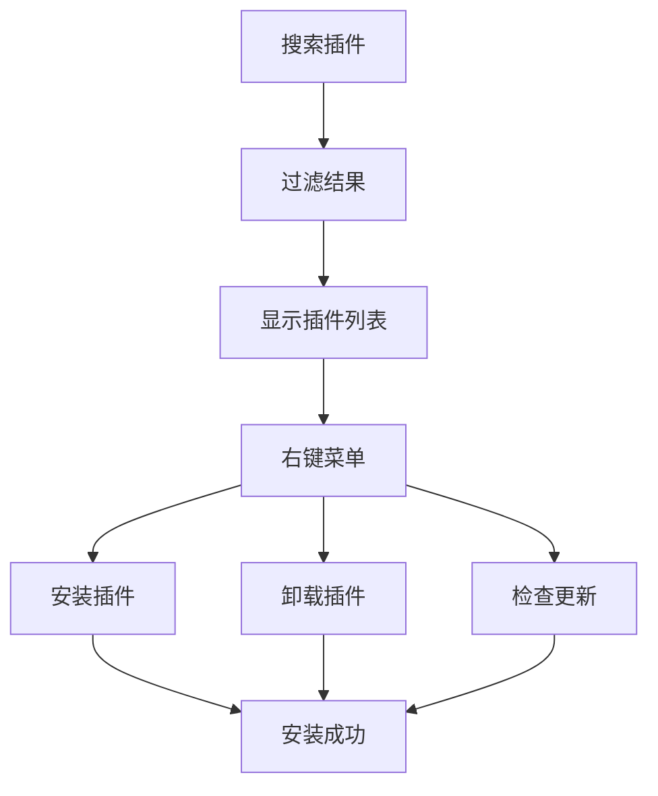
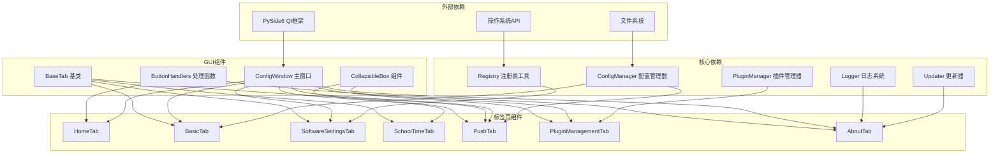

# 配置窗口

<cite>
**本文引用的文件**
- [gui/config_window.py](file://gui/config_window.py)
- [gui/tabs/base_tab.py](file://gui/tabs/base_tab.py)
- [gui/tabs/home_tab.py](file://gui/tabs/home_tab.py)
- [gui/tabs/basic_tab.py](file://gui/tabs/basic_tab.py)
- [gui/tabs/software_settings_tab.py](file://gui/tabs/software_settings_tab.py)
- [gui/tabs/school_time_tab.py](file://gui/tabs/school_time_tab.py)
- [gui/tabs/push_tab.py](file://gui/tabs/push_tab.py)
- [gui/tabs/about_tab.py](file://gui/tabs/about_tab.py)
- [gui/tabs/plugin_management_tab.py](file://gui/tabs/plugin_management_tab.py)
- [gui/widgets/collapsible_box.py](file://gui/widgets/collapsible_box.py)
- [gui/utils/button_handlers.py](file://gui/utils/button_handlers.py)
- [core/config_manager.py](file://core/config_manager.py)
- [core/plugins/plugin_manager.py](file://core/plugins/plugin_manager.py)
- [core/utils/registry.py](file://core/utils/registry.py)
- [core/updater.py](file://core/updater.py)
- [core/log.py](file://core/log.py)
- [config.ini](file://config.ini)
- [config.md](file://config.md)
</cite>

## 更新摘要
**所做更改**
- 配置窗口从单体架构重构为模块化标签页系统
- 新增插件管理标签页，支持动态院校插件管理
- 重构标签页基类系统，实现统一的配置加载和保存机制
- 新增可折叠配置组组件，提升界面整洁度
- 优化按钮处理函数，实现统一的事件处理机制
- 增强配置管理器集成，支持更灵活的配置操作

## 目录
1. [简介](#简介)
2. [项目结构](#项目结构)
3. [核心组件](#核心组件)
4. [架构总览](#架构总览)
5. [详细组件分析](#详细组件分析)
6. [依赖关系分析](#依赖关系分析)
7. [性能考量](#性能考量)
8. [故障排查指南](#故障排查指南)
9. [结论](#结论)
10. [附录](#附录)

## 简介
本文档详细介绍重构后的配置窗口模块化标签页系统。配置窗口现已从传统的单体架构转变为基于标签页的模块化设计，包含七个独立的功能标签页：首页、基本配置、软件设置、学校时间、推送设置、插件管理和关于。每个标签页都继承自统一的BaseTab基类，实现了标准化的配置加载和保存机制。系统还集成了可折叠配置组组件，支持动态院校插件管理，以及统一的按钮处理函数库。

**更新** 配置窗口已完成重大架构重构，从单体架构转变为模块化标签页系统。新增插件管理功能，支持动态院校插件的安装、卸载和更新。重构了标签页基类系统，实现了统一的配置管理机制。新增可折叠配置组组件，显著提升了界面整洁度和用户体验。

## 项目结构
重构后的配置窗口采用完全模块化的标签页架构，每个标签页都是独立的组件，通过ConfigWindow主窗口进行统一管理：

```mermaid
graph TB
subgraph "配置窗口模块化架构"
CW[ConfigWindow 主窗口]
subgraph "标签页组件"
HT[HomeTab 首页标签页]
BT[BasicTab 基本配置标签页]
ST[SoftwareSettingsTab 软件设置标签页]
SCT[SchoolTimeTab 学校时间标签页]
PT[PushTab 推送设置标签页]
PMT[PluginManagementTab 插件管理标签页]
AT[AboutTab 关于标签页]
end
subgraph "基础组件"
BTB[BaseTab 基类]
CB[CollapsibleBox 可折叠组件]
BH[ButtonHandlers 按钮处理函数]
end
subgraph "核心系统"
CM[ConfigManager 配置管理器]
PM[PluginManager 插件管理器]
REG[Registry 注册表工具]
UPD[Updater 更新器]
LOG[Logger 日志系统]
end
CW --> HT
CW --> BT
CW --> ST
CW --> SCT
CW --> PT
CW --> PMT
CW --> AT
HT -.-> BH
BT -.-> BTB
ST -.-> BTB
SCT -.-> BTB
PT -.-> BTB
PMT -.-> CB
AT -.-> BH
BT --> CM
ST --> REG
PT --> CM
PMT --> PM
AT --> UPD
AT --> LOG
CW --> CM
```

**图表来源**
- [gui/config_window.py](file://gui/config_window.py#L37-L160)
- [gui/tabs/base_tab.py](file://gui/tabs/base_tab.py#L4-L25)
- [gui/widgets/collapsible_box.py](file://gui/widgets/collapsible_box.py#L5-L80)
- [gui/utils/button_handlers.py](file://gui/utils/button_handlers.py#L90-L112)

**章节来源**
- [gui/config_window.py](file://gui/config_window.py#L14-L33)
- [gui/tabs/base_tab.py](file://gui/tabs/base_tab.py#L4-L25)

## 核心组件
重构后的配置窗口包含以下核心组件：

### 主窗口组件
- **ConfigWindow**：主窗口类，负责管理七个标签页的创建、布局和协调
- **标签页基类**：BaseTab抽象基类，定义统一的配置加载和保存接口
- **可折叠组件**：CollapsibleBox组件，提供可折叠的配置分组功能

### 标签页组件
- **HomeTab**：首页标签页，提供快速功能访问
- **BasicTab**：基本配置标签页，管理院校和账户信息
- **SoftwareSettingsTab**：软件设置标签页，配置循环检测和自启动
- **SchoolTimeTab**：学校时间标签页，管理课时设置
- **PushTab**：推送设置标签页，配置各种推送方式
- **PluginManagementTab**：插件管理标签页，动态管理院校插件
- **AboutTab**：关于标签页，提供应用信息和系统功能

### 工具组件
- **按钮处理函数**：统一的事件处理机制
- **配置管理器**：配置的加密读写和管理
- **插件管理器**：动态插件的安装和管理
- **注册表工具**：系统级的自启动配置

**章节来源**
- [gui/config_window.py](file://gui/config_window.py#L37-L160)
- [gui/tabs/base_tab.py](file://gui/tabs/base_tab.py#L4-L25)
- [gui/widgets/collapsible_box.py](file://gui/widgets/collapsible_box.py#L5-L80)

## 架构总览
重构后的配置窗口采用分层架构设计，实现了高度的模块化和可扩展性：



**图表来源**
- [gui/config_window.py](file://gui/config_window.py#L163-L177)
- [gui/utils/button_handlers.py](file://gui/utils/button_handlers.py#L90-L112)

### 配置加载流程
重构后的配置加载流程更加高效和统一：



**图表来源**
- [gui/config_window.py](file://gui/config_window.py#L163-L169)

**章节来源**
- [gui/config_window.py](file://gui/config_window.py#L163-L177)
- [gui/utils/button_handlers.py](file://gui/utils/button_handlers.py#L90-L112)

## 详细组件分析

### ConfigWindow 主窗口类
ConfigWindow是重构后配置窗口的核心控制器，负责管理所有标签页的生命周期和协调工作：

#### 主要职责
- **标签页管理**：创建、布局和协调七个独立的标签页
- **配置协调**：统一收集和保存所有标签页的配置数据
- **事件处理**：处理全局功能按钮和系统级操作
- **状态管理**：维护窗口状态和子窗口引用

#### 标签页集成机制
ConfigWindow通过统一的tab_instances字典管理所有标签页实例，实现了松耦合的组件架构：

```python
self.tab_instances: Dict[str, QWidget] = {
    "home": self.home_tab,
    "basic": self.basic_tab,
    "software_settings": self.software_settings_tab,
    "school_time": self.school_time_tab,
    "push": self.push_tab,
    "plugin_management": self.plugin_management_tab,
    "about": self.about_tab,
}
```

#### 配置收集机制
重构后的配置收集机制更加灵活和统一：

```python
def get_all_config_data(self):
    """收集所有标签页的配置数据"""
    all_config_data = {}
    for tab_name, tab_instance in self.tab_instances.items():
        if hasattr(tab_instance, 'get_config_data'):
            all_config_data.update(tab_instance.get_config_data())
    return all_config_data
```

**章节来源**
- [gui/config_window.py](file://gui/config_window.py#L37-L160)
- [gui/config_window.py](file://gui/config_window.py#L171-L177)

### BaseTab 标签页基类
BaseTab是所有标签页的抽象基类，定义了统一的接口规范：

#### 核心接口
- **load_config()**：从配置管理器加载配置到UI
- **save_config()**：从UI保存配置到配置管理器

#### 设计优势
- **统一接口**：所有标签页实现相同的接口，便于统一管理
- **可扩展性**：新标签页只需继承BaseTab并实现必要方法
- **类型安全**：通过抽象基类确保接口一致性

**章节来源**
- [gui/tabs/base_tab.py](file://gui/tabs/base_tab.py#L4-L25)

### HomeTab 首页标签页
HomeTab提供了一键式功能访问，包含五个主要功能按钮：

#### 功能特性
- **按钮样式**：采用颜色分类设计（蓝色功能按钮、绿色查看按钮、黄色导入按钮）
- **按钮状态**：支持按钮按下效果，提供良好的视觉反馈
- **包装方法**：每个按钮都有对应的包装方法，确保一致的用户体验

#### 按钮处理机制
每个功能按钮都使用包装方法实现统一的事件处理：

```python
def _refresh_grades_wrapper(self):
    self._set_button_pressed_style(self.refresh_grades_btn, pressed=True)
    QApplication.processEvents()
    try:
        handle_refresh_grades(self.config_manager, self.parent_window)
    finally:
        self._set_button_pressed_style(self.refresh_grades_btn, pressed=False)
```

**章节来源**
- [gui/tabs/home_tab.py](file://gui/tabs/home_tab.py#L12-L129)

### BasicTab 基本配置标签页
BasicTab管理用户的基本配置信息，特别是动态院校选择功能：

#### 动态院校管理
- **插件发现**：通过插件管理器动态发现可用的院校插件
- **手动刷新**：提供手动刷新插件列表的功能
- **选择记忆**：记住用户的院校选择，支持默认值设置

#### 配置加载机制
重构后的配置加载机制更加健壮：

```python
def load_config(self):
    """加载配置"""
    if self.config_manager:
        # 支持ConfigParser实例和字典类型配置
        if hasattr(self.config_manager, 'get'):
            # ConfigParser实例处理
            student_id = config.get('account', 'username', fallback='')
            password = config.get('account', 'password', fallback='')
            self._saved_school_code = config.get('account', 'school_code', fallback='')
        else:
            # 字典类型配置处理
            student_id = config.get('account', {}).get('username', '')
            password = config.get('account', {}).get('password', '')
            self._saved_school_code = config.get('account', {}).get('school_code', '')
```

**章节来源**
- [gui/tabs/basic_tab.py](file://gui/tabs/basic_tab.py#L149-L234)

### SoftwareSettingsTab 软件设置标签页
SoftwareSettingsTab管理软件的各种设置选项：

#### 自启动功能增强
- **注册表同步**：自动同步配置文件和注册表状态
- **权限处理**：优雅处理权限不足的情况
- **状态反馈**：通过状态栏提供实时状态反馈

#### 配置同步机制
重构后的配置同步机制更加智能：

```python
def load_config(self):
    # 优先从注册表读取实际状态
    registry_autostart_status = is_autostart_enabled()
    
    # 检查配置文件状态
    config_autostart_status = self.config_manager.getboolean("software_settings", "autostart_tray", fallback=False)
    
    # 状态不一致时以注册表为准
    if registry_autostart_status != config_autostart_status:
        self.config_manager["software_settings"]["autostart_tray"] = str(registry_autostart_status)
```

**章节来源**
- [gui/tabs/software_settings_tab.py](file://gui/tabs/software_settings_tab.py#L115-L156)

### SchoolTimeTab 学校时间标签页
SchoolTimeTab管理学校的课时设置，包含一个独立的ClassTimesEditor组件：

#### ClassTimesEditor 组件
- **课时编辑器**：独立的课时时间编辑组件
- **自动计算**：根据基础参数自动计算各节课开始时间
- **手动编辑**：支持用户手动修改课时时间

#### 配置存储机制
重构后的配置存储机制更加灵活：

```python
def save_config(self):
    if "school_time" not in self.config_manager:
        self.config_manager["school_time"] = {}
    self.config_manager["school_time"]["morning_count"] = str(self.editor.morning_count.value())
    self.config_manager["school_time"]["afternoon_count"] = str(self.editor.afternoon_count.value())
    self.config_manager["school_time"]["evening_count"] = str(self.editor.evening_count.value())
    self.config_manager["school_time"]["class_duration"] = str(self.editor.class_duration.value())
    self.config_manager["school_time"]["first_class_start"] = self.editor.first_class_start.time().toString("HH:mm")
    
    # 保存完整的课时时间列表
    class_times = self.editor.get_class_times_list()
    self.config_manager["school_time"]["class_times"] = ",".join(class_times)
```

**章节来源**
- [gui/tabs/school_time_tab.py](file://gui/tabs/school_time_tab.py#L120-L166)

### PushTab 推送设置标签页
PushTab管理各种推送方式的配置，支持可折叠的配置组：

#### 推送方式支持
- **多平台支持**：支持邮件、飞书、Server酱等多种推送方式
- **可折叠界面**：使用CollapsibleBox组件实现配置分组
- **统一配置**：通过统一的配置结构管理不同推送方式

#### 配置管理机制
重构后的配置管理机制更加标准化：

```python
def save_config(self):
    if "push" not in self.config_manager:
        self.config_manager["push"] = {}
    if self.push_email_radio.isChecked():
        self.config_manager["push"]["method"] = "email"
    elif self.push_feishu_radio.isChecked():
        self.config_manager["push"]["method"] = "feishu"
    elif self.push_serverchan_radio.isChecked():
        self.config_manager["push"]["method"] = "serverchan"
    else:
        self.config_manager["push"]["method"] = "none"
```

**章节来源**
- [gui/tabs/push_tab.py](file://gui/tabs/push_tab.py#L95-L122)

### PluginManagementTab 插件管理标签页
PluginManagementTab是新增的重要功能模块，提供动态插件管理能力：

#### 核心功能
- **插件列表管理**：显示可用的院校插件列表
- **安装/卸载**：支持插件的安装和卸载操作
- **更新检查**：检查并更新插件到最新版本
- **搜索过滤**：支持按院校代码或名称搜索插件

#### 插件操作流程


**图表来源**
- [gui/tabs/plugin_management_tab.py](file://gui/tabs/plugin_management_tab.py#L77-L118)

**章节来源**
- [gui/tabs/plugin_management_tab.py](file://gui/tabs/plugin_management_tab.py#L17-L75)

### AboutTab 关于标签页
AboutTab提供应用信息和系统功能，通过信号连接与主窗口协调：

#### 功能集成
- **应用信息**：显示版本信息和项目链接
- **系统功能**：集成检查更新、崩溃上报、配置导出等功能
- **信号连接**：通过connect_signals方法与主窗口功能关联

#### 信号机制
重构后的信号机制更加灵活：

```python
def connect_signals(self, parent_window):
    """将按钮信号连接到主窗口的槽函数"""
    self.update_btn.clicked.connect(parent_window.check_for_updates)
    self.crash_report_btn.clicked.connect(parent_window.send_crash_report)
    self.export_config_btn.clicked.connect(parent_window.export_plaintext_config)
    self.clear_config_btn.clicked.connect(parent_window.clear_config)
    self.repair_btn.clicked.connect(parent_window.repair_installation)
    self.developer_options_btn.clicked.connect(parent_window.show_developer_options)
```

**章节来源**
- [gui/tabs/about_tab.py](file://gui/tabs/about_tab.py#L103-L117)

### CollapsibleBox 可折叠组件
CollapsibleBox是新增的UI组件，提供可折叠的配置分组功能：

#### 组件特性
- **状态管理**：维护折叠状态并通过信号通知
- **样式定制**：支持自定义样式和外观
- **内容管理**：动态管理内容区域的显示和隐藏

#### 使用场景
在多个标签页中广泛使用，特别是在推送设置和插件管理中：

```python
# 邮件配置可折叠组
self.email_collapsible = CollapsibleBox("邮件配置")
email_form = QFormLayout(self.email_collapsible.content_area)
# ... 邮件配置控件 ...

# 飞书配置可折叠组  
self.feishu_collapsible = CollapsibleBox("飞书机器人配置")
feishu_form = QFormLayout(self.feishu_collapsible.content_area)
# ... 飞书配置控件 ...
```

**章节来源**
- [gui/widgets/collapsible_box.py](file://gui/widgets/collapsible_box.py#L5-L80)

### ButtonHandlers 按钮处理函数
重构后的按钮处理函数库提供了统一的事件处理机制：

#### 统一处理机制
- **保存配置**：handle_save_config_button_clicked统一处理保存逻辑
- **导入导出**：handle_import_config_button_clicked和handle_export_config_button_clicked
- **功能按钮**：handle_refresh_grades、handle_refresh_schedule等专用处理函数

#### 安全验证机制
重构后的处理函数都集成了安全验证：

```python
def handle_export_config_button_clicked(config_window_instance):
    """
    处理"导出明文配置"按钮的点击事件。
    首先尝试 Windows Hello 认证，如果不可用则使用教务系统密码验证。
    """
    # 1. 首先进行 Windows Hello 验证
    from core.utils.windows_auth import verify_user_credentials
    if not verify_user_credentials():
        # 处理认证失败的情况
        return
    # ... 继续处理导出逻辑 ...
```

**章节来源**
- [gui/utils/button_handlers.py](file://gui/utils/button_handlers.py#L90-L112)
- [gui/utils/button_handlers.py](file://gui/utils/button_handlers.py#L139-L207)

## 依赖关系分析
重构后的配置窗口具有清晰的依赖层次结构：



**图表来源**
- [gui/config_window.py](file://gui/config_window.py#L23-L33)
- [gui/tabs/base_tab.py](file://gui/tabs/base_tab.py#L9-L11)

### 依赖注入机制
重构后的架构采用了依赖注入的设计模式：

- **配置管理器注入**：所有标签页通过构造函数接收配置管理器实例
- **父窗口引用**：标签页通过parent参数获得主窗口引用
- **工具类注入**：通过模块导入获得各种工具类的功能

**章节来源**
- [gui/config_window.py](file://gui/config_window.py#L120-L127)
- [gui/tabs/base_tab.py](file://gui/tabs/base_tab.py#L9-L11)

## 性能考量
重构后的配置窗口在性能方面进行了多项优化：

### 内存管理优化
- **延迟初始化**：标签页采用延迟初始化，减少启动时的内存占用
- **对象复用**：子窗口采用单例模式，避免重复创建
- **事件处理优化**：使用QApplication.processEvents确保UI响应性

### I/O操作优化
- **批量配置保存**：通过统一的保存函数批量处理配置更新
- **配置文件缓存**：利用配置管理器的缓存机制减少文件读写
- **异步操作**：插件管理等耗时操作使用后台线程处理

### UI响应性优化
- **非阻塞操作**：所有耗时操作都在后台线程执行
- **进度反馈**：长时间操作提供进度提示和状态更新
- **状态栏反馈**：关键操作通过状态栏提供即时反馈

**章节来源**
- [gui/config_window.py](file://gui/config_window.py#L199-L217)
- [gui/tabs/plugin_management_tab.py](file://gui/tabs/plugin_management_tab.py#L120-L175)

## 故障排查指南
重构后的配置窗口提供了更完善的故障排查机制：

### 常见问题及解决方案

#### 标签页初始化失败
**症状**：某些标签页无法正常显示或功能异常
**排查步骤**：
1. 检查标签页基类的load_config和save_config方法实现
2. 验证配置管理器的正确注入
3. 确认标签页间的依赖关系

#### 配置加载异常
**症状**：配置无法正确加载或显示默认值
**排查步骤**：
1. 检查配置文件格式和编码
2. 验证配置管理器的load_config方法
3. 确认fallback值的设置

#### 插件管理问题
**症状**：插件安装、卸载或更新失败
**排查步骤**：
1. 检查网络连接和插件源访问
2. 验证插件目录权限
3. 查看插件管理器的日志输出

#### 按钮处理异常
**症状**：按钮点击无响应或报错
**排查步骤**：
1. 检查按钮信号连接是否正确
2. 验证处理函数的参数传递
3. 确认异常处理机制

### 调试技巧
- **日志监控**：利用logger输出详细的调试信息
- **状态检查**：定期检查配置管理器的状态
- **单元测试**：为关键功能编写单元测试用例

**章节来源**
- [gui/config_window.py](file://gui/config_window.py#L199-L217)
- [gui/tabs/plugin_management_tab.py](file://gui/tabs/plugin_management_tab.py#L176-L211)

## 结论
重构后的配置窗口成功实现了从单体架构到模块化标签页系统的转变。新的架构具有以下显著优势：

### 架构优势
- **模块化设计**：每个标签页都是独立的组件，便于维护和扩展
- **统一接口**：通过BaseTab基类实现统一的配置管理接口
- **可扩展性**：新的标签页只需继承BaseTab即可无缝集成
- **松耦合**：标签页间通过ConfigWindow进行协调，降低耦合度

### 功能增强
- **插件管理**：新增动态插件管理功能，支持院校插件的安装和更新
- **可折叠界面**：通过CollapsibleBox组件提升界面整洁度
- **统一处理**：通过button_handlers实现统一的事件处理机制
- **安全验证**：集成Windows Hello等安全认证机制

### 用户体验提升
- **响应式设计**：优化的UI布局和交互反馈
- **状态管理**：改进的状态管理和错误处理机制
- **性能优化**：多项性能优化措施提升系统响应速度
- **扩展性**：为未来的功能扩展奠定了坚实基础

重构后的配置窗口不仅解决了原有架构的问题，还为系统的长期发展提供了强大的技术支持。新的模块化设计使得开发者能够更容易地添加新功能、修复bug和优化性能。

## 附录
- **配置文件模板**：见config.ini和config.md
- **扩展指南**：参考developer_tools/GUI_MODULAR_DESIGN.md
- **API文档**：各标签页类的详细API说明
- **测试用例**：模块化架构的测试策略和用例