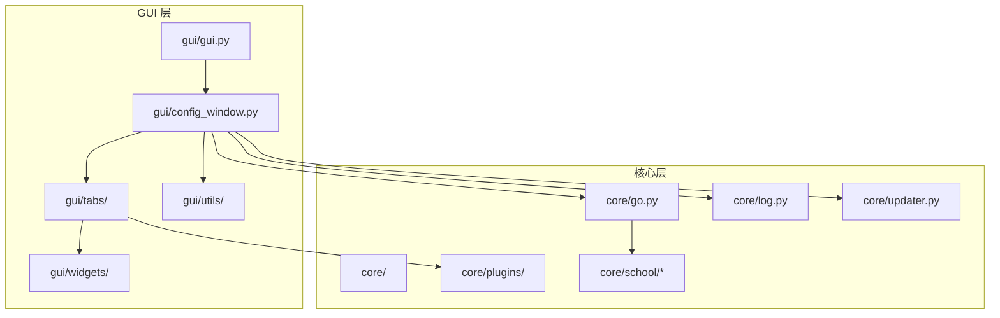
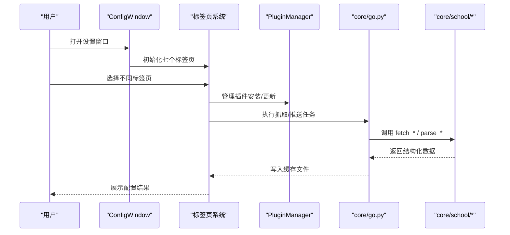
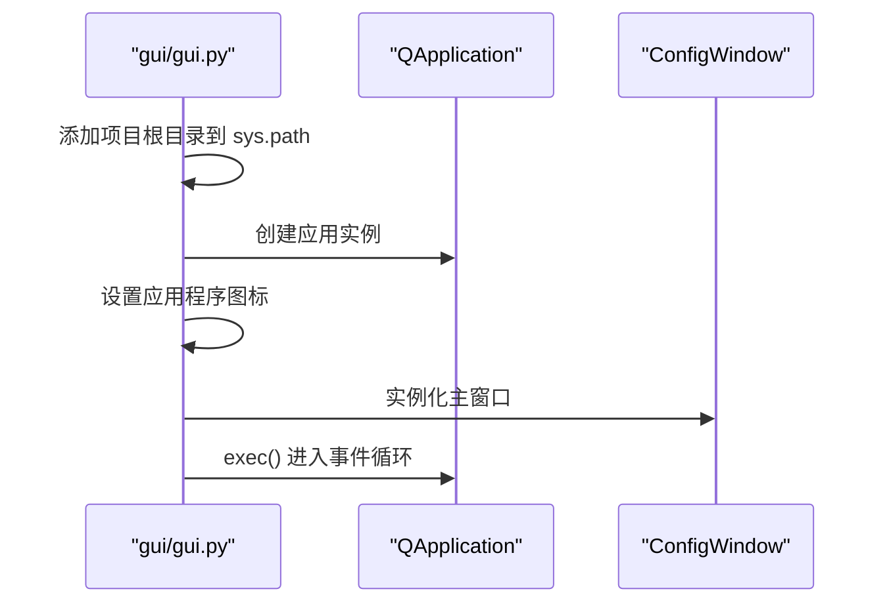
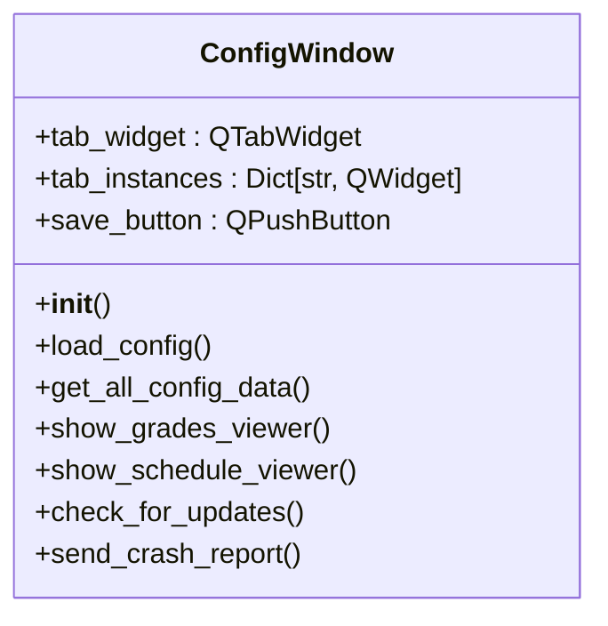
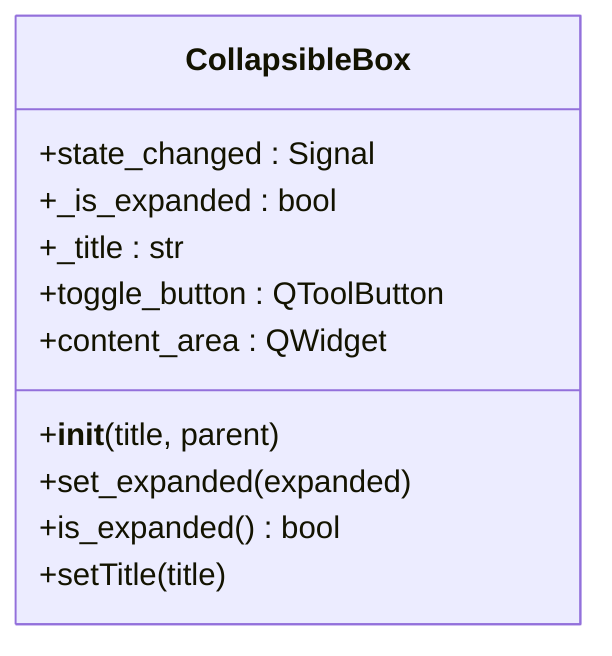
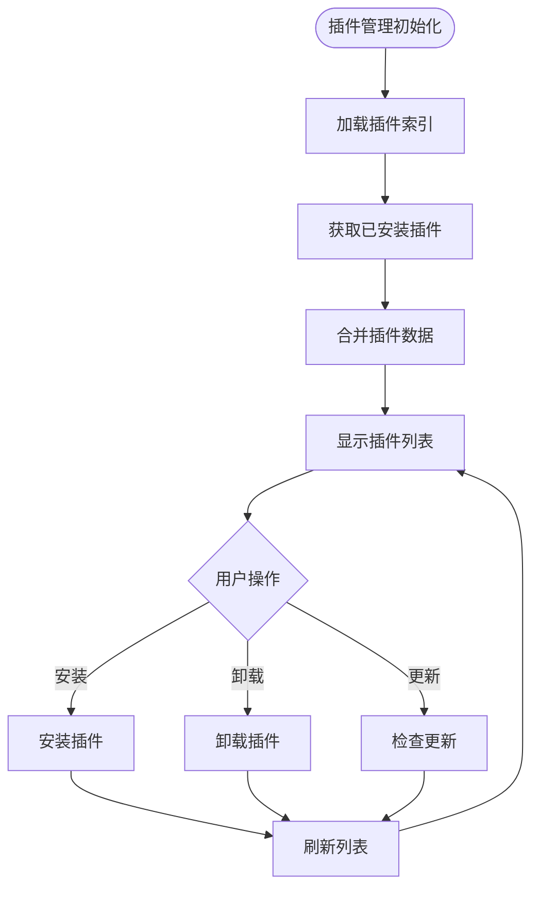
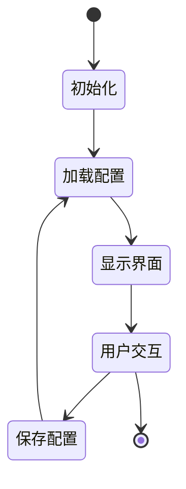
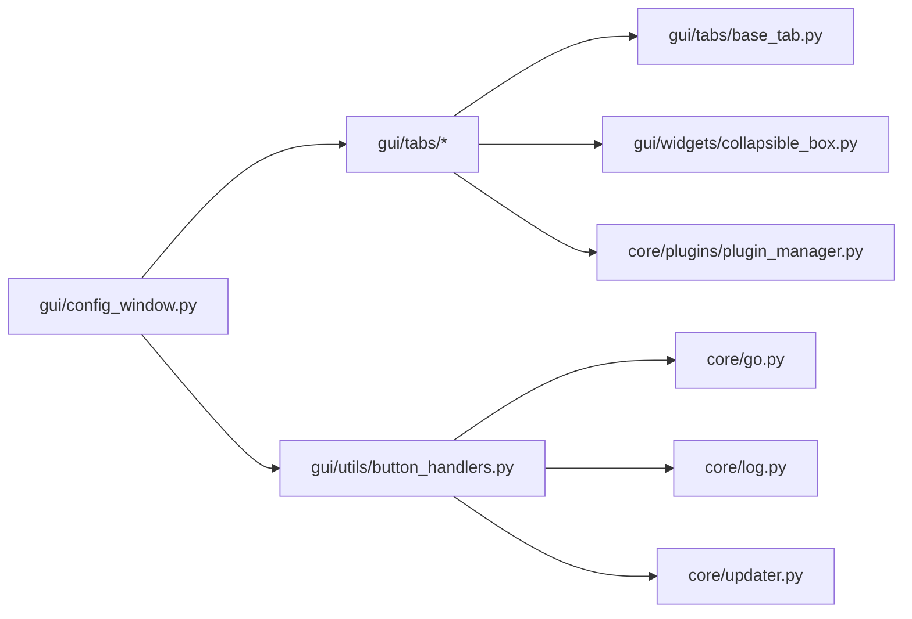

# GUI 模块化设计

<cite>
**本文引用的文件**
- [README.md](file://README.md)
- [requirements.txt](file://requirements.txt)
- [gui/GUI_MODULAR_DESIGN.md](file://gui/GUI_MODULAR_DESIGN.md)
- [developer_tools/GUI_MODULAR_DESIGN.md](file://developer_tools/GUI_MODULAR_DESIGN.md)
- [gui/gui.py](file://gui/gui.py)
- [gui/config_window.py](file://gui/config_window.py)
- [gui/grades_window.py](file://gui/grades_window.py)
- [gui/schedule_window.py](file://gui/schedule_window.py)
- [gui/dialogs.py](file://gui/dialogs.py)
- [gui/widgets/collapsible_box.py](file://gui/widgets/collapsible_box.py)
- [gui/tabs/base_tab.py](file://gui/tabs/base_tab.py)
- [gui/tabs/home_tab.py](file://gui/tabs/home_tab.py)
- [gui/tabs/basic_tab.py](file://gui/tabs/basic_tab.py)
- [gui/tabs/software_settings_tab.py](file://gui/tabs/software_settings_tab.py)
- [gui/tabs/school_time_tab.py](file://gui/tabs/school_time_tab.py)
- [gui/tabs/push_tab.py](file://gui/tabs/push_tab.py)
- [gui/tabs/plugin_management_tab.py](file://gui/tabs/plugin_management_tab.py)
- [gui/tabs/about_tab.py](file://gui/tabs/about_tab.py)
- [gui/utils/button_handlers.py](file://gui/utils/button_handlers.py)
- [core/plugins/plugin_manager.py](file://core/plugins/plugin_manager.py)
- [core/go.py](file://core/go.py)
- [core/log.py](file://core/log.py)
- [core/updater.py](file://core/updater.py)
- [core/school/__init__.py](file://core/school/__init__.py)
- [core/school/10546/__init__.py](file://core/school/10546/__init__.py)
</cite>

## 更新摘要
**所做更改**
- 新增标签页架构分析，详细说明新的模块化标签页设计
- 更新组件化设计原则，强调 BaseTab 基类的作用
- 新增可折叠组件 CollapsibleBox 的使用说明
- 更新插件管理系统的集成方式
- 完善按钮处理函数的模块化设计
- 新增详细的标签页交互流程图

## 目录
1. [引言](#引言)
2. [项目结构](#项目结构)
3. [核心组件](#核心组件)
4. [架构总览](#架构总览)
5. [组件详解](#组件详解)
6. [标签页架构分析](#标签页架构分析)
7. [依赖关系分析](#依赖关系分析)
8. [性能与可维护性](#性能与可维护性)
9. [故障排查指南](#故障排查指南)
10. [结论](#结论)
11. [附录](#附录)

## 引言
本文件面向 PySide6 框架下的 GUI 模块化设计，系统阐述组件化理念、模块划分原则、接口设计规范、数据绑定机制、自定义控件开发、窗口组织与通信、响应式设计与主题切换、国际化支持，以及开发示例与调试技巧。文档基于仓库中的实际代码进行分析，重点反映了新的标签页架构和组件化设计原则，帮助读者快速理解并高效扩展 GUI 子系统。

## 项目结构
项目采用"功能域驱动"的模块化布局，GUI 子系统位于 gui/ 目录，核心业务逻辑位于 core/ 目录，二者通过清晰的边界协作。新的标签页架构将配置界面细分为多个专门的功能模块，每个标签页都有独立的职责和生命周期管理。

**图表来源**
- [gui/gui.py](file://gui/gui.py#L1-L139)
- [gui/config_window.py](file://gui/config_window.py#L1-L445)
- [gui/tabs/base_tab.py](file://gui/tabs/base_tab.py#L1-L25)
- [gui/widgets/collapsible_box.py](file://gui/widgets/collapsible_box.py#L1-L80)
- [core/plugins/plugin_manager.py](file://core/plugins/plugin_manager.py#L1-L200)

**章节来源**
- [README.md](file://README.md#L60-L83)
- [gui/GUI_MODULAR_DESIGN.md](file://gui/GUI_MODULAR_DESIGN.md#L1-L52)
- [developer_tools/GUI_MODULAR_DESIGN.md](file://developer_tools/GUI_MODULAR_DESIGN.md#L1-L52)

## 核心组件
- **应用入口与启动**
  - gui/gui.py：初始化 QApplication，导入 ConfigWindow 并显示，作为最小启动逻辑
- **主配置窗口**
  - gui/config_window.py：包含七个标签页（首页、基本配置、软件设置、学校时间、推送设置、插件管理、关于），负责配置项的加载/保存、子窗口打开、更新检查、崩溃上报
- **标签页系统**
  - gui/tabs/base_tab.py：所有标签页的基类，定义通用的配置加载/保存接口
  - gui/tabs/home_tab.py：首页功能集合，提供快捷操作入口
  - gui/tabs/basic_tab.py：基本配置管理，包括院校选择和账户信息
  - gui/tabs/software_settings_tab.py：软件设置，包括循环检测和自启动配置
  - gui/tabs/school_time_tab.py：学校时间配置，支持可折叠的时间编辑器
  - gui/tabs/push_tab.py：推送设置，支持多种推送方式
  - gui/tabs/plugin_management_tab.py：插件管理系统，支持插件安装、卸载和更新
  - gui/tabs/about_tab.py：关于页面，提供版本信息和系统操作
- **自定义组件**
  - gui/widgets/collapsible_box.py：可折叠的配置容器组件
- **工具函数**
  - gui/utils/button_handlers.py：统一的按钮处理函数，管理跨标签页的操作

**章节来源**
- [gui/gui.py](file://gui/gui.py#L1-L139)
- [gui/config_window.py](file://gui/config_window.py#L37-L160)
- [gui/tabs/base_tab.py](file://gui/tabs/base_tab.py#L1-L25)
- [gui/tabs/home_tab.py](file://gui/tabs/home_tab.py#L1-L129)
- [gui/tabs/basic_tab.py](file://gui/tabs/basic_tab.py#L1-L234)
- [gui/tabs/software_settings_tab.py](file://gui/tabs/software_settings_tab.py#L1-L179)
- [gui/tabs/school_time_tab.py](file://gui/tabs/school_time_tab.py#L1-L166)
- [gui/tabs/push_tab.py](file://gui/tabs/push_tab.py#L1-L122)
- [gui/tabs/plugin_management_tab.py](file://gui/tabs/plugin_management_tab.py#L1-L646)
- [gui/tabs/about_tab.py](file://gui/tabs/about_tab.py#L1-L117)
- [gui/widgets/collapsible_box.py](file://gui/widgets/collapsible_box.py#L1-L80)
- [gui/utils/button_handlers.py](file://gui/utils/button_handlers.py#L1-L528)

## 架构总览
GUI 与核心模块通过以下方式协作：
- GUI 通过 subprocess 调用 core/go.py 执行抓取与推送任务
- GUI 通过 core/plugins/plugin_manager.py 管理插件的安装和更新
- GUI 通过 core/school/* 的统一接口获取各院校的解析逻辑
- GUI 通过 core/log.py 获取统一的配置与日志路径
- GUI 通过 core/updater.py 提供"检查更新"能力

**图表来源**
- [gui/config_window.py](file://gui/config_window.py#L120-L137)
- [gui/tabs/plugin_management_tab.py](file://gui/tabs/plugin_management_tab.py#L120-L260)
- [gui/utils/button_handlers.py](file://gui/utils/button_handlers.py#L271-L330)
- [core/plugins/plugin_manager.py](file://core/plugins/plugin_manager.py#L109-L180)

**章节来源**
- [gui/config_window.py](file://gui/config_window.py#L1-L445)
- [gui/utils/button_handlers.py](file://gui/utils/button_handlers.py#L1-L528)
- [core/plugins/plugin_manager.py](file://core/plugins/plugin_manager.py#L1-L200)

## 组件详解

### 应用入口与启动流程
- 入口文件负责：
  - 将项目根目录加入 sys.path，保证 core 模块可导入
  - 初始化 QApplication
  - 创建并显示 ConfigWindow
  - 设置应用程序图标和 Windows 任务栏图标
- 设计要点：
  - 最小启动逻辑，避免在入口处引入过多依赖
  - 通过 try/except 兼容不同工作目录下的导入
  - 支持多种图标路径，确保在不同环境下都能正确显示

**图表来源**
- [gui/gui.py](file://gui/gui.py#L17-L135)

**章节来源**
- [gui/gui.py](file://gui/gui.py#L1-L139)

### 主配置窗口（ConfigWindow）
- **职责与功能**：
  - 管理七个标签页的创建和布局
  - 提供统一的配置保存机制
  - 管理子窗口的打开和关闭
  - 处理全局操作（检查更新、崩溃上报等）
- **标签页管理**：
  - 使用字典存储所有标签页实例
  - 通过统一接口加载和保存配置
  - 支持标签页间的通信和数据共享
- **设计要点**：
  - 采用 QTabWidget 组织页面
  - 使用 QFormLayout/QHBoxLayout/QVBoxLayout 组织控件
  - 通过信号槽机制实现组件间通信

**图表来源**
- [gui/config_window.py](file://gui/config_window.py#L37-L160)

**章节来源**
- [gui/config_window.py](file://gui/config_window.py#L37-L160)

### 标签页系统架构
新的标签页架构采用统一的基类设计，所有标签页都继承自 BaseTab，确保一致的接口和行为。

#### BaseTab 基类
- **核心接口**：
  - load_config()：从配置管理器加载配置到UI
  - save_config()：从UI保存配置到配置管理器
- **设计原则**：
  - 所有子类必须实现这两个抽象方法
  - 提供统一的配置管理机制
  - 支持配置的增量更新

#### 标签页分类
- **功能型标签页**：
  - HomeTab：提供快捷操作入口
  - BasicTab：基本配置管理
  - SoftwareSettingsTab：软件设置
- **配置型标签页**：
  - SchoolTimeTab：学校时间配置
  - PushTab：推送设置
- **管理型标签页**：
  - PluginManagementTab：插件管理
  - AboutTab：关于页面

**章节来源**
- [gui/tabs/base_tab.py](file://gui/tabs/base_tab.py#L1-L25)
- [gui/tabs/home_tab.py](file://gui/tabs/home_tab.py#L1-L129)
- [gui/tabs/basic_tab.py](file://gui/tabs/basic_tab.py#L1-L234)
- [gui/tabs/software_settings_tab.py](file://gui/tabs/software_settings_tab.py#L1-L179)
- [gui/tabs/school_time_tab.py](file://gui/tabs/school_time_tab.py#L1-L166)
- [gui/tabs/push_tab.py](file://gui/tabs/push_tab.py#L1-L122)
- [gui/tabs/plugin_management_tab.py](file://gui/tabs/plugin_management_tab.py#L1-L646)
- [gui/tabs/about_tab.py](file://gui/tabs/about_tab.py#L1-L117)

### 可折叠组件（CollapsibleBox）
- **功能特性**：
  - 提供可折叠/展开的内容区域
  - 支持自定义标题和样式
  - 发出状态改变信号
- **应用场景**：
  - 推送设置中的各种配置组
  - 插件管理中的详细信息展示
  - 学校时间配置的分组管理

**图表来源**
- [gui/widgets/collapsible_box.py](file://gui/widgets/collapsible_box.py#L5-L80)

**章节来源**
- [gui/widgets/collapsible_box.py](file://gui/widgets/collapsible_box.py#L1-L80)

### 插件管理系统
- **核心功能**：
  - 插件列表获取和显示
  - 插件安装、卸载和更新
  - 插件版本管理和比较
  - 搜索和过滤功能
- **技术实现**：
  - 使用 QTableWidget 展示插件信息
  - 支持右键菜单操作
  - 多线程处理耗时操作
  - 缓存机制优化性能

**图表来源**
- [gui/tabs/plugin_management_tab.py](file://gui/tabs/plugin_management_tab.py#L474-L532)

**章节来源**
- [gui/tabs/plugin_management_tab.py](file://gui/tabs/plugin_management_tab.py#L1-L646)
- [core/plugins/plugin_manager.py](file://core/plugins/plugin_manager.py#L109-L180)

### 按钮处理函数系统
- **统一管理**：
  - 所有按钮点击事件通过集中函数处理
  - 支持跨标签页的操作协调
  - 提供统一的错误处理和用户反馈
- **功能分类**：
  - 配置保存和加载
  - 数据刷新和导入导出
  - 系统操作（更新、修复等）
  - 验证和安全检查

**章节来源**
- [gui/utils/button_handlers.py](file://gui/utils/button_handlers.py#L1-L528)

## 标签页架构分析

### 模块化设计原则
新的标签页架构体现了以下设计原则：

#### 1. 单一职责原则
每个标签页专注于特定的功能领域：
- **HomeTab**：提供快速访问常用功能
- **BasicTab**：管理基本的系统配置
- **SoftwareSettingsTab**：处理软件运行时设置
- **SchoolTimeTab**：配置学校时间安排
- **PushTab**：设置推送通知方式
- **PluginManagementTab**：管理插件生态系统
- **AboutTab**：提供系统信息和帮助

#### 2. 开闭原则
- 通过 BaseTab 基类定义稳定的接口
- 新增标签页只需继承基类并实现必要方法
- 不修改现有代码即可扩展新功能

#### 3. 依赖倒置原则
- 标签页依赖于抽象接口而非具体实现
- 通过配置管理器进行数据交换
- 降低模块间的耦合度

### 标签页生命周期管理

**图表来源**
- [gui/tabs/base_tab.py](file://gui/tabs/base_tab.py#L13-L25)
- [gui/config_window.py](file://gui/config_window.py#L163-L177)

### 配置管理机制
- **统一配置源**：所有标签页通过 ConfigWindow 的配置管理器访问数据
- **增量更新**：每个标签页只负责自己的配置部分
- **实时同步**：配置变更即时反映到相关组件
- **数据验证**：在保存前进行必要的数据验证

**章节来源**
- [gui/tabs/base_tab.py](file://gui/tabs/base_tab.py#L1-L25)
- [gui/config_window.py](file://gui/config_window.py#L163-L177)

## 依赖关系分析
- **GUI 依赖关系**
  - gui/config_window.py 依赖所有标签页模块、工具函数和核心模块
  - 各标签页依赖 BaseTab 基类和相应的工具组件
  - 标签页之间通过 ConfigWindow 进行间接通信
- **核心依赖关系**
  - core/plugins/plugin_manager.py 依赖网络模块和文件系统
  - core/go.py 依赖 core/school/*（动态加载）、core/log.py（日志/配置）
  - 核心模块之间保持松耦合的设计

**图表来源**
- [gui/config_window.py](file://gui/config_window.py#L14-L33)
- [gui/tabs/base_tab.py](file://gui/tabs/base_tab.py#L1-L25)
- [gui/utils/button_handlers.py](file://gui/utils/button_handlers.py#L1-L50)
- [core/plugins/plugin_manager.py](file://core/plugins/plugin_manager.py#L1-L70)

**章节来源**
- [requirements.txt](file://requirements.txt#L1-L3)
- [gui/config_window.py](file://gui/config_window.py#L1-L445)
- [gui/tabs/base_tab.py](file://gui/tabs/base_tab.py#L1-L25)
- [gui/utils/button_handlers.py](file://gui/utils/button_handlers.py#L1-L528)
- [core/plugins/plugin_manager.py](file://core/plugins/plugin_manager.py#L1-L200)

## 性能与可维护性
- **模块划分原则**
  - 功能独立：每个标签页负责单一功能领域
  - 职责分离：UI 层、业务逻辑层、数据访问层分离
  - 可扩展性：通过继承基类轻松添加新标签页
- **性能优化建议**
  - 标签页懒加载：按需创建和销毁标签页实例
  - 缓存机制：使用缓存减少重复计算和网络请求
  - 异步操作：大量数据处理使用多线程避免界面冻结
- **可维护性建议**
  - 统一接口：新增标签页遵循 BaseTab 的接口规范
  - 配置集中：通过配置管理器统一管理开关与参数
  - 日志统一：通过 core/log.py 获取路径，便于问题定位

## 故障排查指南
- **标签页加载失败**
  - 症状：某些标签页无法正常显示或功能异常
  - 处理：检查标签页基类继承和抽象方法实现
- **配置保存失败**
  - 症状：修改配置后重启应用发现设置未生效
  - 处理：确认 save_config 方法正确实现，检查配置管理器状态
- **插件管理异常**
  - 症状：插件列表无法加载或安装失败
  - 处理：检查网络连接，验证插件索引文件完整性
- **按钮事件未响应**
  - 症状：点击按钮无任何反应
  - 处理：检查信号槽连接，确认按钮处理函数正确绑定

**章节来源**
- [gui/tabs/base_tab.py](file://gui/tabs/base_tab.py#L13-L25)
- [gui/tabs/plugin_management_tab.py](file://gui/tabs/plugin_management_tab.py#L120-L260)
- [gui/utils/button_handlers.py](file://gui/utils/button_handlers.py#L90-L112)

## 结论
本项目在 PySide6 框架下实现了高度模块化的 GUI 设计：通过统一的标签页架构、标准化的组件接口、完善的配置管理机制，构建了一个可扩展、易维护的图形界面系统。新的标签页架构特别强调了模块化设计原则的应用，通过 BaseTab 基类确保了各功能模块的一致性和可扩展性。建议在后续迭代中进一步完善主题切换与国际化支持，以提升用户体验与可访问性。

## 附录

### 标签页开发指南
- **新增标签页步骤**
  1. 创建新的标签页类，继承自 BaseTab
  2. 实现 load_config 和 save_config 方法
  3. 在 ConfigWindow 中注册新标签页
  4. 添加相应的 UI 组件和布局
- **最佳实践**
  - 保持 UI 组件的简洁和一致性
  - 使用标准的 Qt 布局管理器
  - 提供适当的用户反馈和错误处理
  - 遵循配置管理器的命名规范

### 组件开发规范
- **自定义组件要求**
  - 仅负责 UI 渲染，不包含业务逻辑
  - 提供清晰的接口和配置选项
  - 支持样式定制和主题适配
  - 包含适当的注释和文档

### 配置管理最佳实践
- **配置结构设计**
  - 使用层次化的配置结构
  - 为每个功能模块提供独立的配置段
  - 支持默认值和配置验证
- **数据持久化**
  - 使用配置管理器进行统一的读写操作
  - 确保配置的加密存储
  - 提供配置导入导出功能

**章节来源**
- [gui/tabs/base_tab.py](file://gui/tabs/base_tab.py#L1-L25)
- [gui/config_window.py](file://gui/config_window.py#L120-L137)
- [gui/utils/button_handlers.py](file://gui/utils/button_handlers.py#L90-L112)