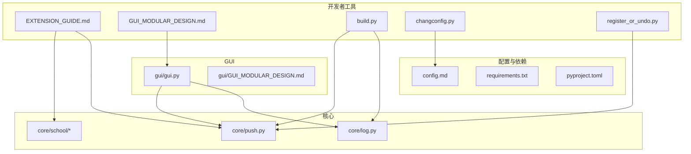
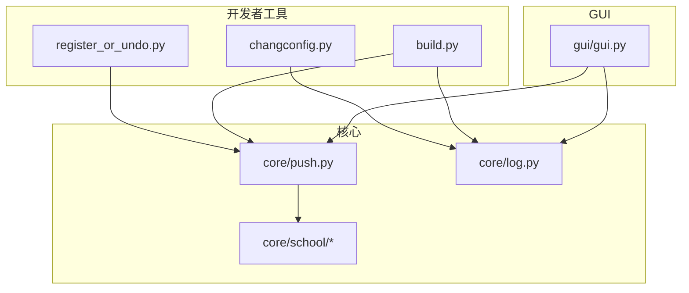
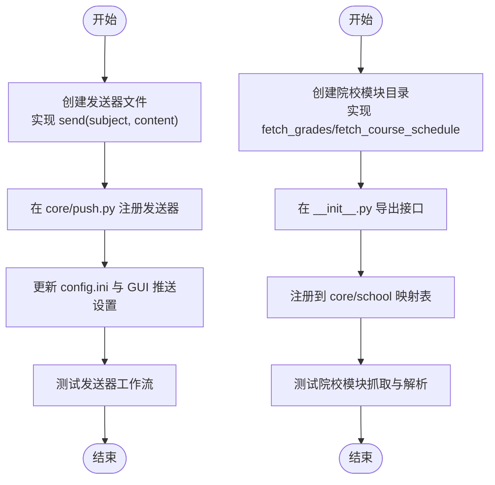
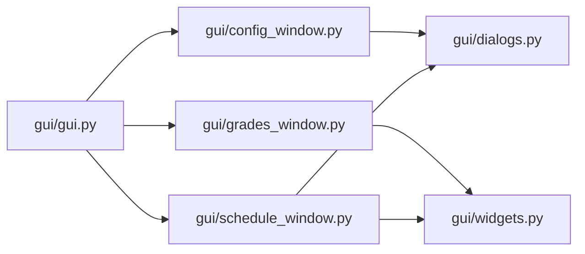
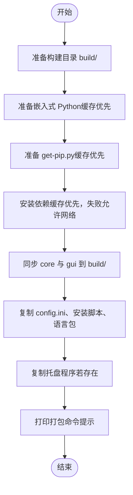
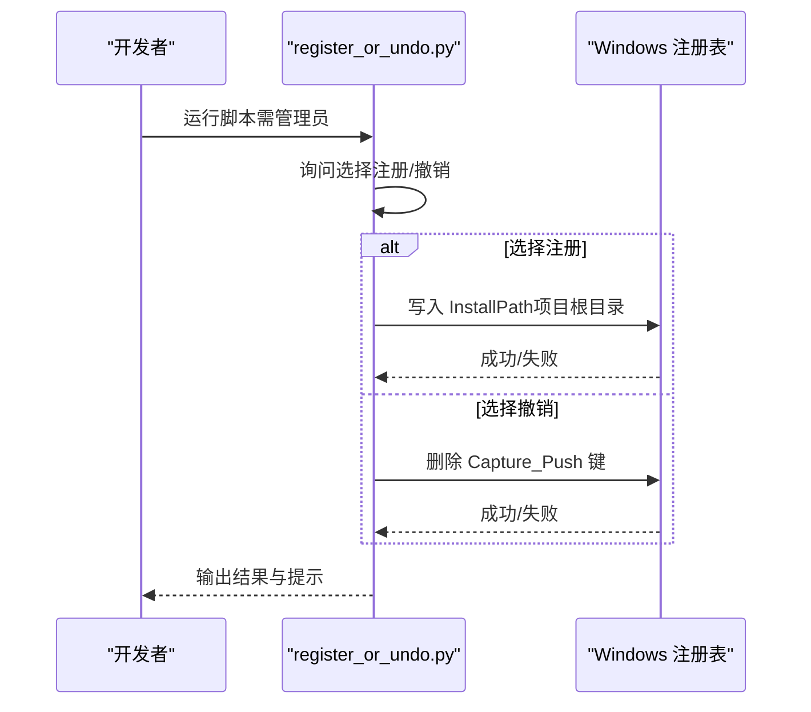
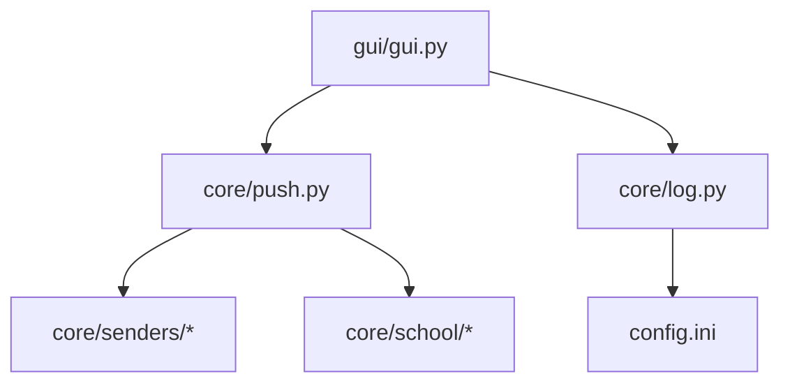

# 开发者工具

<cite>
**本文引用的文件**
- [README.md](file://README.md)
- [EXTENSION_GUIDE.md](file://developer_tools/EXTENSION_GUIDE.md)
- [GUI_MODULAR_DESIGN.md（开发者工具）](file://developer_tools/GUI_MODULAR_DESIGN.md)
- [build.py](file://developer_tools/build.py)
- [changconfig.py](file://developer_tools/changconfig.py)
- [register_or_undo.py](file://developer_tools/register_or_undo.py)
- [config.md](file://config.md)
- [requirements.txt](file://requirements.txt)
- [pyproject.toml](file://pyproject.toml)
- [core/push.py](file://core/push.py)
- [core/log.py](file://core/log.py)
- [core/school/__init__.py](file://core/school/__init__.py)
- [core/school/10546/__init__.py](file://core/school/10546/__init__.py)
- [gui/gui.py](file://gui/gui.py)
- [gui/GUI_MODULAR_DESIGN.md（GUI）](file://gui/GUI_MODULAR_DESIGN.md)
</cite>

## 目录
1. [简介](#简介)
2. [项目结构](#项目结构)
3. [核心组件](#核心组件)
4. [架构总览](#架构总览)
5. [详细组件分析](#详细组件分析)
6. [依赖关系分析](#依赖关系分析)
7. [性能考虑](#性能考虑)
8. [故障排查指南](#故障排查指南)
9. [结论](#结论)
10. [附录](#附录)

## 简介
本文件面向贡献者与维护者，提供 Capture_Push 开发者工具的完整说明。内容涵盖：
- 扩展开发指南：如何添加新的推送模块与院校模块
- GUI 模块化设计原则与组件开发规范
- 构建脚本的工作原理与使用方法
- 配置修改工具与注册/撤销工具的使用说明
- 代码规范、测试方法与发布流程最佳实践
- 开发环境搭建与调试指南

## 项目结构
项目采用“核心功能 + GUI + 托盘 + 打包”的分层组织方式。开发者工具位于 developer_tools 目录，核心逻辑位于 core，图形界面位于 gui，C++ 托盘程序位于 tray。

图表来源
- [EXTENSION_GUIDE.md](file://developer_tools/EXTENSION_GUIDE.md#L1-L102)
- [GUI_MODULAR_DESIGN.md（开发者工具）](file://developer_tools/GUI_MODULAR_DESIGN.md#L1-L52)
- [build.py](file://developer_tools/build.py#L1-L229)
- [changconfig.py](file://developer_tools/changconfig.py#L1-L52)
- [register_or_undo.py](file://developer_tools/register_or_undo.py#L1-L115)
- [core/push.py](file://core/push.py#L1-L319)
- [core/log.py](file://core/log.py#L1-L211)
- [core/school/__init__.py](file://core/school/__init__.py#L1-L28)
- [gui/gui.py](file://gui/gui.py#L1-L24)
- [gui/GUI_MODULAR_DESIGN.md（GUI）](file://gui/GUI_MODULAR_DESIGN.md#L1-L52)
- [config.md](file://config.md#L1-L52)
- [requirements.txt](file://requirements.txt#L1-L3)
- [pyproject.toml](file://pyproject.toml#L1-L13)

章节来源
- [README.md](file://README.md#L60-L83)

## 核心组件
- 推送管理与消息格式化：负责读取配置、注册发送器、格式化消息并调用具体发送器发送通知。
- 日志系统：统一日志路径、级别与轮转策略，支持打包后在用户目录写入日志。
- 院校模块化：动态发现与导入各院校模块，提供统一接口与名称映射。
- GUI 入口与模块化设计：最小化的应用入口，窗口与组件职责清晰，便于扩展与维护。
- 构建与打包：自动化准备隔离构建空间、准备嵌入式 Python、同步资源并生成安装包。

章节来源
- [core/push.py](file://core/push.py#L1-L319)
- [core/log.py](file://core/log.py#L1-L211)
- [core/school/__init__.py](file://core/school/__init__.py#L1-L28)
- [gui/gui.py](file://gui/gui.py#L1-L24)
- [gui/GUI_MODULAR_DESIGN.md（GUI）](file://gui/GUI_MODULAR_DESIGN.md#L1-L52)

## 架构总览
下图展示了开发者工具与核心模块之间的交互关系，以及构建脚本如何准备打包所需的资源。

图表来源
- [register_or_undo.py](file://developer_tools/register_or_undo.py#L1-L115)
- [changconfig.py](file://developer_tools/changconfig.py#L1-L52)
- [build.py](file://developer_tools/build.py#L1-L229)
- [core/push.py](file://core/push.py#L1-L319)
- [core/log.py](file://core/log.py#L1-L211)
- [core/school/__init__.py](file://core/school/__init__.py#L1-L28)
- [gui/gui.py](file://gui/gui.py#L1-L24)

## 详细组件分析

### 扩展开发指南（新增推送模块与院校模块）
- 新增推送模块（Sender）
  - 在 core/senders 下创建发送器文件，实现统一 send(subject, content) 接口。
  - 在 core/push.py 的通知管理器中注册新发送器。
  - 更新配置文件与 GUI 对应的推送设置项。
- 新增院校模块（School Module）
  - 在 core/school 下创建以院校代码命名的目录，包含 __init__.py、getCourseGrades.py、getCourseSchedule.py。
  - 实现统一接口：fetch_grades 与 fetch_course_schedule。
  - 在 core/school/__init__.py 的映射表中注册新模块，或使用 register_or_undo.py 脚本进行注册。
  - 数据规范：成绩与课表返回列表，字段需满足既定键名。
- 开发建议
  - 使用统一日志模块记录关键步骤。
  - 使用 get_config_path 获取配置路径，保证打包后仍可正确读取。
  - 在 requirements.txt 中补充新增依赖。

图表来源
- [EXTENSION_GUIDE.md](file://developer_tools/EXTENSION_GUIDE.md#L1-L102)
- [core/push.py](file://core/push.py#L83-L106)
- [core/school/__init__.py](file://core/school/__init__.py#L22-L28)

章节来源
- [EXTENSION_GUIDE.md](file://developer_tools/EXTENSION_GUIDE.md#L1-L102)

### GUI 模块化设计与组件开发规范
- 设计原则
  - 功能独立、职责分离、易于复用。
- 模块职责
  - gui/gui.py：应用入口，初始化 Qt 并启动主窗口。
  - gui/config_window.py：主配置窗口，管理基本配置、推送设置与关于页。
  - gui/grades_window.py：成绩查看窗口，负责表格展示、刷新与缓存。
  - gui/schedule_window.py：课表查看窗口，负责色块渲染、周次切换与手动编辑。
  - gui/dialogs.py：对话框组件，供多窗口复用。
  - gui/widgets.py：自定义 UI 组件，纯 UI，不含业务逻辑。
- 维护指南
  - 新功能：创建独立模块；对话框与组件按职责拆分；配置项在 config_window.py 中集中管理。
  - 修改现有功能：保持模块内职责一致；跨模块交互通过函数调用或信号槽实现。

图表来源
- [gui/gui.py](file://gui/gui.py#L1-L24)
- [gui/GUI_MODULAR_DESIGN.md（GUI）](file://gui/GUI_MODULAR_DESIGN.md#L1-L52)

章节来源
- [gui/GUI_MODULAR_DESIGN.md（GUI）](file://gui/GUI_MODULAR_DESIGN.md#L1-L52)

### 构建脚本（build.py）工作原理与使用
- 功能概览
  - 准备隔离构建空间（build/），复制核心与 GUI 源码，同步配置与安装脚本。
  - 使用本地缓存准备嵌入式 Python 与 pip，加速依赖安装。
  - 同步语言包资源，尝试复制托盘程序（若存在）。
  - 输出打包命令提示，支持完整版与轻量版安装包生成。
- 关键流程
  - 目录准备与缓存策略：使用本地缓存 ZIP 与 pip 缓存，失败时允许网络下载。
  - 依赖安装：优先使用本地缓存，失败则放宽限制允许网络下载。
  - 资源同步：按需复制配置、安装脚本与语言包。
  - 托盘程序：若存在则复制到打包目录，否则提示需要先单独构建 C++ 部分。
- 使用步骤
  - 运行 python developer_tools/build.py，准备构建空间。
  - 使用 Inno Setup 编译 build/Capture_Push_Setup.iss 或 build/Capture_Push_Lite_Setup.iss 生成安装包。

图表来源
- [build.py](file://developer_tools/build.py#L116-L229)

章节来源
- [build.py](file://developer_tools/build.py#L1-L229)
- [README.md](file://README.md#L101-L124)

### 配置修改工具（changconfig.py）
- 作用
  - 将项目根目录的 config.ini 模板复制到用户本地目录（%LOCALAPPDATA%\Capture_Push），并设置默认日志级别与运行模式。
- 使用场景
  - 开发调试时快速初始化配置，便于修改用户名、密码与邮箱认证信息。
- 注意事项
  - 仅支持 Windows 环境；确保脚本在 developer_tools 目录中运行。

章节来源
- [changconfig.py](file://developer_tools/changconfig.py#L1-L52)
- [config.md](file://config.md#L1-L52)

### 注册/撤销工具（register_or_undo.py）
- 作用
  - 将项目根目录写入系统注册表（HKLM\SOFTWARE\Capture_Push），便于系统识别与集成。
  - 支持撤销注册表项，恢复环境。
- 使用步骤
  - 以管理员权限运行脚本，选择注册或撤销操作，确认后执行。
- 注意事项
  - 仅支持 Windows；需要管理员权限；失败时会提示权限不足或写入失败。

图表来源
- [register_or_undo.py](file://developer_tools/register_or_undo.py#L36-L66)

章节来源
- [register_or_undo.py](file://developer_tools/register_or_undo.py#L1-L115)

### 日志系统与配置管理
- 日志系统
  - 统一日志路径：使用用户可写目录（%LOCALAPPDATA%\Capture_Push）。
  - 日志级别：从 config.ini 读取，支持 DEBUG/INFO/WARNING/ERROR/CRITICAL。
  - 文件轮转：单文件最大 10MB，保留多个备份，总大小超过阈值时自动清理最旧日志。
- 配置管理
  - config.ini 分节与键位：logging、run_model、push、email、test1 等。
  - 运行模式：DEV 避免频繁抓取，BUILD 正常抓取。
  - 推送方式：支持 none/email/test1/wechat/dingtalk/telegram 等。

章节来源
- [core/log.py](file://core/log.py#L60-L195)
- [config.md](file://config.md#L1-L52)

### 依赖管理与环境搭建
- 依赖来源
  - requirements.txt：标准依赖声明。
  - pyproject.toml：现代依赖管理工具支持。
- 开发环境
  - 使用 uv 创建虚拟环境并安装依赖。
  - 激活虚拟环境后安装依赖，确保开发与打包一致性。

章节来源
- [requirements.txt](file://requirements.txt#L1-L3)
- [pyproject.toml](file://pyproject.toml#L1-L13)
- [README.md](file://README.md#L87-L99)

## 依赖关系分析
- 组件耦合
  - GUI 通过导入 core 模块与日志模块进行交互，保持 UI 与业务逻辑分离。
  - 推送模块通过配置驱动选择发送器，发送器实现可插拔。
  - 院校模块通过动态导入实现扩展，核心逻辑不直接耦合具体学校实现。
- 外部依赖
  - requests、beautifulsoup4、PySide6 为主要外部依赖。
- 潜在风险
  - 注册表写入需要管理员权限；构建脚本依赖 Windows 平台与 Inno Setup。

图表来源
- [gui/gui.py](file://gui/gui.py#L1-L24)
- [core/push.py](file://core/push.py#L1-L319)
- [core/log.py](file://core/log.py#L1-L211)
- [core/school/__init__.py](file://core/school/__init__.py#L1-L28)

章节来源
- [gui/gui.py](file://gui/gui.py#L1-L24)
- [core/push.py](file://core/push.py#L1-L319)
- [core/log.py](file://core/log.py#L1-L211)
- [core/school/__init__.py](file://core/school/__init__.py#L1-L28)

## 性能考虑
- 构建阶段
  - 优先使用本地缓存下载 Python 与 pip，减少网络依赖；缓存校验失败自动重新下载。
  - 依赖安装阶段先尝试本地缓存，失败再允许网络下载，平衡速度与稳定性。
- 运行阶段
  - 日志轮转与自动清理，避免磁盘占用过大。
  - 推送方式按配置动态选择，避免不必要的初始化与网络请求。

## 故障排查指南
- 构建失败
  - 确认 Windows 平台与 Inno Setup 已安装；检查 build.py 输出的打包命令。
  - 若依赖安装失败，检查网络与缓存目录权限。
- 注册/撤销失败
  - 确保以管理员权限运行；检查注册表写入权限。
- 配置问题
  - 使用 changconfig.py 初始化配置；核对 config.ini 的节与键是否正确。
  - 检查日志级别与运行模式设置是否符合预期。
- 日志定位
  - 使用日志打包工具收集日志文件，便于问题诊断。

章节来源
- [build.py](file://developer_tools/build.py#L22-L24)
- [register_or_undo.py](file://developer_tools/register_or_undo.py#L46-L48)
- [changconfig.py](file://developer_tools/changconfig.py#L1-L52)
- [core/log.py](file://core/log.py#L18-L57)

## 结论
本开发者工具文档提供了从扩展开发、GUI 设计、构建打包到配置与注册的全流程指导。遵循模块化与职责分离的设计原则，结合统一的日志与配置管理，可高效地迭代与维护系统功能。建议在开发过程中严格遵守扩展与组件规范，配合构建脚本与注册工具，确保交付质量与用户体验。

## 附录
- 开发环境搭建与调试
  - 使用 uv 创建并激活虚拟环境，安装依赖后运行 GUI 或核心模块进行调试。
  - 使用 changconfig.py 初始化配置，调整日志级别与运行模式以适配开发需求。
- 测试方法
  - 新增推送模块与院校模块后，分别在 GUI 中验证配置项与发送/抓取流程。
  - 使用日志与日志打包工具定位异常，结合单元测试与端到端测试验证功能。
- 发布流程
  - 先构建 C++ 托盘程序（如需要），再运行构建脚本准备资源，最后使用 Inno Setup 生成安装包。

章节来源
- [README.md](file://README.md#L87-L124)
- [EXTENSION_GUIDE.md](file://developer_tools/EXTENSION_GUIDE.md#L98-L102)
- [GUI_MODULAR_DESIGN.md（开发者工具）](file://developer_tools/GUI_MODULAR_DESIGN.md#L40-L52)