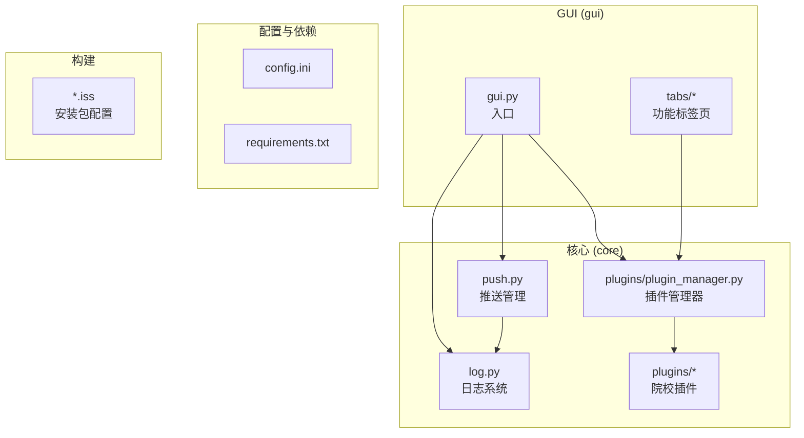
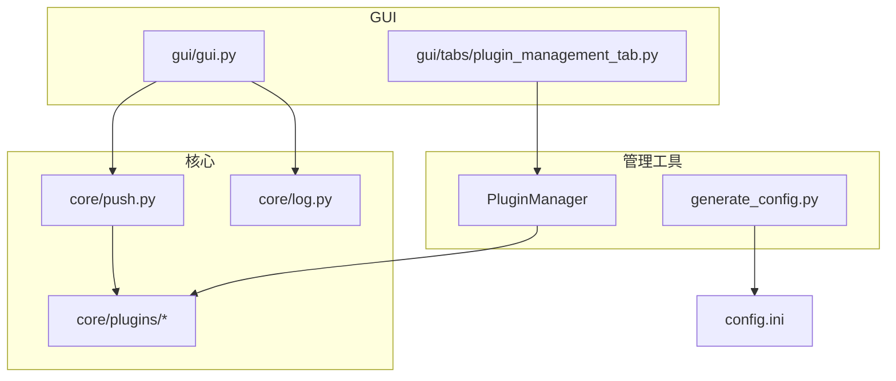

# 开发者工具指南

<cite>
**本文引用的文件**
- [README.md](file://README.md)
- [扩展开发指南](file://.wiki/zh/content/开发者工具/扩展开发指南/扩展开发指南.md)
- [GUI 模块化设计](file://.wiki/zh/content/开发者工具/GUI 模块化设计.md)
- [requirements.txt](file://requirements.txt)
- [pyproject.toml](file://pyproject.toml)
- [core/push.py](file://core/push.py)
- [core/log.py](file://core/log.py)
- [core/plugins/__init__.py](file://core/plugins/__init__.py)
- [core/plugins/plugin_manager.py](file://core/plugins/plugin_manager.py)
- [gui/gui.py](file://gui/gui.py)
</cite>

## 目录
1. [简介](#简介)
2. [项目结构](#项目结构)
3. [核心组件](#核心组件)
4. [架构总览](#架构总览)
5. [详细组件分析](#详细组件分析)
6. [依赖关系分析](#依赖关系分析)
7. [结论](#结论)

## 简介
本文件面向贡献者与维护者，提供 Capture_Push 开发者工具的完整说明。随着项目架构的升级，我们已从旧的静态脚本迁移到了更现代化的插件管理和构建系统。

主要内容涵盖：
- **插件系统**：如何使用 PluginManager 管理和开发院校插件
- **GUI 设计**：基于 PySide6 的模块化界面开发规范
- **构建系统**：使用 Inno Setup 进行应用打包
- **配置管理**：基于 config.ini 和 Windows DPAPI 的配置系统

## 项目结构
项目采用“核心功能 + 插件层 + GUI + 托盘”的分层组织方式。

**图表来源**
- [core/plugins/plugin_manager.py](file://core/plugins/plugin_manager.py)
- [gui/gui.py](file://gui/gui.py)

## 核心组件
- **插件管理器 (PluginManager)**：取代了旧的 `register_or_undo.py`，负责动态发现、安装、更新和加载院校插件。
- **推送管理 (Push Manager)**：负责读取配置、注册发送器、格式化消息并调用具体发送器发送通知。
- **日志系统 (Log System)**：统一日志路径、级别与轮转策略，支持打包后在用户目录写入日志。
- **GUI 模块化**：最小化的应用入口，窗口与组件职责清晰，通过 `tabs/` 目录组织功能。
- **Inno Setup 构建**：取代了旧的 `build.py`，提供更专业的 Windows 安装包制作能力。

## 架构总览
下图展示了开发者工具与核心模块之间的交互关系。

## 详细组件分析

### 插件开发体系
我们不再使用 `register_or_undo.py` 手动注册模块。现在，一切基于 `core/plugins` 目录和 `PluginManager`。

1.  **创建插件**：在 `core/plugins/` 下创建院校代码目录（如 `10546`）。
2.  **实现接口**：编写 `getCourseGrades.py` 和 `getCourseSchedule.py`。
3.  **定义元数据**：在 `__init__.py` 中定义 `SCHOOL_NAME` 和 `PLUGIN_VERSION`。
4.  **本地测试**：直接运行 `go.py` 或 GUI，PluginManager 会自动发现本地插件。
5.  **发布**：将插件打包并通过 GitHub Releases 发布，更新 `plugins_index.json`（由维护者操作）。

详细指南请参考：[扩展开发指南](file://.wiki/zh/content/开发者工具/扩展开发指南/扩展开发指南.md)

### GUI 开发规范
- **目录结构**：
  - `gui/tabs/`: 存放各功能标签页（如 `plugin_management_tab.py`）。
  - `gui/widgets/`: 存放通用 UI 组件。
  - `gui/windows.py`: 存放独立窗口逻辑。
- **设计原则**：业务逻辑与界面分离，通过信号槽通信。

详细指南请参考：[GUI 模块化设计](file://.wiki/zh/content/开发者工具/GUI 模块化设计.md)

### 构建与发布
旧的 `build.py` 脚本已被弃用。我们现在使用 **Inno Setup** 进行构建。

1.  **生成 UI 代码**（如果使用 .ui 文件）。
2.  **编译 C++ 托盘**（如果修改了托盘程序）。
3.  **使用 ISCC 编译**：运行 `Capture_Push_Setup.iss` 生成安装包。

详细指南请参考：[构建与发布指南](file://.wiki/zh/content/开发者工具/构建工具.md)

## 依赖关系分析
- **核心依赖**：`requests`, `beautifulsoup4`, `PySide6`
- **加密依赖**：`pywin32` (用于 DPAPI)
- **构建依赖**：`Inno Setup` (外部工具)

## 结论
新的开发者工具链更加标准化和现代化，降低了维护成本，提升了扩展性。请所有贡献者遵循新的开发规范。
