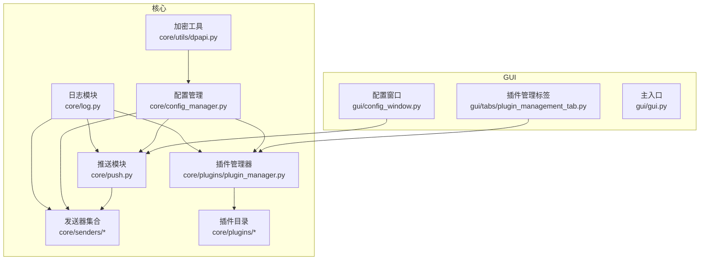
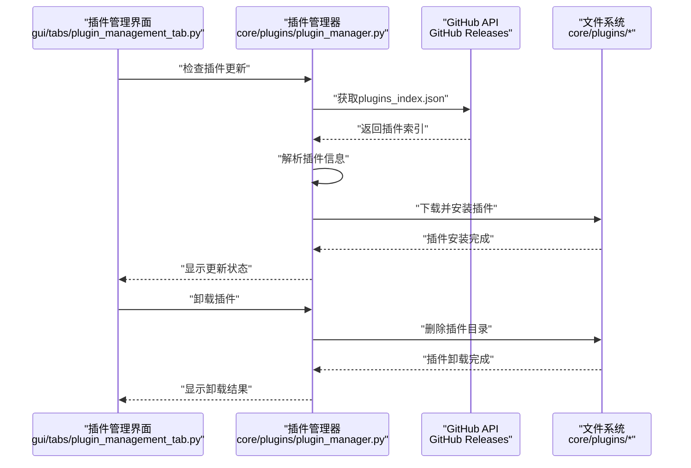
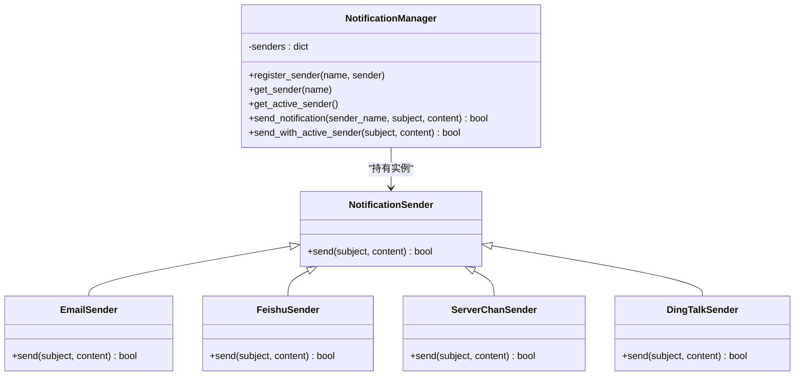
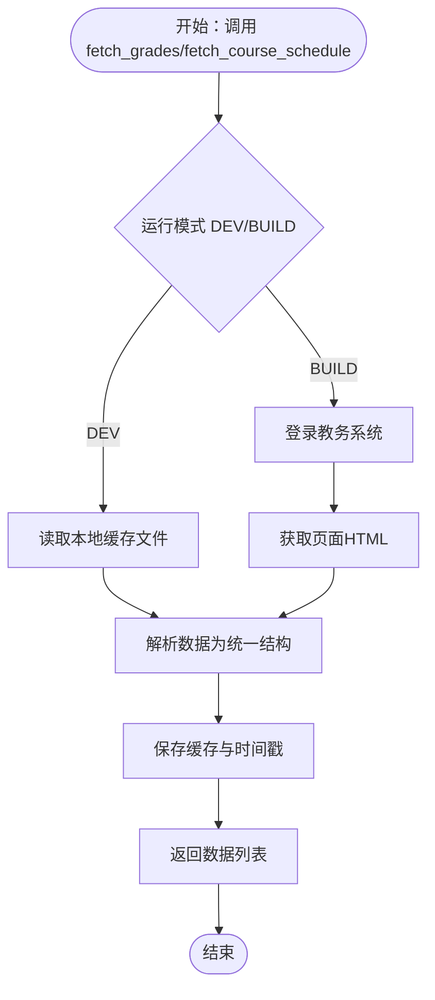
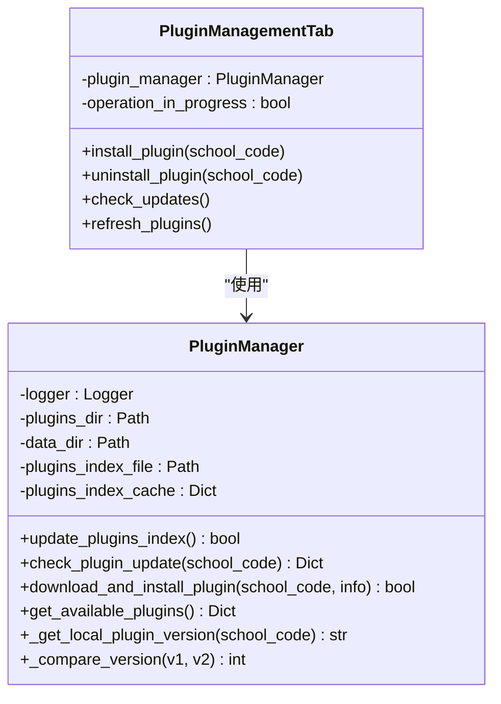
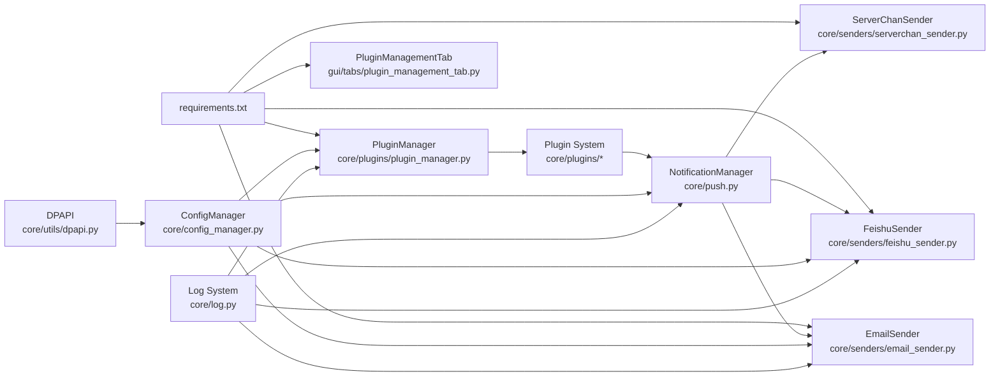

# 扩展开发指南

<cite>
**本文引用的文件**
- [push.py](file://core/push.py)
- [config_manager.py](file://core/config_manager.py)
- [log.py](file://core/log.py)
- [email_sender.py](file://core/senders/email_sender.py)
- [feishu_sender.py](file://core/senders/feishu_sender.py)
- [serverchan_sender.py](file://core/senders/serverchan_sender.py)
- [plugin_manager.py](file://core/plugins/plugin_manager.py)
- [plugin_management_tab.py](file://gui/tabs/plugin_management_tab.py)
- [12345/__init__.py](file://core/plugins/12345/__init__.py)
- [senders/__init__.py](file://core/senders/__init__.py)
- [config.ini](file://config.ini)
- [config_window.py](file://gui/config_window.py)
- [gui.py](file://gui/gui.py)
- [dpapi.py](file://core/utils/dpapi.py)
- [requirements.txt](file://requirements.txt)
</cite>

## 目录
1. [简介](#简介)
2. [项目结构](#项目结构)
3. [核心组件](#核心组件)
4. [架构总览](#架构总览)
5. [详细组件分析](#详细组件分析)
6. [依赖关系分析](#依赖关系分析)
7. [性能考虑](#性能考虑)
8. [故障排查指南](#故障排查指南)
9. [结论](#结论)
10. [附录](#附录)

## 简介
本指南面向希望为 Capture_Push 系统添加"新推送模块"和"新院校支持模块"的开发者，提供从设计规范、开发流程、配置扩展到 GUI 适配的完整说明。系统采用模块化架构，推送模块通过统一的发送器接口实现，院校模块现已全面支持插件化开发，通过 GitHub API 实现远程下载、版本管理和安全验证。日志系统统一管理，配置文件集中维护并通过 Windows DPAPI 进行加密存储。

**更新** 项目现已从传统的直接开发学校模块转变为现代化的插件开发模式，支持通过 GUI 界面进行插件管理，包括安装、卸载、更新等功能。

## 项目结构
- 核心模块
  - core/push.py：推送管理器与消息格式化函数
  - core/senders/*：具体发送器实现（邮件、飞书、Server酱等）
  - core/plugins/*：插件化院校模块（按学校代码命名）
  - core/plugins/plugin_manager.py：插件管理器，负责插件的下载、安装、更新和验证
  - core/config_manager.py：配置管理与加密解密
  - core/log.py：统一日志初始化与路径管理
- GUI 模块
  - gui/config_window.py：配置窗口（含推送方式与邮件/飞书配置）
  - gui/tabs/plugin_management_tab.py：插件管理标签页，提供完整的插件生命周期管理
  - gui/gui.py：主应用入口
- 配置与依赖
  - config.ini：应用配置文件
  - requirements.txt：第三方依赖

**图表来源**
- [push.py](file://core/push.py#L74-L163)
- [plugin_manager.py](file://core/plugins/plugin_manager.py#L26-L70)
- [config_manager.py](file://core/config_manager.py#L15-L68)
- [log.py](file://core/log.py#L167-L364)
- [plugin_management_tab.py](file://gui/tabs/plugin_management_tab.py#L17-L26)

**章节来源**
- [gui/gui.py](file://gui/gui.py#L16-L24)

## 核心组件
- 推送管理器
  - 负责注册与选择发送器、根据配置选择活跃发送器、统一发送入口
  - 提供便捷的发送函数（成绩、课表等）
- 发送器接口
  - 统一的 send(subject, content) 接口，具体实现由各发送器类完成
- 插件化院校模块
  - 通过 GitHub API 实现远程下载、版本管理和安全验证
  - 支持通过 GUI 界面进行安装、卸载、更新操作
  - 插件结构标准化，包含版本文件和元数据信息
- 配置管理系统
  - 使用 Windows DPAPI 自动加密存储敏感配置
  - 统一的配置读取与保存接口
- 日志系统
  - 统一日志初始化、文件路径、级别控制与清理策略
- GUI 插件管理界面
  - 提供插件搜索、安装、卸载、更新的完整生命周期管理
  - 支持批量检查更新和版本对比

**章节来源**
- [push.py](file://core/push.py#L74-L163)
- [plugin_manager.py](file://core/plugins/plugin_manager.py#L26-L70)
- [config_manager.py](file://core/config_manager.py#L15-L68)
- [log.py](file://core/log.py#L167-L364)
- [plugin_management_tab.py](file://gui/tabs/plugin_management_tab.py#L17-L26)

## 架构总览
推送链路从 GUI 触发，经推送管理器选择发送器，最终由具体发送器实现发送；插件化院校模块通过统一接口从教务系统抓取数据，再交由推送模块发送。插件管理器负责插件的远程下载、版本管理和安全验证，确保插件的完整性和安全性。

**图表来源**
- [plugin_management_tab.py](file://gui/tabs/plugin_management_tab.py#L120-L175)
- [plugin_manager.py](file://core/plugins/plugin_manager.py#L109-L181)

## 详细组件分析

### 推送发送器开发流程（新增推送模块）
- 目标
  - 实现一个具备 send(subject, content) 的发送器类，并在推送管理器中注册
- 步骤
  1) 创建发送器文件
     - 在 core/senders/ 下创建新文件（如 dingtalk_sender.py）
  2) 实现发送器类
     - 类需实现 send(subject, content)，并在内部读取配置、执行发送、记录日志
     - 参考现有实现：邮件发送器与飞书发送器
  3) 在推送管理器中注册
     - 修改 core/push.py 的 NotificationManager._register_available_senders()
     - 异常捕获并记录警告，保证系统稳定性
  4) 更新配置文件与 GUI
     - 在 config.ini 中添加对应节（如 [dingtalk]）
     - 在 gui/config_window.py 中增加 UI 选项（单选按钮、表单等）
  5) 依赖与日志
     - 在 requirements.txt 中添加必要依赖
     - 使用 core/log.init_logger 获取日志器，确保路径兼容打包环境
- 最佳实践
  - 配置读取使用 core/config_manager.load_config() 自动处理加密
  - 发生异常时记录详细错误并返回 False
  - 对敏感信息（如授权码）避免明文打印
  - 支持超时与重试策略（视具体平台而定）

**图表来源**
- [push.py](file://core/push.py#L56-L163)
- [email_sender.py](file://core/senders/email_sender.py#L46-L143)
- [feishu_sender.py](file://core/senders/feishu_sender.py#L44-L113)
- [serverchan_sender.py](file://core/senders/serverchan_sender.py#L81-L129)

**章节来源**
- [push.py](file://core/push.py#L83-L104)
- [email_sender.py](file://core/senders/email_sender.py#L39-L143)
- [feishu_sender.py](file://core/senders/feishu_sender.py#L44-L113)
- [serverchan_sender.py](file://core/senders/serverchan_sender.py#L81-L129)
- [config_window.py](file://gui/config_window.py#L335-L399)
- [config.ini](file://config.ini#L23-L39)

### 插件化院校模块开发规范（新增插件模块）
- 目标
  - 为新学校实现插件化的院校模块，支持通过 GitHub API 远程下载和管理
- 插件结构与必需文件
  - 在 core/plugins/[学校代码]/ 下创建插件目录
  - 在该目录下创建以下文件：
    - __init__.py：导出接口并包含插件元数据（SCHOOL_NAME、SCHOOL_CODE、PLUGIN_VERSION）
    - getCourseGrades.py：实现 fetch_grades(username, password, force_update=False)
    - getCourseSchedule.py：实现 fetch_course_schedule(username, password, force_update=False)
- 插件接口要求
  - 必须导出以下内容：fetch_grades、parse_grades、fetch_course_schedule、parse_schedule
  - 必需的插件元数据：SCHOOL_NAME（院校中文名称）、SCHOOL_CODE（院校代码）、PLUGIN_VERSION（版本号）
- 数据接口规范
  - 成绩数据：列表，每项为字典，必须包含"课程名称"、"成绩"、"学分"、"课程属性"、"学期"
  - 课表数据：列表，每项为字典，必须包含"星期"（1-7）、"开始小节"、"结束小节"、"课程名称"、"教室"、"教师"、"周次列表"（整数列表）
- 开发要点
  - 使用统一日志：from core.log import init_logger, get_config_path, get_log_file_path
  - 配置读取：使用 core/config_manager.load_config() 自动处理加密
  - 缓存策略：可参考现有实现（如衡阳师范学院插件）的缓存与时间戳机制
  - 运行模式：支持 DEV/BUILD 模式，避免开发时频繁请求
  - 错误处理：捕获异常并记录，必要时保存失败页面以便诊断
- 插件发布与管理
  - 将插件目录打包为 ZIP 文件
  - 确保包含所有必要文件和正确的元数据
  - 通过 GitHub Releases 发布插件包
  - 更新远程 plugins_index.json 索引文件以包含新版本信息

**图表来源**
- [12345/__init__.py](file://core/plugins/12345/__init__.py#L7-L14)

**章节来源**
- [12345/__init__.py](file://core/plugins/12345/__init__.py#L7-L14)

### 插件管理器与 GUI 界面
- 插件管理器功能
  - 通过 GitHub API 管理插件的下载、验证、安装和加载
  - 支持插件版本比较和自动更新
  - 提供插件索引文件的本地缓存和远程同步
  - 实现插件的安全验证和完整性检查
- GUI 插件管理界面
  - 提供插件搜索、安装、卸载、更新的完整生命周期管理
  - 支持批量检查更新和版本对比
  - 实现插件的可视化展示和状态管理
  - 提供用户友好的操作界面和反馈机制

**图表来源**
- [plugin_manager.py](file://core/plugins/plugin_manager.py#L26-L70)
- [plugin_management_tab.py](file://gui/tabs/plugin_management_tab.py#L17-L26)

**章节来源**
- [plugin_manager.py](file://core/plugins/plugin_manager.py#L26-L70)
- [plugin_management_tab.py](file://gui/tabs/plugin_management_tab.py#L17-L26)

### 配置管理与加密
- 配置文件加密
  - 所有敏感配置（如密码、webhook URL、密钥等）都会自动使用 Windows DPAPI 加密存储
  - 使用 `core.config_manager.load_config()` 加载配置，`core.config_manager.save_config()` 保存配置
  - 配置文件路径统一使用 `core.log.get_config_path()` 获取
- 配置导出功能
  - 用户可以通过 GUI 的"关于"界面导出明文配置文件
  - 导出需要验证教务系统登录密码
  - 验证通过后，将生成一个临时的明文配置文件供用户查看

**章节来源**
- [config_manager.py](file://core/config_manager.py#L15-L68)
- [log.py](file://core/log.py#L167-L189)
- [config_window.py](file://gui/config_window.py#L698-L750)

### GUI 界面适配方案
- 模块化设计原则
  - 功能独立、职责分离、易于复用
  - UI 层、业务层、数据层分离
- 新增推送方式的 UI 适配
  - 在 gui/config_window.py 的推送设置标签页中添加单选按钮与表单
  - 保存时写入 config.ini 对应节
- 新增插件的 UI 适配
  - 在 gui/tabs/plugin_management_tab.py 中提供完整的插件生命周期管理
  - 支持插件搜索、安装、卸载、更新操作
  - 实现插件状态的实时更新和用户反馈

**章节来源**
- [config_window.py](file://gui/config_window.py#L173-L232)
- [plugin_management_tab.py](file://gui/tabs/plugin_management_tab.py#L27-L75)

## 依赖关系分析
- 组件耦合
  - 推送管理器与发送器：通过统一接口解耦，新增发送器无需修改管理器
  - 插件化院校模块与推送模块：通过统一数据结构解耦，新增学校只需实现接口
  - 插件管理器与 GUI：通过事件和信号解耦，支持异步操作
  - GUI 与核心：通过配置文件与日志接口耦合，尽量减少直接依赖
- 外部依赖
  - requests、beautifulsoup4、PySide6
- 依赖管理
  - requirements.txt 统一声明

**图表来源**
- [requirements.txt](file://requirements.txt#L1-L3)
- [email_sender.py](file://core/senders/email_sender.py#L1-L143)
- [feishu_sender.py](file://core/senders/feishu_sender.py#L1-L113)
- [serverchan_sender.py](file://core/senders/serverchan_sender.py#L1-L129)
- [plugin_manager.py](file://core/plugins/plugin_manager.py#L1-L1245)
- [plugin_management_tab.py](file://gui/tabs/plugin_management_tab.py#L1-L646)
- [push.py](file://core/push.py#L1-L392)
- [config_manager.py](file://core/config_manager.py#L1-L68)
- [log.py](file://core/log.py#L1-L364)
- [dpapi.py](file://core/utils/dpapi.py#L1-L101)

**章节来源**
- [requirements.txt](file://requirements.txt#L1-L3)

## 性能考虑
- 缓存与循环检测
  - 插件管理器使用本地缓存减少网络请求频率
  - 院校模块普遍采用缓存与时间戳机制，避免频繁请求
  - 可参考现有实现的循环检测配置与缓存策略
- 网络请求优化
  - 使用会话与适配器（如 IPv4Adapter）提升稳定性
  - 合理设置超时与重试
  - 插件管理器支持代理访问，提高网络兼容性
- 日志与磁盘 IO
  - 统一日志文件与轮转，避免日志过大影响性能
  - 清理旧日志，控制总大小
  - 插件索引文件的本地缓存机制
- 配置文件安全
  - Windows DPAPI 自动加密，确保敏感信息安全
  - 配置文件只在内存中解密，减少暴露风险

**章节来源**
- [log.py](file://core/log.py#L192-L252)
- [config_manager.py](file://core/config_manager.py#L15-L68)
- [plugin_manager.py](file://core/plugins/plugin_manager.py#L109-L181)
- [dpapi.py](file://core/utils/dpapi.py#L12-L77)

## 故障排查指南
- 邮件发送失败
  - 检查 SMTP、端口、发件/收件邮箱与授权码
  - Outlook/Hotmail 基本认证可能被禁用，需使用应用密码
  - 查看日志文件定位错误
- 飞书发送失败
  - 检查 Webhook URL 与密钥，必要时添加签名参数
  - 查看返回码与错误信息
- 插件下载失败
  - 检查网络连接和 GitHub API 可访问性
  - 尝试使用代理访问（系统支持 ghfast.top 代理）
  - 验证插件的 SHA256 校验和
- 插件安装失败
  - 检查磁盘空间和文件权限
  - 确认插件包的完整性和正确性
  - 查看插件管理器的日志输出
- 院校模块登录失败
  - 检查验证码、账号密码与网络连通性
  - 保存失败页面便于分析
- 配置读取失败
  - 确认 config.ini 路径与权限（AppData 目录）
  - 使用 core/log.get_config_path 获取正确路径
  - 检查 Windows DPAPI 加密是否正常工作
- GUI 配置导出失败
  - 验证教务系统密码是否正确
  - 检查文件保存权限

**章节来源**
- [email_sender.py](file://core/senders/email_sender.py#L78-L143)
- [feishu_sender.py](file://core/senders/feishu_sender.py#L90-L113)
- [plugin_manager.py](file://core/plugins/plugin_manager.py#L141-L180)
- [log.py](file://core/log.py#L167-L189)
- [config_window.py](file://gui/config_window.py#L698-L750)

## 结论
通过统一的发送器接口与插件化的院校模块，Capture_Push 提供了现代化的扩展路径。开发者只需遵循插件开发规范、配置规范与 GUI 适配流程，即可快速集成新的推送方式与院校支持模块。插件管理器提供了完整的生命周期管理，包括远程下载、版本管理和安全验证，确保扩展的稳定性与可维护性。配合完善的日志系统、Windows DPAPI 加密存储与缓存策略，可确保扩展的可靠性与用户体验。

## 附录
- 开发者工具
  - GUI 模块化设计：[GUI 模块化设计](file://.wiki/zh/content/开发者工具/GUI 模块化设计.md)
- 配置参考
  - config.ini 与 config.md
- 核心模块参考
  - 推送管理器：core/push.py
  - 插件管理器：core/plugins/plugin_manager.py
  - 配置管理器：core/config_manager.py
  - 日志系统：core/log.py
  - 加密工具：core/utils/dpapi.py
- 插件开发参考
  - 示例插件：core/plugins/12345/
