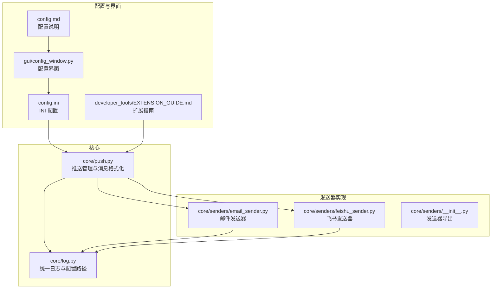
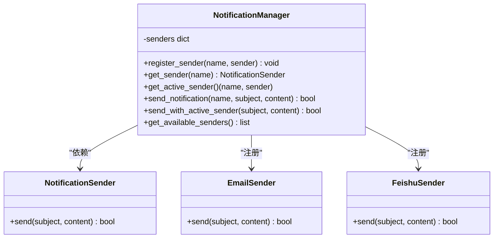
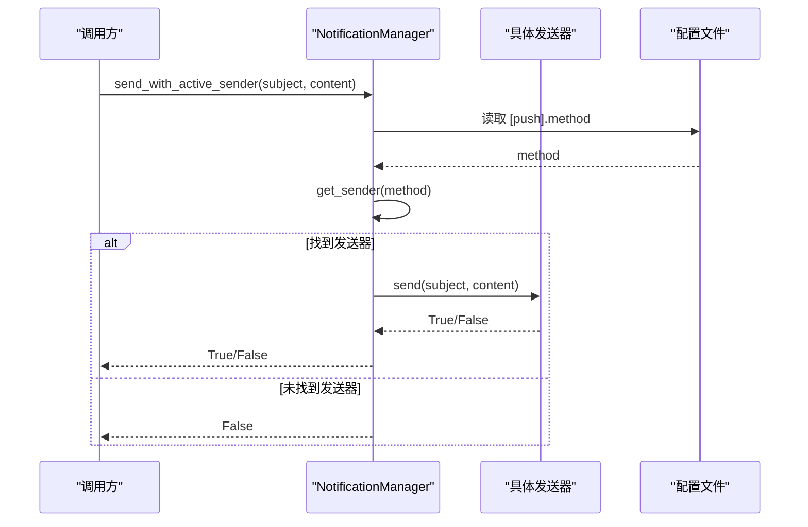
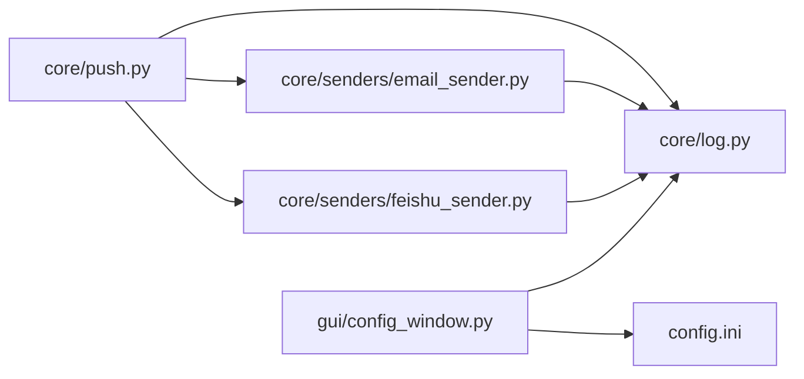

# 推送模块开发

<cite>
**本文引用的文件**
- [core/push.py](file://core/push.py)
- [core/senders/email_sender.py](file://core/senders/email_sender.py)
- [core/senders/feishu_sender.py](file://core/senders/feishu_sender.py)
- [core/senders/__init__.py](file://core/senders/__init__.py)
- [core/log.py](file://core/log.py)
- [gui/config_window.py](file://gui/config_window.py)
- [config.ini](file://config.ini)
- [config.md](file://config.md)
- [developer_tools/EXTENSION_GUIDE.md](file://developer_tools/EXTENSION_GUIDE.md)
- [generate_config.py](file://generate_config.py)
</cite>

## 目录
1. [简介](#简介)
2. [项目结构](#项目结构)
3. [核心组件](#核心组件)
4. [架构总览](#架构总览)
5. [详细组件分析](#详细组件分析)
6. [依赖关系分析](#依赖关系分析)
7. [性能考量](#性能考量)
8. [故障排查指南](#故障排查指南)
9. [结论](#结论)
10. [附录](#附录)

## 简介
本文件面向希望为 Capture_Push 系统开发“推送发送器”的开发者，系统性讲解如何实现新的推送发送器模块，包括：
- 发送器类的实现规范（send 方法、参数与返回值约定）
- 在 NotificationManager 中的注册流程与异常处理
- 配置文件扩展（INI 节与 GUI 适配）
- 日志记录、错误处理与依赖管理的最佳实践
- 完整示例：如何创建自定义推送发送器（如钉钉、企业微信）

## 项目结构
推送模块位于 core/push.py，具体发送器实现位于 core/senders/ 目录；配置文件 config.ini 与 GUI 界面 gui/config_window.py 共同驱动推送功能的启用与参数配置。

图表来源
- [core/push.py](file://core/push.py#L1-L319)
- [core/senders/email_sender.py](file://core/senders/email_sender.py#L1-L144)
- [core/senders/feishu_sender.py](file://core/senders/feishu_sender.py#L1-L110)
- [core/senders/__init__.py](file://core/senders/__init__.py#L1-L10)
- [core/log.py](file://core/log.py#L1-L211)
- [gui/config_window.py](file://gui/config_window.py#L1-L537)
- [config.ini](file://config.ini#L1-L36)
- [config.md](file://config.md#L1-L52)
- [developer_tools/EXTENSION_GUIDE.md](file://developer_tools/EXTENSION_GUIDE.md#L1-L102)

章节来源
- [core/push.py](file://core/push.py#L1-L319)
- [core/senders/email_sender.py](file://core/senders/email_sender.py#L1-L144)
- [core/senders/feishu_sender.py](file://core/senders/feishu_sender.py#L1-L110)
- [core/senders/__init__.py](file://core/senders/__init__.py#L1-L10)
- [core/log.py](file://core/log.py#L1-L211)
- [gui/config_window.py](file://gui/config_window.py#L1-L537)
- [config.ini](file://config.ini#L1-L36)
- [config.md](file://config.md#L1-L52)
- [developer_tools/EXTENSION_GUIDE.md](file://developer_tools/EXTENSION_GUIDE.md#L1-L102)

## 核心组件
- 抽象基类与管理器
  - NotificationSender：定义统一的 send(subject, content) 接口，返回布尔值表示发送是否成功。
  - NotificationManager：集中管理发送器注册、激活、发送与可用列表查询。
- 配置与方法读取
  - get_push_method()/is_push_enabled()：从配置文件读取当前启用的推送方式。
- 消息格式化
  - 提供多类消息格式化函数（成绩变化、全部成绩、课表、完整课表），便于直接发送。
- 全局实例
  - notification_manager：全局通知管理器，贯穿系统使用。

章节来源
- [core/push.py](file://core/push.py#L56-L163)

## 架构总览
推送模块采用“抽象接口 + 管理器 + 具体实现”的分层设计：
- 抽象层：NotificationSender 规范所有发送器的接口。
- 管理层：NotificationManager 负责注册、选择与调用发送器。
- 实现层：各发送器（邮件、飞书等）实现 send() 并读取配置。
- 配置层：config.ini 通过 [push] 节控制启用方式；GUI 提供可视化配置入口。
- 日志层：统一日志初始化与文件轮转，便于排障。

图表来源
- [core/push.py](file://core/push.py#L56-L163)
- [core/senders/email_sender.py](file://core/senders/email_sender.py#L47-L144)
- [core/senders/feishu_sender.py](file://core/senders/feishu_sender.py#L42-L110)

## 详细组件分析

### 发送器类实现规范
- 必须实现的方法
  - send(subject, content)：接收主题与内容，返回布尔值表示成功与否。
- 参数规范
  - subject：字符串，消息主题。
  - content：字符串，消息正文（可为纯文本或 HTML 文本）。
- 返回值约定
  - True：发送成功。
  - False：发送失败（包含网络异常、认证失败、配置缺失等情况）。
- 最佳实践
  - 使用统一日志模块记录关键步骤与异常。
  - 通过 core.log.get_config_path() 获取配置文件路径，保证打包后也能正确读取。
  - 对敏感配置（如授权码）进行最小暴露，避免明文打印。

章节来源
- [core/push.py](file://core/push.py#L56-L71)
- [core/log.py](file://core/log.py#L60-L82)

### NotificationManager 注册流程与异常处理
- 自动注册
  - 在构造函数中调用 _register_available_senders()，自动注册内置发送器（如 email、feishu）。
- 手动注册
  - register_sender(name, sender)：将新发送器加入管理器。
- 异常处理
  - 注册失败时记录警告日志，不影响其他发送器。
  - 获取活跃发送器时，若配置的 method 未注册或不可用，记录错误并返回空。
- 可用发送器列表
  - get_available_senders() 返回当前已注册的发送器名称列表。

章节来源
- [core/push.py](file://core/push.py#L74-L160)

### 发送流程与消息格式化
- 发送流程
  - 通过 send_with_active_sender(subject, content) 获取当前活跃发送器并调用其 send()。
  - 若未启用推送（method=none），则直接返回 False。
- 消息格式化
  - 提供多类格式化函数，便于直接发送：
    - 成绩变化：format_grade_changes(changed)
    - 全部成绩：format_all_grades(grades)
    - 今日/明日/完整学期课表：format_schedule()/format_full_schedule()

图表来源
- [core/push.py](file://core/push.py#L107-L155)
- [config.ini](file://config.ini#L23-L24)

章节来源
- [core/push.py](file://core/push.py#L138-L155)

### 配置文件扩展方法
- INI 配置节
  - [push]：method 控制启用的推送方式（如 none、email、feishu、dingtalk 等）。
  - [email]/[feishu]：对应发送器的配置节，包含必要的连接参数。
  - config.md 提供了各节的详细说明与参数含义。
- GUI 界面适配
  - gui/config_window.py 中的 create_push_tab() 提供推送方式的单选按钮与对应配置项输入框。
  - save_config() 将用户输入写回配置文件，并在保存前进行 Outlook 邮箱的提示校验。
- 扩展新发送器的步骤
  - 在 core/senders/ 下创建发送器文件并实现 send()。
  - 在 NotificationManager._register_available_senders() 中注册该发送器。
  - 在 config.ini 中添加对应配置节，并在 GUI 中添加相应控件与保存逻辑。
  - 参考 developer_tools/EXTENSION_GUIDE.md 的完整流程。

章节来源
- [config.ini](file://config.ini#L23-L35)
- [config.md](file://config.md#L19-L51)
- [gui/config_window.py](file://gui/config_window.py#L156-L205)
- [gui/config_window.py](file://gui/config_window.py#L351-L396)
- [developer_tools/EXTENSION_GUIDE.md](file://developer_tools/EXTENSION_GUIDE.md#L7-L57)

### 具体发送器实现示例

#### 邮件发送器（EmailSender）
- 关键点
  - 读取 [email] 配置节，校验 SMTP、端口、发件人、收件人、授权码。
  - 根据端口选择 SMTP_SSL 或 starttls 加密。
  - Outlook/Hotmail 等邮箱因基本认证被禁用，会拒绝发送并提示更换邮箱。
- 错误处理
  - 配置缺失、认证失败、网络异常均返回 False 并记录日志。

章节来源
- [core/senders/email_sender.py](file://core/senders/email_sender.py#L37-L144)

#### 飞书发送器（FeishuSender）
- 关键点
  - 读取 [feishu] 配置节，支持可选密钥生成签名。
  - 使用 Webhook URL 发送 text 类型消息，带超时控制。
- 错误处理
  - 请求异常、响应 code 非 0 均视为失败并返回 False。

章节来源
- [core/senders/feishu_sender.py](file://core/senders/feishu_sender.py#L42-L110)

### 创建自定义推送发送器（以“钉钉”为例）
以下为创建“钉钉”发送器的完整步骤与要点（不包含具体代码内容）：
- 步骤
  - 在 core/senders/ 下创建 dingtalk_sender.py，实现 send(subject, content)。
  - 在 send() 中读取 [dingtalk] 配置节（如 webhook_url、secret 等）。
  - 使用 requests 发送消息，遵循钉钉 Webhook 协议。
  - 在 NotificationManager._register_available_senders() 中注册 "dingtalk" 发送器。
  - 在 config.ini 中添加 [dingtalk] 节，并在 GUI 的 create_push_tab() 中添加对应控件与保存逻辑。
- 参数与返回值
  - send(subject, content)：返回布尔值表示发送是否成功。
- 日志与异常
  - 使用统一日志模块记录关键步骤与异常。
  - 对配置缺失、网络异常、HTTP 错误等进行捕获并返回 False。

章节来源
- [developer_tools/EXTENSION_GUIDE.md](file://developer_tools/EXTENSION_GUIDE.md#L13-L57)
- [core/push.py](file://core/push.py#L83-L96)
- [config.ini](file://config.ini#L23-L24)
- [gui/config_window.py](file://gui/config_window.py#L156-L205)

## 依赖关系分析
- 模块耦合
  - core/push.py 依赖 core/log.py 获取配置路径与初始化日志。
  - 各发送器实现依赖 core/log.py 与 configparser 读取配置。
  - GUI 依赖 core/log.py 获取配置路径，并将用户输入写回配置文件。
- 外部依赖
  - requests（飞书发送器）、smtplib（邮件发送器）。
- 潜在风险
  - 发送器注册失败不应影响其他发送器；管理器应具备容错能力。
  - 配置文件路径需通过统一接口获取，避免打包后路径异常。

图表来源
- [core/push.py](file://core/push.py#L1-L319)
- [core/senders/email_sender.py](file://core/senders/email_sender.py#L1-L144)
- [core/senders/feishu_sender.py](file://core/senders/feishu_sender.py#L1-L110)
- [core/log.py](file://core/log.py#L1-L211)
- [gui/config_window.py](file://gui/config_window.py#L1-L537)
- [config.ini](file://config.ini#L1-L36)

章节来源
- [core/push.py](file://core/push.py#L1-L319)
- [core/senders/email_sender.py](file://core/senders/email_sender.py#L1-L144)
- [core/senders/feishu_sender.py](file://core/senders/feishu_sender.py#L1-L110)
- [core/log.py](file://core/log.py#L1-L211)
- [gui/config_window.py](file://gui/config_window.py#L1-L537)
- [config.ini](file://config.ini#L1-L36)

## 性能考量
- 发送器并发
  - 当前管理器未内置并发控制，建议在调用方控制并发或在发送器内部做限流。
- 网络请求
  - 飞书发送器设置了 10 秒超时，建议根据网络状况调整。
- 日志开销
  - 统一日志系统已做文件轮转与清理，避免磁盘占用过大。

## 故障排查指南
- 常见问题与定位
  - 配置缺失：检查 [push]、[email]、[feishu] 等节是否存在与参数是否完整。
  - 认证失败：邮件发送器对 Outlook/Hotmail 等邮箱拒绝基本认证，需更换邮箱或使用应用密码。
  - 网络异常：检查 SMTP/HTTPS 可达性与代理设置。
  - 发送器未注册：确认在 NotificationManager._register_available_senders() 中已注册。
- 日志与报告
  - 使用 core/log.py 的 pack_logs() 打包日志，便于提交问题。
  - GUI 提供“崩溃上报”按钮一键生成报告。

章节来源
- [core/senders/email_sender.py](file://core/senders/email_sender.py#L78-L91)
- [core/senders/email_sender.py](file://core/senders/email_sender.py#L127-L143)
- [core/log.py](file://core/log.py#L18-L57)
- [gui/config_window.py](file://gui/config_window.py#L495-L513)

## 结论
通过抽象接口、集中管理与统一配置，Capture_Push 的推送模块实现了高扩展性与易维护性。开发者只需遵循 send() 接口规范、在管理器中注册并完善配置与 GUI，即可快速接入新的推送平台（如钉钉、企业微信等）。配合完善的日志与错误处理机制，能够有效提升系统的稳定性与可观测性。

## 附录
- 安装配置信息生成
  - generate_config.py 可生成安装配置信息文件，便于部署与运维。

章节来源
- [generate_config.py](file://generate_config.py#L18-L80)