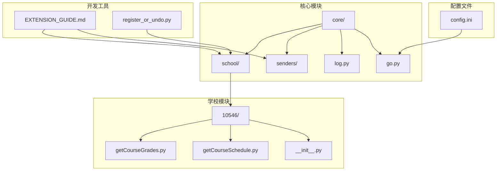
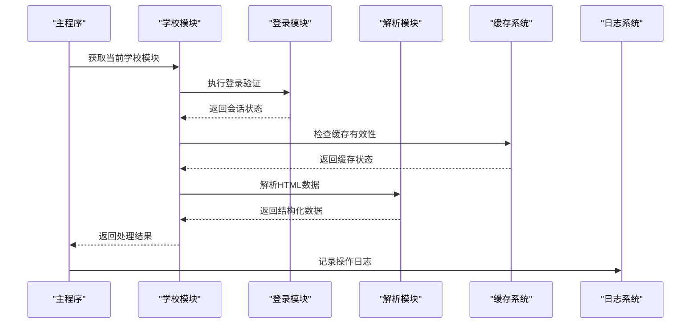
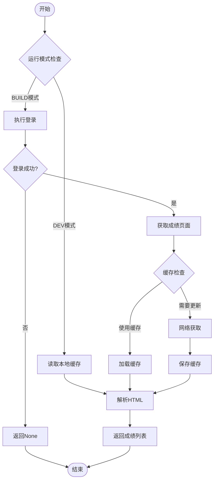
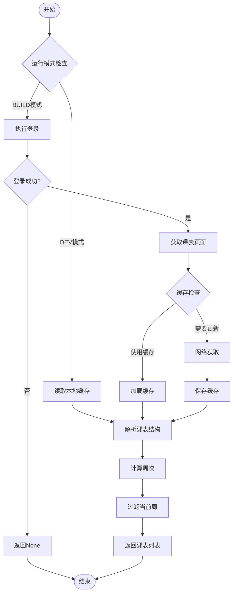
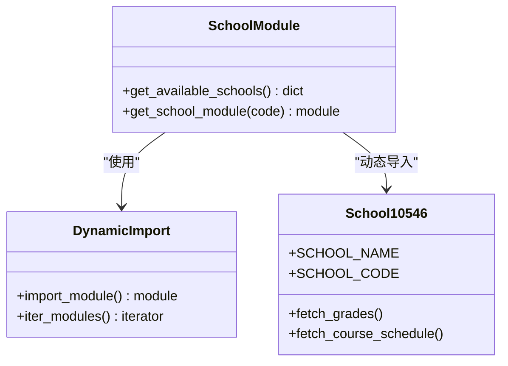
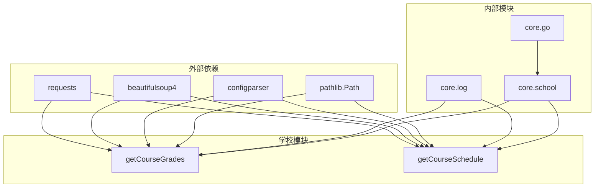

# 院校模块开发

<cite>
**本文档引用的文件**
- [core/school/__init__.py](file://core/school/__init__.py)
- [core/school/10546/__init__.py](file://core/school/10546/__init__.py)
- [core/school/10546/getCourseGrades.py](file://core/school/10546/getCourseGrades.py)
- [core/school/10546/getCourseSchedule.py](file://core/school/10546/getCourseSchedule.py)
- [core/log.py](file://core/log.py)
- [core/go.py](file://core/go.py)
- [config.ini](file://config.ini)
- [developer_tools/EXTENSION_GUIDE.md](file://developer_tools/EXTENSION_GUIDE.md)
- [developer_tools/register_or_undo.py](file://developer_tools/register_or_undo.py)
</cite>

## 目录
1. [简介](#简介)
2. [项目结构](#项目结构)
3. [核心组件](#核心组件)
4. [架构概览](#架构概览)
5. [详细组件分析](#详细组件分析)
6. [依赖关系分析](#依赖关系分析)
7. [性能考虑](#性能考虑)
8. [故障排除指南](#故障排除指南)
9. [结论](#结论)
10. [附录](#附录)

## 简介

本文档详细说明了如何为 Capture_Push 系统开发新的院校支持模块。Capture_Push 是一个用于从高校教务系统抓取成绩和课表数据的自动化工具，支持多种推送方式和多所院校的适配。

该系统采用模块化设计，通过动态导入机制支持不同院校的差异化实现。每个院校模块都实现了标准化的接口，确保系统的可扩展性和维护性。

## 项目结构

Capture_Push 采用清晰的层次化项目结构：



**图表来源**
- [core/school/__init__.py](file://core/school/__init__.py#L1-L28)
- [core/school/10546/__init__.py](file://core/school/10546/__init__.py#L1-L7)

**章节来源**
- [core/school/__init__.py](file://core/school/__init__.py#L1-L28)
- [core/school/10546/__init__.py](file://core/school/10546/__init__.py#L1-L7)

## 核心组件

### 院校模块接口规范

每个院校模块必须遵循以下接口规范：

#### 必需导出函数
- `fetch_grades(username, password, force_update=False)` - 获取成绩数据
- `fetch_course_schedule(username, password, force_update=False)` - 获取课表数据

#### 必需配置变量
- `SCHOOL_NAME` - 学校名称
- `SCHOOL_CODE` - 学校代码（通常为教育部代码）

#### 目录结构规范
```
core/school/
└── [学校代码]/
    ├── __init__.py          # 模块导出
    ├── getCourseGrades.py   # 成绩获取实现
    └── getCourseSchedule.py # 课表获取实现
```

**章节来源**
- [developer_tools/EXTENSION_GUIDE.md](file://developer_tools/EXTENSION_GUIDE.md#L70-L81)
- [core/school/10546/__init__.py](file://core/school/10546/__init__.py#L1-L7)

## 架构概览

系统采用插件化架构，通过动态模块导入实现多院校支持：



**图表来源**
- [core/go.py](file://core/go.py#L49-L57)
- [core/school/10546/getCourseGrades.py](file://core/school/10546/getCourseGrades.py#L278-L295)
- [core/school/10546/getCourseSchedule.py](file://core/school/10546/getCourseSchedule.py#L354-L371)

## 详细组件分析

### 成绩获取模块 (getCourseGrades)

#### 核心功能流程



**图表来源**
- [core/school/10546/getCourseGrades.py](file://core/school/10546/getCourseGrades.py#L117-L156)
- [core/school/10546/getCourseGrades.py](file://core/school/10546/getCourseGrades.py#L169-L230)

#### 数据结构规范

**成绩数据字段定义**：
- `课程名称` (字符串) - 必填
- `成绩` (字符串) - 必填  
- `学分` (字符串) - 可选
- `课程属性` (字符串) - 可选
- `学期` (字符串) - 必填

**章节来源**
- [developer_tools/EXTENSION_GUIDE.md](file://developer_tools/EXTENSION_GUIDE.md#L92-L94)
- [core/school/10546/getCourseGrades.py](file://core/school/10546/getCourseGrades.py#L248-L256)

### 课表获取模块 (getCourseSchedule)

#### 核心功能流程



**图表来源**
- [core/school/10546/getCourseSchedule.py](file://core/school/10546/getCourseSchedule.py#L118-L157)
- [core/school/10546/getCourseSchedule.py](file://core/school/10546/getCourseSchedule.py#L232-L315)

#### 数据结构规范

**课表数据字段定义**：
- `星期` (整数, 1-7) - 必填
- `开始小节` (整数) - 必填
- `结束小节` (整数) - 必填
- `课程名称` (字符串) - 必填
- `教师` (字符串) - 可选
- `教室` (字符串) - 可选
- `周次列表` (整数列表) - 必填

**章节来源**
- [developer_tools/EXTENSION_GUIDE.md](file://developer_tools/EXTENSION_GUIDE.md#L92-L94)
- [core/school/10546/getCourseSchedule.py](file://core/school/10546/getCourseSchedule.py#L300-L309)

### 模块注册与发现机制

#### 自动发现机制



**图表来源**
- [core/school/__init__.py](file://core/school/__init__.py#L6-L20)

#### 手动注册机制

虽然系统支持自动发现，但也可以通过手动注册的方式添加新模块：

**注册流程**：
1. 创建学校目录结构
2. 实现必需的接口函数
3. 在模块 `__init__.py` 中导出接口
4. 更新注册映射表

**章节来源**
- [core/school/__init__.py](file://core/school/__init__.py#L6-L27)
- [developer_tools/EXTENSION_GUIDE.md](file://developer_tools/EXTENSION_GUIDE.md#L83-L90)

## 依赖关系分析

### 核心依赖关系



**图表来源**
- [core/school/10546/getCourseGrades.py](file://core/school/10546/getCourseGrades.py#L1-L12)
- [core/school/10546/getCourseSchedule.py](file://core/school/10546/getCourseSchedule.py#L1-L12)

### 配置依赖

系统配置通过统一的配置管理系统管理：

**配置文件结构**：
- `[logging]` - 日志级别配置
- `[run_model]` - 运行模式（DEV/BUILD）
- `[account]` - 账号信息（学校代码、用户名、密码）
- `[semester]` - 学期信息（第一周周一）
- `[loop_getCourseGrades]` - 成绩循环检测配置
- `[loop_getCourseSchedule]` - 课表循环检测配置
- `[push]` - 推送方式配置
- `[email]` - 邮件推送配置
- `[feishu]` - 飞书推送配置

**章节来源**
- [config.ini](file://config.ini#L1-L36)

## 性能考虑

### 缓存策略

系统实现了智能缓存机制来优化性能：

1. **时间戳缓存**：每个模块维护独立的时间戳文件
2. **循环检测**：可配置的更新间隔
3. **DEV模式支持**：开发模式下可直接使用本地缓存
4. **自动清理**：定期清理过期日志文件

### 网络优化

1. **IPv4适配器**：强制使用IPv4连接
2. **超时控制**：统一的请求超时设置
3. **会话复用**：登录后复用会话状态
4. **条件请求**：基于缓存状态决定是否重新请求

### 内存管理

1. **增量处理**：避免一次性加载大量数据
2. **资源清理**：及时关闭文件句柄和网络连接
3. **异常处理**：确保资源正确释放

## 故障排除指南

### 常见问题及解决方案

#### 登录失败
- **症状**：返回 `None` 或登录页面包含错误信息
- **原因**：用户名密码错误、验证码、网络问题
- **解决**：检查账号信息、确认网络连接、查看日志文件

#### 缓存失效
- **症状**：获取到的数据与预期不符
- **原因**：缓存过期或损坏
- **解决**：使用 `--force` 参数强制刷新缓存

#### 解析错误
- **症状**：HTML解析失败或数据格式异常
- **原因**：网站结构调整或网络响应异常
- **解决**：更新解析逻辑、检查目标网站结构

#### 日志分析
系统提供统一的日志管理功能：
- 日志文件位于 `%LOCALAPPDATA%\Capture_Push\`
- 支持按日期命名的日志文件
- 自动清理过大的日志文件
- 提供崩溃报告打包功能

**章节来源**
- [core/log.py](file://core/log.py#L18-L57)
- [core/school/10546/getCourseGrades.py](file://core/school/10546/getCourseGrades.py#L90-L100)
- [core/school/10546/getCourseSchedule.py](file://core/school/10546/getCourseSchedule.py#L90-L101)

## 结论

Capture_Push 的院校模块开发体系提供了高度的可扩展性和维护性。通过标准化的接口规范、智能的缓存机制和完善的错误处理，开发者可以快速为新的院校创建支持模块。

关键成功因素包括：
1. 严格遵循接口规范
2. 实现健壮的错误处理
3. 合理使用缓存机制
4. 提供详细的日志记录
5. 考虑网络和性能优化

## 附录

### 开发最佳实践

#### 代码组织
- 保持模块职责单一
- 使用清晰的函数命名
- 添加必要的注释和文档字符串
- 遵循PEP8编码规范

#### 测试策略
- 单元测试：验证核心算法和数据处理
- 集成测试：验证模块间交互
- 回归测试：确保更新不影响现有功能
- 性能测试：评估缓存效果和网络性能

#### 部署考虑
- 版本兼容性：确保向后兼容
- 依赖管理：明确第三方库需求
- 配置管理：提供灵活的配置选项
- 监控告警：建立完善的监控机制

### 示例实现要点

参考现有的 `10546` 模块实现，新模块应该包含：

1. **标准接口实现**：完整的 `fetch_grades` 和 `fetch_course_schedule` 函数
2. **配置管理**：使用统一的配置文件路径
3. **日志记录**：完整的操作日志
4. **错误处理**：全面的异常捕获和处理
5. **缓存机制**：智能的缓存策略
6. **网络优化**：高效的网络请求处理

通过遵循这些指导原则，开发者可以创建高质量的院校模块，为 Capture_Push 系统增加新的支持院校。