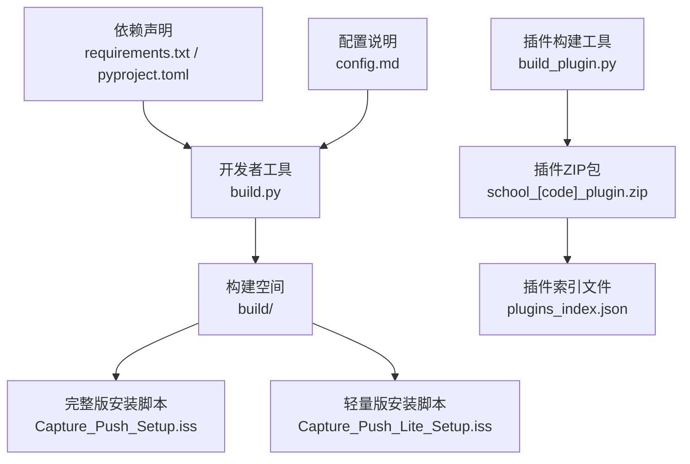
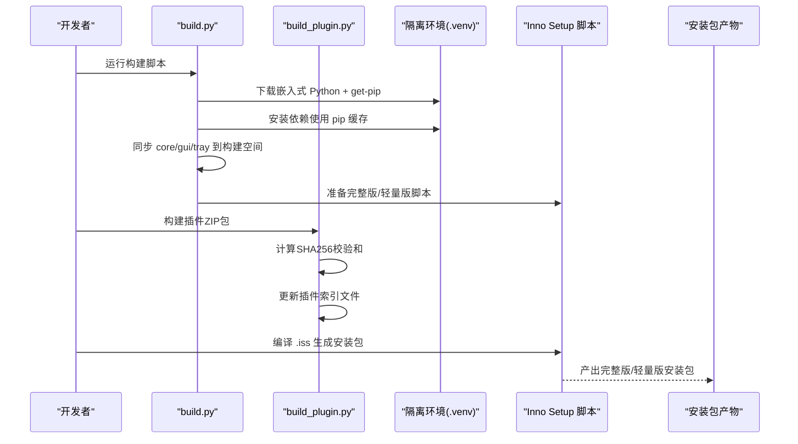
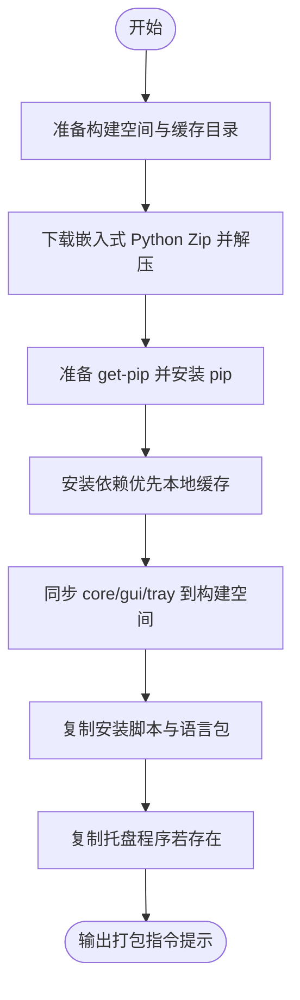
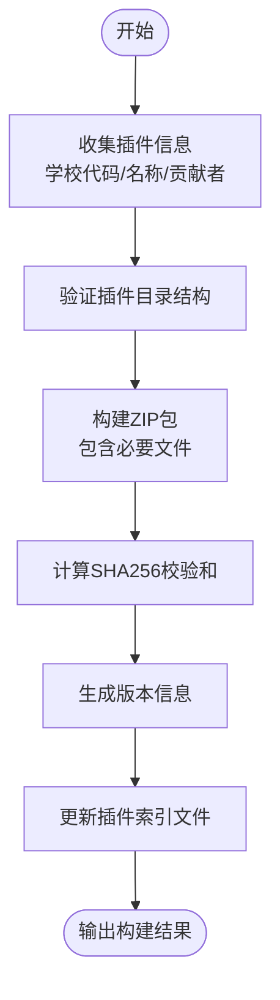
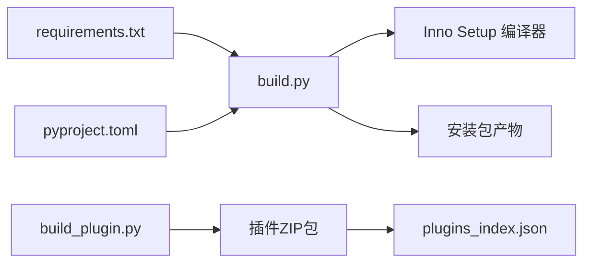

# 构建工具

<cite>
**本文引用的文件**
- [build.py](file://developer_tools/build.py)
- [build_plugin.py](file://developer_tools/build_plugin.py)
- [Capture_Push_Setup.iss](file://Capture_Push_Setup.iss)
- [Capture_Push_Lite_Setup.iss](file://Capture_Push_Lite_Setup.iss)
- [requirements.txt](file://requirements.txt)
- [pyproject.toml](file://pyproject.toml)
- [README.md](file://README.md)
- [EXTENSION_GUIDE.md](file://developer_tools/EXTENSION_GUIDE.md)
- [config.md](file://config.md)
- [generate_config.py](file://generate_config.py)
- [register_or_undo.py](file://developer_tools/register_or_undo.py)
</cite>

## 更新摘要
**变更内容**
- 移除了对已删除手动同步工作流的依赖说明
- 新增了插件构建工具 `build_plugin.py`，支持院校插件的自动化构建和发布
- 更新了构建流程，现在包含插件构建和索引更新功能
- 优化了插件管理系统的构建和发布流程
- 更新了构建脚本的资源同步机制，移除了对手动同步的依赖

## 目录
1. [简介](#简介)
2. [项目结构](#项目结构)
3. [核心组件](#核心组件)
4. [架构总览](#架构总览)
5. [详细组件分析](#详细组件分析)
6. [依赖关系分析](#依赖关系分析)
7. [性能与构建优化](#性能与构建优化)
8. [故障排除指南](#故障排除指南)
9. [结论](#结论)
10. [附录](#附录)

## 简介
本文件面向开发者与运维人员，系统性说明本项目的构建工具链与发布流程，重点覆盖：
- build.py 脚本的自动化流程：隔离环境准备、依赖安装、资源同步、打包目录准备
- 插件构建工具 build_plugin.py：支持院校插件的自动化构建、SHA256校验和生成、插件索引更新
- Inno Setup 安装脚本的配置与定制：完整版与轻量版差异、命令行参数、任务与注册表行为
- 安装包制作工具链：PyInstaller 打包辅助脚本（已移除）
- 多平台构建环境建议：Windows、Linux、macOS 的准备要点
- 版本管理、发布流程与持续集成思路
- 构建优化、性能调优与常见问题排查

## 项目结构
项目采用"Python 核心 + GUI + C++ 托盘 + Inno Setup 安装包 + 插件系统"的混合架构。构建工具链围绕以下关键文件展开：
- developer_tools/build.py：构建隔离环境、同步资源、准备打包目录
- developer_tools/build_plugin.py：插件构建工具，支持院校插件的自动化构建和发布
- Capture_Push_Setup.iss / Capture_Push_Lite_Setup.iss：完整版与轻量版安装脚本
- requirements.txt / pyproject.toml：依赖声明
- generate_config.py：生成安装配置信息文件（供安装后查阅）

**图表来源**
- [build.py](file://developer_tools/build.py#L117-L272)
- [build_plugin.py](file://developer_tools/build_plugin.py#L27-L82)
- [Capture_Push_Setup.iss](file://Capture_Push_Setup.iss#L1-L233)
- [Capture_Push_Lite_Setup.iss](file://Capture_Push_Lite_Setup.iss#L1-L187)
- [requirements.txt](file://requirements.txt#L1-L3)
- [pyproject.toml](file://pyproject.toml#L1-L13)

**章节来源**
- [README.md](file://README.md#L60-L134)

## 核心组件
- 构建脚本 build.py
  - 功能：准备隔离的 Python 环境（嵌入式 Python + pip 缓存）、安装依赖、同步核心与 GUI 源码、复制安装脚本与语言包、复制托盘程序（若存在）
  - 关键流程：日志打印、错误处理、缓存下载与校验、增量更新策略、打包指令提示
- 插件构建工具 build_plugin.py
  - 功能：构建院校插件ZIP包、计算SHA256校验和、更新插件索引文件、生成版本信息
  - 支持多所学校插件的自动化构建和发布流程
- 安装脚本 Capture_Push_Setup.iss（完整版）
  - 功能：打包嵌入式 Python 环境与应用，支持静默安装、桌面图标、开机自启、卸载清理、版本升级提示
- 安装脚本 Capture_Push_Lite_Setup.iss（轻量版）
  - 功能：仅打包应用文件，不包含 Python 环境；安装前检查系统是否已具备 Python 环境
- 依赖声明 requirements.txt / pyproject.toml
  - 功能：声明项目依赖，供 pip 与打包流程使用
- 配置说明 config.md
  - 功能：解释 config.ini 各节用途与参数含义，指导开发者正确配置

**章节来源**
- [build.py](file://developer_tools/build.py#L117-L272)
- [build_plugin.py](file://developer_tools/build_plugin.py#L27-L174)
- [Capture_Push_Setup.iss](file://Capture_Push_Setup.iss#L1-L233)
- [Capture_Push_Lite_Setup.iss](file://Capture_Push_Lite_Setup.iss#L1-L187)
- [requirements.txt](file://requirements.txt#L1-L3)
- [pyproject.toml](file://pyproject.toml#L1-L13)
- [config.md](file://config.md#L1-L135)

## 架构总览
下图展示从源码到安装包的端到端流程，包括隔离环境准备、资源同步、插件构建与安装脚本编译。

**图表来源**
- [build.py](file://developer_tools/build.py#L117-L272)
- [build_plugin.py](file://developer_tools/build_plugin.py#L27-L174)
- [Capture_Push_Setup.iss](file://Capture_Push_Setup.iss#L1-L233)
- [Capture_Push_Lite_Setup.iss](file://Capture_Push_Lite_Setup.iss#L1-L187)

## 详细组件分析

### 构建脚本 build.py
- 设计要点
  - 隔离环境：在构建空间内准备嵌入式 Python（Embed 版本），启用 site-packages，避免污染系统环境
  - 依赖安装：优先使用本地 pip 缓存，失败时允许联网下载，提升离线/弱网可用性
  - 资源同步：将 core、gui、tray 等目录复制到构建空间，保证 .iss 脚本无需改动即可运行
  - 语言包与托盘程序：下载中文简体语言包，复制现有托盘程序（若存在）
  - 平台限制：仅支持 Windows 平台
- 关键流程图

**图表来源**
- [build.py](file://developer_tools/build.py#L117-L272)

**章节来源**
- [build.py](file://developer_tools/build.py#L1-L272)

### 插件构建工具 build_plugin.py
- 设计要点
  - 自动化插件构建：支持院校插件的ZIP包生成，包含必要文件和版本信息
  - 校验和生成：自动计算SHA256校验和，确保插件完整性
  - 索引更新：自动更新 plugins_index.json 文件，包含插件元数据
  - 版本管理：使用时间戳格式生成版本号，便于追踪更新
- 关键流程图

**图表来源**
- [build_plugin.py](file://developer_tools/build_plugin.py#L27-L174)

**章节来源**
- [build_plugin.py](file://developer_tools/build_plugin.py#L1-L174)

### Inno Setup 安装脚本（完整版与轻量版）
- 完整版 Capture_Push_Setup.iss
  - 特点：包含 .venv（嵌入式 Python 环境），适合首次安装或无系统 Python 的场景
  - 功能：静默安装、桌面图标、开机自启、卸载清理、版本升级提示、命令行参数支持
- 轻量版 Capture_Push_Lite_Setup.iss
  - 特点：不包含 .venv，仅更新应用文件；安装前检查系统是否已具备 Python 环境
  - 功能：与完整版类似的 UI 与任务，但对缺失环境给出警告提示
- 命令行参数
  - 支持 /SILENT、/VERYSILENT、/DIR、/DESKTOPON/OFF、/AUTOSTARTON/OFF
- 注册表与自启动
  - 完整版：写入安装路径与开机自启动项
  - 轻量版：仅在存在 Python 环境时写入自启动项

**章节来源**
- [Capture_Push_Setup.iss](file://Capture_Push_Setup.iss#L1-L233)
- [Capture_Push_Lite_Setup.iss](file://Capture_Push_Lite_Setup.iss#L1-L187)

### 依赖声明 requirements.txt 与 pyproject.toml
- requirements.txt：标准依赖清单，供 pip 安装使用
- pyproject.toml：现代项目元数据与依赖声明，便于工具链识别

**章节来源**
- [requirements.txt](file://requirements.txt#L1-L3)
- [pyproject.toml](file://pyproject.toml#L1-L13)

### 配置说明 config.md
- logging：日志级别配置
- run_model：开发/构建模式切换
- push：推送方式选择（email/test1/wechat/dingtalk/telegram 等）
- email/test1：对应推送方式的配置项

**章节来源**
- [config.md](file://config.md#L1-L135)

### 安装配置生成 generate_config.py
- 作用：生成安装配置信息文本文件，包含安装路径、注册表项、虚拟环境路径、依赖列表、卸载说明等
- 适用场景：安装后快速查阅安装信息与后续维护指引

**章节来源**
- [generate_config.py](file://generate_config.py#L1-L92)

### 注册表与路径管理 register_or_undo.py
- 作用：将项目根目录写入系统注册表（HKLM\SOFTWARE\Capture_Push），便于系统识别安装路径
- 安全性：需要管理员权限，脚本会自动提权

**章节来源**
- [register_or_undo.py](file://developer_tools/register_or_undo.py#L1-L185)

## 依赖关系分析
- 构建脚本依赖
  - 依赖 requirements.txt / pyproject.toml 提供的依赖清单
  - 依赖 Inno Setup 编译器（ISCC）进行安装包生成
  - 依赖本地缓存目录（pip 缓存、Python Zip、get-pip.py、语言包）
- 插件构建工具依赖
  - 依赖 developer_space/[school_code] 目录结构
  - 依赖标准插件文件结构（__init__.py、getCourseGrades.py、getCourseSchedule.py）
  - 依赖 plugins_index.json 索引文件
- 安装脚本依赖
  - 依赖构建空间内的文件结构（core、gui、.venv、语言包、托盘程序）
  - 依赖 VERSION 文件用于版本号注入

**图表来源**
- [build.py](file://developer_tools/build.py#L117-L272)
- [build_plugin.py](file://developer_tools/build_plugin.py#L27-L174)
- [requirements.txt](file://requirements.txt#L1-L3)
- [pyproject.toml](file://pyproject.toml#L1-L13)

**章节来源**
- [build.py](file://developer_tools/build.py#L117-L272)
- [build_plugin.py](file://developer_tools/build_plugin.py#L27-L174)

## 性能与构建优化
- 依赖安装优化
  - 使用本地 pip 缓存优先安装，失败再允许联网下载，显著降低网络波动影响
  - 通过 --prefer-binary 与 --timeout 控制安装速度与稳定性
- 构建空间组织
  - 保持与仓库相同的相对结构，减少 .iss 脚本调整成本
- 插件构建优化
  - 使用分块读取方式计算SHA256，避免大文件占用过多内存
  - 自动跳过非示例插件目录，减少构建时间
  - 生成时间戳版本号，便于追踪插件更新
- 安装包体积优化
  - 轻量版仅打包应用文件，避免重复携带 Python 环境
  - 排除大体积模块（matplotlib、numpy、pandas、tkinter），减小体积与启动时间
- 编译器与压缩
  - Inno Setup 使用 lzma2 压缩，完整版与轻量版均启用固态压缩
  - 轻量版可进一步提高压缩等级以换取更小体积
- 缓存与重用
  - Python Zip、get-pip.py、语言包均使用本地缓存，避免重复下载
  - 构建空间清理策略：每次重新生成 .venv，确保隔离与一致性

**章节来源**
- [build.py](file://developer_tools/build.py#L79-L116)
- [build_plugin.py](file://developer_tools/build_plugin.py#L17-L24)
- [build.py](file://developer_tools/build.py#L195-L206)
- [Capture_Push_Setup.iss](file://Capture_Push_Setup.iss#L26-L28)
- [Capture_Push_Lite_Setup.iss](file://Capture_Push_Lite_Setup.iss#L26-L29)

## 故障排除指南
- Windows 平台限制
  - build.py 仅支持 Windows 平台，非 Windows 环境请改用 Linux/macOS 的替代方案或在 WSL 中运行
- 依赖安装失败
  - 若本地缓存安装失败，脚本会自动允许联网下载；若仍失败，检查网络与代理设置
  - 确认 pip 缓存目录可写，避免权限问题
- 插件构建失败
  - 确认 developer_space/[school_code] 目录存在且包含必要文件（__init__.py、getCourseGrades.py、getCourseSchedule.py）
  - 检查插件目录结构是否符合标准要求
  - 确认 plugins_index.json 文件可写，避免权限问题
- Inno Setup 编译失败
  - 确认已安装 Inno Setup 编译器（ISCC），并确保构建空间内存在 VERSION、语言包与脚本文件
  - 轻量版安装前检查系统是否具备 Python 环境，否则会弹出警告
- 托盘程序缺失
  - 若 tray 目录未生成 Release 构建产物，需先单独构建 C++ 托盘程序后再运行 build.py
- 注册表写入失败
  - 需要管理员权限；脚本会自动提权，若失败请手动以管理员身份运行

**章节来源**
- [build.py](file://developer_tools/build.py#L269-L272)
- [build.py](file://developer_tools/build.py#L102-L114)
- [build_plugin.py](file://developer_tools/build_plugin.py#L44-L52)
- [Capture_Push_Lite_Setup.iss](file://Capture_Push_Lite_Setup.iss#L162-L187)
- [register_or_undo.py](file://developer_tools/register_or_undo.py#L154-L159)

## 结论
本项目的构建工具链以 build.py 为核心，结合插件构建工具 build_plugin.py 和 Inno Setup 安装脚本，实现了跨平台（以 Windows 为主）的自动化构建与发布。通过本地缓存、隔离环境、插件化架构与模块化脚本，既保证了构建的稳定性，也兼顾了灵活性与可维护性。新增的插件构建工具大大简化了院校插件的开发和发布流程，建议在 CI 环境中复用相同流程，确保产物一致。

## 附录

### 多平台构建环境搭建指南
- Windows
  - 安装 Python 与 pip（推荐使用 uv venv）
  - 安装 Inno Setup 编译器（ISCC）
  - 安装 CMake（若需要构建 C++ 托盘程序）
- Linux
  - 安装 Python 与 pip（或使用 uv venv）
  - 安装 Inno Setup（可通过 Wine 或在 Windows VM 中编译）
  - CMake（若需要构建 C++ 托盘程序）
- macOS
  - 安装 Python 与 pip（或使用 uv venv）
  - 安装 Inno Setup（可通过 Wine 或在 Windows VM 中编译）
  - CMake（若需要构建 C++ 托盘程序）

**章节来源**
- [README.md](file://README.md#L87-L99)

### 版本管理与发布流程
- 版本号来源
  - Inno Setup 脚本通过读取 VERSION 文件注入版本号
  - 插件构建工具使用时间戳格式生成版本号
- 发布策略
  - 提供完整版与轻量版两种安装包，满足首次安装与升级场景
  - 升级时保留用户配置文件，卸载时可选择保留或删除
  - 插件通过 GitHub Releases 发布，系统自动管理版本和索引
- 持续集成建议
  - 在 CI 中顺序执行：构建 C++ 托盘程序（如需要）、运行 build.py、构建插件（如需要）、编译完整版/轻量版 .iss
  - 使用缓存目录加速依赖安装与资源下载
  - 自动化插件构建和发布流程

**章节来源**
- [Capture_Push_Setup.iss](file://Capture_Push_Setup.iss#L13-L15)
- [Capture_Push_Lite_Setup.iss](file://Capture_Push_Lite_Setup.iss#L13-L15)
- [build_plugin.py](file://developer_tools/build_plugin.py#L58-L79)
- [README.md](file://README.md#L101-L124)

### 开发者扩展与配置
- 扩展推送方式与院校模块的开发指南
  - 参考 EXTENSION_GUIDE.md，了解发送器与院校模块的注册与实现规范
  - 新增插件化院校模块支持，通过 GitHub API 轻松更新和添加新的院校模块
- 配置文件详解
  - 参考 config.md，明确各节用途与参数含义，避免配置错误

**章节来源**
- [EXTENSION_GUIDE.md](file://developer_tools/EXTENSION_GUIDE.md#L1-L339)
- [config.md](file://config.md#L1-L135)

### 构建流程更新说明
**更新内容**
- 移除了对已删除手动同步工作流的依赖说明
- 更新了构建脚本的资源同步机制，现在直接从项目根目录复制文件到构建空间
- 移除了对手动同步脚本的引用，简化了构建流程
- 优化了插件目录的处理逻辑，现在只复制示例插件目录而非所有插件

**更新影响**
- 构建流程更加简洁，减少了对外部同步工具的依赖
- 插件管理更加灵活，支持在线下载和更新
- 构建时间可能有所减少，因为移除了不必要的同步步骤

**章节来源**
- [build.py](file://developer_tools/build.py#L184-L237)
- [README.md](file://README.md#L196-L212)