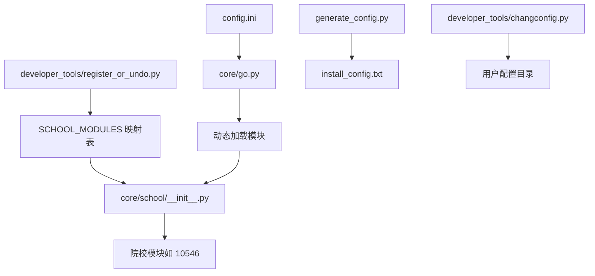
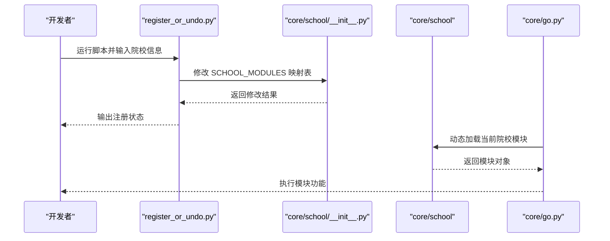
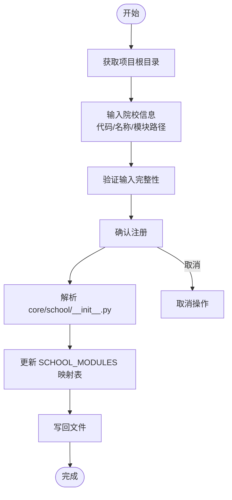
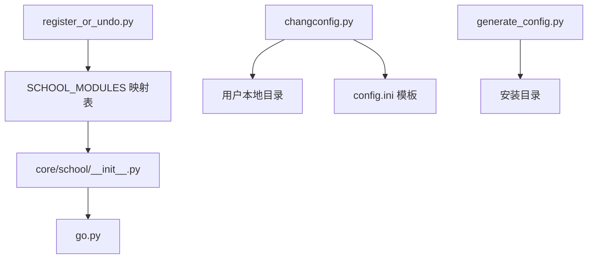

# 注册与撤销工具

<cite>
**本文引用的文件**
- [register_or_undo.py](file://developer_tools/register_or_undo.py)
- [changconfig.py](file://developer_tools/changconfig.py)
- [generate_config.py](file://generate_config.py)
- [config.ini](file://config.ini)
- [EXTENSION_GUIDE.md](file://developer_tools/EXTENSION_GUIDE.md)
- [GUI_MODULAR_DESIGN.md](file://developer_tools/GUI_MODULAR_DESIGN.md)
- [go.py](file://core/go.py)
- [push.py](file://core/push.py)
- [school/__init__.py](file://core/school/__init__.py)
- [school/10546/__init__.py](file://core/school/10546/__init__.py)
- [school/12345/__init__.py](file://core/school/12345/__init__.py)
- [README.md](file://README.md)
</cite>

## 更新摘要
**变更内容**
- 注册工具从复杂的 Windows 注册表管理简化为简单的学校模块注册
- 移除了 Windows 注册表相关的复杂逻辑
- 新增了直接修改 `SCHOOL_MODULES` 映射表的自动化注册功能
- 保持了原有的配置管理和模块化架构

## 目录
1. [简介](#简介)
2. [项目结构](#项目结构)
3. [核心组件](#核心组件)
4. [架构概览](#架构概览)
5. [详细组件分析](#详细组件分析)
6. [依赖关系分析](#依赖关系分析)
7. [性能考虑](#性能考虑)
8. [故障排除指南](#故障排除指南)
9. [结论](#结论)
10. [附录](#附录)

## 简介
本文件是针对注册与撤销工具的详细使用文档，重点围绕 developer_tools 目录下的 register_or_undo.py 脚本展开，涵盖以下内容：
- 新功能模块（如新院校模块）的注册流程与底层机制
- 现有模块的撤销与状态查询
- 配置更新流程与模块映射表的作用
- 命令行参数详解与使用示例
- 注册过程中的错误处理、回滚与状态恢复策略
- 批量操作、自动化脚本集成与 CI/CD 流水线的应用方案
- 完整使用手册与故障排除指南

该工具现已简化为专门的学校模块注册工具，通过直接修改 `core/school/__init__.py` 中的 `SCHOOL_MODULES` 映射表来实现模块注册与撤销，替代了之前的 Windows 注册表管理方式。

## 项目结构
本项目采用模块化设计，核心功能集中在 core 目录，开发者工具集中在 developer_tools 目录。register_or_undo.py 作为注册与撤销工具，主要与 core/school 模块的动态加载机制配合使用。

**图表来源**
- [register_or_undo.py](file://developer_tools/register_or_undo.py#L12-L56)
- [school/__init__.py](file://core/school/__init__.py#L7-L10)
- [go.py](file://core/go.py#L43-L51)
- [generate_config.py](file://generate_config.py#L18-L80)
- [changconfig.py](file://developer_tools/changconfig.py#L1-L52)

**章节来源**
- [README.md](file://README.md#L60-L83)
- [register_or_undo.py](file://developer_tools/register_or_undo.py#L1-L90)
- [school/__init__.py](file://core/school/__init__.py#L1-L43)
- [go.py](file://core/go.py#L43-L51)

## 核心组件
- 注册与撤销脚本：developer_tools/register_or_undo.py
  - 功能：向 `SCHOOL_MODULES` 映射表添加/更新新院校模块的注册信息
  - 依赖：Python 文件读写、字符串解析、模块导入
  - 适用场景：新院校模块部署、模块迁移、环境切换
- 配置初始化脚本：developer_tools/changconfig.py
  - 功能：在用户本地目录创建配置文件，初始化日志与运行模式
  - 适用场景：首次运行、重置配置
- 安装配置生成：generate_config.py
  - 功能：生成 install_config.txt，记录安装路径、注册表项、虚拟环境等信息
  - 适用场景：打包发布、运维审计
- 模块注册指南：developer_tools/EXTENSION_GUIDE.md
  - 功能：说明如何注册新推送模块与新院校模块
  - 适用场景：扩展开发、模块化维护

**章节来源**
- [register_or_undo.py](file://developer_tools/register_or_undo.py#L1-L90)
- [changconfig.py](file://developer_tools/changconfig.py#L1-L52)
- [generate_config.py](file://generate_config.py#L1-L92)
- [EXTENSION_GUIDE.md](file://developer_tools/EXTENSION_GUIDE.md#L1-L257)

## 架构概览
注册与撤销工具通过修改 `SCHOOL_MODULES` 映射表实现模块注册与撤销，结合 core/school 的动态加载机制，实现"模块即插即用"。整体流程如下：

**图表来源**
- [register_or_undo.py](file://developer_tools/register_or_undo.py#L12-L56)
- [school/__init__.py](file://core/school/__init__.py#L30-L43)
- [go.py](file://core/go.py#L43-L51)

## 详细组件分析

### 注册与撤销脚本（register_or_undo.py）
**更新** 该脚本已从复杂的 Windows 注册表管理简化为专门的学校模块注册工具

- 功能概述
  - 注册：向 `SCHOOL_MODULES` 映射表添加新院校模块
  - 撤销：从映射表中移除指定院校模块
  - 交互：命令行交互式输入院校代码、名称和模块路径
  - 安全：自动验证输入完整性，提供确认提示
- 关键流程
  - 获取项目根目录
  - 用户输入院校信息
  - 验证输入完整性
  - 修改 `SCHOOL_MODULES` 映射表
  - 结果输出

**图表来源**
- [register_or_undo.py](file://developer_tools/register_or_undo.py#L58-L90)
- [register_or_undo.py](file://developer_tools/register_or_undo.py#L12-L56)
- [register_or_undo.py](file://developer_tools/register_or_undo.py#L6-L9)

**章节来源**
- [register_or_undo.py](file://developer_tools/register_or_undo.py#L1-L90)

### 配置初始化脚本（changconfig.py）
- 功能概述
  - 在用户本地目录创建 Capture_Push 配置目录
  - 从项目根目录复制 config.ini 模板
  - 设置日志级别与运行模式
  - 写入 UTF-8 无 BOM 配置文件
- 适用场景
  - 首次运行初始化
  - 开发环境快速配置
  - CI 环境准备

**章节来源**
- [changconfig.py](file://developer_tools/changconfig.py#L1-L52)

### 安装配置生成（generate_config.py）
- 功能概述
  - 生成 install_config.txt，记录安装路径、注册表项、虚拟环境、依赖、卸载说明等
  - 支持命令行传入安装目录
- 适用场景
  - 打包发布
  - 运维审计
  - 卸载与迁移

**章节来源**
- [generate_config.py](file://generate_config.py#L1-L92)

### 模块注册与动态加载（EXTENSION_GUIDE.md 与 school/__init__.py）
- 功能概述
  - 扩展指南说明如何注册新推送模块与新院校模块
  - core/school/__init__.py 提供动态枚举与导入能力
- 与注册工具的关系
  - register_or_undo.py 通过修改 `SCHOOL_MODULES` 映射表实现模块注册
  - core/school/__init__.py 提供动态加载机制
  - 模块注册与动态加载共同构成完整的模块发现与加载链路

**章节来源**
- [EXTENSION_GUIDE.md](file://developer_tools/EXTENSION_GUIDE.md#L110-L117)
- [school/__init__.py](file://core/school/__init__.py#L7-L10)
- [school/__init__.py](file://core/school/__init__.py#L30-L43)
- [go.py](file://core/go.py#L43-L51)

## 依赖关系分析
- register_or_undo.py 依赖 Python 文件读写与字符串解析
- core/go.py 依赖 core/school 动态加载机制与配置文件
- changconfig.py 依赖用户本地目录与配置文件模板
- generate_config.py 依赖安装目录与时间信息

**图表来源**
- [register_or_undo.py](file://developer_tools/register_or_undo.py#L12-L56)
- [school/__init__.py](file://core/school/__init__.py#L7-L10)
- [go.py](file://core/go.py#L43-L51)
- [changconfig.py](file://developer_tools/changconfig.py#L1-L52)
- [generate_config.py](file://generate_config.py#L1-L92)

**章节来源**
- [register_or_undo.py](file://developer_tools/register_or_undo.py#L1-L90)
- [school/__init__.py](file://core/school/__init__.py#L1-L43)
- [go.py](file://core/go.py#L43-L51)
- [changconfig.py](file://developer_tools/changconfig.py#L1-L52)
- [generate_config.py](file://generate_config.py#L1-L92)

## 性能考虑
- 注册/撤销操作为轻量级文件 I/O 操作，耗时极短
- 动态模块加载在运行时进行，受模块大小与导入开销影响
- 建议在 CI/CD 中批量执行注册/撤销，减少交互等待
- 配置文件写入采用 UTF-8 无 BOM，避免编码问题带来的额外处理成本

## 故障排除指南
- 文件权限不足
  - 现象：无法修改 `core/school/__init__.py` 文件
  - 处理：确保对项目目录有写入权限；检查文件是否被其他进程占用
- 输入验证失败
  - 现象：脚本拒绝接受空的院校代码、名称或模块路径
  - 处理：重新运行脚本并正确输入所有必需信息
- 模块路径错误
  - 现象：动态加载模块失败
  - 处理：确认模块路径格式正确（如 `core.school.12345`）；检查对应模块是否存在
- 配置文件损坏
  - 现象：运行时报配置解析错误
  - 处理：使用 changconfig.py 重新初始化配置；核对 config.ini 格式
- CI 环境编码问题
  - 现象：控制台输出乱码
  - 处理：generate_config.py 已强制 UTF-8 输出；确保 CI 环境支持 UTF-8

**章节来源**
- [register_or_undo.py](file://developer_tools/register_or_undo.py#L68-L70)
- [register_or_undo.py](file://developer_tools/register_or_undo.py#L53-L55)
- [go.py](file://core/go.py#L48-L50)
- [generate_config.py](file://generate_config.py#L12-L16)

## 结论
register_or_undo.py 现已简化为专门的学校模块注册工具，通过直接修改 `SCHOOL_MODULES` 映射表实现模块注册与撤销，替代了复杂的 Windows 注册表管理。这种简化提高了工具的易用性和可靠性，同时保持了与 core/school 动态加载机制的无缝集成。通过合理的错误处理与自动化集成，可在开发、测试与生产环境中稳定运行。

## 附录

### 命令行参数与使用示例
- register_or_undo.py
  - 无命令行参数，通过交互式选择执行注册或撤销
  - 示例：在 Windows 控制台运行脚本，按提示输入院校代码、名称和模块路径
- changconfig.py
  - 无命令行参数，自动在用户本地目录创建配置
  - 示例：在 developer_tools 目录下运行脚本
- generate_config.py
  - 支持传入安装目录参数
  - 示例：python generate_config.py "D:\InstallDir"

**章节来源**
- [register_or_undo.py](file://developer_tools/register_or_undo.py#L58-L90)
- [changconfig.py](file://developer_tools/changconfig.py#L1-L52)
- [generate_config.py](file://generate_config.py#L82-L92)

### 批量操作与自动化集成
- 批量注册/撤销
  - 在脚本中增加命令行参数，支持非交互式执行
  - 示例：在 CI 环境中先撤销旧注册，再注册新路径
- CI/CD 流水线
  - 安装阶段：运行 generate_config.py 生成 install_config.txt
  - 集成测试阶段：运行 register_or_undo.py 注册新模块路径
  - 回归测试阶段：运行 register_or_undo.py 撤销注册，清理环境
- 状态查询
  - 通过读取 `SCHOOL_MODULES` 映射表获取当前注册的院校列表
  - 通过 core/go.py 的动态加载确认模块可用性

**章节来源**
- [register_or_undo.py](file://developer_tools/register_or_undo.py#L12-L56)
- [generate_config.py](file://generate_config.py#L18-L80)
- [go.py](file://core/go.py#L43-L51)

### 模块注册与状态恢复
- 模块注册
  - 通过 register_or_undo.py 修改 `SCHOOL_MODULES` 映射表
  - 通过 EXTENSION_GUIDE.md 在 Python 侧注册新模块
- 状态恢复
  - 若注册失败，检查文件权限和输入格式
  - 若模块加载失败，检查配置文件与模块结构

**章节来源**
- [EXTENSION_GUIDE.md](file://developer_tools/EXTENSION_GUIDE.md#L110-L117)
- [school/__init__.py](file://core/school/__init__.py#L7-L10)
- [school/__init__.py](file://core/school/__init__.py#L30-L43)