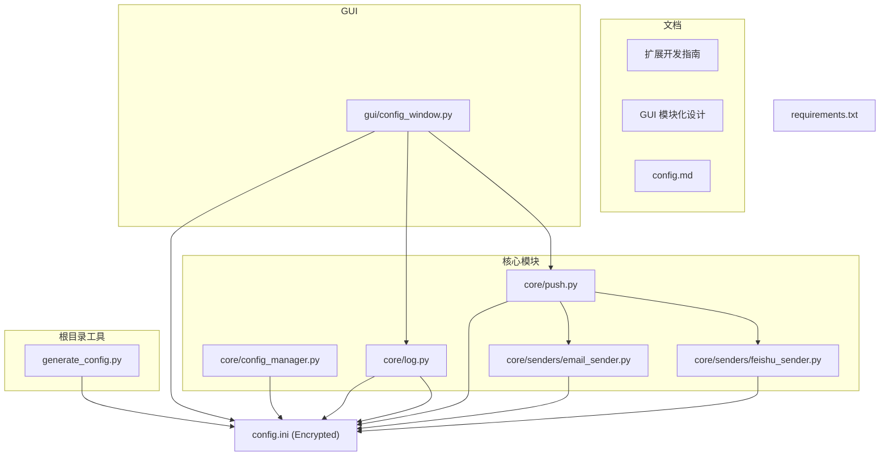
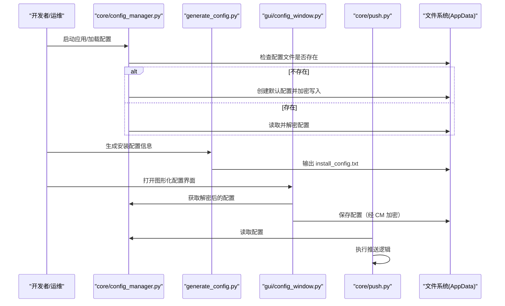
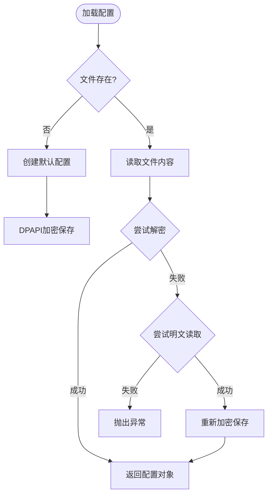

# 配置管理工具

<cite>
**本文引用的文件**
- [core/config_manager.py](file://core/config_manager.py)
- [generate_config.py](file://generate_config.py)
- [config.ini](file://config.ini)
- [config.md](file://config.md)
- [README.md](file://README.md)
- [扩展开发指南](../开发者工具/扩展开发指南/扩展开发指南.md)
- [GUI 模块化设计](../开发者工具/GUI%20模块化设计.md)
- [push.py](file://core/push.py)
- [log.py](file://core/log.py)
- [email_sender.py](file://core/senders/email_sender.py)
- [feishu_sender.py](file://core/senders/feishu_sender.py)
- [config_window.py](file://gui/config_window.py)
- [requirements.txt](file://requirements.txt)
</cite>

## 目录
1. [简介](#简介)
2. [项目结构](#项目结构)
3. [核心组件](#核心组件)
4. [架构总览](#架构总览)
5. [详细组件分析](#详细组件分析)
6. [依赖关系分析](#依赖关系分析)
7. [性能与可靠性考量](#性能与可靠性考量)
8. [故障诊断指南](#故障诊断指南)
9. [结论](#结论)
10. [附录](#附录)

## 简介
本文件面向“配置管理工具”的使用者与维护者，系统性说明以下能力：
- **core/config_manager.py**：负责配置文件的加载、创建默认配置以及加密存储（DPAPI），确保敏感信息安全。
- **generate_config.py**：生成安装配置信息文件，记录安装环境信息，便于部署与运维。
- **config.ini**：配置文件结构、字段含义与默认值。
- **配置生成与加密**：基于 `configparser` 和 `dpapi` 的配置管理流程。
- **配置迁移、批量修改与环境适配**：在不同运行环境（开发/生产）下的策略。
- **安全、权限与版本兼容**：最佳实践与常见问题排查。

## 项目结构
围绕配置管理的关键文件与模块如下图所示：

**图表来源**
- [core/config_manager.py](file://core/config_manager.py)
- [generate_config.py](file://generate_config.py)
- [config.ini](file://config.ini)
- [config.md](file://config.md)
- [core/push.py](file://core/push.py)
- [core/log.py](file://core/log.py)
- [gui/config_window.py](file://gui/config_window.py)

## 核心组件
- **配置文件与说明**
  - **config.ini**：集中式 INI 配置，包含日志、运行模式、账号、学期、循环检测、推送方式与各推送渠道配置。**注意：文件默认被 DPAPI 加密存储。**
  - **config.md**：字段说明与取值范围，便于快速查阅。
- **配置初始化与加密**
  - **core/config_manager.py**：在用户 AppData 目录创建配置文件，注入默认值（如日志级别、运行模式），并使用 DPAPI 自动加密保存，防止敏感信息（密码、密钥）泄露。
- **配置生成与安装信息**
  - **generate_config.py**：生成 `install_config.txt`，记录安装路径、注册表项、虚拟环境与依赖等，辅助部署与卸载。
- **配置读取与推送**
  - **core/push.py**：读取 `[push]` 配置，动态选择并调用具体发送器（如邮件、飞书）。
  - **core/log.py**：统一读取 `[logging]` 配置，初始化日志系统，确保日志路径与级别一致。
  - **core/senders/email_sender.py**、**feishu_sender.py**：按配置读取 `[email]` / `[feishu]` 并执行发送。
- **GUI 配置界面**
  - **gui/config_window.py**：提供图形化配置界面，支持保存、校验（如 Outlook 不支持）、崩溃上报等。

**章节来源**
- [config.ini](file://config.ini)
- [core/config_manager.py](file://core/config_manager.py)
- [generate_config.py](file://generate_config.py)
- [core/push.py](file://core/push.py)
- [gui/config_window.py](file://gui/config_window.py)

## 架构总览
配置管理贯穿“初始化/生成—读取—应用—持久化”闭环，如下图所示：

## 详细组件分析

### core/config_manager.py：配置管理核心
- **职责**：配置文件的加载、创建默认值、加密与解密。
- **加密机制**：使用 Windows DPAPI (`core.utils.dpapi`) 对配置文件内容进行加密，确保在磁盘上存储的是密文。
- **容错处理**：
  - 若文件不存在，自动创建默认配置。
  - 若解密失败（可能是明文），尝试以明文读取并重新加密保存。
  - 若均为失败，抛出异常或使用空配置。

### generate_config.py：安装配置信息生成
- **输入**：安装目录（命令行参数或脚本所在目录）。
- **输出**：`install_config.txt`，包含安装路径、注册表项、虚拟环境、依赖、卸载说明与注意事项。
- **编码**：强制 UTF-8，避免 Windows CI 环境编码问题。
- **用途**：部署与卸载辅助，便于自动化安装脚本与运维审计。

### config.ini：结构、字段与默认值
（同原文档，略有补充）
- `[logging]` level：默认 INFO。
- `[run_model]` model：默认 BUILD。
- `[account]` school_code, username, password (加密存储)。
- `[push]` method：默认 none。
- `[email]`, `[feishu]`, `[serverchan]` 等配置段。

## 依赖关系分析
- **配置文件依赖链**
  - `core/config_manager.py` 依赖 `core.utils.dpapi`。
  - `core/push.py`, `core/log.py`, `gui/config_window.py` 均通过 `core/config_manager.py` 或直接读取（需解密）来获取配置。
- **外部依赖**
  - `requests`, `beautifulsoup4`, `pyside6` 由 `requirements.txt` 管理。

## 性能与可靠性考量
- **安全性**：通过 DPAPI 加密，大幅提升凭据安全性。
- **健壮性**：自动处理配置文件损坏或格式错误（尝试明文读取兼容旧版本）。
- **一致性**：统一通过 `config_manager` 访问配置，避免多处解析逻辑不一致。

## 故障诊断指南
- **配置文件乱码或解密失败**
  - 现象：应用启动报错，提示配置解码错误。
  - 处理：删除 AppData 下的 `config.ini`，重启应用让其重新生成默认配置。
- **无法保存配置**
  - 现象：GUI 提示保存失败。
  - 处理：检查 AppData 目录权限，或检查是否被其他程序占用。

## 结论
本配置管理工具通过 `config_manager` 实现了配置的安全存储与统一管理，配合 `generate_config.py` 辅助部署，构建了完整可靠的配置生命周期管理。

## 附录
### 常用链接
- [扩展开发指南](../开发者工具/扩展开发指南/扩展开发指南.md)
- [GUI 模块化设计](../开发者工具/GUI%20模块化设计.md)
