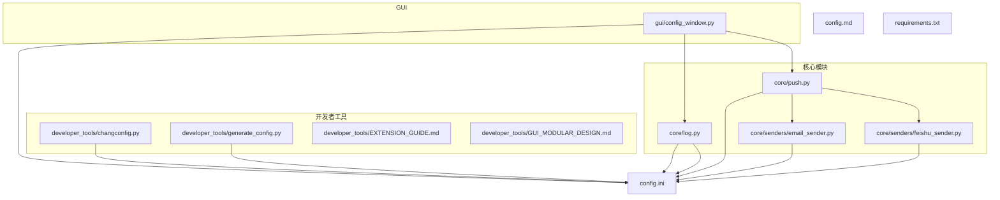
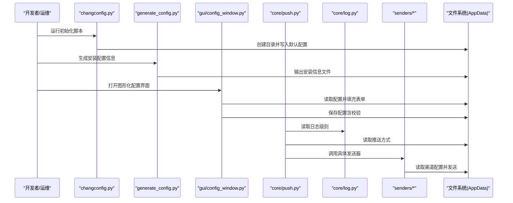
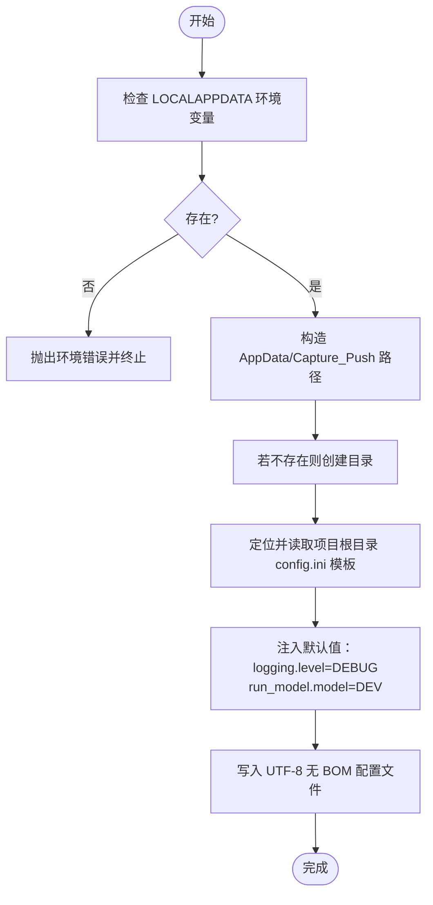
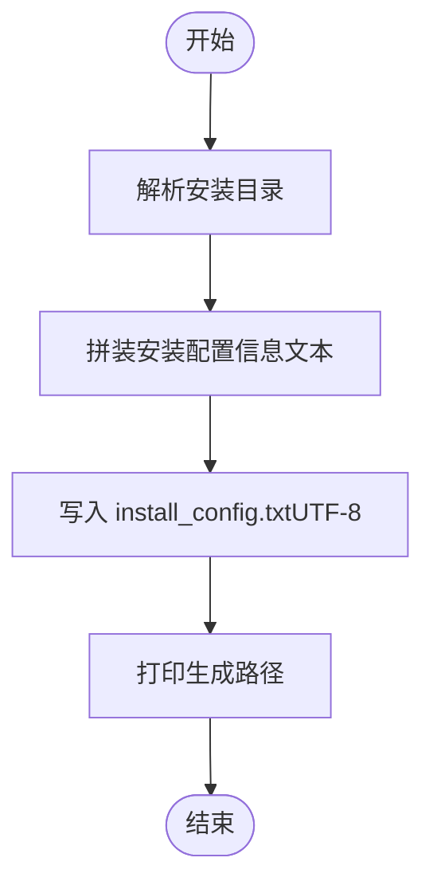
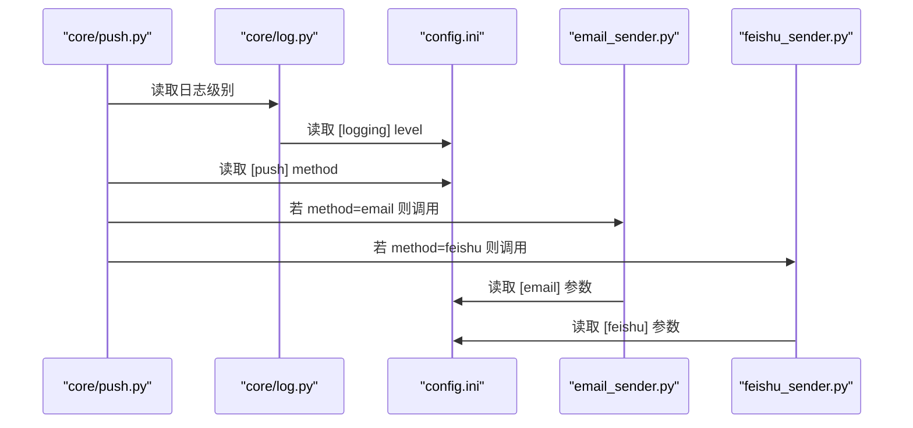
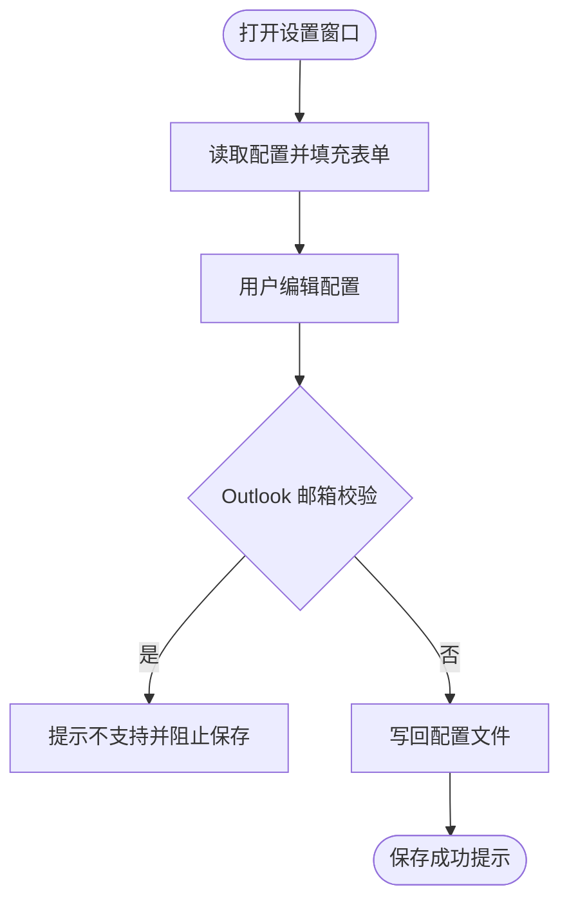
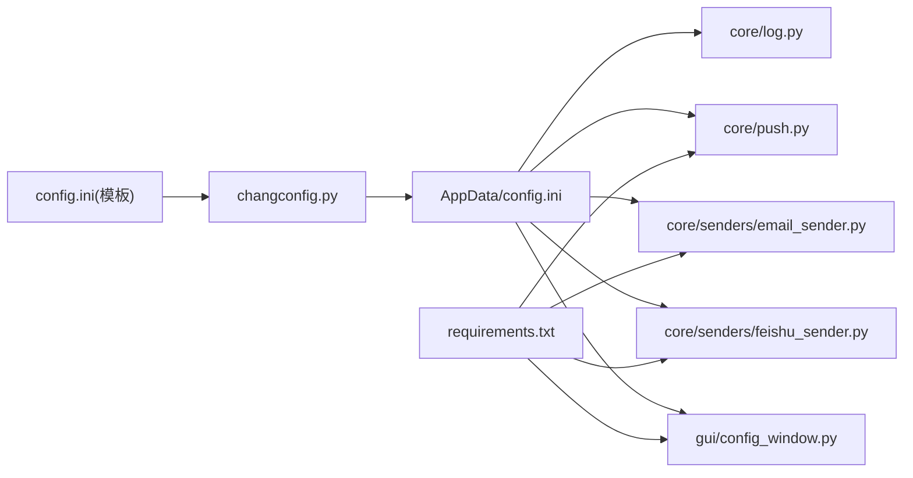

# 配置管理工具

<cite>
**本文引用的文件**
- [changconfig.py](file://developer_tools/changconfig.py)
- [generate_config.py](file://generate_config.py)
- [config.ini](file://config.ini)
- [config.md](file://config.md)
- [README.md](file://README.md)
- [EXTENSION_GUIDE.md](file://developer_tools/EXTENSION_GUIDE.md)
- [GUI_MODULAR_DESIGN.md](file://developer_tools/GUI_MODULAR_DESIGN.md)
- [push.py](file://core/push.py)
- [log.py](file://core/log.py)
- [email_sender.py](file://core/senders/email_sender.py)
- [feishu_sender.py](file://core/senders/feishu_sender.py)
- [config_window.py](file://gui/config_window.py)
- [requirements.txt](file://requirements.txt)
</cite>

## 目录
1. [简介](#简介)
2. [项目结构](#项目结构)
3. [核心组件](#核心组件)
4. [架构总览](#架构总览)
5. [详细组件分析](#详细组件分析)
6. [依赖关系分析](#依赖关系分析)
7. [性能与可靠性考量](#性能与可靠性考量)
8. [故障诊断指南](#故障诊断指南)
9. [结论](#结论)
10. [附录](#附录)

## 简介
本文件面向“配置管理工具”的使用者与维护者，系统性说明以下能力：
- changconfig.py：在用户 AppData 目录初始化并写入配置文件，支持默认值注入与最小化引导。
- generate_config.py：生成安装配置信息文件，便于部署与运维。
- config.ini：配置文件结构、字段含义与默认值。
- 配置生成与模板系统：基于模板的静态配置生成流程。
- 配置迁移、批量修改与环境适配：在不同运行环境（开发/生产）下的策略。
- 安全、权限与版本兼容：最佳实践与常见问题排查。

## 项目结构
围绕配置管理的关键文件与模块如下图所示：

图表来源
- [changconfig.py](file://developer_tools/changconfig.py#L1-L52)
- [generate_config.py](file://generate_config.py#L1-L92)
- [config.ini](file://config.ini#L1-L36)
- [config.md](file://config.md#L1-L52)
- [push.py](file://core/push.py#L1-L319)
- [log.py](file://core/log.py#L1-L211)
- [email_sender.py](file://core/senders/email_sender.py#L1-L144)
- [feishu_sender.py](file://core/senders/feishu_sender.py#L1-L110)
- [config_window.py](file://gui/config_window.py#L1-L537)

章节来源
- [README.md](file://README.md#L60-L83)

## 核心组件
- 配置文件与说明
  - config.ini：集中式 INI 配置，包含日志、运行模式、账号、学期、循环检测、推送方式与各推送渠道配置。
  - config.md：字段说明与取值范围，便于快速查阅。
- 配置初始化与写入
  - changconfig.py：在用户 AppData 目录创建配置文件，注入默认值（如日志级别、运行模式），并提示后续手动完善敏感信息。
- 配置生成与安装信息
  - generate_config.py：生成安装配置信息文件，记录安装路径、注册表项、虚拟环境与依赖等，辅助部署与卸载。
- 配置读取与推送
  - core/push.py：读取 [push] 配置，动态选择并调用具体发送器（如邮件、飞书）。
  - core/log.py：统一读取 [logging] 配置，初始化日志系统，确保日志路径与级别一致。
  - core/senders/email_sender.py、feishu_sender.py：按配置读取 [email]/[feishu] 并执行发送。
- GUI 配置界面
  - gui/config_window.py：提供图形化配置界面，支持保存、校验（如 Outlook 不支持）、崩溃上报等。

章节来源
- [config.ini](file://config.ini#L1-L36)
- [config.md](file://config.md#L1-L52)
- [changconfig.py](file://developer_tools/changconfig.py#L1-L52)
- [generate_config.py](file://generate_config.py#L1-L92)
- [push.py](file://core/push.py#L1-L319)
- [log.py](file://core/log.py#L1-L211)
- [email_sender.py](file://core/senders/email_sender.py#L1-L144)
- [feishu_sender.py](file://core/senders/feishu_sender.py#L1-L110)
- [config_window.py](file://gui/config_window.py#L1-L537)

## 架构总览
配置管理贯穿“初始化/生成—读取—应用—持久化”闭环，如下图所示：

图表来源
- [changconfig.py](file://developer_tools/changconfig.py#L1-L52)
- [generate_config.py](file://generate_config.py#L1-L92)
- [config_window.py](file://gui/config_window.py#L1-L537)
- [push.py](file://core/push.py#L1-L319)
- [log.py](file://core/log.py#L1-L211)
- [email_sender.py](file://core/senders/email_sender.py#L1-L144)
- [feishu_sender.py](file://core/senders/feishu_sender.py#L1-L110)

## 详细组件分析

### changconfig.py：配置初始化与默认值注入
- 目标路径：用户 AppData 下的 Capture_Push 目录，确保可写与隔离。
- 默认值注入：
  - [logging] level 注入 DEBUG，便于开发调试。
  - [run_model] model 注入 DEV，避免开发时重复抓取。
- 写入策略：使用 UTF-8 无 BOM 写入，保证跨平台兼容。
- 提示与约束：脚本仅支持 Windows（依赖 LOCALAPPDATA 环境变量）；首次运行后需手动完善用户名、密码与邮箱认证信息。

图表来源
- [changconfig.py](file://developer_tools/changconfig.py#L1-L52)

章节来源
- [changconfig.py](file://developer_tools/changconfig.py#L1-L52)

### generate_config.py：安装配置信息生成
- 输入：安装目录（命令行参数或脚本所在目录）。
- 输出：install_config.txt，包含安装路径、注册表项、虚拟环境、依赖、卸载说明与注意事项。
- 编码：强制 UTF-8，避免 Windows CI 环境编码问题。
- 用途：部署与卸载辅助，便于自动化安装脚本与运维审计。

图表来源
- [generate_config.py](file://generate_config.py#L1-L92)

章节来源
- [generate_config.py](file://generate_config.py#L1-L92)

### config.ini：结构、字段与默认值
- [logging]
  - level：日志级别（DEBUG/INFO/WARNING/ERROR/CRITICAL），默认 INFO。
- [run_model]
  - model：运行模式（DEV/BUILD），默认 BUILD。
- [account]
  - school_code：院校代码，默认 10546。
  - username/password：教务系统账号凭据（需手动填写）。
- [semester]
  - first_monday：第一周周一日期（YYYY-MM-DD）。
- [loop_getCourseGrades]
  - enabled：是否启用成绩循环检测，默认 False。
  - time：检测间隔（秒），默认 3600。
- [loop_getCourseSchedule]
  - enabled：是否启用课表循环检测，默认 False。
  - time：检测间隔（秒），默认 3600。
- [push]
  - method：推送方式（none/email/test1/wechat/dingtalk/telegram），默认 none。
- [email]
  - smtp/port/sender/receiver/auth：邮件推送所需参数。
- [feishu]
  - webhook_url/secret：飞书机器人推送所需参数。

章节来源
- [config.ini](file://config.ini#L1-L36)
- [config.md](file://config.md#L1-L52)

### 配置读取与应用：推送与日志
- 日志系统
  - 读取 [logging] level，初始化统一日志文件（按日期命名），并限制总日志体积。
- 推送系统
  - 读取 [push] method，动态注册并选择发送器（如 email、feishu）。
  - 发送器按 [email]/[feishu] 配置执行发送，包含参数校验与错误处理。

图表来源
- [push.py](file://core/push.py#L1-L319)
- [log.py](file://core/log.py#L1-L211)
- [email_sender.py](file://core/senders/email_sender.py#L1-L144)
- [feishu_sender.py](file://core/senders/feishu_sender.py#L1-L110)
- [config.ini](file://config.ini#L1-L36)

章节来源
- [push.py](file://core/push.py#L1-L319)
- [log.py](file://core/log.py#L1-L211)
- [email_sender.py](file://core/senders/email_sender.py#L1-L144)
- [feishu_sender.py](file://core/senders/feishu_sender.py#L1-L110)

### GUI 配置界面：图形化配置与校验
- 加载：启动时读取配置并填充表单。
- 保存：写回配置文件，包含 Outlook 邮箱不支持的即时校验。
- 辅助功能：崩溃上报（打包日志）、检查更新、查看成绩/课表窗口。

图表来源
- [config_window.py](file://gui/config_window.py#L1-L537)

章节来源
- [config_window.py](file://gui/config_window.py#L1-L537)

## 依赖关系分析
- 配置文件依赖链
  - changconfig.py 依赖项目根目录模板 config.ini。
  - core/push.py、core/log.py、senders/* 依赖 AppData 下的 config.ini。
  - gui/config_window.py 依赖 AppData 下的 config.ini。
- 外部依赖
  - requests、beautifulsoup4、PySide6 由 requirements.txt 管理。

图表来源
- [changconfig.py](file://developer_tools/changconfig.py#L1-L52)
- [config.ini](file://config.ini#L1-L36)
- [push.py](file://core/push.py#L1-L319)
- [log.py](file://core/log.py#L1-L211)
- [email_sender.py](file://core/senders/email_sender.py#L1-L144)
- [feishu_sender.py](file://core/senders/feishu_sender.py#L1-L110)
- [config_window.py](file://gui/config_window.py#L1-L537)
- [requirements.txt](file://requirements.txt#L1-L3)

章节来源
- [requirements.txt](file://requirements.txt#L1-L3)

## 性能与可靠性考量
- 日志体积控制：统一按日期命名日志文件，结合滚动与总容量清理，避免磁盘占用过大。
- 配置读取：使用 UTF-8 无 BOM，减少跨平台差异；读取失败时提供降级默认值。
- 发送器容错：SMTP 认证失败、网络异常等均有明确错误日志与用户提示。
- GUI 保存：即时校验敏感邮箱类型，降低无效配置导致的失败概率。

[本节为通用指导，无需特定文件来源]

## 故障诊断指南
- 无法获取 LOCALAPPDATA 环境变量
  - 现象：初始化脚本直接报错并终止。
  - 处理：确认运行环境为 Windows；检查用户权限。
  - 参考：[changconfig.py](file://developer_tools/changconfig.py#L4-L7)
- 配置文件缺失或路径错误
  - 现象：日志模块或推送模块抛出“配置文件不存在”异常。
  - 处理：使用初始化脚本生成 AppData 下的 config.ini；确认路径正确。
  - 参考：[log.py](file://core/log.py#L60-L82)
- Outlook/Hotmail 邮箱发送失败
  - 现象：Outlook/Hotmail 邮箱不支持基本认证，发送器拒绝发送并给出替代方案。
  - 处理：更换其他邮箱服务商（如 QQ、163、Gmail）。
  - 参考：[email_sender.py](file://core/senders/email_sender.py#L78-L85)
- SMTP 认证失败
  - 现象：SMTP 认证错误，可能为 Office365 禁用基本认证。
  - 处理：使用应用密码而非账户密码；确认端口与 TLS 配置。
  - 参考：[email_sender.py](file://core/senders/email_sender.py#L127-L139)
- 配置保存后未生效
  - 现象：修改后重启应用仍不生效。
  - 处理：确认保存至 AppData 下的 config.ini；检查 GUI 是否正确读取。
  - 参考：[config_window.py](file://gui/config_window.py#L397-L403)

章节来源
- [changconfig.py](file://developer_tools/changconfig.py#L4-L7)
- [log.py](file://core/log.py#L60-L82)
- [email_sender.py](file://core/senders/email_sender.py#L78-L85)
- [email_sender.py](file://core/senders/email_sender.py#L127-L139)
- [config_window.py](file://gui/config_window.py#L397-L403)

## 结论
本配置管理工具通过“模板+初始化+图形化界面+发送器解耦”的架构，实现了：
- 跨环境一致的配置路径与默认值注入；
- 清晰的配置结构与字段说明；
- 可靠的读取与应用流程；
- 可扩展的推送渠道与 GUI 辅助。

建议在团队内推广使用初始化脚本与 GUI，配合日志与崩溃上报机制，提升问题定位效率。

[本节为总结，无需特定文件来源]

## 附录

### 配置迁移与批量修改
- 迁移策略
  - 使用初始化脚本生成新环境的 AppData 配置，再在 GUI 中逐项核对与调整。
  - 对于大规模部署，可结合 generate_config.py 的安装信息文件进行审计与回溯。
- 批量修改
  - 通过 GUI 的“保存配置”功能一次性写入；或在 AppData 下直接编辑 config.ini（注意备份）。
- 环境适配
  - DEV 模式适合开发调试，BUILD 模式适合生产运行；根据 run_model 切换行为。

章节来源
- [changconfig.py](file://developer_tools/changconfig.py#L1-L52)
- [generate_config.py](file://generate_config.py#L1-L92)
- [config.ini](file://config.ini#L1-L36)

### 安全、权限与版本兼容最佳实践
- 安全
  - 邮箱授权码优先于登录密码；敏感字段在 GUI 中以密码模式输入。
  - 飞书密钥启用签名校验，避免中间人攻击。
- 权限
  - 确保 AppData 目录可写；避免在只读环境强制写入。
- 版本兼容
  - 保持 config.ini 字段稳定；新增字段建议提供默认值与降级逻辑。
  - 发送器扩展遵循统一接口，避免破坏既有配置。

章节来源
- [email_sender.py](file://core/senders/email_sender.py#L1-L144)
- [feishu_sender.py](file://core/senders/feishu_sender.py#L1-L110)
- [EXTENSION_GUIDE.md](file://developer_tools/EXTENSION_GUIDE.md#L1-L102)
- [GUI_MODULAR_DESIGN.md](file://developer_tools/GUI_MODULAR_DESIGN.md#L1-L52)