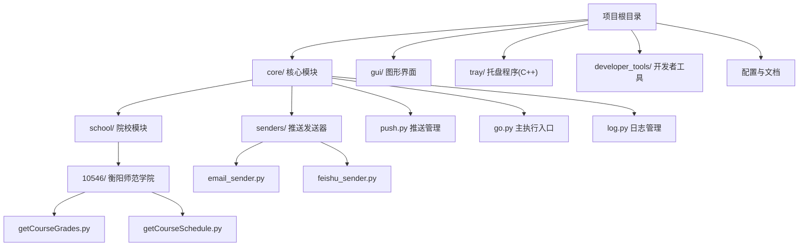
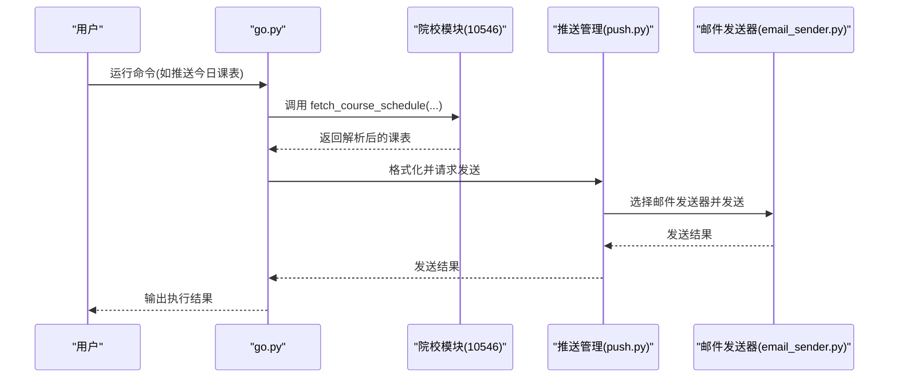
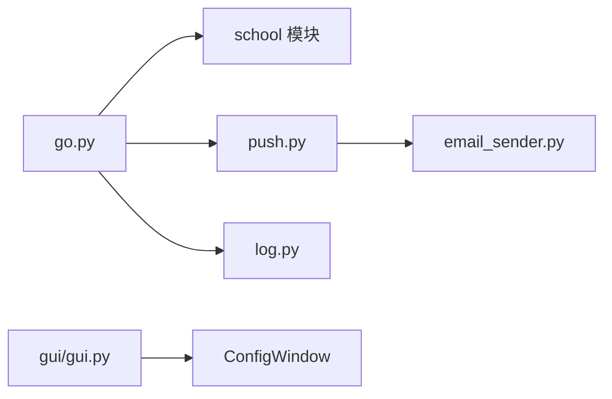

# 快速开始

<cite>
**本文引用的文件**
- [README.md](file://README.md)
- [requirements.txt](file://requirements.txt)
- [config.ini](file://config.ini)
- [config.md](file://config.md)
- [generate_config.py](file://generate_config.py)
- [go.py](file://core/go.py)
- [push.py](file://core/push.py)
- [email_sender.py](file://core/senders/email_sender.py)
- [school/__init__.py](file://core/school/__init__.py)
- [10546/__init__.py](file://core/school/10546/__init__.py)
- [10546/getCourseGrades.py](file://core/school/10546/getCourseGrades.py)
- [10546/getCourseSchedule.py](file://core/school/10546/getCourseSchedule.py)
- [log.py](file://core/log.py)
- [gui.py](file://gui/gui.py)
- [EXTENSION_GUIDE.md](file://developer_tools/EXTENSION_GUIDE.md)
- [GUI_MODULAR_DESIGN.md](file://developer_tools/GUI_MODULAR_DESIGN.md)
- [pyproject.toml](file://pyproject.toml)
</cite>

## 目录
1. [简介](#简介)
2. [项目结构](#项目结构)
3. [核心组件](#核心组件)
4. [架构总览](#架构总览)
5. [详细组件分析](#详细组件分析)
6. [依赖关系分析](#依赖关系分析)
7. [性能考虑](#性能考虑)
8. [故障排除指南](#故障排除指南)
9. [结论](#结论)
10. [附录](#附录)

## 简介
Capture_Push 是一个课程成绩与课表自动追踪推送系统，支持多院校模块化扩展、多种推送方式（如邮件）、后台托盘运行与循环检测。本“快速开始”旨在帮助新手在约 30 分钟内完成开发环境搭建、安装依赖、配置首个院校模块（衡阳师范学院）、设置账户与推送方式，并验证系统成功接收第一条推送通知。

## 项目结构
项目采用模块化组织，核心功能集中在 core 目录，图形界面与托盘程序分别在 gui/tray，扩展开发指南位于 developer_tools。

图表来源
- [README.md](file://README.md#L60-L83)
- [core/school/__init__.py](file://core/school/__init__.py#L1-L28)
- [core/school/10546/__init__.py](file://core/school/10546/__init__.py#L1-L7)
- [core/push.py](file://core/push.py#L1-L319)
- [core/go.py](file://core/go.py#L1-L536)

章节来源
- [README.md](file://README.md#L60-L83)

## 核心组件
- 主执行入口：负责命令行参数解析、触发成绩/课表获取与推送、循环检测状态管理。
- 院校模块：按院校代码动态加载，提供统一的抓取接口（成绩/课表）。
- 推送管理：统一管理多种推送方式（邮件、飞书等），按配置选择发送器。
- 日志系统：统一在用户目录生成日志文件，便于排障。
- GUI：提供配置界面，便于非技术用户进行配置与查看。

章节来源
- [core/go.py](file://core/go.py#L461-L536)
- [core/school/__init__.py](file://core/school/__init__.py#L22-L28)
- [core/push.py](file://core/push.py#L74-L163)
- [core/log.py](file://core/log.py#L131-L195)
- [gui/gui.py](file://gui/gui.py#L16-L24)

## 架构总览
系统通过 go.py 作为入口，按配置加载对应院校模块，抓取成绩/课表后交由推送管理器进行格式化与发送；日志统一写入用户目录，便于定位问题。

图表来源
- [core/go.py](file://core/go.py#L180-L271)
- [core/school/10546/getCourseSchedule.py](file://core/school/10546/getCourseSchedule.py#L354-L371)
- [core/push.py](file://core/push.py#L290-L318)
- [core/senders/email_sender.py](file://core/senders/email_sender.py#L50-L144)

## 详细组件分析

### 安装与开发环境搭建
- 使用 uv 创建虚拟环境并安装依赖，确保 Python 版本满足要求。
- 依赖清单来自 requirements.txt 与 pyproject.toml，包含 requests、beautifulsoup4、PySide6。
- 项目自带打包与安装脚本，便于生成安装配置信息。

章节来源
- [README.md](file://README.md#L87-L99)
- [requirements.txt](file://requirements.txt#L1-L3)
- [pyproject.toml](file://pyproject.toml#L6-L11)
- [generate_config.py](file://generate_config.py#L18-L80)

### 配置文件与运行模式
- 配置文件位于用户目录的专用文件夹中，首次运行会自动创建。
- 支持运行模式（DEV/BUILD），DEV 模式下可减少网络请求，便于开发调试。
- 配置项涵盖日志级别、账户信息、学期起始日、循环检测开关与间隔、推送方式与邮箱参数等。

章节来源
- [config.ini](file://config.ini#L1-L36)
- [config.md](file://config.md#L1-L52)
- [core/log.py](file://core/log.py#L60-L82)
- [core/school/10546/getCourseGrades.py](file://core/school/10546/getCourseGrades.py#L31-L44)
- [core/school/10546/getCourseSchedule.py](file://core/school/10546/getCourseSchedule.py#L32-L46)

### 配置第一个院校模块（衡阳师范学院）
- 院校模块按目录名作为院校代码，系统会动态导入对应模块。
- 衡阳师范学院模块提供统一接口：fetch_grades 与 fetch_course_schedule。
- 该模块内置登录、缓存与解析逻辑，支持循环检测与强制更新。

章节来源
- [core/school/__init__.py](file://core/school/__init__.py#L22-L28)
- [core/school/10546/__init__.py](file://core/school/10546/__init__.py#L1-L7)
- [core/school/10546/getCourseGrades.py](file://core/school/10546/getCourseGrades.py#L278-L295)
- [core/school/10546/getCourseSchedule.py](file://core/school/10546/getCourseSchedule.py#L354-L371)

### 设置账户信息与推送方式
- 账户信息：在配置文件的 account 节填写学校代码、用户名、密码。
- 推送方式：在 push 节设置 method（如 email），并按所选方式完善对应节的参数。
- 邮件推送：在 email 节填写 SMTP、端口、发件人、收件人、授权码等。

章节来源
- [config.ini](file://config.ini#L7-L36)
- [config.md](file://config.md#L19-L52)
- [core/push.py](file://core/push.py#L26-L53)
- [core/senders/email_sender.py](file://core/senders/email_sender.py#L37-L144)

### 首次运行完整流程（30 分钟内）
以下为从零到第一条推送的推荐步骤，建议按顺序执行：

1) 准备开发环境
- 使用 uv 创建虚拟环境并激活。
- 安装依赖：requests、beautifulsoup4、PySide6。
- 参考：[README.md](file://README.md#L87-L99)、[requirements.txt](file://requirements.txt#L1-L3)、[pyproject.toml](file://pyproject.toml#L6-L11)

2) 配置基础信息
- 在配置文件中填写 account 节（学校代码、用户名、密码）。
- 在 push 节设置 method 为 email。
- 在 email 节填写 SMTP、端口、发件人、收件人、授权码。
- 参考：[config.ini](file://config.ini#L7-L36)、[config.md](file://config.md#L19-L52)

3) 验证成绩抓取
- 使用命令行参数获取成绩（不推送）：--fetch-grade
- 若需要强制从网络更新，添加 --force
- 参考：[core/go.py](file://core/go.py#L481-L484)

4) 验证课表抓取
- 使用命令行参数获取课表（不推送）：--fetch-schedule
- 参考：[core/go.py](file://core/go.py#L490-L494)

5) 验证推送
- 推送今日课表：--push-today
- 推送明日课表：--push-tomorrow
- 推送下周全周课表：--push-next-week
- 参考：[core/go.py](file://core/go.py#L498-L506)

6) 查看日志
- 日志统一写入用户目录，便于定位问题。
- 参考：[core/log.py](file://core/log.py#L114-L128)

7) 使用 GUI（可选）
- 启动图形界面进行配置与查看。
- 参考：[gui/gui.py](file://gui/gui.py#L16-L24)

章节来源
- [README.md](file://README.md#L87-L99)
- [config.ini](file://config.ini#L7-L36)
- [config.md](file://config.md#L19-L52)
- [core/go.py](file://core/go.py#L481-L506)
- [core/log.py](file://core/log.py#L114-L128)
- [gui/gui.py](file://gui/gui.py#L16-L24)

### 常见问题与故障排除
- 邮件发送失败（Outlook/Hotmail 基本认证被禁用）
  - 现象：认证失败，提示基本认证被禁用。
  - 原因：Outlook/Hotmail 已禁用基本认证。
  - 解决：更换其他邮箱服务商（如 QQ、163、Gmail），或使用应用密码。
  - 参考：[core/senders/email_sender.py](file://core/senders/email_sender.py#L78-L85)

- SMTP 认证失败
  - 现象：SMTP 认证错误。
  - 处理：检查授权码、端口与服务器设置；Office365 常见问题需使用应用密码。
  - 参考：[core/senders/email_sender.py](file://core/senders/email_sender.py#L127-L139)

- 登录失败或验证码
  - 现象：登录响应包含验证码或失败提示。
  - 处理：当前脚本无法处理验证码；请在浏览器手动登录确认。
  - 参考：[core/school/10546/getCourseGrades.py](file://core/school/10546/getCourseGrades.py#L92-L95)

- 未设置学期起始日导致课表推送跳过
  - 现象：未到开学日期，跳过推送。
  - 处理：在配置文件 semester 节设置 first_monday。
  - 参考：[core/go.py](file://core/go.py#L187-L201)

- 日志定位问题
  - 使用 --pack-logs 生成崩溃报告，便于反馈与排查。
  - 参考：[core/go.py](file://core/go.py#L507-L513)、[core/log.py](file://core/log.py#L18-L57)

章节来源
- [core/senders/email_sender.py](file://core/senders/email_sender.py#L78-L139)
- [core/school/10546/getCourseGrades.py](file://core/school/10546/getCourseGrades.py#L92-L95)
- [core/go.py](file://core/go.py#L187-L201)
- [core/go.py](file://core/go.py#L507-L513)
- [core/log.py](file://core/log.py#L18-L57)

## 依赖关系分析
系统通过模块化设计降低耦合，核心依赖如下：

图表来源
- [core/go.py](file://core/go.py#L15-L19)
- [core/push.py](file://core/push.py#L17-L21)
- [core/senders/email_sender.py](file://core/senders/email_sender.py#L12-L15)
- [core/log.py](file://core/log.py#L1-L211)
- [gui/gui.py](file://gui/gui.py#L16-L24)

章节来源
- [core/go.py](file://core/go.py#L15-L19)
- [core/push.py](file://core/push.py#L17-L21)
- [core/senders/email_sender.py](file://core/senders/email_sender.py#L12-L15)
- [core/log.py](file://core/log.py#L1-L211)
- [gui/gui.py](file://gui/gui.py#L16-L24)

## 性能考虑
- 循环检测：可通过配置启用/禁用，并设置更新间隔，避免频繁网络请求。
- 缓存策略：在用户目录缓存 HTML 与时间戳，减少重复抓取。
- 日志轮转：单文件最大 10MB，保留多个备份，总大小控制在合理范围。

章节来源
- [config.ini](file://config.ini#L15-L21)
- [core/school/10546/getCourseGrades.py](file://core/school/10546/getCourseGrades.py#L117-L156)
- [core/school/10546/getCourseSchedule.py](file://core/school/10546/getCourseSchedule.py#L118-L157)
- [core/log.py](file://core/log.py#L180-L189)

## 故障排除指南
- 检查配置文件是否存在且可读：统一从用户目录读取。
- 使用 --pack-logs 生成崩溃报告，包含所有日志文件内容。
- 确认网络连通性与目标站点可达。
- 对于 Outlook/Hotmail：改用其他邮箱或应用密码。

章节来源
- [core/log.py](file://core/log.py#L60-L82)
- [core/go.py](file://core/go.py#L507-L513)
- [core/senders/email_sender.py](file://core/senders/email_sender.py#L78-L85)

## 结论
通过本快速开始指南，您可以在 30 分钟内完成开发环境搭建、安装依赖、配置首个院校模块与推送方式，并验证系统成功接收第一条推送通知。遇到问题时，优先查看日志与配置文件，必要时使用崩溃报告辅助排查。

## 附录
- 开发新推送方式与新院校模块的扩展指南。
- GUI 模块化设计与维护指南。

章节来源
- [EXTENSION_GUIDE.md](file://developer_tools/EXTENSION_GUIDE.md#L1-L102)
- [GUI_MODULAR_DESIGN.md](file://developer_tools/GUI_MODULAR_DESIGN.md#L1-L52)