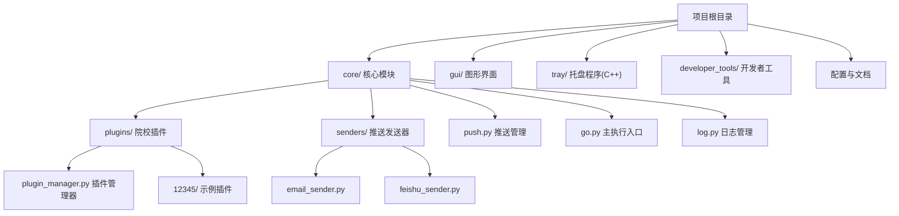
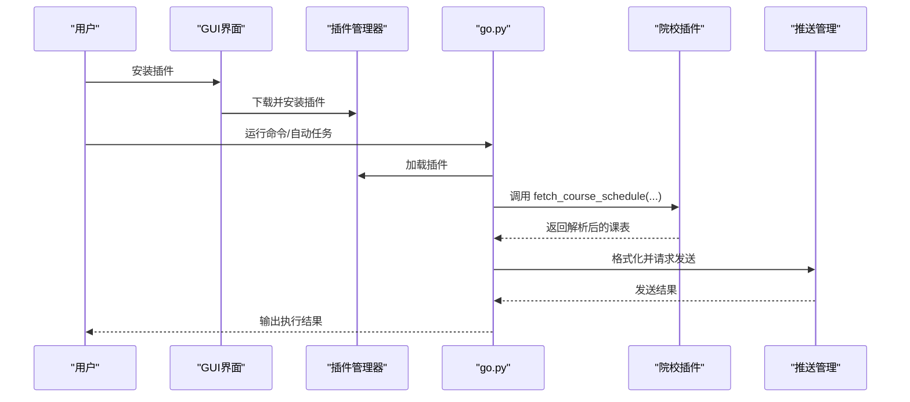
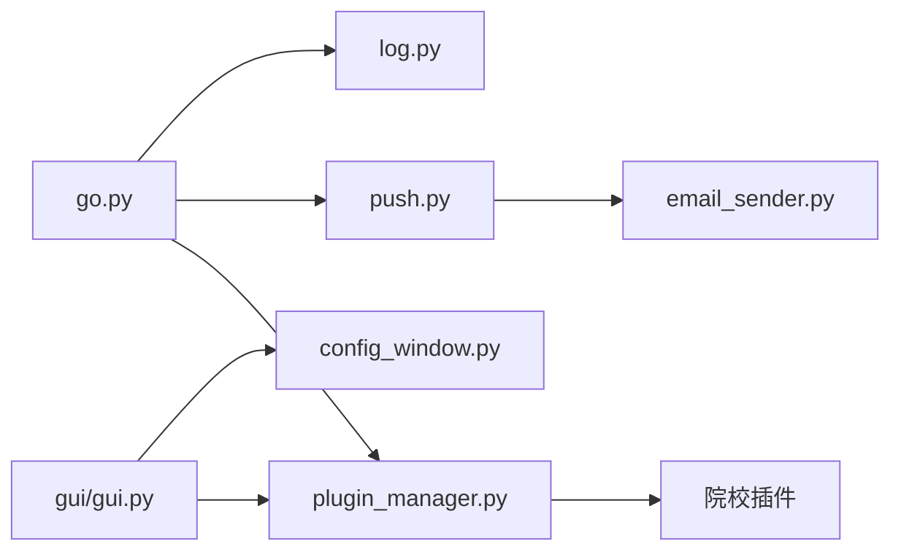

# 快速开始

<cite>
**本文引用的文件**
- [README.md](file://README.md)
- [requirements.txt](file://requirements.txt)
- [config.ini](file://config.ini)
- [go.py](file://core/go.py)
- [push.py](file://core/push.py)
- [plugin_manager.py](file://core/plugins/plugin_manager.py)
- [log.py](file://core/log.py)
- [gui.py](file://gui/gui.py)
- [EXTENSION_GUIDE.md](file://developer_tools/EXTENSION_GUIDE.md)
- [pyproject.toml](file://pyproject.toml)
</cite>

## 目录
1. [简介](#简介)
2. [项目结构](#项目结构)
3. [核心组件](#核心组件)
4. [架构总览](#架构总览)
5. [详细组件分析](#详细组件分析)
6. [依赖关系分析](#依赖关系分析)
7. [性能考虑](#性能考虑)
8. [故障排除指南](#故障排除指南)
9. [结论](#结论)
10. [附录](#附录)

## 简介
Capture_Push 是一个课程成绩与课表自动追踪推送系统，支持多院校插件化扩展、多种推送方式（如邮件）、后台托盘运行与循环检测。本“快速开始”旨在帮助新手在约 30 分钟内完成开发环境搭建、安装依赖、安装并配置院校插件、设置账户与推送方式，并验证系统成功接收第一条推送通知。

## 项目结构
项目采用模块化组织，核心功能集中在 core 目录，图形界面与托盘程序分别在 gui/tray，扩展开发指南位于 developer_tools。

**图表来源**
- [README.md](file://README.md)
- [core/plugins/plugin_manager.py](file://core/plugins/plugin_manager.py)
- [core/push.py](file://core/push.py)
- [core/go.py](file://core/go.py)

**章节来源**
- [README.md](file://README.md)

## 核心组件
- **主执行入口**：负责命令行参数解析、触发成绩/课表获取与推送、循环检测状态管理。
- **插件管理器**：负责院校插件的下载、安装、更新与加载。
- **推送管理**：统一管理多种推送方式（邮件、飞书等），按配置选择发送器。
- **日志系统**：统一在用户目录生成日志文件，便于排障。
- **GUI**：提供配置界面与插件管理界面，便于非技术用户进行配置与查看。

**章节来源**
- [core/go.py](file://core/go.py)
- [core/plugins/plugin_manager.py](file://core/plugins/plugin_manager.py)
- [core/push.py](file://core/push.py)
- [core/log.py](file://core/log.py)
- [gui/gui.py](file://gui/gui.py)

## 架构总览
系统通过 go.py 作为入口，通过插件管理器加载院校插件，抓取成绩/课表后交由推送管理器进行格式化与发送；日志统一写入用户目录，便于定位问题。

**图表来源**
- [core/go.py](file://core/go.py)
- [core/plugins/plugin_manager.py](file://core/plugins/plugin_manager.py)

## 详细组件分析

### 安装与开发环境搭建
- 使用 uv 创建虚拟环境并安装依赖，确保 Python 版本满足要求。
- 依赖清单来自 requirements.txt 与 pyproject.toml，包含 requests、beautifulsoup4、PySide6。
- 项目自带打包与安装脚本，便于生成安装配置信息。

**章节来源**
- [README.md](file://README.md)
- [requirements.txt](file://requirements.txt)
- [pyproject.toml](file://pyproject.toml)

### 配置文件与运行模式
- 配置文件位于用户目录的专用文件夹中，首次运行会自动创建。
- 支持运行模式（DEV/BUILD），DEV 模式下可减少网络请求，便于开发调试。
- 配置项涵盖日志级别、账户信息、学期起始日、循环检测开关与间隔、推送方式与邮箱参数等。

**章节来源**
- [config.ini](file://config.ini)
- [core/log.py](file://core/log.py)

### 安装与配置院校插件
- 通过 GUI 的"插件管理"标签页，从 GitHub 远程仓库搜索并安装对应学校的插件。
- 安装完成后，在"软件设置"标签页填写学校代码、教务系统用户名和密码。
- 插件管理器会自动校验插件完整性并加载。

**章节来源**
- [core/plugins/plugin_manager.py](file://core/plugins/plugin_manager.py)
- [gui/gui.py](file://gui/gui.py)

### 设置账户信息与推送方式
- 账户信息：在 GUI 或配置文件中填写学校代码、用户名、密码。
- 推送方式：在 GUI 或配置文件中选择推送方式（如 email）。
- 邮件推送：填写 SMTP、端口、发件人、收件人、授权码等。

**章节来源**
- [config.ini](file://config.ini)
- [core/push.py](file://core/push.py)

### 首次运行完整流程（30 分钟内）
以下为从零到第一条推送的推荐步骤，建议按顺序执行：

1) **准备开发环境**
   - 使用 uv 创建虚拟环境并激活。
   - 安装依赖：`pip install -r requirements.txt`。

2) **启动 GUI 并安装插件**
   - 运行 `python gui/gui.py` 启动图形界面。
   - 进入"插件管理"标签页，点击"检查更新"获取最新插件列表。
   - 找到您的学校插件，点击"安装"。

3) **配置基础信息**
   - 进入"软件设置"标签页。
   - 填写学校代码、教务系统账号、密码。
   - 选择推送方式（如 Email），并填写 SMTP 配置。
   - 点击"保存配置"。

4) **验证功能**
   - 在 GUI 中点击"测试成绩抓取"或"测试课表抓取"。
   - 检查是否有弹窗提示成功或查看控制台日志。
   - 也可以使用命令行：`python core/go.py --fetch-grade`。

5) **验证推送**
   - 在 GUI 中点击"测试推送"。
   - 检查邮箱或飞书是否收到测试消息。

6) **查看日志**
   - 点击 GUI 底部状态栏或查看用户目录下的日志文件，确认无报错。

**章节来源**
- [gui/gui.py](file://gui/gui.py)
- [core/go.py](file://core/go.py)

### 常见问题与故障排除
- **插件列表加载失败**
  - 检查网络连接，尝试使用代理。
  - 确认 GitHub API 访问正常。

- **邮件发送失败（Outlook/Hotmail）**
  - Outlook/Hotmail 已禁用基本认证，请使用应用密码或更换其他邮箱。

- **登录失败**
  - 检查账号密码是否正确。
  - 部分学校教务系统可能需要验证码，当前版本可能需要手动辅助或等待插件更新支持。

**章节来源**
- [core/plugins/plugin_manager.py](file://core/plugins/plugin_manager.py)
- [core/senders/email_sender.py](file://core/senders/email_sender.py)

## 依赖关系分析
系统通过模块化设计降低耦合，核心依赖如下：

**图表来源**
- [core/go.py](file://core/go.py)
- [core/plugins/plugin_manager.py](file://core/plugins/plugin_manager.py)

## 性能考虑
- **循环检测**：可通过配置启用/禁用，并设置更新间隔，避免频繁网络请求。
- **插件缓存**：插件下载后本地缓存，减少网络流量。
- **日志轮转**：自动清理旧日志，防止占用过多磁盘空间。

**章节来源**
- [core/log.py](file://core/log.py)

## 故障排除指南
- 检查配置文件是否存在且可读。
- 使用 `--pack-logs` 生成崩溃报告。
- 确认网络连通性与目标站点可达。

**章节来源**
- [core/log.py](file://core/log.py)

## 结论
通过本快速开始指南，您可以快速搭建 Capture_Push 环境，安装院校插件并配置推送服务。系统的插件化架构确保了对新院校的快速支持和灵活扩展。

## 附录
- [扩展开发指南](file://.wiki/zh/content/开发者工具/扩展开发指南/扩展开发指南.md)
- [GUI 模块化设计](file://.wiki/zh/content/开发者工具/GUI%20模块化设计.md)
