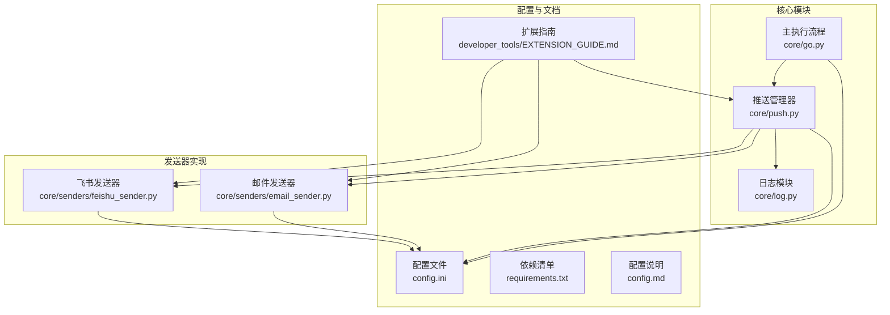
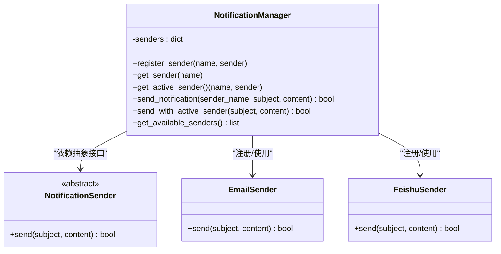
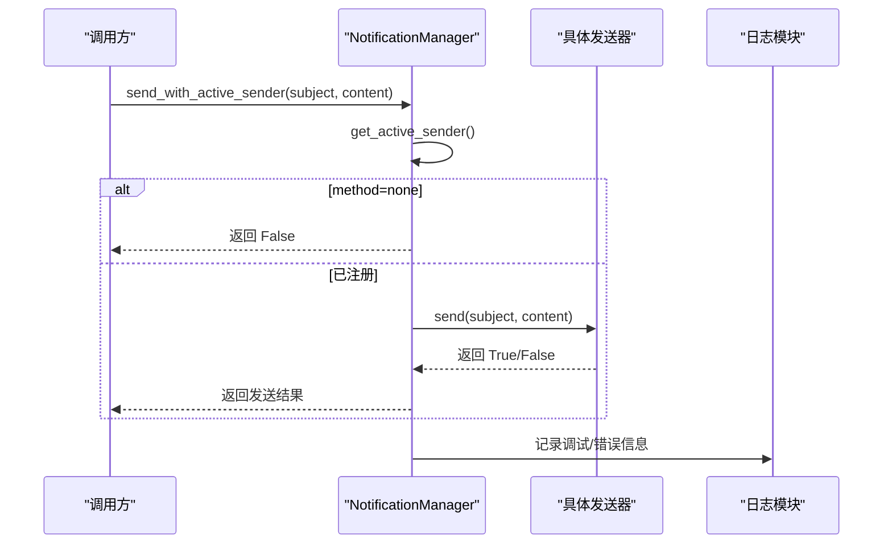
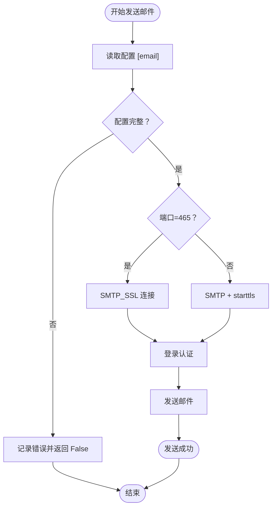
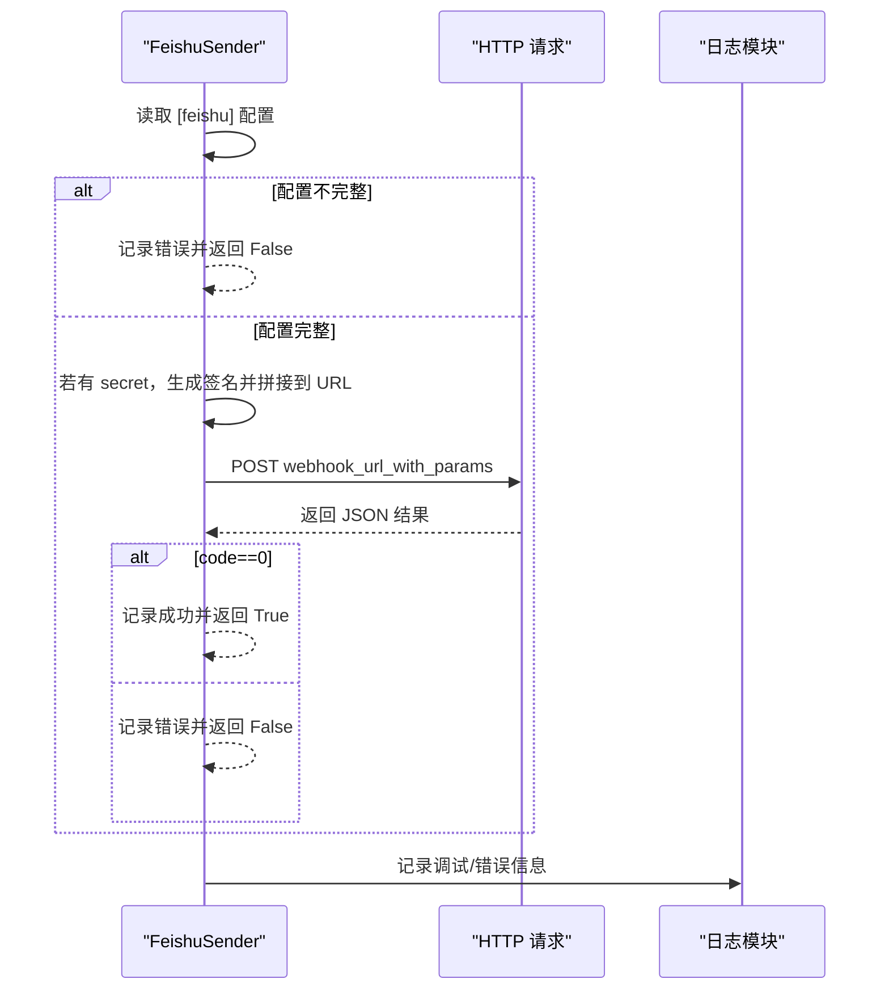
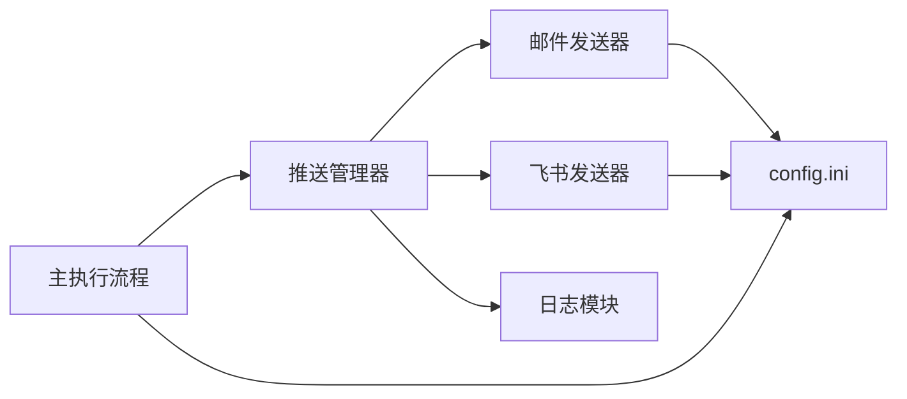

# 推送通知系统

<cite>
**本文引用的文件**
- [core/push.py](file://core/push.py)
- [core/senders/email_sender.py](file://core/senders/email_sender.py)
- [core/senders/feishu_sender.py](file://core/senders/feishu_sender.py)
- [core/log.py](file://core/log.py)
- [core/go.py](file://core/go.py)
- [config.ini](file://config.ini)
- [requirements.txt](file://requirements.txt)
- [README.md](file://README.md)
- [config.md](file://config.md)
- [developer_tools/EXTENSION_GUIDE.md](file://developer_tools/EXTENSION_GUIDE.md)
- [core/updater.py](file://core/updater.py)
</cite>

## 目录
1. [简介](#简介)
2. [项目结构](#项目结构)
3. [核心组件](#核心组件)
4. [架构总览](#架构总览)
5. [详细组件分析](#详细组件分析)
6. [依赖关系分析](#依赖关系分析)
7. [性能考虑](#性能考虑)
8. [故障排除指南](#故障排除指南)
9. [结论](#结论)
10. [附录](#附录)

## 简介
本技术文档围绕“推送通知系统”展开，重点阐述推送管理器的架构设计、统一接口实现、邮件与飞书推送的具体实现细节（认证机制、消息格式、错误处理）、推送触发条件、去重机制与日志记录功能，并提供配置指南、故障排除方法、性能优化建议以及扩展新推送方式的开发指南。该系统以模块化设计为核心，支持多推送方式的统一调度与消息格式化，便于后续扩展新的推送通道。

## 项目结构
推送通知系统位于 core/push.py，配合 core/senders 下的各具体发送器实现，以及统一的日志模块 core/log.py。核心执行流程由 core/go.py 驱动，负责从教务系统抓取数据、对比状态、决定是否推送，并通过推送管理器选择当前启用的推送方式。

图表来源
- [core/push.py](file://core/push.py#L74-L163)
- [core/senders/email_sender.py](file://core/senders/email_sender.py#L47-L144)
- [core/senders/feishu_sender.py](file://core/senders/feishu_sender.py#L42-L110)
- [core/log.py](file://core/log.py#L131-L195)
- [core/go.py](file://core/go.py#L83-L144)

章节来源
- [README.md](file://README.md#L60-L83)
- [core/push.py](file://core/push.py#L1-L319)
- [core/log.py](file://core/log.py#L1-L211)
- [core/go.py](file://core/go.py#L1-L536)

## 核心组件
- 推送管理器（NotificationManager）
  - 统一注册与调度多种推送方式，按配置选择当前活跃发送器，屏蔽具体实现差异。
- 抽象发送器接口（NotificationSender）
  - 定义统一的 send(subject, content) 接口，便于扩展新推送方式。
- 邮件发送器（EmailSender）
  - 基于 SMTP/SSL 与 STARTTLS，支持 465/587 端口；内置 Outlook/Hotmail 基本认证限制提示。
- 飞书发送器（FeishuSender）
  - 基于 Webhook，支持可选签名参数；消息类型为 text。
- 日志模块（core/log.py）
  - 统一日志初始化、文件轮转、清理策略与 AppData 目录路径管理。
- 主执行流程（core/go.py）
  - 负责成绩/课表抓取、状态对比、触发条件判断、去重记录与调用推送管理器。

章节来源
- [core/push.py](file://core/push.py#L56-L163)
- [core/senders/email_sender.py](file://core/senders/email_sender.py#L47-L144)
- [core/senders/feishu_sender.py](file://core/senders/feishu_sender.py#L42-L110)
- [core/log.py](file://core/log.py#L131-L195)
- [core/go.py](file://core/go.py#L83-L144)

## 架构总览
推送管理器采用“抽象接口 + 多实现 + 统一调度”的架构，结合配置驱动的方式选择当前启用的推送方式。消息格式化由推送管理器提供，发送器仅关注传输细节。

图表来源
- [core/push.py](file://core/push.py#L56-L163)
- [core/senders/email_sender.py](file://core/senders/email_sender.py#L47-L144)
- [core/senders/feishu_sender.py](file://core/senders/feishu_sender.py#L42-L110)

## 详细组件分析

### 推送管理器（NotificationManager）
- 统一注册：在初始化时尝试注册邮件与飞书发送器，失败时记录警告。
- 活跃发送器选择：读取配置中的 method，若为 none 则跳过发送；否则返回对应发送器实例。
- 发送流程：send_notification 直接按名称发送；send_with_active_sender 使用当前活跃发送器。
- 消息格式化：提供多类格式化函数（成绩变化、全部成绩、今日/明日/完整课表），返回纯文本内容供发送器使用。

图表来源
- [core/push.py](file://core/push.py#L107-L155)
- [core/log.py](file://core/log.py#L131-L195)

章节来源
- [core/push.py](file://core/push.py#L74-L163)

### 邮件发送器（EmailSender）
- 配置加载：从统一配置路径读取 [email] 节，包含 smtp、port、sender、receiver、auth。
- 认证与安全：
  - 端口 465 使用 SMTP_SSL（隐式 SSL）。
  - 端口 587 或其他端口使用 SMTP + starttls（显式 TLS）。
  - 拒绝 Outlook/Hotmail 基本认证场景，提示改用应用密码或更换邮箱服务商。
- 错误处理：捕获 SMTP 认证失败、网络异常等，输出友好提示并返回 False。
- 日志：记录连接、登录、发送过程与异常详情。

图表来源
- [core/senders/email_sender.py](file://core/senders/email_sender.py#L65-L126)

章节来源
- [core/senders/email_sender.py](file://core/senders/email_sender.py#L37-L144)

### 飞书发送器（FeishuSender）
- 配置加载：从统一配置路径读取 [feishu] 节，包含 webhook_url、secret。
- 签名机制：若配置 secret，则生成 timestamp+secret 的 HMAC-SHA256 并 Base64 编码，附加到 URL 查询参数。
- 消息格式：将 subject 与 content 合并为 text 类型消息体。
- 错误处理：捕获网络异常与接口返回错误码，记录并返回 False。

图表来源
- [core/senders/feishu_sender.py](file://core/senders/feishu_sender.py#L45-L109)

章节来源
- [core/senders/feishu_sender.py](file://core/senders/feishu_sender.py#L42-L110)

### 日志模块（core/log.py）
- 统一日志初始化：基于 AppData 目录，按日期命名日志文件，支持控制台与文件双重输出。
- 配置读取：从统一配置路径读取 [logging] level，动态设置日志级别。
- 清理策略：按总大小上限清理旧日志文件，避免磁盘占用过大。
- 崩溃报告：将日志目录打包为单一文本文件，便于问题反馈。

章节来源
- [core/log.py](file://core/log.py#L131-L195)
- [core/log.py](file://core/log.py#L18-L57)

### 主执行流程（core/go.py）
- 成绩追踪：
  - 读取 last_grades.json，与新获取的成绩进行差分，生成变化字典。
  - 根据 push_all 与 changed 决定是否推送全部或仅变化。
  - 保存最新成绩映射。
- 课表追踪：
  - 计算周次与星期，按日期去重，避免重复推送。
  - 合并手动覆盖的课程，过滤冲突后发送今日/明日/下周课表。
- CLI 参数：支持多种推送与检查更新命令行参数。

章节来源
- [core/go.py](file://core/go.py#L83-L144)
- [core/go.py](file://core/go.py#L180-L271)
- [core/go.py](file://core/go.py#L272-L458)

## 依赖关系分析
- 组件耦合
  - 推送管理器与发送器之间通过抽象接口解耦，新增发送器只需实现 send(subject, content) 并在注册阶段加入。
  - 发送器与配置文件耦合，均通过统一配置路径获取，保证打包后也能正确读取。
- 外部依赖
  - requests：飞书发送器使用。
  - smtplib：邮件发送器使用。
  - configparser：读取 config.ini。
- 循环与去重
  - 通过状态文件（last_push_*）按日期去重，避免重复推送。
  - 成绩变化检测通过 last_grades.json 对比新旧映射。

图表来源
- [core/push.py](file://core/push.py#L74-L163)
- [core/senders/email_sender.py](file://core/senders/email_sender.py#L37-L44)
- [core/senders/feishu_sender.py](file://core/senders/feishu_sender.py#L49-L57)
- [core/go.py](file://core/go.py#L83-L144)

章节来源
- [requirements.txt](file://requirements.txt#L1-L3)
- [core/push.py](file://core/push.py#L1-L319)
- [core/senders/email_sender.py](file://core/senders/email_sender.py#L1-L144)
- [core/senders/feishu_sender.py](file://core/senders/feishu_sender.py#L1-L110)

## 性能考虑
- 日志轮转与清理
  - 使用 RotatingFileHandler 控制单文件大小，结合总大小清理策略，避免日志无限增长。
- 网络请求优化
  - 飞书发送器设置超时时间，避免阻塞主线程。
  - 邮件发送器根据端口选择 SSL/TLS 方式，减少握手开销。
- 去重与状态持久化
  - 通过状态文件按日期去重，减少重复网络请求与发送。
- 扩展性
  - 新增发送器无需改动现有逻辑，仅需实现 send(subject, content) 并在注册阶段加入。

章节来源
- [core/log.py](file://core/log.py#L181-L189)
- [core/senders/feishu_sender.py](file://core/senders/feishu_sender.py#L96-L96)
- [core/go.py](file://core/go.py#L205-L212)
- [core/push.py](file://core/push.py#L83-L96)

## 故障排除指南
- 邮件发送失败
  - Outlook/Hotmail 基本认证被禁用：提示改用应用密码或更换邮箱服务商。
  - 认证失败：检查用户名、授权码、端口与 TLS 设置。
  - 网络异常：检查防火墙、代理与 DNS。
- 飞书发送失败
  - webhook_url 为空或无效：检查配置节与 URL。
  - 签名错误：确认 secret 配置正确，时间戳与签名生成逻辑一致。
- 配置路径问题
  - 统一使用 AppData 目录，打包后仍可正确读取；若找不到配置文件，检查 LOCALAPPDATA 环境变量。
- 日志定位
  - 使用 pack_logs 生成崩溃报告，包含所有日志文件内容，便于问题复现与反馈。

章节来源
- [core/senders/email_sender.py](file://core/senders/email_sender.py#L78-L91)
- [core/senders/email_sender.py](file://core/senders/email_sender.py#L127-L143)
- [core/senders/feishu_sender.py](file://core/senders/feishu_sender.py#L52-L61)
- [core/senders/feishu_sender.py](file://core/senders/feishu_sender.py#L107-L109)
- [core/log.py](file://core/log.py#L18-L57)
- [core/log.py](file://core/log.py#L19-L57)

## 结论
推送通知系统通过抽象接口与统一调度实现了多通道推送的可插拔架构，邮件与飞书发送器分别覆盖了常见推送场景。系统具备完善的日志记录、配置管理与去重机制，能够稳定地在不同环境下运行。通过扩展指南，开发者可快速接入新的推送方式与院校模块，满足多样化的业务需求。

## 附录

### 配置指南
- 基本配置
  - [push] method：none/email/test1/wechat/dingtalk/telegram（仅启用一种）
  - [email]：smtp、port、sender、receiver、auth
  - [feishu]：webhook_url、secret
- 日志级别
  - [logging] level：DEBUG/INFO/WARNING/ERROR/CRITICAL
- 运行模式
  - [run_model] model：DEV/BUILD（避免开发时重复拉取）

章节来源
- [config.ini](file://config.ini#L1-L36)
- [config.md](file://config.md#L1-L52)

### 推送触发条件与去重机制
- 成绩推送
  - 读取 last_grades.json，与新成绩映射对比，生成变化字典；根据 push_all 与 changed 决定是否推送。
- 课表推送
  - 计算周次与星期，按日期去重（last_push_today/tomorrow/next_week），合并手动覆盖课程后发送。
- 去重文件
  - 今日/明日/下周分别使用独立状态文件，避免重复推送。

章节来源
- [core/go.py](file://core/go.py#L83-L144)
- [core/go.py](file://core/go.py#L180-L271)
- [core/go.py](file://core/go.py#L272-L458)

### 扩展新推送方式开发指南
- 实现步骤
  - 在 core/senders/ 下创建新发送器文件，实现 send(subject, content)。
  - 在 NotificationManager._register_available_senders 中注册新发送器。
  - 在 config.ini 中添加对应配置节，并在 GUI 中添加配置项。
- 开发建议
  - 使用统一日志模块记录关键步骤。
  - 使用统一配置路径获取配置文件路径。
  - 在 requirements.txt 中声明新增依赖。

章节来源
- [developer_tools/EXTENSION_GUIDE.md](file://developer_tools/EXTENSION_GUIDE.md#L1-L102)
- [core/push.py](file://core/push.py#L83-L96)

### 更新与打包
- 版本检查与下载
  - 通过 GitHub Releases API 检查最新版本，支持轻量版与完整版安装包。
- 打包与部署
  - 提供 Inno Setup 脚本生成安装包，支持双版本分发与平滑更新。

章节来源
- [core/updater.py](file://core/updater.py#L42-L76)
- [core/updater.py](file://core/updater.py#L139-L204)
- [README.md](file://README.md#L101-L130)