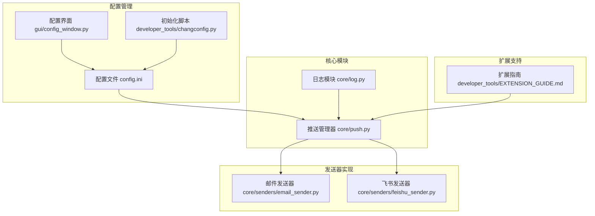
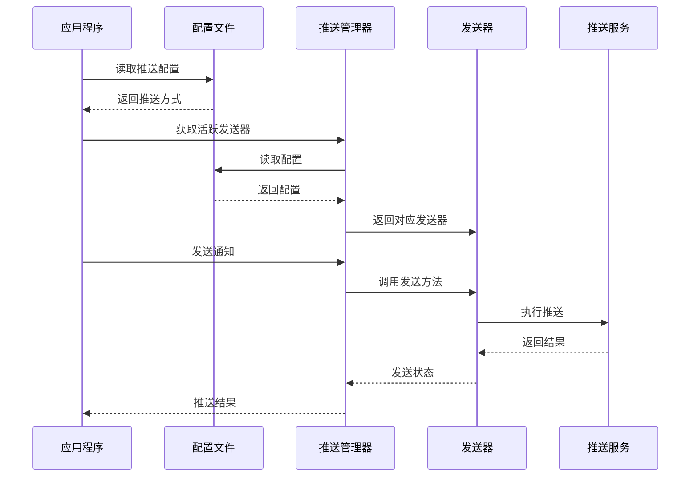
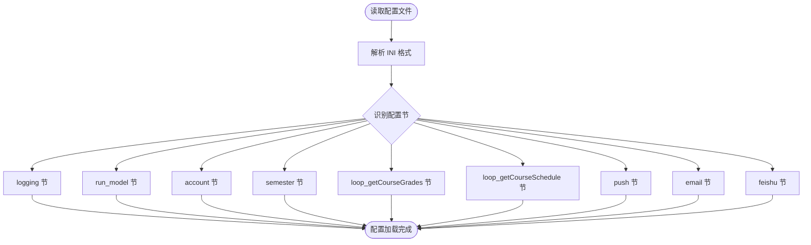
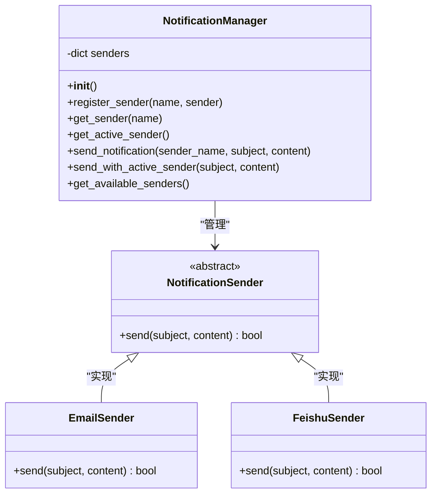
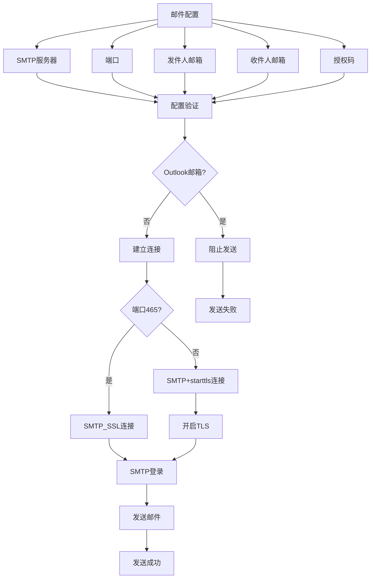
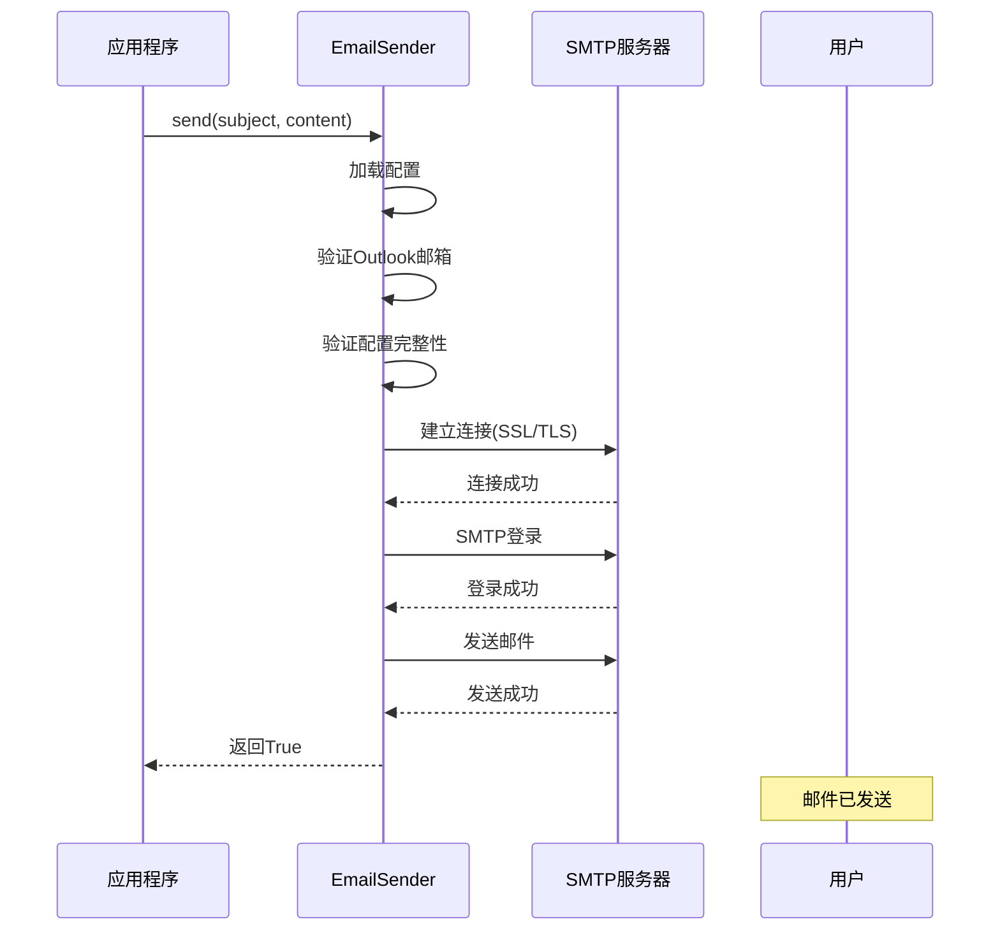
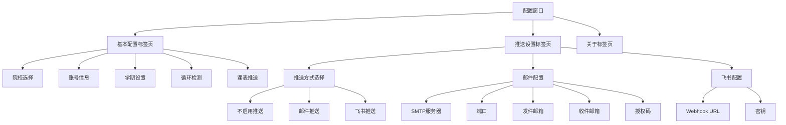
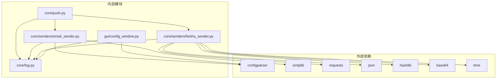

# 推送配置管理

<cite>
**本文引用的文件**
- [config.ini](file://config.ini)
- [config.md](file://config.md)
- [core/push.py](file://core/push.py)
- [core/senders/email_sender.py](file://core/senders/email_sender.py)
- [core/senders/feishu_sender.py](file://core/senders/feishu_sender.py)
- [core/log.py](file://core/log.py)
- [gui/config_window.py](file://gui/config_window.py)
- [developer_tools/changconfig.py](file://developer_tools/changconfig.py)
- [developer_tools/EXTENSION_GUIDE.md](file://developer_tools/EXTENSION_GUIDE.md)
- [README.md](file://README.md)
</cite>

## 目录
1. [简介](#简介)
2. [项目结构](#项目结构)
3. [核心组件](#核心组件)
4. [架构概览](#架构概览)
5. [详细组件分析](#详细组件分析)
6. [依赖关系分析](#依赖关系分析)
7. [性能考虑](#性能考虑)
8. [故障排除指南](#故障排除指南)
9. [结论](#结论)
10. [附录](#附录)

## 简介
本文件为 Capture_Push 推送配置管理系统的详细技术文档。系统提供灵活的消息推送能力，支持邮件和飞书等多种推送方式。本文档深入解释推送方式的配置机制、参数设置、验证规则，以及配置变更的生效机制、热更新支持和回滚策略。

## 项目结构
该项目采用模块化架构，核心推送功能集中在 core/push.py 中，具体的发送器实现分别位于 core/senders/ 目录下。配置文件采用 INI 格式，存储在用户 AppData 目录中，便于跨平台部署和用户自定义。



**图表来源**
- [core/push.py](file://core/push.py#L74-L163)
- [core/senders/email_sender.py](file://core/senders/email_sender.py#L47-L144)
- [core/senders/feishu_sender.py](file://core/senders/feishu_sender.py#L42-L110)
- [gui/config_window.py](file://gui/config_window.py#L44-L205)

**章节来源**
- [README.md](file://README.md#L60-L83)
- [config.ini](file://config.ini#L1-L36)

## 核心组件
推送配置管理系统由以下核心组件构成：

### 配置文件结构
系统使用 INI 格式的配置文件，包含多个独立的配置节：
- `[logging]`: 日志级别配置
- `[run_model]`: 运行模式配置（DEV/BUILD）
- `[account]`: 用户账号信息
- `[semester]`: 学期设置
- `[loop_getCourseGrades]`: 成绩循环检测配置
- `[loop_getCourseSchedule]`: 课表循环检测配置
- `[push]`: 推送方式配置
- `[email]`: 邮件推送配置
- `[feishu]`: 飞书推送配置

### 推送管理器
NotificationManager 类负责管理所有可用的推送方式，支持动态注册和切换不同的发送器。

### 发送器实现
- **EmailSender**: 实现 SMTP 邮件发送，支持 SSL/TLS 加密
- **FeishuSender**: 实现飞书机器人消息推送，支持签名校验

**章节来源**
- [config.ini](file://config.ini#L1-L36)
- [core/push.py](file://core/push.py#L74-L163)
- [core/senders/email_sender.py](file://core/senders/email_sender.py#L47-L144)
- [core/senders/feishu_sender.py](file://core/senders/feishu_sender.py#L42-L110)

## 架构概览
系统采用插件化架构，通过配置文件驱动推送方式的选择和切换。



**图表来源**
- [core/push.py](file://core/push.py#L107-L155)
- [core/senders/email_sender.py](file://core/senders/email_sender.py#L50-L144)
- [core/senders/feishu_sender.py](file://core/senders/feishu_sender.py#L45-L110)

## 详细组件分析

### 配置文件管理
配置文件采用 INI 格式，存储在用户 AppData 目录中，确保跨平台兼容性和用户权限要求。

#### 配置文件结构详解


**图表来源**
- [config.ini](file://config.ini#L1-L36)
- [core/log.py](file://core/log.py#L60-L82)

#### 配置验证机制
系统实现了多层次的配置验证：
1. **语法验证**: INI 格式解析验证
2. **完整性验证**: 关键配置项检查
3. **有效性验证**: 参数范围和格式验证
4. **连通性验证**: 实际连接测试

**章节来源**
- [config.ini](file://config.ini#L23-L36)
- [config.md](file://config.md#L19-L52)

### 推送管理器
NotificationManager 类是推送系统的核心控制器，负责管理发送器的生命周期和消息路由。



**图表来源**
- [core/push.py](file://core/push.py#L56-L163)

#### 推送方式选择机制
系统支持多种推送方式的动态选择和切换：

| 推送方式 | 配置值 | 描述 | 依赖配置节 |
|---------|--------|------|-----------|
| none | none | 不启用推送 | - |
| email | email | 邮件推送 | [email] |
| feishu | feishu | 飞书机器人推送 | [feishu] |
| test1 | test1 | 测试推送方式 | [test1] |

**章节来源**
- [core/push.py](file://core/push.py#L26-L53)
- [config.md](file://config.md#L19-L27)

### 邮件推送实现
EmailSender 类实现了基于 SMTP 的邮件推送功能，支持多种安全连接方式。

#### 邮件配置参数


**图表来源**
- [core/senders/email_sender.py](file://core/senders/email_sender.py#L65-L144)

#### 邮件发送流程


**图表来源**
- [core/senders/email_sender.py](file://core/senders/email_sender.py#L102-L126)

**章节来源**
- [core/senders/email_sender.py](file://core/senders/email_sender.py#L47-L144)

### 飞书推送实现
FeishuSender 类实现了飞书机器人的消息推送功能，支持可选的签名校验。

#### 飞书配置参数
| 参数名 | 必填 | 默认值 | 说明 |
|--------|------|--------|------|
| webhook_url | 是 | 空字符串 | 飞书机器人Webhook地址 |
| secret | 否 | 空字符串 | 签名密钥，启用签名校验 |

#### 飞书消息格式
系统将主题和内容合并为纯文本格式发送：
```
主题

内容
```

#### 签名生成机制
```mermaid
flowchart TD
Start([生成签名]) --> GetTime[获取当前时间戳]
GetTime --> Concat[拼接"timestamp+secret"]
Concat --> HMAC[HMAC-SHA256计算]
HMAC --> Base64[Base64编码]
Base64 --> Return[返回签名]
```

**图表来源**
- [core/senders/feishu_sender.py](file://core/senders/feishu_sender.py#L20-L27)

**章节来源**
- [core/senders/feishu_sender.py](file://core/senders/feishu_sender.py#L42-L110)

### 配置界面集成
GUI 界面提供了可视化的配置管理功能，支持实时编辑和验证。

#### 配置界面布局


**图表来源**
- [gui/config_window.py](file://gui/config_window.py#L156-L205)

**章节来源**
- [gui/config_window.py](file://gui/config_window.py#L44-L537)

## 依赖关系分析
系统采用松耦合的设计，各组件间通过清晰的接口进行交互。



**图表来源**
- [core/push.py](file://core/push.py#L7-L23)
- [core/senders/email_sender.py](file://core/senders/email_sender.py#L5-L15)
- [core/senders/feishu_sender.py](file://core/senders/feishu_sender.py#L2-L8)

**章节来源**
- [core/push.py](file://core/push.py#L1-L319)
- [core/senders/email_sender.py](file://core/senders/email_sender.py#L1-L144)
- [core/senders/feishu_sender.py](file://core/senders/feishu_sender.py#L1-L110)

## 性能考虑
系统在设计时充分考虑了性能优化和资源管理：

### 连接池管理
- **邮件连接**: 使用一次性连接，避免长时间保持连接
- **HTTP连接**: 飞书推送使用短连接，超时时间为10秒

### 内存优化
- **延迟初始化**: 日志记录器采用延迟初始化，减少启动开销
- **配置缓存**: 配置文件在进程内缓存，避免频繁磁盘访问

### 并发处理
- **异步发送**: 推送操作采用同步阻塞模式，确保消息顺序性
- **超时控制**: 所有网络操作设置合理超时，防止阻塞

## 故障排除指南

### 常见配置错误及解决方案

#### 邮件配置问题
**问题**: Outlook/Hotmail 邮箱无法发送
**原因**: Microsoft 已禁用基本认证
**解决方案**: 
1. 更换其他邮箱服务商（QQ、163、Gmail等）
2. 为账户启用两步验证并使用应用密码

**问题**: SMTP 认证失败
**原因**: 授权码错误或账户密码
**解决方案**:
1. 确认使用的是邮箱授权码而非登录密码
2. 检查 SMTP 服务器地址和端口配置

#### 飞书配置问题
**问题**: Webhook URL 无效
**解决方案**:
1. 确认飞书机器人已正确配置
2. 检查 Webhook URL 格式是否正确

**问题**: 签名验证失败
**解决方案**:
1. 确认密钥配置正确
2. 检查网络连接和防火墙设置

### 配置验证方法
系统提供了多种配置验证机制：

1. **语法验证**: INI 格式解析检查
2. **完整性验证**: 关键配置项存在性检查
3. **连通性测试**: 实际连接尝试
4. **格式验证**: 参数格式和范围检查

**章节来源**
- [core/senders/email_sender.py](file://core/senders/email_sender.py#L78-L91)
- [core/senders/feishu_sender.py](file://core/senders/feishu_sender.py#L52-L61)

## 结论
Capture_Push 推送配置管理系统提供了灵活、可靠的多方式推送能力。系统采用模块化设计，支持动态配置和扩展，具有完善的错误处理和日志记录机制。通过 INI 格式的配置文件和可视化界面，用户可以轻松配置和管理各种推送方式。

系统的主要优势包括：
- **灵活性**: 支持多种推送方式的动态切换
- **可靠性**: 完善的错误处理和日志记录
- **易用性**: 可视化配置界面和详细的帮助文档
- **可扩展性**: 清晰的扩展接口和开发指南

## 附录

### 配置参数完整参考

#### 基础配置参数
| 参数名 | 类型 | 默认值 | 说明 |
|--------|------|--------|------|
| level | 字符串 | INFO | 日志级别(DEBUG/INFO/WARNING/ERROR/CRITICAL) |
| model | 字符串 | BUILD | 运行模式(DEV/BUILD) |
| school_code | 字符串 | 10546 | 院校代码 |
| username | 字符串 | 空 | 学号 |
| password | 字符串 | 空 | 密码 |

#### 推送配置参数
| 参数名 | 类型 | 默认值 | 说明 |
|--------|------|--------|------|
| method | 字符串 | none | 推送方式(none/email/feishu/test1/wechat/dingtalk/telegram) |
| enabled | 布尔值 | False | 是否启用循环检测 |
| time | 整数 | 3600 | 检测间隔(秒) |

#### 邮件配置参数
| 参数名 | 类型 | 默认值 | 说明 |
|--------|------|--------|------|
| smtp | 字符串 | smtp.example.com | SMTP服务器地址 |
| port | 整数 | 465 | SMTP端口号 |
| sender | 字符串 | your_email@example.com | 发件人邮箱 |
| receiver | 字符串 | target_email@example.com | 收件人邮箱 |
| auth | 字符串 | your_email_password_or_auth_code | 邮箱授权码 |

#### 飞书配置参数
| 参数名 | 类型 | 默认值 | 说明 |
|--------|------|--------|------|
| webhook_url | 字符串 | https://... | 飞书机器人Webhook地址 |
| secret | 字符串 | 空 | 签名密钥 |

### 配置变更生效机制
系统采用以下机制确保配置变更的有效性：
1. **即时生效**: 配置文件保存后立即生效
2. **热更新支持**: 运行时动态读取最新配置
3. **回滚策略**: 支持配置文件的版本管理和备份恢复

### 扩展新推送方式
系统提供了完整的扩展指南，支持添加新的推送方式：
1. 创建发送器类实现 send 方法
2. 在 NotificationManager 中注册发送器
3. 更新配置文件和 GUI 界面
4. 添加相应的配置验证逻辑

**章节来源**
- [config.md](file://config.md#L1-L52)
- [developer_tools/EXTENSION_GUIDE.md](file://developer_tools/EXTENSION_GUIDE.md#L7-L57)