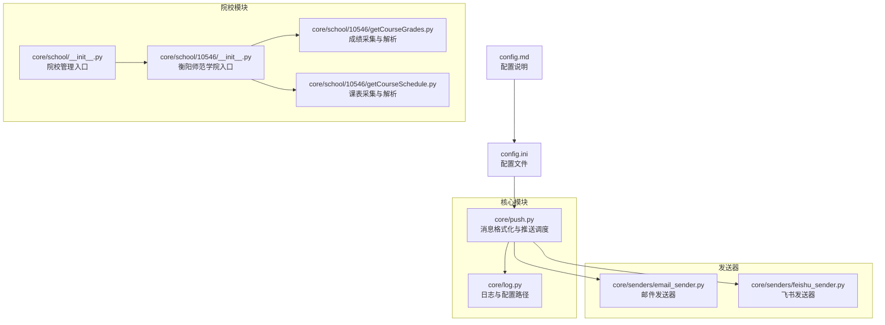
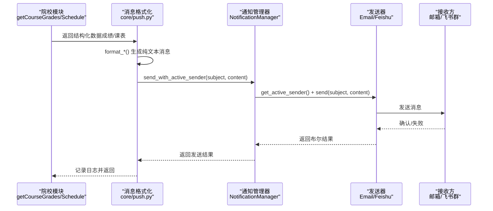
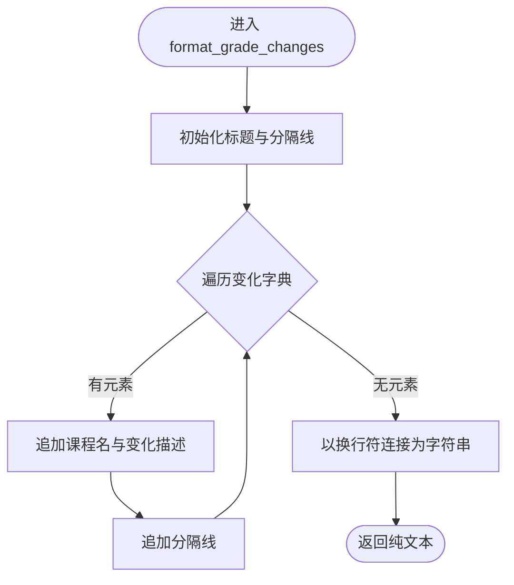
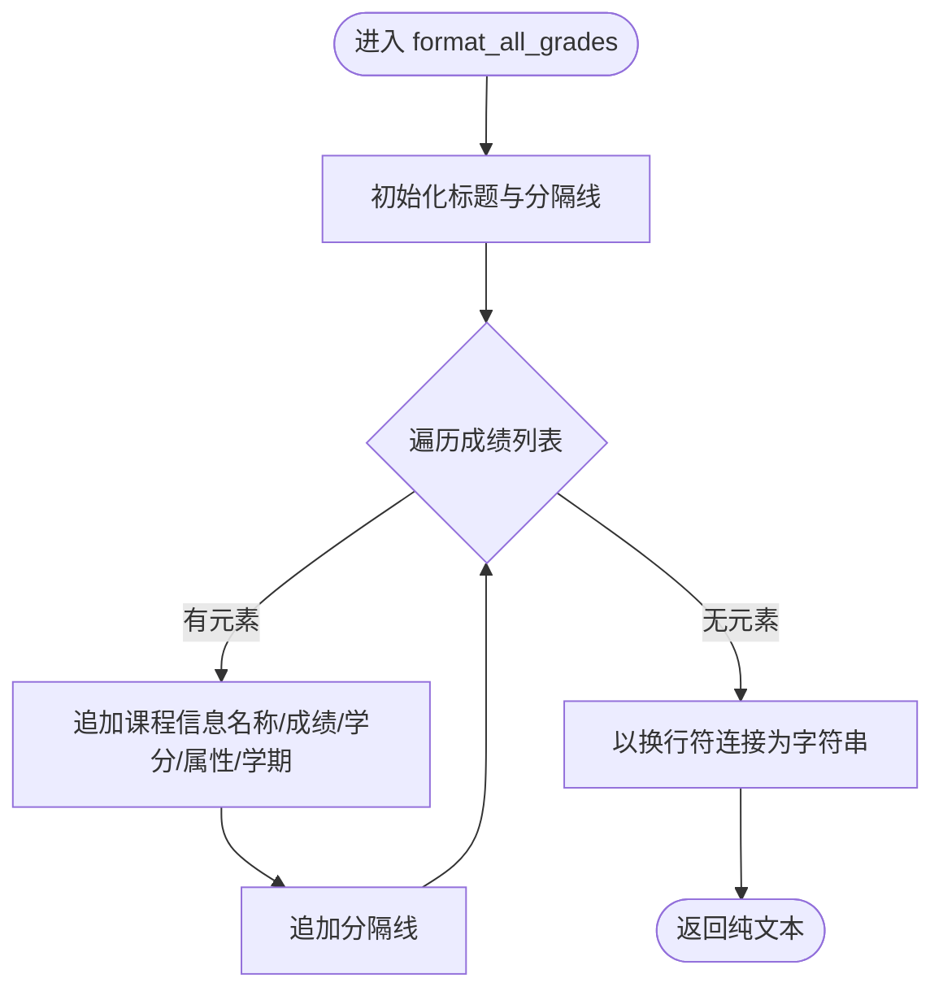
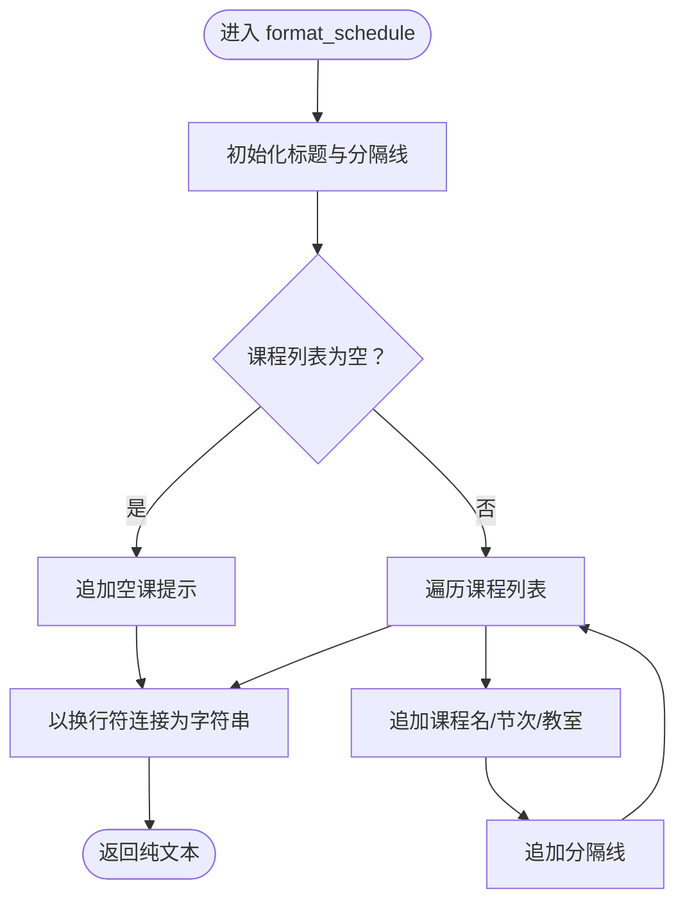
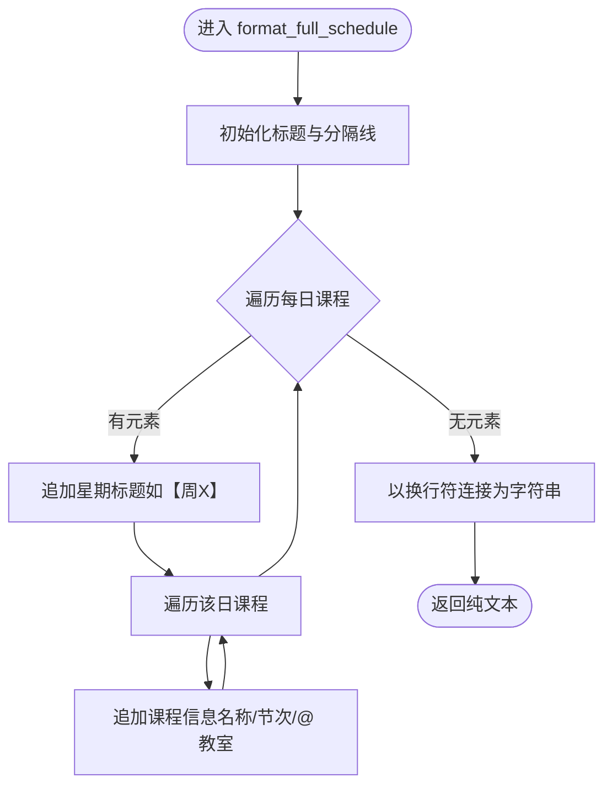
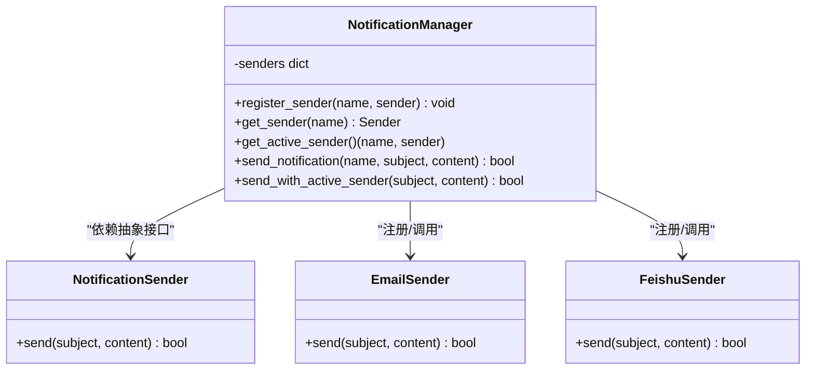
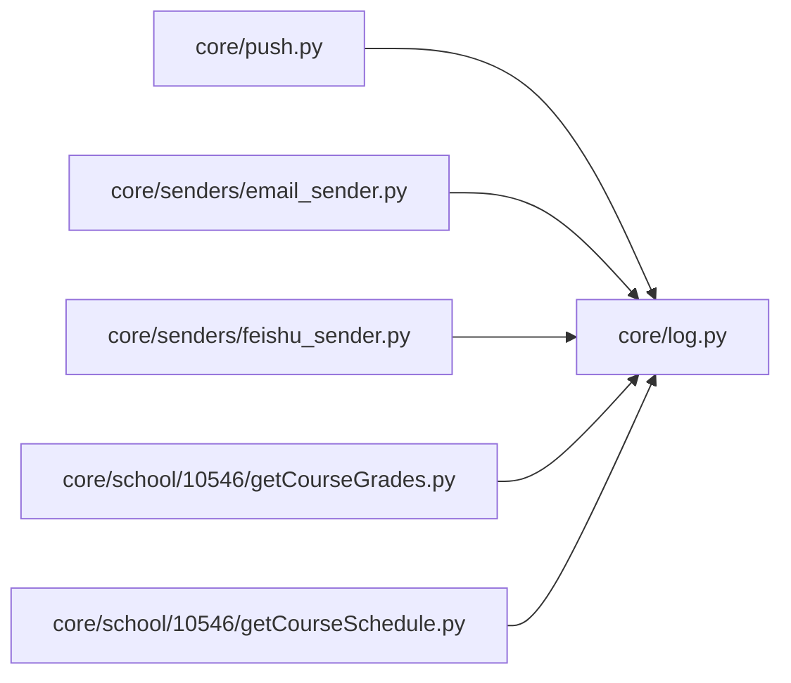

# 消息格式化系统

<cite>
**本文引用的文件**
- [core/push.py](file://core/push.py)
- [core/school/10546/getCourseGrades.py](file://core/school/10546/getCourseGrades.py)
- [core/school/10546/getCourseSchedule.py](file://core/school/10546/getCourseSchedule.py)
- [core/school/__init__.py](file://core/school/__init__.py)
- [core/school/10546/__init__.py](file://core/school/10546/__init__.py)
- [core/senders/email_sender.py](file://core/senders/email_sender.py)
- [core/senders/feishu_sender.py](file://core/senders/feishu_sender.py)
- [core/log.py](file://core/log.py)
- [config.ini](file://config.ini)
- [config.md](file://config.md)
- [README.md](file://README.md)
- [developer_tools/EXTENSION_GUIDE.md](file://developer_tools/EXTENSION_GUIDE.md)
</cite>

## 目录
1. [简介](#简介)
2. [项目结构](#项目结构)
3. [核心组件](#核心组件)
4. [架构总览](#架构总览)
5. [详细组件分析](#详细组件分析)
6. [依赖关系分析](#依赖关系分析)
7. [性能考量](#性能考量)
8. [故障排查指南](#故障排查指南)
9. [结论](#结论)
10. [附录](#附录)

## 简介
本文件面向“消息格式化系统”，聚焦于以下方面：
- 成绩变化消息、全部成绩列表、课表消息与完整课表的格式化实现原理
- 纯文本格式的设计思路、换行符处理与字符编码问题
- 消息模板的结构设计、占位符替换与动态内容生成机制
- 最佳实践：可读性优化、长度限制与兼容性考虑
- 自定义消息模板的开发方法与扩展新消息类型的实现步骤

## 项目结构
消息格式化系统位于 core/push.py，围绕纯文本格式化函数组织，配合发送器实现（邮件、飞书等）完成最终推送。院校模块负责采集原始数据，格式化模块将其转换为人类可读的纯文本消息，再由发送器投递到目标平台。

图表来源
- [core/push.py](file://core/push.py#L1-L319)
- [core/school/__init__.py](file://core/school/__init__.py#L1-L28)
- [core/school/10546/__init__.py](file://core/school/10546/__init__.py#L1-L7)
- [core/school/10546/getCourseGrades.py](file://core/school/10546/getCourseGrades.py#L1-L329)
- [core/school/10546/getCourseSchedule.py](file://core/school/10546/getCourseSchedule.py#L1-L405)
- [core/senders/email_sender.py](file://core/senders/email_sender.py#L1-L144)
- [core/senders/feishu_sender.py](file://core/senders/feishu_sender.py#L1-L110)
- [core/log.py](file://core/log.py#L1-L211)
- [config.ini](file://config.ini#L1-L36)
- [config.md](file://config.md#L1-L52)

章节来源
- [README.md](file://README.md#L60-L83)
- [config.md](file://config.md#L1-L52)

## 核心组件
- 消息格式化模块（core/push.py）
  - 提供纯文本格式化函数：成绩变化、全部成绩、课表、完整课表
  - 提供便捷发送函数：对应主题与内容的组合
  - 抽象发送器接口与通知管理器，支持多发送器注册与切换
- 发送器实现
  - 邮件发送器：基于 SMTP/SSL、starttls，支持 Outlook 等邮箱的认证限制提示
  - 飞书发送器：基于 Webhook，支持签名校验
- 院校模块
  - 衡阳师范学院模块：提供 fetch_grades 与 fetch_course_schedule，返回结构化数据
  - 院校管理入口：动态发现与导入院校模块
- 日志与配置
  - 统一日志：AppData 目录，按日期命名，支持清理与轮转
  - 配置文件：config.ini，集中管理推送方式、运行模式、循环检测等

章节来源
- [core/push.py](file://core/push.py#L56-L319)
- [core/senders/email_sender.py](file://core/senders/email_sender.py#L47-L144)
- [core/senders/feishu_sender.py](file://core/senders/feishu_sender.py#L42-L110)
- [core/school/10546/getCourseGrades.py](file://core/school/10546/getCourseGrades.py#L278-L296)
- [core/school/10546/getCourseSchedule.py](file://core/school/10546/getCourseSchedule.py#L354-L372)
- [core/school/__init__.py](file://core/school/__init__.py#L22-L28)
- [core/log.py](file://core/log.py#L114-L195)
- [config.ini](file://config.ini#L1-L36)

## 架构总览
消息从“采集-格式化-发送”三段式流转：
- 采集阶段：院校模块抓取 HTML 并解析为结构化数据
- 格式化阶段：push.py 将结构化数据转换为纯文本消息
- 发送阶段：通知管理器选择发送器，调用具体发送器实现

图表来源
- [core/push.py](file://core/push.py#L138-L155)
- [core/senders/email_sender.py](file://core/senders/email_sender.py#L50-L126)
- [core/senders/feishu_sender.py](file://core/senders/feishu_sender.py#L45-L109)
- [core/school/10546/getCourseGrades.py](file://core/school/10546/getCourseGrades.py#L278-L296)
- [core/school/10546/getCourseSchedule.py](file://core/school/10546/getCourseSchedule.py#L354-L372)

## 详细组件分析

### 成绩变化消息格式化（format_grade_changes）
- 输入：变化字典，key 为课程名称，value 为变化描述
- 输出：纯文本消息，包含标题、分隔线与逐条课程变化
- 设计要点：
  - 使用固定标题与分隔线增强可读性
  - 逐条遍历拼接，保证顺序稳定
  - 通过换行符连接，便于后续发送器处理

图表来源
- [core/push.py](file://core/push.py#L184-L204)

章节来源
- [core/push.py](file://core/push.py#L184-L204)

### 全部成绩列表格式化（format_all_grades）
- 输入：成绩列表，每项包含课程名称、成绩、学分、课程属性、学期
- 输出：纯文本消息，包含标题、分隔线与逐条课程信息
- 设计要点：
  - 信息密度适中，每条课程占多行
  - 使用分隔线区分不同课程
  - 通过换行符连接，便于阅读与截断

图表来源
- [core/push.py](file://core/push.py#L207-L228)

章节来源
- [core/push.py](file://core/push.py#L207-L228)

### 课表消息格式化（format_schedule）
- 输入：课程列表（含课程名称、开始/结束小节、教室）、周数、星期、标题前缀
- 输出：纯文本消息，包含标题（周数+星期+标题前缀）、分隔线与逐条课程信息
- 设计要点：
  - 当课程为空时输出“今天没有课”的友好提示
  - 使用统一的“节次”格式，便于阅读
  - 通过换行符连接，便于后续发送器处理

图表来源
- [core/push.py](file://core/push.py#L231-L258)

章节来源
- [core/push.py](file://core/push.py#L231-L258)

### 完整课表格式化（format_full_schedule）
- 输入：按星期分组的课程列表、总周数
- 输出：纯文本消息，包含标题（总周数）、按星期分组的课程列表
- 设计要点：
  - 每个星期块前添加“【周X】”标题
  - 使用统一的“课程名（节次）@ 教室”格式
  - 通过换行符连接，便于阅读与截断

图表来源
- [core/push.py](file://core/push.py#L261-L286)

章节来源
- [core/push.py](file://core/push.py#L261-L286)

### 纯文本格式设计与字符编码
- 设计思路
  - 采用“标题-分隔线-内容-分隔线”的层次化结构，提升可读性
  - 使用统一的换行符（\n）连接各段落，便于跨平台传输
  - 优先使用 ASCII 符号（如“-”、“—”、“/”）与表情符号（如📈📊📚📖），兼顾兼容性
- 换行符处理
  - 所有格式化函数均使用“\n”连接，确保在不同平台（Windows/Linux/macOS）上一致显示
- 字符编码
  - 统一使用 UTF-8 编码：日志文件、配置文件、发送器正文均以 UTF-8 写入/读取
  - 发送器在构建 MIME 文本时指定 charset=utf-8，避免乱码

章节来源
- [core/push.py](file://core/push.py#L184-L286)
- [core/senders/email_sender.py](file://core/senders/email_sender.py#L93-L99)
- [core/log.py](file://core/log.py#L181-L189)

### 消息模板结构与动态内容生成
- 结构设计
  - 固定标题区：如“📈 成绩更新提醒”、“📊 全部成绩列表”、“📚 第 X 周 · 课表（周X）”
  - 分隔线区：统一使用“-”或“=”分隔，增强视觉层次
  - 动态内容区：根据输入数据动态拼接，如课程名、节次、教室、学分、属性等
- 占位符替换
  - 本系统未使用外部模板引擎，而是通过字符串拼接与格式化函数实现“占位符替换”
  - 示例：format_schedule 中将周数、星期、课程信息拼接到固定模板位置
- 动态内容生成
  - 依据输入数据类型与数量动态生成内容块，如空课提示、分组标题等

章节来源
- [core/push.py](file://core/push.py#L184-L286)

### 发送器集成与消息投递
- 通知管理器
  - 自动注册邮件与飞书发送器
  - 根据配置读取当前启用的推送方式，动态选择发送器
- 邮件发送器
  - 支持 SMTP_SSL（端口 465）与 starttls（端口 587）两种加密方式
  - 对 Outlook/Hotmail 基本认证限制进行提示与引导
- 飞书发送器
  - 支持签名校验（timestamp+secret），通过查询参数附加到 webhook URL
  - 将 subject 与 content 合并为纯文本发送

图表来源
- [core/push.py](file://core/push.py#L56-L160)
- [core/senders/email_sender.py](file://core/senders/email_sender.py#L47-L144)
- [core/senders/feishu_sender.py](file://core/senders/feishu_sender.py#L42-L110)

章节来源
- [core/push.py](file://core/push.py#L56-L160)
- [core/senders/email_sender.py](file://core/senders/email_sender.py#L47-L144)
- [core/senders/feishu_sender.py](file://core/senders/feishu_sender.py#L42-L110)

### 院校模块与数据源对接
- 院校模块职责
  - 衡阳师范学院模块提供 fetch_grades 与 fetch_course_schedule，返回结构化数据
  - 通过登录、抓取 HTML、解析表格等步骤，输出统一的数据结构
- 数据结构约定
  - 成绩：包含课程名称、成绩、学分、课程属性、学期
  - 课表：包含星期、开始/结束小节、课程名称、教室、教师、周次列表
- 动态加载
  - 通过 core/school/__init__.py 动态发现并导入院校模块，支持扩展新院校

章节来源
- [core/school/10546/getCourseGrades.py](file://core/school/10546/getCourseGrades.py#L278-L296)
- [core/school/10546/getCourseSchedule.py](file://core/school/10546/getCourseSchedule.py#L354-L372)
- [core/school/__init__.py](file://core/school/__init__.py#L22-L28)
- [core/school/10546/__init__.py](file://core/school/10546/__init__.py#L1-L7)

## 依赖关系分析
- 模块耦合
  - core/push.py 依赖 core/log.py（日志与配置路径）
  - 发送器实现依赖 core/log.py（日志与配置路径）
  - 院校模块依赖 core/log.py（日志与配置路径）
- 外部依赖
  - requests（发送器与采集模块）
  - BeautifulSoup（HTML 解析）
  - configparser（配置读取）
  - logging（日志系统）

图表来源
- [core/push.py](file://core/push.py#L10-L24)
- [core/senders/email_sender.py](file://core/senders/email_sender.py#L11-L27)
- [core/senders/feishu_sender.py](file://core/senders/feishu_sender.py#L11-L41)
- [core/school/10546/getCourseGrades.py](file://core/school/10546/getCourseGrades.py#L19-L29)
- [core/school/10546/getCourseSchedule.py](file://core/school/10546/getCourseSchedule.py#L19-L30)

章节来源
- [core/push.py](file://core/push.py#L10-L24)
- [core/senders/email_sender.py](file://core/senders/email_sender.py#L11-L27)
- [core/senders/feishu_sender.py](file://core/senders/feishu_sender.py#L11-L41)
- [core/school/10546/getCourseGrades.py](file://core/school/10546/getCourseGrades.py#L19-L29)
- [core/school/10546/getCourseSchedule.py](file://core/school/10546/getCourseSchedule.py#L19-L30)

## 性能考量
- 纯文本拼接开销低：格式化函数使用简单字符串拼接，CPU 与内存开销极小
- 发送器性能
  - 邮件发送器：根据端口选择加密方式，避免不必要的握手开销
  - 飞书发送器：使用 JSON 负载与短文本合并，减少网络传输体积
- 日志与配置
  - 统一日志文件按日期命名，避免单文件过大；轮转与清理策略降低磁盘压力
- 可扩展性
  - 通知管理器支持动态注册发送器，便于扩展新平台

[本节为通用性能讨论，无需引用具体文件]

## 故障排查指南
- 邮件发送失败
  - Outlook/Hotmail 基本认证被禁用：系统会提示并建议使用应用密码
  - SMTP 认证失败：检查 SMTP 地址、端口、发件人、收件人与授权码
  - 端口选择：465 使用 SSL，587 使用 starttls
- 飞书发送失败
  - 检查 webhook_url 与 secret 配置
  - 若配置了 secret，确认签名参数正确附加到 URL
- 日志定位
  - 所有模块使用统一日志初始化，日志文件位于 %LOCALAPPDATA%\Capture_Push
  - 可使用日志打包功能生成压缩报告，便于问题复现

章节来源
- [core/senders/email_sender.py](file://core/senders/email_sender.py#L78-L143)
- [core/senders/feishu_sender.py](file://core/senders/feishu_sender.py#L52-L109)
- [core/log.py](file://core/log.py#L18-L57)

## 结论
消息格式化系统以“纯文本 + 统一接口 + 多发送器”为核心设计，实现了：
- 明确的格式化函数族，覆盖成绩变化、全部成绩、课表与完整课表
- 简洁稳定的纯文本结构，兼顾可读性与跨平台兼容
- 可扩展的通知管理器与发送器体系，便于接入新平台
- 完善的日志与配置管理，保障运行稳定性与可维护性

[本节为总结，无需引用具体文件]

## 附录

### 最佳实践指南
- 可读性优化
  - 使用固定标题与分隔线，形成清晰的信息层级
  - 控制每行字符宽度，避免过长导致阅读困难
- 长度限制
  - 邮件正文长度受 SMTP/IMAP 限制，建议控制在合理范围
  - 飞书消息长度有限制，必要时拆分为多条消息
- 兼容性考虑
  - 统一使用 UTF-8 编码，避免乱码
  - 优先使用 ASCII 符号与表情符号，提高跨平台一致性
- 模板扩展
  - 通过增加格式化函数或调整现有函数的拼接逻辑，实现更丰富的展示效果
  - 保持输入数据结构稳定，便于模板层复用

[本节为通用指导，无需引用具体文件]

### 自定义消息模板开发方法
- 新增格式化函数
  - 在 core/push.py 中新增 format_* 函数，遵循现有风格（标题、分隔线、动态内容）
  - 保持输入数据结构与现有函数一致，便于统一调度
- 动态内容生成
  - 依据输入数据类型与数量动态生成内容块，如空课提示、分组标题
  - 使用统一的换行符与字符集，确保跨平台一致
- 便捷发送函数
  - 在 core/push.py 中新增 send_*_mail 函数，调用对应 format_* 与 send_with_active_sender

章节来源
- [core/push.py](file://core/push.py#L182-L319)

### 扩展新消息类型的实现步骤
- 定义数据结构
  - 明确新消息类型所需的数据字段（如课程名称、节次、教室等）
- 实现格式化函数
  - 在 core/push.py 中新增 format_* 函数，输出纯文本
- 注册便捷发送函数
  - 在 core/push.py 中新增 send_*_mail 函数，调用 format_* 与 send_with_active_sender
- 集成发送器
  - 确保发送器实现支持纯文本内容（如邮件发送器已内置 MIME 文本支持）
- 测试与验证
  - 使用真实数据或模拟数据验证格式化结果与发送器行为

章节来源
- [core/push.py](file://core/push.py#L182-L319)
- [core/senders/email_sender.py](file://core/senders/email_sender.py#L93-L99)

### 扩展新推送方式（Sender）的实现步骤
- 创建发送器文件
  - 在 core/senders/ 下创建新文件，实现 send(subject, content) 方法
- 在通知管理器中注册
  - 修改 NotificationManager._register_available_senders()，注册新发送器
- 更新配置与 GUI
  - 在 config.ini 中添加对应配置节，在 GUI 中添加选项
- 参考扩展指南
  - 详细步骤与示例可参考 developer_tools/EXTENSION_GUIDE.md

章节来源
- [developer_tools/EXTENSION_GUIDE.md](file://developer_tools/EXTENSION_GUIDE.md#L7-L57)
- [core/push.py](file://core/push.py#L83-L97)