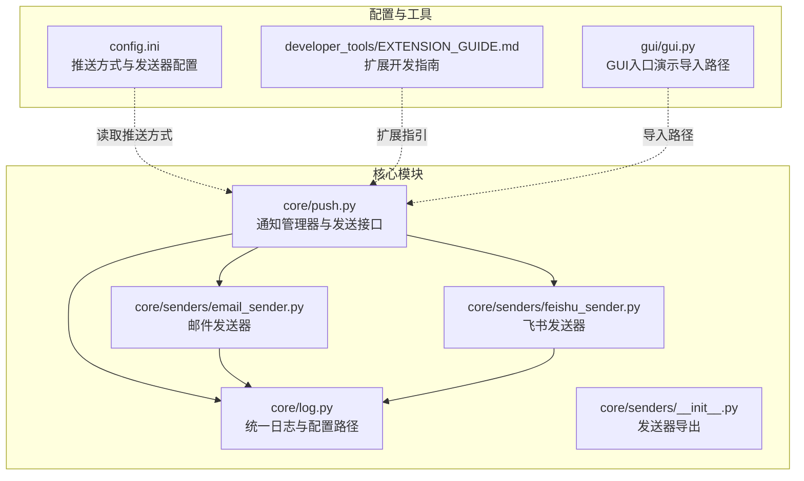
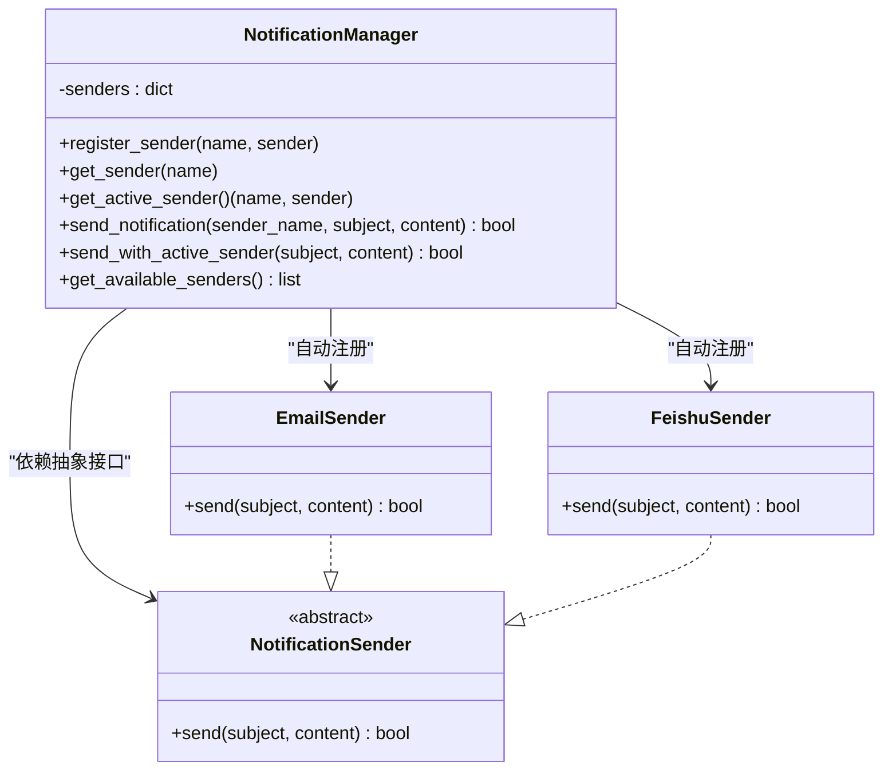
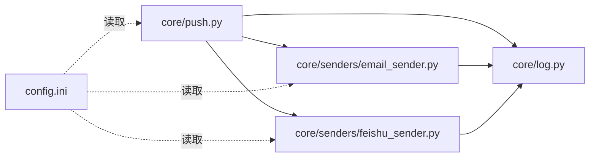

# 通知管理器

<cite>
**本文引用的文件**
- [core/push.py](file://core/push.py)
- [core/senders/email_sender.py](file://core/senders/email_sender.py)
- [core/senders/feishu_sender.py](file://core/senders/feishu_sender.py)
- [core/senders/__init__.py](file://core/senders/__init__.py)
- [core/log.py](file://core/log.py)
- [config.ini](file://config.ini)
- [developer_tools/EXTENSION_GUIDE.md](file://developer_tools/EXTENSION_GUIDE.md)
- [gui/gui.py](file://gui/gui.py)
</cite>

## 目录
1. [简介](#简介)
2. [项目结构](#项目结构)
3. [核心组件](#核心组件)
4. [架构总览](#架构总览)
5. [组件详解](#组件详解)
6. [依赖关系分析](#依赖关系分析)
7. [性能与可靠性](#性能与可靠性)
8. [故障排查指南](#故障排查指南)
9. [结论](#结论)
10. [附录：使用示例与最佳实践](#附录使用示例与最佳实践)

## 简介
本技术文档围绕通知管理器（NotificationManager）展开，系统性阐述其架构设计、发送器注册机制、活跃发送器选择逻辑、统一发送接口，以及如何通过配置文件动态切换不同推送方式。文档还说明了通知管理器在系统中的核心作用、与其他组件的交互关系与依赖注入模式，并提供可直接定位到源码的“代码片段路径”，帮助开发者快速上手与扩展。

## 项目结构
通知管理器位于核心模块中，配合发送器实现与统一日志模块协同工作；配置文件集中于 AppData 目录下的 config.ini，用于控制推送方式与各发送器的参数。

图表来源
- [core/push.py](file://core/push.py#L1-L319)
- [core/senders/email_sender.py](file://core/senders/email_sender.py#L1-L144)
- [core/senders/feishu_sender.py](file://core/senders/feishu_sender.py#L1-L110)
- [core/senders/__init__.py](file://core/senders/__init__.py#L1-L10)
- [core/log.py](file://core/log.py#L1-L211)
- [config.ini](file://config.ini#L1-L36)
- [developer_tools/EXTENSION_GUIDE.md](file://developer_tools/EXTENSION_GUIDE.md#L1-L102)
- [gui/gui.py](file://gui/gui.py#L1-L24)

章节来源
- [core/push.py](file://core/push.py#L1-L319)
- [core/log.py](file://core/log.py#L1-L211)
- [config.ini](file://config.ini#L1-L36)

## 核心组件
- 通知管理器（NotificationManager）：负责发送器注册、活跃发送器选择、统一发送接口与便捷发送函数。
- 抽象发送器接口（NotificationSender）：定义统一的 send(subject, content) 接口。
- 具体发送器实现：
  - 邮件发送器（EmailSender）
  - 飞书发送器（FeishuSender）
- 统一日志模块（core/log.py）：提供统一日志初始化、配置路径获取与日志文件管理。
- 配置文件（config.ini）：集中存储推送方式与各发送器参数。

章节来源
- [core/push.py](file://core/push.py#L56-L160)
- [core/senders/email_sender.py](file://core/senders/email_sender.py#L47-L144)
- [core/senders/feishu_sender.py](file://core/senders/feishu_sender.py#L42-L110)
- [core/log.py](file://core/log.py#L60-L195)
- [config.ini](file://config.ini#L23-L36)

## 架构总览
通知管理器采用“抽象接口 + 多实现 + 动态配置”的架构模式：
- 通过抽象接口约束所有发送器的统一行为；
- 在初始化阶段自动注册可用发送器；
- 通过配置文件动态决定当前活跃发送器；
- 提供两类发送接口：显式指定发送器名称与使用当前活跃发送器。

图表来源
- [core/push.py](file://core/push.py#L56-L160)
- [core/senders/email_sender.py](file://core/senders/email_sender.py#L47-L144)
- [core/senders/feishu_sender.py](file://core/senders/feishu_sender.py#L42-L110)

## 组件详解

### 通知管理器（NotificationManager）
- 初始化与自动注册
  - 在构造函数中调用内部方法自动注册可用发送器（如邮件、飞书）。
  - 若某发送器注册失败，记录警告日志但不影响其他发送器。
- 发送器注册与获取
  - register_sender(name, sender)：手动注册新的发送器。
  - get_sender(name)：按名称获取发送器实例。
  - get_available_senders()：返回可用发送器名称列表。
- 活跃发送器选择
  - get_active_sender()：从配置文件读取当前推送方式，若为 none 则不启用；否则返回对应发送器实例。
  - is_push_enabled()：判断是否启用任何推送方式。
- 统一发送接口
  - send_notification(sender_name, subject, content)：显式指定发送器名称进行发送。
  - send_with_active_sender(subject, content)：使用当前活跃发送器发送。
- 全局实例
  - notification_manager：全局单例，便于跨模块调用。

章节来源
- [core/push.py](file://core/push.py#L74-L160)
- [core/push.py](file://core/push.py#L26-L53)

### 抽象发送器接口（NotificationSender）
- 定义统一的 send(subject, content) 接口，要求返回布尔值表示发送是否成功。
- 所有具体发送器均需实现该接口，保证调用方无需关心底层差异。

章节来源
- [core/push.py](file://core/push.py#L56-L71)

### 邮件发送器（EmailSender）
- 配置加载
  - 通过统一日志模块提供的配置路径加载 config.ini，读取 [email] 节的 SMTP、端口、发件人、收件人、授权码等参数。
- 安全与兼容性
  - 拒绝 Outlook/Hotmail 等邮箱的基本认证场景，提示改用其他邮箱或应用密码。
  - 根据端口选择 SMTP_SSL（465）或 starttls（587/其他）加密方式。
- 发送流程
  - 构建 MIME 文本消息，登录 SMTP 服务器并发送，记录成功/失败日志。
- 错误处理
  - 认证失败、网络异常、配置缺失等均捕获并返回 False，同时打印友好提示。

章节来源
- [core/senders/email_sender.py](file://core/senders/email_sender.py#L37-L144)
- [core/log.py](file://core/log.py#L60-L82)

### 飞书发送器（FeishuSender）
- 配置加载
  - 读取 [feishu] 节的 webhook_url 与可选 secret。
- 签名与安全
  - 若配置了 secret，按飞书要求生成签名并附加到请求 URL。
- 发送流程
  - 构造 text 类型消息体，POST 请求至飞书 Webhook，解析响应状态码判断发送结果。
- 错误处理
  - 网络异常、签名生成失败、响应非成功等情况均返回 False 并记录日志。

章节来源
- [core/senders/feishu_sender.py](file://core/senders/feishu_sender.py#L20-L110)
- [core/log.py](file://core/log.py#L60-L82)

### 配置文件与动态切换
- 配置文件位置
  - 统一通过 core/log.py 的 get_config_path() 获取 AppData 目录下的 config.ini。
- 推送方式
  - [push] 节的 method 字段控制当前启用的推送方式；默认 none 表示不启用。
- 各发送器配置
  - [email] 节：smtp、port、sender、receiver、auth。
  - [feishu] 节：webhook_url、secret。

章节来源
- [config.ini](file://config.ini#L23-L36)
- [core/log.py](file://core/log.py#L60-L82)
- [core/push.py](file://core/push.py#L26-L43)

### 便捷发送函数
通知管理器提供针对常见场景的便捷函数，内部统一使用当前活跃发送器：
- 成绩变化：send_grade_mail(...)
- 全部成绩：send_all_grades_mail(...)
- 明日/今日课表：send_schedule_mail(...)、send_today_schedule_mail(...)
- 完整学期课表：send_full_schedule_mail(...)

章节来源
- [core/push.py](file://core/push.py#L289-L319)

## 依赖关系分析
- 模块耦合
  - NotificationManager 依赖 NotificationSender 抽象接口，依赖 EmailSender 与 FeishuSender 实现，但通过名称注册解耦具体实现。
  - EmailSender 与 FeishuSender 依赖 core/log.py 提供的统一日志与配置路径。
- 配置耦合
  - get_push_method() 与各发送器的配置读取均依赖 config.ini 的 [push] 与 [email]/[feishu] 节。
- 外部依赖
  - 邮件发送依赖 smtplib、email 库；飞书发送依赖 requests、hmac、hashlib、base64、time。
- 可能的循环依赖
  - 当前结构清晰，未发现循环导入；发送器通过延迟导入（飞书）降低初始化成本。

图表来源
- [core/push.py](file://core/push.py#L1-L319)
- [core/senders/email_sender.py](file://core/senders/email_sender.py#L1-L144)
- [core/senders/feishu_sender.py](file://core/senders/feishu_sender.py#L1-L110)
- [core/log.py](file://core/log.py#L1-L211)
- [config.ini](file://config.ini#L1-L36)

章节来源
- [core/push.py](file://core/push.py#L1-L319)
- [core/senders/email_sender.py](file://core/senders/email_sender.py#L1-L144)
- [core/senders/feishu_sender.py](file://core/senders/feishu_sender.py#L1-L110)
- [core/log.py](file://core/log.py#L1-L211)
- [config.ini](file://config.ini#L1-L36)

## 性能与可靠性
- 初始化性能
  - 飞书发送器采用延迟导入，避免不必要的模块加载开销。
- 发送性能
  - 邮件发送根据端口选择加密方式，减少握手失败概率；飞书发送使用超时控制，避免阻塞。
- 可靠性
  - 统一日志记录关键步骤与异常，便于定位问题。
  - 配置缺失与认证失败均有明确提示，提升用户体验。
- 资源管理
  - 日志文件采用滚动与自动清理策略，避免磁盘占用过大。

章节来源
- [core/senders/feishu_sender.py](file://core/senders/feishu_sender.py#L90-L110)
- [core/senders/email_sender.py](file://core/senders/email_sender.py#L102-L143)
- [core/log.py](file://core/log.py#L85-L112)
- [core/log.py](file://core/log.py#L181-L190)

## 故障排查指南
- 无法启用推送
  - 检查 [push] method 是否为 none；若为 none 则不会启用任何发送器。
  - 确认 get_active_sender() 返回值是否为 (None, None)。
- 邮件发送失败
  - 检查 [email] 配置项是否完整且正确；Outlook/Hotmail 不支持基本认证。
  - 关注认证失败提示，考虑使用应用密码。
- 飞书发送失败
  - 检查 [feishu] webhook_url 是否有效；若配置了 secret，确认签名生成逻辑。
  - 观察响应 JSON 中的 code 与 msg 字段。
- 日志定位
  - 查看统一日志文件（按日期命名），关注模块名与错误堆栈。

章节来源
- [core/push.py](file://core/push.py#L107-L155)
- [core/senders/email_sender.py](file://core/senders/email_sender.py#L71-L91)
- [core/senders/email_sender.py](file://core/senders/email_sender.py#L127-L143)
- [core/senders/feishu_sender.py](file://core/senders/feishu_sender.py#L52-L61)
- [core/senders/feishu_sender.py](file://core/senders/feishu_sender.py#L98-L109)
- [core/log.py](file://core/log.py#L131-L195)

## 结论
通知管理器通过抽象接口与动态配置实现了高扩展性与易用性：既能在初始化阶段自动注册可用发送器，又允许通过配置文件灵活切换推送方式；同时，统一日志与完善的错误处理提升了系统的可观测性与稳定性。对于新增推送方式，只需实现统一接口并在通知管理器中注册即可，符合开闭原则与最小改动原则。

## 附录：使用示例与最佳实践
以下示例均提供“代码片段路径”，便于直接定位到源码实现。

- 使用当前活跃发送器发送通知
  - 示例路径：[send_with_active_sender 调用示例](file://core/push.py#L291-L319)
  - 说明：便捷函数内部统一调用 send_with_active_sender，自动读取配置并发送。

- 显式指定发送器名称发送
  - 示例路径：[send_notification 调用示例](file://core/push.py#L166-L179)
  - 说明：适用于需要强制使用某一发送器的场景。

- 手动注册发送器
  - 示例路径：[register_sender 使用示例](file://core/push.py#L98-L101)
  - 说明：可在运行时动态注册新的发送器实现。

- 扩展新的推送方式
  - 步骤与模板参考：[扩展开发指南](file://developer_tools/EXTENSION_GUIDE.md#L13-L56)
  - 说明：实现 send(subject, content) 方法后，在 _register_available_senders() 中注册。

- 配置文件示例
  - 示例路径：[config.ini 推送与发送器配置](file://config.ini#L23-L36)
  - 说明：修改 [push] method 可切换当前活跃发送器；在 [email]/[feishu] 中填写相应参数。

- GUI 导入路径参考
  - 示例路径：[gui 导入 core 模块示例](file://gui/gui.py#L5-L8)
  - 说明：GUI 启动时确保能正确导入 core 模块，从而使用通知管理器。