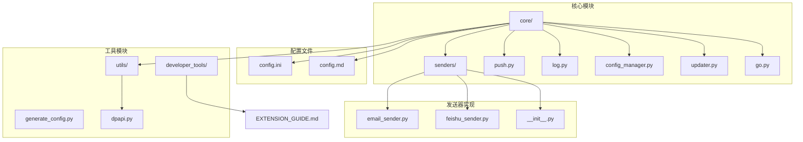
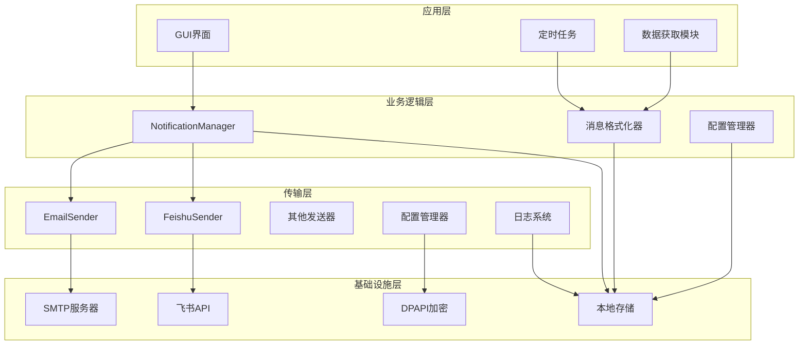
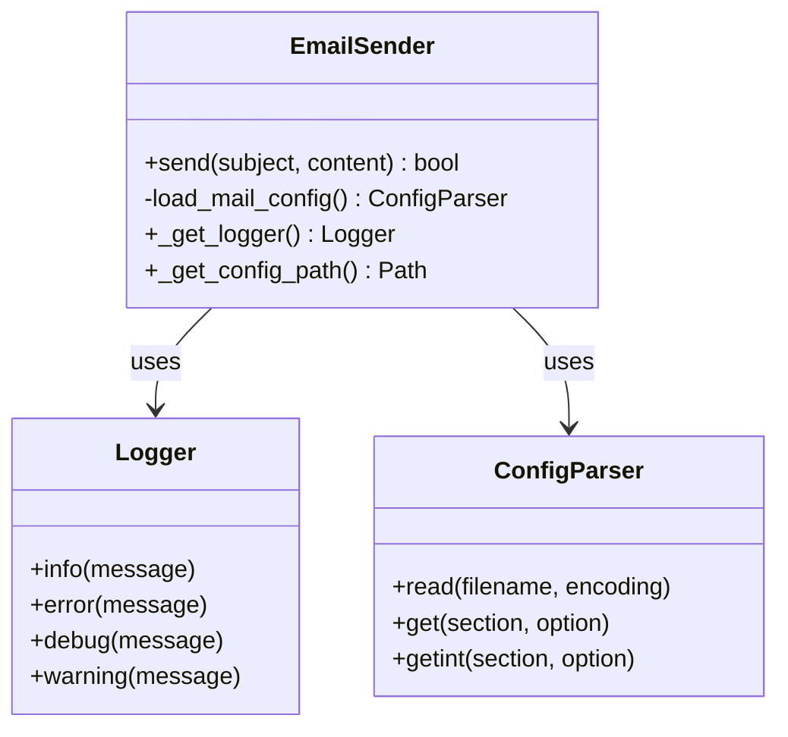
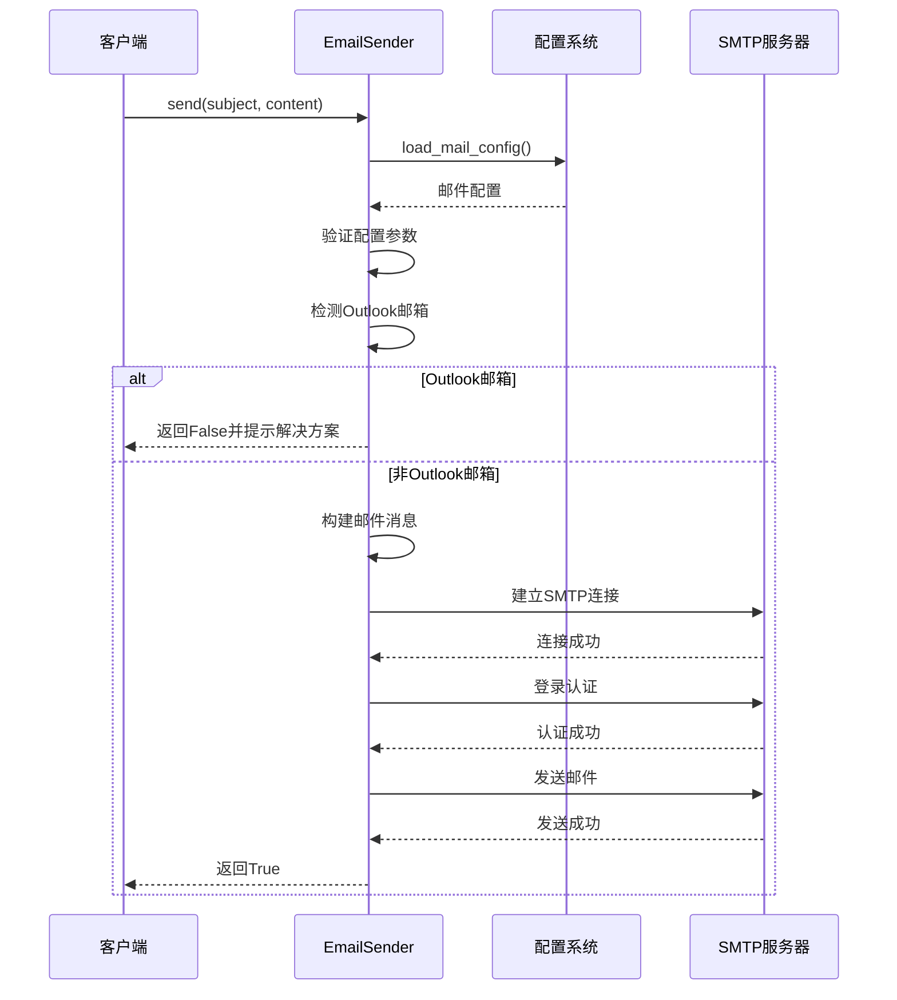
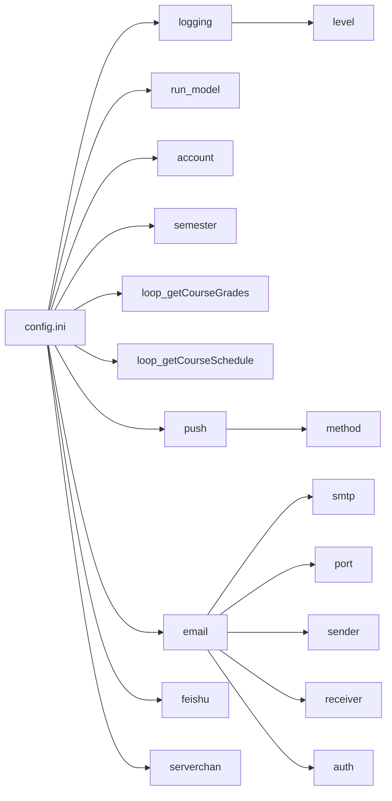
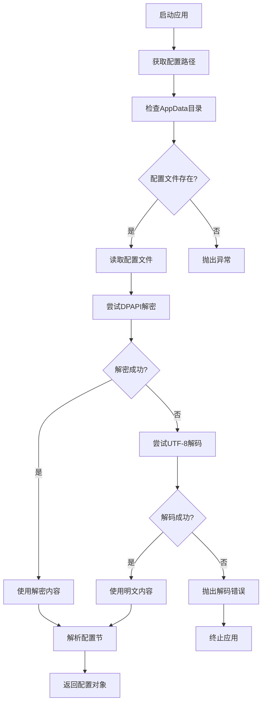
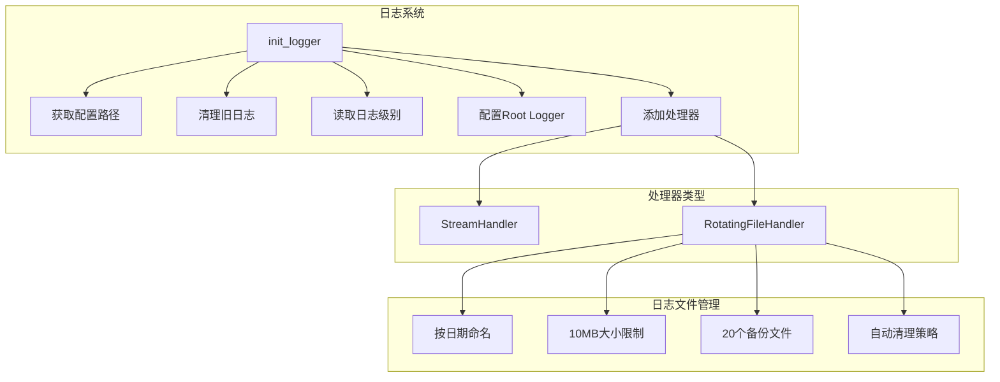
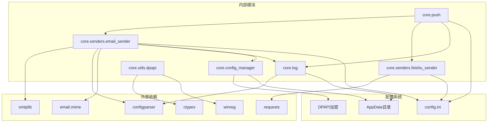

# 邮件推送实现

<cite>
**本文档引用的文件**
- [email_sender.py](file://core/senders/email_sender.py)
- [push.py](file://core/push.py)
- [log.py](file://core/log.py)
- [config_manager.py](file://core/config_manager.py)
- [config.ini](file://config.ini)
- [config.md](file://config.md)
- [feishu_sender.py](file://core/senders/feishu_sender.py)
- [dpapi.py](file://core/utils/dpapi.py)
- [EXTENSION_GUIDE.md](file://developer_tools/EXTENSION_GUIDE.md)
- [generate_config.py](file://generate_config.py)
</cite>

## 更新摘要
**变更内容**
- 增强了邮件发送器的配置管理机制
- 改进了Outlook邮箱兼容性检测和错误提示
- 优化了SMTP连接和认证处理流程
- 增强了错误处理和用户指导信息
- 改进了日志记录和调试信息

## 目录
1. [简介](#简介)
2. [项目结构](#项目结构)
3. [核心组件](#核心组件)
4. [架构概览](#架构概览)
5. [详细组件分析](#详细组件分析)
6. [依赖关系分析](#依赖关系分析)
7. [性能考虑](#性能考虑)
8. [故障排除指南](#故障排除指南)
9. [结论](#结论)

## 简介

本文档详细介绍了Capture_Push项目中的邮件推送发送器实现。该系统提供了灵活的消息推送功能，支持多种推送方式（包括邮件、飞书等），并通过统一的日志管理和配置系统确保稳定可靠的运行。

邮件推送功能通过EmailSender类实现，支持SMTP服务器配置、邮件认证机制和完整的发送流程。系统还包含了错误处理机制、重试策略和超时控制，以及完整的配置指南和故障排除方法。

**更新** 新版本增强了配置管理、Outlook邮箱兼容性检测和错误处理机制，提供了更好的用户体验和故障诊断能力。

## 项目结构

项目采用模块化的架构设计，主要包含以下核心目录和文件：



**图表来源**
- [email_sender.py](file://core/senders/email_sender.py#L1-L143)
- [push.py](file://core/push.py#L1-L392)
- [log.py](file://core/log.py#L1-L364)
- [config_manager.py](file://core/config_manager.py#L1-L68)

**章节来源**
- [email_sender.py](file://core/senders/email_sender.py#L1-L143)
- [push.py](file://core/push.py#L1-L392)
- [log.py](file://core/log.py#L1-L364)

## 核心组件

### EmailSender类

EmailSender类是邮件推送功能的核心实现，提供了完整的邮件发送能力：

- **增强的SMTP服务器配置**：支持多种SMTP服务器和端口配置，包括465端口的SSL连接和587端口的TLS连接
- **智能邮件认证机制**：支持OAuth2和应用密码认证，特别针对Outlook邮箱进行了兼容性检测
- **完善的发送流程控制**：完整的邮件构建、认证和发送流程，包含详细的日志记录
- **增强的错误处理**：详细的错误捕获和用户友好的错误提示，特别是针对Office365认证问题的专门处理

### NotificationManager类

NotificationManager类负责管理多种推送方式，实现了统一的通知发送接口：

- **多发送器支持**：支持邮件、飞书等多种推送方式
- **动态注册**：运行时自动注册可用的发送器
- **配置驱动**：通过配置文件选择当前使用的推送方式
- **错误隔离**：各发送器的错误不会影响其他发送器

### 日志管理系统

统一的日志管理确保了系统的可观测性和可维护性：

- **AppData目录**：所有日志文件存储在用户AppData目录下
- **自动轮转**：支持日志文件大小限制和自动清理
- **延迟初始化**：按需初始化日志系统，提高启动效率
- **统一格式**：标准化的日志格式便于问题诊断

**更新** 新版本增强了日志记录的详细程度，特别是在SMTP连接、认证和发送过程中的调试信息。

**章节来源**
- [email_sender.py](file://core/senders/email_sender.py#L46-L143)
- [push.py](file://core/push.py#L74-L167)
- [log.py](file://core/log.py#L271-L348)

## 架构概览

系统采用分层架构设计，实现了关注点分离和高内聚低耦合：



**图表来源**
- [push.py](file://core/push.py#L74-L167)
- [email_sender.py](file://core/senders/email_sender.py#L46-L143)
- [feishu_sender.py](file://core/senders/feishu_sender.py#L44-L113)

## 详细组件分析

### EmailSender类详细分析

#### 类结构图



**图表来源**
- [email_sender.py](file://core/senders/email_sender.py#L46-L143)

#### 增强的SMTP服务器配置机制

EmailSender类支持两种主要的SMTP连接方式，并进行了优化：

1. **端口465的SSL连接**：
   - 使用SMTP_SSL直接建立加密连接
   - 适用于需要隐式SSL/TLS加密的服务器
   - 自动进行证书验证
   - **新增**：详细的连接日志记录

2. **端口587及以上的TLS连接**：
   - 使用SMTP建立明文连接后升级为TLS
   - 适用于需要STARTTLS加密的服务器
   - 提供更灵活的连接配置
   - **新增**：starttls()调用的详细日志记录

#### 智能Outlook邮箱兼容性检测

**新增功能** 系统现在能够智能检测Outlook邮箱并提供针对性的解决方案：

- **Outlook域名检测**：支持outlook.com、outlook.cn、hotmail.com、live.com等域名
- **基本认证禁用提示**：明确告知Outlook邮箱已禁用基本认证
- **OAuth2迁移指导**：提供从基本认证迁移到OAuth2的详细步骤
- **替代邮箱推荐**：推荐QQ邮箱、163邮箱等支持应用密码的邮箱

#### 增强的邮件认证机制

系统支持多种认证方式，并提供了更好的错误处理：

- **OAuth2认证**：现代邮箱服务商推荐的认证方式
- **应用密码**：传统应用密码认证，适用于不支持OAuth2的场景
- **基本认证**：传统的用户名密码认证（已逐步淘汰）
- **Office365专用处理**：针对"basic authentication is disabled"错误的专门处理

#### 改进的发送流程序列图



**图表来源**
- [email_sender.py](file://core/senders/email_sender.py#L49-L143)

**章节来源**
- [email_sender.py](file://core/senders/email_sender.py#L46-L143)

### 配置管理系统

#### 增强的配置文件结构

系统使用标准的INI格式配置文件，支持多节配置，并增加了邮件推送的专门配置：



**图表来源**
- [config.ini](file://config.ini#L1-L39)

#### 增强的配置加载流程

**新增** 配置系统现在使用DPAPI加密技术来保护敏感信息：



**图表来源**
- [config_manager.py](file://core/config_manager.py#L15-L51)

**章节来源**
- [config.ini](file://config.ini#L1-L39)
- [config.md](file://config.md#L1-L114)
- [config_manager.py](file://core/config_manager.py#L1-L68)

### 日志管理系统

#### 增强的日志架构设计

**更新** 日志系统现在提供了更详细的调试信息：



**图表来源**
- [log.py](file://core/log.py#L271-L348)

#### 增强的日志清理机制

系统实现了智能的日志清理策略：

- **总大小限制**：默认50MB总大小限制
- **按时间排序**：优先删除最旧的日志文件
- **原子操作**：删除失败时不影响现有日志
- **用户反馈**：删除操作会输出提示信息
- **模块化日志**：每个模块都有独立的日志文件

**章节来源**
- [log.py](file://core/log.py#L192-L251)
- [log.py](file://core/log.py#L271-L348)

## 依赖关系分析

### 增强的组件依赖图

**更新** 新版本增加了DPAPI加密模块的依赖：



**图表来源**
- [email_sender.py](file://core/senders/email_sender.py#L5-L17)
- [push.py](file://core/push.py#L11-L16)
- [feishu_sender.py](file://core/senders/feishu_sender.py#L2-L8)
- [config_manager.py](file://core/config_manager.py#L2-L7)
- [dpapi.py](file://core/utils/dpapi.py#L2-L4)

### 模块间交互

系统通过清晰的接口定义实现了模块间的松耦合：

- **抽象接口**：NotificationSender定义了统一的发送接口
- **延迟导入**：避免循环依赖问题
- **异常隔离**：各模块的异常不会传播到其他模块
- **配置驱动**：通过配置文件控制模块行为
- **加密保护**：敏感配置信息通过DPAPI加密存储

**章节来源**
- [push.py](file://core/push.py#L56-L72)
- [email_sender.py](file://core/senders/email_sender.py#L12-L17)

## 性能考虑

### 连接池管理

当前实现采用每次发送建立新连接的方式，这在高并发场景下可能成为性能瓶颈。建议的改进方案：

- **连接复用**：实现SMTP连接池，减少连接建立开销
- **异步发送**：使用异步IO提升并发处理能力
- **批量发送**：支持批量邮件发送以减少网络往返

### 内存优化

- **大附件处理**：对于大文件附件，考虑流式处理而非内存加载
- **日志轮转**：合理配置日志文件大小和数量，避免磁盘空间占用过大
- **字符串处理**：优化长文本邮件的字符串处理，避免不必要的复制

### 网络优化

- **超时配置**：为SMTP连接和认证设置合理的超时时间
- **重试机制**：实现指数退避的重试策略
- **连接超时**：在网络不稳定环境下提供更好的用户体验

## 故障排除指南

### 常见配置问题

#### SMTP服务器配置错误

**问题症状**：
- 连接超时或连接失败
- 认证失败错误
- 端口被防火墙阻止

**解决方案**：
1. 验证SMTP服务器地址和端口配置
2. 检查网络连接和防火墙设置
3. 确认服务器支持的加密方式

#### 邮箱认证问题

**问题症状**：
- SMTPAuthenticationError异常
- "basic authentication is disabled"错误
- 应用密码无效

**解决方案**：
1. 使用应用密码而非账户密码
2. 为支持OAuth2的邮箱启用应用密码
3. 检查邮箱服务商的安全设置

#### Outlook邮箱限制

**问题症状**：
- Outlook/Hotmail邮箱发送失败
- 明确的"basic authentication disabled"错误

**解决方案**：
1. 更换支持OAuth2的邮箱服务商
2. 使用QQ邮箱、163邮箱等支持应用密码的邮箱
3. 配置正确的SMTP服务器和端口

**新增** 系统现在提供更详细的Outlook邮箱问题诊断：

```python
# Outlook邮箱检测逻辑
outlook_domains = ["outlook.com", "outlook.cn", "outlook.com.cn", "hotmail.com", "live.com"]
if any(sender.lower().endswith(domain) for domain in outlook_domains):
    logger.error(f"Outlook/Hotmail 邮箱不支持基本认证: {sender}")
    print(f"❌ Outlook/Hotmail 邮箱不支持基本认证")
    print(f"💡 原因: Microsoft 已禁用对这些邮箱的基本认证，仅支持 OAuth2")
    print(f"💡 解决方案: 请更换其他邮箱服务商（如 QQ、163、Gmail 等）")
    return False
```

### 增强的日志分析方法

#### 启用详细日志

在`config.ini`中设置日志级别为DEBUG：

```ini
[logging]
level = DEBUG
```

#### 关键日志信息

- **连接阶段**：SMTP服务器连接状态
- **认证阶段**：认证过程和结果
- **发送阶段**：邮件内容和接收者信息
- **错误阶段**：详细的错误堆栈信息
- **模块阶段**：特定模块的详细调试信息

#### 日志文件位置

所有日志文件存储在用户AppData目录下的Capture_Push文件夹中：

```
%LOCALAPPDATA%\Capture_Push\YYYY-MM-DD.log
```

**新增** 每个模块都有独立的日志文件，便于问题定位：

```python
# 模块化日志初始化
logger = logging.getLogger(module_name)
logger.info(f"🚀 模块日志初始化: {module_name} -> {log_file_path.name}")
```

### 网络问题诊断

#### 连接测试

1. **SMTP服务器连通性**：
   ```bash
   telnet smtp.example.com 465
   ```

2. **DNS解析检查**：
   ```bash
   nslookup smtp.example.com
   ```

3. **防火墙检测**：
   - 检查本地防火墙设置
   - 确认端口未被阻断
   - 测试代理服务器连接

#### 证书问题

对于SSL/TLS连接问题：

1. **证书链验证**：检查中间证书是否正确安装
2. **时间同步**：确保系统时间准确
3. **证书过期**：检查服务器证书有效期

#### DPAPI加密问题

**新增** 配置文件加密相关问题：

1. **Windows DPAPI可用性**：确保在Windows系统上运行
2. **用户权限**：确认有足够的权限访问DPAPI
3. **加密密钥**：检查用户的加密密钥是否有效

**章节来源**
- [email_sender.py](file://core/senders/email_sender.py#L77-L84)
- [email_sender.py](file://core/senders/email_sender.py#L126-L138)
- [log.py](file://core/log.py#L19-L35)

## 结论

Capture_Push项目的邮件推送系统实现了功能完整、架构清晰的消息推送解决方案。通过模块化设计和统一的配置管理，系统提供了良好的可扩展性和可维护性。

**更新** 新版本在以下方面有了显著改进：

### 主要优势

1. **增强的配置管理**：通过DPAPI加密保护敏感信息
2. **智能邮箱兼容性检测**：特别是对Outlook邮箱的专门处理
3. **完善的错误处理**：详细的错误提示和用户指导
4. **增强的日志系统**：模块化的日志记录和调试信息
5. **扩展性强**：支持添加新的推送方式和配置选项

### 改进建议

1. **性能优化**：实现连接池和异步发送
2. **监控增强**：添加发送统计和性能指标
3. **安全加固**：增强配置文件的安全存储
4. **国际化支持**：支持多语言错误消息
5. **测试覆盖**：增加单元测试和集成测试

### 新增功能总结

- **Outlook邮箱智能检测**：自动识别Outlook邮箱并提供迁移指导
- **增强的错误处理**：针对Office365认证问题的专门处理
- **改进的日志记录**：详细的调试信息和模块化日志
- **DPAPI加密支持**：敏感配置信息的加密存储
- **更好的用户体验**：友好的错误提示和解决方案指导

该系统为教育管理系统提供了可靠的消息推送能力，能够有效提升用户体验和系统实用性。新版本的改进使其更加健壮、易用和安全。