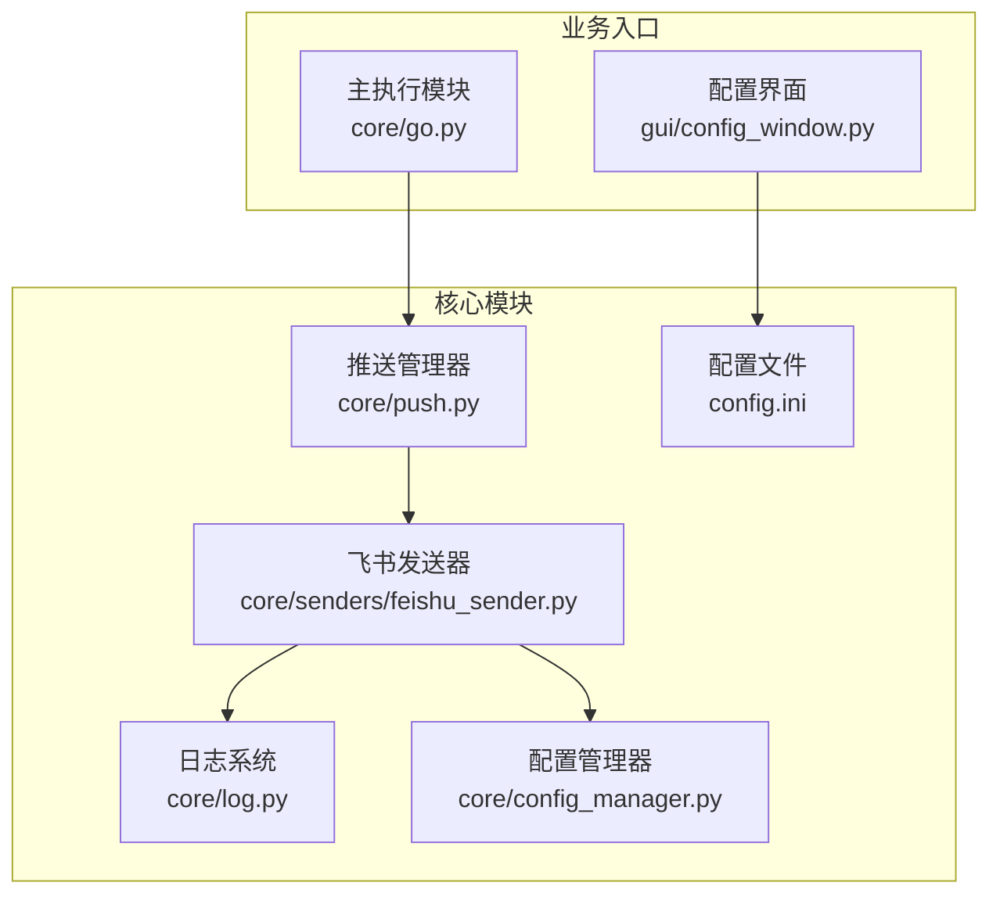
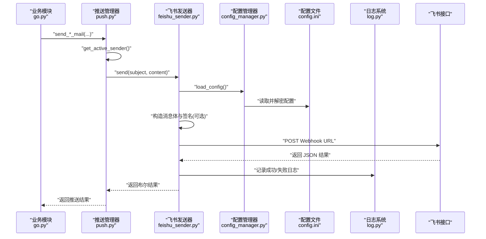
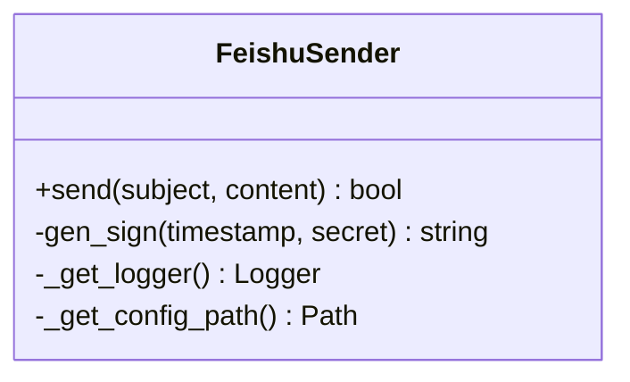
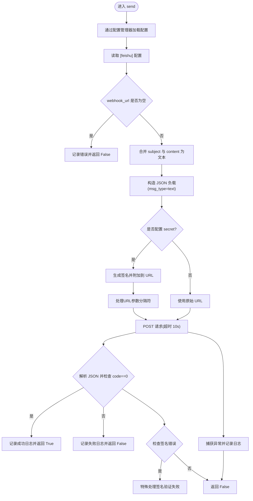
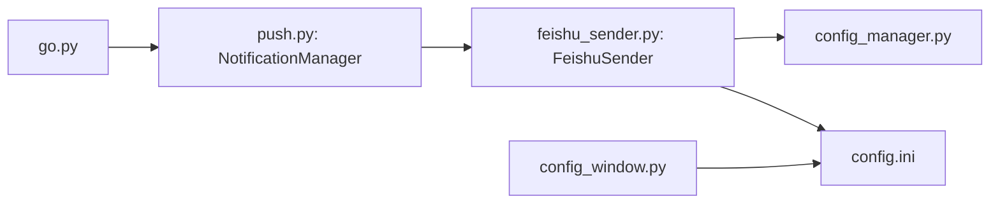
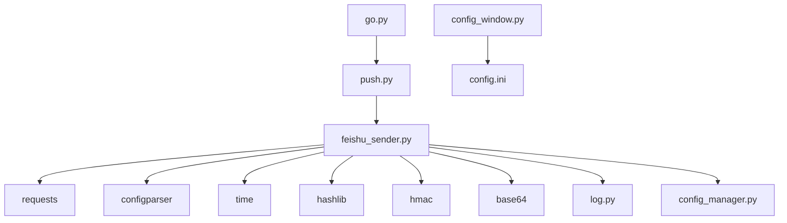

# 飞书推送实现

<cite>
**本文引用的文件**
- [feishu_sender.py](file://core/senders/feishu_sender.py)
- [push.py](file://core/push.py)
- [go.py](file://core/go.py)
- [config.ini](file://config.ini)
- [log.py](file://core/log.py)
- [config_window.py](file://gui/config_window.py)
- [EXTENSION_GUIDE.md](file://developer_tools/EXTENSION_GUIDE.md)
- [README.md](file://README.md)
- [config_manager.py](file://core/config_manager.py)
</cite>

## 更新摘要
**所做更改**
- 更新了URL参数处理和签名生成过程的实现细节
- 增强了错误处理策略和签名验证失败的诊断能力
- 优化了代码质量和维护性相关的技术说明
- 改进了配置加载机制，使用统一的配置管理器
- 增强了日志记录功能，提供更好的调试信息

## 目录
1. [简介](#简介)
2. [项目结构](#项目结构)
3. [核心组件](#核心组件)
4. [架构概览](#架构概览)
5. [详细组件分析](#详细组件分析)
6. [依赖关系分析](#依赖关系分析)
7. [性能考虑](#性能考虑)
8. [故障排查指南](#故障排查指南)
9. [结论](#结论)
10. [附录](#附录)

## 简介
本文件面向飞书推送发送器的实现与使用，围绕 FeishuSender 类展开，系统性阐述以下内容：
- 飞书机器人 Webhook 配置与认证机制
- 消息格式规范与 API 调用流程
- 飞书消息类型与富文本渲染能力现状
- 权限配置与群组管理要点
- 飞书机器人创建与配置指南（含 Webhook 地址获取、安全设置、消息模板设计）
- 错误处理策略、重试机制与监控告警建议
- 与整体推送框架的集成关系与最佳实践

## 项目结构
飞书推送位于核心模块的发送器子系统中，采用"统一推送框架 + 多发送器实现"的架构：
- 推送框架：在 core/push.py 中定义抽象接口与管理器，负责消息格式化与发送调度
- 飞书实现：在 core/senders/feishu_sender.py 中实现 FeishuSender 类
- 配置来源：统一使用 AppData 目录下的 config.ini，包含 [feishu] 节
- 日志系统：统一在 core/log.py 中初始化，便于问题定位
- GUI 配置：在 gui/config_window.py 中提供飞书配置输入界面
- 配置管理：使用 core/config_manager.py 提供统一的配置读取和加密解密功能

**图表来源**
- [push.py](file://core/push.py#L90-L103)
- [feishu_sender.py](file://core/senders/feishu_sender.py#L44-L113)
- [log.py](file://core/log.py#L167-L189)
- [config.ini](file://config.ini#L33-L36)
- [go.py](file://core/go.py#L15-L25)
- [config_window.py](file://gui/config_window.py#L376-L385)
- [config_manager.py](file://core/config_manager.py#L15-L51)

**章节来源**
- [README.md](file://README.md#L60-L83)
- [push.py](file://core/push.py#L90-L103)
- [feishu_sender.py](file://core/senders/feishu_sender.py#L44-L113)
- [log.py](file://core/log.py#L167-L189)
- [config.ini](file://config.ini#L33-L36)
- [go.py](file://core/go.py#L15-L25)
- [config_window.py](file://gui/config_window.py#L376-L385)
- [config_manager.py](file://core/config_manager.py#L15-L51)

## 核心组件
- FeishuSender：实现飞书机器人 Webhook 推送，支持签名认证与文本消息发送
- NotificationManager：统一管理多种推送方式，按配置选择活跃发送器
- 日志系统：集中初始化与轮转，便于问题诊断
- 配置系统：统一读取 AppData 下的 config.ini，支持 [feishu] 节
- 配置管理器：提供统一的配置读取、解密和保存功能

**章节来源**
- [feishu_sender.py](file://core/senders/feishu_sender.py#L44-L113)
- [push.py](file://core/push.py#L90-L103)
- [log.py](file://core/log.py#L167-L189)
- [config.ini](file://config.ini#L33-L36)
- [config_manager.py](file://core/config_manager.py#L15-L51)

## 架构概览
飞书推送在系统中的调用链路如下：
- 业务模块（如 go.py）触发消息格式化与推送
- 推送管理器根据配置选择活跃发送器
- FeishuSender 通过配置管理器读取 Webhook 地址与密钥，构造请求并调用飞书接口
- 日志系统记录发送状态与异常

**图表来源**
- [go.py](file://core/go.py#L15-L25)
- [push.py](file://core/push.py#L114-L162)
- [feishu_sender.py](file://core/senders/feishu_sender.py#L47-L113)
- [config_manager.py](file://core/config_manager.py#L15-L51)
- [config.ini](file://config.ini#L33-L36)
- [log.py](file://core/log.py#L167-L189)

## 详细组件分析

### FeishuSender 类实现原理
- 配置读取：通过 `load_config()` 函数统一读取配置，支持加密配置文件的自动解密
- 消息格式：将 subject 与 content 合并为纯文本，发送 msg_type 为 text 的消息
- 认证机制：若配置了 secret，则生成 HMAC-SHA256 签名，附加到 URL 查询参数中
- 请求流程：使用 requests.post 发送 JSON 负载，超时 10 秒；解析响应 JSON 并判断 code 字段
- 错误处理：捕获异常并记录日志，返回 False；对缺失配置与空 URL 进行显式校验
- 增强功能：专门处理签名验证失败的错误，包括 "sign match fail" 和 "timestamp is not within one hour"

**更新** 改进了URL参数处理和签名生成过程，简化了实现逻辑，提高了代码质量和维护性。增加了对签名验证失败的专门诊断处理。

**图表来源**
- [feishu_sender.py](file://core/senders/feishu_sender.py#L44-L113)

**章节来源**
- [feishu_sender.py](file://core/senders/feishu_sender.py#L47-L113)

### 飞书消息类型与富文本渲染
- 当前实现：仅支持 text 类型消息，内容为合并后的纯文本
- 富文本/Markdown：代码中未包含 Markdown 或富文本渲染逻辑，不支持在飞书消息中直接渲染富文本
- 扩展建议：若需富文本，可在消息体中引入支持的 msg_type（如 post），并在 payload 中按飞书接口规范组织内容

**章节来源**
- [feishu_sender.py](file://core/senders/feishu_sender.py#L66-L71)

### 飞书机器人 Webhook 配置与认证
- Webhook 地址：在 [feishu] 节中配置 webhook_url
- 安全设置：若开启签名校验，需同时配置 secret；系统会自动生成签名并附加到 URL
- 群组管理：代码未涉及群组管理逻辑，群组权限与成员管理由飞书侧控制

**章节来源**
- [config.ini](file://config.ini#L33-L36)
- [feishu_sender.py](file://core/senders/feishu_sender.py#L51-L60)

### API 调用流程与错误处理
- 请求参数：JSON 负载包含 msg_type 与 content.text；Content-Type 为 application/json
- 超时控制：请求超时 10 秒
- 响应解析：读取 JSON 中的 code 字段，0 表示成功
- 异常处理：捕获异常并记录日志，返回 False；对配置缺失与空 URL 进行早期校验
- 签名错误处理：特别处理 "sign match fail" 和 "timestamp is not within one hour" 错误信息

**更新** 增强了签名验证失败的错误诊断，特别处理了"sign match fail"和"timestamp is not within one hour"等错误信息

**图表来源**
- [feishu_sender.py](file://core/senders/feishu_sender.py#L47-L113)

**章节来源**
- [feishu_sender.py](file://core/senders/feishu_sender.py#L47-L113)

### 与推送框架的集成
- 推送管理器：在 core/push.py 中注册并管理多种发送器，按配置选择活跃发送器
- 便捷函数：go.py 中的 send_*_mail 函数通过 NotificationManager 发送消息
- 配置联动：GUI 配置界面读取与写入 [push] 与 [feishu] 节，实现可视化配置

**图表来源**
- [go.py](file://core/go.py#L15-L25)
- [push.py](file://core/push.py#L90-L103)
- [feishu_sender.py](file://core/senders/feishu_sender.py#L44-L113)
- [config_window.py](file://gui/config_window.py#L376-L385)
- [config.ini](file://config.ini#L33-L36)
- [config_manager.py](file://core/config_manager.py#L15-L51)

**章节来源**
- [go.py](file://core/go.py#L15-L25)
- [push.py](file://core/push.py#L90-L103)
- [config_window.py](file://gui/config_window.py#L376-L385)
- [config.ini](file://config.ini#L33-L36)
- [config_manager.py](file://core/config_manager.py#L15-L51)

## 依赖关系分析
- 模块耦合
  - FeishuSender 依赖 core/log.py 提供的日志初始化与配置路径
  - FeishuSender 通过 core/config_manager.py 统一访问配置
  - 推送管理器依赖 FeishuSender 实现，通过字符串键注册与获取
  - GUI 与配置文件双向交互，保证配置一致性
- 外部依赖
  - requests：HTTP 请求库
  - configparser：配置读取
  - time、hashlib、hmac、base64：签名生成
- 潜在风险
  - 配置缺失或格式错误会导致发送失败
  - 网络异常与超时可能导致推送阻塞
  - 飞书接口变更可能影响响应结构

**图表来源**
- [feishu_sender.py](file://core/senders/feishu_sender.py#L1-L16)
- [push.py](file://core/push.py#L90-L103)
- [go.py](file://core/go.py#L15-L25)
- [config_window.py](file://gui/config_window.py#L376-L385)
- [config.ini](file://config.ini#L33-L36)
- [config_manager.py](file://core/config_manager.py#L1-L8)

**章节来源**
- [feishu_sender.py](file://core/senders/feishu_sender.py#L1-L16)
- [push.py](file://core/push.py#L90-L103)
- [go.py](file://core/go.py#L15-L25)
- [config_window.py](file://gui/config_window.py#L376-L385)
- [config.ini](file://config.ini#L33-L36)
- [config_manager.py](file://core/config_manager.py#L1-L8)

## 性能考虑
- 超时设置：请求超时 10 秒，避免长时间阻塞
- 日志轮转：统一日志文件与轮转策略，减少磁盘占用
- 配置延迟初始化：日志与配置路径仅在首次使用时初始化，降低启动开销
- 建议优化
  - 在高并发场景下增加连接池复用
  - 对频繁失败的 Webhook 地址进行缓存与降级处理
  - 引入指数退避重试策略提升稳定性

## 故障排查指南
- 常见问题与定位
  - 配置缺失：检查 [feishu] 节是否存在 webhook_url 与 secret
  - 空 URL：确认 webhook_url 非空
  - 签名错误：若开启签名校验，确保 secret 正确且签名生成逻辑一致
  - 网络异常：检查超时与代理设置
  - 响应失败：关注返回 JSON 中的 code 与 msg 字段
- 日志定位
  - 使用 core/log.py 初始化的日志，查看 feishu_sender 模块日志
  - 通过 pack_logs 功能导出日志文件，便于问题上报
- GUI 配置核对
  - 在 GUI 中确认 [push].method 与 [feishu].webhook_url、[feishu].secret 已正确填写
- 增强诊断
  - 特别关注签名验证失败的错误信息："sign match fail" 和 "timestamp is not within one hour"
  - 检查系统时间和网络连接，确保时间同步

**更新** 增强了签名验证失败的诊断能力，特别关注"sign match fail"和"timestamp is not within one hour"等错误信息

**章节来源**
- [feishu_sender.py](file://core/senders/feishu_sender.py#L51-L60)
- [feishu_sender.py](file://core/senders/feishu_sender.py#L105-L108)
- [log.py](file://core/log.py#L167-L189)
- [config_window.py](file://gui/config_window.py#L376-L385)

## 结论
- FeishuSender 当前实现简洁可靠，满足基础文本消息推送需求
- 通过签名参数增强了安全性，适合在企业内部群组使用
- 通过配置管理器实现了统一的配置读取和加密解密功能
- 增强的错误处理和日志记录提供了更好的调试体验
- 若需富文本/Markdown 渲染，建议扩展消息类型与 payload 结构
- 建议结合重试与监控策略，进一步提升推送服务的稳定性与可观测性

## 附录

### 飞书机器人创建与配置指南
- 创建机器人
  - 登录飞书开放平台，创建应用并添加"机器人"能力
  - 获取 Webhook 地址与可选的密钥（secret）
- 配置 Webhook
  - 在 [feishu] 节中填写 webhook_url
  - 若开启签名校验，同时填写 secret
- 安全设置
  - 建议开启签名校验，防止恶意调用
  - 限制机器人权限至目标群组，避免越权推送
- 消息模板设计
  - 当前实现为纯文本，建议在消息中使用清晰的标题与分隔线
  - 如需富文本，可扩展为 post 类型消息（需修改 payload 结构）

**章节来源**
- [config.ini](file://config.ini#L33-L36)
- [EXTENSION_GUIDE.md](file://developer_tools/EXTENSION_GUIDE.md#L11-L40)

### 错误处理策略与重试机制建议
- 错误处理
  - 配置缺失与空 URL：立即返回 False 并记录错误
  - 网络异常：捕获异常并记录日志，返回 False
  - 响应失败：解析 JSON 并记录失败原因
  - 签名验证失败：特别处理"sign match fail"和"timestamp is not within one hour"错误
- 重试机制
  - 建议引入指数退避重试（如 1s、2s、4s、8s），最多 3 次
  - 对于 4xx/5xx 错误区分处理，避免无限重试
- 监控告警
  - 建议在日志中记录关键指标（成功率、耗时、错误码）
  - 集成外部监控系统，对连续失败进行告警