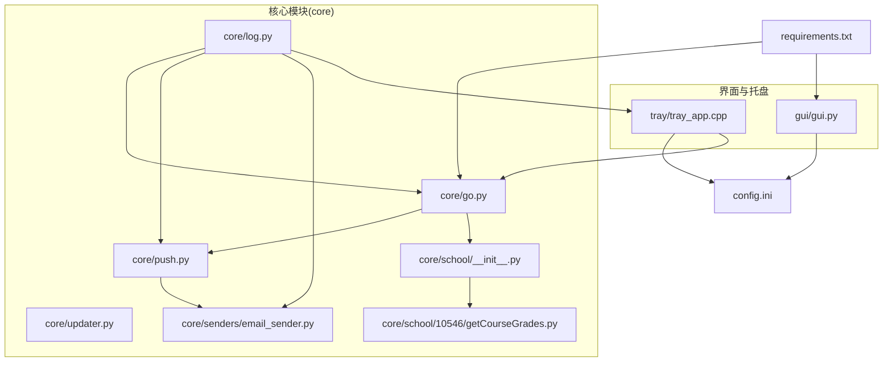
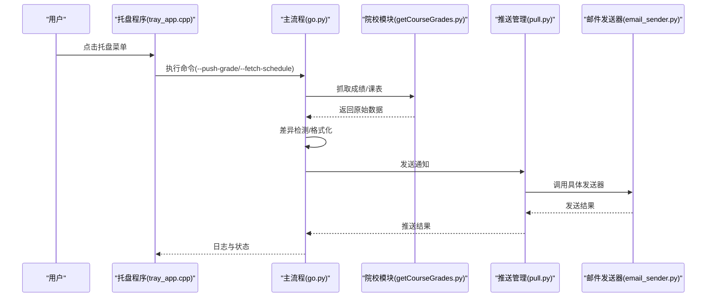
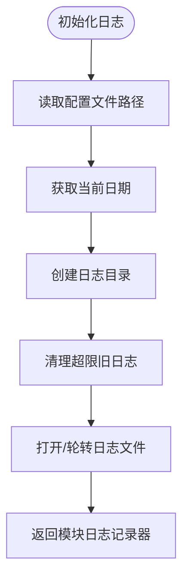
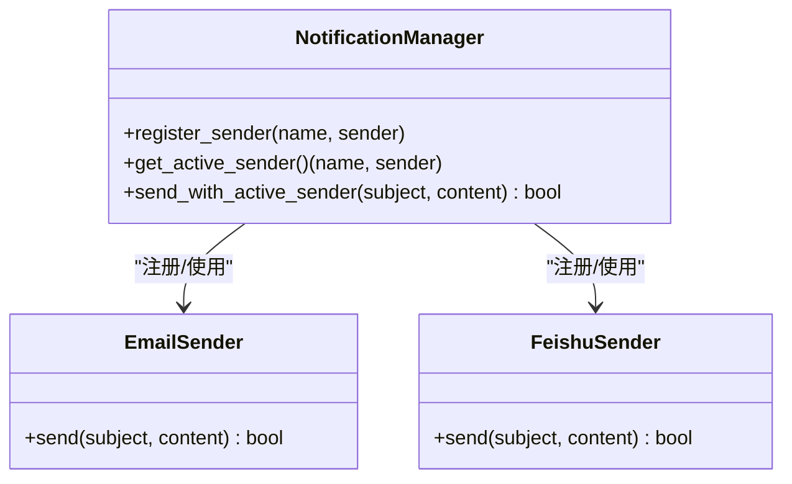
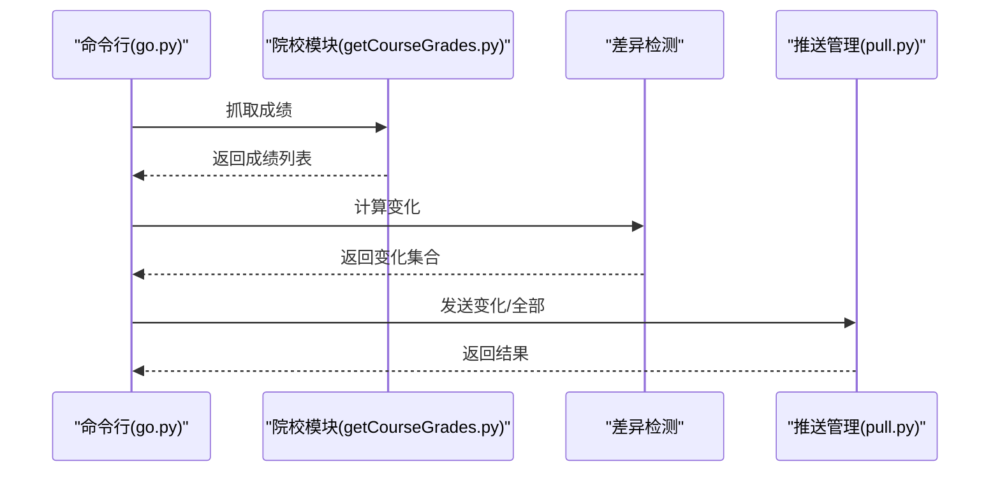
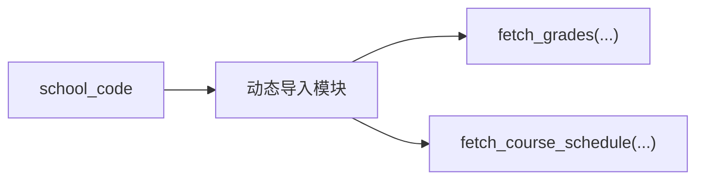
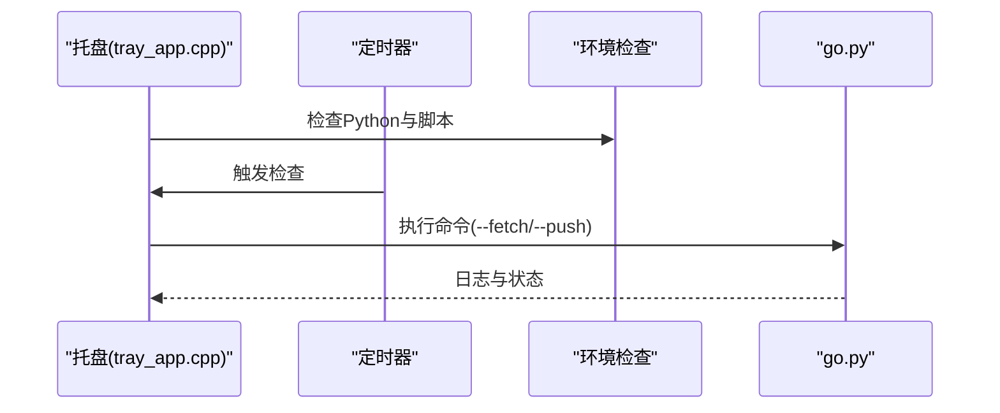
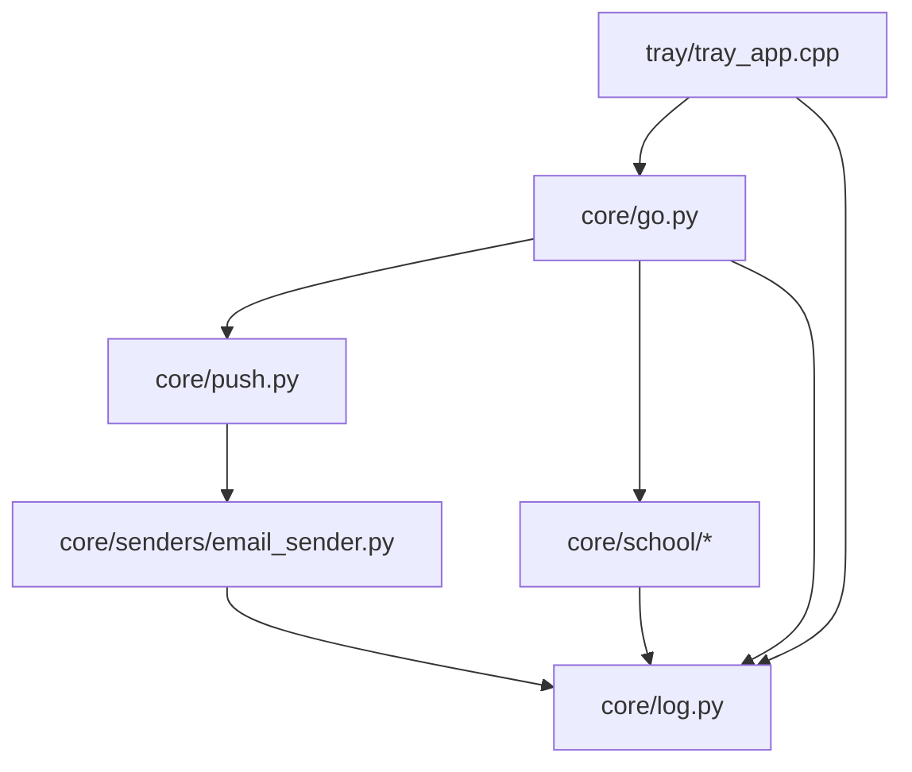

# 故障排除与调试

<cite>
**本文引用的文件**
- [README.md](file://README.md)
- [config.md](file://config.md)
- [requirements.txt](file://requirements.txt)
- [core/log.py](file://core/log.py)
- [core/push.py](file://core/push.py)
- [core/updater.py](file://core/updater.py)
- [core/go.py](file://core/go.py)
- [core/school/__init__.py](file://core/school/__init__.py)
- [core/school/10546/getCourseGrades.py](file://core/school/10546/getCourseGrades.py)
- [core/senders/email_sender.py](file://core/senders/email_sender.py)
- [gui/gui.py](file://gui/gui.py)
- [tray/tray_app.cpp](file://tray/tray_app.cpp)
- [developer_tools/EXTENSION_GUIDE.md](file://developer_tools/EXTENSION_GUIDE.md)
- [generate_config.py](file://generate_config.py)
- [config.ini](file://config.ini)
</cite>

## 目录
1. [简介](#简介)
2. [项目结构](#项目结构)
3. [核心组件](#核心组件)
4. [架构总览](#架构总览)
5. [详细组件分析](#详细组件分析)
6. [依赖关系分析](#依赖关系分析)
7. [性能考虑](#性能考虑)
8. [故障排除指南](#故障排除指南)
9. [结论](#结论)
10. [附录](#附录)

## 简介
本指南面向最终用户与开发者，提供系统化的故障排除与调试方法，涵盖安装问题、配置错误、网络连接失败、日志分析、兼容性排查、性能诊断与优化、以及开发者调试工具使用。文档结合代码库中的日志系统、配置管理、推送模块与托盘程序，帮助快速定位与解决问题。

## 项目结构
项目采用模块化组织，核心逻辑集中在 core 目录，包含日志、推送、更新、主流程与院校模块；GUI 提供配置界面；tray 为系统托盘程序；developer_tools 提供扩展开发指南与构建脚本；config.ini 为统一配置入口。

**图表来源**
- [core/go.py](file://core/go.py#L1-L536)
- [core/push.py](file://core/push.py#L1-L319)
- [core/log.py](file://core/log.py#L1-L211)
- [core/school/__init__.py](file://core/school/__init__.py#L1-L28)
- [core/school/10546/getCourseGrades.py](file://core/school/10546/getCourseGrades.py#L1-L329)
- [core/senders/email_sender.py](file://core/senders/email_sender.py#L1-L144)
- [gui/gui.py](file://gui/gui.py#L1-L24)
- [tray/tray_app.cpp](file://tray/tray_app.cpp#L1-L746)
- [config.ini](file://config.ini#L1-L36)
- [requirements.txt](file://requirements.txt#L1-L3)

**章节来源**
- [README.md](file://README.md#L60-L83)
- [core/log.py](file://core/log.py#L1-L211)
- [core/push.py](file://core/push.py#L1-L319)
- [core/go.py](file://core/go.py#L1-L536)
- [core/school/__init__.py](file://core/school/__init__.py#L1-L28)
- [core/school/10546/getCourseGrades.py](file://core/school/10546/getCourseGrades.py#L1-L329)
- [core/senders/email_sender.py](file://core/senders/email_sender.py#L1-L144)
- [gui/gui.py](file://gui/gui.py#L1-L24)
- [tray/tray_app.cpp](file://tray/tray_app.cpp#L1-L746)
- [config.ini](file://config.ini#L1-L36)
- [requirements.txt](file://requirements.txt#L1-L3)

## 核心组件
- 日志系统：统一在用户可写目录生成日志，支持级别控制、滚动与清理，便于问题定位与崩溃报告打包。
- 推送模块：集中管理多种推送方式，当前内置邮件与飞书，支持按配置启用与格式化消息。
- 主流程：负责成绩与课表的抓取、差异检测、状态持久化与推送调度。
- 院校模块：按学校代码动态加载，衡阳师范学院为默认示例，支持扩展。
- 邮件发送器：读取配置并进行 SMTP 连接与认证，包含常见邮箱服务商限制提示。
- 托盘程序：后台循环检测、定时推送、菜单交互、日志与环境检查。
- 配置管理：config.ini 分节管理日志、运行模式、账号、学期、循环检测、推送方式与各推送渠道参数。

**章节来源**
- [core/log.py](file://core/log.py#L131-L195)
- [core/push.py](file://core/push.py#L74-L163)
- [core/go.py](file://core/go.py#L83-L144)
- [core/school/__init__.py](file://core/school/__init__.py#L22-L28)
- [core/school/10546/getCourseGrades.py](file://core/school/10546/getCourseGrades.py#L278-L296)
- [core/senders/email_sender.py](file://core/senders/email_sender.py#L47-L144)
- [tray/tray_app.cpp](file://tray/tray_app.cpp#L304-L370)
- [config.ini](file://config.ini#L1-L36)

## 架构总览
系统采用“托盘程序 + Python 核心 + 院校模块 + 推送器”的分层架构。托盘负责定时与菜单触发，核心模块负责业务流程与状态管理，推送器负责消息发送，日志贯穿所有模块。

**图表来源**
- [tray/tray_app.cpp](file://tray/tray_app.cpp#L628-L681)
- [core/go.py](file://core/go.py#L461-L531)
- [core/school/10546/getCourseGrades.py](file://core/school/10546/getCourseGrades.py#L278-L296)
- [core/push.py](file://core/push.py#L138-L155)
- [core/senders/email_sender.py](file://core/senders/email_sender.py#L50-L126)

## 详细组件分析

### 日志系统与崩溃报告
- 统一日志路径：用户可写目录，按日期命名，支持滚动与清理。
- 级别控制：从配置读取，支持 DEBUG/INFO/WARNING/ERROR/CRITICAL。
- 崩溃报告：将当日与历史日志打包为文本，便于反馈。
- 托盘日志：独立滚动文件，大小限制与轮转。

**图表来源**
- [core/log.py](file://core/log.py#L114-L195)
- [tray/tray_app.cpp](file://tray/tray_app.cpp#L216-L248)

**章节来源**
- [core/log.py](file://core/log.py#L18-L58)
- [core/log.py](file://core/log.py#L85-L112)
- [core/log.py](file://core/log.py#L114-L195)
- [tray/tray_app.cpp](file://tray/tray_app.cpp#L168-L214)
- [tray/tray_app.cpp](file://tray/tray_app.cpp#L216-L248)

### 推送管理与邮件发送
- 推送方式：从配置读取，支持 none/email/test1/wechat/dingtalk/telegram。
- 管理器：动态注册可用发送器，按配置选择活跃发送器。
- 邮件发送：读取 SMTP/端口/发件人/收件人/授权码，自动选择 SSL 或 starttls，Outlook/Hotmail 基本认证限制提示。

**图表来源**
- [core/push.py](file://core/push.py#L74-L163)
- [core/senders/email_sender.py](file://core/senders/email_sender.py#L47-L144)

**章节来源**
- [core/push.py](file://core/push.py#L26-L53)
- [core/push.py](file://core/push.py#L74-L163)
- [core/senders/email_sender.py](file://core/senders/email_sender.py#L37-L144)
- [config.md](file://config.md#L19-L52)

### 主流程与状态管理
- 成绩：抓取、差异检测、保存状态、按需推送。
- 课表：按学期起始周计算周次与星期，过滤手动覆盖，定时推送今日/明日/下周。
- CLI：支持 --fetch-grade/--push-grade/--push-all-grades/--fetch-schedule/--push-today/--push-tomorrow/--push-next-week/--pack-logs/--check-update。

**图表来源**
- [core/go.py](file://core/go.py#L83-L144)
- [core/school/10546/getCourseGrades.py](file://core/school/10546/getCourseGrades.py#L278-L296)
- [core/push.py](file://core/push.py#L166-L180)

**章节来源**
- [core/go.py](file://core/go.py#L83-L144)
- [core/go.py](file://core/go.py#L180-L459)
- [core/school/10546/getCourseGrades.py](file://core/school/10546/getCourseGrades.py#L117-L230)

### 院校模块与扩展
- 动态加载：按 school_code 动态导入对应模块。
- 示例模块：衡阳师范学院，包含登录、缓存、解析与循环检测配置。
- 扩展指南：新增推送方式与院校模块的步骤与接口规范。

**图表来源**
- [core/school/__init__.py](file://core/school/__init__.py#L22-L28)
- [core/school/10546/getCourseGrades.py](file://core/school/10546/getCourseGrades.py#L278-L296)

**章节来源**
- [core/school/__init__.py](file://core/school/__init__.py#L6-L28)
- [core/school/10546/getCourseGrades.py](file://core/school/10546/getCourseGrades.py#L31-L44)
- [developer_tools/EXTENSION_GUIDE.md](file://developer_tools/EXTENSION_GUIDE.md#L60-L102)

### 托盘程序与定时任务
- 环境检查：检查 Python 虚拟环境与脚本是否存在。
- 配置读取：从 AppData 目录读取循环检测与定时推送配置。
- 定时器：每分钟检查一次，触发循环抓取与定时推送。
- 菜单交互：支持手动触发刷新与推送。

**图表来源**
- [tray/tray_app.cpp](file://tray/tray_app.cpp#L417-L443)
- [tray/tray_app.cpp](file://tray/tray_app.cpp#L479-L510)
- [tray/tray_app.cpp](file://tray/tray_app.cpp#L304-L370)

**章节来源**
- [tray/tray_app.cpp](file://tray/tray_app.cpp#L479-L510)
- [tray/tray_app.cpp](file://tray/tray_app.cpp#L304-L370)
- [tray/tray_app.cpp](file://tray/tray_app.cpp#L417-L443)

## 依赖关系分析
- Python 依赖：requests、beautifulsoup4、PySide6。
- 模块耦合：core/go.py 依赖 core/push 与 core/school；推送器依赖 core/log 与 config.ini；托盘依赖 core/go 与日志。
- 外部接口：SMTP、GitHub Releases API、Windows 注册表与 Shell。

**图表来源**
- [core/go.py](file://core/go.py#L15-L22)
- [core/push.py](file://core/push.py#L11-L23)
- [core/senders/email_sender.py](file://core/senders/email_sender.py#L11-L27)
- [core/log.py](file://core/log.py#L18-L21)
- [tray/tray_app.cpp](file://tray/tray_app.cpp#L479-L510)

**章节来源**
- [requirements.txt](file://requirements.txt#L1-L3)
- [core/go.py](file://core/go.py#L15-L22)
- [core/push.py](file://core/push.py#L11-L23)
- [core/senders/email_sender.py](file://core/senders/email_sender.py#L11-L27)
- [tray/tray_app.cpp](file://tray/tray_app.cpp#L479-L510)

## 性能考虑
- 日志滚动与清理：避免日志无限增长，建议将日志级别调整为 INFO 或 WARNING 以减少冗余。
- 循环检测间隔：合理设置循环抓取间隔，避免频繁请求导致封禁或资源浪费。
- 网络请求超时：统一设置超时时间，避免阻塞；对第三方站点进行 IPv4 强制适配以提升稳定性。
- 推送频率：避免高频推送，建议使用差异检测只在变化时发送。
- 托盘定时器：固定 60 秒检查一次，兼顾实时性与资源占用。

[本节为通用指导，无需引用具体文件]

## 故障排除指南

### 1. 安装与环境问题
- 症状：托盘菜单提示“Python环境未正确安装”或“配置界面所需环境未找到”。
- 排查：
  - 检查安装目录下是否存在 .venv 与 core/go.py。
  - 确认注册表项 HKLM\SOFTWARE\Capture_Push 是否存在且 InstallPath 指向正确。
  - 使用安装配置生成脚本核对安装路径与依赖。
- 处理：重新运行安装程序，确保完整安装；若为便携版，确认目录结构完整。

**章节来源**
- [tray/tray_app.cpp](file://tray/tray_app.cpp#L469-L477)
- [tray/tray_app.cpp](file://tray/tray_app.cpp#L512-L539)
- [generate_config.py](file://generate_config.py#L18-L80)

### 2. 配置错误
- 症状：推送失败、无法登录、定时任务不生效。
- 排查：
  - 检查 config.ini 的 [logging]/level、[run_model]/model、[account]、[semester]、[loop_*]、[push]/method 与对应节参数。
  - 验证邮箱 SMTP/端口/发件人/收件人/授权码是否正确。
  - 确认 school_code 对应的院校模块存在。
- 处理：使用 GUI 或记事本编辑 config.ini，确保值合法且完整；重启托盘使配置生效。

**章节来源**
- [config.md](file://config.md#L3-L52)
- [config.ini](file://config.ini#L1-L36)
- [core/school/__init__.py](file://core/school/__init__.py#L22-L28)
- [core/senders/email_sender.py](file://core/senders/email_sender.py#L66-L91)

### 3. 网络连接失败
- 症状：登录失败、验证码提示、成绩/课表获取失败。
- 排查：
  - 检查院校站点连通性与 DNS 解析；代码中强制使用 IPv4。
  - 查看失败响应页面缓存（grade_failed.html/login_failed_grade.html）。
  - 检查代理/防火墙是否拦截。
- 处理：切换网络、关闭代理；在 DEV 模式下使用缓存数据进行本地调试；必要时使用 --force 强制网络更新。

**章节来源**
- [core/school/10546/getCourseGrades.py](file://core/school/10546/getCourseGrades.py#L52-L56)
- [core/school/10546/getCourseGrades.py](file://core/school/10546/getCourseGrades.py#L80-L100)
- [core/school/10546/getCourseGrades.py](file://core/school/10546/getCourseGrades.py#L206-L229)

### 4. 邮件推送失败
- 症状：认证失败、Outlook/Hotmail 基本认证被禁、端口/SSL 配置错误。
- 排查：
  - 确认 SMTP 端口与加密方式匹配（465 使用 SSL，其他使用 starttls）。
  - Outlook/Hotmail 不支持基本认证，需更换邮箱或使用应用密码。
  - 检查授权码是否正确，避免使用登录密码。
- 处理：更换邮箱或启用两步验证并生成应用密码；修正端口与加密方式。

**章节来源**
- [core/senders/email_sender.py](file://core/senders/email_sender.py#L78-L91)
- [core/senders/email_sender.py](file://core/senders/email_sender.py#L105-L126)

### 5. 托盘定时任务不触发
- 症状：未按设定时间推送或循环抓取未执行。
- 排查：
  - 检查循环检测开关与间隔；确认定时器每分钟触发。
  - 查看托盘日志与 AppData 日志，确认配置读取与命令执行。
  - 确认系统时间与时区设置正确。
- 处理：调整 loop_* 配置；检查托盘日志中的“Scheduled task”与“Loop”记录。

**章节来源**
- [tray/tray_app.cpp](file://tray/tray_app.cpp#L378-L415)
- [tray/tray_app.cpp](file://tray/tray_app.cpp#L417-L443)
- [tray/tray_app.cpp](file://tray/tray_app.cpp#L304-L370)

### 6. 日志分析与崩溃报告
- 生成崩溃报告：使用 --pack-logs 或托盘菜单中的“发送崩溃报告”（当前注释掉）。
- 分析要点：
  - 查看 Python 日志与托盘日志，定位异常发生时间与模块。
  - 检查日志级别与滚动策略，必要时临时提升为 DEBUG。
  - 使用崩溃报告打包文件提交问题反馈。
- 处理：根据日志中的异常堆栈定位问题模块，修复配置或网络问题。

**章节来源**
- [core/log.py](file://core/log.py#L18-L58)
- [core/log.py](file://core/log.py#L131-L195)
- [tray/tray_app.cpp](file://tray/tray_app.cpp#L216-L248)

### 7. 系统兼容性问题
- Windows 版本：托盘程序使用 Windows API，确保系统版本兼容。
- 注册表访问：HKLM 需要管理员权限，若读取失败，程序会回退到其他路径策略。
- 字符编码：确保控制台与文件编码为 UTF-8，避免中文乱码。
- 多开冲突：托盘程序具备互斥与进程检测，避免重复实例。

**章节来源**
- [tray/tray_app.cpp](file://tray/tray_app.cpp#L118-L151)
- [tray/tray_app.cpp](file://tray/tray_app.cpp#L709-L722)

### 8. 性能问题诊断与优化
- 诊断：
  - 检查日志中抓取耗时与推送耗时，定位瓶颈。
  - 观察循环检测频率与网络请求次数。
- 优化：
  - 合理设置循环间隔，避免过于频繁。
  - 使用差异检测减少推送次数。
  - 降低日志级别或清理旧日志，减少磁盘 IO。

**章节来源**
- [core/go.py](file://core/go.py#L83-L144)
- [core/log.py](file://core/log.py#L85-L112)

### 9. 开发者调试工具使用
- 扩展新推送方式：参考扩展指南，实现 send(subject, content) 并在推送管理器中注册。
- 扩展新院校模块：实现 fetch_grades 与 fetch_course_schedule，按规范导出接口。
- 构建与打包：使用 developer_tools/build.py 准备构建空间，再用 Inno Setup 生成安装包。
- 依赖管理：requirements.txt 与 uv 支持并存，确保依赖一致。

**章节来源**
- [developer_tools/EXTENSION_GUIDE.md](file://developer_tools/EXTENSION_GUIDE.md#L7-L57)
- [developer_tools/EXTENSION_GUIDE.md](file://developer_tools/EXTENSION_GUIDE.md#L60-L102)
- [README.md](file://README.md#L101-L124)
- [requirements.txt](file://requirements.txt#L1-L3)

## 结论
通过统一的日志系统、清晰的配置管理、模块化的推送与主流程，以及托盘的定时调度，系统具备良好的可维护性与可扩展性。遇到问题时，建议优先查看日志、核对配置、验证网络与邮箱设置，并按本指南逐步排查，必要时生成崩溃报告协助定位。

[本节为总结，无需引用具体文件]

## 附录

### 常用命令速查
- 获取成绩（不推送）：--fetch-grade
- 推送变化的成绩：--push-grade
- 推送全部成绩：--push-all-grades
- 获取课表（不推送）：--fetch-schedule
- 推送今日课表：--push-today
- 推送明日课表：--push-tomorrow
- 推送下周全周课表：--push-next-week
- 打包日志（崩溃报告）：--pack-logs
- 检查更新：--check-update

**章节来源**
- [core/go.py](file://core/go.py#L461-L531)

### 配置项速查
- [logging] level：DEBUG/INFO/WARNING/ERROR/CRITICAL
- [run_model] model：DEV/BUILD
- [push] method：none/email/test1/wechat/dingtalk/telegram
- [email] smtp/port/sender/receiver/auth
- [semester] first_monday：YYYY-MM-DD
- [loop_getCourseGrades] enabled/time
- [loop_getCourseSchedule] enabled/time

**章节来源**
- [config.md](file://config.md#L3-L52)
- [config.ini](file://config.ini#L1-L36)