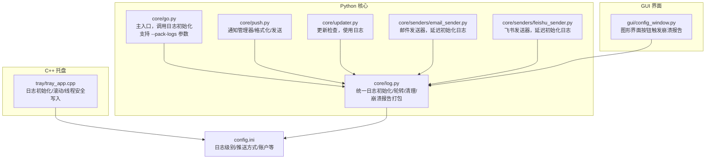
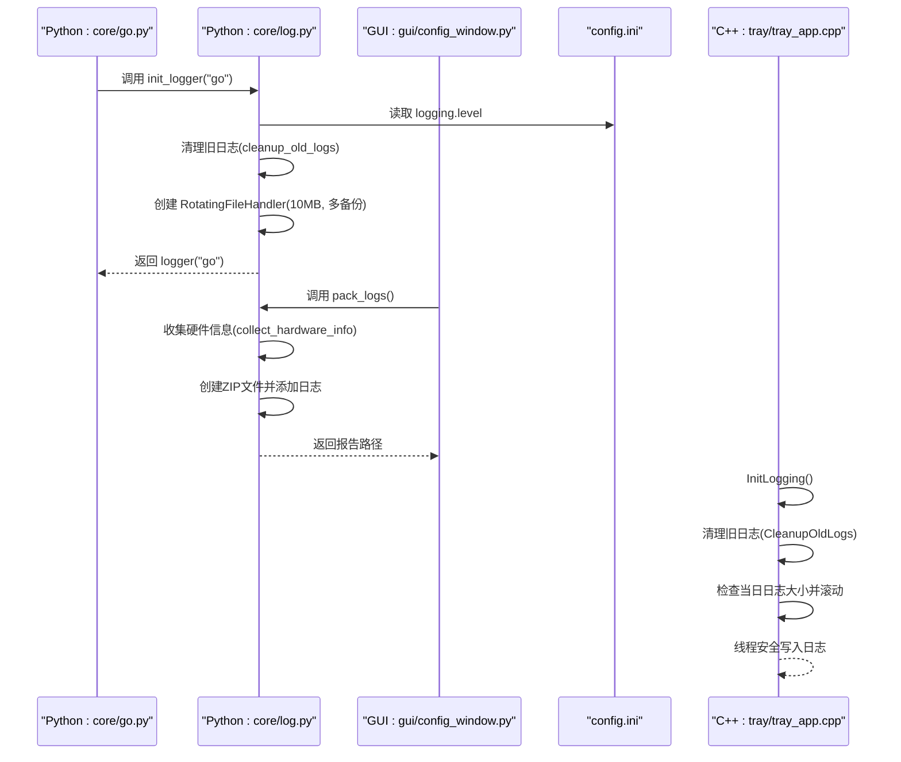
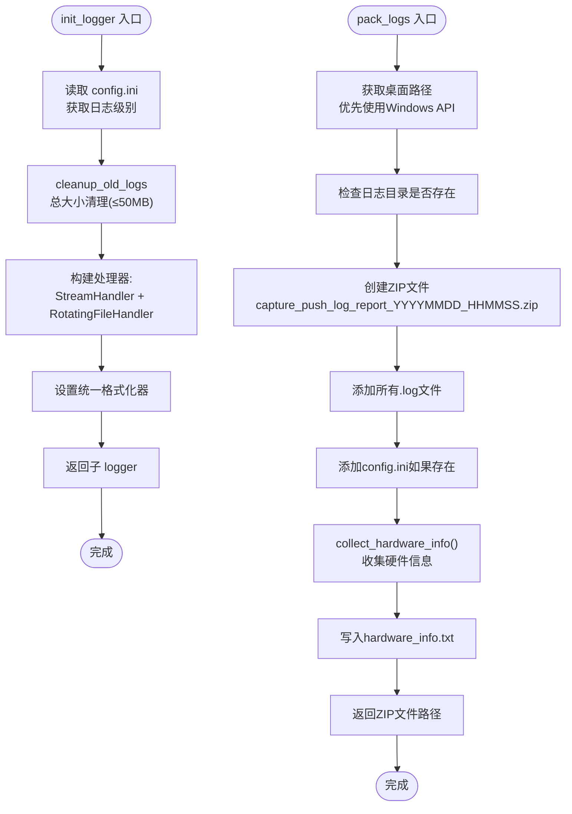
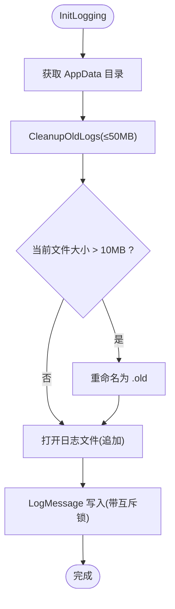
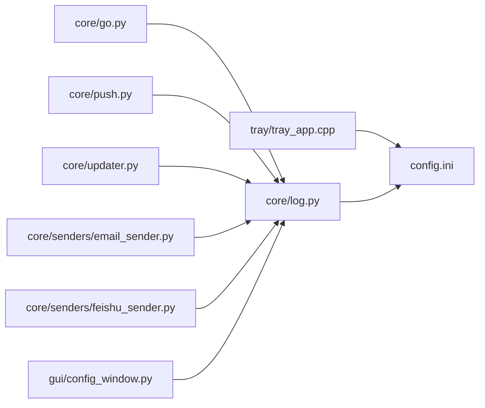

# 日志系统

<cite>
**本文引用的文件**
- [core/log.py](file://core/log.py)
- [tray/tray_app.cpp](file://tray/tray_app.cpp)
- [core/go.py](file://core/go.py)
- [core/push.py](file://core/push.py)
- [core/updater.py](file://core/updater.py)
- [core/senders/email_sender.py](file://core/senders/email_sender.py)
- [core/senders/feishu_sender.py](file://core/senders/feishu_sender.py)
- [gui/config_window.py](file://gui/config_window.py)
- [config.ini](file://config.ini)
- [README.md](file://README.md)
</cite>

## 更新摘要
**变更内容**
- 新增 pack_logs() 函数，提供崩溃报告生成功能
- 增强日志打包能力，包含硬件信息收集
- 新增命令行参数支持 --pack-logs
- 增加图形界面按钮触发日志报告生成
- 完善日志报告格式，包含硬件信息和配置文件

## 目录
1. [简介](#简介)
2. [项目结构](#项目结构)
3. [核心组件](#核心组件)
4. [架构总览](#架构总览)
5. [组件详细分析](#组件详细分析)
6. [依赖关系分析](#依赖关系分析)
7. [性能考量](#性能考量)
8. [故障排查指南](#故障排查指南)
9. [结论](#结论)
10. [附录](#附录)

## 简介
本文件面向日志系统，系统性阐述 Python 模块与 C++ 托盘程序的日志集成设计，涵盖日志级别、格式规范、输出目标、存储位置、轮转与清理策略、分析与调试方法、监控与告警配置，以及日志查看与问题诊断的实用方法。**更新**：新增崩溃报告生成功能，提供完整的硬件信息收集和日志打包能力，支持命令行和图形界面两种触发方式。

## 项目结构
日志系统横跨 Python 核心模块与 C++ 托盘程序：
- Python 层：统一日志初始化、配置读取、文件轮转与清理、**崩溃报告打包**。
- C++ 层：托盘程序日志初始化、文件滚动、线程安全写入、与 Python 主流程交互。
- 配置层：集中于 config.ini，决定日志级别与推送方式等行为。

**图表来源**
- [core/log.py](file://core/log.py#L28-L164)
- [core/go.py](file://core/go.py#L596-L640)
- [gui/config_window.py](file://gui/config_window.py#L1026-L1033)
- [tray/tray_app.cpp](file://tray/tray_app.cpp#L216-L248)
- [core/go.py](file://core/go.py#L18-L25)
- [core/push.py](file://core/push.py#L10-L24)
- [core/updater.py](file://core/updater.py#L15-L17)
- [core/senders/email_sender.py](file://core/senders/email_sender.py#L11-L27)
- [core/senders/feishu_sender.py](file://core/senders/feishu_sender.py#L11-L41)
- [config.ini](file://config.ini#L1-L39)

**章节来源**
- [README.md](file://README.md#L42-L49)

## 核心组件
- Python 日志统一管理：提供统一的初始化、格式化、文件处理器、轮转与清理、**崩溃报告打包**。
- C++ 托盘日志：提供独立的初始化、滚动与线程安全写入，使用 AppData 目录。
- 配置驱动：日志级别与推送方式由 config.ini 驱动，确保一致性。
- 日志输出目标：控制台与文件（Python 使用 RotatingFileHandler；C++ 使用简单滚动）。
- **崩溃报告生成**：**新增**功能，支持将日志文件、配置信息和硬件信息打包为 ZIP 文件。

**章节来源**
- [core/log.py](file://core/log.py#L28-L164)
- [tray/tray_app.cpp](file://tray/tray_app.cpp#L216-L248)
- [config.ini](file://config.ini#L1-L39)

## 架构总览
Python 与 C++ 日志系统通过 AppData 目录统一存储，形成互补：
- Python：基于 logging 模块，支持配置驱动的日志级别、统一格式、文件轮转与总大小清理、**崩溃报告打包**。
- C++：基于文件流与互斥锁，按日滚动，超过阈值自动重命名旧日志，保证并发安全。

**图表来源**
- [core/go.py](file://core/go.py#L23-L24)
- [core/log.py](file://core/log.py#L28-L164)
- [gui/config_window.py](file://gui/config_window.py#L1026-L1033)
- [tray/tray_app.cpp](file://tray/tray_app.cpp#L216-L248)

## 组件详细分析

### Python 日志统一管理（core/log.py）
- 初始化流程
  - 读取配置文件路径（AppData 目录），确保存在。
  - 读取日志级别（默认 DEBUG），设置 root logger。
  - 避免重复添加处理器，统一格式化器。
  - 添加文件处理器：RotatingFileHandler，单文件上限 10MB，保留多个备份；总大小清理由 cleanup_old_logs 控制。
- 存储与轮转
  - 日志文件名采用"年-月-日.log"，统一在 AppData 目录。
  - 文件轮转与总大小清理分离：轮转由 logging.handlers.RotatingFileHandler 负责；总大小清理由 cleanup_old_logs 保证不超过 50MB。
- **崩溃报告打包**（**新增**）
  - **pack_logs() 函数**：将 AppData 下所有 .log 文件和 config.ini 汇总为一个 ZIP 文件，便于问题反馈。
  - **硬件信息收集**：收集操作系统、CPU、内存、磁盘等详细硬件信息，包含 Windows 补丁信息。
  - **桌面输出**：生成的 ZIP 文件保存在用户桌面，文件名为 capture_push_log_report_YYYYMMDD_HHMMSS.zip。
- 日志格式
  - 时间、模块名、级别、函数名、消息，便于定位来源与上下文。

**图表来源**
- [core/log.py](file://core/log.py#L28-L164)
- [core/log.py](file://core/log.py#L131-L195)
- [core/log.py](file://core/log.py#L85-L112)
- [core/log.py](file://core/log.py#L114-L128)

**章节来源**
- [core/log.py](file://core/log.py#L28-L164)
- [core/log.py](file://core/log.py#L131-L195)
- [core/log.py](file://core/log.py#L85-L112)
- [core/log.py](file://core/log.py#L18-L58)

### C++ 托盘日志（tray/tray_app.cpp）
- 初始化与滚动
  - 获取 AppData 目录并创建日志目录。
  - 按日期命名日志文件（YYYY-MM-DD_tray.log）。
  - 检查当前文件大小，超过 10MB 则将当前文件重命名为 .old，实现简单滚动。
- 线程安全
  - 使用互斥锁保护日志写入，避免并发写入冲突。
- 写入格式
  - 带毫秒的时间戳，固定模块标识，统一 INFO 级别写入文件。
- 配置读取
  - 从 AppData 目录读取 config.ini，解析循环检测与推送开关等配置。

**图表来源**
- [tray/tray_app.cpp](file://tray/tray_app.cpp#L216-L248)
- [tray/tray_app.cpp](file://tray/tray_app.cpp#L258-L301)
- [tray/tray_app.cpp](file://tray/tray_app.cpp#L168-L214)

**章节来源**
- [tray/tray_app.cpp](file://tray/tray_app.cpp#L216-L248)
- [tray/tray_app.cpp](file://tray/tray_app.cpp#L258-L301)
- [tray/tray_app.cpp](file://tray/tray_app.cpp#L168-L214)

### 崩溃报告生成与硬件信息收集（**新增**）
- **pack_logs() 函数**
  - **功能**：将 AppData 下的所有日志文件和配置文件打包为 ZIP 文件，便于问题反馈。
  - **输出**：生成 capture_push_log_report_YYYYMMDD_HHMMSS.zip 文件到桌面。
  - **内容**：包含所有 .log 文件、config.ini（如果存在）、hardware_info.txt。
- **硬件信息收集**
  - **系统信息**：操作系统、版本、架构、机器类型、处理器信息。
  - **内存信息**：Windows 使用 wmic 命令获取物理内存，非 Windows 使用系统调用。
  - **磁盘信息**：使用 wmic 命令获取磁盘大小和可用空间。
  - **Windows 补丁信息**：获取最近安装的系统补丁信息。
- **桌面路径获取**
  - **优先级**：Windows API -> CSIDL_DESKTOP -> 用户目录 ~/Desktop。
  - **容错机制**：多层回退确保在不同环境下都能找到桌面路径。

**章节来源**
- [core/log.py](file://core/log.py#L28-L164)
- [core/log.py](file://core/log.py#L56-L129)
- [core/log.py](file://core/log.py#L131-L164)

### 命令行与图形界面集成（**新增**）
- **命令行支持**
  - **参数**：--pack-logs，用于生成崩溃报告。
  - **调用**：在 core/go.py 中解析参数并调用 pack_logs()。
  - **输出**：打印报告生成结果到控制台。
- **图形界面支持**
  - **按钮**：在设置窗口中添加"生成崩溃报告"按钮。
  - **触发**：点击按钮时调用 pack_logs() 并显示结果对话框。
  - **错误处理**：捕获异常并显示友好的错误信息。

**章节来源**
- [core/go.py](file://core/go.py#L596-L640)
- [gui/config_window.py](file://gui/config_window.py#L1026-L1033)

### 日志级别与格式规范
- Python
  - 级别：DEBUG、INFO、WARNING、ERROR、CRITICAL，由 config.ini 的 logging.level 驱动。
  - 格式：包含时间、模块名、级别、函数名、消息。
- C++
  - 级别：统一 INFO，写入文件；控制台输出可通过调试宏开启。
  - 格式：时间戳（含毫秒）、模块标识、固定级别、消息。

**章节来源**
- [config.ini](file://config.ini#L1-L10)
- [core/log.py](file://core/log.py#L162-L164)
- [tray/tray_app.cpp](file://tray/tray_app.cpp#L272-L276)

### 输出目标与存储位置
- Python
  - 输出目标：控制台（StreamHandler）+ 文件（RotatingFileHandler）。
  - 存储位置：%LOCALAPPDATA%\Capture_Push\YYYY-MM-DD.log。
  - **崩溃报告**：输出到桌面，文件名为 capture_push_log_report_YYYYMMDD_HHMMSS.zip。
- C++
  - 输出目标：文件（追加），控制台可选。
  - 存储位置：%LOCALAPPDATA%\Capture_Push\YYYY-MM-DD_tray.log，超限自动 .old。

**章节来源**
- [core/log.py](file://core/log.py#L114-L128)
- [core/log.py](file://core/log.py#L131-L164)
- [tray/tray_app.cpp](file://tray/tray_app.cpp#L100-L116)
- [README.md](file://README.md#L169-L170)

### 轮转机制与清理策略
- Python
  - 文件轮转：单文件 10MB，保留多个备份。
  - 总大小清理：清理逻辑确保 AppData 目录总大小不超过 50MB。
- C++
  - 文件轮转：单文件 10MB，超过即滚动为 .old。
  - 总大小清理：同 Python，避免无限增长。

**章节来源**
- [core/log.py](file://core/log.py#L180-L189)
- [core/log.py](file://core/log.py#L85-L112)
- [tray/tray_app.cpp](file://tray/tray_app.cpp#L227-L239)
- [tray/tray_app.cpp](file://tray/tray_app.cpp#L168-L214)

### 与推送模块的日志集成
- Python 推送模块（push.py）与发送器（email_sender.py、feishu_sender.py）均通过统一日志初始化，确保日志一致性。
- 更新模块（updater.py）也使用统一日志记录器，便于整体追踪。

**章节来源**
- [core/push.py](file://core/push.py#L10-L24)
- [core/senders/email_sender.py](file://core/senders/email_sender.py#L11-L27)
- [core/senders/feishu_sender.py](file://core/senders/feishu_sender.py#L11-L41)
- [core/updater.py](file://core/updater.py#L15-L17)

## 依赖关系分析
- Python
  - core/go.py 依赖 core/log.py 进行日志初始化和崩溃报告生成。
  - core/push.py、core/updater.py、各发送器模块依赖 core/log.py 提供的统一日志能力。
  - **新增**：gui/config_window.py 依赖 core/log.py 提供的崩溃报告功能。
- C++
  - tray/tray_app.cpp 依赖 config.ini 读取配置，独立维护日志文件。
- 配置
  - config.ini 决定日志级别与推送方式，影响 Python 侧日志输出与推送行为。

**图表来源**
- [core/go.py](file://core/go.py#L18-L25)
- [core/push.py](file://core/push.py#L10-L24)
- [core/updater.py](file://core/updater.py#L15-L17)
- [core/senders/email_sender.py](file://core/senders/email_sender.py#L11-L27)
- [core/senders/feishu_sender.py](file://core/senders/feishu_sender.py#L11-L41)
- [gui/config_window.py](file://gui/config_window.py#L1026-L1033)
- [tray/tray_app.cpp](file://tray/tray_app.cpp#L303-L370)
- [config.ini](file://config.ini#L1-L39)

## 性能考量
- Python
  - RotatingFileHandler 与 cleanup_old_logs 分离，避免频繁 IO 与大文件扫描。
  - 避免重复添加处理器，减少日志管道开销。
  - **崩溃报告打包**：使用 ZIP_DEFLATED 压缩，平衡压缩率和性能。
- C++
  - 互斥锁保护写入，降低并发风险；滚动条件简单明确，减少复杂度。
- 建议
  - 在高并发场景下，可考虑将 C++ 日志改为异步写入队列，进一步降低阻塞。
  - Python 侧可增加日志采样或批量刷写策略，减少磁盘压力。
  - **崩溃报告**：在大量日志文件时，打包操作可能耗时较长，建议在空闲时段执行。

## 故障排查指南
- 常见问题
  - 无法获取 AppData 目录：检查环境变量与权限。
  - 日志文件过大：确认轮转与清理逻辑是否生效。
  - 邮件发送失败：检查 SMTP 配置、端口与认证方式。
  - 飞书机器人发送失败：检查 webhook_url 与签名参数。
  - **崩溃报告生成失败**：检查桌面写入权限、日志目录是否存在。
- 定位步骤
  - 查看 Python 日志：按模块名过滤，关注 ERROR/CRITICAL。
  - 查看 C++ 日志：确认滚动与写入是否正常。
  - **生成崩溃报告**：使用 pack_logs，检查 ZIP 文件完整性。
  - **硬件信息收集失败**：检查系统命令执行权限（Windows）。
- 实用技巧
  - 临时提升日志级别为 DEBUG，复现问题并收集详细上下文。
  - 使用崩溃报告进行离线分析，避免现场干扰。
  - **命令行方式**：使用 --pack-logs 参数快速生成报告。
  - **图形界面方式**：通过设置窗口按钮生成报告。

**章节来源**
- [core/log.py](file://core/log.py#L18-L58)
- [core/log.py](file://core/log.py#L131-L164)
- [core/senders/email_sender.py](file://core/senders/email_sender.py#L78-L91)
- [core/senders/feishu_sender.py](file://core/senders/feishu_sender.py#L59-L61)

## 结论
该日志系统通过 Python 与 C++ 的协同，实现了统一的 AppData 存储、配置驱动的日志级别、清晰的格式化输出、可靠的轮转与清理策略，并**新增**了完整的崩溃报告生成功能。**pack_logs() 函数**提供了硬件信息收集和日志打包能力，支持命令行和图形界面两种触发方式，极大提升了问题诊断和用户支持效率。建议在生产环境中持续监控日志总量与关键错误，结合自动化告警与定期审计，保障系统的可观测性与稳定性。

## 附录

### 日志级别与配置项对照
- Python 日志级别：DEBUG、INFO、WARNING、ERROR、CRITICAL
- 配置项：logging.level

**章节来源**
- [config.ini](file://config.ini#L1-L10)

### 日志文件命名与位置
- Python：YYYY-MM-DD.log
- C++：YYYY-MM-DD_tray.log
- **崩溃报告**：capture_push_log_report_YYYYMMDD_HHMMSS.zip
- 存储位置：%LOCALAPPDATA%\Capture_Push

**章节来源**
- [core/log.py](file://core/log.py#L114-L128)
- [core/log.py](file://core/log.py#L131-L164)
- [tray/tray_app.cpp](file://tray/tray_app.cpp#L100-L116)
- [README.md](file://README.md#L169-L170)

### 崩溃报告生成与提交
- Python：调用 pack_logs()，生成 capture_push_log_report_YYYYMMDD_HHMMSS.zip
- **硬件信息**：包含操作系统、CPU、内存、磁盘等详细信息
- **配置文件**：自动包含 config.ini（如果存在）
- **提交方式**：附带报告文件进行问题反馈
- **触发方式**：命令行 --pack-logs 或图形界面按钮

**章节来源**
- [core/log.py](file://core/log.py#L28-L164)
- [core/go.py](file://core/go.py#L596-L640)
- [gui/config_window.py](file://gui/config_window.py#L1026-L1033)

### 崩溃报告内容结构
- **日志文件**：所有 .log 文件
- **配置文件**：config.ini（如果存在）
- **硬件信息**：hardware_info.txt，包含：
  - 系统基本信息（操作系统、版本、架构）
  - CPU 信息（处理器、机器类型）
  - 内存信息（物理内存大小）
  - 磁盘信息（容量、可用空间）
  - Windows 补丁信息（补丁 ID、安装时间）

**章节来源**
- [core/log.py](file://core/log.py#L56-L129)
- [core/log.py](file://core/log.py#L147-L159)