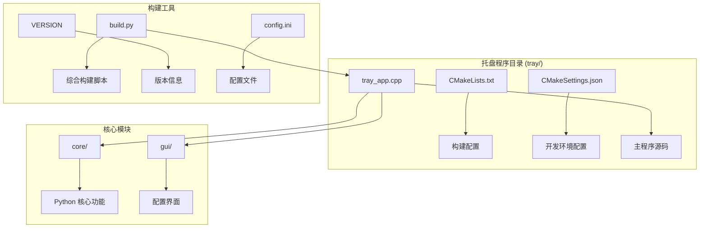
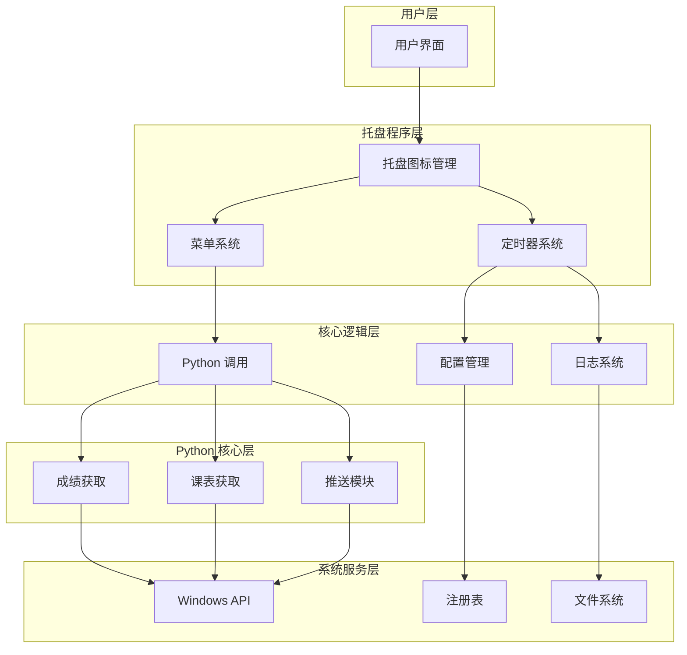
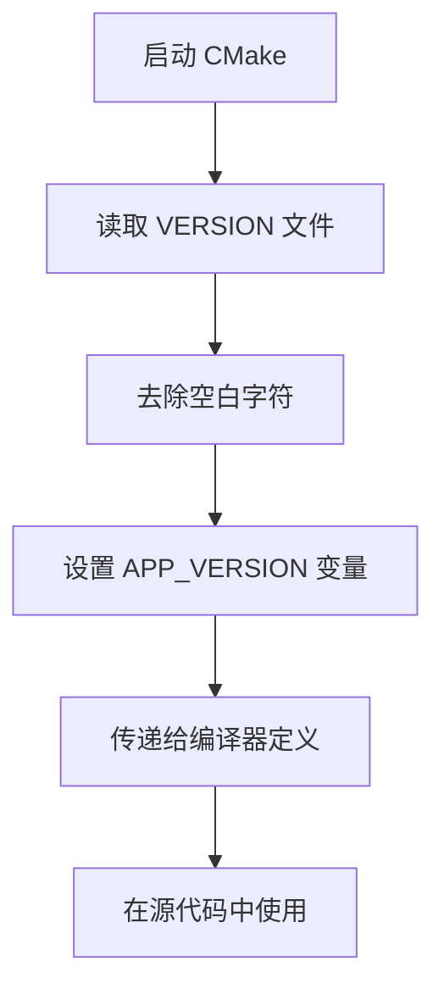
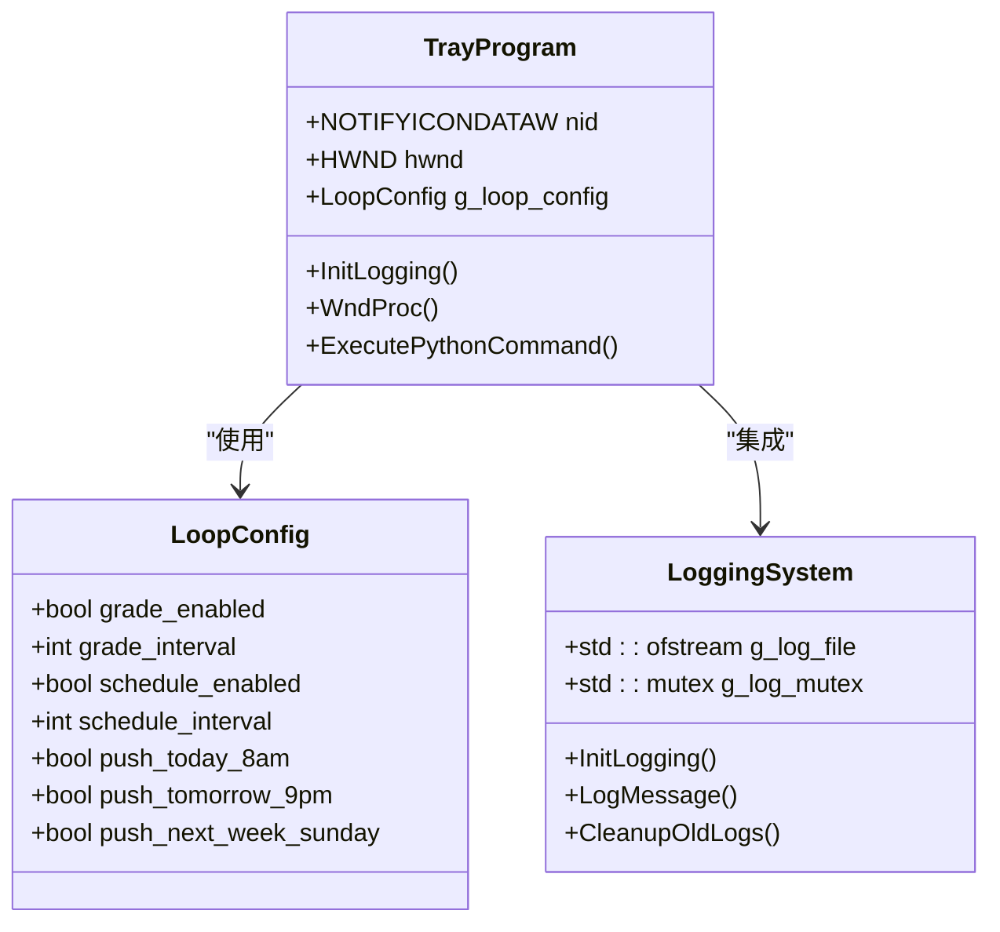
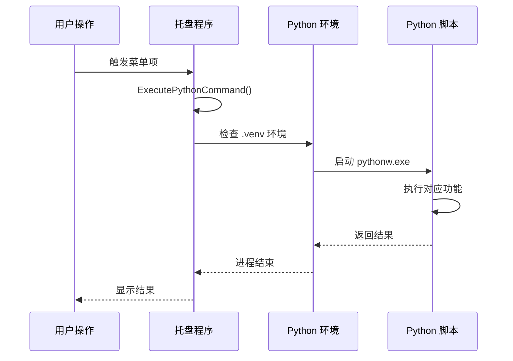
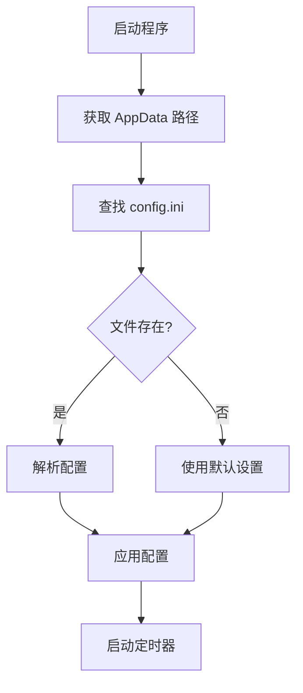
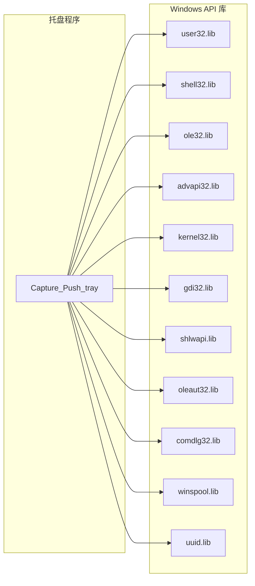
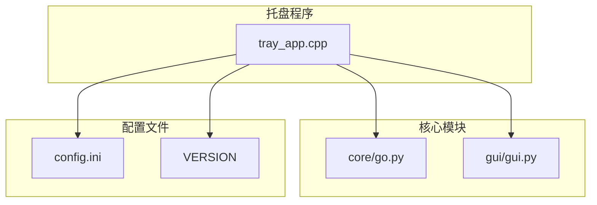

# C++ 托盘程序编译

<cite>
**本文档引用的文件**
- [tray_app.cpp](file://tray/tray_app.cpp)
- [CMakeLists.txt](file://tray/CMakeLists.txt)
- [CMakeSettings.json](file://tray/CMakeSettings.json)
- [README.md](file://README.md)
- [build.py](file://developer_tools/build.py)
- [VERSION](file://VERSION)
- [config.ini](file://config.ini)
</cite>

## 目录
1. [简介](#简介)
2. [项目结构](#项目结构)
3. [核心组件](#核心组件)
4. [架构概览](#架构概览)
5. [详细组件分析](#详细组件分析)
6. [依赖关系分析](#依赖关系分析)
7. [性能考虑](#性能考虑)
8. [故障排除指南](#故障排除指南)
9. [结论](#结论)
10. [附录](#附录)

## 简介

本文档详细介绍了 C++ 托盘程序的编译流程和技术实现。该程序是一个基于 Windows API 的系统托盘应用程序，负责监控和推送课程成绩与课表信息。文档涵盖了 CMake 构建系统的配置、源代码编译选项、链接库配置以及平台特定的编译设置。

## 项目结构

该项目采用模块化架构，托盘程序位于 `tray/` 目录中，包含以下关键文件：



**图表来源**
- [CMakeLists.txt](file://tray/CMakeLists.txt#L1-L38)
- [CMakeSettings.json](file://tray/CMakeSettings.json#L1-L27)
- [tray_app.cpp](file://tray/tray_app.cpp#L1-L746)

**章节来源**
- [README.md](file://README.md#L60-L83)

## 核心组件

### 托盘程序架构

托盘程序采用事件驱动的 Windows 应用程序架构，主要包含以下核心组件：

1. **Windows 窗口管理**：使用 WinMain 入口点创建隐藏窗口
2. **系统托盘集成**：通过 Shell_NotifyIcon API 实现托盘图标管理
3. **定时器系统**：基于 SetTimer/WM_TIMER 实现周期性检查
4. **菜单系统**：右键托盘菜单提供用户交互
5. **日志系统**：线程安全的日志记录机制
6. **Python 集成**：通过 CreateProcess 调用 Python 脚本

### 编译配置

托盘程序使用 CMake 作为构建系统，支持多配置构建环境：

- **C++ 标准**：C++17
- **字符编码**：UTF-8 Unicode 支持
- **平台目标**：Windows x64
- **输出类型**：GUI 应用程序（无控制台窗口）

**章节来源**
- [CMakeLists.txt](file://tray/CMakeLists.txt#L1-L38)
- [tray_app.cpp](file://tray/tray_app.cpp#L1-L50)

## 架构概览



**图表来源**
- [tray_app.cpp](file://tray/tray_app.cpp#L564-L695)
- [tray_app.cpp](file://tray/tray_app.cpp#L417-L443)

## 详细组件分析

### CMake 构建系统

#### 版本管理配置

CMakeLists.txt 通过读取 VERSION 文件来管理应用程序版本：



**图表来源**
- [CMakeLists.txt](file://tray/CMakeLists.txt#L6-L15)

#### 编译选项配置

托盘程序的编译选项针对不同平台进行了优化：

| 编译选项 | 作用 | 平台支持 |
|---------|------|----------|
| `-DUNICODE -D_UNICODE` | 启用 Unicode 支持 | Windows |
| `/utf-8` | 强制 UTF-8 编码 | MSVC |
| `-std:c++17` | C++17 标准支持 | MSVC |
| `WIN32` | 隐藏控制台窗口 | Windows |

**章节来源**
- [CMakeLists.txt](file://tray/CMakeLists.txt#L4-L20)

### 托盘程序源码分析

#### 系统托盘集成

托盘程序通过 NOTIFYICONDATAW 结构体管理托盘图标：



**图表来源**
- [tray_app.cpp](file://tray/tray_app.cpp#L46-L64)
- [tray_app.cpp](file://tray/tray_app.cpp#L49-L58)

#### Python 集成机制

托盘程序通过 CreateProcess API 调用 Python 脚本：



**图表来源**
- [tray_app.cpp](file://tray/tray_app.cpp#L479-L510)
- [tray_app.cpp](file://tray/tray_app.cpp#L480-L491)

#### 配置管理系统

托盘程序支持从 AppData 目录读取配置文件：



**图表来源**
- [tray_app.cpp](file://tray/tray_app.cpp#L303-L370)

**章节来源**
- [tray_app.cpp](file://tray/tray_app.cpp#L1-L746)

### 开发环境配置

#### CMakeSettings.json 配置

开发环境使用 Visual Studio 的 CMakeSettings.json 进行配置：

| 配置项 | Debug 模式 | Release 模式 |
|--------|------------|-------------|
| 生成器 | Ninja | Ninja |
| 配置类型 | Debug | RelWithDebInfo |
| 输出目录 | out/build/x64-Debug | out/build/x64-Release |
| 安装目录 | out/install/x64-Debug | out/install/x64-Release |

**章节来源**
- [CMakeSettings.json](file://tray/CMakeSettings.json#L1-L27)

## 依赖关系分析

### 外部依赖库

托盘程序链接以下 Windows API 库：



**图表来源**
- [CMakeLists.txt](file://tray/CMakeLists.txt#L25-L38)

### 内部模块依赖

托盘程序与核心模块的依赖关系：



**图表来源**
- [tray_app.cpp](file://tray/tray_app.cpp#L470-L477)
- [tray_app.cpp](file://tray/tray_app.cpp#L512-L539)

**章节来源**
- [CMakeLists.txt](file://tray/CMakeLists.txt#L1-L38)

## 性能考虑

### 内存管理

托盘程序实现了高效的内存管理策略：

1. **日志文件轮转**：当日志文件超过 10MB 时自动轮转
2. **磁盘空间限制**：总日志大小不超过 50MB
3. **线程安全**：使用互斥锁保护日志写入操作
4. **进程检查**：防止重复实例运行

### 执行效率

1. **定时器优化**：固定 60 秒检查间隔，平衡响应性和资源消耗
2. **Python 环境复用**：避免频繁创建 Python 进程
3. **配置缓存**：定时器触发时才重新读取配置文件

## 故障排除指南

### 常见编译问题

#### 版本号未正确传递

**问题**：应用程序版本显示为默认值
**解决方案**：
1. 确认 VERSION 文件格式正确
2. 检查 CMakeLists.txt 中的文件读取路径
3. 验证 CMake 重新配置

#### Unicode 字符编码问题

**问题**：中文字符显示异常
**解决方案**：
1. 确认编译选项包含 `/utf-8`
2. 检查源文件保存为 UTF-8 编码
3. 验证 Windows 区域设置

#### 链接库缺失

**问题**：编译时报错找不到 Windows API 函数
**解决方案**：
1. 确认所有必需的库都已链接
2. 检查 Visual Studio 安装完整性
3. 验证 Windows SDK 版本兼容性

### 运行时问题

#### Python 环境检测失败

**问题**：托盘程序提示 Python 环境未正确安装
**解决方案**：
1. 检查 `.venv` 目录是否存在
2. 验证 `pythonw.exe` 和 `go.py` 文件完整性
3. 确认 Python 版本兼容性

#### 托盘图标不显示

**问题**：系统托盘中看不到程序图标
**解决方案**：
1. 检查 `Shell_NotifyIconW` 调用返回值
2. 验证窗口句柄有效性
3. 确认消息循环正常运行

**章节来源**
- [tray_app.cpp](file://tray/tray_app.cpp#L479-L510)
- [tray_app.cpp](file://tray/tray_app.cpp#L709-L722)

## 结论

C++ 托盘程序是一个精心设计的 Windows 应用程序，具有以下特点：

1. **模块化设计**：清晰的组件分离和职责划分
2. **跨语言集成**：C++ 与 Python 的无缝协作
3. **平台优化**：针对 Windows 平台的深度优化
4. **可维护性**：良好的代码结构和文档支持

该程序为整个 Capture_Push 系统提供了稳定的后台服务基础，通过 CMake 构建系统确保了跨平台的一致性和可重复性。

## 附录

### 编译命令参考

#### 基本构建流程

```bash
# 进入托盘程序目录
cd tray

# 配置项目 (Release 模式)
cmake -B build -G "Visual Studio 17 2022" -A x64

# 编译
cmake --build build --config Release
```

#### 开发环境配置

1. **安装要求**：
   - Visual Studio 2022 或更高版本
   - Windows SDK 10.0 或更高版本
   - CMake 3.10 或更高版本

2. **开发步骤**：
   - 打开 `CMakeSettings.json`
   - 选择 `x64-Debug` 配置
   - 按 F7 进行编译
   - 按 F5 启动调试

### 版本管理

应用程序版本通过以下方式管理：
- 版本信息存储在 `VERSION` 文件中
- CMake 自动读取并传递给编译器
- 源代码中使用 `APP_VERSION` 宏引用

**章节来源**
- [README.md](file://README.md#L101-L124)
- [VERSION](file://VERSION#L1-L2)