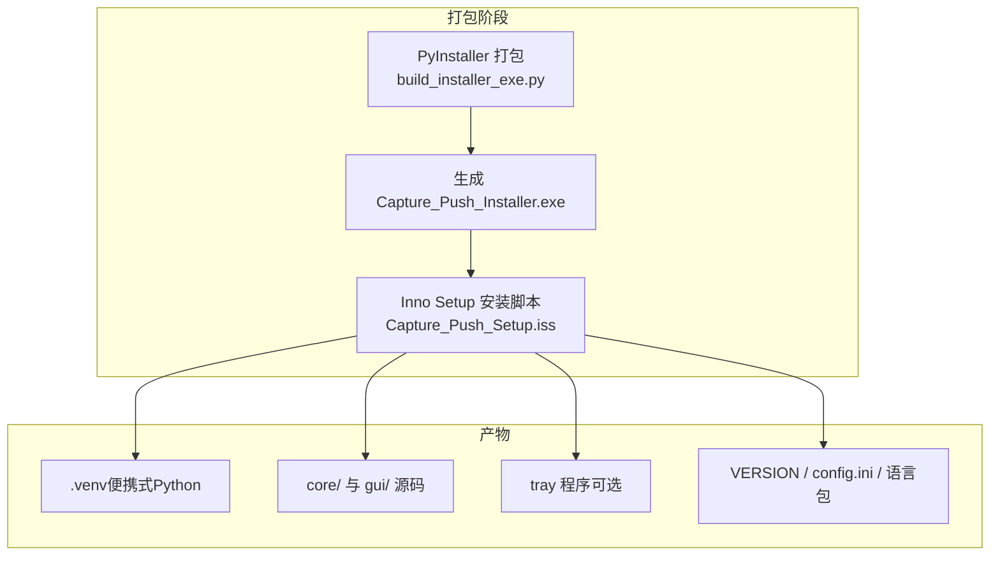
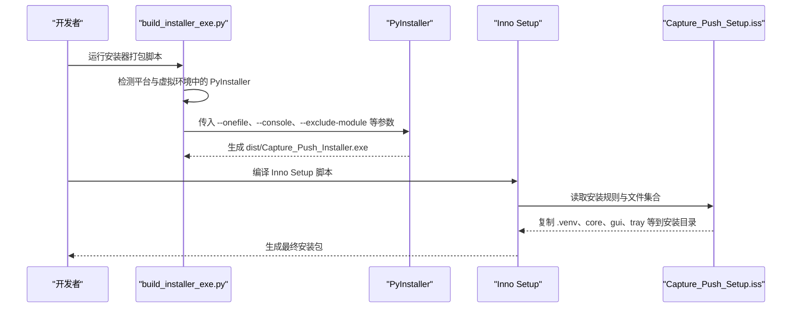
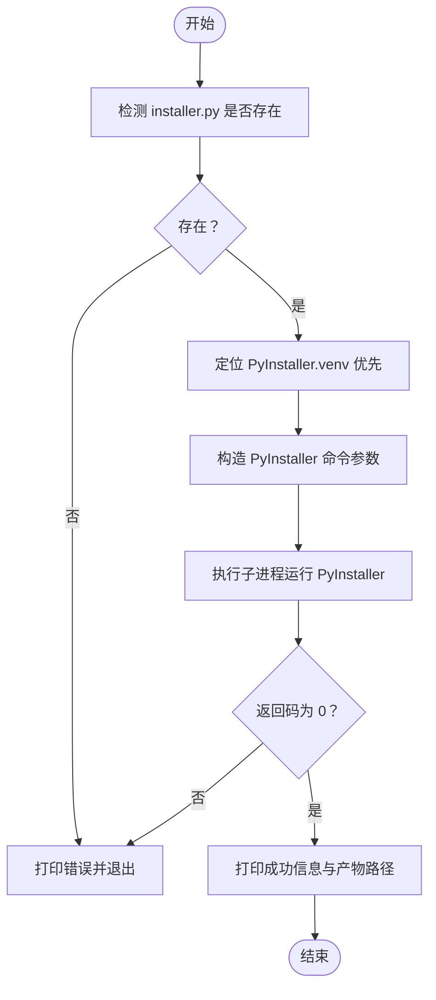
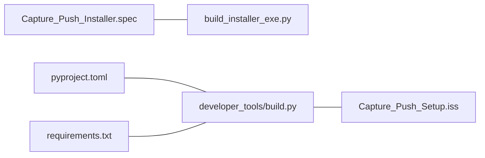
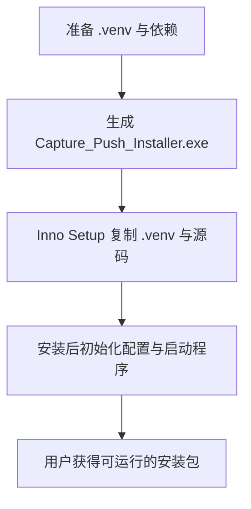

# Python 应用打包

<cite>
**本文引用的文件**
- [build_installer_exe.py](file://build_installer_exe.py)
- [Capture_Push_Installer.spec](file://Capture_Push_Installer.spec)
- [pyproject.toml](file://pyproject.toml)
- [requirements.txt](file://requirements.txt)
- [README.md](file://README.md)
- [developer_tools/build.py](file://developer_tools/build.py)
- [Capture_Push_Setup.iss](file://Capture_Push_Setup.iss)
- [PYTHON_SETUP_README.txt](file://PYTHON_SETUP_README.txt)
- [core/go.py](file://core/go.py)
- [core/push.py](file://core/push.py)
- [gui/gui.py](file://gui/gui.py)
</cite>

## 目录
1. [简介](#简介)
2. [项目结构](#项目结构)
3. [核心组件](#核心组件)
4. [架构总览](#架构总览)
5. [详细组件分析](#详细组件分析)
6. [依赖关系分析](#依赖关系分析)
7. [性能考虑](#性能考虑)
8. [故障排查指南](#故障排查指南)
9. [结论](#结论)
10. [附录](#附录)

## 简介
本技术文档围绕 Python 应用的打包与发布流程展开，重点说明以下内容：
- 使用 PyInstaller 对安装器脚本进行单文件打包的完整流程与配置要点
- 打包配置参数、依赖排除策略与输出文件管理
- build_installer_exe.py 脚本的工作原理（虚拟环境检测、平台兼容性、错误处理）
- 模块排除策略（matplotlib、numpy、pandas、tkinter）及其对包体积的影响
- 本地打包环境搭建、常见问题与性能优化建议

## 项目结构
该项目采用“安装器 + Inno Setup + 便携式 Python 环境”的双阶段打包方案：
- 安装器阶段：使用 PyInstaller 将 installer.py 打包为独立可执行文件（单文件）
- 分发阶段：使用 Inno Setup 将便携式 Python 环境与应用代码打包为安装包

图表来源
- [build_installer_exe.py](file://build_installer_exe.py#L16-L73)
- [Capture_Push_Setup.iss](file://Capture_Push_Setup.iss#L45-L52)

章节来源
- [README.md](file://README.md#L78-L83)
- [build_installer_exe.py](file://build_installer_exe.py#L16-L73)
- [Capture_Push_Setup.iss](file://Capture_Push_Setup.iss#L45-L52)

## 核心组件
- 安装器打包脚本：负责定位 PyInstaller、拼装命令行参数、执行打包并输出结果
- 安装器规格文件：集中声明排除模块与打包行为，保证与安装器脚本一致
- 便携式环境构建脚本：准备 .venv、同步源码、准备 Inno Setup 打包目录
- Inno Setup 安装脚本：定义安装流程、文件复制、图标与开机自启、卸载行为
- 顶层配置：pyproject.toml 与 requirements.txt 提供项目元数据与依赖清单

章节来源
- [build_installer_exe.py](file://build_installer_exe.py#L16-L73)
- [Capture_Push_Installer.spec](file://Capture_Push_Installer.spec#L1-L40)
- [developer_tools/build.py](file://developer_tools/build.py#L116-L229)
- [Capture_Push_Setup.iss](file://Capture_Push_Setup.iss#L17-L76)
- [pyproject.toml](file://pyproject.toml#L1-L13)
- [requirements.txt](file://requirements.txt#L1-L3)

## 架构总览
下图展示了从打包脚本到安装包产出的整体流程：

图表来源
- [build_installer_exe.py](file://build_installer_exe.py#L16-L73)
- [Capture_Push_Setup.iss](file://Capture_Push_Setup.iss#L45-L67)

## 详细组件分析

### 安装器打包脚本：build_installer_exe.py
- 功能概述
  - 检测并定位 PyInstaller（优先使用项目根目录 .venv 中的可执行文件，否则回退到系统级）
  - 构造 PyInstaller 命令行参数，执行单文件打包
  - 输出打包结果状态与产物路径
- 关键实现点
  - 平台兼容性：根据操作系统选择 .venv 下的 Scripts/bin 目录
  - 编码处理：在 Windows 上强制 stdout/stderr 使用 UTF-8，避免 CI 环境乱码
  - 错误处理：当目标脚本不存在或打包失败时，打印错误并退出
  - 参数说明（来自脚本与规格文件）
    - --onefile：输出为单文件可执行文件
    - --console：保留控制台窗口（便于调试）
    - --name：输出文件名
    - --icon：图标占位（当前为 NONE）
    - --clean：清理构建缓存
    - --noupx：禁用 UPX 压缩（降低压缩时间与内存占用）
    - --exclude-module：排除大体量或非必需模块（见下节）

图表来源
- [build_installer_exe.py](file://build_installer_exe.py#L16-L73)

章节来源
- [build_installer_exe.py](file://build_installer_exe.py#L10-L14)
- [build_installer_exe.py](file://build_installer_exe.py#L21-L27)
- [build_installer_exe.py](file://build_installer_exe.py#L28-L40)
- [build_installer_exe.py](file://build_installer_exe.py#L41-L55)
- [build_installer_exe.py](file://build_installer_exe.py#L60-L70)

### 安装器规格文件：Capture_Push_Installer.spec
- 功能概述
  - 通过 Analysis/EXE 配置集中声明排除模块与打包行为
  - 与安装器脚本保持一致的排除策略，确保产物体积可控
- 关键实现点
  - excludes 列表明确排除 matplotlib、numpy、pandas、tkinter
  - console=True 与 icon='NONE' 等参数与脚本保持一致
  - 便于后续维护与审计

章节来源
- [Capture_Push_Installer.spec](file://Capture_Push_Installer.spec#L13-L13)
- [Capture_Push_Installer.spec](file://Capture_Push_Installer.spec#L25-L38)

### 便携式环境构建脚本：developer_tools/build.py
- 功能概述
  - 准备隔离构建空间（build/ 目录）
  - 下载并解压便携式 Python（Embed 版本），启用 site-packages
  - 使用本地缓存安装依赖，提升稳定性与速度
  - 同步核心模块与 GUI 模块至构建目录
  - 复制 Inno Setup 脚本与语言包，准备安装包
- 关键实现点
  - 缓存机制：对 Python 安装包、get-pip.py、pip 缓存进行本地缓存与校验
  - 依赖安装：优先使用本地缓存，失败后再允许联网下载
  - 平台限制：仅支持 Windows 平台

章节来源
- [developer_tools/build.py](file://developer_tools/build.py#L116-L229)
- [developer_tools/build.py](file://developer_tools/build.py#L146-L181)
- [developer_tools/build.py](file://developer_tools/build.py#L182-L217)

### Inno Setup 安装脚本：Capture_Push_Setup.iss
- 功能概述
  - 定义安装目录、文件复制规则、图标与开机自启选项
  - 复制 .venv、core、gui、tray 等目录与文件
  - 安装后初始化配置、启动托盘程序与配置工具
- 关键实现点
  - 文件复制：包含 .venv、core、gui、VERSION、config.ini、generate_config.py、tray 程序
  - 注册表与开机自启：可选开启
  - 卸载行为：可选择保留用户配置与日志

章节来源
- [Capture_Push_Setup.iss](file://Capture_Push_Setup.iss#L45-L76)
- [Capture_Push_Setup.iss](file://Capture_Push_Setup.iss#L64-L67)

### 顶层配置：pyproject.toml 与 requirements.txt
- 功能概述
  - 提供项目元数据与依赖清单，作为打包与分发的基础
- 关键实现点
  - Python 版本要求与依赖范围
  - 与 Inno Setup 构建脚本配合，确保依赖安装正确

章节来源
- [pyproject.toml](file://pyproject.toml#L1-L13)
- [requirements.txt](file://requirements.txt#L1-L3)

## 依赖关系分析
- 安装器打包脚本与规格文件的耦合度高，二者均声明了排除模块与打包参数，确保一致性
- 便携式环境构建脚本与 Inno Setup 安装脚本共同决定最终安装包的内容与结构
- 顶层配置文件为上述脚本提供基础依赖信息

图表来源
- [build_installer_exe.py](file://build_installer_exe.py#L41-L55)
- [Capture_Push_Installer.spec](file://Capture_Push_Installer.spec#L13-L13)
- [developer_tools/build.py](file://developer_tools/build.py#L116-L229)
- [Capture_Push_Setup.iss](file://Capture_Push_Setup.iss#L45-L52)
- [pyproject.toml](file://pyproject.toml#L1-L13)
- [requirements.txt](file://requirements.txt#L1-L3)

章节来源
- [build_installer_exe.py](file://build_installer_exe.py#L41-L55)
- [Capture_Push_Installer.spec](file://Capture_Push_Installer.spec#L13-L13)
- [developer_tools/build.py](file://developer_tools/build.py#L116-L229)
- [Capture_Push_Setup.iss](file://Capture_Push_Setup.iss#L45-L52)
- [pyproject.toml](file://pyproject.toml#L1-L13)
- [requirements.txt](file://requirements.txt#L1-L3)

## 性能考虑
- 包体积优化
  - 明确排除 matplotlib、numpy、pandas、tkinter 等大型模块，显著降低安装器体积
  - 使用 --noupx 降低压缩时间与内存占用，适合 CI 环境
- 构建效率
  - 便携式环境构建脚本使用本地缓存安装依赖，减少网络波动影响
  - Inno Setup 使用 lzma2 压缩与固态压缩，平衡体积与压缩速度
- 运行时性能
  - 安装器为单文件可执行，启动更快；Inno Setup 安装时仅复制必要文件，减少磁盘占用

章节来源
- [build_installer_exe.py](file://build_installer_exe.py#L49-L54)
- [Capture_Push_Installer.spec](file://Capture_Push_Installer.spec#L13-L13)
- [developer_tools/build.py](file://developer_tools/build.py#L78-L114)
- [Capture_Push_Setup.iss](file://Capture_Push_Setup.iss#L26-L28)

## 故障排查指南
- 找不到 installer.py
  - 现象：脚本报错并退出
  - 处理：确认项目根目录存在 installer.py
- PyInstaller 路径异常
  - 现象：找不到 .venv 中的 pyinstaller，或权限不足
  - 处理：确保 .venv 存在且包含 PyInstaller；或直接使用系统级 PyInstaller
- Windows CI 编码问题
  - 现象：控制台输出乱码
  - 处理：脚本已在 Windows 平台强制 UTF-8，若仍异常，请检查终端编码
- 依赖安装失败
  - 现象：pip 安装失败或超时
  - 处理：先尝试仅使用本地缓存安装；若失败，允许联网下载并延长超时
- Inno Setup 编译失败
  - 现象：缺少 Python 安装包或安装器未生成
  - 处理：按照说明准备 python-3.11.9 安装包与安装器可执行文件

章节来源
- [build_installer_exe.py](file://build_installer_exe.py#L24-L26)
- [build_installer_exe.py](file://build_installer_exe.py#L34-L40)
- [build_installer_exe.py](file://build_installer_exe.py#L11-L14)
- [developer_tools/build.py](file://developer_tools/build.py#L98-L114)
- [PYTHON_SETUP_README.txt](file://PYTHON_SETUP_README.txt#L32-L41)

## 结论
本项目采用“安装器 + Inno Setup + 便携式 Python 环境”的双阶段打包方案，结合明确的模块排除策略与本地缓存机制，在保证功能完整性的同时显著降低了包体积与构建复杂度。通过统一的规格文件与脚本参数，确保安装器与安装包的一致性与可重复性。

## 附录

### 本地打包环境搭建指南
- 准备便携式 Python 环境
  - 使用便携式 Python Embed 版本，启用 site-packages
  - 通过缓存机制安装 get-pip.py 并使用本地缓存安装依赖
- 同步构建空间
  - 将 core、gui 等目录复制到 build/ 目录
  - 复制 Inno Setup 脚本与语言包
- 生成安装器
  - 运行安装器打包脚本，生成 Capture_Push_Installer.exe
- 编译安装包
  - 使用 Inno Setup 编译完整版或轻量版安装脚本

章节来源
- [developer_tools/build.py](file://developer_tools/build.py#L146-L217)
- [build_installer_exe.py](file://build_installer_exe.py#L16-L73)
- [Capture_Push_Setup.iss](file://Capture_Push_Setup.iss#L45-L76)
- [PYTHON_SETUP_README.txt](file://PYTHON_SETUP_README.txt#L19-L31)

### 模块排除策略说明
- 排除模块：matplotlib、numpy、pandas、tkinter
- 排除原因：
  - 体积大：上述模块均为科学计算与图形相关，包含大量二进制扩展
  - 用途无关：安装器与最终应用均不涉及绘图、数值计算或 GUI 界面
- 对包体积的影响：
  - 显著减小安装器体积，缩短下载与安装时间
  - 降低运行时内存占用与启动时间

章节来源
- [build_installer_exe.py](file://build_installer_exe.py#L50-L53)
- [Capture_Push_Installer.spec](file://Capture_Push_Installer.spec#L13-L13)

### 关键流程图：安装器打包与安装包生成

图表来源
- [developer_tools/build.py](file://developer_tools/build.py#L146-L217)
- [build_installer_exe.py](file://build_installer_exe.py#L16-L73)
- [Capture_Push_Setup.iss](file://Capture_Push_Setup.iss#L45-L67)