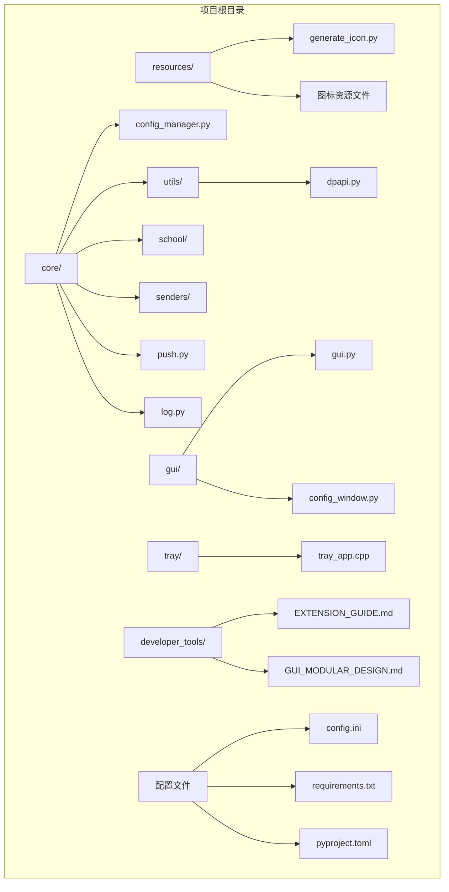
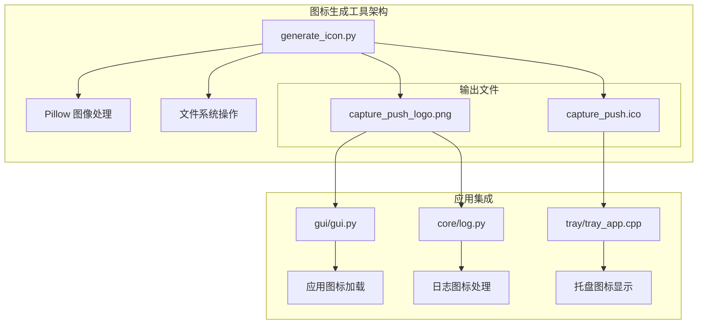
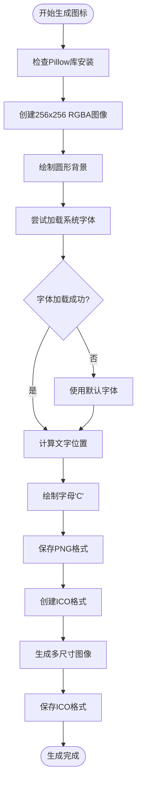
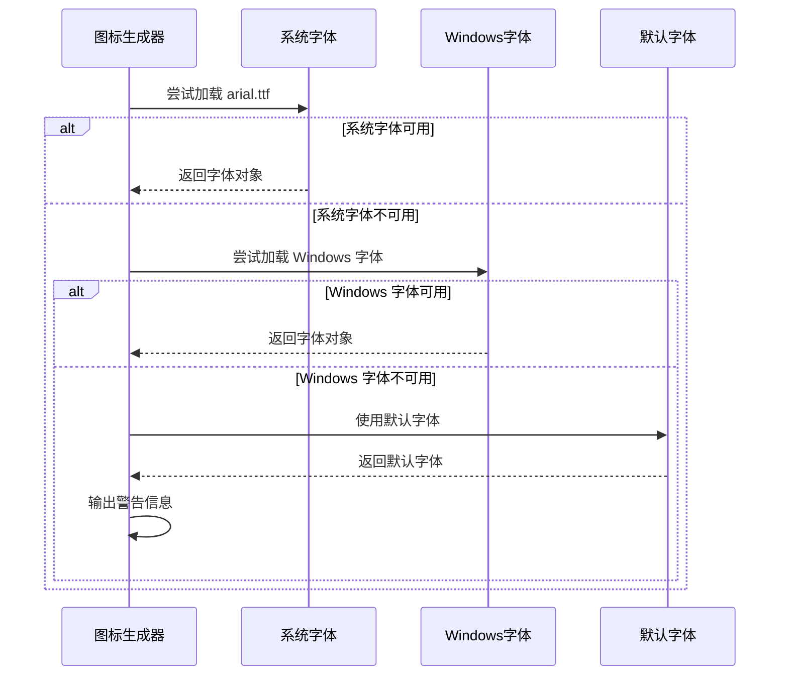
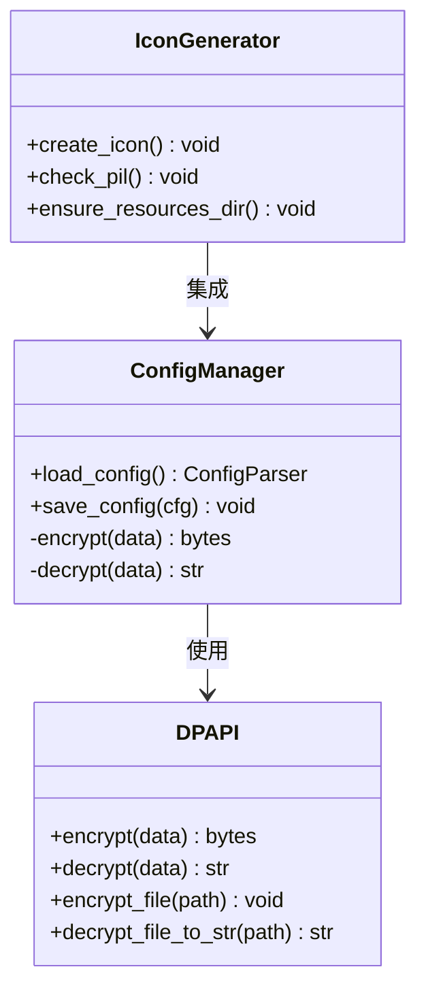
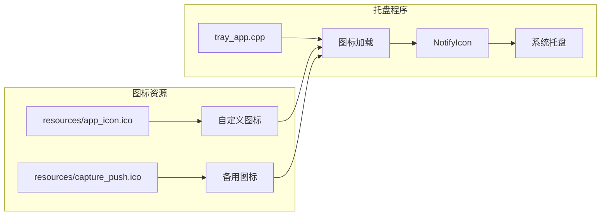
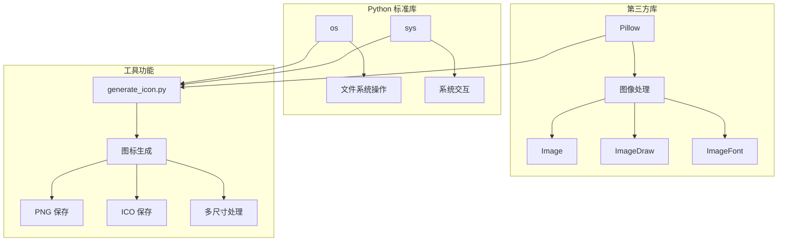
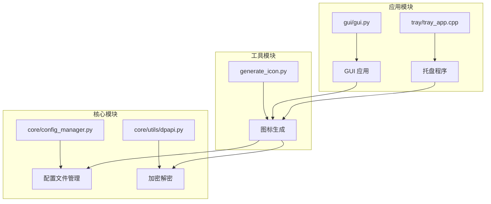

# 图标生成工具

<cite>
**本文档引用的文件**
- [generate_icon.py](file://resources/generate_icon.py)
- [README.md](file://README.md)
- [requirements.txt](file://requirements.txt)
- [config.ini](file://config.ini)
- [generate_config.py](file://generate_config.py)
- [core/config_manager.py](file://core/config_manager.py)
- [core/utils/dpapi.py](file://core/utils/dpapi.py)
- [developer_tools/EXTENSION_GUIDE.md](file://developer_tools/EXTENSION_GUIDE.md)
- [developer_tools/GUI_MODULAR_DESIGN.md](file://developer_tools/GUI_MODULAR_DESIGN.md)
- [pyproject.toml](file://pyproject.toml)
- [core/go.py](file://core/go.py)
- [core/push.py](file://core/push.py)
- [core/log.py](file://core/log.py)
- [gui/gui.py](file://gui/gui.py)
- [tray/tray_app.cpp](file://tray/tray_app.cpp)
</cite>

## 目录
1. [简介](#简介)
2. [项目结构](#项目结构)
3. [核心组件](#核心组件)
4. [架构概览](#架构概览)
5. [详细组件分析](#详细组件分析)
6. [依赖关系分析](#依赖关系分析)
7. [性能考虑](#性能考虑)
8. [故障排除指南](#故障排除指南)
9. [结论](#结论)

## 简介

图标生成工具是 Capture_Push 项目中的一个专用工具，用于生成应用程序的图标文件。该工具基于 Python 的 Pillow 库，能够创建 PNG 格式的高分辨率图标和 ICO 格式的多尺寸图标，满足不同平台和应用场景的需求。

Capture_Push 是一个课程成绩和课表自动追踪推送系统，具有模块化设计，支持多院校扩展和多种推送方式。图标生成工具作为该项目的辅助工具，为整个应用提供了统一的视觉标识。

## 项目结构

项目采用模块化组织结构，主要包含以下核心目录：



**图表来源**
- [README.md](file://README.md#L70-L118)
- [resources/generate_icon.py](file://resources/generate_icon.py#L1-L73)

**章节来源**
- [README.md](file://README.md#L70-L118)
- [resources/generate_icon.py](file://resources/generate_icon.py#L1-L73)

## 核心组件

### 图标生成器 (Icon Generator)

图标生成器是本工具的核心组件，负责创建应用程序的视觉标识。它具备以下主要功能：

- **多格式支持**：同时生成 PNG 和 ICO 格式的图标文件
- **多尺寸适配**：支持从 16x16 到 256x256 的多种尺寸
- **字体兼容性**：自动检测和使用系统字体，确保文字显示效果
- **错误处理**：完善的异常处理机制，保证工具的稳定性

### 资源管理 (Resource Management)

工具负责管理应用程序的图标资源，包括：
- 图标文件的创建和保存
- 资源目录的自动创建
- 文件权限和路径处理

**章节来源**
- [resources/generate_icon.py](file://resources/generate_icon.py#L9-L73)

## 架构概览

图标生成工具在整个 Capture_Push 项目架构中扮演着重要的角色：



**图表来源**
- [resources/generate_icon.py](file://resources/generate_icon.py#L42-L58)
- [gui/gui.py](file://gui/gui.py#L20-L23)
- [tray/tray_app.cpp](file://tray/tray_app.cpp#L734-L751)

## 详细组件分析

### 图标生成器实现分析

#### 核心算法流程



**图表来源**
- [resources/generate_icon.py](file://resources/generate_icon.py#L9-L58)

#### 图标设计规范

工具遵循以下设计规范：
- **尺寸规格**：基础尺寸为 256x256 像素
- **颜色方案**：蓝色背景配白色字母 'C'
- **边距处理**：保持 20 像素的外边距
- **文字居中**：精确计算文字位置实现完美居中

#### 字体处理机制



**图表来源**
- [resources/generate_icon.py](file://resources/generate_icon.py#L20-L30)

**章节来源**
- [resources/generate_icon.py](file://resources/generate_icon.py#L9-L73)

### 配置管理系统集成

图标生成工具与 Capture_Push 的配置管理系统紧密集成：



**图表来源**
- [core/config_manager.py](file://core/config_manager.py#L15-L68)
- [core/utils/dpapi.py](file://core/utils/dpapi.py#L12-L77)
- [resources/generate_icon.py](file://resources/generate_icon.py#L62-L73)

**章节来源**
- [core/config_manager.py](file://core/config_manager.py#L15-L68)
- [core/utils/dpapi.py](file://core/utils/dpapi.py#L12-L77)

### 应用程序集成分析

#### GUI 集成

图标生成工具与图形用户界面的集成体现在以下几个方面：

- **图标加载**：GUI 应用程序从 resources 目录加载图标文件
- **图标更新**：生成的新图标会自动替换旧的图标文件
- **路径处理**：统一的资源路径管理确保图标文件的正确加载

#### 托盘程序集成



**图表来源**
- [tray/tray_app.cpp](file://tray/tray_app.cpp#L734-L751)
- [gui/gui.py](file://gui/gui.py#L20-L23)

**章节来源**
- [tray/tray_app.cpp](file://tray/tray_app.cpp#L734-L751)
- [gui/gui.py](file://gui/gui.py#L20-L23)

## 依赖关系分析

### 外部依赖

图标生成工具主要依赖以下外部库：



**图表来源**
- [requirements.txt](file://requirements.txt#L1-L3)
- [resources/generate_icon.py](file://resources/generate_icon.py#L5-L6)

### 内部模块依赖



**图表来源**
- [core/config_manager.py](file://core/config_manager.py#L1-L68)
- [core/utils/dpapi.py](file://core/utils/dpapi.py#L1-L101)
- [resources/generate_icon.py](file://resources/generate_icon.py#L1-L73)

**章节来源**
- [requirements.txt](file://requirements.txt#L1-L3)
- [pyproject.toml](file://pyproject.toml#L7-L11)

## 性能考虑

### 图像处理优化

图标生成工具在性能方面采用了以下优化策略：

- **内存管理**：使用 RGBA 模式创建图像，确保透明度处理
- **字体缓存**：字体对象的重复使用减少内存分配
- **尺寸优化**：多尺寸图像的批量处理提高效率
- **异常处理**：完善的错误处理避免程序崩溃

### 文件操作效率

- **目录检查**：使用 `os.makedirs` 的 `exist_ok` 参数避免重复检查
- **文件写入**：一次性写入多个尺寸的 ICO 文件
- **路径处理**：统一的路径处理确保跨平台兼容性

## 故障排除指南

### 常见问题及解决方案

#### Pillow 库缺失

**问题症状**：运行图标生成工具时报错，提示需要安装 Pillow 库

**解决方法**：
```bash
pip install Pillow
```

#### 字体加载失败

**问题症状**：图标生成时使用默认字体，文字显示效果不佳

**解决方法**：
1. 确保系统安装了 Arial 字体
2. 检查 Windows 字体目录 `C:/Windows/Fonts/arial.ttf`
3. 验证字体文件的可访问性

#### 权限问题

**问题症状**：无法在 resources 目录创建或修改图标文件

**解决方法**：
1. 确保对项目目录有写入权限
2. 以管理员身份运行命令提示符
3. 检查防病毒软件的文件访问限制

#### 路径问题

**问题症状**：图标文件保存路径不正确

**解决方法**：
1. 确保在项目根目录下运行工具
2. 检查 `resources` 目录的存在性
3. 验证相对路径的正确性

**章节来源**
- [resources/generate_icon.py](file://resources/generate_icon.py#L62-L68)
- [resources/generate_icon.py](file://resources/generate_icon.py#L70-L73)

## 结论

图标生成工具作为 Capture_Push 项目的重要组成部分，为整个应用提供了统一的视觉标识。该工具具有以下特点：

### 技术优势

- **简洁高效**：代码结构清晰，功能专一，易于维护
- **兼容性强**：支持多种字体和平台，确保图标质量
- **自动化程度高**：完整的文件管理和错误处理机制
- **集成度好**：与项目其他模块无缝集成

### 应用价值

- **品牌识别**：为 Capture_Push 提供独特的视觉标识
- **用户体验**：统一的应用图标提升用户识别度
- **开发效率**：标准化的图标生成流程减少重复工作
- **维护便利**：集中化的图标管理简化维护工作

该工具的成功实施体现了 Capture_Push 项目在模块化设计和工具链建设方面的成熟度，为项目的长期发展奠定了良好的基础。