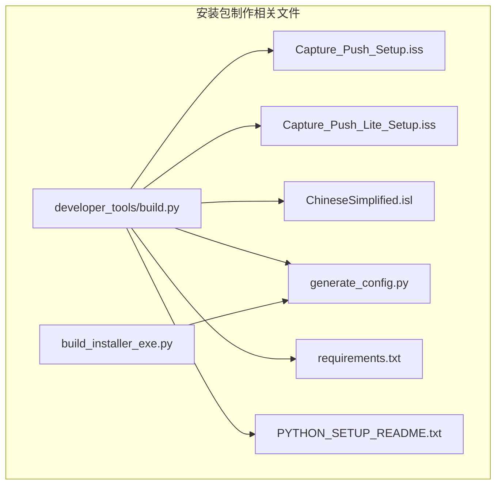
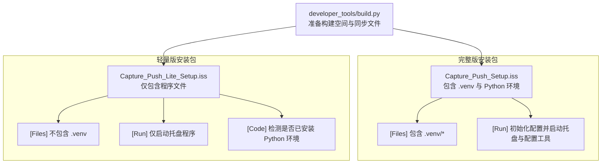
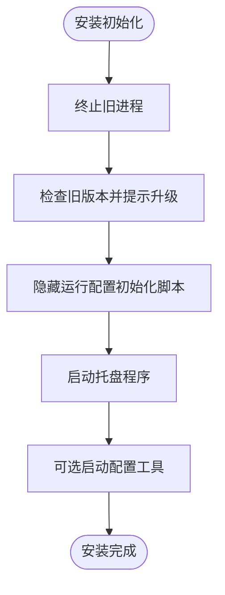
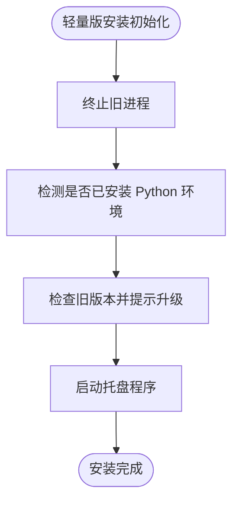
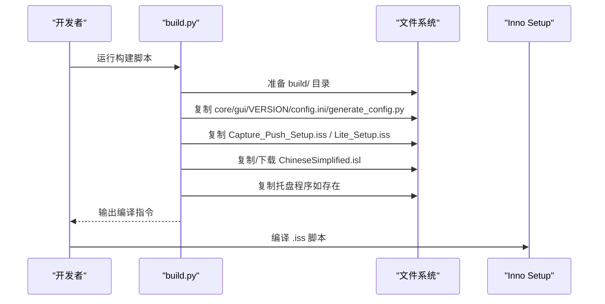
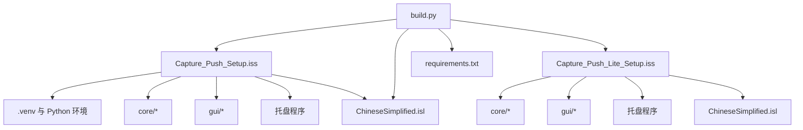

# 安装包制作

<cite>
**本文引用的文件**
- [Capture_Push_Setup.iss](file://Capture_Push_Setup.iss)
- [Capture_Push_Lite_Setup.iss](file://Capture_Push_Lite_Setup.iss)
- [ChineseSimplified.isl](file://ChineseSimplified.isl)
- [build.py](file://developer_tools/build.py)
- [build_installer_exe.py](file://build_installer_exe.py)
- [generate_config.py](file://generate_config.py)
- [README.md](file://README.md)
- [requirements.txt](file://requirements.txt)
- [PYTHON_SETUP_README.txt](file://PYTHON_SETUP_README.txt)
</cite>

## 目录
1. [简介](#简介)
2. [项目结构](#项目结构)
3. [核心组件](#核心组件)
4. [架构总览](#架构总览)
5. [详细组件分析](#详细组件分析)
6. [依赖关系分析](#依赖关系分析)
7. [性能考量](#性能考量)
8. [故障排查指南](#故障排查指南)
9. [结论](#结论)
10. [附录](#附录)

## 简介
本技术文档面向安装包制作工程师与运维人员，系统性阐述基于 Inno Setup 的安装包配置与使用，涵盖完整版（Capture_Push_Setup.iss）与轻量版（Capture_Push_Lite_Setup.iss）两种打包策略及其差异。文档详细说明安装包的文件组织结构、安装向导配置与用户界面定制、多语言支持机制（ChineseSimplified.isl）、安装与卸载流程、注册表操作、打包流程、测试方法与发布前质量检查清单。

## 项目结构
围绕安装包制作的相关文件与脚本分布如下：
- Inno Setup 脚本：完整版与轻量版脚本分别定义安装行为、文件集合、任务与注册表项。
- 本地化文件：ChineseSimplified.isl 提供中文简体界面文本。
- 构建脚本：developer_tools/build.py 自动准备隔离构建空间，同步核心代码与脚本，确保 Inno Setup 可直接编译。
- 依赖与配置：requirements.txt 定义 Python 依赖；generate_config.py 生成安装配置信息。
- 打包辅助：build_installer_exe.py 用于将 installer.py 打包为独立可执行文件（如存在）。

图表来源
- [build.py](file://developer_tools/build.py#L182-L223)
- [Capture_Push_Setup.iss](file://Capture_Push_Setup.iss#L45-L52)
- [Capture_Push_Lite_Setup.iss](file://Capture_Push_Lite_Setup.iss#L48-L55)
- [ChineseSimplified.isl](file://ChineseSimplified.isl#L38-L419)
- [generate_config.py](file://generate_config.py#L18-L80)
- [requirements.txt](file://requirements.txt#L1-L3)
- [build_installer_exe.py](file://build_installer_exe.py#L16-L73)
- [PYTHON_SETUP_README.txt](file://PYTHON_SETUP_README.txt#L1-L49)

章节来源
- [README.md](file://README.md#L60-L83)
- [build.py](file://developer_tools/build.py#L116-L223)

## 核心组件
- Inno Setup 脚本（完整版与轻量版）
  - 定义应用元数据、输出文件名、压缩与权限要求、向导样式与最小系统版本。
  - 配置任务（桌面图标、开机自启）、文件集合（含 .venv 或不含 .venv）、图标、注册表项、安装后运行项与卸载清理。
- 本地化文件（ChineseSimplified.isl）
  - 提供安装向导各页面与状态消息的中文简体翻译，确保多语言体验一致。
- 构建脚本（developer_tools/build.py）
  - 自动准备隔离构建空间，同步核心代码与脚本，确保 Inno Setup 可直接编译。
- 依赖与配置（requirements.txt、generate_config.py）
  - requirements.txt 定义 Python 依赖；generate_config.py 生成安装配置信息，便于用户了解安装路径、注册表项与卸载说明。
- 打包辅助（build_installer_exe.py）
  - 将 installer.py 打包为独立可执行文件（如存在），便于后续安装流程调用。

章节来源
- [Capture_Push_Setup.iss](file://Capture_Push_Setup.iss#L17-L67)
- [Capture_Push_Lite_Setup.iss](file://Capture_Push_Lite_Setup.iss#L17-L66)
- [ChineseSimplified.isl](file://ChineseSimplified.isl#L38-L419)
- [build.py](file://developer_tools/build.py#L116-L223)
- [generate_config.py](file://generate_config.py#L18-L80)
- [requirements.txt](file://requirements.txt#L1-L3)
- [build_installer_exe.py](file://build_installer_exe.py#L16-L73)

## 架构总览
下图展示完整版与轻量版安装包的差异点与共同点，以及与构建脚本的关系。

图表来源
- [Capture_Push_Setup.iss](file://Capture_Push_Setup.iss#L45-L67)
- [Capture_Push_Lite_Setup.iss](file://Capture_Push_Lite_Setup.iss#L48-L66)
- [build.py](file://developer_tools/build.py#L182-L223)

## 详细组件分析

### Inno Setup 脚本（完整版）
- 应用元数据与系统要求
  - 应用标识、名称、版本（从 VERSION 文件读取）、发布者、默认安装目录、输出目录与文件名、压缩算法与固态压缩、管理员权限、现代向导风格、最小系统版本等。
- 语言与本地化
  - 通过 [Languages] 指定中文简体语言与 MessagesFile。
- 任务与向导页
  - 提供“创建桌面快捷方式”和“开机自动启动托盘程序”两个任务，默认均启用，可通过命令行参数覆盖。
- 文件集合
  - 包含 .venv、core、gui、VERSION、config.ini、generate_config.py、托盘程序等。
- 图标与开始菜单
  - 在“开始”菜单组创建托盘程序、配置工具与卸载程序的快捷方式；桌面可选创建快捷方式。
- 注册表
  - 写入安装路径到 HKLM64\SOFTWARE\Capture_Push；若启用开机自启，写入 HKLM64\SOFTWARE\Microsoft\Windows\CurrentVersion\Run。
- 安装后运行
  - 隐藏运行 generate_config.py 初始化配置；启动托盘程序；可选隐藏运行配置工具。
- 卸载清理
  - 删除 .venv、应用日志、状态与缓存目录；删除用户目录下的日志文件。
- 自定义代码
  - 命令行参数解析函数；任务勾选逻辑；安装前终止旧进程；升级前询问；卸载前询问是否保留配置；卸载后按选择清理用户目录。

图表来源
- [Capture_Push_Setup.iss](file://Capture_Push_Setup.iss#L133-L167)

章节来源
- [Capture_Push_Setup.iss](file://Capture_Push_Setup.iss#L17-L76)
- [Capture_Push_Setup.iss](file://Capture_Push_Setup.iss#L77-L167)

### Inno Setup 脚本（轻量版）
- 应用元数据与系统要求
  - 与完整版类似，但禁用“程序组”页面，保留“欢迎”页面。
- 语言与本地化
  - 同样使用 ChineseSimplified.isl。
- 任务与向导页
  - 任务同完整版，可通过命令行参数覆盖。
- 文件集合
  - 仅包含 core、gui、VERSION、config.ini、generate_config.py、托盘程序，不包含 .venv。
- 注册表
  - 仅写入安装路径；开机自启键使用 dontcreatekey，避免在无环境时创建无效项。
- 安装后运行
  - 仅启动托盘程序。
- 自定义代码
  - 命令行参数解析函数；任务勾选逻辑；安装前终止旧进程；检测是否已安装 Python 环境并提示风险；升级前询问；首次安装提示建议使用完整版。

图表来源
- [Capture_Push_Lite_Setup.iss](file://Capture_Push_Lite_Setup.iss#L138-L174)

章节来源
- [Capture_Push_Lite_Setup.iss](file://Capture_Push_Lite_Setup.iss#L17-L66)
- [Capture_Push_Lite_Setup.iss](file://Capture_Push_Lite_Setup.iss#L67-L174)

### 本地化文件（ChineseSimplified.isl）
- 作用
  - 提供安装向导各页面与状态消息的中文简体翻译，确保用户界面一致性。
- 关键点
  - [LangOptions] 定义语言名称、语言 ID 与代码页；[Messages] 与 [CustomMessages] 提供具体文本映射。

章节来源
- [ChineseSimplified.isl](file://ChineseSimplified.isl#L17-L419)

### 构建脚本（developer_tools/build.py）
- 功能
  - 准备隔离构建空间（build/），复制核心代码与脚本，同步语言包，复制托盘程序（如存在），输出打包指令。
- 关键流程
  - 下载并解压便携式 Python（含 get-pip），安装依赖；同步 core、gui、VERSION、config.ini、generate_config.py、两个 .iss 脚本与语言包；复制托盘程序至打包目录；输出 Inno Setup 编译指令。

图表来源
- [build.py](file://developer_tools/build.py#L116-L223)

章节来源
- [build.py](file://developer_tools/build.py#L116-L223)

### 依赖与配置（requirements.txt、generate_config.py）
- requirements.txt
  - 定义 Python 依赖（requests、beautifulsoup4、PySide6）。
- generate_config.py
  - 生成 install_config.txt，记录安装路径、注册表项、虚拟环境位置、依赖列表、卸载说明与注意事项。

章节来源
- [requirements.txt](file://requirements.txt#L1-L3)
- [generate_config.py](file://generate_config.py#L18-L80)

### 打包辅助（build_installer_exe.py）
- 功能
  - 将 installer.py 打包为独立可执行文件（如存在），便于安装流程调用。
- 注意
  - 若项目中不存在 installer.py，脚本会报错并退出。

章节来源
- [build_installer_exe.py](file://build_installer_exe.py#L16-L73)

## 依赖关系分析
- Inno Setup 脚本依赖
  - 完整版依赖 .venv 与 Python 环境；轻量版不依赖 .venv，但安装前检测系统是否已具备 Python 环境。
  - 两者均依赖 ChineseSimplified.isl 实现本地化。
- 构建脚本依赖
  - 依赖 requirements.txt 安装 Python 依赖；同步核心代码与脚本；准备语言包与托盘程序。
- 注册表与任务
  - 两者均写入安装路径；轻量版在无环境时避免创建无效自启动项。

图表来源
- [Capture_Push_Setup.iss](file://Capture_Push_Setup.iss#L45-L52)
- [Capture_Push_Lite_Setup.iss](file://Capture_Push_Lite_Setup.iss#L48-L55)
- [build.py](file://developer_tools/build.py#L182-L223)
- [requirements.txt](file://requirements.txt#L1-L3)

章节来源
- [Capture_Push_Setup.iss](file://Capture_Push_Setup.iss#L45-L67)
- [Capture_Push_Lite_Setup.iss](file://Capture_Push_Lite_Setup.iss#L48-L66)
- [build.py](file://developer_tools/build.py#L182-L223)

## 性能考量
- 压缩与打包
  - 完整版使用 lzma2/normal，轻量版使用 lzma2/ultra64，结合 SolidCompression 与 InternalCompressLevel，平衡体积与压缩速度。
- 安装流程
  - 通过 AppMutex 避免多实例；CloseApplications 自动关闭冲突进程；安装后隐藏运行配置初始化脚本，减少前台干扰。
- 依赖安装
  - 构建脚本使用本地缓存与网络回退策略，提升依赖安装稳定性与速度。

章节来源
- [Capture_Push_Setup.iss](file://Capture_Push_Setup.iss#L26-L28)
- [Capture_Push_Lite_Setup.iss](file://Capture_Push_Lite_Setup.iss#L26-L29)
- [build.py](file://developer_tools/build.py#L78-L114)

## 故障排查指南
- 安装失败或提示缺少 Python 环境
  - 轻量版会在检测到系统缺少 Python 环境时提示风险，建议使用完整版或先安装 Python 环境。
- 升级冲突
  - 安装前会检测旧版本并提示升级；若用户取消，安装将中止。
- 卸载配置保留
  - 卸载前询问是否保留配置文件与日志；若选择保留，卸载后不会删除用户目录下的配置与日志。
- 语言包缺失
  - 确保 ChineseSimplified.isl 与 .iss 同目录，否则安装向导可能无法正确加载中文界面。
- 托盘程序无法启动
  - 检查注册表自启动项与安装路径；确认 .venv 与依赖完整（完整版）。

章节来源
- [Capture_Push_Lite_Setup.iss](file://Capture_Push_Lite_Setup.iss#L148-L172)
- [Capture_Push_Setup.iss](file://Capture_Push_Setup.iss#L141-L148)
- [Capture_Push_Setup.iss](file://Capture_Push_Setup.iss#L151-L166)
- [ChineseSimplified.isl](file://ChineseSimplified.isl#L38-L419)

## 结论
完整版与轻量版安装包针对不同场景提供差异化打包策略：完整版内置 Python 环境，适合首次安装与无系统 Python 的用户；轻量版仅包含程序文件，适合已有 Python 环境的用户或二次更新。通过本地化文件与构建脚本，安装包制作流程标准化、自动化程度高，配合完善的注册表与卸载清理策略，确保安装与卸载过程稳定可靠。

## 附录

### 安装包制作流程
- 准备构建空间
  - 运行 developer_tools/build.py，自动同步核心代码、脚本与语言包，准备打包目录。
- 生成安装包
  - 使用 Inno Setup 编译 build/ 目录下的 .iss 脚本：
    - 完整版：ISCC build\Capture_Push_Setup.iss
    - 轻量版：ISCC build\Capture_Push_Lite_Setup.iss
- 可选：打包 installer.py
  - 运行 build_installer_exe.py，将 installer.py 打包为独立可执行文件（如存在）。

章节来源
- [build.py](file://developer_tools/build.py#L220-L223)
- [README.md](file://README.md#L120-L124)
- [build_installer_exe.py](file://build_installer_exe.py#L16-L73)

### 测试方法
- 功能测试
  - 验证完整版安装后可正常启动托盘与配置工具；验证轻量版安装后提示 Python 环境风险并可选择继续。
- 升级测试
  - 在旧版本基础上运行新安装包，确认升级提示与覆盖安装流程。
- 卸载测试
  - 选择保留配置与不保留配置两种场景，验证卸载后清理与保留行为。
- 本地化测试
  - 切换安装语言，确认界面文本正确显示。

章节来源
- [Capture_Push_Setup.iss](file://Capture_Push_Setup.iss#L141-L148)
- [Capture_Push_Lite_Setup.iss](file://Capture_Push_Lite_Setup.iss#L148-L172)
- [ChineseSimplified.isl](file://ChineseSimplified.isl#L38-L419)

### 发布前质量检查清单
- 文件完整性
  - 确认 .iss、ChineseSimplified.isl、VERSION、config.ini、generate_config.py、托盘程序存在于打包目录。
- 依赖一致性
  - 确认 requirements.txt 与 generate_config.py 中列出的依赖一致。
- 安装流程
  - 完整版：验证 .venv 与 Python 环境、配置初始化、托盘与配置工具启动。
  - 轻量版：验证 Python 环境检测、升级提示与托盘启动。
- 注册表与任务
  - 验证安装路径与自启动项写入；卸载后清理行为符合预期。
- 本地化
  - 确认中文简体界面文本完整、无乱码。
- 性能与体积
  - 对比压缩级别与输出体积，确保满足分发需求。

章节来源
- [requirements.txt](file://requirements.txt#L1-L3)
- [generate_config.py](file://generate_config.py#L18-L80)
- [Capture_Push_Setup.iss](file://Capture_Push_Setup.iss#L45-L67)
- [Capture_Push_Lite_Setup.iss](file://Capture_Push_Lite_Setup.iss#L48-L66)
- [ChineseSimplified.isl](file://ChineseSimplified.isl#L38-L419)