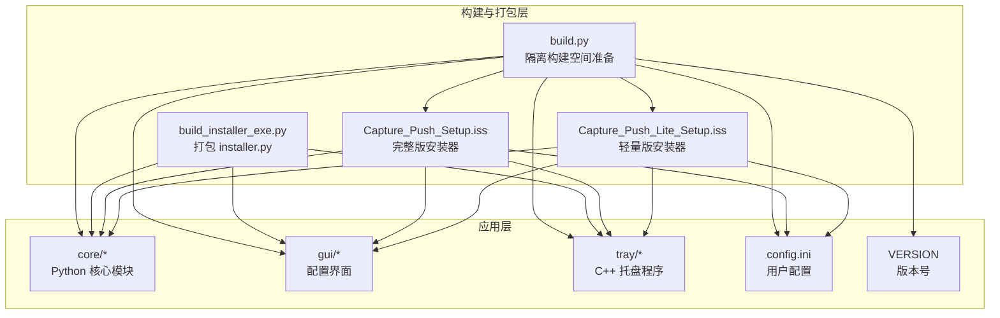
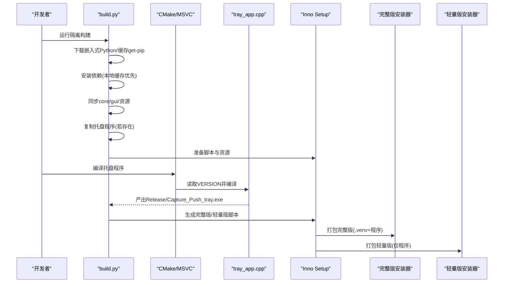
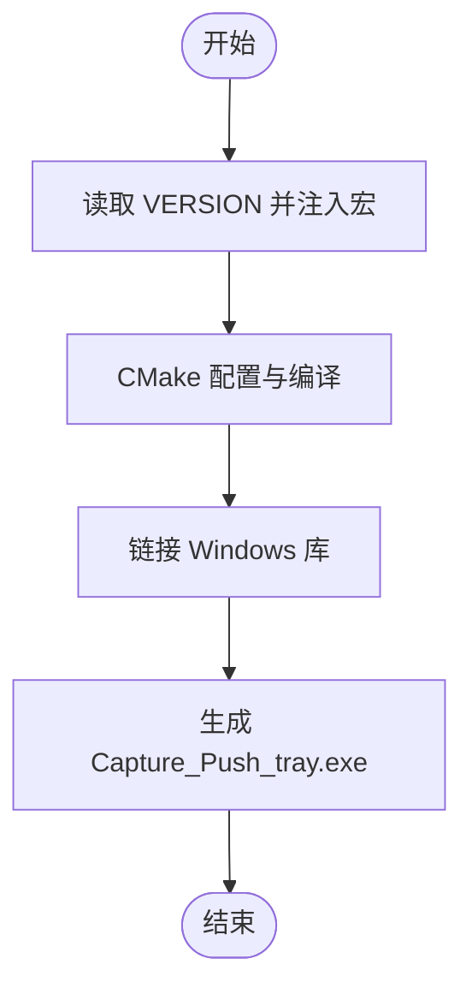
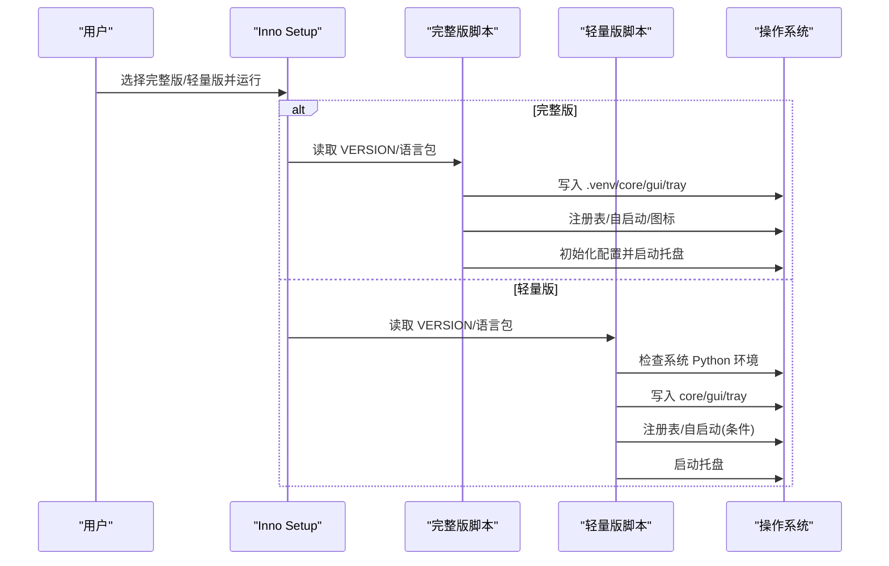
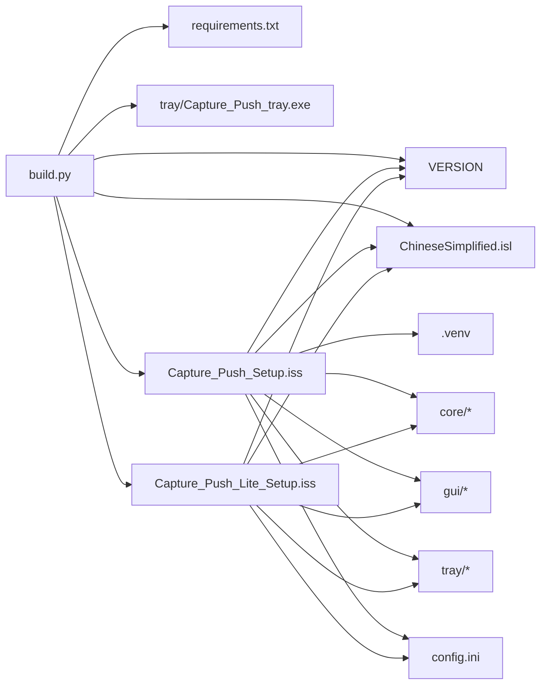

# 构建与打包

<cite>
**本文引用的文件**
- [README.md](file://README.md)
- [build_installer_exe.py](file://build_installer_exe.py)
- [developer_tools/build.py](file://developer_tools/build.py)
- [developer_tools/changconfig.py](file://developer_tools/changconfig.py)
- [generate_config.py](file://generate_config.py)
- [Capture_Push_Setup.iss](file://Capture_Push_Setup.iss)
- [Capture_Push_Lite_Setup.iss](file://Capture_Push_Lite_Setup.iss)
- [tray/CMakeLists.txt](file://tray/CMakeLists.txt)
- [tray/tray_app.cpp](file://tray/tray_app.cpp)
- [pyproject.toml](file://pyproject.toml)
- [requirements.txt](file://requirements.txt)
- [config.ini](file://config.ini)
- [VERSION](file://VERSION)
</cite>

## 目录
1. [简介](#简介)
2. [项目结构](#项目结构)
3. [核心组件](#核心组件)
4. [架构总览](#架构总览)
5. [详细组件分析](#详细组件分析)
6. [依赖关系分析](#依赖关系分析)
7. [性能考量](#性能考量)
8. [故障排查指南](#故障排查指南)
9. [结论](#结论)
10. [附录](#附录)

## 简介
本文件面向构建与打包工程师，系统性阐述 Capture_Push 项目的构建与打包体系，涵盖：
- Python 代码打包与依赖管理
- C++ 托盘程序的编译与资源处理
- Inno Setup 脚本配置与完整版/轻量版差异
- 安装包生成流程、依赖处理与文件组织
- 本地构建环境搭建与常见问题
- 版本管理、发布流程与自动化最佳实践

## 项目结构
项目采用“Python 核心 + C++ 托盘 + Inno Setup 安装器”的混合架构，核心目录与职责如下：
- core：Python 核心业务模块（含多院校适配）
- gui：图形化配置界面
- tray：C++ 托盘程序（Win32）
- developer_tools：构建与辅助工具
- 安装脚本：Inno Setup 脚本（完整版与轻量版）

图表来源
- [developer_tools/build.py](file://developer_tools/build.py#L116-L223)
- [Capture_Push_Setup.iss](file://Capture_Push_Setup.iss#L45-L52)
- [Capture_Push_Lite_Setup.iss](file://Capture_Push_Lite_Setup.iss#L48-L55)

章节来源
- [README.md](file://README.md#L60-L83)

## 核心组件
- 隔离构建脚本：准备构建空间、下载嵌入式 Python、安装依赖、同步资源、准备语言包、复制托盘程序
- 安装器打包脚本：将 installer.py 打包为独立可执行文件
- Inno Setup 安装器：完整版（含嵌入式 Python）与轻量版（仅程序文件）
- CMake 构建脚本：编译 C++ 托盘程序
- 配置与版本：VERSION 文件驱动版本号，config.ini 提供运行配置

章节来源
- [developer_tools/build.py](file://developer_tools/build.py#L116-L223)
- [build_installer_exe.py](file://build_installer_exe.py#L16-L69)
- [Capture_Push_Setup.iss](file://Capture_Push_Setup.iss#L13-L25)
- [Capture_Push_Lite_Setup.iss](file://Capture_Push_Lite_Setup.iss#L13-L26)
- [tray/CMakeLists.txt](file://tray/CMakeLists.txt#L6-L15)
- [config.ini](file://config.ini#L1-L36)
- [VERSION](file://VERSION)

## 架构总览
整体构建与打包流程分为三阶段：
1) 隔离构建空间准备：下载嵌入式 Python、安装依赖、同步源码与资源
2) 托盘程序编译：使用 CMake/MSVC 编译 C++ 托盘程序
3) 安装包生成：使用 Inno Setup 编译完整版或轻量版安装器

图表来源
- [developer_tools/build.py](file://developer_tools/build.py#L116-L223)
- [tray/CMakeLists.txt](file://tray/CMakeLists.txt#L6-L15)
- [tray/tray_app.cpp](file://tray/tray_app.cpp#L697-L746)
- [Capture_Push_Setup.iss](file://Capture_Push_Setup.iss#L45-L67)
- [Capture_Push_Lite_Setup.iss](file://Capture_Push_Lite_Setup.iss#L48-L66)

## 详细组件分析

### Python 代码打包与依赖管理
- 依赖来源与版本约束
  - 项目使用 requirements.txt 与 pyproject.toml 双轨约束，确保一致性与兼容性
  - 依赖包括 requests、beautifulsoup4、PySide6 等
- 隔离构建与缓存
  - build.py 在 build/ 目录内准备 .venv，使用本地缓存加速 pip 安装
  - 支持网络回退，保证在受限网络环境下仍可完成安装
- 安装器打包
  - build_installer_exe.py 将 installer.py 打包为独立可执行文件，排除大型模块与 GUI 相关模块，减少体积

章节来源
- [requirements.txt](file://requirements.txt#L1-L3)
- [pyproject.toml](file://pyproject.toml#L7-L11)
- [developer_tools/build.py](file://developer_tools/build.py#L78-L114)
- [build_installer_exe.py](file://build_installer_exe.py#L42-L55)

### C++ 托盘程序编译
- 版本号注入
  - CMake 读取 VERSION 文件并注入到 C++ 宏，确保托盘程序版本与项目一致
- 编译配置
  - 使用 C++17、UTF-8 源码编码、WIN32 可执行（隐藏控制台窗口）
  - 链接常用 Windows 库，满足托盘图标、消息循环、注册表、进程枚举等需求
- 运行时行为
  - 托盘程序具备互斥运行、日志系统、定时任务、菜单交互、调用 Python 核心等功能

图表来源
- [tray/CMakeLists.txt](file://tray/CMakeLists.txt#L6-L15)
- [tray/CMakeLists.txt](file://tray/CMakeLists.txt#L22-L38)
- [tray/tray_app.cpp](file://tray/tray_app.cpp#L697-L746)

章节来源
- [tray/CMakeLists.txt](file://tray/CMakeLists.txt#L1-L38)
- [tray/tray_app.cpp](file://tray/tray_app.cpp#L1-L746)

### Inno Setup 脚本配置与使用
- 版本与语言
  - 通过 VERSION 文件读取版本号，使用简体中文语言包
- 完整版（含嵌入式 Python）
  - 打包 .venv、core、gui、tray 等目录；安装后初始化配置并启动托盘
  - 支持开机自启、桌面图标等任务
- 轻量版（不含嵌入式 Python）
  - 仅打包核心程序文件；安装前检查系统是否已存在 Python 环境
  - 首次安装建议使用完整版，轻量版适合升级场景
- 命令行参数
  - 支持静默安装、指定安装目录、桌面图标开关、开机自启开关等

图表来源
- [Capture_Push_Setup.iss](file://Capture_Push_Setup.iss#L13-L67)
- [Capture_Push_Lite_Setup.iss](file://Capture_Push_Lite_Setup.iss#L13-L66)

章节来源
- [Capture_Push_Setup.iss](file://Capture_Push_Setup.iss#L1-L167)
- [Capture_Push_Lite_Setup.iss](file://Capture_Push_Lite_Setup.iss#L1-L174)

### 安装包生成过程、依赖处理与文件组织
- 生成安装器步骤
  - 先编译 C++ 托盘程序，再运行隔离构建脚本，最后使用 Inno Setup 编译完整版或轻量版
- 依赖处理
  - pip 安装优先使用本地缓存，失败后允许网络下载，提升稳定性
- 文件组织
  - 完整版包含 .venv（嵌入式 Python）、core、gui、tray、config.ini、VERSION、语言包
  - 轻量版不含 .venv，仅包含程序文件与配置模板

章节来源
- [developer_tools/build.py](file://developer_tools/build.py#L116-L223)
- [README.md](file://README.md#L101-L124)

### 本地构建环境搭建指南
- 必要工具
  - Python 3.8+、CMake、MSVC（Visual Studio 2022）、Inno Setup
- 步骤
  - 构建 C++ 托盘程序：cd tray，CMake 配置并编译 Release
  - 准备构建空间：运行 developer_tools/build.py
  - 生成安装包：ISCC 编译完整版或轻量版 .iss 脚本
- 注意事项
  - Windows 平台专用，脚本会自动处理编码与缓存
  - 若缺少托盘程序，轻量版会提示缺少 Python 环境

章节来源
- [README.md](file://README.md#L101-L124)
- [developer_tools/build.py](file://developer_tools/build.py#L225-L229)

### 版本管理、发布流程与自动化最佳实践
- 版本号来源
  - VERSION 文件作为唯一真实来源，Inno Setup 与 CMake 均读取该文件
- 发布策略
  - 完整版：面向首次安装用户，包含嵌入式 Python
  - 轻量版：面向升级场景，减少体积
- 自动化建议
  - 使用 CI/CD 在隔离环境中执行 build.py 与 ISCC
  - 对下载资源（Python、语言包、get-pip）建立缓存目录，提升稳定性
  - 为 Inno Setup 输出产物建立命名规范（含版本号）

章节来源
- [Capture_Push_Setup.iss](file://Capture_Push_Setup.iss#L13-L20)
- [Capture_Push_Lite_Setup.iss](file://Capture_Push_Lite_Setup.iss#L13-L20)
- [tray/CMakeLists.txt](file://tray/CMakeLists.txt#L6-L9)
- [README.md](file://README.md#L125-L129)

## 依赖关系分析
- 构建脚本依赖
  - build.py 依赖 VERSION、requirements.txt、语言包、托盘程序产物
  - Inno Setup 脚本依赖 VERSION、语言包、各模块目录
- 运行时依赖
  - 托盘程序依赖 .venv 中的 Python 解释器与核心模块
  - 轻量版要求系统已具备 Python 环境

图表来源
- [developer_tools/build.py](file://developer_tools/build.py#L182-L216)
- [Capture_Push_Setup.iss](file://Capture_Push_Setup.iss#L45-L52)
- [Capture_Push_Lite_Setup.iss](file://Capture_Push_Lite_Setup.iss#L48-L55)

章节来源
- [developer_tools/build.py](file://developer_tools/build.py#L182-L216)
- [Capture_Push_Setup.iss](file://Capture_Push_Setup.iss#L45-L52)
- [Capture_Push_Lite_Setup.iss](file://Capture_Push_Lite_Setup.iss#L48-L55)

## 性能考量
- 体积优化
  - 安装器打包时排除大型模块与 GUI 相关模块，减小体积
  - 轻量版不包含 .venv，显著降低安装包大小
- 启动与运行
  - 托盘程序使用互斥锁与进程枚举避免重复启动
  - 日志系统按大小滚动，避免磁盘占用过大
- 构建效率
  - pip 安装优先使用本地缓存，失败后允许网络下载，兼顾速度与可靠性

章节来源
- [build_installer_exe.py](file://build_installer_exe.py#L42-L55)
- [developer_tools/build.py](file://developer_tools/build.py#L78-L114)
- [tray/tray_app.cpp](file://tray/tray_app.cpp#L216-L248)

## 故障排查指南
- 托盘程序缺失
  - 现象：轻量版安装后提示缺少 Python 环境
  - 处理：先构建 C++ 托盘程序，再运行隔离构建脚本
- 依赖安装失败
  - 现象：pip 安装报错或超时
  - 处理：检查网络与缓存目录权限，允许网络回退安装
- 编码问题
  - 现象：Windows CI 环境下编码异常
  - 处理：脚本已强制 UTF-8 输出，确保终端与日志编码一致
- 配置文件未生成
  - 现象：安装后无配置文件
  - 处理：完整版安装器会初始化配置；若缺失，使用 developer_tools/changconfig.py 初始化

章节来源
- [developer_tools/build.py](file://developer_tools/build.py#L207-L216)
- [developer_tools/build.py](file://developer_tools/build.py#L102-L114)
- [build_installer_exe.py](file://build_installer_exe.py#L10-L14)
- [developer_tools/changconfig.py](file://developer_tools/changconfig.py#L1-L52)

## 结论
本项目通过“隔离构建 + CMake 编译 + Inno Setup 安装”的组合，实现了稳定的跨平台打包能力。完整版与轻量版的差异化策略满足不同场景需求，配合完善的缓存与回退机制，提升了构建的可靠性与效率。建议在 CI/CD 中固化上述流程，确保版本一致性与可重复性。

## 附录
- 常用命令参考
  - 构建托盘程序：cd tray && cmake -B build -G "Visual Studio 17 2022" -A x64 && cmake --build build --config Release
  - 准备构建空间：python developer_tools/build.py
  - 生成完整版安装包：ISCC build\Capture_Push_Setup.iss
  - 生成轻量版安装包：ISCC build\Capture_Push_Lite_Setup.iss

章节来源
- [README.md](file://README.md#L101-L124)