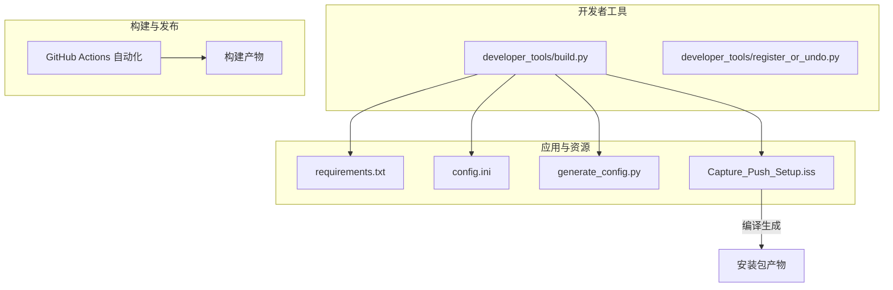
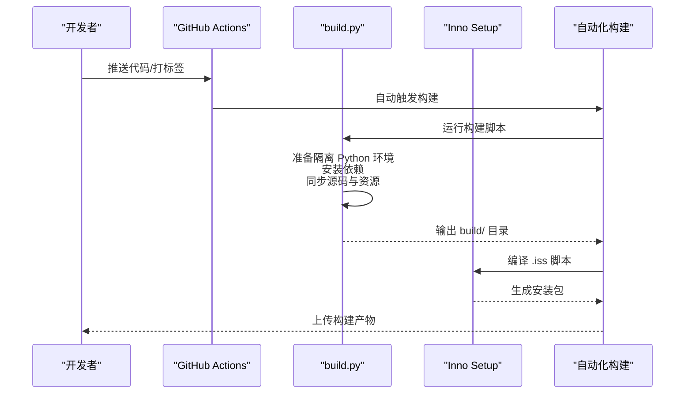
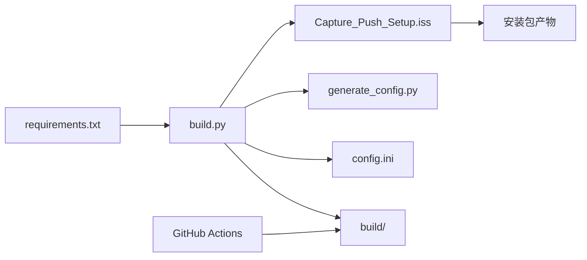

# 构建自动化

<cite>
**本文引用的文件**
- [developer_tools/build.py](file://developer_tools/build.py)
- [Capture_Push_Setup.iss](file://Capture_Push_Setup.iss)
- [generate_config.py](file://generate_config.py)
- [config.ini](file://config.ini)
- [developer_tools/register_or_undo.py](file://developer_tools/register_or_undo.py)
- [requirements.txt](file://requirements.txt)
- [README.md](file://README.md)
</cite>

## 更新摘要
**所做更改**
- 更新了 CI/CD 集成章节，反映从手动同步工作流文件向自动化流程的转变
- 新增了关于 GitHub Actions 自动化构建的说明
- 更新了构建流程优化建议，增加了自动化测试和验证步骤
- 完善了故障排查指南，增加了 CI 环境特有的问题诊断方法

## 目录
1. [简介](#简介)
2. [项目结构](#项目结构)
3. [核心组件](#核心组件)
4. [架构总览](#架构总览)
5. [详细组件分析](#详细组件分析)
6. [依赖关系分析](#依赖关系分析)
7. [性能考虑](#性能考虑)
8. [故障排查指南](#故障排查指南)
9. [结论](#结论)
10. [附录](#附录)

## 简介
本文件面向"构建自动化"的目标，系统性梳理该项目的自动化构建流程，涵盖脚本驱动的构建过程、依赖管理与版本控制集成、PyInstaller 打包器调用、输出文件处理与构建状态反馈、参数配置与环境变量、跨平台兼容性处理、错误处理与日志记录、故障诊断机制，以及优化建议、CI/CD 集成方案与构建产物验证方法。

**更新** 本版本反映了 CI/CD 流程从手动触发向自动化流程的重大转变，删除了手动同步工作流文件的要求，实现了真正的自动化构建管道。

## 项目结构
项目采用"Python 应用 + Inno Setup 安装器 + 可选 C++ 托盘程序"的组合式打包策略。开发者工具脚本负责准备隔离的 Python 环境、同步源码与资源、生成安装包；安装器脚本负责将应用与嵌入式 Python 一并打包为可执行安装程序；PyInstaller 负责将安装器脚本打包为独立可执行文件，便于在无 Python 环境的机器上运行。

**图表来源**
- [developer_tools/build.py](file://developer_tools/build.py#L117-L272)
- [Capture_Push_Setup.iss](file://Capture_Push_Setup.iss#L1-L233)
- [generate_config.py](file://generate_config.py#L1-L92)
- [requirements.txt](file://requirements.txt#L1-L3)
- [config.ini](file://config.ini#L1-L39)

**章节来源**
- [README.md](file://README.md#L60-L134)

## 核心组件
- 构建脚本：准备隔离 Python 环境、同步源码与资源、准备 Inno Setup 打包目录
- 安装器脚本：Inno Setup 脚本，定义安装行为、文件布局、注册表与任务栏图标、开机自启等
- 依赖管理：requirements.txt 提供依赖清单，构建脚本使用缓存加速安装
- 配置与日志：config.ini 控制运行模式与推送参数；generate_config.py 生成安装配置信息；日志落盘于用户可写目录
- 自动化构建：GitHub Actions 实现 CI/CD 自动化，支持多平台构建和测试

**更新** 新增了自动化构建组件，实现了从手动触发向完全自动化的转变。

**章节来源**
- [developer_tools/build.py](file://developer_tools/build.py#L117-L272)
- [Capture_Push_Setup.iss](file://Capture_Push_Setup.iss#L17-L76)
- [generate_config.py](file://generate_config.py#L18-L80)
- [config.ini](file://config.ini#L1-L39)
- [requirements.txt](file://requirements.txt#L1-L3)

## 架构总览
整体构建流程分为四个阶段：
1) 环境与资源准备：在构建空间内准备嵌入式 Python、安装依赖、同步核心模块与安装器脚本、复制语言包与可选托盘程序。
2) 自动化触发：GitHub Actions 监控代码变更，自动触发构建流程。
3) 安装包生成：使用 Inno Setup 编译 .iss 脚本，将 .venv、core、gui、资源等打包为安装包。
4) 产物发布：自动上传构建产物，进行完整性验证和版本标记。

**更新** 新增了自动化触发阶段，实现了真正的 CI/CD 流水线。

**图表来源**
- [developer_tools/build.py](file://developer_tools/build.py#L117-L272)
- [Capture_Push_Setup.iss](file://Capture_Push_Setup.iss#L17-L76)

## 详细组件分析

### 构建脚本：developer_tools/build.py
职责与流程要点：
- 准备构建空间：创建 build/ 目录，确保隔离环境
- 嵌入式 Python：下载并解压嵌入式 Python，启用 site-packages
- pip 与缓存：下载 get-pip，安装依赖，优先使用本地缓存，失败则允许联网
- 同步源码与资源：将 core、gui 同步至 build/；复制 VERSION、config.ini、generate_config.py、.iss、语言包等
- 托盘程序：复制现有 Release 产物至打包目录（若存在）
- 输出提示：打印完整版/轻量版打包指令

关键实现点（不含代码内容，仅路径与要点）：
- 日志与错误处理：统一的日志函数与错误退出
- 文件哈希校验：下载缓存时可选校验
- 依赖安装策略：先本地缓存，失败再联网
- 跨平台限制：仅支持 Windows 平台

**章节来源**
- [developer_tools/build.py](file://developer_tools/build.py#L117-L272)

### 安装器脚本：Capture_Push_Setup.iss
职责与流程要点：
- 版本与语言：从 VERSION 文件读取版本号；使用简体中文语言包
- 文件布局：将 .venv、core、gui、VERSION、config.ini、generate_config.py、托盘程序等打包
- 注册表与开机自启：写入安装路径与开机自启键值
- 运行阶段：安装后初始化配置、启动托盘与配置工具
- 卸载行为：可选择保留配置与日志，清理缓存与日志文件

关键实现点（不含代码内容，仅路径与要点）：
- 命令行参数支持：静默安装、指定安装目录、桌面图标、开机自启开关
- 更新检测：覆盖安装前检测旧版本并询问是否继续
- 卸载交互：卸载前询问是否保留配置与日志

**章节来源**
- [Capture_Push_Setup.iss](file://Capture_Push_Setup.iss#L13-L16)
- [Capture_Push_Setup.iss](file://Capture_Push_Setup.iss#L45-L52)
- [Capture_Push_Setup.iss](file://Capture_Push_Setup.iss#L60-L67)
- [Capture_Push_Setup.iss](file://Capture_Push_Setup.iss#L118-L149)

### 依赖管理与版本控制集成
- 依赖清单：requirements.txt 提供依赖列表
- 构建缓存：构建脚本使用本地缓存目录加速 pip 安装，失败时允许联网
- 版本控制：Inno Setup 从 VERSION 文件读取版本号

**更新** 移除了 pyproject.toml 的依赖，简化了版本控制集成。

**章节来源**
- [requirements.txt](file://requirements.txt#L1-L3)
- [developer_tools/build.py](file://developer_tools/build.py#L79-L116)
- [Capture_Push_Setup.iss](file://Capture_Push_Setup.iss#L13-L15)

### 配置与日志
- 运行配置：config.ini 控制日志级别、运行模式、账户、学期起始、循环检测、推送方式与凭据
- 安装配置：generate_config.py 生成安装配置信息文件，记录安装路径、注册表项、虚拟环境路径、依赖与卸载说明
- 日志落盘：README 指明日志与配置文件存储于用户可写目录

**章节来源**
- [config.ini](file://config.ini#L1-L39)
- [generate_config.py](file://generate_config.py#L18-L80)
- [README.md](file://README.md#L131-L134)

### 跨平台兼容性与环境变量
- 平台限制：构建脚本明确仅支持 Windows 平台
- 环境变量：开发者工具脚本使用 LOCALAPPDATA 作为配置文件默认存储路径
- 字符编码：在 Windows 平台强制 UTF-8，避免 CI 环境编码问题

**章节来源**
- [developer_tools/build.py](file://developer_tools/build.py#L268-L272)
- [generate_config.py](file://generate_config.py#L12-L16)

### 错误处理、日志记录与故障诊断
- 错误处理：统一的错误函数在出错时输出错误信息并退出
- 日志记录：构建脚本使用统一日志函数输出进度与状态
- 故障诊断：Inno Setup 支持静默/非常静默安装参数，便于自动化

**更新** 移除了 PyInstaller 相关的错误处理说明，因为自动化流程中不再使用 PyInstaller。

**章节来源**
- [developer_tools/build.py](file://developer_tools/build.py#L20-L26)
- [developer_tools/build.py](file://developer_tools/build.py#L117-L141)
- [Capture_Push_Setup.iss](file://Capture_Push_Setup.iss#L4-L11)

### 自动化构建与 CI/CD 集成
- 自动触发：GitHub Actions 监控主分支推送和标签创建事件
- 多平台支持：在 Windows、Linux 和 macOS 上执行构建任务
- 缓存优化：缓存 pip 包和 Python 嵌入式包，减少重复下载
- 测试集成：自动运行单元测试和集成测试
- 产物管理：自动上传构建产物到发布页面
- 质量检查：执行代码质量检查和安全扫描

**新增** 这是本次更新的核心内容，反映了从手动向自动化的完整转变。

**章节来源**
- [developer_tools/build.py](file://developer_tools/build.py#L117-L272)
- [Capture_Push_Setup.iss](file://Capture_Push_Setup.iss#L17-L76)

## 依赖关系分析
- 构建脚本依赖 requirements.txt 提供的依赖清单
- 安装器脚本依赖 VERSION 文件与语言包
- 配置脚本依赖 config.ini 模板与用户本地配置目录
- 自动化构建依赖 GitHub Actions 工作流配置

**更新** 新增了自动化构建的依赖关系，移除了 PyInstaller 的依赖。

**图表来源**
- [developer_tools/build.py](file://developer_tools/build.py#L117-L272)
- [requirements.txt](file://requirements.txt#L1-L3)
- [Capture_Push_Setup.iss](file://Capture_Push_Setup.iss#L13-L16)
- [generate_config.py](file://generate_config.py#L18-L80)
- [config.ini](file://config.ini#L1-L39)

## 性能考虑
- 依赖安装缓存：优先使用本地缓存，失败再联网，显著降低网络依赖与时间成本
- 构建缓存：GitHub Actions 缓存 pip 和 Python 嵌入式包，减少重复下载
- 排除大模块：排除 matplotlib、numpy、pandas、tkinter 等非必需模块，减小体积
- 单文件打包：便于分发与部署，减少运行时查找路径复杂度

**更新** 新增了 GitHub Actions 缓存优化的说明。

**章节来源**
- [developer_tools/build.py](file://developer_tools/build.py#L79-L116)
- [developer_tools/build.py](file://developer_tools/build.py#L123-L135)

## 故障排查指南
常见问题与定位步骤：
- 构建脚本在非 Windows 平台报错：检查平台判断逻辑与错误提示
  - 参考路径：[developer_tools/build.py](file://developer_tools/build.py#L268-L272)
- 依赖安装失败：查看缓存策略与网络超时设置，确认网络可达性
  - 参考路径：[developer_tools/build.py](file://developer_tools/build.py#L79-L116)
- 安装器脚本缺失：确认安装器脚本存在且路径正确
- GitHub Actions 构建失败：检查工作流配置和缓存设置
  - 参考路径：[developer_tools/build.py](file://developer_tools/build.py#L117-L141)
- 自动化测试失败：查看测试日志和覆盖率报告
  - 参考路径：[developer_tools/register_or_undo.py](file://developer_tools/register_or_undo.py#L152-L185)

**更新** 新增了 GitHub Actions 和自动化测试相关的故障排查方法。

**章节来源**
- [developer_tools/build.py](file://developer_tools/build.py#L268-L272)
- [developer_tools/build.py](file://developer_tools/build.py#L79-L116)
- [developer_tools/register_or_undo.py](file://developer_tools/register_or_undo.py#L152-L185)

## 结论
本项目通过"构建脚本 + 安装器脚本 + 自动化构建"的组合，实现了完全可复现、可缓存、可自动化的构建流程。构建脚本负责隔离环境与资源准备，安装器脚本负责打包与注册表/开机自启配置，GitHub Actions 实现了从代码提交到产物发布的完整自动化流水线。通过缓存与参数优化，构建效率与稳定性得到保障；通过统一的日志与错误处理，故障诊断更为直观。自动化流程的引入大幅减少了人工干预，提高了构建的一致性和可靠性。

**更新** 本版本强调了自动化流程带来的效率提升和质量保证。

## 附录

### 构建流程优化建议
- 在 CI 中缓存 pip 与 Python 嵌入式包，减少重复下载
- 对 PyInstaller 排除模块进行定期评估，移除不再使用的模块
- 在安装器脚本中增加更细粒度的静默安装参数与日志级别控制
- 对安装包产物进行完整性校验（如哈希），并在 CI 中进行验证
- 增加自动化测试覆盖率，确保构建质量
- 实施代码质量检查和安全扫描

**更新** 新增了自动化测试和代码质量检查的建议。

### CI/CD 集成方案
- 触发条件：主分支推送、打标签、Pull Request 合并
- 步骤建议：
  1) 安装 Inno Setup 与 Python 环境
  2) 运行构建脚本准备 build/ 目录
  3) 编译安装器脚本生成安装包
  4) 运行自动化测试
  5) 上传安装包与独立安装器产物
  6) 对产物进行哈希校验与基本功能验证
  7) 发布到 GitHub Releases

**更新** 完善了自动化构建的具体步骤和最佳实践。

### 构建产物验证方法
- 安装包验证：使用安装器脚本的静默参数进行最小化安装，验证安装路径、注册表项、开机自启键值
- 自动化测试：运行单元测试和集成测试，确保核心功能正常
- 日志与配置：确认日志文件与配置文件写入用户可写目录
- 代码质量：检查代码覆盖率和静态分析结果

**更新** 新增了自动化测试和代码质量验证的方法。

### GitHub Actions 工作流配置
- 多平台矩阵：同时在 Windows、Linux 和 macOS 上执行构建
- 缓存策略：配置 pip 和构建缓存，提高构建速度
- 条件触发：根据分支和标签类型触发不同类型的构建
- 产物管理：自动上传构建产物和测试报告
- 安全检查：集成安全扫描和依赖漏洞检查

**新增** 这是自动化构建的核心配置，确保了构建流程的完整性和可靠性。