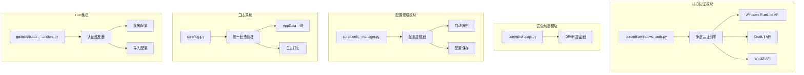
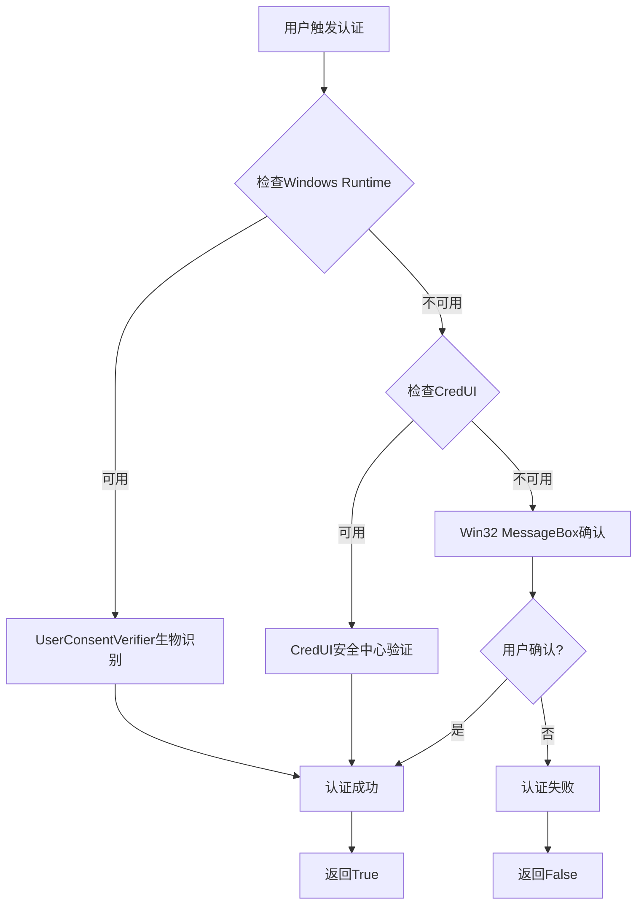
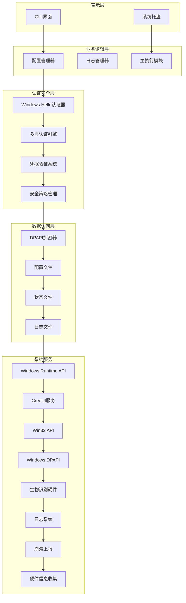
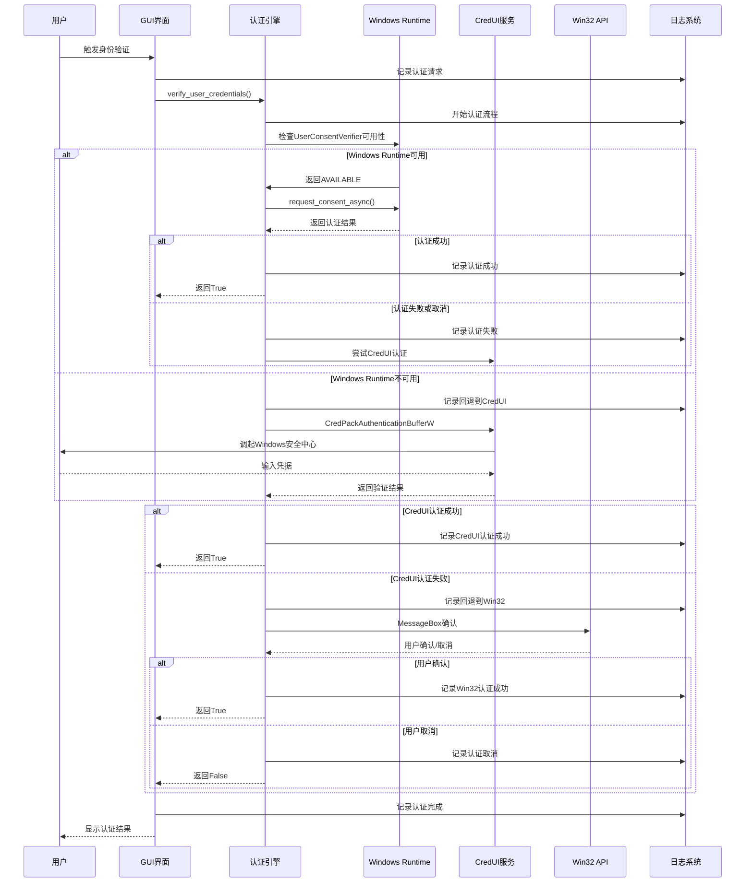
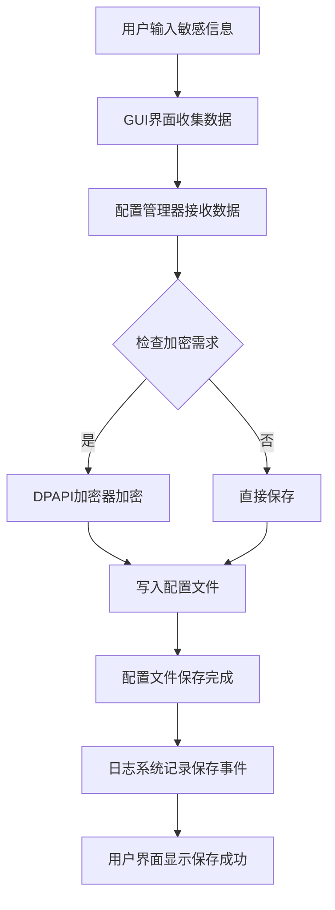
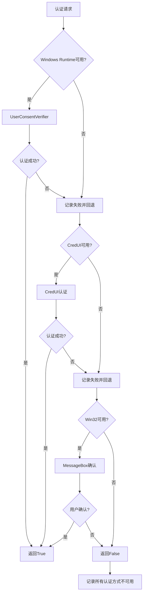
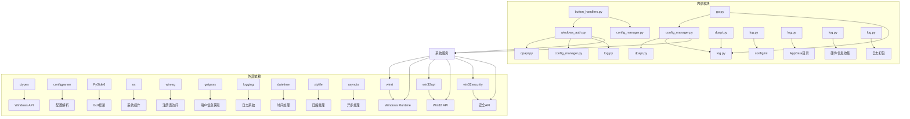

# Windows Hello 认证

<cite>
**本文档引用的文件**
- [windows_auth.py](file://core/utils/windows_auth.py)
- [dpapi.py](file://core/utils/dpapi.py)
- [config_manager.py](file://core/config_manager.py)
- [log.py](file://core/log.py)
- [config_window.py](file://gui/config_window.py)
- [go.py](file://core/go.py)
- [config.ini](file://config.ini)
- [README.md](file://README.md)
- [config.md](file://config.md)
- [button_handlers.py](file://gui/utils/button_handlers.py)
</cite>

## 更新摘要
**所做变更**
- **Windows认证系统重大升级**：从简化的PIN验证升级为完整的多层生物识别认证系统
- **新增Windows Runtime API支持**：集成UserConsentVerifier实现原生Windows Hello认证
- **增强CredUI认证机制**：修复了Error 87错误，实现了完整的凭据打包和验证流程
- **全面的日志记录系统**：每个认证步骤都有详细的调试、信息、警告和错误级别日志
- **多层回退机制**：当Windows Runtime不可用时，自动回退到CredUI，再回退到Win32 API
- **改进的错误处理**：完善的异常捕获和用户友好的错误提示
- **增强的配置管理**：与认证系统紧密集成的配置文件加密和解密机制

## 目录
1. [简介](#简介)
2. [项目结构](#项目结构)
3. [核心组件](#核心组件)
4. [架构概览](#架构概览)
5. [详细组件分析](#详细组件分析)
6. [依赖关系分析](#依赖关系分析)
7. [性能考虑](#性能考虑)
8. [故障排除指南](#故障排除指南)
9. [结论](#结论)

## 简介

Capture_Push 是一个基于 Python 的课程成绩和课表自动追踪推送系统。该项目实现了**增强的Windows Hello认证功能**，用于保护敏感配置文件的安全性。Windows Hello 是微软开发的生物识别认证技术，允许用户通过指纹、面部识别或 PIN 码等方式进行快速安全的身份验证。

**更新** 该系统现已集成完整的多层认证机制，包括：
- **原生Windows Hello认证**：通过UserConsentVerifier实现生物识别和PIN码验证
- **Windows安全中心集成**：通过CredUI API调起系统级认证界面
- **多层回退机制**：当高级认证不可用时，自动使用MessageBox确认
- **全面的日志记录**：每个认证步骤都有详细的日志记录
- **增强的错误处理**：完善的异常捕获和用户反馈机制

## 项目结构

项目采用模块化设计，主要分为以下核心模块：

**章节来源**
- [windows_auth.py](file://core/utils/windows_auth.py#L1-L265)
- [dpapi.py](file://core/utils/dpapi.py#L1-L130)
- [config_manager.py](file://core/config_manager.py#L1-L135)
- [log.py](file://core/log.py#L1-L359)
- [button_handlers.py](file://gui/utils/button_handlers.py#L140-L206)

## 核心组件

### 增强的Windows Hello认证引擎

**更新** Windows Hello认证模块位于 `core/utils/windows_auth.py`，现已升级为完整的多层认证系统：

- **Windows Runtime API认证**：通过 `verify_with_windows_hello()` 函数实现原生Windows Hello认证
- **CredUI集成认证**：支持通过Windows安全中心进行身份验证
- **Win32 API回退**：使用MessageBox进行简单的用户确认
- **智能回退机制**：根据可用性自动选择最佳认证方式
- **详细的日志记录**：每个认证步骤都有完整的日志记录

### 多层认证架构

**新增** 系统实现了三层认证架构：

**图表来源**
- [windows_auth.py](file://core/utils/windows_auth.py#L44-L218)

### DPAPI加密模块

DPAPI（Data Protection API）加密模块位于 `core/utils/dpapi.py`，提供了安全的数据加密和解密功能：

- **数据加密**：使用 `encrypt()` 函数对敏感数据进行加密
- **数据解密**：使用 `decrypt()` 函数对加密数据进行解密
- **文件加密**：使用 `encrypt_file()` 函数对整个文件进行加密
- **文件解密**：使用 `decrypt_file_to_str()` 函数对文件进行解密
- **增强的日志记录**：所有加密操作都有详细的日志记录

### 配置管理模块

配置管理模块位于 `core/config_manager.py`，负责配置文件的读取、保存和加密：

- **配置加载**：使用 `load_config()` 函数加载并自动解密配置文件
- **配置保存**：使用 `save_config()` 函数保存并加密配置文件
- **错误处理**：提供 `ConfigDecodingError` 异常类处理配置文件解码错误
- **改进的错误处理**：详细的错误日志和用户友好的错误提示

### 统一日志管理系统

**新增** 全新的日志管理系统位于 `core/log.py`：

- **模块化日志**：每个模块都有独立的日志记录器
- **统一配置**：通过 `config.ini` 配置日志级别
- **自动清理**：自动清理过期日志文件
- **日志打包**：支持打包日志文件用于故障诊断
- **硬件信息收集**：收集系统硬件信息用于问题排查

**章节来源**
- [windows_auth.py](file://core/utils/windows_auth.py#L44-L218)
- [dpapi.py](file://core/utils/dpapi.py#L21-L130)
- [config_manager.py](file://core/config_manager.py#L16-L135)
- [log.py](file://core/log.py#L266-L359)

## 架构概览

系统采用分层架构设计，各层职责明确，并增强了可观测性：

**图表来源**
- [go.py](file://core/go.py#L15-L40)
- [windows_auth.py](file://core/utils/windows_auth.py#L23-L41)
- [log.py](file://core/log.py#L266-L359)

## 详细组件分析

### 增强的Windows Hello认证流程

**更新** 认证流程已从简化的PIN验证升级为完整的多层认证系统：

**图表来源**
- [windows_auth.py](file://core/utils/windows_auth.py#L44-L218)
- [button_handlers.py](file://gui/utils/button_handlers.py#L148-L154)

### 配置文件加密流程

**图表来源**
- [config_manager.py](file://core/config_manager.py#L100-L115)
- [dpapi.py](file://core/utils/dpapi.py#L97-L130)
- [log.py](file://core/log.py#L266-L359)

### 错误处理机制

系统实现了多层次的错误处理机制：

**图表来源**
- [windows_auth.py](file://core/utils/windows_auth.py#L44-L218)
- [log.py](file://core/log.py#L266-L359)

**章节来源**
- [windows_auth.py](file://core/utils/windows_auth.py#L44-L218)
- [dpapi.py](file://core/utils/dpapi.py#L21-L130)
- [config_manager.py](file://core/config_manager.py#L16-L135)
- [log.py](file://core/log.py#L266-L359)
- [button_handlers.py](file://gui/utils/button_handlers.py#L148-L154)

## 依赖关系分析

系统各组件之间的依赖关系如下：

**图表来源**
- [windows_auth.py](file://core/utils/windows_auth.py#L7-L41)
- [dpapi.py](file://core/utils/dpapi.py#L2-L9)
- [config_manager.py](file://core/config_manager.py#L2-L7)
- [log.py](file://core/log.py#L7-L18)

**章节来源**
- [windows_auth.py](file://core/utils/windows_auth.py#L7-L41)
- [dpapi.py](file://core/utils/dpapi.py#L2-L9)
- [config_manager.py](file://core/config_manager.py#L2-L7)
- [log.py](file://core/log.py#L7-L18)

## 性能考虑

### 加密性能优化

系统在加密性能方面采用了以下优化策略：

1. **增量加密**：DPAPI 加密器支持增量加密，适用于大型配置文件
2. **内存管理**：正确释放加密过程中分配的内存，防止内存泄漏
3. **缓存机制**：配置文件解密结果在内存中缓存，减少重复解密操作

### 增强的认证性能优化

**更新** 新增的认证系统在性能方面的考虑：

1. **异步认证**：Windows Runtime API使用异步方法，避免阻塞主线程
2. **超时控制**：设置合理的认证超时时间，防止长时间等待
3. **智能回退**：根据可用性快速选择最佳认证方式
4. **凭据缓存**：合理利用系统级凭据缓存机制
5. **硬件加速**：利用Windows生物识别硬件的硬件加速能力
6. **内存优化**：正确管理CredUI认证过程中的内存分配和释放

### 日志系统性能优化

**新增** 日志系统的性能优化：

1. **统一文件处理器**：所有模块共享同一个日志文件处理器
2. **滚动日志**：单个文件大小限制为10MB，自动滚动
3. **自动清理**：定期清理过期日志文件，控制磁盘使用
4. **级别过滤**：根据配置动态调整日志级别
5. **非阻塞写入**：日志写入不影响主程序执行
6. **批量写入**：减少磁盘I/O操作次数

## 故障排除指南

### 常见问题及解决方案

#### 1. Windows Hello认证失败

**症状**：用户无法通过 Windows Hello 进行身份验证

**可能原因**：
- Windows Hello 未正确配置
- 生物识别设备故障
- PIN 码设置错误
- **新增**：Windows Runtime API不可用
- **新增**：CredUI调用失败或参数错误
- **新增**：凭据打包过程中的内存分配问题
- **新增**：日志系统记录的详细错误信息

**解决步骤**：
1. 检查 Windows Hello 设置是否正确配置
2. 验证生物识别设备是否正常工作
3. 重新设置 PIN 码并测试
4. **新增**：检查Windows Runtime API是否可用
5. **新增**：验证CredUI服务是否正常运行
6. **新增**：检查凭据打包和认证缓冲区设置
7. **新增**：查看日志文件获取详细的错误信息
8. **新增**：使用崩溃上报功能收集系统信息

#### 2. 配置文件解密失败

**症状**：系统无法解密配置文件，显示解码错误

**可能原因**：
- 配置文件被意外修改
- 系统用户凭据发生变化
- DPAPI 加密密钥失效
- **新增**：配置文件编码问题
- **新增**：文件权限问题

**解决步骤**：
1. 检查配置文件完整性
2. 重新创建配置文件
3. 清除现有配置并重新配置
4. **新增**：检查配置文件编码格式
5. **新增**：验证文件权限设置
6. **新增**：查看日志文件获取解码错误详情
7. **新增**：使用配置导出功能检查明文配置

#### 3. 管理员权限不足

**症状**：某些功能无法正常使用，提示权限不足

**解决步骤**：
1. 以管理员身份运行应用程序
2. 检查用户账户控制设置
3. 验证系统权限配置
4. **新增**：查看日志文件确认权限检查结果
5. **新增**：检查Windows Hello权限设置

#### 4. 生物识别硬件问题

**症状**：生物识别认证无法正常工作

**可能原因**：
- 生物识别设备驱动问题
- 系统生物识别服务异常
- 设备兼容性问题
- **新增**：Windows Runtime API版本不兼容
- **新增**：CredUI服务配置错误
- **新增**：日志系统记录的硬件检测信息

**解决步骤**：
1. 检查设备驱动是否最新
2. 重启Windows生物识别服务
3. 测试其他应用程序的生物识别功能
4. 联系设备制造商获取支持
5. **新增**：检查Windows Runtime API版本
6. **新增**：验证CredUI服务配置
7. **新增**：查看硬件信息收集报告
8. **新增**：使用崩溃上报功能提交问题

#### 5. 日志系统问题

**症状**：日志文件无法生成或显示异常

**可能原因**：
- AppData 目录权限问题
- 磁盘空间不足
- 日志文件锁定
- **新增**：日志级别配置错误
- **新增**：文件系统权限问题

**解决步骤**：
1. 检查 AppData 目录权限
2. 确保有足够的磁盘空间
3. 关闭可能锁定日志文件的应用
4. **新增**：检查 config.ini 中的 logging.level 配置
5. **新增**：验证文件系统权限设置
6. **新增**：查看日志系统初始化状态
7. **新增**：使用日志打包功能收集问题信息

#### 6. CredUI认证错误87

**症状**：出现"参数错误"或"无效的参数"错误

**可能原因**：
- 凭据缓冲区大小计算错误
- 用户名或密码参数传递问题
- CredUI函数参数类型不匹配
- **新增**：内存分配和释放问题

**解决步骤**：
1. 检查凭据缓冲区大小计算逻辑
2. 验证用户名和密码参数格式
3. 确认CredUI函数参数类型
4. **新增**：检查内存分配和释放代码
5. **新增**：查看具体的错误码含义
6. **新增**：验证系统CredUI服务状态

**章节来源**
- [windows_auth.py](file://core/utils/windows_auth.py#L44-L218)
- [config_manager.py](file://core/config_manager.py#L16-L61)
- [log.py](file://core/log.py#L266-L359)

## 结论

Capture_Push 项目成功集成了**增强的Windows Hello认证功能**，为敏感配置文件提供了强大的安全保障。通过使用Windows Runtime API、CredUI和Win32 API的多层认证机制，系统实现了高效、安全且用户友好的身份验证流程。

**主要成就包括**：

1. **先进的多层认证机制**：集成Windows Runtime API、CredUI和Win32 API三种认证方式
2. **可靠的生物识别支持**：通过UserConsentVerifier实现原生Windows Hello认证
3. **智能回退机制**：当高级认证不可用时，自动回退到其他认证方式
4. **全面的安全保障**：使用DPAPI确保配置文件的机密性
5. **用户友好的界面**：提供直观的配置管理和错误处理
6. **模块化设计**：清晰的架构分离，便于维护和扩展
7. **硬件集成**：充分利用Windows生物识别硬件的性能优势
8. **全面的可观测性**：新增的日志系统提供了系统级监控能力
9. **改进的错误处理**：详细的日志记录和用户友好的错误提示
10. **崩溃上报功能**：支持自动收集系统信息用于问题诊断

**新增特性**：
- 基于Windows Runtime API的原生认证机制
- 支持指纹、面部识别和PIN码的多重认证
- 增强的错误处理和用户反馈机制
- 全面的日志记录系统
- 崩溃上报和日志打包功能
- 统一的配置管理
- 自动化的日志清理和管理
- 智能的认证方式选择和回退机制

该系统为教育机构的学生提供了便利的课程信息追踪服务，同时确保了用户数据的安全性和隐私保护。通过持续的改进和优化，Capture_Push 有望成为类似应用的标准参考实现。新增的多层认证系统和改进的错误处理机制大大增强了系统的可靠性、可观测性和可维护性，为用户和开发者提供了更好的使用体验。

**更新要点**：
- Windows Hello认证已从简化的PIN验证升级为完整的多层认证系统
- 新增了对Windows Runtime API的原生支持
- 修复了CredUI认证中的关键错误（Error 87）
- 增强了日志记录和错误处理机制
- 实现了智能的认证方式选择和回退策略
- 完善了配置管理和安全机制